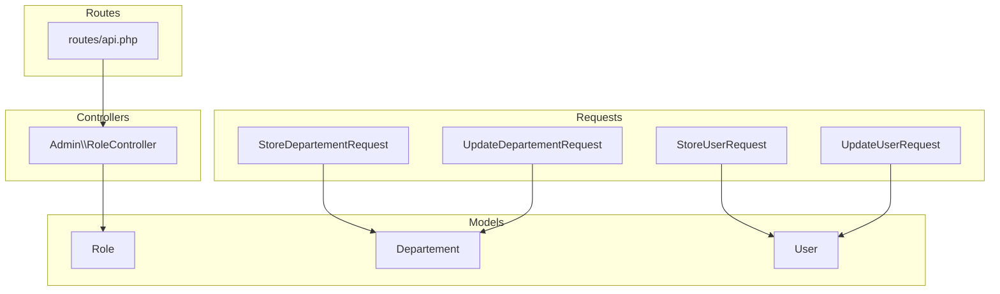
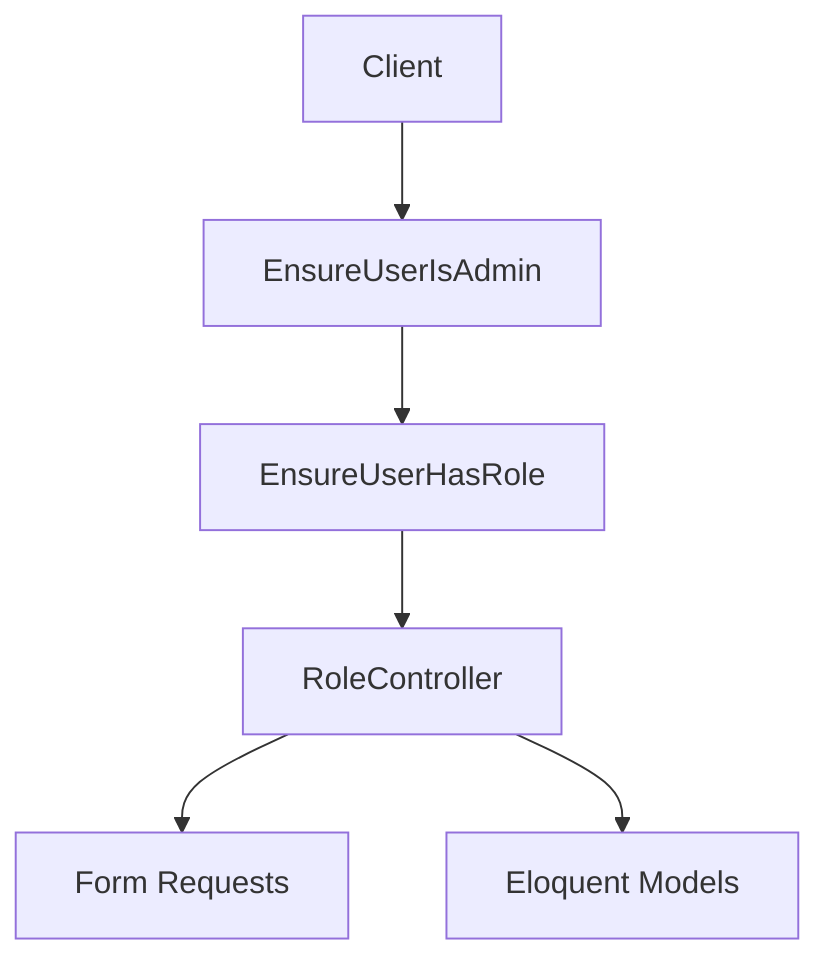
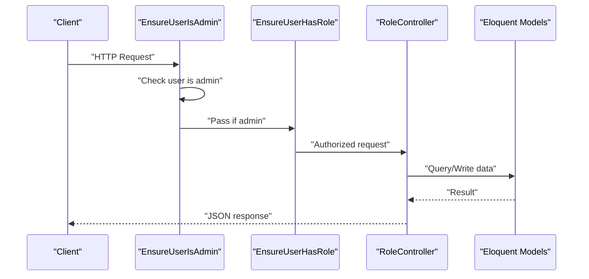
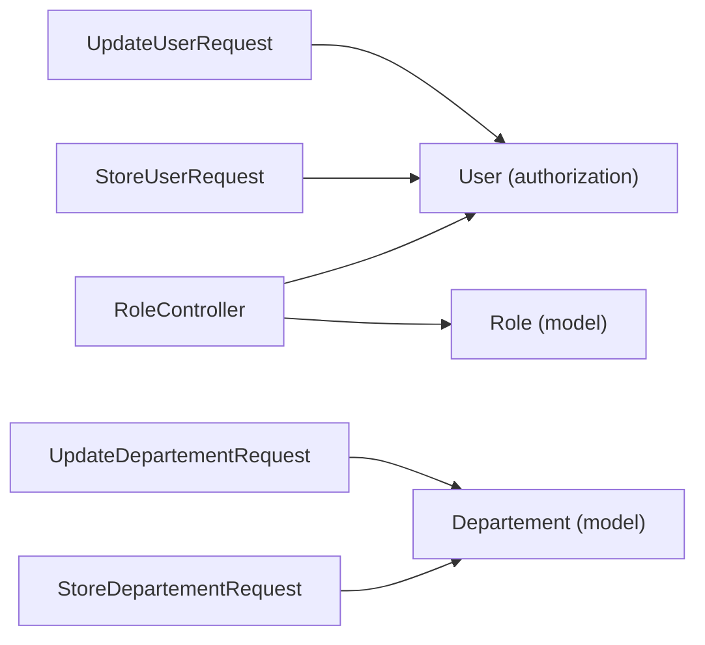

# API Documentation

<cite>
**Referenced Files in This Document**
- [routes/api.php](file://routes/api.php)
- [docs/openapi-analytics.yaml](file://docs/openapi-analytics.yaml)
- [docs/openapi-departments.yaml](file://docs/openapi-departments.yaml)
- [docs/openapi-roles.yaml](file://docs/openapi-roles.yaml)
- [docs/openapi-users.yaml](file://docs/openapi-users.yaml)
- [app/Http/Controllers/Admin/RoleController.php](file://app/Http/Controllers/Admin/RoleController.php)
- [app/Http/Middleware/EnsureUserHasRole.php](file://app/Http/Middleware/EnsureUserHasRole.php)
- [app/Http/Middleware/EnsureUserIsAdmin.php](file://app/Http/Middleware/EnsureUserIsAdmin.php)
- [app/Http/Requests/StoreDepartementRequest.php](file://app/Http/Requests/StoreDepartementRequest.php)
- [app/Http/Requests/UpdateDepartementRequest.php](file://app/Http/Requests/UpdateDepartementRequest.php)
- [app/Http/Requests/StoreUserRequest.php](file://app/Http/Requests/StoreUserRequest.php)
- [app/Http/Requests/UpdateUserRequest.php](file://app/Http/Requests/UpdateUserRequest.php)
- [app/Models/Role.php](file://app/Models/Role.php)
- [app/Models/Departement.php](file://app/Models/Departement.php)
- [app/Models/User.php](file://app/Models/User.php)
</cite>

## Table of Contents
1. [Introduction](#introduction)
2. [Project Structure](#project-structure)
3. [Core Components](#core-components)
4. [Architecture Overview](#architecture-overview)
5. [Detailed Component Analysis](#detailed-component-analysis)
6. [Dependency Analysis](#dependency-analysis)
7. [Performance Considerations](#performance-considerations)
8. [Troubleshooting Guide](#troubleshooting-guide)
9. [Conclusion](#conclusion)
10. [Appendices](#appendices)

## Introduction
This document provides comprehensive API documentation for the assessment platform’s REST endpoints. It covers HTTP methods, URL patterns, request/response schemas, authentication requirements, validation rules, error responses, and practical usage examples. It also includes OpenAPI specifications for analytics, departments, roles, and users, along with integration patterns, rate limiting considerations, security recommendations, and API versioning guidance.

## Project Structure
The API surface is primarily defined via Laravel routes and controllers, with request validation handled by form requests and model definitions. OpenAPI specifications are provided under the docs directory for analytics, departments, roles, and users.

**Diagram sources**
- [routes/api.php:1-14](file://routes/api.php#L1-L14)
- [app/Http/Controllers/Admin/RoleController.php:12-130](file://app/Http/Controllers/Admin/RoleController.php#L12-L130)
- [app/Http/Requests/StoreDepartementRequest.php:8-36](file://app/Http/Requests/StoreDepartementRequest.php#L8-L36)
- [app/Http/Requests/UpdateDepartementRequest.php:8-38](file://app/Http/Requests/UpdateDepartementRequest.php#L8-L38)
- [app/Http/Requests/StoreUserRequest.php:9-55](file://app/Http/Requests/StoreUserRequest.php#L9-L55)
- [app/Http/Requests/UpdateUserRequest.php:9-50](file://app/Http/Requests/UpdateUserRequest.php#L9-L50)
- [app/Models/Role.php:9-31](file://app/Models/Role.php#L9-L31)
- [app/Models/Departement.php:9-34](file://app/Models/Departement.php#L9-L34)
- [app/Models/User.php:12-94](file://app/Models/User.php#L12-L94)

**Section sources**
- [routes/api.php:1-14](file://routes/api.php#L1-L14)
- [docs/openapi-roles.yaml:1-70](file://docs/openapi-roles.yaml#L1-L70)
- [docs/openapi-departments.yaml:1-117](file://docs/openapi-departments.yaml#L1-L117)
- [docs/openapi-users.yaml:1-129](file://docs/openapi-users.yaml#L1-L129)
- [docs/openapi-analytics.yaml:1-50](file://docs/openapi-analytics.yaml#L1-L50)

## Core Components
- Authentication and Authorization
  - Authentication: Session-based via cookie named laravel_session.
  - Authorization: Admin-only endpoints gated by middleware ensuring the user has administrative privileges.
- Request Validation
  - Form requests enforce strict validation rules for creation and updates.
- Data Models
  - Role, Departement, and User models define attributes and relationships used by controllers and requests.

Key implementation references:
- Authentication and authorization middleware and controller checks are enforced in controllers and middleware.
- Validation rules are centralized in form request classes.

**Section sources**
- [app/Http/Middleware/EnsureUserIsAdmin.php:10-23](file://app/Http/Middleware/EnsureUserIsAdmin.php#L10-L23)
- [app/Http/Middleware/EnsureUserHasRole.php:9-28](file://app/Http/Middleware/EnsureUserHasRole.php#L9-L28)
- [app/Http/Controllers/Admin/RoleController.php:125-129](file://app/Http/Controllers/Admin/RoleController.php#L125-L129)
- [app/Http/Requests/StoreDepartementRequest.php:10-36](file://app/Http/Requests/StoreDepartementRequest.php#L10-L36)
- [app/Http/Requests/UpdateDepartementRequest.php:10-38](file://app/Http/Requests/UpdateDepartementRequest.php#L10-L38)
- [app/Http/Requests/StoreUserRequest.php:11-55](file://app/Http/Requests/StoreUserRequest.php#L11-L55)
- [app/Http/Requests/UpdateUserRequest.php:11-50](file://app/Http/Requests/UpdateUserRequest.php#L11-L50)

## Architecture Overview
The API follows a layered architecture:
- Routes define endpoint groups and apply middleware for authentication and role gating.
- Controllers orchestrate requests, enforce authorization, and delegate validation to form requests.
- Models encapsulate persistence and relationships.
- OpenAPI specs describe contract-first API definitions.

**Diagram sources**
- [routes/api.php:6-13](file://routes/api.php#L6-L13)
- [app/Http/Middleware/EnsureUserIsAdmin.php:10-23](file://app/Http/Middleware/EnsureUserIsAdmin.php#L10-L23)
- [app/Http/Middleware/EnsureUserHasRole.php:9-28](file://app/Http/Middleware/EnsureUserHasRole.php#L9-L28)
- [app/Http/Controllers/Admin/RoleController.php:12-130](file://app/Http/Controllers/Admin/RoleController.php#L12-L130)
- [app/Http/Requests/StoreDepartementRequest.php:8-36](file://app/Http/Requests/StoreDepartementRequest.php#L8-L36)
- [app/Http/Requests/UpdateDepartementRequest.php:8-38](file://app/Http/Requests/UpdateDepartementRequest.php#L8-L38)
- [app/Models/Role.php:9-31](file://app/Models/Role.php#L9-L31)
- [app/Models/Departement.php:9-34](file://app/Models/Departement.php#L9-L34)
- [app/Models/User.php:12-94](file://app/Models/User.php#L12-L94)

## Detailed Component Analysis

### Roles API
Endpoints
- GET /api/roles
  - Purpose: List roles with optional search, sorting, and pagination.
  - Authentication: Cookie-based session required.
  - Query parameters:
    - search: string
    - sort_by: one of id, name, prosentase, is_active, created_at
    - sort_direction: asc or desc
    - per_page: integer between 5 and 100
  - Responses:
    - 200 OK: Paginated collection of roles.
- POST /api/roles
  - Purpose: Create a new role.
  - Authentication: Cookie-based session required.
  - Request body (JSON):
    - name: string, max 50, unique
    - description: string, nullable, max 2000
    - prosentase: number, float, 0–100
    - is_active: boolean
  - Responses:
    - 201 Created: Role created.
    - 422 Unprocessable Entity: Validation error.
- PUT /api/roles/{id}
  - Purpose: Update an existing role.
  - Authentication: Cookie-based session required.
  - Path parameter: id (integer)
  - Request body (JSON): Same as create.
  - Responses:
    - 200 OK: Role updated.
    - 422 Unprocessable Entity: Validation error.
- DELETE /api/roles/{id}
  - Purpose: Delete a role if not used by any user.
  - Authentication: Cookie-based session required.
  - Path parameter: id (integer)
  - Responses:
    - 200 OK: Role deleted.
    - 422 Unprocessable Entity: Cannot delete if still used by users.

Validation rules and behavior
- Unique name constraint enforced at the database level.
- Numeric percentage constrained to 0–100.
- Boolean flags validated and cast appropriately.
- Controller enforces admin-only access and JSON vs HTML responses based on Accept/Content-Type expectations.

OpenAPI specification
- See [openapi-roles.yaml:1-70](file://docs/openapi-roles.yaml#L1-L70).

Example usage
- Retrieve roles with pagination and filtering:
  - GET /api/roles?per_page=10&sort_by=name&sort_direction=asc
- Create a role:
  - POST /api/roles with JSON payload containing name, description, prosentase, is_active
- Update a role:
  - PUT /api/roles/{id} with JSON payload
- Delete a role:
  - DELETE /api/roles/{id}

Security and error handling
- Unauthorized access returns 401; insufficient permissions return 403.
- Validation failures return 422 with validation messages.
- Business rule violations (e.g., deleting a role in use) return 422.

**Section sources**
- [routes/api.php:8-13](file://routes/api.php#L8-L13)
- [docs/openapi-roles.yaml:9-59](file://docs/openapi-roles.yaml#L9-L59)
- [app/Http/Controllers/Admin/RoleController.php:14-105](file://app/Http/Controllers/Admin/RoleController.php#L14-L105)
- [app/Http/Requests/StoreUserRequest.php:27-42](file://app/Http/Requests/StoreUserRequest.php#L27-L42)
- [app/Models/Role.php:13-29](file://app/Models/Role.php#L13-L29)

### Departments API
Endpoints
- GET /admin/departments/data
  - Purpose: List departments with search, pagination, and sorting.
  - Authentication: Cookie-based session required.
  - Query parameters:
    - search: string
    - sort_by: one of id, name, urut, created_at
    - sort_direction: asc or desc
    - per_page: integer between 5 and 50
  - Responses:
    - 200 OK: Paginated collection of departments.
- POST /admin/departments
  - Purpose: Create a new department.
  - Authentication: Cookie-based session required.
  - Request body (JSON):
    - name: string, max 100
    - urut: integer, min 0
    - description: string, nullable, max 2000
  - Responses:
    - 201 Created
    - 422 Unprocessable Entity: Validation error.
- GET /admin/departments/{id}
  - Purpose: Show a department.
  - Authentication: Cookie-based session required.
  - Path parameter: id (integer)
  - Responses:
    - 200 OK
- PATCH /admin/departments/{id}
  - Purpose: Update a department.
  - Authentication: Cookie-based session required.
  - Path parameter: id (integer)
  - Request body (JSON): Same as create.
  - Responses:
    - 200 OK
    - 422 Unprocessable Entity: Validation error.
- DELETE /admin/departments/{id}
  - Purpose: Delete a department if not referenced by users or answers.
  - Authentication: Cookie-based session required.
  - Path parameter: id (integer)
  - Responses:
    - 200 OK
    - 422 Unprocessable Entity: Still used by users.

Validation rules and behavior
- Name uniqueness enforced at the database level.
- Ordering field constrained to non-negative integers.
- Description is optional and trimmed during preparation.
- Controller enforces admin-only access and JSON vs HTML responses.

OpenAPI specification
- See [openapi-departments.yaml:1-117](file://docs/openapi-departments.yaml#L1-L117).

Example usage
- List departments with pagination:
  - GET /admin/departments/data?per_page=20&sort_by=urut&sort_direction=asc
- Create a department:
  - POST /admin/departments with JSON payload
- Update a department:
  - PATCH /admin/departments/{id} with JSON payload
- Delete a department:
  - DELETE /admin/departments/{id}

Security and error handling
- Unauthorized access returns 401; insufficient permissions return 403.
- Validation failures return 422 with validation messages.
- Business rule violations (e.g., deletion in use) return 422.

**Section sources**
- [docs/openapi-departments.yaml:9-94](file://docs/openapi-departments.yaml#L9-L94)
- [app/Http/Requests/StoreDepartementRequest.php:18-36](file://app/Http/Requests/StoreDepartementRequest.php#L18-L36)
- [app/Http/Requests/UpdateDepartementRequest.php:18-38](file://app/Http/Requests/UpdateDepartementRequest.php#L18-L38)
- [app/Models/Departement.php:13-32](file://app/Models/Departement.php#L13-L32)

### Users API
Endpoints
- GET /admin/users/data
  - Purpose: List users with search, filters, and pagination.
  - Authentication: Cookie-based session required.
  - Query parameters:
    - search: string
    - role_id: integer
    - department_id: integer
    - status: enum active or inactive
    - per_page: integer between 5 and 50
  - Responses:
    - 200 OK: Paginated collection of users.
- POST /admin/users
  - Purpose: Create a new user.
  - Authentication: Cookie-based session required.
  - Request body (JSON):
    - name: string
    - email: string (valid email)
    - phone_number: string, nullable
    - password: string, min 8
    - role_id: integer, exists in roles
    - department_id: integer, nullable, exists in departments
    - is_active: boolean
  - Responses:
    - 201 Created
    - 422 Unprocessable Entity: Validation error.
- GET /admin/users/{id}
  - Purpose: Show a user.
  - Authentication: Cookie-based session required.
  - Path parameter: id (integer)
  - Responses:
    - 200 OK
- PATCH /admin/users/{id}
  - Purpose: Update a user.
  - Authentication: Cookie-based session required.
  - Path parameter: id (integer)
  - Request body (JSON):
    - name: string
    - email: string (unique except for current user)
    - phone_number: string, nullable
    - password: string, nullable
    - role_id: integer, exists in roles
    - department_id: integer, nullable, exists in departments
    - is_active: boolean
  - Responses:
    - 200 OK
    - 422 Unprocessable Entity: Validation error.
- DELETE /admin/users/{id}
  - Purpose: Soft delete a user.
  - Authentication: Cookie-based session required.
  - Path parameter: id (integer)
  - Responses:
    - 200 OK
    - 422 Unprocessable Entity: Business rule error.

Validation rules and behavior
- Email uniqueness enforced at the database level.
- Password length constraints applied.
- Phone number accepts digits and common formatting characters.
- Role and department existence validated via foreign key constraints.
- Controller enforces admin-only access and JSON vs HTML responses.

OpenAPI specification
- See [openapi-users.yaml:1-129](file://docs/openapi-users.yaml#L1-L129).

Example usage
- List users with filters:
  - GET /admin/users/data?role_id=2&status=active&per_page=15
- Create a user:
  - POST /admin/users with JSON payload
- Update a user:
  - PATCH /admin/users/{id} with JSON payload
- Delete a user:
  - DELETE /admin/users/{id}

Security and error handling
- Unauthorized access returns 401; insufficient permissions return 403.
- Validation failures return 422 with validation messages.
- Business rule violations return 422.

**Section sources**
- [docs/openapi-users.yaml:9-100](file://docs/openapi-users.yaml#L9-L100)
- [app/Http/Requests/StoreUserRequest.php:19-55](file://app/Http/Requests/StoreUserRequest.php#L19-L55)
- [app/Http/Requests/UpdateUserRequest.php:19-50](file://app/Http/Requests/UpdateUserRequest.php#L19-L50)
- [app/Models/User.php:16-37](file://app/Models/User.php#L16-L37)

### Analytics API
Endpoints
- GET /admin/analytics
  - Purpose: Render department analytics page.
  - Authentication: Cookie-based session required.
  - Responses:
    - 200 OK: HTML page.
- GET /admin/exports/department-analytics/excel
  - Purpose: Export department analytics to Excel.
  - Authentication: Cookie-based session required.
  - Query parameters:
    - date_from: string (date)
    - date_to: string (date)
    - department_id: integer
  - Responses:
    - 200 OK: Excel file.
- GET /admin/exports/department-analytics/pdf
  - Purpose: Export department analytics to printable HTML/PDF.
  - Authentication: Cookie-based session required.
  - Query parameters:
    - date_from: string (date)
    - date_to: string (date)
    - department_id: integer
  - Responses:
    - 200 OK: HTML printable response.

OpenAPI specification
- See [openapi-analytics.yaml:1-50](file://docs/openapi-analytics.yaml#L1-L50).

Example usage
- Open analytics page:
  - GET /admin/analytics
- Export to Excel:
  - GET /admin/exports/department-analytics/excel?date_from=YYYY-MM-DD&date_to=YYYY-MM-DD&department_id=1
- Export to PDF:
  - GET /admin/exports/department-analytics/pdf?date_from=YYYY-MM-DD&date_to=YYYY-MM-DD&department_id=1

Security and error handling
- Unauthorized access returns 401; insufficient permissions return 403.
- Export endpoints return binary content; ensure clients handle appropriate content types.

**Section sources**
- [docs/openapi-analytics.yaml:9-50](file://docs/openapi-analytics.yaml#L9-L50)

### Authentication and Authorization
- Authentication
  - Session-based authentication using cookie laravel_session.
  - Cookies must be included with each request for protected endpoints.
- Authorization
  - Admin-only access enforced via EnsureUserIsAdmin middleware.
  - Additional role-based gating via EnsureUserHasRole middleware for specific routes.
  - Controllers also perform explicit authorization checks for role management actions.

**Diagram sources**
- [app/Http/Middleware/EnsureUserIsAdmin.php:12-21](file://app/Http/Middleware/EnsureUserIsAdmin.php#L12-L21)
- [app/Http/Middleware/EnsureUserHasRole.php:11-25](file://app/Http/Middleware/EnsureUserHasRole.php#L11-L25)
- [app/Http/Controllers/Admin/RoleController.php:16-128](file://app/Http/Controllers/Admin/RoleController.php#L16-L128)

**Section sources**
- [routes/api.php:6-13](file://routes/api.php#L6-L13)
- [app/Http/Middleware/EnsureUserIsAdmin.php:10-23](file://app/Http/Middleware/EnsureUserIsAdmin.php#L10-L23)
- [app/Http/Middleware/EnsureUserHasRole.php:9-28](file://app/Http/Middleware/EnsureUserHasRole.php#L9-L28)
- [app/Http/Controllers/Admin/RoleController.php:125-129](file://app/Http/Controllers/Admin/RoleController.php#L125-L129)

## Dependency Analysis
The following diagram shows dependencies among controllers, requests, and models for the roles and departments APIs.

**Diagram sources**
- [app/Http/Controllers/Admin/RoleController.php:6-12](file://app/Http/Controllers/Admin/RoleController.php#L6-L12)
- [app/Models/User.php:12-94](file://app/Models/User.php#L12-L94)
- [app/Models/Role.php:9-31](file://app/Models/Role.php#L9-L31)
- [app/Http/Requests/StoreDepartementRequest.php:8-36](file://app/Http/Requests/StoreDepartementRequest.php#L8-L36)
- [app/Http/Requests/UpdateDepartementRequest.php:8-38](file://app/Http/Requests/UpdateDepartementRequest.php#L8-L38)
- [app/Models/Departement.php:9-34](file://app/Models/Departement.php#L9-L34)
- [app/Http/Requests/StoreUserRequest.php:9-55](file://app/Http/Requests/StoreUserRequest.php#L9-L55)
- [app/Http/Requests/UpdateUserRequest.php:9-50](file://app/Http/Requests/UpdateUserRequest.php#L9-L50)

**Section sources**
- [app/Http/Controllers/Admin/RoleController.php:12-130](file://app/Http/Controllers/Admin/RoleController.php#L12-L130)
- [app/Http/Requests/StoreDepartementRequest.php:8-36](file://app/Http/Requests/StoreDepartementRequest.php#L8-L36)
- [app/Http/Requests/UpdateDepartementRequest.php:8-38](file://app/Http/Requests/UpdateDepartementRequest.php#L8-L38)
- [app/Http/Requests/StoreUserRequest.php:9-55](file://app/Http/Requests/StoreUserRequest.php#L9-L55)
- [app/Http/Requests/UpdateUserRequest.php:9-50](file://app/Http/Requests/UpdateUserRequest.php#L9-L50)
- [app/Models/Role.php:9-31](file://app/Models/Role.php#L9-L31)
- [app/Models/Departement.php:9-34](file://app/Models/Departement.php#L9-L34)
- [app/Models/User.php:12-94](file://app/Models/User.php#L12-L94)

## Performance Considerations
- Pagination limits
  - Roles: per_page defaults to 10; maximum is 100.
  - Departments/Users: per_page defaults to 10; maximum is 50.
- Sorting and filtering
  - Prefer indexed columns for sort_by and where applicable to reduce query cost.
- Validation overhead
  - Centralized in form requests; keep payloads minimal to reduce validation time.
- Caching
  - Consider caching frequently accessed lists (e.g., roles) behind a cache layer if needed.

[No sources needed since this section provides general guidance]

## Troubleshooting Guide
Common issues and resolutions
- 401 Unauthorized
  - Cause: Missing or invalid laravel_session cookie.
  - Resolution: Ensure cookies are sent with the request and session is active.
- 403 Forbidden
  - Cause: Insufficient permissions or not an administrator.
  - Resolution: Verify user role slugs and ensure admin access.
- 422 Unprocessable Entity
  - Roles: name must be unique; prosentase must be within 0–100; is_active must be boolean.
  - Departments: name must be unique; urut must be non-negative; description max length.
  - Users: email must be unique; password min length; role_id and department_id must exist.
- Soft deletes
  - Users soft delete; ensure clients handle tombstoned records appropriately.

**Section sources**
- [app/Http/Controllers/Admin/RoleController.php:90-104](file://app/Http/Controllers/Admin/RoleController.php#L90-L104)
- [app/Http/Requests/StoreDepartementRequest.php:20-25](file://app/Http/Requests/StoreDepartementRequest.php#L20-L25)
- [app/Http/Requests/UpdateDepartementRequest.php:22-26](file://app/Http/Requests/UpdateDepartementRequest.php#L22-L26)
- [app/Http/Requests/StoreUserRequest.php:33-41](file://app/Http/Requests/StoreUserRequest.php#L33-L41)
- [app/Http/Requests/UpdateUserRequest.php:23-36](file://app/Http/Requests/UpdateUserRequest.php#L23-L36)

## Conclusion
The assessment platform exposes a clear set of admin-focused REST endpoints secured by session-based authentication and role-based authorization. The OpenAPI specifications provide precise contracts for analytics, departments, roles, and users. Clients should adhere to validation rules, manage cookies properly, and implement robust error handling for 401/403/422 responses.

[No sources needed since this section summarizes without analyzing specific files]

## Appendices

### API Versioning
- Current OpenAPI specs indicate version 1.0.0.
- No explicit route versioning observed; consider prefixing routes with /api/v1 for future versions.

**Section sources**
- [docs/openapi-roles.yaml:1-5](file://docs/openapi-roles.yaml#L1-L5)
- [docs/openapi-departments.yaml:1-5](file://docs/openapi-departments.yaml#L1-L5)
- [docs/openapi-users.yaml:1-5](file://docs/openapi-users.yaml#L1-L5)
- [docs/openapi-analytics.yaml:1-5](file://docs/openapi-analytics.yaml#L1-L5)

### Rate Limiting
- No built-in rate limiting observed in the codebase.
- Recommendation: Introduce rate limiting at the application or reverse proxy layer (e.g., per IP per minute) to protect endpoints.

[No sources needed since this section provides general guidance]

### Security Considerations
- CSRF protection: Use same-site cookies and consider CSRF tokens for browser-based clients.
- Transport security: Enforce HTTPS in production.
- Input sanitization: Validation is strict; avoid echoing raw user input.
- Least privilege: Ensure only administrators access admin endpoints.

[No sources needed since this section provides general guidance]

### Client Implementation Guidelines
- Authentication
  - Persist and send the laravel_session cookie with every request.
- Pagination
  - Respect per_page limits and iterate using next page cursors or page numbers.
- Error handling
  - Parse 422 validation errors and present actionable messages to users.
- Export endpoints
  - Handle binary responses for Excel/PDF exports and save files securely.

[No sources needed since this section provides general guidance]