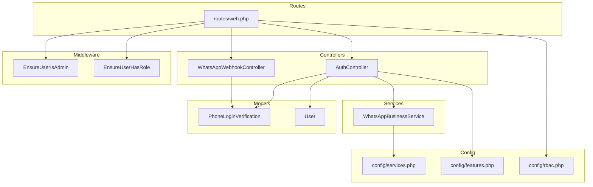
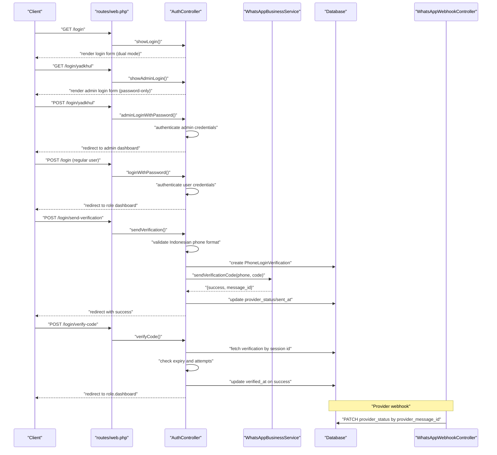
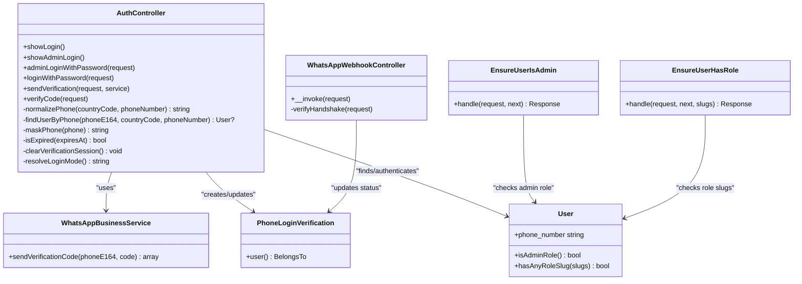

# Authentication API

<cite>
**Referenced Files in This Document**
- [routes/web.php](file://routes/web.php)
- [app/Http/Controllers/Auth/AuthController.php](file://app/Http/Controllers/Auth/AuthController.php)
- [app/Http/Controllers/Auth/WhatsAppWebhookController.php](file://app/Http/Controllers/Auth/WhatsAppWebhookController.php)
- [app/Services/WhatsAppBusinessService.php](file://app/Services/WhatsAppBusinessService.php)
- [app/Models/PhoneLoginVerification.php](file://app/Models/PhoneLoginVerification.php)
- [database/migrations/2026_04_17_045745_create_phone_login_verifications_table.php](file://database/migrations/2026_04_17_045745_create_phone_login_verifications_table.php)
- [config/services.php](file://config/services.php)
- [config/features.php](file://config/features.php)
- [config/rbac.php](file://config/rbac.php)
- [app/Models/User.php](file://app/Models/User.php)
- [database/migrations/2026_04_17_043615_add_phone_number_to_users_table.php](file://database/migrations/2026_04_17_043615_add_phone_number_to_users_table.php)
- [resources/views/auth/login.blade.php](file://resources/views/auth/login.blade.php)
- [app/Http/Middleware/EnsureUserIsAdmin.php](file://app/Http/Middleware/EnsureUserIsAdmin.php)
- [app/Http/Middleware/EnsureUserHasRole.php](file://app/Http/Middleware/EnsureUserHasRole.php)
</cite>

## Update Summary
**Changes Made**
- Added comprehensive admin authentication functionality with dedicated admin login interface
- Implemented password-only authentication for administrators via /login/yadkhul route
- Enhanced login form with conditional routing between admin and regular user flows
- Updated authentication endpoints to support dual authentication modes (password-based for admins, phone-based for users)
- Added admin-specific middleware and role-based access control
- Integrated admin dashboard routing with separate admin route prefix

## Table of Contents
1. [Introduction](#introduction)
2. [Project Structure](#project-structure)
3. [Core Components](#core-components)
4. [Architecture Overview](#architecture-overview)
5. [Detailed Component Analysis](#detailed-component-analysis)
6. [Dependency Analysis](#dependency-analysis)
7. [Performance Considerations](#performance-considerations)
8. [Troubleshooting Guide](#troubleshooting-guide)
9. [Conclusion](#conclusion)
10. [Appendices](#appendices)

## Introduction
This document describes the authentication system with dual authentication modes supporting both phone-based login verification and password-based admin authentication. The system provides separate login interfaces for administrators and regular users, with comprehensive role-based access control and WhatsApp webhook integration. The admin authentication uses a dedicated route (/login/yadkhul) with password-only authentication, while regular users can authenticate via email/password or phone-based verification depending on the configured login mode. The system covers HTTP endpoints, request/response considerations, authentication middleware, security controls, rate limiting, and integration patterns with the WhatsApp Business API.

## Project Structure
The authentication endpoints are defined in the web routes and handled by dedicated controllers. Supporting services and models encapsulate business logic and persistence. Admin-specific middleware and role-based access control provide granular permissions.

**Diagram sources**
- [routes/web.php:41-55](file://routes/web.php#L41-L55)
- [routes/web.php:76-151](file://routes/web.php#L76-L151)
- [app/Http/Controllers/Auth/AuthController.php:17](file://app/Http/Controllers/Auth/AuthController.php#L17)
- [app/Http/Controllers/Auth/WhatsAppWebhookController.php:11](file://app/Http/Controllers/Auth/WhatsAppWebhookController.php#L11)
- [app/Services/WhatsAppBusinessService.php:8](file://app/Services/WhatsAppBusinessService.php#L8)
- [app/Models/PhoneLoginVerification.php:8](file://app/Models/PhoneLoginVerification.php#L8)
- [config/services.php:38-51](file://config/services.php#L38-L51)
- [config/features.php:4-6](file://config/features.php#L4-L6)
- [config/rbac.php:31-36](file://config/rbac.php#L31-L36)
- [app/Http/Middleware/EnsureUserIsAdmin.php:10](file://app/Http/Middleware/EnsureUserIsAdmin.php#L10)
- [app/Http/Middleware/EnsureUserHasRole.php:9](file://app/Http/Middleware/EnsureUserHasRole.php#L9)

**Section sources**
- [routes/web.php:41-55](file://routes/web.php#L41-L55)
- [routes/web.php:76-151](file://routes/web.php#L76-L151)
- [app/Http/Controllers/Auth/AuthController.php:17](file://app/Http/Controllers/Auth/AuthController.php#L17)
- [app/Http/Controllers/Auth/WhatsAppWebhookController.php:11](file://app/Http/Controllers/Auth/WhatsAppWebhookController.php#L11)
- [app/Services/WhatsAppBusinessService.php:8](file://app/Services/WhatsAppBusinessService.php#L8)
- [app/Models/PhoneLoginVerification.php:8](file://app/Models/PhoneLoginVerification.php#L8)
- [config/services.php:38-51](file://config/services.php#L38-L51)
- [config/features.php:4-6](file://config/features.php#L4-L6)
- [config/rbac.php:31-36](file://config/rbac.php#L31-L36)
- [app/Http/Middleware/EnsureUserIsAdmin.php:10](file://app/Http/Middleware/EnsureUserIsAdmin.php#L10)
- [app/Http/Middleware/EnsureUserHasRole.php:9](file://app/Http/Middleware/EnsureUserHasRole.php#L9)

## Core Components
- Dual authentication modes:
  - Password-based authentication for administrators (/login/yadkhul)
  - Email/password or phone-based authentication for regular users
- Phone-based login endpoints:
  - Send verification code
  - Verify code
- WhatsApp webhook endpoint for delivery status updates
- Admin-specific middleware for role-based access control
- Supporting model for phone login verification records
- WhatsApp Business service abstraction for sending messages
- Configuration for service endpoints, tokens, templates, and webhook verification
- Feature flag for login mode selection (password, whatsapp, or both)
- RBAC middleware aliases for role-aware routing

Key responsibilities:
- Validate Indonesian phone numbers with fixed '+62' country code format for phone-based users
- Normalize phone numbers to E164 format (+62XXXXXXXXXX)
- Create verification records with expiry and attempt limits for phone-based users
- Send OTP via WhatsApp Business or compatible provider
- Persist provider message ID and status
- Update status upon webhook reception
- Authenticate admin users with password-only credentials
- Authenticate regular users via email/password or phone verification
- Update status upon webhook reception
- Authenticate user on successful verification
- Enforce admin role restrictions using dedicated middleware

**Section sources**
- [routes/web.php:43-49](file://routes/web.php#L43-L49)
- [routes/web.php:50-55](file://routes/web.php#L50-L55)
- [routes/web.php:76-151](file://routes/web.php#L76-L151)
- [app/Http/Controllers/Auth/AuthController.php:32-60](file://app/Http/Controllers/Auth/AuthController.php#L32-L60)
- [app/Http/Controllers/Auth/AuthController.php:85-231](file://app/Http/Controllers/Auth/AuthController.php#L85-L231)
- [app/Http/Controllers/Auth/WhatsAppWebhookController.php:13-40](file://app/Http/Controllers/Auth/WhatsAppWebhookController.php#L13-L40)
- [app/Services/WhatsAppBusinessService.php:13-97](file://app/Services/WhatsAppBusinessService.php#L13-L97)
- [app/Models/PhoneLoginVerification.php:8-35](file://app/Models/PhoneLoginVerification.php#L8-L35)
- [database/migrations/2026_04_17_045745_create_phone_login_verifications_table.php:14-29](file://database/migrations/2026_04_17_045745_create_phone_login_verifications_table.php#L14-L29)
- [config/services.php:38-51](file://config/services.php#L38-L51)
- [config/features.php:4-6](file://config/features.php#L4-L6)
- [config/rbac.php:31-36](file://config/rbac.php#L31-L36)
- [app/Http/Middleware/EnsureUserIsAdmin.php:10-22](file://app/Http/Middleware/EnsureUserIsAdmin.php#L10-L22)
- [app/Http/Middleware/EnsureUserHasRole.php:9-26](file://app/Http/Middleware/EnsureUserHasRole.php#L9-L26)

## Architecture Overview
High-level flow:
- Client accesses login page with dual authentication options
- Admin users use password-only login at /login/yadkhul
- Regular users can choose between email/password or phone-based verification
- Phone-based users validate Indonesian phone number format, create verification record, and send OTP via WhatsApp
- Client receives code and submits for verification
- On success, backend authenticates user and redirects to role-specific dashboard
- Admin users are redirected to admin dashboard with proper role-based access
- Provider sends delivery status updates via webhook; backend updates verification record

**Diagram sources**
- [routes/web.php:41-55](file://routes/web.php#L41-L55)
- [routes/web.php:43-49](file://routes/web.php#L43-L49)
- [app/Http/Controllers/Auth/AuthController.php:19-41](file://app/Http/Controllers/Auth/AuthController.php#L19-L41)
- [app/Http/Controllers/Auth/AuthController.php:43-60](file://app/Http/Controllers/Auth/AuthController.php#L43-L60)
- [app/Http/Controllers/Auth/AuthController.php:85-231](file://app/Http/Controllers/Auth/AuthController.php#L85-L231)
- [app/Services/WhatsAppBusinessService.php:13-97](file://app/Services/WhatsAppBusinessService.php#L13-L97)
- [app/Http/Controllers/Auth/WhatsAppWebhookController.php:13-40](file://app/Http/Controllers/Auth/WhatsAppWebhookController.php#L13-L40)
- [app/Models/PhoneLoginVerification.php:31-34](file://app/Models/PhoneLoginVerification.php#L31-L34)

## Detailed Component Analysis

### Authentication Endpoints

#### Endpoint: Show Login Form
- Method: GET
- URL: /login
- Purpose: Render login form with dual authentication mode detection
- Authentication: guest middleware (not authenticated yet)
- Request body: none
- Response: HTML login form with conditional authentication options
- Behavior:
  - Detects login mode from configuration (password, whatsapp, or both)
  - Determines which authentication methods to display
  - Sets session variables for verification state
  - Renders form with password login option when enabled
  - Renders form with phone verification option when enabled

Security and validation:
- No validation required for GET request
- Conditional rendering based on login mode configuration
- Session-based verification state management

**Section sources**
- [routes/web.php:42](file://routes/web.php#L42)
- [routes/web.php:41-52](file://routes/web.php#L41-L52)
- [app/Http/Controllers/Auth/AuthController.php:19-30](file://app/Http/Controllers/Auth/AuthController.php#L19-L30)
- [app/Http/Controllers/Auth/AuthController.php:278-283](file://app/Http/Controllers/Auth/AuthController.php#L278-L283)

#### Endpoint: Show Admin Login Form
- Method: GET
- URL: /login/yadkhul
- Purpose: Render dedicated admin login form with password-only authentication
- Authentication: guest middleware (not authenticated yet)
- Request body: none
- Response: HTML admin login form
- Behavior:
  - Forces password-only login mode for administrators
  - Disables phone verification option
  - Sets admin-specific session variables
  - Renders password login form with email and password fields

Security and validation:
- No validation required for GET request
- Password-only authentication enforced
- Dedicated admin route separation

**Section sources**
- [routes/web.php:43](file://routes/web.php#L43)
- [routes/web.php:41-52](file://routes/web.php#L41-L52)
- [app/Http/Controllers/Auth/AuthController.php:32-41](file://app/Http/Controllers/Auth/AuthController.php#L32-L41)

#### Endpoint: Admin Password Login
- Method: POST
- URL: /login/yadkhul
- Purpose: Authenticate administrator using email and password credentials
- Authentication: guest middleware
- Rate limit: throttle:20 per minute
- Request body (JSON):
  - email: string, required, valid email format
  - password: string, required, non-empty
  - remember: boolean, optional, defaults to false
- Response: Redirect with flash message
- Behavior:
  - Validates email and password credentials
  - Attempts authentication using Laravel's built-in Auth system
  - Regenerates session on successful login
  - Redirects to role.dashboard route
  - Returns error message on invalid credentials

Security and validation:
- Enforces email format validation
- Uses Laravel's secure password hashing
- Supports "remember me" functionality
- Rate limiting prevents brute force attacks

**Section sources**
- [routes/web.php:47-49](file://routes/web.php#L47-L49)
- [routes/web.php:41-52](file://routes/web.php#L41-L52)
- [app/Http/Controllers/Auth/AuthController.php:43-60](file://app/Http/Controllers/Auth/AuthController.php#L43-L60)

#### Endpoint: Regular User Password Login
- Method: POST
- URL: /login
- Purpose: Authenticate regular user using email and password credentials
- Authentication: guest middleware
- Rate limit: throttle:20 per minute
- Request body (JSON):
  - email: string, required, valid email format
  - password: string, required, non-empty
  - remember: boolean, optional, defaults to false
- Response: Redirect with flash message
- Behavior:
  - Validates login mode configuration allows password authentication
  - Validates email and password credentials
  - Attempts authentication using Laravel's built-in Auth system
  - Regenerates session on successful login
  - Redirects to role.dashboard route
  - Returns error message on invalid credentials or disabled mode

Security and validation:
- Enforces email format validation
- Uses Laravel's secure password hashing
- Supports "remember me" functionality
- Rate limiting prevents brute force attacks
- Mode validation prevents unauthorized access

**Section sources**
- [routes/web.php:44-46](file://routes/web.php#L44-L46)
- [routes/web.php:41-52](file://routes/web.php#L41-L52)
- [app/Http/Controllers/Auth/AuthController.php:62-83](file://app/Http/Controllers/Auth/AuthController.php#L62-L83)
- [app/Http/Controllers/Auth/AuthController.php:64-66](file://app/Http/Controllers/Auth/AuthController.php#L64-L66)

#### Endpoint: Send Verification Code
- Method: POST
- URL: /login/send-verification
- Purpose: Initiate phone-based login by validating Indonesian phone number format, creating a verification record, and sending an OTP via WhatsApp
- Authentication: guest middleware (not authenticated yet)
- Rate limit: throttle:10 per minute
- Request body (JSON):
  - phone_number: string, required, format "0[0-9]{6,14}" (Indonesian format starting with 0)
- Response: Redirect with flash message
- Behavior:
  - Validates login mode configuration allows phone verification
  - Validates Indonesian phone number format (must start with 0, 6-14 digits total)
  - Normalizes to E164 format (+62XXXXXXXXXX)
  - Finds user by multiple candidate formats
  - Creates verification record with expiry and attempt limits
  - Sends OTP via configured WhatsApp provider
  - Stores masked phone and identifiers in session for subsequent verification

Security and validation:
- **Updated**: Now enforces Indonesian-only phone number format with regex `/^0[0-9]{6,14}$/`
- **Updated**: Fixed country code '+62' is automatically applied
- **Updated**: Login mode validation prevents unauthorized phone verification access
- **Updated**: Simplified validation to ensure compliance with Indonesian telecommunications standards
- User lookup supports multiple formats to improve usability
- Verification expires after 5 minutes
- Maximum 3 attempts per verification session

**Section sources**
- [routes/web.php:50-52](file://routes/web.php#L50-L52)
- [routes/web.php:41-52](file://routes/web.php#L41-L52)
- [app/Http/Controllers/Auth/AuthController.php:85-159](file://app/Http/Controllers/Auth/AuthController.php#L85-L159)
- [app/Http/Controllers/Auth/AuthController.php:87-89](file://app/Http/Controllers/Auth/AuthController.php#L87-L89)
- [app/Http/Controllers/Auth/AuthController.php:91-95](file://app/Http/Controllers/Auth/AuthController.php#L91-L95)
- [app/Http/Controllers/Auth/AuthController.php:205-225](file://app/Http/Controllers/Auth/AuthController.php#L205-L225)
- [app/Models/PhoneLoginVerification.php:10-23](file://app/Models/PhoneLoginVerification.php#L10-L23)
- [database/migrations/2026_04_17_045745_create_phone_login_verifications_table.php:14-29](file://database/migrations/2026_04_17_045745_create_phone_login_verifications_table.php#L14-L29)

#### Endpoint: Verify Code
- Method: POST
- URL: /login/verify-code
- Purpose: Validate the 6-digit OTP against the stored hash, enforce expiry and attempt limits, and authenticate the user on success
- Authentication: guest middleware
- Rate limit: throttle:15 per minute
- Request body (JSON):
  - verification_code: string, required, exactly 6 digits
- Response: Redirect with flash message
- Behavior:
  - Validates login mode configuration allows phone verification
  - Loads verification from session-stored ID
  - Checks expiry and maximum attempts
  - Compares hashed code with submitted value
  - Increments attempt count on failure
  - On success, sets verified timestamp, logs in the user, regenerates session, clears verification session, and redirects to role dashboard

Security and validation:
- Enforces 6-digit numeric code
- Tracks attempt counts and locks after threshold
- Enforces expiration window
- Clears sensitive session data on completion
- Login mode validation prevents unauthorized verification access

**Section sources**
- [routes/web.php:53-55](file://routes/web.php#L53-L55)
- [routes/web.php:41-52](file://routes/web.php#L41-L52)
- [app/Http/Controllers/Auth/AuthController.php:161-231](file://app/Http/Controllers/Auth/AuthController.php#L161-L231)
- [app/Http/Controllers/Auth/AuthController.php:163-165](file://app/Http/Controllers/Auth/AuthController.php#L163-L165)
- [app/Http/Controllers/Auth/AuthController.php:167-169](file://app/Http/Controllers/Auth/AuthController.php#L167-L169)
- [app/Models/PhoneLoginVerification.php:10-23](file://app/Models/PhoneLoginVerification.php#L10-L23)

#### Endpoint: WhatsApp Webhook
- Method: GET or POST
- URL: /webhooks/whatsapp
- Purpose: Handle provider delivery status updates and optional webhook verification handshake
- Authentication: none (public endpoint)
- GET verification:
  - Query parameters:
    - hub_mode: "subscribe"
    - hub_verify_token: configured token
    - hub_challenge: challenge string
  - Returns challenge on successful verification; otherwise 403
- POST delivery status:
  - Parses payload for status entries
  - Updates provider_status for each message ID found
  - Logs received events

Security and validation:
- Requires configured webhook verify token
- Updates provider_status for tracked messages
- Ignores empty message IDs

**Section sources**
- [routes/web.php:58-59](file://routes/web.php#L58-L59)
- [app/Http/Controllers/Auth/WhatsAppWebhookController.php:13-40](file://app/Http/Controllers/Auth/WhatsAppWebhookController.php#L13-L40)
- [app/Http/Controllers/Auth/WhatsAppWebhookController.php:42-53](file://app/Http/Controllers/Auth/WhatsAppWebhookController.php#L42-L53)
- [config/services.php:44-51](file://config/services.php#L44-L51)

### Admin Authentication System

#### Admin Login Interface
The admin authentication system provides a dedicated login interface accessible at /login/yadkhul with the following characteristics:

- Password-only authentication mode
- Dedicated admin login form rendering
- Forced password-only login regardless of global configuration
- Separate route from regular user login
- Admin-specific session variable management

**Section sources**
- [routes/web.php:43](file://routes/web.php#L43)
- [app/Http/Controllers/Auth/AuthController.php:32-41](file://app/Http/Controllers/Auth/AuthController.php#L32-L41)

#### Admin Role-Based Access Control
Admin users are managed through dedicated middleware and role definitions:

- Admin roles: super_admin, admin
- Middleware: EnsureUserIsAdmin for admin-only routes
- Route prefix: admin for all admin routes
- Dashboard redirection: /admin/dashboard for admin users

**Section sources**
- [config/rbac.php:4](file://config/rbac.php#L4)
- [config/rbac.php:37-40](file://config/rbac.php#L37-L40)
- [routes/web.php:76-78](file://routes/web.php#L76-L78)
- [app/Http/Middleware/EnsureUserIsAdmin.php:10-22](file://app/Http/Middleware/EnsureUserIsAdmin.php#L10-L22)

### Data Model: PhoneLoginVerification
Represents a single phone-based login attempt with associated metadata and provider status.

Fields:
- id: auto-increment integer
- user_id: foreign key to users
- country_code: string (fixed "+62" for Indonesian numbers)
- phone_e164: string (E164 format), indexed
- verification_code_hash: string (hashed OTP)
- attempt_count: tiny integer (default 0)
- max_attempts: tiny integer (default 3)
- expires_at: timestamp, indexed
- sent_at: nullable timestamp
- verified_at: nullable timestamp
- provider_message_id: nullable string, indexed
- provider_status: string (default "pending")
- last_error: nullable text
- timestamps: created_at, updated_at

Relationships:
- belongs to User

Indexes:
- phone_e164
- provider_message_id
- expires_at

**Section sources**
- [app/Models/PhoneLoginVerification.php:8-35](file://app/Models/PhoneLoginVerification.php#L8-L35)
- [database/migrations/2026_04_17_045745_create_phone_login_verifications_table.php:14-29](file://database/migrations/2026_04_17_045745_create_phone_login_verifications_table.php#L14-L29)

### Service: WhatsAppBusinessService
Encapsulates sending verification codes via WhatsApp Business or compatible providers.

Capabilities:
- Supports Meta WhatsApp Business Cloud API and Wablas
- Reads base URL, endpoint, access token, template, and enabled flags from configuration
- Sends templated message with OTP and expiry notice
- Handles provider-specific payload differences
- Returns structured result with success flag, message ID, and error message
- Logs failures and successes

Behavior:
- If service disabled or missing credentials, returns failure with message
- For Wablas: posts to base URL with Authorization header
- For Meta: posts to base_url/messages with Bearer token
- Extracts message ID from provider response
- Logs warnings and errors appropriately

**Section sources**
- [app/Services/WhatsAppBusinessService.php:8-99](file://app/Services/WhatsAppBusinessService.php#L8-L99)
- [config/services.php:38-51](file://config/services.php#L38-L51)

### Configuration
- Login mode:
  - Value: "password", "whatsapp", or "both"
  - Controls whether phone login or password login is enabled
  - Can be overridden per-user authentication method
- WhatsApp Business:
  - enabled: boolean flag
  - base_url: provider endpoint
  - messages_endpoint: API endpoint for sending messages
  - access_token: provider token
  - template: template name for OTP
  - webhook_verify_token: token for webhook verification
- Legacy WhatsApp fallback:
  - enabled, base_url, token for compatibility
- Admin configuration:
  - Admin slugs: super_admin, admin
  - Admin route prefix: admin
  - Admin middleware aliases: access.admin

**Section sources**
- [config/features.php:4-6](file://config/features.php#L4-L6)
- [config/services.php:44-51](file://config/services.php#L44-L51)
- [config/services.php:38-42](file://config/services.php#L38-L42)
- [config/rbac.php:4](file://config/rbac.php#L4)
- [config/rbac.php:37-40](file://config/rbac.php#L37-L40)

### Authentication Middleware and RBAC
- Guest middleware: restricts login endpoints to unauthenticated users
- Role redirect middleware: redirects to role-specific dashboard route
- Admin gate middleware: used for protected admin routes, requires admin role
- User role middleware: restricts access based on role slugs
- Throttles:
  - /login: throttle:20,1
  - /login/send-verification: throttle:10,1
  - /login/verify-code: throttle:15,1
  - Additional throttles exist for admin and evaluator routes

**Section sources**
- [routes/web.php:41-52](file://routes/web.php#L41-L52)
- [routes/web.php:72-147](file://routes/web.php#L72-L147)
- [config/rbac.php:31-36](file://config/rbac.php#L31-L36)
- [app/Http/Middleware/EnsureUserIsAdmin.php:10-22](file://app/Http/Middleware/EnsureUserIsAdmin.php#L10-L22)
- [app/Http/Middleware/EnsureUserHasRole.php:9-26](file://app/Http/Middleware/EnsureUserHasRole.php#L9-L26)

## Dependency Analysis

**Diagram sources**
- [app/Http/Controllers/Auth/AuthController.php:17](file://app/Http/Controllers/Auth/AuthController.php#L17)
- [app/Http/Controllers/Auth/WhatsAppWebhookController.php:11](file://app/Http/Controllers/Auth/WhatsAppWebhookController.php#L11)
- [app/Services/WhatsAppBusinessService.php:8](file://app/Services/WhatsAppBusinessService.php#L8)
- [app/Models/PhoneLoginVerification.php:31-34](file://app/Models/PhoneLoginVerification.php#L31-L34)
- [app/Models/User.php:12](file://app/Models/User.php#L12)
- [app/Http/Middleware/EnsureUserIsAdmin.php:10](file://app/Http/Middleware/EnsureUserIsAdmin.php#L10)
- [app/Http/Middleware/EnsureUserHasRole.php:9](file://app/Http/Middleware/EnsureUserHasRole.php#L9)

**Section sources**
- [app/Http/Controllers/Auth/AuthController.php:17](file://app/Http/Controllers/Auth/AuthController.php#L17)
- [app/Http/Controllers/Auth/WhatsAppWebhookController.php:11](file://app/Http/Controllers/Auth/WhatsAppWebhookController.php#L11)
- [app/Services/WhatsAppBusinessService.php:8](file://app/Services/WhatsAppBusinessService.php#L8)
- [app/Models/PhoneLoginVerification.php:31-34](file://app/Models/PhoneLoginVerification.php#L31-L34)
- [app/Http/Middleware/EnsureUserIsAdmin.php:10-22](file://app/Http/Middleware/EnsureUserIsAdmin.php#L10-L22)
- [app/Http/Middleware/EnsureUserHasRole.php:9-26](file://app/Http/Middleware/EnsureUserHasRole.php#L9-L26)

## Performance Considerations
- Throttling:
  - Use the provided throttles to prevent abuse on login endpoints
  - Consider additional rate limiting at the infrastructure level (load balancer, CDN)
  - Admin login throttling is separate from regular user login
- Database:
  - Indexes on phone_e164, provider_message_id, and expires_at support efficient lookups
  - Keep verification records small; consider pruning expired rows periodically
- Network:
  - Set timeouts for external provider calls
  - Monitor provider latency and error rates
- Caching:
  - Consider caching frequently accessed configuration values
- Logging:
  - Use structured logs for audit trails and incident response
- Admin performance:
  - Admin routes use dedicated middleware for better performance
  - Admin dashboard loads optimized components

## Troubleshooting Guide
Common issues and resolutions:
- Service not enabled or missing credentials:
  - Symptom: Failure to send OTP with a descriptive message
  - Resolution: Enable service and set base_url, access_token, template, and webhook_verify_token
- Invalid phone number format:
  - Symptom: Validation errors with message "Format nomor telepon tidak valid. Gunakan format 08xxxxxxxxxx."
  - Resolution: Ensure phone_number follows Indonesian format (starts with 0, 6-14 digits total)
- Expired code:
  - Symptom: Verification fails with expiry message
  - Resolution: Request a new code; codes expire after 5 minutes
- Attempt limit exceeded:
  - Symptom: Locked status after repeated wrong codes
  - Resolution: Wait for reset or request a new code
- Webhook not updating status:
  - Symptom: provider_status remains pending
  - Resolution: Verify webhook URL, token, and payload structure; ensure provider_message_id matches
- Session cleared unexpectedly:
  - Symptom: Verification session lost
  - Resolution: Ensure browser accepts session cookies and does not block redirects
- Admin login failing:
  - Symptom: Admin credentials rejected despite being correct
  - Resolution: Verify user has admin role (super_admin or admin); check admin middleware configuration
- Mixed authentication mode:
  - Symptom: Login form shows unexpected authentication options
  - Resolution: Check features.login_mode configuration; ensure proper mode selection
- Admin route access denied:
  - Symptom: 403 Access Denied when accessing admin routes
  - Resolution: Verify user has admin role; check EnsureUserIsAdmin middleware

**Section sources**
- [app/Services/WhatsAppBusinessService.php:28-35](file://app/Services/WhatsAppBusinessService.php#L28-L35)
- [app/Http/Controllers/Auth/AuthController.php:61-65](file://app/Http/Controllers/Auth/AuthController.php#L61-L65)
- [app/Http/Controllers/Auth/AuthController.php:87-89](file://app/Http/Controllers/Auth/AuthController.php#L87-L89)
- [app/Http/Controllers/Auth/AuthController.php:156-162](file://app/Http/Controllers/Auth/AuthController.php#L156-L162)
- [app/Http/Controllers/Auth/AuthController.php:164-170](file://app/Http/Controllers/Auth/AuthController.php#L164-L170)
- [app/Http/Controllers/Auth/WhatsAppWebhookController.php:22-32](file://app/Http/Controllers/Auth/WhatsAppWebhookController.php#L22-L32)
- [app/Http/Middleware/EnsureUserIsAdmin.php:16-18](file://app/Http/Middleware/EnsureUserIsAdmin.php#L16-L18)

## Conclusion
The authentication system provides a robust dual-mode authentication flow with comprehensive admin capabilities. The system supports both phone-based login verification for regular users and password-only authentication for administrators via a dedicated route (/login/yadkhul). The admin authentication system includes dedicated middleware, role-based access control, and separate admin routing with the 'admin' prefix. The system has been enhanced to support Indonesian phone numbers only, using a fixed '+62' country code format, while maintaining flexibility for different authentication modes through configuration. By leveraging validated Indonesian phone number inputs, strict expiry and attempt limits, configurable provider settings, and comprehensive role-based access control, it balances usability with security across both admin and regular user authentication flows.

## Appendices

### API Definition Summary
- Base URL: application root
- Authentication:
  - /login: guest (dual mode)
  - /login/yadkhul: guest (admin password-only)
  - /login/send-verification: guest
  - /login/verify-code: guest
  - /webhooks/whatsapp: public
- Rate limits:
  - /login: throttle:20,1
  - /login/yadkhul: throttle:20,1
  - /login/send-verification: throttle:10,1
  - /login/verify-code: throttle:15,1

**Section sources**
- [routes/web.php:41-55](file://routes/web.php#L41-L55)
- [routes/web.php:58-59](file://routes/web.php#L58-L59)

### Security Best Practices
- Enforce Indonesian phone number format validation (0XXXXXXXXXXX) for phone-based users
- Use HTTPS and secure cookies for all authentication endpoints
- Limit OTP lifetime and attempts for phone-based authentication
- Monitor and log all authentication events
- Regularly rotate provider tokens
- Restrict webhook URL exposure to trusted providers
- Implement admin-specific rate limiting and monitoring
- Use role-based access control for admin routes
- **Updated**: Implement fixed country code '+62' for Indonesian phone numbers only
- **Updated**: Separate admin authentication from regular user authentication
- **Updated**: Password-only admin authentication with dedicated route

### Indonesian Phone Number Format Requirements
- **Updated**: Must start with '0' followed by 6-14 digits (total length 7-15 characters)
- **Updated**: Automatically normalized to '+62' country code format
- **Updated**: Supports all Indonesian mobile network prefixes (081x, 082x, 083x, 085x, etc.)
- **Updated**: Validation ensures compliance with Indonesian telecommunications standards
- **Updated**: Simplified validation reduces complexity and improves security by eliminating international format support
- **Updated**: Phone-based authentication is separate from admin authentication

**Section sources**
- [app/Http/Controllers/Auth/AuthController.php:61-65](file://app/Http/Controllers/Auth/AuthController.php#L61-L65)
- [app/Http/Controllers/Auth/AuthController.php:87-89](file://app/Http/Controllers/Auth/AuthController.php#L87-L89)
- [app/Http/Controllers/Auth/AuthController.php:203-208](file://app/Http/Controllers/Auth/AuthController.php#L203-L208)
- [database/migrations/2026_04_17_043615_add_phone_number_to_users_table.php:14-16](file://database/migrations/2026_04_17_043615_add_phone_number_to_users_table.php#L14-L16)
- [resources/views/auth/login.blade.php:107-111](file://resources/views/auth/login.blade.php#L107-L111)

### Admin Authentication Configuration
- **Updated**: Admin login route: /login/yadkhul
- **Updated**: Admin-only password authentication
- **Updated**: Admin role slugs: super_admin, admin
- **Updated**: Admin route prefix: admin
- **Updated**: Admin middleware alias: access.admin
- **Updated**: Admin dashboard: /admin/dashboard
- **Updated**: Admin-specific session management

**Section sources**
- [routes/web.php:43-49](file://routes/web.php#L43-L49)
- [config/rbac.php:4](file://config/rbac.php#L4)
- [config/rbac.php:37-40](file://config/rbac.php#L37-L40)
- [app/Http/Middleware/EnsureUserIsAdmin.php:10-22](file://app/Http/Middleware/EnsureUserIsAdmin.php#L10-L22)