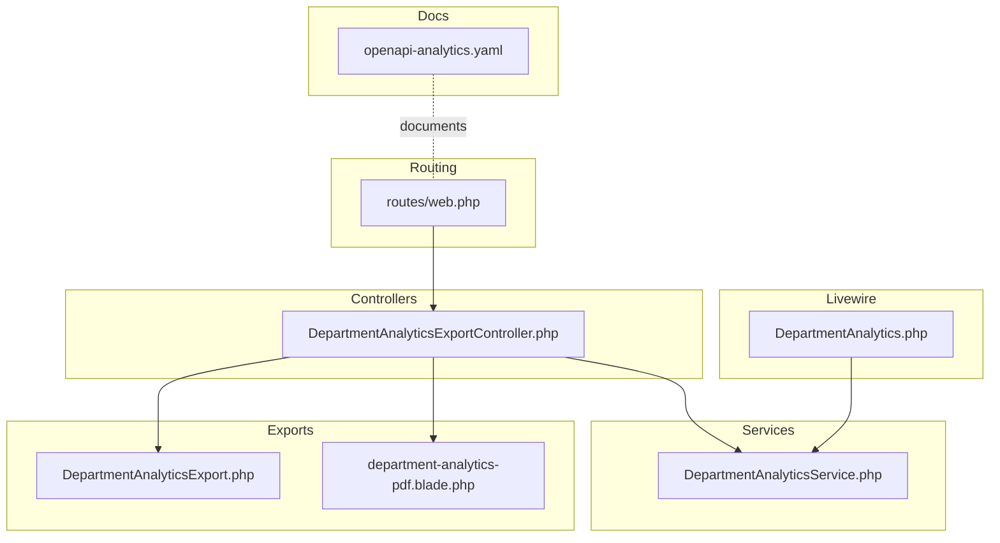
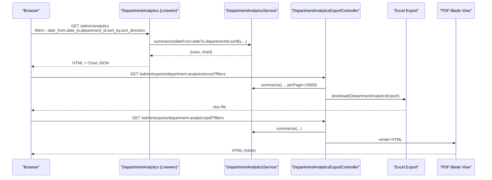
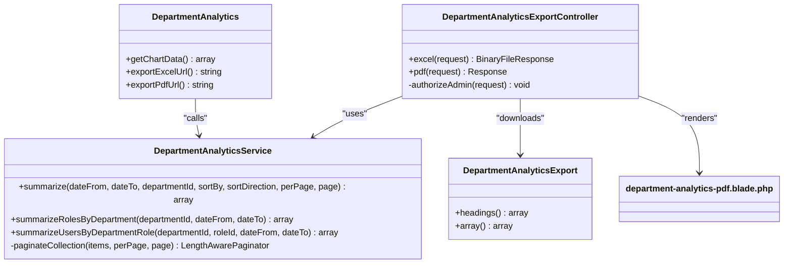

# Department Analytics API

<cite>
**Referenced Files in This Document**
- [DepartmentAnalyticsService.php](file://app/Services/DepartmentAnalyticsService.php)
- [DepartmentAnalyticsExport.php](file://app/Exports/DepartmentAnalyticsExport.php)
- [DepartmentAnalyticsExportController.php](file://app/Http/Controllers/Admin/DepartmentAnalyticsExportController.php)
- [DepartmentAnalytics.php](file://app/Livewire/Admin/DepartmentAnalytics.php)
- [web.php](file://routes/web.php)
- [openapi-analytics.yaml](file://docs/openapi-analytics.yaml)
- [department-analytics-pdf.blade.php](file://resources/views/admin/exports/department-analytics-pdf.blade.php)
- [EnsureUserIsAdmin.php](file://app/Http/Middleware/EnsureUserIsAdmin.php)
- [rbac.php](file://config/rbac.php)
</cite>

## Table of Contents
1. [Introduction](#introduction)
2. [Project Structure](#project-structure)
3. [Core Components](#core-components)
4. [Architecture Overview](#architecture-overview)
5. [Detailed Component Analysis](#detailed-component-analysis)
6. [Dependency Analysis](#dependency-analysis)
7. [Performance Considerations](#performance-considerations)
8. [Troubleshooting Guide](#troubleshooting-guide)
9. [Conclusion](#conclusion)
10. [Appendices](#appendices)

## Introduction
This document describes the Department Analytics API and reporting capabilities for retrieving department performance metrics, exporting analytics data, and visualizing analytical insights. It covers HTTP endpoints for exporting to CSV/Excel and printable HTML/PDF, request parameters for filtering by date range and department, response formats, and data aggregation patterns. It also includes examples of dashboard integrations, automated reporting workflows, and performance optimization techniques.

## Project Structure
The Department Analytics feature spans backend services, controllers, Livewire components, routing, and export templates:

- Backend service encapsulates analytics computations and caching.
- Controllers expose export endpoints for Excel and PDF.
- Livewire component powers the admin analytics dashboard and chart generation.
- Routing defines endpoint URLs and middleware protection.
- OpenAPI specification documents the export endpoints.
- Blade template renders printable PDF content.

**Diagram sources**
- [web.php:85-90](file://routes/web.php#L85-L90)
- [DepartmentAnalyticsExportController.php:13-62](file://app/Http/Controllers/Admin/DepartmentAnalyticsExportController.php#L13-L62)
- [DepartmentAnalyticsService.php:12-279](file://app/Services/DepartmentAnalyticsService.php#L12-L279)
- [DepartmentAnalytics.php:13-271](file://app/Livewire/Admin/DepartmentAnalytics.php#L13-L271)
- [DepartmentAnalyticsExport.php:9-51](file://app/Exports/DepartmentAnalyticsExport.php#L9-L51)
- [department-analytics-pdf.blade.php:1-45](file://resources/views/admin/exports/department-analytics-pdf.blade.php#L1-L45)
- [openapi-analytics.yaml:1-50](file://docs/openapi-analytics.yaml#L1-L50)

**Section sources**
- [web.php:72-90](file://routes/web.php#L72-L90)
- [openapi-analytics.yaml:1-50](file://docs/openapi-analytics.yaml#L1-L50)

## Core Components
- DepartmentAnalyticsService: Computes department-level summaries, role-level summaries, and user-level summaries with caching and pagination support.
- DepartmentAnalyticsExportController: Provides export endpoints for Excel and printable HTML/PDF.
- DepartmentAnalyticsExport: Implements array and headings contract for Excel export.
- DepartmentAnalytics (Livewire): Powers the admin analytics page, chart rendering, and export URL generation.
- RBAC and Middleware: Enforce admin-only access to analytics and export endpoints.

Key capabilities:
- Retrieve department performance metrics with optional date range and department filter.
- Export analytics to Excel and printable HTML/PDF.
- Paginated and sortable department lists with chart-ready data.
- Cached role and user analytics for improved performance.

**Section sources**
- [DepartmentAnalyticsService.php:20-95](file://app/Services/DepartmentAnalyticsService.php#L20-L95)
- [DepartmentAnalyticsService.php:109-189](file://app/Services/DepartmentAnalyticsService.php#L109-L189)
- [DepartmentAnalyticsService.php:199-256](file://app/Services/DepartmentAnalyticsService.php#L199-L256)
- [DepartmentAnalyticsExportController.php:15-56](file://app/Http/Controllers/Admin/DepartmentAnalyticsExportController.php#L15-L56)
- [DepartmentAnalyticsExport.php:29-49](file://app/Exports/DepartmentAnalyticsExport.php#L29-L49)
- [DepartmentAnalytics.php:181-220](file://app/Livewire/Admin/DepartmentAnalytics.php#L181-L220)

## Architecture Overview
The analytics pipeline integrates Livewire-driven dashboards with backend services and export controllers.

**Diagram sources**
- [DepartmentAnalytics.php:244-269](file://app/Livewire/Admin/DepartmentAnalytics.php#L244-L269)
- [DepartmentAnalyticsService.php:20-95](file://app/Services/DepartmentAnalyticsService.php#L20-L95)
- [DepartmentAnalyticsExportController.php:15-56](file://app/Http/Controllers/Admin/DepartmentAnalyticsExportController.php#L15-L56)
- [DepartmentAnalyticsExport.php:29-49](file://app/Exports/DepartmentAnalyticsExport.php#L29-L49)
- [department-analytics-pdf.blade.php:46-55](file://resources/views/admin/exports/department-analytics-pdf.blade.php#L46-L55)

## Detailed Component Analysis

### Department Analytics Service
Responsibilities:
- Build department-level summaries with employee counts, respondents, participation rates, and average scores.
- Aggregate role-level and user-level analytics with caching.
- Paginate collection results for efficient frontend rendering.
- Provide chart-ready arrays for labels and metrics.

Request parameters supported by summarize():
- date_from: string (date)
- date_to: string (date)
- department_id: integer
- sort_by: one of name, total_respondents, participation_rate, average_score, urut
- sort_direction: asc or desc
- per_page: integer
- page: integer

Response shape:
- rows: paginated collection with fields: id, name, urut, total_employees, total_respondents, average_score, participation_rate
- chart: object with labels[], average_scores[], participation_rates[]

Role-level summary:
- summarizeRolesByDepartment(department_id, date_from?, date_to?)
- Returns department_name and rows with role_id, role_name, total_respondents, participation_rate, average_score

User-level summary:
- summarizeUsersByDepartmentRole(department_id, role_id, date_from?, date_to?)
- Returns array of user_id, user_name, total_submissions, average_score

Caching:
- Role and user analytics are cached for 5 minutes keyed by filters.

**Section sources**
- [DepartmentAnalyticsService.php:20-95](file://app/Services/DepartmentAnalyticsService.php#L20-L95)
- [DepartmentAnalyticsService.php:109-189](file://app/Services/DepartmentAnalyticsService.php#L109-L189)
- [DepartmentAnalyticsService.php:199-256](file://app/Services/DepartmentAnalyticsService.php#L199-L256)
- [DepartmentAnalyticsService.php:261-277](file://app/Services/DepartmentAnalyticsService.php#L261-L277)

### Export Endpoints
Endpoints:
- GET /admin/exports/department-analytics/excel
- GET /admin/exports/department-analytics/pdf

Common query parameters:
- date_from: string (date)
- date_to: string (date)
- department_id: integer

Excel export:
- Returns a downloadable XLSX file containing department analytics.
- Uses DepartmentAnalyticsExport implementing array and headings contracts.

PDF export:
- Returns inline HTML suitable for printing.
- Renders a simple table with department name, total respondents, participation rate, and average score.

Authorization:
- Both endpoints require admin role via middleware.

**Section sources**
- [openapi-analytics.yaml:16-49](file://docs/openapi-analytics.yaml#L16-L49)
- [web.php:88-89](file://routes/web.php#L88-L89)
- [DepartmentAnalyticsExportController.php:15-56](file://app/Http/Controllers/Admin/DepartmentAnalyticsExportController.php#L15-L56)
- [DepartmentAnalyticsExport.php:29-49](file://app/Exports/DepartmentAnalyticsExport.php#L29-L49)
- [department-analytics-pdf.blade.php:17-42](file://resources/views/admin/exports/department-analytics-pdf.blade.php#L17-L42)

### Livewire Dashboard Integration
The DepartmentAnalytics Livewire component:
- Accepts date_from, date_to, department_id, sort_by, sort_direction, per_page, and page.
- Loads department summaries and chart data.
- Generates export URLs for Excel and PDF with current filters.
- Supports expanding role-level details and lazy-loading user-level details per role.

Chart data retrieval:
- getChartData() calls summarize() with urut sorting and returns chart arrays.

Error handling:
- Catches exceptions and sets user-friendly messages for analytics loading failures.

**Section sources**
- [DepartmentAnalytics.php:18-47](file://app/Livewire/Admin/DepartmentAnalytics.php#L18-L47)
- [DepartmentAnalytics.php:82-95](file://app/Livewire/Admin/DepartmentAnalytics.php#L82-L95)
- [DepartmentAnalytics.php:181-220](file://app/Livewire/Admin/DepartmentAnalytics.php#L181-L220)
- [DepartmentAnalytics.php:244-269](file://app/Livewire/Admin/DepartmentAnalytics.php#L244-L269)

### Authorization and RBAC
- Admin-only access enforced by EnsureUserIsAdmin middleware.
- RBAC configuration defines admin slugs and middleware aliases.
- Routes under the admin prefix apply admin gate middleware.

**Section sources**
- [EnsureUserIsAdmin.php:12-21](file://app/Http/Middleware/EnsureUserIsAdmin.php#L12-L21)
- [web.php:29-33](file://routes/web.php#L29-L33)
- [rbac.php:31-40](file://config/rbac.php#L31-L40)

## Dependency Analysis

**Diagram sources**
- [DepartmentAnalyticsService.php:12-279](file://app/Services/DepartmentAnalyticsService.php#L12-L279)
- [DepartmentAnalyticsExportController.php:13-62](file://app/Http/Controllers/Admin/DepartmentAnalyticsExportController.php#L13-L62)
- [DepartmentAnalyticsExport.php:9-51](file://app/Exports/DepartmentAnalyticsExport.php#L9-L51)
- [DepartmentAnalytics.php:13-271](file://app/Livewire/Admin/DepartmentAnalytics.php#L13-L271)

**Section sources**
- [DepartmentAnalyticsService.php:12-279](file://app/Services/DepartmentAnalyticsService.php#L12-L279)
- [DepartmentAnalyticsExportController.php:13-62](file://app/Http/Controllers/Admin/DepartmentAnalyticsExportController.php#L13-L62)
- [DepartmentAnalyticsExport.php:9-51](file://app/Exports/DepartmentAnalyticsExport.php#L9-L51)
- [DepartmentAnalytics.php:13-271](file://app/Livewire/Admin/DepartmentAnalytics.php#L13-L271)

## Performance Considerations
- Caching: Role and user analytics are cached for 5 minutes to reduce repeated heavy queries.
- Efficient aggregations: Subqueries compute employees, respondents, and average scores per department/role/user.
- Pagination: summarize() supports pagination to limit payload sizes.
- Sorting: Allowed sort fields are validated to prevent expensive or unsupported sorts.
- Export sizing: Excel export uses a large perPage value to capture all rows in a single sheet.

Recommendations:
- Add database indexes on frequently filtered columns (e.g., responses.submitted_at, answers.calculated_score).
- Consider pre-aggregating metrics in materialized views for very large datasets.
- Use server-side chart rendering libraries if client-side chart updates become heavy.

**Section sources**
- [DepartmentAnalyticsService.php:114-119](file://app/Services/DepartmentAnalyticsService.php#L114-L119)
- [DepartmentAnalyticsService.php:206-207](file://app/Services/DepartmentAnalyticsService.php#L206-L207)
- [DepartmentAnalyticsExportController.php:36-44](file://app/Http/Controllers/Admin/DepartmentAnalyticsExportController.php#L36-L44)

## Troubleshooting Guide
Common issues and resolutions:
- Access denied: Ensure the user has an admin role; otherwise, admin middleware will deny access.
- Empty analytics: Verify date filters and department_id; confirm that responses exist within the selected period.
- Export failures: Confirm query parameters are present and valid; check server logs for exceptions.
- Chart not updating: Trigger chart refresh after changing filters; ensure getChartData() is called with current filters.

**Section sources**
- [EnsureUserIsAdmin.php:16-18](file://app/Http/Middleware/EnsureUserIsAdmin.php#L16-L18)
- [DepartmentAnalytics.php:255-262](file://app/Livewire/Admin/DepartmentAnalytics.php#L255-L262)
- [DepartmentAnalyticsExportController.php:58-61](file://app/Http/Controllers/Admin/DepartmentAnalyticsExportController.php#L58-L61)

## Conclusion
The Department Analytics API provides robust department performance insights with flexible filtering, pagination, and export options. The service layer centralizes analytics computation and caching, while controllers and Livewire components deliver both interactive dashboards and automated export workflows. Adhering to the documented parameters and response formats enables seamless integration into dashboards and reporting systems.

## Appendices

### API Reference: Export Endpoints
- GET /admin/exports/department-analytics/excel
  - Query parameters: date_from (date), date_to (date), department_id (integer)
  - Response: Excel file (.xlsx)
- GET /admin/exports/department-analytics/pdf
  - Query parameters: date_from (date), date_to (date), department_id (integer)
  - Response: HTML (inline) suitable for printing

**Section sources**
- [openapi-analytics.yaml:16-49](file://docs/openapi-analytics.yaml#L16-L49)
- [web.php:88-89](file://routes/web.php#L88-L89)

### Request Parameters Summary
- date_from: string (date) — lower bound for response submission date
- date_to: string (date) — upper bound for response submission date
- department_id: integer — filter analytics to a specific department
- sort_by: string — allowed values: name, total_respondents, participation_rate, average_score, urut
- sort_direction: string — allowed values: asc, desc
- per_page: integer — items per page for pagination
- page: integer — current page number

**Section sources**
- [DepartmentAnalyticsService.php:20-28](file://app/Services/DepartmentAnalyticsService.php#L20-L28)
- [DepartmentAnalytics.php:82-95](file://app/Livewire/Admin/DepartmentAnalytics.php#L82-L95)

### Response Formats
- Department summary (list + chart):
  - rows: paginated list with id, name, urut, total_employees, total_respondents, average_score, participation_rate
  - chart: labels[], average_scores[], participation_rates[]
- Role summary:
  - department_name: string
  - rows: array of role_id, role_name, total_respondents, participation_rate, average_score
- User summary:
  - array of user_id, user_name, total_submissions, average_score
- Excel export:
  - Array with headings: Nama Departemen, Total Responden, Tingkat Partisipasi (%), Rata-rata Skor
- PDF export:
  - HTML table with the same columns as Excel

**Section sources**
- [DepartmentAnalyticsService.php:87-94](file://app/Services/DepartmentAnalyticsService.php#L87-L94)
- [DepartmentAnalyticsService.php:184-187](file://app/Services/DepartmentAnalyticsService.php#L184-L187)
- [DepartmentAnalyticsService.php:247-254](file://app/Services/DepartmentAnalyticsService.php#L247-L254)
- [DepartmentAnalyticsExport.php:19-27](file://app/Exports/DepartmentAnalyticsExport.php#L19-L27)
- [DepartmentAnalyticsExport.php:41-48](file://app/Exports/DepartmentAnalyticsExport.php#L41-L48)
- [department-analytics-pdf.blade.php:17-42](file://resources/views/admin/exports/department-analytics-pdf.blade.php#L17-L42)

### Dashboard Integration Examples
- Load analytics on page:
  - Call the analytics page endpoint with desired filters.
  - Use getChartData() to render charts with current filters.
- Export integration:
  - Generate export URLs via exportExcelUrl() and exportPdfUrl() and trigger downloads.
- Automated reporting:
  - Schedule periodic calls to export endpoints with fixed date ranges.
  - Store exported files in cloud storage and send notifications or emails.

**Section sources**
- [DepartmentAnalytics.php:181-220](file://app/Livewire/Admin/DepartmentAnalytics.php#L181-L220)
- [DepartmentAnalyticsExportController.php:21-29](file://app/Http/Controllers/Admin/DepartmentAnalyticsExportController.php#L21-L29)
- [DepartmentAnalyticsExportController.php:46-55](file://app/Http/Controllers/Admin/DepartmentAnalyticsExportController.php#L46-L55)