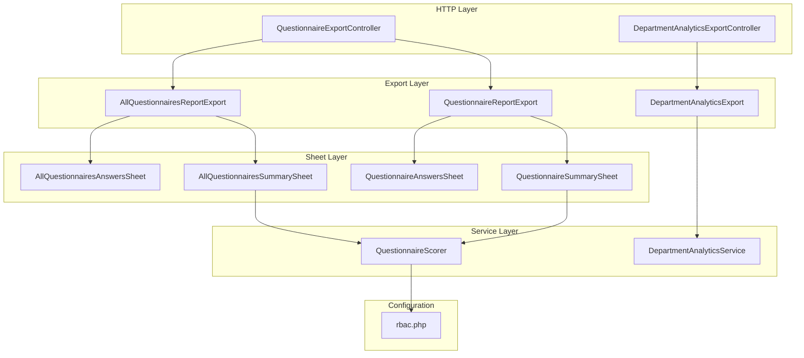
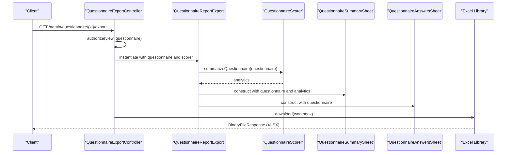
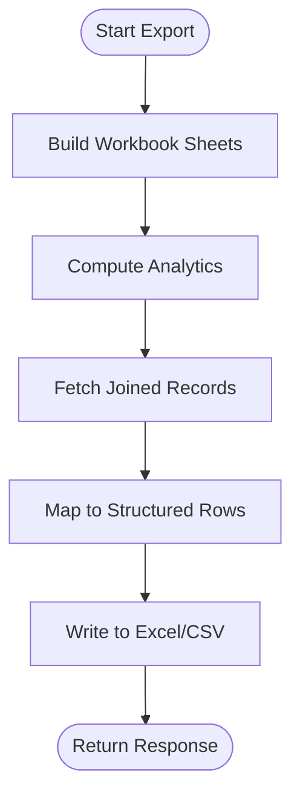
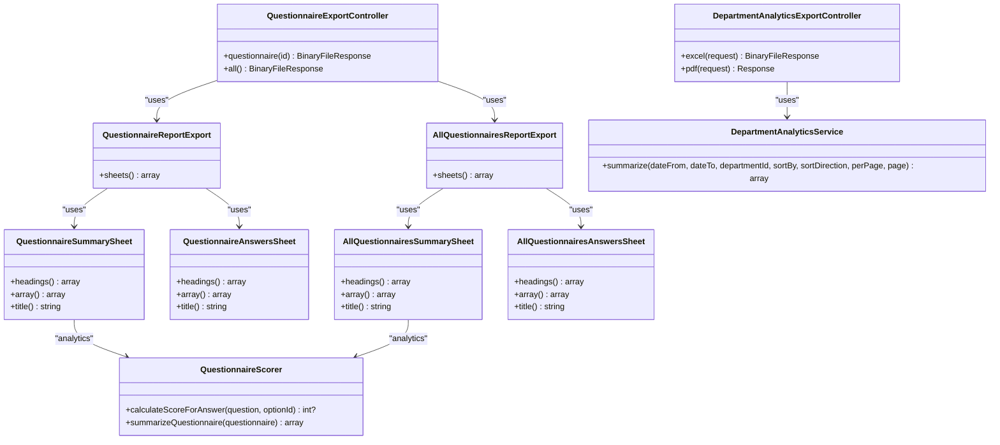

# Questionnaire Reporting API

<cite>
**Referenced Files in This Document**
- [QuestionnaireExportController.php](file://app/Http/Controllers/Admin/QuestionnaireExportController.php)
- [DepartmentAnalyticsExportController.php](file://app/Http/Controllers/Admin/DepartmentAnalyticsExportController.php)
- [AllQuestionnairesReportExport.php](file://app/Exports/AllQuestionnairesReportExport.php)
- [QuestionnaireReportExport.php](file://app/Exports/QuestionnaireReportExport.php)
- [DepartmentAnalyticsExport.php](file://app/Exports/DepartmentAnalyticsExport.php)
- [AllQuestionnairesAnswersSheet.php](file://app/Exports/Sheets/AllQuestionnairesAnswersSheet.php)
- [AllQuestionnairesSummarySheet.php](file://app/Exports/Sheets/AllQuestionnairesSummarySheet.php)
- [QuestionnaireAnswersSheet.php](file://app/Exports/Sheets/QuestionnaireAnswersSheet.php)
- [QuestionnaireSummarySheet.php](file://app/Exports/Sheets/QuestionnaireSummarySheet.php)
- [QuestionnaireScorer.php](file://app/Services/QuestionnaireScorer.php)
- [DepartmentAnalyticsService.php](file://app/Services/DepartmentAnalyticsService.php)
- [rbac.php](file://config/rbac.php)
- [api.php](file://routes/api.php)
</cite>

## Table of Contents
1. [Introduction](#introduction)
2. [Project Structure](#project-structure)
3. [Core Components](#core-components)
4. [Architecture Overview](#architecture-overview)
5. [Detailed Component Analysis](#detailed-component-analysis)
6. [Dependency Analysis](#dependency-analysis)
7. [Performance Considerations](#performance-considerations)
8. [Troubleshooting Guide](#troubleshooting-guide)
9. [Conclusion](#conclusion)
10. [Appendices](#appendices)

## Introduction
This document describes the questionnaire reporting and export APIs that enable administrators to generate comprehensive reports and exports for assessment data. It covers:
- HTTP endpoints for generating individual questionnaire reports and bulk exports
- Request parameters for questionnaire selection and date filtering
- Response formats (Excel workbooks and CSV-like arrays)
- Report templates and data transformation processes
- Examples of automated reporting pipelines and integration with external analytics systems

## Project Structure
The reporting system is organized around:
- Controllers that expose HTTP endpoints for exporting reports
- Export classes that define workbook composition and sheet metadata
- Sheet classes that implement data retrieval and formatting
- Services that compute analytics and aggregations
- Configuration that defines role targets and scoring groups

**Diagram sources**
- [QuestionnaireExportController.php:13-38](file://app/Http/Controllers/Admin/QuestionnaireExportController.php#L13-L38)
- [DepartmentAnalyticsExportController.php:13-62](file://app/Http/Controllers/Admin/DepartmentAnalyticsExportController.php#L13-L62)
- [AllQuestionnairesReportExport.php:10-24](file://app/Exports/AllQuestionnairesReportExport.php#L10-L24)
- [QuestionnaireReportExport.php:11-28](file://app/Exports/QuestionnaireReportExport.php#L11-L28)
- [DepartmentAnalyticsExport.php:9-17](file://app/Exports/DepartmentAnalyticsExport.php#L9-L17)
- [AllQuestionnairesAnswersSheet.php:10-86](file://app/Exports/Sheets/AllQuestionnairesAnswersSheet.php#L10-L86)
- [AllQuestionnairesSummarySheet.php:11-74](file://app/Exports/Sheets/AllQuestionnairesSummarySheet.php#L11-L74)
- [QuestionnaireAnswersSheet.php:11-90](file://app/Exports/Sheets/QuestionnaireAnswersSheet.php#L11-L90)
- [QuestionnaireSummarySheet.php:10-76](file://app/Exports/Sheets/QuestionnaireSummarySheet.php#L10-L76)
- [QuestionnaireScorer.php:12-138](file://app/Services/QuestionnaireScorer.php#L12-L138)
- [DepartmentAnalyticsService.php:12-278](file://app/Services/DepartmentAnalyticsService.php#L12-L278)
- [rbac.php:3-11](file://config/rbac.php#L3-L11)

**Section sources**
- [QuestionnaireExportController.php:13-38](file://app/Http/Controllers/Admin/QuestionnaireExportController.php#L13-L38)
- [DepartmentAnalyticsExportController.php:13-62](file://app/Http/Controllers/Admin/DepartmentAnalyticsExportController.php#L13-L62)
- [AllQuestionnairesReportExport.php:10-24](file://app/Exports/AllQuestionnairesReportExport.php#L10-L24)
- [QuestionnaireReportExport.php:11-28](file://app/Exports/QuestionnaireReportExport.php#L11-L28)
- [DepartmentAnalyticsExport.php:9-17](file://app/Exports/DepartmentAnalyticsExport.php#L9-L17)
- [AllQuestionnairesAnswersSheet.php:10-86](file://app/Exports/Sheets/AllQuestionnairesAnswersSheet.php#L10-L86)
- [AllQuestionnairesSummarySheet.php:11-74](file://app/Exports/Sheets/AllQuestionnairesSummarySheet.php#L11-L74)
- [QuestionnaireAnswersSheet.php:11-90](file://app/Exports/Sheets/QuestionnaireAnswersSheet.php#L11-L90)
- [QuestionnaireSummarySheet.php:10-76](file://app/Exports/Sheets/QuestionnaireSummarySheet.php#L10-L76)
- [QuestionnaireScorer.php:12-138](file://app/Services/QuestionnaireScorer.php#L12-L138)
- [DepartmentAnalyticsService.php:12-278](file://app/Services/DepartmentAnalyticsService.php#L12-L278)
- [rbac.php:3-11](file://config/rbac.php#L3-L11)

## Core Components
- QuestionnaireExportController: Provides endpoints to download:
  - Individual questionnaire report (Excel workbook with summary and answers sheets)
  - All questionnaires report (Excel workbook with summary and answers sheets)
- DepartmentAnalyticsExportController: Provides endpoints to download:
  - Department analytics as Excel workbook
  - Department analytics as HTML response for printing
- Export classes:
  - QuestionnaireReportExport: Composes summary and answers sheets for a single questionnaire
  - AllQuestionnairesReportExport: Composes summary and answers sheets for all questionnaires
  - DepartmentAnalyticsExport: Produces a single-sheet CSV-like array export
- Sheet classes:
  - QuestionnaireSummarySheet and AllQuestionnairesSummarySheet: Aggregate analytics per questionnaire or across all questionnaires
  - QuestionnaireAnswersSheet and AllQuestionnairesAnswersSheet: Tabular answers data for one or all questionnaires
- Services:
  - QuestionnaireScorer: Computes averages, distributions, and breakdowns by target roles
  - DepartmentAnalyticsService: Aggregates department-level participation, scores, and paginated results

**Section sources**
- [QuestionnaireExportController.php:13-38](file://app/Http/Controllers/Admin/QuestionnaireExportController.php#L13-L38)
- [DepartmentAnalyticsExportController.php:13-62](file://app/Http/Controllers/Admin/DepartmentAnalyticsExportController.php#L13-L62)
- [QuestionnaireReportExport.php:11-28](file://app/Exports/QuestionnaireReportExport.php#L11-L28)
- [AllQuestionnairesReportExport.php:10-24](file://app/Exports/AllQuestionnairesReportExport.php#L10-L24)
- [DepartmentAnalyticsExport.php:9-17](file://app/Exports/DepartmentAnalyticsExport.php#L9-L17)
- [QuestionnaireSummarySheet.php:10-76](file://app/Exports/Sheets/QuestionnaireSummarySheet.php#L10-L76)
- [AllQuestionnairesSummarySheet.php:11-74](file://app/Exports/Sheets/AllQuestionnairesSummarySheet.php#L11-L74)
- [QuestionnaireAnswersSheet.php:11-90](file://app/Exports/Sheets/QuestionnaireAnswersSheet.php#L11-L90)
- [AllQuestionnairesAnswersSheet.php:10-86](file://app/Exports/Sheets/AllQuestionnairesAnswersSheet.php#L10-L86)
- [QuestionnaireScorer.php:12-138](file://app/Services/QuestionnaireScorer.php#L12-L138)
- [DepartmentAnalyticsService.php:12-278](file://app/Services/DepartmentAnalyticsService.php#L12-L278)

## Architecture Overview
The reporting pipeline follows a layered approach:
- HTTP requests reach controllers
- Controllers delegate to export classes
- Export classes assemble sheets via service-provided analytics
- Sheets query the database and transform data into structured arrays
- Excel library generates downloadable files; HTML responses render printable content

**Diagram sources**
- [QuestionnaireExportController.php:15-25](file://app/Http/Controllers/Admin/QuestionnaireExportController.php#L15-L25)
- [QuestionnaireReportExport.php:19-27](file://app/Exports/QuestionnaireReportExport.php#L19-L27)
- [QuestionnaireSummarySheet.php:20-24](file://app/Exports/Sheets/QuestionnaireSummarySheet.php#L20-L24)
- [QuestionnaireAnswersSheet.php:13-16](file://app/Exports/Sheets/QuestionnaireAnswersSheet.php#L13-L16)
- [QuestionnaireScorer.php:33-112](file://app/Services/QuestionnaireScorer.php#L33-L112)

## Detailed Component Analysis

### Questionnaire Export Endpoints
- Endpoint: GET /admin/questionnaire/{id}/export
  - Purpose: Download an Excel workbook containing:
    - Summary sheet: overall averages, per-role averages, respondent counts
    - Answers sheet: detailed responses and calculated scores
  - Authentication: Requires authenticated admin access
  - Authorization: Requires permission to view the specified questionnaire
  - Response: BinaryFileResponse (application/vnd.openxmlformats-officedocument.spreadsheetml.sheet)
  - Filename pattern: questionnaire_{id}_report_YYYYMMDD_His.xlsx

- Endpoint: GET /admin/questionnaires/export/all
  - Purpose: Download an Excel workbook containing:
    - Summary sheet: aggregated analytics across all questionnaires
    - Answers sheet: combined answers from all submissions
  - Authentication: Requires authenticated admin access
  - Authorization: Requires permission to view any questionnaire
  - Response: BinaryFileResponse (application/vnd.openxmlformats-officedocument.spreadsheetml.sheet)
  - Filename pattern: all_questionnaires_report_YYYYMMDD_His.xlsx

Request parameters:
- None for these endpoints; the questionnaire ID is part of the path

Response aggregation:
- Summary sheet derives averages and counts from QuestionnaireScorer
- Answers sheet retrieves joined records for submitted responses

**Section sources**
- [QuestionnaireExportController.php:15-37](file://app/Http/Controllers/Admin/QuestionnaireExportController.php#L15-L37)
- [QuestionnaireReportExport.php:11-28](file://app/Exports/QuestionnaireReportExport.php#L11-L28)
- [AllQuestionnairesReportExport.php:10-24](file://app/Exports/AllQuestionnairesReportExport.php#L10-L24)
- [QuestionnaireSummarySheet.php:26-62](file://app/Exports/Sheets/QuestionnaireSummarySheet.php#L26-L62)
- [AllQuestionnairesSummarySheet.php:18-59](file://app/Exports/Sheets/AllQuestionnairesSummarySheet.php#L18-L59)
- [QuestionnaireAnswersSheet.php:18-83](file://app/Exports/Sheets/QuestionnaireAnswersSheet.php#L18-L83)
- [AllQuestionnairesAnswersSheet.php:12-79](file://app/Exports/Sheets/AllQuestionnairesAnswersSheet.php#L12-L79)

### Department Analytics Export Endpoints
- Endpoint: GET /admin/reports/departments/analytics/excel
  - Purpose: Download an Excel workbook with department analytics
  - Query parameters:
    - date_from: optional date filter (YYYY-MM-DD)
    - date_to: optional date filter (YYYY-MM-DD)
    - department_id: optional department identifier
  - Response: BinaryFileResponse (application/vnd.openxmlformats-officedocument.spreadsheetml.sheet)
  - Filename pattern: department_analytics_YYYYMMDD_His.xlsx

- Endpoint: GET /admin/reports/departments/analytics/pdf
  - Purpose: Render department analytics as HTML for printing
  - Query parameters:
    - date_from: optional date filter (YYYY-MM-DD)
    - date_to: optional date filter (YYYY-MM-DD)
    - department_id: optional department identifier
  - Response: Response (text/html; inline)
  - Filename: department-analytics-print.html

Response aggregation:
- DepartmentAnalyticsService computes:
  - Total employees per department (active evaluators)
  - Total respondents per department (submitted responses)
  - Average score per department (filtered by date range)
  - Participation rate per department

**Section sources**
- [DepartmentAnalyticsExportController.php:15-56](file://app/Http/Controllers/Admin/DepartmentAnalyticsExportController.php#L15-L56)
- [DepartmentAnalyticsExport.php:19-49](file://app/Exports/DepartmentAnalyticsExport.php#L19-L49)
- [DepartmentAnalyticsService.php:20-95](file://app/Services/DepartmentAnalyticsService.php#L20-L95)

### Export Formats and Templates
- Excel workbooks:
  - AllQuestionnairesReportExport: Two sheets
    - All Summary: static headings plus dynamic role-based columns
    - All Answers: standardized answer record columns
  - QuestionnaireReportExport: Two sheets
    - Summary: static headings plus dynamic role-based columns derived from analytics
    - Answers: standardized answer record columns filtered by questionnaire
- CSV-like arrays:
  - DepartmentAnalyticsExport: Array-based export with predefined headings

Sheet headings and transformations:
- AllQuestionnairesSummarySheet and QuestionnaireSummarySheet derive dynamic column names from configured role slugs
- AllQuestionnairesAnswersSheet and QuestionnaireAnswersSheet join responses, users, questions, and answer options to produce normalized rows

**Section sources**
- [AllQuestionnairesReportExport.php:17-23](file://app/Exports/AllQuestionnairesReportExport.php#L17-L23)
- [QuestionnaireReportExport.php:19-27](file://app/Exports/QuestionnaireReportExport.php#L19-L27)
- [AllQuestionnairesSummarySheet.php:18-34](file://app/Exports/Sheets/AllQuestionnairesSummarySheet.php#L18-L34)
- [QuestionnaireSummarySheet.php:26-43](file://app/Exports/Sheets/QuestionnaireSummarySheet.php#L26-L43)
- [AllQuestionnairesAnswersSheet.php:12-31](file://app/Exports/Sheets/AllQuestionnairesAnswersSheet.php#L12-L31)
- [QuestionnaireAnswersSheet.php:18-37](file://app/Exports/Sheets/QuestionnaireAnswersSheet.php#L18-L37)
- [DepartmentAnalyticsExport.php:19-27](file://app/Exports/DepartmentAnalyticsExport.php#L19-L27)

### Data Transformation Processes
- QuestionnaireScorer:
  - Calculates per-option scores for answers
  - Aggregates averages per questionnaire and per target role
  - Builds question-level average scores and response counts
  - Computes distribution percentages per option per question
- DepartmentAnalyticsService:
  - Builds subqueries for employees, respondents, and scores
  - Applies optional date filters and department filters
  - Paginates results and prepares chart data

**Diagram sources**
- [QuestionnaireScorer.php:33-112](file://app/Services/QuestionnaireScorer.php#L33-L112)
- [DepartmentAnalyticsService.php:20-95](file://app/Services/DepartmentAnalyticsService.php#L20-L95)
- [AllQuestionnairesAnswersSheet.php:33-79](file://app/Exports/Sheets/AllQuestionnairesAnswersSheet.php#L33-L79)
- [QuestionnaireAnswersSheet.php:39-83](file://app/Exports/Sheets/QuestionnaireAnswersSheet.php#L39-L83)

**Section sources**
- [QuestionnaireScorer.php:14-138](file://app/Services/QuestionnaireScorer.php#L14-L138)
- [DepartmentAnalyticsService.php:20-278](file://app/Services/DepartmentAnalyticsService.php#L20-L278)

### API Definitions

- GET /admin/questionnaire/{id}/export
  - Description: Generate an Excel report for a single questionnaire
  - Authentication: Required
  - Authorization: Must have permission to view the questionnaire
  - Path parameters:
    - id: integer, questionnaire identifier
  - Response: application/vnd.openxmlformats-officedocument.spreadsheetml.sheet
  - Example request: GET /admin/questionnaire/123/export

- GET /admin/questionnaires/export/all
  - Description: Generate an Excel report for all questionnaires
  - Authentication: Required
  - Authorization: Must have permission to view any questionnaire
  - Response: application/vnd.openxmlformats-officedocument.spreadsheetml.sheet
  - Example request: GET /admin/questionnaires/export/all

- GET /admin/reports/departments/analytics/excel
  - Description: Export department analytics as Excel
  - Authentication: Required
  - Authorization: Must be admin role
  - Query parameters:
    - date_from: string (optional), date filter
    - date_to: string (optional), date filter
    - department_id: integer (optional), department identifier
  - Response: application/vnd.openxmlformats-officedocument.spreadsheetml.sheet
  - Example request: GET /admin/reports/departments/analytics/excel?date_from=2023-01-01&date_to=2023-12-31&department_id=5

- GET /admin/reports/departments/analytics/pdf
  - Description: Render department analytics as HTML for printing
  - Authentication: Required
  - Authorization: Must be admin role
  - Query parameters:
    - date_from: string (optional), date filter
    - date_to: string (optional), date filter
    - department_id: integer (optional), department identifier
  - Response: text/html; charset=UTF-8
  - Example request: GET /admin/reports/departments/analytics/pdf?date_from=2023-01-01&date_to=2023-12-31

**Section sources**
- [QuestionnaireExportController.php:15-37](file://app/Http/Controllers/Admin/QuestionnaireExportController.php#L15-L37)
- [DepartmentAnalyticsExportController.php:15-56](file://app/Http/Controllers/Admin/DepartmentAnalyticsExportController.php#L15-L56)

## Dependency Analysis
- Controllers depend on:
  - Export classes for workbook composition
  - Services for analytics computation
- Export classes depend on:
  - Sheet classes for data retrieval and formatting
  - Services for computed analytics
- Sheets depend on:
  - Eloquent queries to join responses, users, questions, and answer options
  - Configuration for dynamic role-based columns
- Services depend on:
  - Database queries and configuration for role slugs and evaluator roles

**Diagram sources**
- [QuestionnaireExportController.php:13-38](file://app/Http/Controllers/Admin/QuestionnaireExportController.php#L13-L38)
- [DepartmentAnalyticsExportController.php:13-62](file://app/Http/Controllers/Admin/DepartmentAnalyticsExportController.php#L13-L62)
- [QuestionnaireReportExport.php:11-28](file://app/Exports/QuestionnaireReportExport.php#L11-L28)
- [AllQuestionnairesReportExport.php:10-24](file://app/Exports/AllQuestionnairesReportExport.php#L10-L24)
- [QuestionnaireSummarySheet.php:10-76](file://app/Exports/Sheets/QuestionnaireSummarySheet.php#L10-L76)
- [AllQuestionnairesSummarySheet.php:11-74](file://app/Exports/Sheets/AllQuestionnairesSummarySheet.php#L11-L74)
- [QuestionnaireAnswersSheet.php:11-90](file://app/Exports/Sheets/QuestionnaireAnswersSheet.php#L11-L90)
- [AllQuestionnairesAnswersSheet.php:10-86](file://app/Exports/Sheets/AllQuestionnairesAnswersSheet.php#L10-L86)
- [QuestionnaireScorer.php:12-138](file://app/Services/QuestionnaireScorer.php#L12-L138)
- [DepartmentAnalyticsService.php:12-278](file://app/Services/DepartmentAnalyticsService.php#L12-L278)

**Section sources**
- [QuestionnaireExportController.php:13-38](file://app/Http/Controllers/Admin/QuestionnaireExportController.php#L13-L38)
- [DepartmentAnalyticsExportController.php:13-62](file://app/Http/Controllers/Admin/DepartmentAnalyticsExportController.php#L13-L62)
- [QuestionnaireReportExport.php:11-28](file://app/Exports/QuestionnaireReportExport.php#L11-L28)
- [AllQuestionnairesReportExport.php:10-24](file://app/Exports/AllQuestionnairesReportExport.php#L10-L24)
- [QuestionnaireScorer.php:12-138](file://app/Services/QuestionnaireScorer.php#L12-L138)
- [DepartmentAnalyticsService.php:12-278](file://app/Services/DepartmentAnalyticsService.php#L12-L278)

## Performance Considerations
- Pagination: Department analytics supports pagination to limit result set size and improve response times.
- Caching: Department analytics services cache role-level and user-level summaries for a short TTL to reduce repeated heavy computations.
- Query optimization: Sheets use joins and ordered selects to minimize memory overhead during row mapping.
- Export size: Bulk exports may generate large datasets; consider limiting date ranges and using pagination for downstream processing.

[No sources needed since this section provides general guidance]

## Troubleshooting Guide
- 403 Forbidden:
  - Occurs when the requesting user lacks admin privileges or questionnaire permissions.
  - Verify middleware aliases and role configuration.
- Empty or missing data:
  - Confirm that responses have status "submitted" and that calculated scores are present.
  - Check date filters and department filters for correctness.
- Large export timeouts:
  - Narrow date ranges or avoid global bulk exports for very large datasets.
  - Consider server-side chunking or background jobs for extremely large exports.

**Section sources**
- [DepartmentAnalyticsExportController.php:58-61](file://app/Http/Controllers/Admin/DepartmentAnalyticsExportController.php#L58-L61)
- [AllQuestionnairesAnswersSheet.php:41-42](file://app/Exports/Sheets/AllQuestionnairesAnswersSheet.php#L41-L42)
- [QuestionnaireAnswersSheet.php:46-47](file://app/Exports/Sheets/QuestionnaireAnswersSheet.php#L46-L47)

## Conclusion
The questionnaire reporting and export system provides robust endpoints for generating detailed analytics and consolidated exports. Administrators can select specific questionnaires or aggregate across all assessments, apply date filters for department analytics, and receive standardized Excel workbooks or HTML-rendered reports. The design leverages service-layer analytics and sheet-based data transformation to ensure consistent, scalable reporting.

[No sources needed since this section summarizes without analyzing specific files]

## Appendices

### Request Parameters Reference
- GET /admin/questionnaire/{id}/export
  - Path: id (integer)
- GET /admin/questionnaires/export/all
  - No parameters
- GET /admin/reports/departments/analytics/excel
  - Query: date_from (string), date_to (string), department_id (integer)
- GET /admin/reports/departments/analytics/pdf
  - Query: date_from (string), date_to (string), department_id (integer)

**Section sources**
- [QuestionnaireExportController.php:15-37](file://app/Http/Controllers/Admin/QuestionnaireExportController.php#L15-L37)
- [DepartmentAnalyticsExportController.php:15-56](file://app/Http/Controllers/Admin/DepartmentAnalyticsExportController.php#L15-L56)

### Role-Based Columns and Configuration
- Dynamic columns in summary sheets are derived from configured role slugs.
- The system recognizes evaluator and questionnaire target slugs from configuration.

**Section sources**
- [AllQuestionnairesSummarySheet.php:67-73](file://app/Exports/Sheets/AllQuestionnairesSummarySheet.php#L67-L73)
- [QuestionnaireSummarySheet.php:69-75](file://app/Exports/Sheets/QuestionnaireSummarySheet.php#L69-L75)
- [rbac.php:3-11](file://config/rbac.php#L3-L11)

### Example Automated Reporting Pipelines
- Daily department analytics export:
  - Schedule a job to call the Excel endpoint with date_from and date_to set to yesterday.
  - Save the returned file to a shared drive or cloud storage.
- Weekly questionnaire summary:
  - Run a script to call the all-questionnaires export endpoint.
  - Parse the workbook and upload to a BI platform.
- Monthly dashboard refresh:
  - Use the department analytics service to fetch paginated results and render HTML for internal dashboards.

[No sources needed since this section provides general guidance]