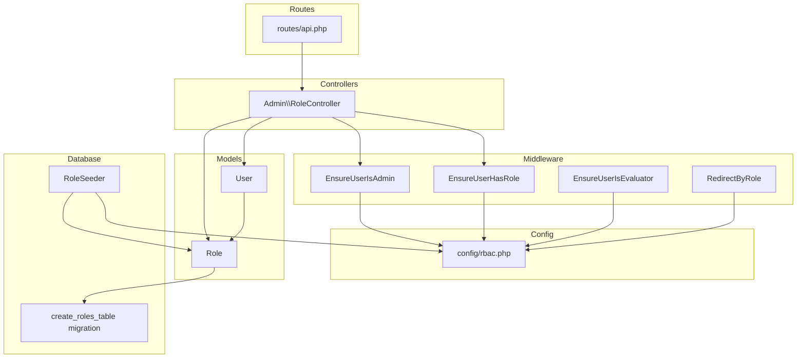
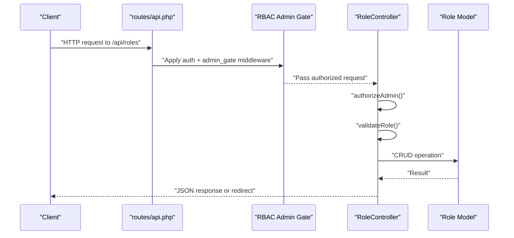
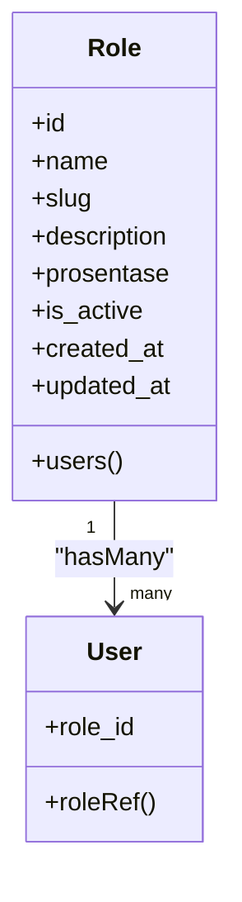
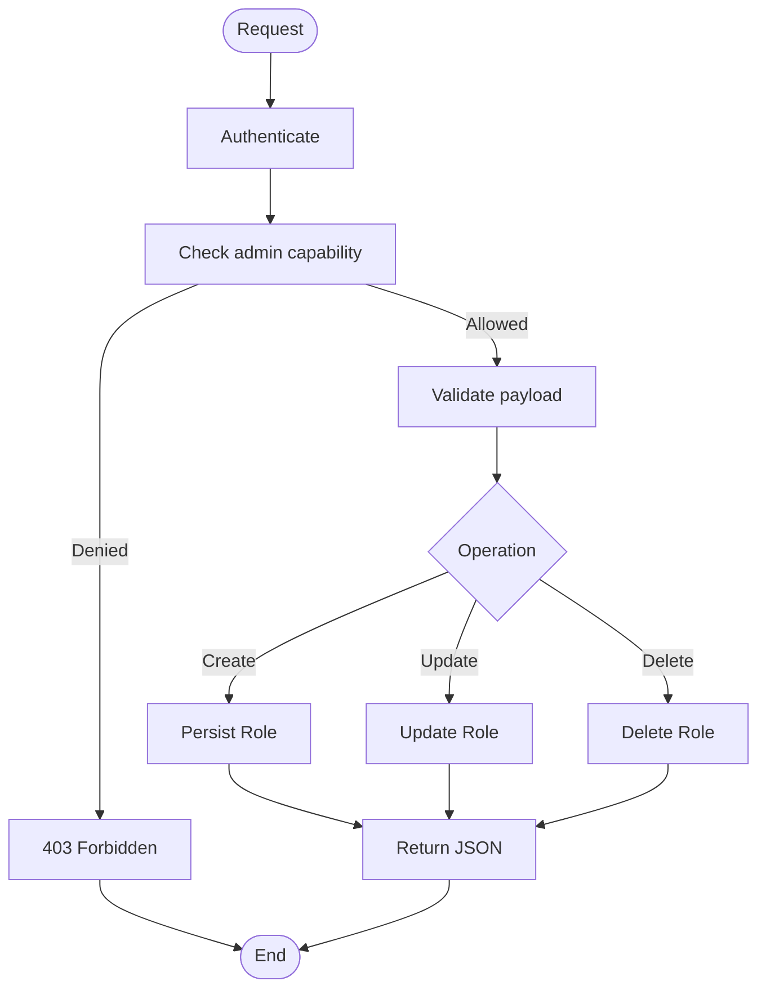
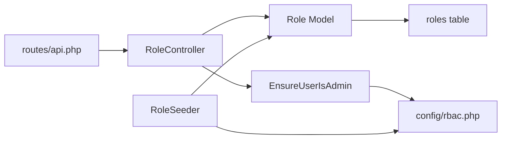

# Roles Management API

<cite>
**Referenced Files in This Document**
- [routes/api.php](file://routes/api.php)
- [RoleController.php](file://app/Http/Controllers/Admin/RoleController.php)
- [Role.php](file://app/Models/Role.php)
- [User.php](file://app/Models/User.php)
- [rbac.php](file://config/rbac.php)
- [2026_04_17_093035_create_roles_table.php](file://database/migrations/2026_04_17_093035_create_roles_table.php)
- [RoleSeeder.php](file://database/seeders/RoleSeeder.php)
- [EnsureUserHasRole.php](file://app/Http/Middleware/EnsureUserHasRole.php)
- [EnsureUserIsAdmin.php](file://app/Http/Middleware/EnsureUserIsAdmin.php)
- [EnsureUserIsEvaluator.php](file://app/Http/Middleware/EnsureUserIsEvaluator.php)
- [RedirectByRole.php](file://app/Http/Middleware/RedirectByRole.php)
- [RoleDirectory.php](file://app/Livewire/Admin/RoleDirectory.php)
- [StoreUserRequest.php](file://app/Http/Requests/StoreUserRequest.php)
- [UpdateUserRequest.php](file://app/Http/Requests/UpdateUserRequest.php)
- [RoleControllerTest.php](file://tests/Unit/RoleControllerTest.php)
</cite>

## Table of Contents
1. [Introduction](#introduction)
2. [Project Structure](#project-structure)
3. [Core Components](#core-components)
4. [Architecture Overview](#architecture-overview)
5. [Detailed Component Analysis](#detailed-component-analysis)
6. [Dependency Analysis](#dependency-analysis)
7. [Performance Considerations](#performance-considerations)
8. [Troubleshooting Guide](#troubleshooting-guide)
9. [Conclusion](#conclusion)
10. [Appendices](#appendices)

## Introduction
This document provides comprehensive API documentation for role management endpoints. It covers HTTP methods for CRUD operations on roles, request/response schemas, validation rules, authorization requirements, and RBAC middleware integration. It also explains role assignment to users, permission inheritance patterns, and common use cases such as role hierarchies, permission checking, and administrative access control.

## Project Structure
The roles management API is implemented under the Admin namespace with dedicated controller, model, middleware, configuration, and tests. Routes are registered under the API group with authentication and admin-gate middleware applied.

**Diagram sources**
- [routes/api.php:1-14](file://routes/api.php#L1-L14)
- [RoleController.php:1-130](file://app/Http/Controllers/Admin/RoleController.php#L1-L130)
- [Role.php:1-31](file://app/Models/Role.php#L1-L31)
- [User.php:1-94](file://app/Models/User.php#L1-L94)
- [EnsureUserHasRole.php:1-28](file://app/Http/Middleware/EnsureUserHasRole.php#L1-L28)
- [EnsureUserIsAdmin.php:1-23](file://app/Http/Middleware/EnsureUserIsAdmin.php#L1-L23)
- [EnsureUserIsEvaluator.php:1-23](file://app/Http/Middleware/EnsureUserIsEvaluator.php#L1-L23)
- [RedirectByRole.php:1-31](file://app/Http/Middleware/RedirectByRole.php#L1-L31)
- [rbac.php:1-64](file://config/rbac.php#L1-L64)
- [2026_04_17_093035_create_roles_table.php:1-33](file://database/migrations/2026_04_17_093035_create_roles_table.php#L1-L33)
- [RoleSeeder.php:1-26](file://database/seeders/RoleSeeder.php#L1-L26)

**Section sources**
- [routes/api.php:1-14](file://routes/api.php#L1-L14)
- [RoleController.php:1-130](file://app/Http/Controllers/Admin/RoleController.php#L1-L130)
- [rbac.php:1-64](file://config/rbac.php#L1-L64)

## Core Components
- Role model defines attributes and relationships used by the API.
- RoleController implements CRUD endpoints with JSON responses for API clients and redirects for web clients.
- RBAC configuration centralizes role slugs, labels, aliases, and middleware aliases.
- Middleware enforces admin-only access and role-based checks.
- Database schema and seeder define persistence and initial roles.

Key capabilities:
- Full CRUD via RESTful endpoints under /api/roles
- JSON responses for API clients; HTML redirects for web clients
- Built-in pagination, sorting, and search
- Validation rules for role attributes
- Authorization via admin gate middleware and user capability checks

**Section sources**
- [Role.php:1-31](file://app/Models/Role.php#L1-L31)
- [RoleController.php:14-105](file://app/Http/Controllers/Admin/RoleController.php#L14-L105)
- [rbac.php:1-64](file://config/rbac.php#L1-L64)
- [2026_04_17_093035_create_roles_table.php:14-22](file://database/migrations/2026_04_17_093035_create_roles_table.php#L14-L22)
- [RoleSeeder.php:14-24](file://database/seeders/RoleSeeder.php#L14-L24)

## Architecture Overview
The roles API is protected by authentication and admin-gate middleware. Requests are routed to RoleController methods that enforce admin capability, validate input, and interact with the Role model. Responses are JSON for API clients and redirects for web clients.

**Diagram sources**
- [routes/api.php:8-13](file://routes/api.php#L8-L13)
- [RoleController.php:16, 54, 76, 89, 125:16-128](file://app/Http/Controllers/Admin/RoleController.php#L16-L128)
- [EnsureUserIsAdmin.php:12-21](file://app/Http/Middleware/EnsureUserIsAdmin.php#L12-L21)

**Section sources**
- [routes/api.php:8-13](file://routes/api.php#L8-L13)
- [RoleController.php:16, 54, 76, 89, 125:16-128](file://app/Http/Controllers/Admin/RoleController.php#L16-L128)
- [EnsureUserIsAdmin.php:12-21](file://app/Http/Middleware/EnsureUserIsAdmin.php#L12-L21)

## Detailed Component Analysis

### Role Model
The Role Eloquent model defines fillable attributes, type casting, and a relationship to users.

**Diagram sources**
- [Role.php:13-29](file://app/Models/Role.php#L13-L29)
- [User.php:54-56](file://app/Models/User.php#L54-L56)

**Section sources**
- [Role.php:13-29](file://app/Models/Role.php#L13-L29)
- [User.php:54-56](file://app/Models/User.php#L54-L56)

### RoleController Endpoints
- GET /api/roles
  - Purpose: List roles with pagination, sorting, and search
  - Query parameters:
    - search: string
    - sort_by: one of id, name, prosentase, is_active, created_at
    - sort_direction: asc or desc
    - per_page: integer between 5 and 100
  - Response: Paged collection including user_count per role
- POST /api/roles
  - Purpose: Create a new role
  - Request body fields:
    - name: required, string, max 50, unique
    - description: nullable, string, max 2000
    - prosentase: required, numeric, 0..100
    - is_active: required, boolean
  - Response: Created role object
- PUT /api/roles/{role}
  - Purpose: Update an existing role
  - Path parameter: role (Role model binding)
  - Request body fields: same as create
  - Response: Updated role object
- DELETE /api/roles/{role}
  - Purpose: Delete a role if not used by any user
  - Response: Deletion confirmation or 422 if in use

Authorization and behavior:
- Requires authenticated user with admin capability
- Returns JSON for API clients; redirects for web clients
- Slug is auto-generated from name

**Section sources**
- [routes/api.php:8-13](file://routes/api.php#L8-L13)
- [RoleController.php:14-105](file://app/Http/Controllers/Admin/RoleController.php#L14-L105)
- [RoleController.php:110-123](file://app/Http/Controllers/Admin/RoleController.php#L110-L123)
- [RoleController.php:125-128](file://app/Http/Controllers/Admin/RoleController.php#L125-L128)

### Validation Rules and Schemas
- Name: required, string, max 50, unique across roles
- Description: optional, string, max 2000
- Prosentase: required, numeric, min 0, max 100
- Is active: required, boolean
- Slug: derived automatically from name (snake_case, lowercase)

**Section sources**
- [RoleController.php:110-123](file://app/Http/Controllers/Admin/RoleController.php#L110-L123)
- [2026_04_17_093035_create_roles_table.php:16-20](file://database/migrations/2026_04_17_093035_create_roles_table.php#L16-L20)

### Authorization and RBAC Integration
- Middleware aliases:
  - admin_gate: mapped via config to a named middleware
- Admin requirement:
  - Endpoint requires admin capability via user.canManageRoles()
- Role slugs and labels:
  - Configured centrally for admin, evaluator, and dashboard routing
- Role assignment to users:
  - Users belong to roles via role_id foreign key
  - Requests for user creation/update require role_id to exist

**Diagram sources**
- [EnsureUserIsAdmin.php:12-21](file://app/Http/Middleware/EnsureUserIsAdmin.php#L12-L21)
- [User.php:89-92](file://app/Models/User.php#L89-L92)
- [rbac.php:4, 31-36](file://config/rbac.php#L4,L31-L36)

**Section sources**
- [EnsureUserIsAdmin.php:12-21](file://app/Http/Middleware/EnsureUserIsAdmin.php#L12-L21)
- [User.php:89-92](file://app/Models/User.php#L89-L92)
- [rbac.php:4, 31-36](file://config/rbac.php#L4,L31-L36)

### Practical Examples

- Create a role
  - Method: POST /api/roles
  - Body: { name, description, prosentase, is_active }
  - Expected response: { message, data: Role }

- Update a role
  - Method: PUT /api/roles/{role}
  - Path: role = Role ID
  - Body: { name, description, prosentase, is_active }
  - Expected response: { message, data: Role }

- Delete a role
  - Method: DELETE /api/roles/{role}
  - Path: role = Role ID
  - Expected response: { message } or 422 if in use

- List roles with filters
  - Method: GET /api/roles?search=...&sort_by=...&sort_direction=...&per_page=...
  - Expected response: Paged collection including user_count

- Assign a user to a role
  - Use user creation/update requests with role_id set to an existing Role ID
  - Validation ensures role_id exists

**Section sources**
- [RoleController.php:52-85](file://app/Http/Controllers/Admin/RoleController.php#L52-L85)
- [RoleController.php:87-105](file://app/Http/Controllers/Admin/RoleController.php#L87-L105)
- [RoleController.php:14-43](file://app/Http/Controllers/Admin/RoleController.php#L14-L43)
- [StoreUserRequest.php:38](file://app/Http/Requests/StoreUserRequest.php#L38)
- [UpdateUserRequest.php:33](file://app/Http/Requests/UpdateUserRequest.php#L33)

### Permission Checking and Role Hierarchies
- Admin roles:
  - Determined by configured admin slugs
  - Admins can manage roles
- Evaluator roles:
  - Determined by configured evaluator slugs
  - Used for evaluator-specific flows
- Dashboard redirection:
  - RedirectByRole middleware uses configured dashboard paths keyed by role slug
- Role labels and aliases:
  - Centralized in config for UI and routing consistency

**Section sources**
- [User.php:69-87](file://app/Models/User.php#L69-L87)
- [rbac.php:4, 7-11, 49-62](file://config/rbac.php#L4,L7-L11,L49-L62)
- [RedirectByRole.php:19-29](file://app/Http/Middleware/RedirectByRole.php#L19-L29)

## Dependency Analysis
- Routes depend on RoleController and RBAC admin_gate alias
- RoleController depends on Role model, User capability checks, and validation
- Middleware depends on RBAC configuration for slugs and aliases
- Database schema and seeder depend on RBAC role definitions

**Diagram sources**
- [routes/api.php:8-13](file://routes/api.php#L8-L13)
- [RoleController.php:16, 54, 76, 89, 125:16-128](file://app/Http/Controllers/Admin/RoleController.php#L16-L128)
- [rbac.php:41-48](file://config/rbac.php#L41-L48)
- [2026_04_17_093035_create_roles_table.php:14-22](file://database/migrations/2026_04_17_093035_create_roles_table.php#L14-L22)
- [RoleSeeder.php:16-23](file://database/seeders/RoleSeeder.php#L16-L23)

**Section sources**
- [routes/api.php:8-13](file://routes/api.php#L8-L13)
- [RoleController.php:16, 54, 76, 89, 125:16-128](file://app/Http/Controllers/Admin/RoleController.php#L16-L128)
- [rbac.php:41-48](file://config/rbac.php#L41-L48)
- [2026_04_17_093035_create_roles_table.php:14-22](file://database/migrations/2026_04_17_093035_create_roles_table.php#L14-L22)
- [RoleSeeder.php:16-23](file://database/seeders/RoleSeeder.php#L16-L23)

## Performance Considerations
- Pagination defaults to 10 items; capped between 5 and 100 per_page
- Sorting is limited to a small set of columns to avoid expensive queries
- Search uses composite LIKE conditions; consider indexing for large datasets
- The users relation count is included; ensure appropriate indexing on role_id

[No sources needed since this section provides general guidance]

## Troubleshooting Guide
Common issues and resolutions:
- 401 Unauthorized: Authentication required; ensure valid session/token
- 403 Forbidden: User lacks admin capability; verify role slug matches configured admin slugs
- 422 Unprocessable Entity on delete: Role still assigned to users; reassign users or remove assignments
- Validation failures: Ensure payload meets field constraints (name uniqueness, numeric ranges, booleans)

**Section sources**
- [EnsureUserIsAdmin.php:14-20](file://app/Http/Middleware/EnsureUserIsAdmin.php#L14-L20)
- [RoleController.php:89-97](file://app/Http/Controllers/Admin/RoleController.php#L89-L97)
- [RoleController.php:110-123](file://app/Http/Controllers/Admin/RoleController.php#L110-L123)

## Conclusion
The roles management API provides secure, validated, and flexible CRUD operations for roles with strong RBAC integration. It supports both API clients and web clients, includes robust authorization, and leverages centralized configuration for role semantics and routing.

[No sources needed since this section summarizes without analyzing specific files]

## Appendices

### API Reference Summary
- Base URL: /api
- Authentication: Required
- Authorization: Admin capability required
- Endpoints:
  - GET /roles: List with search, sort, pagination
  - POST /roles: Create
  - PUT /roles/{role}: Update
  - DELETE /roles/{role}: Delete (if unused)

**Section sources**
- [routes/api.php:8-13](file://routes/api.php#L8-L13)
- [RoleController.php:14-105](file://app/Http/Controllers/Admin/RoleController.php#L14-L105)

### Database Schema
- roles table columns:
  - name (unique, string)
  - slug (unique, string)
  - description (nullable, text)
  - prosentase (decimal, default 0)
  - is_active (boolean, default true)
  - timestamps

**Section sources**
- [2026_04_17_093035_create_roles_table.php:14-22](file://database/migrations/2026_04_17_093035_create_roles_table.php#L14-L22)

### RBAC Configuration Highlights
- Admin slugs: super_admin, admin
- Evaluator slugs: guru, tata_usaha, orang_tua, user
- Middleware aliases: admin_gate, evaluator_gate, role_gate, role_redirect
- Role definitions: predefined roles with name, slug, description, prosentase, is_active

**Section sources**
- [rbac.php:4, 5, 31-36, 41-48](file://config/rbac.php#L4,L5,L31-L36,L41-L48)

### Role Assignment to Users
- Users belong to roles via role_id
- Creation and update requests validate role_id existence
- RoleDirectory component enforces manage-roles capability

**Section sources**
- [User.php:54-56](file://app/Models/User.php#L54-L56)
- [StoreUserRequest.php:38](file://app/Http/Requests/StoreUserRequest.php#L38)
- [UpdateUserRequest.php:33](file://app/Http/Requests/UpdateUserRequest.php#L33)
- [RoleDirectory.php:30](file://app/Livewire/Admin/RoleDirectory.php#L30)

### Test Coverage
- Unit test verifies JSON response for GET /api/roles when Accept is application/json

**Section sources**
- [RoleControllerTest.php:18-44](file://tests/Unit/RoleControllerTest.php#L18-L44)