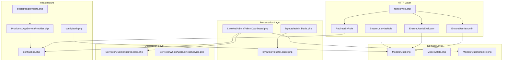
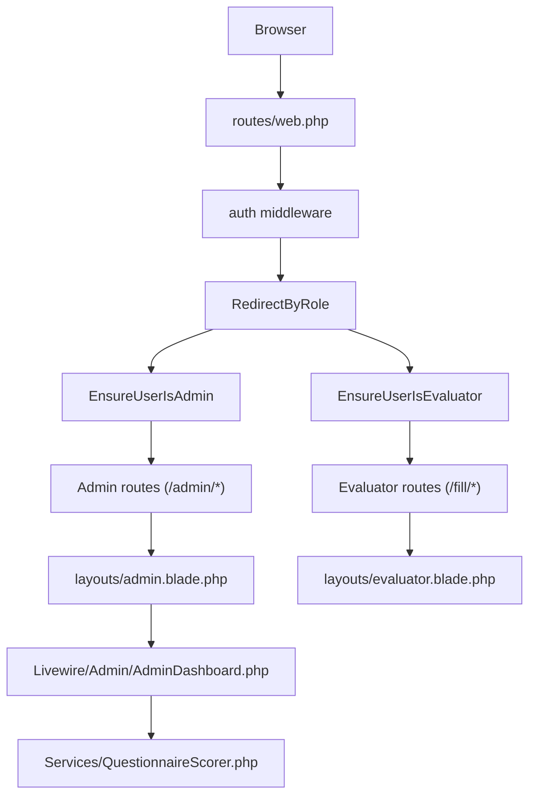
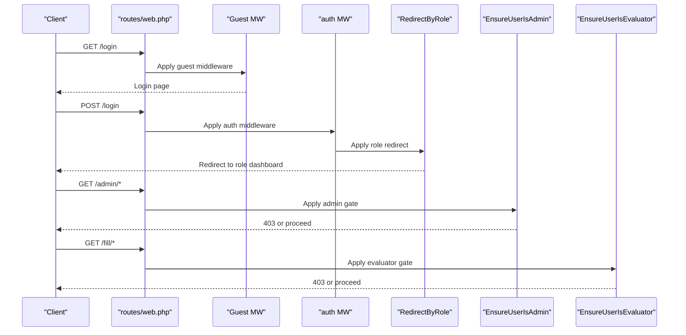
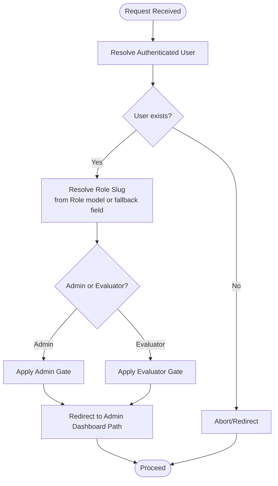
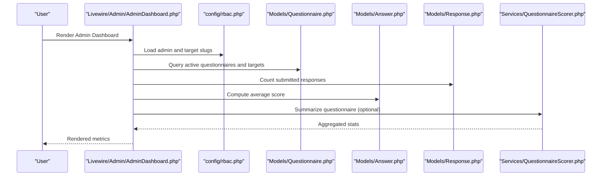
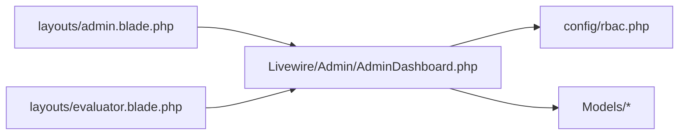
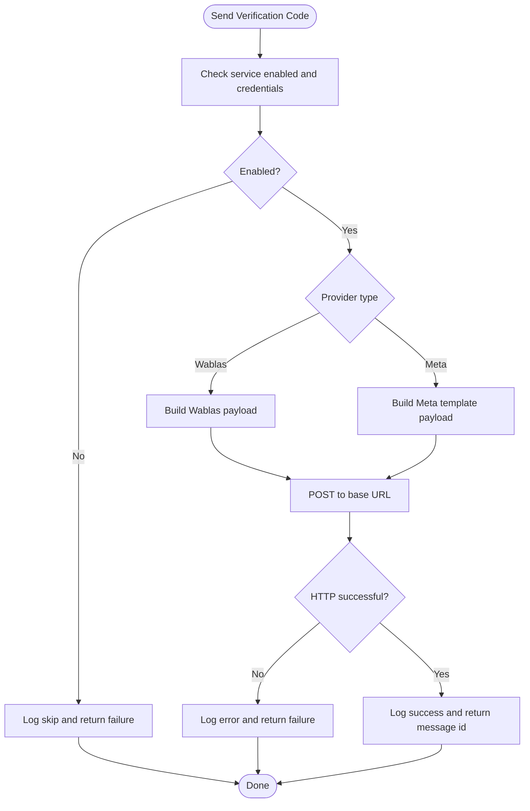
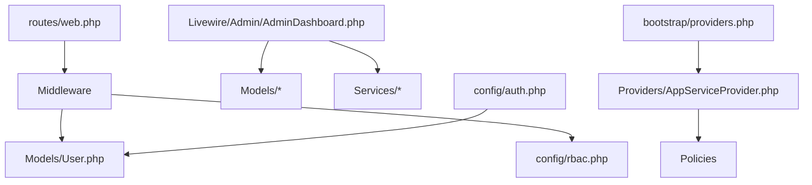

# Architecture Overview

<cite>
**Referenced Files in This Document**
- [composer.json](file://composer.json)
- [bootstrap/providers.php](file://bootstrap/providers.php)
- [app/Providers/AppServiceProvider.php](file://app/Providers/AppServiceProvider.php)
- [config/auth.php](file://config/auth.php)
- [config/rbac.php](file://config/rbac.php)
- [routes/web.php](file://routes/web.php)
- [app/Http/Middleware/EnsureUserHasRole.php](file://app/Http/Middleware/EnsureUserHasRole.php)
- [app/Http/Middleware/EnsureUserIsAdmin.php](file://app/Http/Middleware/EnsureUserIsAdmin.php)
- [app/Http/Middleware/EnsureUserIsEvaluator.php](file://app/Http/Middleware/EnsureUserIsEvaluator.php)
- [app/Http/Middleware/RedirectByRole.php](file://app/Http/Middleware/RedirectByRole.php)
- [app/Models/User.php](file://app/Models/User.php)
- [app/Models/Role.php](file://app/Models/Role.php)
- [app/Models/Questionnaire.php](file://app/Models/Questionnaire.php)
- [app/Livewire/Admin/AdminDashboard.php](file://app/Livewire/Admin/AdminDashboard.php)
- [resources/views/layouts/admin.blade.php](file://resources/views/layouts/admin.blade.php)
- [resources/views/layouts/evaluator.blade.php](file://resources/views/layouts/evaluator.blade.php)
- [app/Services/QuestionnaireScorer.php](file://app/Services/QuestionnaireScorer.php)
- [app/Services/WhatsAppBusinessService.php](file://app/Services/WhatsAppBusinessService.php)
</cite>

## Table of Contents
1. [Introduction](#introduction)
2. [Project Structure](#project-structure)
3. [Core Components](#core-components)
4. [Architecture Overview](#architecture-overview)
5. [Detailed Component Analysis](#detailed-component-analysis)
6. [Dependency Analysis](#dependency-analysis)
7. [Performance Considerations](#performance-considerations)
8. [Troubleshooting Guide](#troubleshooting-guide)
9. [Conclusion](#conclusion)

## Introduction
This document describes the architecture of the assessment platform built with Laravel and Livewire. It explains the high-level design patterns, MVC architecture, system boundaries, middleware pipeline, role-based access control, and Livewire-based frontend interactions. It also documents the Laravel service provider registration, integration points, and service layer patterns, along with technology stack choices and scalability considerations.

## Project Structure
The platform follows a layered MVC architecture with:
- HTTP layer: Routes and controllers for web and API traffic
- Domain layer: Eloquent models representing entities and relationships
- Application layer: Services encapsulating business logic
- Presentation layer: Blade layouts and Livewire components
- Infrastructure: Middleware, policies, and configuration

**Diagram sources**
- [routes/web.php:1-161](file://routes/web.php#L1-L161)
- [app/Http/Middleware/EnsureUserHasRole.php:1-28](file://app/Http/Middleware/EnsureUserHasRole.php#L1-L28)
- [app/Http/Middleware/EnsureUserIsAdmin.php:1-23](file://app/Http/Middleware/EnsureUserIsAdmin.php#L1-L23)
- [app/Http/Middleware/EnsureUserIsEvaluator.php:1-23](file://app/Http/Middleware/EnsureUserIsEvaluator.php#L1-L23)
- [app/Http/Middleware/RedirectByRole.php:1-31](file://app/Http/Middleware/RedirectByRole.php#L1-L31)
- [app/Models/User.php:1-94](file://app/Models/User.php#L1-L94)
- [app/Models/Role.php:1-31](file://app/Models/Role.php#L1-L31)
- [app/Models/Questionnaire.php:1-131](file://app/Models/Questionnaire.php#L1-L131)
- [app/Livewire/Admin/AdminDashboard.php:1-137](file://app/Livewire/Admin/AdminDashboard.php#L1-L137)
- [resources/views/layouts/admin.blade.php:1-105](file://resources/views/layouts/admin.blade.php#L1-L105)
- [resources/views/layouts/evaluator.blade.php:1-82](file://resources/views/layouts/evaluator.blade.php#L1-L82)
- [app/Services/QuestionnaireScorer.php:1-139](file://app/Services/QuestionnaireScorer.php#L1-L139)
- [app/Services/WhatsAppBusinessService.php:1-99](file://app/Services/WhatsAppBusinessService.php#L1-L99)
- [config/auth.php:1-118](file://config/auth.php#L1-L118)
- [config/rbac.php:1-64](file://config/rbac.php#L1-L64)
- [app/Providers/AppServiceProvider.php:1-28](file://app/Providers/AppServiceProvider.php#L1-L28)
- [bootstrap/providers.php:1-8](file://bootstrap/providers.php#L1-L8)

**Section sources**
- [routes/web.php:1-161](file://routes/web.php#L1-L161)
- [config/rbac.php:1-64](file://config/rbac.php#L1-L64)
- [config/auth.php:1-118](file://config/auth.php#L1-L118)
- [bootstrap/providers.php:1-8](file://bootstrap/providers.php#L1-L8)
- [app/Providers/AppServiceProvider.php:1-28](file://app/Providers/AppServiceProvider.php#L1-L28)

## Core Components
- Authentication and Authorization
  - Guard and provider configured for session-based authentication
  - RBAC configuration defines role slugs, aliases, and dashboard routing
  - Middleware gates enforce admin, evaluator, and role-based access
- Models
  - User with role and department relations, role slug resolution, and role checks
  - Role with users relation
  - Questionnaire with targets, questions, and response relations
- Services
  - QuestionnaireScorer: computes scores and analytics for questionnaires
  - WhatsAppBusinessService: sends login verification messages via external APIs
- Livewire
  - AdminDashboard component renders cached analytics and integrates with policies and configuration
  - Blade layouts provide role-specific navigation and theming

**Section sources**
- [config/auth.php:1-118](file://config/auth.php#L1-L118)
- [config/rbac.php:1-64](file://config/rbac.php#L1-L64)
- [app/Http/Middleware/EnsureUserHasRole.php:1-28](file://app/Http/Middleware/EnsureUserHasRole.php#L1-L28)
- [app/Http/Middleware/EnsureUserIsAdmin.php:1-23](file://app/Http/Middleware/EnsureUserIsAdmin.php#L1-L23)
- [app/Http/Middleware/EnsureUserIsEvaluator.php:1-23](file://app/Http/Middleware/EnsureUserIsEvaluator.php#L1-L23)
- [app/Http/Middleware/RedirectByRole.php:1-31](file://app/Http/Middleware/RedirectByRole.php#L1-L31)
- [app/Models/User.php:1-94](file://app/Models/User.php#L1-L94)
- [app/Models/Role.php:1-31](file://app/Models/Role.php#L1-L31)
- [app/Models/Questionnaire.php:1-131](file://app/Models/Questionnaire.php#L1-L131)
- [app/Livewire/Admin/AdminDashboard.php:1-137](file://app/Livewire/Admin/AdminDashboard.php#L1-L137)
- [app/Services/QuestionnaireScorer.php:1-139](file://app/Services/QuestionnaireScorer.php#L1-L139)
- [app/Services/WhatsAppBusinessService.php:1-99](file://app/Services/WhatsAppBusinessService.php#L1-L99)

## Architecture Overview
High-level design patterns:
- MVC with Laravel’s controller-layer and Livewire components for reactive UI
- Policy-based authorization via Gates
- Role-Based Access Control (RBAC) with configurable slugs and aliases
- Service layer for domain logic and external integrations
- Blade layouts and Livewire components for presentation

System boundaries:
- Admin boundary: routes prefixed with admin, guarded by admin middleware, and rendered with admin layout
- Evaluator boundary: routes under fill/, guarded by evaluator middleware, and rendered with evaluator layout
- Shared boundary: authentication and profile pages accessible after login

**Diagram sources**
- [routes/web.php:1-161](file://routes/web.php#L1-L161)
- [app/Http/Middleware/RedirectByRole.php:1-31](file://app/Http/Middleware/RedirectByRole.php#L1-L31)
- [app/Http/Middleware/EnsureUserIsAdmin.php:1-23](file://app/Http/Middleware/EnsureUserIsAdmin.php#L1-L23)
- [app/Http/Middleware/EnsureUserIsEvaluator.php:1-23](file://app/Http/Middleware/EnsureUserIsEvaluator.php#L1-L23)
- [resources/views/layouts/admin.blade.php:1-105](file://resources/views/layouts/admin.blade.php#L1-L105)
- [resources/views/layouts/evaluator.blade.php:1-82](file://resources/views/layouts/evaluator.blade.php#L1-L82)
- [app/Livewire/Admin/AdminDashboard.php:1-137](file://app/Livewire/Admin/AdminDashboard.php#L1-L137)
- [app/Services/QuestionnaireScorer.php:1-139](file://app/Services/QuestionnaireScorer.php#L1-L139)

## Detailed Component Analysis

### Authentication and Authorization Pipeline
The middleware pipeline enforces authentication, role redirection, and role-based access:
- Guest routes allow login initiation
- Authenticated users are redirected by role to appropriate dashboards
- Admin and evaluator routes are gated by dedicated middleware
- Gates bind policies to models

**Diagram sources**
- [routes/web.php:1-161](file://routes/web.php#L1-L161)
- [app/Http/Middleware/EnsureUserIsAdmin.php:1-23](file://app/Http/Middleware/EnsureUserIsAdmin.php#L1-L23)
- [app/Http/Middleware/EnsureUserIsEvaluator.php:1-23](file://app/Http/Middleware/EnsureUserIsEvaluator.php#L1-L23)
- [app/Http/Middleware/RedirectByRole.php:1-31](file://app/Http/Middleware/RedirectByRole.php#L1-L31)

**Section sources**
- [routes/web.php:1-161](file://routes/web.php#L1-L161)
- [app/Http/Middleware/EnsureUserHasRole.php:1-28](file://app/Http/Middleware/EnsureUserHasRole.php#L1-L28)
- [app/Http/Middleware/EnsureUserIsAdmin.php:1-23](file://app/Http/Middleware/EnsureUserIsAdmin.php#L1-L23)
- [app/Http/Middleware/EnsureUserIsEvaluator.php:1-23](file://app/Http/Middleware/EnsureUserIsEvaluator.php#L1-L23)
- [app/Http/Middleware/RedirectByRole.php:1-31](file://app/Http/Middleware/RedirectByRole.php#L1-L31)
- [config/rbac.php:1-64](file://config/rbac.php#L1-L64)

### RBAC and Role Resolution
Role slugs and aliases are centrally configured. Users resolve their effective role slugs and are classified as admin or evaluator. Dashboard routing is derived from configuration.

**Diagram sources**
- [app/Models/User.php:1-94](file://app/Models/User.php#L1-L94)
- [config/rbac.php:1-64](file://config/rbac.php#L1-L64)
- [app/Http/Middleware/EnsureUserIsAdmin.php:1-23](file://app/Http/Middleware/EnsureUserIsAdmin.php#L1-L23)
- [app/Http/Middleware/EnsureUserIsEvaluator.php:1-23](file://app/Http/Middleware/EnsureUserIsEvaluator.php#L1-L23)
- [app/Http/Middleware/RedirectByRole.php:1-31](file://app/Http/Middleware/RedirectByRole.php#L1-L31)

**Section sources**
- [app/Models/User.php:1-94](file://app/Models/User.php#L1-L94)
- [config/rbac.php:1-64](file://config/rbac.php#L1-L64)

### Admin Dashboard and Analytics
The AdminDashboard Livewire component fetches metrics with caching and integrates with Questionnaire and Answer models. It uses policy authorization and configuration-driven role lists.

**Diagram sources**
- [app/Livewire/Admin/AdminDashboard.php:1-137](file://app/Livewire/Admin/AdminDashboard.php#L1-L137)
- [config/rbac.php:1-64](file://config/rbac.php#L1-L64)
- [app/Models/Questionnaire.php:1-131](file://app/Models/Questionnaire.php#L1-L131)
- [app/Services/QuestionnaireScorer.php:1-139](file://app/Services/QuestionnaireScorer.php#L1-L139)

**Section sources**
- [app/Livewire/Admin/AdminDashboard.php:1-137](file://app/Livewire/Admin/AdminDashboard.php#L1-L137)
- [app/Services/QuestionnaireScorer.php:1-139](file://app/Services/QuestionnaireScorer.php#L1-L139)

### Livewire Frontend Architecture
Livewire components are mounted within Blade layouts. The admin layout provides navigation and dark mode toggle, while the evaluator layout provides evaluator-centric navigation. Components use attributes for layout binding and leverage configuration for dynamic behavior.

**Diagram sources**
- [resources/views/layouts/admin.blade.php:1-105](file://resources/views/layouts/admin.blade.php#L1-L105)
- [resources/views/layouts/evaluator.blade.php:1-82](file://resources/views/layouts/evaluator.blade.php#L1-L82)
- [app/Livewire/Admin/AdminDashboard.php:1-137](file://app/Livewire/Admin/AdminDashboard.php#L1-L137)
- [config/rbac.php:1-64](file://config/rbac.php#L1-L64)

**Section sources**
- [resources/views/layouts/admin.blade.php:1-105](file://resources/views/layouts/admin.blade.php#L1-L105)
- [resources/views/layouts/evaluator.blade.php:1-82](file://resources/views/layouts/evaluator.blade.php#L1-L82)
- [app/Livewire/Admin/AdminDashboard.php:1-137](file://app/Livewire/Admin/AdminDashboard.php#L1-L137)

### External Integrations
WhatsApp Business integration is encapsulated in a service that handles provider selection and payload construction. It logs successes and failures and returns structured results.

**Diagram sources**
- [app/Services/WhatsAppBusinessService.php:1-99](file://app/Services/WhatsAppBusinessService.php#L1-L99)

**Section sources**
- [app/Services/WhatsAppBusinessService.php:1-99](file://app/Services/WhatsAppBusinessService.php#L1-L99)

## Dependency Analysis
Key dependencies and relationships:
- Routes depend on middleware and Livewire components
- Middleware depends on User model and RBAC configuration
- Livewire components depend on models and services
- Service provider registers policies and binds configuration

**Diagram sources**
- [routes/web.php:1-161](file://routes/web.php#L1-L161)
- [app/Http/Middleware/EnsureUserHasRole.php:1-28](file://app/Http/Middleware/EnsureUserHasRole.php#L1-L28)
- [app/Http/Middleware/EnsureUserIsAdmin.php:1-23](file://app/Http/Middleware/EnsureUserIsAdmin.php#L1-L23)
- [app/Http/Middleware/EnsureUserIsEvaluator.php:1-23](file://app/Http/Middleware/EnsureUserIsEvaluator.php#L1-L23)
- [app/Http/Middleware/RedirectByRole.php:1-31](file://app/Http/Middleware/RedirectByRole.php#L1-L31)
- [app/Models/User.php:1-94](file://app/Models/User.php#L1-L94)
- [config/rbac.php:1-64](file://config/rbac.php#L1-L64)
- [app/Livewire/Admin/AdminDashboard.php:1-137](file://app/Livewire/Admin/AdminDashboard.php#L1-L137)
- [app/Providers/AppServiceProvider.php:1-28](file://app/Providers/AppServiceProvider.php#L1-L28)
- [bootstrap/providers.php:1-8](file://bootstrap/providers.php#L1-L8)
- [config/auth.php:1-118](file://config/auth.php#L1-L118)

**Section sources**
- [routes/web.php:1-161](file://routes/web.php#L1-L161)
- [app/Providers/AppServiceProvider.php:1-28](file://app/Providers/AppServiceProvider.php#L1-L28)
- [bootstrap/providers.php:1-8](file://bootstrap/providers.php#L1-L8)
- [config/auth.php:1-118](file://config/auth.php#L1-L118)

## Performance Considerations
- Caching: AdminDashboard uses caching for computed metrics to reduce database load
- Eager loading: Models use with() and joins to minimize N+1 queries
- Throttling: Routes apply throttling middleware to protect endpoints
- Pagination and grouping: Services aggregate data with grouped selects and raw expressions

[No sources needed since this section provides general guidance]

## Troubleshooting Guide
Common issues and diagnostics:
- Authentication failures: Verify guard and provider configuration
- Role redirection loops: Confirm RBAC dashboard paths and middleware alias configuration
- Admin/Evaluator access denied: Check role slugs and middleware gates
- WhatsApp delivery errors: Inspect service configuration and logs for provider-specific responses

**Section sources**
- [config/auth.php:1-118](file://config/auth.php#L1-L118)
- [config/rbac.php:1-64](file://config/rbac.php#L1-L64)
- [app/Http/Middleware/EnsureUserIsAdmin.php:1-23](file://app/Http/Middleware/EnsureUserIsAdmin.php#L1-L23)
- [app/Http/Middleware/EnsureUserIsEvaluator.php:1-23](file://app/Http/Middleware/EnsureUserIsEvaluator.php#L1-L23)
- [app/Services/WhatsAppBusinessService.php:1-99](file://app/Services/WhatsAppBusinessService.php#L1-L99)

## Conclusion
The assessment platform employs a clean separation of concerns with Laravel’s MVC, Livewire for reactive UI, and a robust RBAC system. Middleware enforces access control, services encapsulate business logic, and Blade layouts provide role-specific experiences. The architecture supports scalability through caching, eager loading, and modular service design.