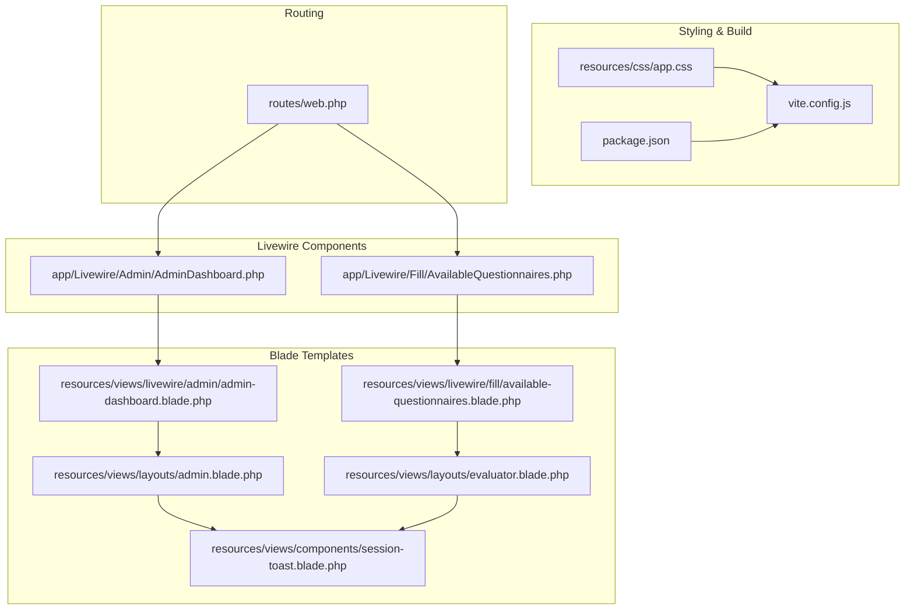
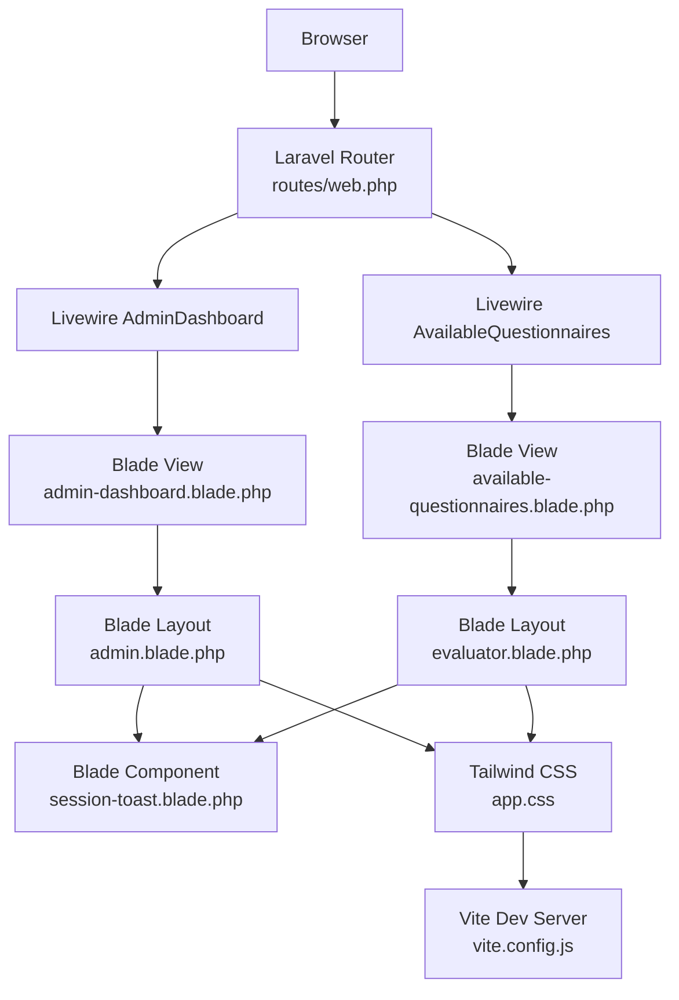
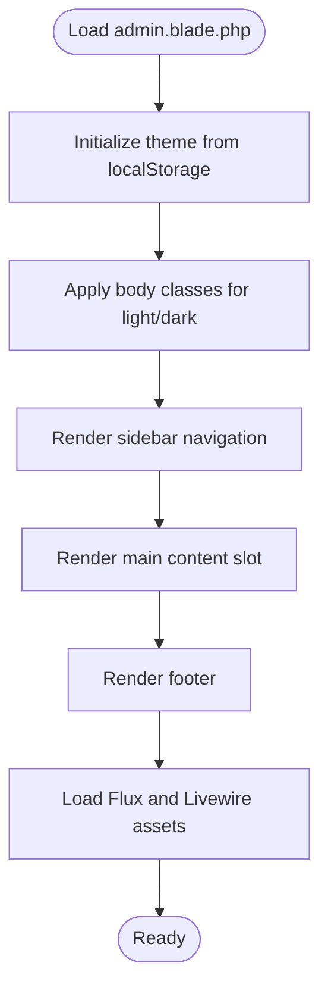
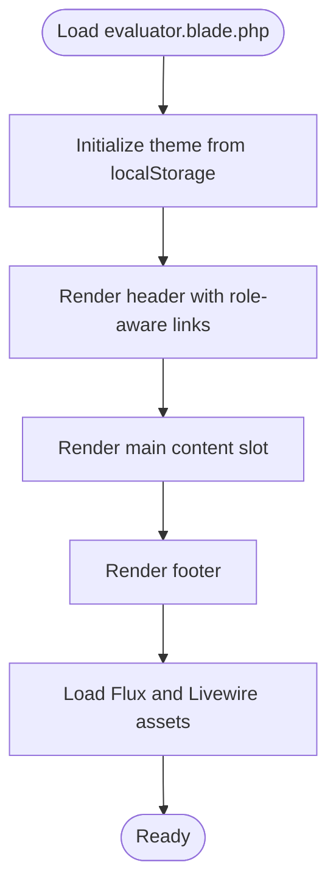
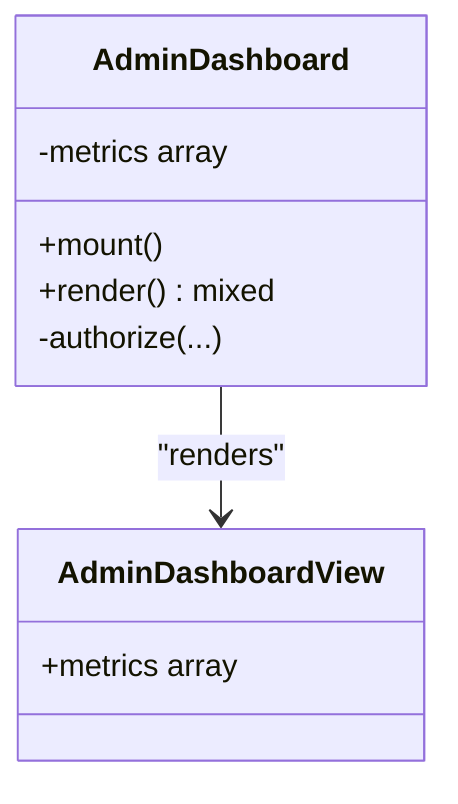
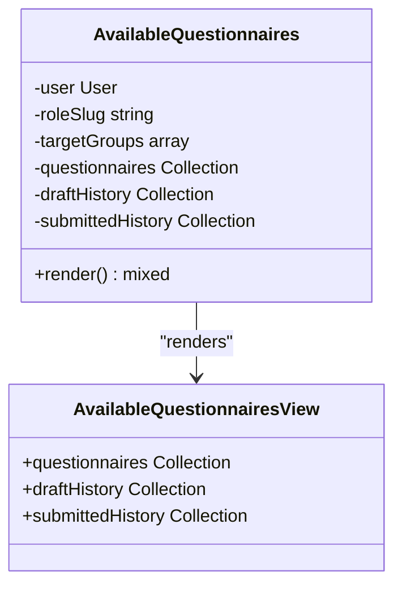
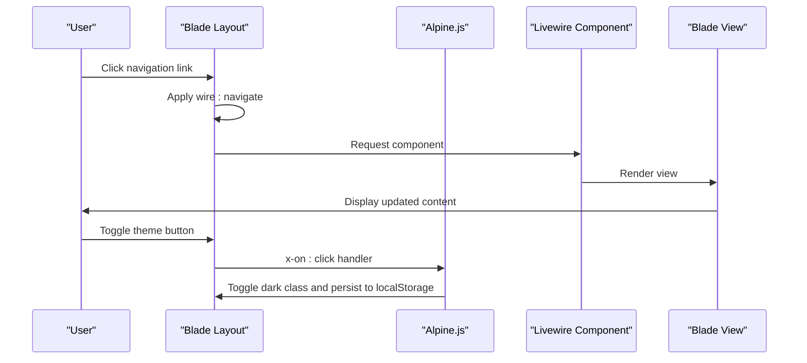
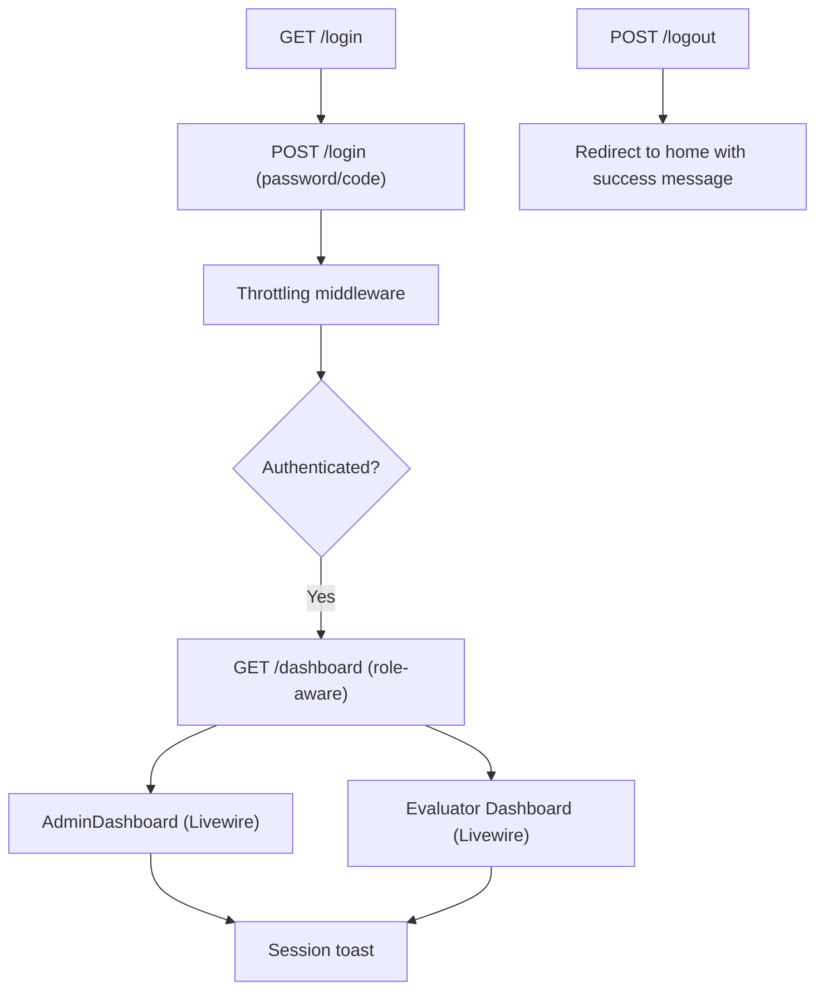
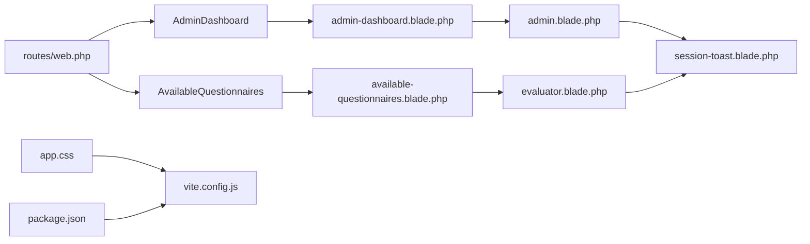

# Frontend Architecture

<cite>
**Referenced Files in This Document**
- [admin.blade.php](file://resources/views/layouts/admin.blade.php)
- [evaluator.blade.php](file://resources/views/layouts/evaluator.blade.php)
- [welcome.blade.php](file://resources/views/welcome.blade.php)
- [app.css](file://resources/css/app.css)
- [vite.config.js](file://vite.config.js)
- [package.json](file://package.json)
- [AdminDashboard.php](file://app/Livewire/Admin/AdminDashboard.php)
- [AvailableQuestionnaires.php](file://app/Livewire/Fill/AvailableQuestionnaires.php)
- [admin-dashboard.blade.php](file://resources/views/livewire/admin/admin-dashboard.blade.php)
- [available-questionnaires.blade.php](file://resources/views/livewire/fill/available-questionnaires.blade.php)
- [session-toast.blade.php](file://resources/views/components/session-toast.blade.php)
- [web.php](file://routes/web.php)
</cite>

## Table of Contents
1. [Introduction](#introduction)
2. [Project Structure](#project-structure)
3. [Core Components](#core-components)
4. [Architecture Overview](#architecture-overview)
5. [Detailed Component Analysis](#detailed-component-analysis)
6. [Dependency Analysis](#dependency-analysis)
7. [Performance Considerations](#performance-considerations)
8. [Troubleshooting Guide](#troubleshooting-guide)
9. [Conclusion](#conclusion)

## Introduction
This document explains the frontend architecture and user interface design of the Laravel-based assessment system. It covers the Blade templating integration with Laravel, the Livewire component-based approach for dynamic UI updates, responsive design patterns, layout systems for admin and evaluator themes, component composition, state management via Livewire, the build process using Vite, asset management, styling approaches, real-time capabilities, form handling, and user interaction patterns that drive the assessment workflow.

## Project Structure
The frontend is organized around:
- Blade layouts for admin and evaluator themes
- Livewire components for dynamic pages and dashboards
- Tailwind CSS with Flux UI components
- Vite for asset bundling and development hot reloading
- Routing that maps roles to themed dashboards and workflows

**Diagram sources**
- [admin.blade.php:1-105](file://resources/views/layouts/admin.blade.php#L1-L105)
- [evaluator.blade.php:1-82](file://resources/views/layouts/evaluator.blade.php#L1-L82)
- [session-toast.blade.php:1-29](file://resources/views/components/session-toast.blade.php#L1-L29)
- [admin-dashboard.blade.php:1-51](file://resources/views/livewire/admin/admin-dashboard.blade.php#L1-L51)
- [available-questionnaires.blade.php:1-85](file://resources/views/livewire/fill/available-questionnaires.blade.php#L1-L85)
- [AdminDashboard.php:1-137](file://app/Livewire/Admin/AdminDashboard.php#L1-L137)
- [AvailableQuestionnaires.php:1-64](file://app/Livewire/Fill/AvailableQuestionnaires.php#L1-L64)
- [app.css:1-15](file://resources/css/app.css#L1-L15)
- [vite.config.js:1-19](file://vite.config.js#L1-L19)
- [package.json:1-17](file://package.json#L1-L17)
- [web.php:1-161](file://routes/web.php#L1-L161)

**Section sources**
- [admin.blade.php:1-105](file://resources/views/layouts/admin.blade.php#L1-L105)
- [evaluator.blade.php:1-82](file://resources/views/layouts/evaluator.blade.php#L1-L82)
- [app.css:1-15](file://resources/css/app.css#L1-L15)
- [vite.config.js:1-19](file://vite.config.js#L1-L19)
- [package.json:1-17](file://package.json#L1-L17)
- [web.php:1-161](file://routes/web.php#L1-L161)

## Core Components
- Layouts
  - Admin layout provides navigation, theme toggle, and footer within a two-column structure.
  - Evaluator layout adapts navigation based on user role and dashboard route resolution.
- Livewire Components
  - AdminDashboard computes metrics and renders cards for participation rate, average score, and role-wise breakdown.
  - AvailableQuestionnaires lists active questionnaires, draft history, and submitted history for the current evaluator.
- Styling and Build
  - Tailwind CSS configured with Flux UI and dark mode support.
  - Vite with laravel-vite-plugin and TailwindCSS plugin for dev/build.

Key implementation references:
- Admin layout and evaluator layout: [admin.blade.php:1-105](file://resources/views/layouts/admin.blade.php#L1-L105), [evaluator.blade.php:1-82](file://resources/views/layouts/evaluator.blade.php#L1-L82)
- Livewire AdminDashboard: [AdminDashboard.php:1-137](file://app/Livewire/Admin/AdminDashboard.php#L1-L137)
- Livewire AvailableQuestionnaires: [AvailableQuestionnaires.php:1-64](file://app/Livewire/Fill/AvailableQuestionnaires.php#L1-L64)
- Admin dashboard view: [admin-dashboard.blade.php:1-51](file://resources/views/livewire/admin/admin-dashboard.blade.php#L1-L51)
- Evaluator questionnaires view: [available-questionnaires.blade.php:1-85](file://resources/views/livewire/fill/available-questionnaires.blade.php#L1-L85)
- Session toast component: [session-toast.blade.php:1-29](file://resources/views/components/session-toast.blade.php#L1-L29)
- Tailwind and theme config: [app.css:1-15](file://resources/css/app.css#L1-L15)
- Vite config: [vite.config.js:1-19](file://vite.config.js#L1-L19)
- Package scripts and deps: [package.json:1-17](file://package.json#L1-L17)
- Routing: [web.php:1-161](file://routes/web.php#L1-L161)

**Section sources**
- [admin.blade.php:1-105](file://resources/views/layouts/admin.blade.php#L1-L105)
- [evaluator.blade.php:1-82](file://resources/views/layouts/evaluator.blade.php#L1-L82)
- [AdminDashboard.php:1-137](file://app/Livewire/Admin/AdminDashboard.php#L1-L137)
- [AvailableQuestionnaires.php:1-64](file://app/Livewire/Fill/AvailableQuestionnaires.php#L1-L64)
- [admin-dashboard.blade.php:1-51](file://resources/views/livewire/admin/admin-dashboard.blade.php#L1-L51)
- [available-questionnaires.blade.php:1-85](file://resources/views/livewire/fill/available-questionnaires.blade.php#L1-L85)
- [session-toast.blade.php:1-29](file://resources/views/components/session-toast.blade.php#L1-L29)
- [app.css:1-15](file://resources/css/app.css#L1-L15)
- [vite.config.js:1-19](file://vite.config.js#L1-L19)
- [package.json:1-17](file://package.json#L1-L17)
- [web.php:1-161](file://routes/web.php#L1-L161)

## Architecture Overview
The frontend architecture integrates Blade templates with Livewire components, enabling reactive UI updates without full page reloads. Vite manages assets and Tailwind CSS provides utility-first styling with dark mode support. Routing assigns role-specific dashboards and workflows.

**Diagram sources**
- [web.php:1-161](file://routes/web.php#L1-L161)
- [admin.blade.php:1-105](file://resources/views/layouts/admin.blade.php#L1-L105)
- [evaluator.blade.php:1-82](file://resources/views/layouts/evaluator.blade.php#L1-L82)
- [admin-dashboard.blade.php:1-51](file://resources/views/livewire/admin/admin-dashboard.blade.php#L1-L51)
- [available-questionnaires.blade.php:1-85](file://resources/views/livewire/fill/available-questionnaires.blade.php#L1-L85)
- [session-toast.blade.php:1-29](file://resources/views/components/session-toast.blade.php#L1-L29)
- [vite.config.js:1-19](file://vite.config.js#L1-L19)
- [app.css:1-15](file://resources/css/app.css#L1-L15)

## Detailed Component Analysis

### Layout System: Admin Theme
- Structure: Two-column layout with sidebar navigation, main content area, and footer.
- Theming: LocalStorage persists theme preference; Alpine.js toggles dark class on html element.
- Navigation: Dynamic buttons for admin sections; logout form submission.
- Asset loading: Vite entry for CSS/JS; Flux appearance and Livewire styles/scripts.

**Diagram sources**
- [admin.blade.php:1-105](file://resources/views/layouts/admin.blade.php#L1-L105)

**Section sources**
- [admin.blade.php:1-105](file://resources/views/layouts/admin.blade.php#L1-L105)

### Layout System: Evaluator Theme
- Structure: Centered content area with header containing role-aware dashboard links and theme toggle.
- Navigation: Links to questionnaires, history, profile, and logout.
- Asset loading: Vite entry for CSS/JS; Flux appearance and Livewire styles/scripts.

**Diagram sources**
- [evaluator.blade.php:1-82](file://resources/views/layouts/evaluator.blade.php#L1-L82)

**Section sources**
- [evaluator.blade.php:1-82](file://resources/views/layouts/evaluator.blade.php#L1-L82)

### Livewire AdminDashboard Component
- Purpose: Render admin overview metrics with caching and role-aware calculations.
- Data computation: Aggregates counts, participation rates, averages, and role breakdowns.
- Rendering: Uses a Blade view to present summary cards and breakdown.

**Diagram sources**
- [AdminDashboard.php:1-137](file://app/Livewire/Admin/AdminDashboard.php#L1-L137)
- [admin-dashboard.blade.php:1-51](file://resources/views/livewire/admin/admin-dashboard.blade.php#L1-L51)

**Section sources**
- [AdminDashboard.php:1-137](file://app/Livewire/Admin/AdminDashboard.php#L1-L137)
- [admin-dashboard.blade.php:1-51](file://resources/views/livewire/admin/admin-dashboard.blade.php#L1-L51)

### Livewire AvailableQuestionnaires Component
- Purpose: Present available, draft, and submitted questionnaires for the current evaluator.
- Data retrieval: Filters active questionnaires by target groups derived from user role and aliases; includes draft/submitted histories.
- Rendering: Grid of questionnaire cards with start/end dates, question count, and action buttons.

**Diagram sources**
- [AvailableQuestionnaires.php:1-64](file://app/Livewire/Fill/AvailableQuestionnaires.php#L1-L64)
- [available-questionnaires.blade.php:1-85](file://resources/views/livewire/fill/available-questionnaires.blade.php#L1-L85)

**Section sources**
- [AvailableQuestionnaires.php:1-64](file://app/Livewire/Fill/AvailableQuestionnaires.php#L1-L64)
- [available-questionnaires.blade.php:1-85](file://resources/views/livewire/fill/available-questionnaires.blade.php#L1-L85)

### Real-Time Capabilities and Reactive Updates
- Livewire enables reactive updates without full page reloads. Navigation uses wire:navigate for SPA-like behavior.
- Alpine.js directives (x-data, x-show, x-transition) manage toast visibility and theme switching.
- Chart.js is included for analytics visuals in admin layout.

**Diagram sources**
- [admin.blade.php:1-105](file://resources/views/layouts/admin.blade.php#L1-L105)
- [evaluator.blade.php:1-82](file://resources/views/layouts/evaluator.blade.php#L1-L82)
- [admin-dashboard.blade.php:1-51](file://resources/views/livewire/admin/admin-dashboard.blade.php#L1-L51)
- [available-questionnaires.blade.php:1-85](file://resources/views/livewire/fill/available-questionnaires.blade.php#L1-L85)

**Section sources**
- [admin.blade.php:1-105](file://resources/views/layouts/admin.blade.php#L1-L105)
- [evaluator.blade.php:1-82](file://resources/views/layouts/evaluator.blade.php#L1-L82)

### Form Handling and User Interaction Patterns
- Authentication flows: Login routes with throttled attempts and verification via code.
- Logout: CSRF-protected POST endpoint invalidates session and regenerates tokens.
- Navigation: wire:navigate for seamless transitions; role-aware dashboard routing.
- Toast notifications: Session-based success/error/warning messages rendered via a reusable component.

**Diagram sources**
- [web.php:1-161](file://routes/web.php#L1-L161)
- [session-toast.blade.php:1-29](file://resources/views/components/session-toast.blade.php#L1-L29)

**Section sources**
- [web.php:1-161](file://routes/web.php#L1-L161)
- [session-toast.blade.php:1-29](file://resources/views/components/session-toast.blade.php#L1-L29)

## Dependency Analysis
- Blade layouts depend on:
  - Alpine.js directives for interactivity
  - Flux UI components for buttons and appearance
  - Livewire styles/scripts for reactive features
- Livewire components depend on:
  - Eloquent models and policies for authorization and data
  - Blade views for rendering
- Styling depends on:
  - Tailwind CSS and Flux UI CSS
  - Vite for asset bundling and development server
- Routing depends on:
  - RBAC configuration for middleware aliases and role redirects

**Diagram sources**
- [web.php:1-161](file://routes/web.php#L1-L161)
- [AdminDashboard.php:1-137](file://app/Livewire/Admin/AdminDashboard.php#L1-L137)
- [AvailableQuestionnaires.php:1-64](file://app/Livewire/Fill/AvailableQuestionnaires.php#L1-L64)
- [admin-dashboard.blade.php:1-51](file://resources/views/livewire/admin/admin-dashboard.blade.php#L1-L51)
- [available-questionnaires.blade.php:1-85](file://resources/views/livewire/fill/available-questionnaires.blade.php#L1-L85)
- [admin.blade.php:1-105](file://resources/views/layouts/admin.blade.php#L1-L105)
- [evaluator.blade.php:1-82](file://resources/views/layouts/evaluator.blade.php#L1-L82)
- [session-toast.blade.php:1-29](file://resources/views/components/session-toast.blade.php#L1-L29)
- [app.css:1-15](file://resources/css/app.css#L1-L15)
- [vite.config.js:1-19](file://vite.config.js#L1-L19)
- [package.json:1-17](file://package.json#L1-L17)

**Section sources**
- [web.php:1-161](file://routes/web.php#L1-L161)
- [AdminDashboard.php:1-137](file://app/Livewire/Admin/AdminDashboard.php#L1-L137)
- [AvailableQuestionnaires.php:1-64](file://app/Livewire/Fill/AvailableQuestionnaires.php#L1-L64)
- [admin-dashboard.blade.php:1-51](file://resources/views/livewire/admin/admin-dashboard.blade.php#L1-L51)
- [available-questionnaires.blade.php:1-85](file://resources/views/livewire/fill/available-questionnaires.blade.php#L1-L85)
- [admin.blade.php:1-105](file://resources/views/layouts/admin.blade.php#L1-L105)
- [evaluator.blade.php:1-82](file://resources/views/layouts/evaluator.blade.php#L1-L82)
- [session-toast.blade.php:1-29](file://resources/views/components/session-toast.blade.php#L1-L29)
- [app.css:1-15](file://resources/css/app.css#L1-L15)
- [vite.config.js:1-19](file://vite.config.js#L1-L19)
- [package.json:1-17](file://package.json#L1-L17)

## Performance Considerations
- Livewire caching: AdminDashboard caches metrics for a fixed interval to reduce database load.
- Efficient queries: Livewire components use eager loading and targeted selects to minimize N+1 queries.
- Asset pipeline: Vite with laravel-vite-plugin optimizes builds and supports hot module replacement during development.
- Tailwind purging: Ensure Tailwind sources include Blade and JS files to avoid bloated CSS.

Recommendations:
- Monitor Livewire component re-renders and debounce frequent updates.
- Use pagination for long lists in dashboards.
- Keep Flux and Tailwind versions aligned with Laravel’s ecosystem.

**Section sources**
- [AdminDashboard.php:27-130](file://app/Livewire/Admin/AdminDashboard.php#L27-L130)
- [app.css:6-8](file://resources/css/app.css#L6-L8)
- [vite.config.js:1-19](file://vite.config.js#L1-L19)

## Troubleshooting Guide
Common issues and resolutions:
- Theme not persisting: Verify localStorage key and Alpine click handlers in layouts.
- Livewire assets missing: Ensure @livewireStyles and @livewireScripts are loaded after Vite entries.
- Toast not appearing: Confirm session keys (success/error/warning) and component inclusion in layouts.
- Routing confusion: Check RBAC middleware aliases and role redirect middleware configuration.

**Section sources**
- [admin.blade.php:6-11](file://resources/views/layouts/admin.blade.php#L6-L11)
- [evaluator.blade.php:6-11](file://resources/views/layouts/evaluator.blade.php#L6-L11)
- [session-toast.blade.php:1-29](file://resources/views/components/session-toast.blade.php#L1-L29)
- [web.php:29-34](file://routes/web.php#L29-L34)

## Conclusion
The frontend architecture combines Blade templating with Livewire components to deliver responsive, role-aware dashboards. Admin and evaluator themes share a cohesive design system powered by Tailwind CSS and Flux UI, while Vite streamlines asset management. Livewire’s reactive updates, caching strategies, and component composition enable efficient assessment workflows, supported by robust routing and session-driven feedback mechanisms.