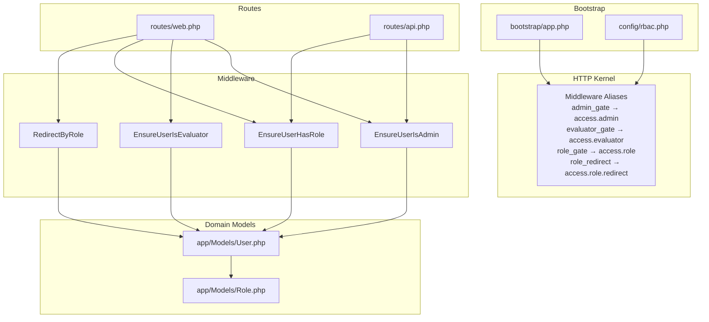
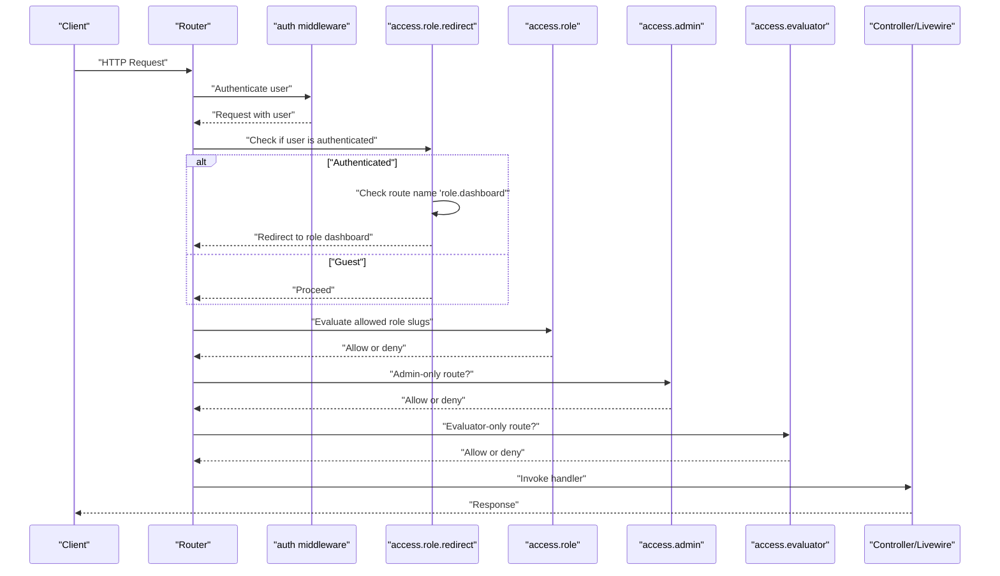
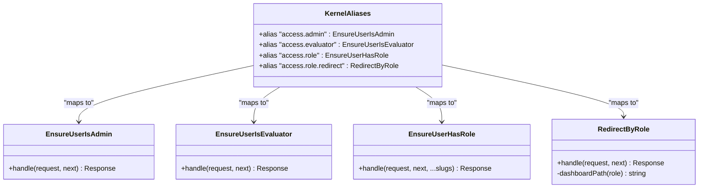
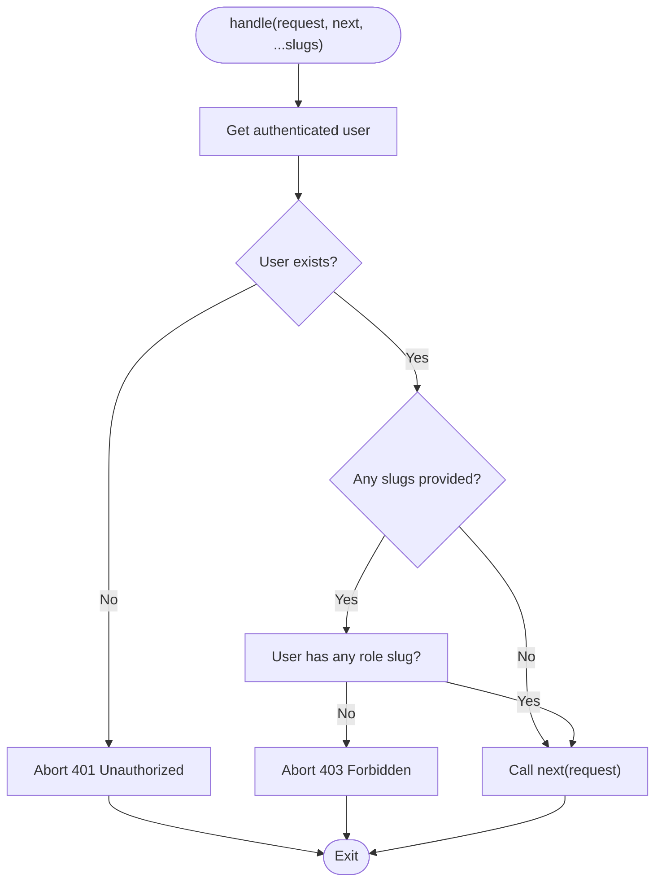
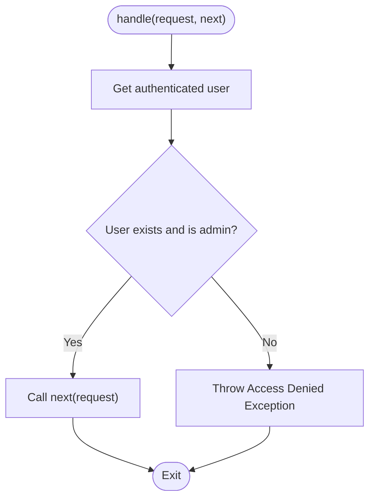
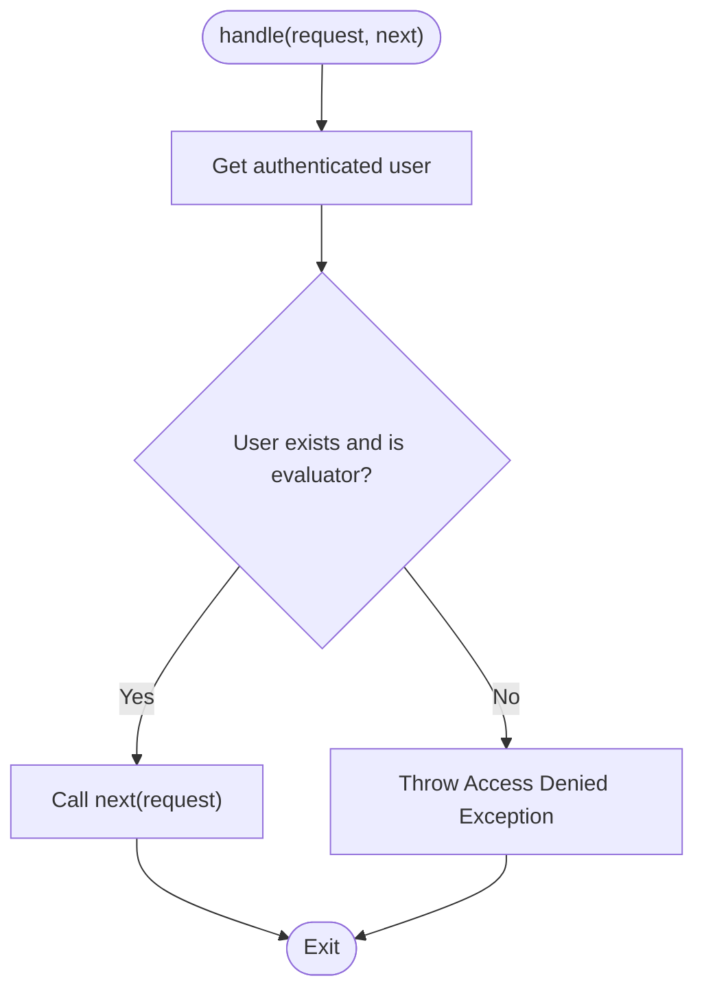
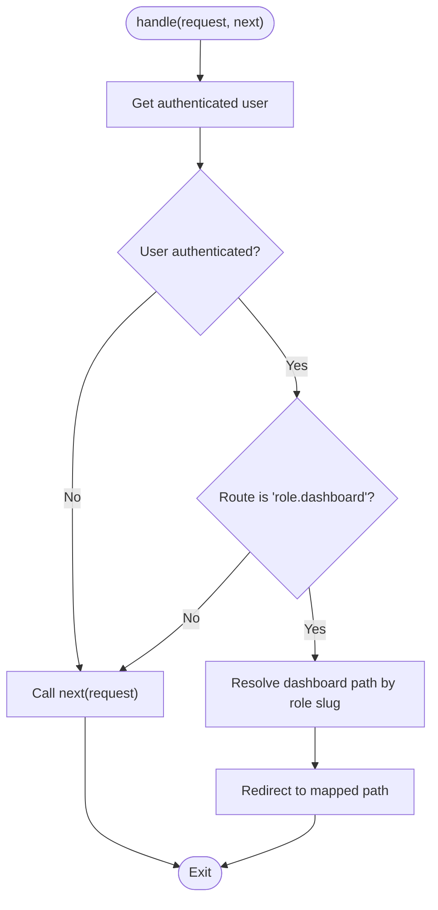
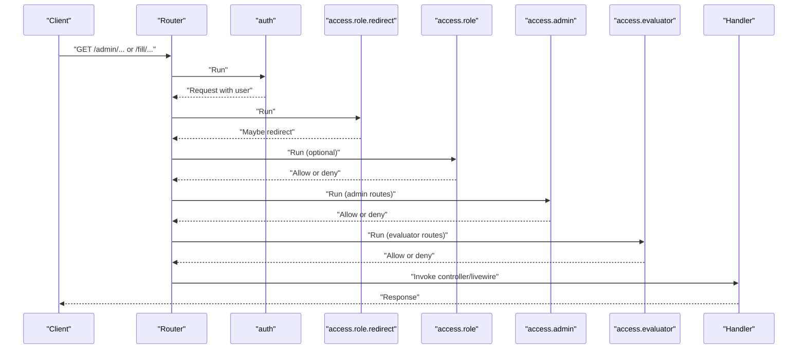
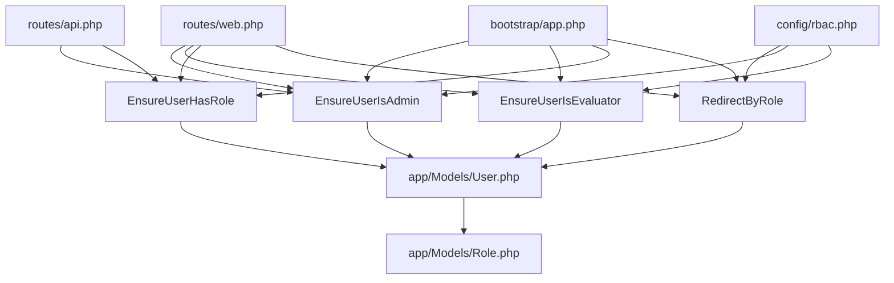

# Middleware Pipeline

<cite>
**Referenced Files in This Document**
- [EnsureUserHasRole.php](file://app/Http/Middleware/EnsureUserHasRole.php)
- [EnsureUserIsAdmin.php](file://app/Http/Middleware/EnsureUserIsAdmin.php)
- [EnsureUserIsEvaluator.php](file://app/Http/Middleware/EnsureUserIsEvaluator.php)
- [RedirectByRole.php](file://app/Http/Middleware/RedirectByRole.php)
- [rbac.php](file://config/rbac.php)
- [web.php](file://routes/web.php)
- [api.php](file://routes/api.php)
- [app.php](file://bootstrap/app.php)
- [User.php](file://app/Models/User.php)
- [Role.php](file://app/Models/Role.php)
</cite>

## Table of Contents
1. [Introduction](#introduction)
2. [Project Structure](#project-structure)
3. [Core Components](#core-components)
4. [Architecture Overview](#architecture-overview)
5. [Detailed Component Analysis](#detailed-component-analysis)
6. [Dependency Analysis](#dependency-analysis)
7. [Performance Considerations](#performance-considerations)
8. [Troubleshooting Guide](#troubleshooting-guide)
9. [Conclusion](#conclusion)

## Introduction
This document explains the middleware pipeline and request processing flow for role-based access control (RBAC) in the application. It covers the middleware chain that enforces authentication and authorization, the order of execution, and how requests are filtered and redirected based on user roles. It also documents the middleware registration process, custom middleware creation patterns, and how middleware integrates with the routing system to enforce security policies.

## Project Structure
The middleware pipeline is configured during application bootstrapping and applied to routes via named aliases. The RBAC configuration centralizes role slugs, middleware aliases, and dashboard redirection paths. Routes define which middleware groups apply to different areas of the application.

**Diagram sources**
- [app.php:17-33](file://bootstrap/app.php#L17-L33)
- [rbac.php:31-36](file://config/rbac.php#L31-L36)
- [web.php:29-33](file://routes/web.php#L29-L33)
- [api.php:6](file://routes/api.php#L6)
- [EnsureUserIsAdmin.php:12](file://app/Http/Middleware/EnsureUserIsAdmin.php#L12)
- [EnsureUserIsEvaluator.php:12](file://app/Http/Middleware/EnsureUserIsEvaluator.php#L12)
- [EnsureUserHasRole.php:11](file://app/Http/Middleware/EnsureUserHasRole.php#L11)
- [RedirectByRole.php:11](file://app/Http/Middleware/RedirectByRole.php#L11)
- [User.php:64](file://app/Models/User.php#L64)
- [Role.php:26](file://app/Models/Role.php#L26)

**Section sources**
- [app.php:17-33](file://bootstrap/app.php#L17-L33)
- [rbac.php:31-36](file://config/rbac.php#L31-L36)
- [web.php:29-33](file://routes/web.php#L29-L33)
- [api.php:6](file://routes/api.php#L6)

## Core Components
This section describes the four middleware components that form the RBAC pipeline and their responsibilities.

- EnsureUserIsAdmin: Enforces admin-only access by verifying the user’s role slug against configured admin slugs.
- EnsureUserIsEvaluator: Enforces evaluator-only access using configured evaluator slugs with a fallback logic for custom role catalogs.
- EnsureUserHasRole: Accepts one or more role slugs as parameters and ensures the user possesses any of them.
- RedirectByRole: Redirects authenticated users to role-specific dashboards based on configuration.

Key implementation characteristics:
- All middleware receive the current Request and a Closure representing the next handler in the pipeline.
- They either abort/throw with appropriate HTTP status codes or call the next middleware/closure to continue processing.
- Role checks delegate to the User model, which reads role slugs from the associated Role record or falls back to a string field.

**Section sources**
- [EnsureUserIsAdmin.php:12-21](file://app/Http/Middleware/EnsureUserIsAdmin.php#L12-L21)
- [EnsureUserIsEvaluator.php:12-21](file://app/Http/Middleware/EnsureUserIsEvaluator.php#L12-L21)
- [EnsureUserHasRole.php:11-25](file://app/Http/Middleware/EnsureUserHasRole.php#L11-L25)
- [RedirectByRole.php:11-24](file://app/Http/Middleware/RedirectByRole.php#L11-L24)
- [User.php:64](file://app/Models/User.php#L64)

## Architecture Overview
The middleware pipeline is registered once during application bootstrap and referenced by aliases in route definitions. The execution order depends on the order of middleware in each route group. The typical flow is:
- Authentication middleware validates credentials and populates the request user.
- Role-aware middleware evaluate permissions and either allow or deny access.
- Redirect middleware inspects the current route and redirects authenticated users to role-appropriate dashboards.

**Diagram sources**
- [web.php:57](file://routes/web.php#L57)
- [web.php:72](file://routes/web.php#L72)
- [web.php:149](file://routes/web.php#L149)
- [api.php:8](file://routes/api.php#L8)
- [app.php:23-28](file://bootstrap/app.php#L23-L28)
- [RedirectByRole.php:11-24](file://app/Http/Middleware/RedirectByRole.php#L11-L24)
- [EnsureUserHasRole.php:11-25](file://app/Http/Middleware/EnsureUserHasRole.php#L11-L25)
- [EnsureUserIsAdmin.php:12-21](file://app/Http/Middleware/EnsureUserIsAdmin.php#L12-L21)
- [EnsureUserIsEvaluator.php:12-21](file://app/Http/Middleware/EnsureUserIsEvaluator.php#L12-L21)

## Detailed Component Analysis

### Middleware Registration and Aliases
- Middleware aliases are defined in the bootstrap configuration and map to concrete middleware classes.
- The alias names are configurable via RBAC configuration and referenced in route definitions.

**Diagram sources**
- [app.php:23-28](file://bootstrap/app.php#L23-L28)
- [rbac.php:31-36](file://config/rbac.php#L31-L36)
- [EnsureUserIsAdmin.php:12](file://app/Http/Middleware/EnsureUserIsAdmin.php#L12)
- [EnsureUserIsEvaluator.php:12](file://app/Http/Middleware/EnsureUserIsEvaluator.php#L12)
- [EnsureUserHasRole.php:11](file://app/Http/Middleware/EnsureUserHasRole.php#L11)
- [RedirectByRole.php:11](file://app/Http/Middleware/RedirectByRole.php#L11)

**Section sources**
- [app.php:17-33](file://bootstrap/app.php#L17-L33)
- [rbac.php:31-36](file://config/rbac.php#L31-L36)

### EnsureUserHasRole Middleware
- Purpose: Gate routes to users possessing any of the specified role slugs.
- Execution: If no slugs are provided, allows immediately. Otherwise, denies access if the user lacks any of the specified slugs.
- Parameterization: Accepts variable-length slug arguments; useful for flexible role gates.

**Diagram sources**
- [EnsureUserHasRole.php:11-25](file://app/Http/Middleware/EnsureUserHasRole.php#L11-L25)

**Section sources**
- [EnsureUserHasRole.php:11-25](file://app/Http/Middleware/EnsureUserHasRole.php#L11-L25)

### EnsureUserIsAdmin Middleware
- Purpose: Enforce admin-only access by validating the user’s role slug against configured admin slugs.
- Execution: Throws an access denied exception if the user is not authenticated or does not have an admin role.

**Diagram sources**
- [EnsureUserIsAdmin.php:12-21](file://app/Http/Middleware/EnsureUserIsAdmin.php#L12-L21)

**Section sources**
- [EnsureUserIsAdmin.php:12-21](file://app/Http/Middleware/EnsureUserIsAdmin.php#L12-L21)
- [User.php:69](file://app/Models/User.php#L69)

### EnsureUserIsEvaluator Middleware
- Purpose: Enforce evaluator-only access using configured evaluator slugs.
- Fallback logic: If evaluator slugs are not configured but the user has a role ID, treat non-admin roles as evaluators.
- Execution: Throws an access denied exception if the user is not authenticated or does not qualify as an evaluator.

**Diagram sources**
- [EnsureUserIsEvaluator.php:12-21](file://app/Http/Middleware/EnsureUserIsEvaluator.php#L12-L21)
- [User.php:74](file://app/Models/User.php#L74)

**Section sources**
- [EnsureUserIsEvaluator.php:12-21](file://app/Http/Middleware/EnsureUserIsEvaluator.php#L12-L21)
- [User.php:74](file://app/Models/User.php#L74)

### RedirectByRole Middleware
- Purpose: Redirect authenticated users visiting the role dashboard route to a role-specific dashboard path.
- Behavior: If the current route is the role dashboard and the user is authenticated, redirect according to the configured mapping; otherwise, pass through.

**Diagram sources**
- [RedirectByRole.php:11-24](file://app/Http/Middleware/RedirectByRole.php#L11-L24)
- [rbac.php:49-62](file://config/rbac.php#L49-L62)

**Section sources**
- [RedirectByRole.php:11-24](file://app/Http/Middleware/RedirectByRole.php#L11-L24)
- [rbac.php:49-62](file://config/rbac.php#L49-L62)

### Middleware Order and Route Integration
- Web routes apply middleware in the order declared in the route definition. Typical order:
  1) auth
  2) access.role.redirect
  3) access.role (and/or access.admin/access.evaluator)
- Admin routes (prefixed with configured admin prefix) use the admin gate alias.
- Evaluator routes (under fill/) use the evaluator gate alias.
- API routes under the admin gate alias restrict administrative endpoints.

**Diagram sources**
- [web.php:57](file://routes/web.php#L57)
- [web.php:72](file://routes/web.php#L72)
- [web.php:149](file://routes/web.php#L149)
- [api.php:8](file://routes/api.php#L8)
- [app.php:23-28](file://bootstrap/app.php#L23-L28)

**Section sources**
- [web.php:57](file://routes/web.php#L57)
- [web.php:72](file://routes/web.php#L72)
- [web.php:149](file://routes/web.php#L149)
- [api.php:8](file://routes/api.php#L8)

## Dependency Analysis
- Middleware depend on the authenticated user being present on the request.
- Role evaluation depends on the User model’s methods, which in turn depend on the Role model relationship and configuration.
- RedirectByRole depends on RBAC configuration for dashboard paths.

**Diagram sources**
- [web.php:29-33](file://routes/web.php#L29-L33)
- [api.php:6](file://routes/api.php#L6)
- [app.php:23-28](file://bootstrap/app.php#L23-L28)
- [rbac.php:31-36](file://config/rbac.php#L31-L36)
- [rbac.php:49-62](file://config/rbac.php#L49-L62)
- [EnsureUserIsAdmin.php:12](file://app/Http/Middleware/EnsureUserIsAdmin.php#L12)
- [EnsureUserIsEvaluator.php:12](file://app/Http/Middleware/EnsureUserIsEvaluator.php#L12)
- [EnsureUserHasRole.php:11](file://app/Http/Middleware/EnsureUserHasRole.php#L11)
- [RedirectByRole.php:11](file://app/Http/Middleware/RedirectByRole.php#L11)
- [User.php:64](file://app/Models/User.php#L64)
- [Role.php:26](file://app/Models/Role.php#L26)

**Section sources**
- [web.php:29-33](file://routes/web.php#L29-L33)
- [api.php:6](file://routes/api.php#L6)
- [app.php:23-28](file://bootstrap/app.php#L23-L28)
- [rbac.php:31-36](file://config/rbac.php#L31-L36)
- [rbac.php:49-62](file://config/rbac.php#L49-L62)
- [User.php:64](file://app/Models/User.php#L64)
- [Role.php:26](file://app/Models/Role.php#L26)

## Performance Considerations
- Role checks are O(n) in the number of configured slugs per middleware invocation; keep slug lists concise.
- RedirectByRole performs a single lookup from configuration; negligible overhead.
- Minimize repeated role evaluations by consolidating middleware usage and avoiding redundant gates.
- Use caching strategies at the application level if role checks become frequent in hot paths.

## Troubleshooting Guide
Common issues and resolutions:
- Unexpected 403 Forbidden:
  - Verify the user’s role slug matches one of the allowed slugs for the route.
  - Confirm the middleware alias is correctly referenced in the route definition.
- Unexpected 401 Unauthorized:
  - Ensure the auth middleware runs before role gates.
- Incorrect redirect after login:
  - Confirm the role dashboard route name matches the expected route name.
  - Verify the role slug resolves to a configured dashboard path.
- Admin/Evaluator routes accessible unexpectedly:
  - Check that the correct middleware alias is applied to the route group.
  - Review RBAC configuration for admin and evaluator slugs.

**Section sources**
- [web.php:57](file://routes/web.php#L57)
- [web.php:72](file://routes/web.php#L72)
- [web.php:149](file://routes/web.php#L149)
- [api.php:8](file://routes/api.php#L8)
- [rbac.php:49-62](file://config/rbac.php#L49-L62)

## Conclusion
The middleware pipeline enforces a layered RBAC policy: authentication precedes role checks, which in turn enforce access to admin, evaluator, or role-gated routes. RedirectByRole ensures authenticated users land on the correct dashboard. The design leverages configurable aliases and centralized RBAC settings, enabling maintainable and flexible security enforcement across web and API routes.