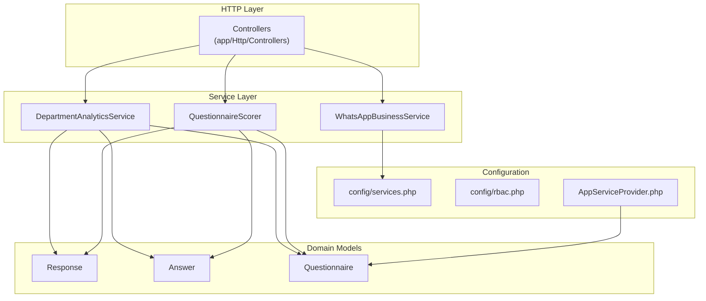
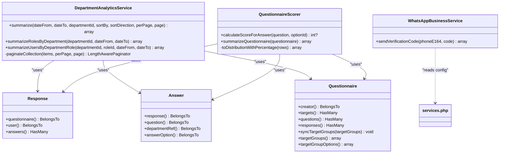
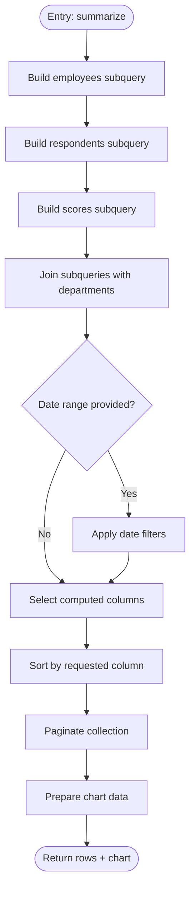
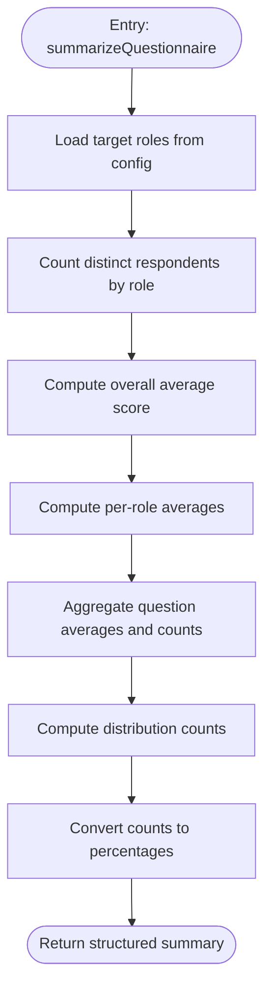
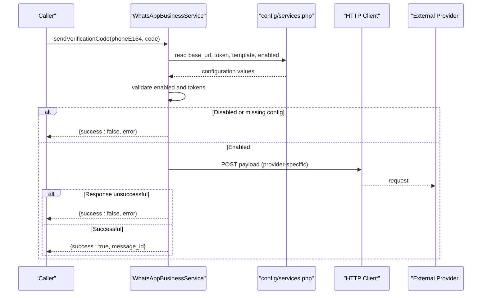
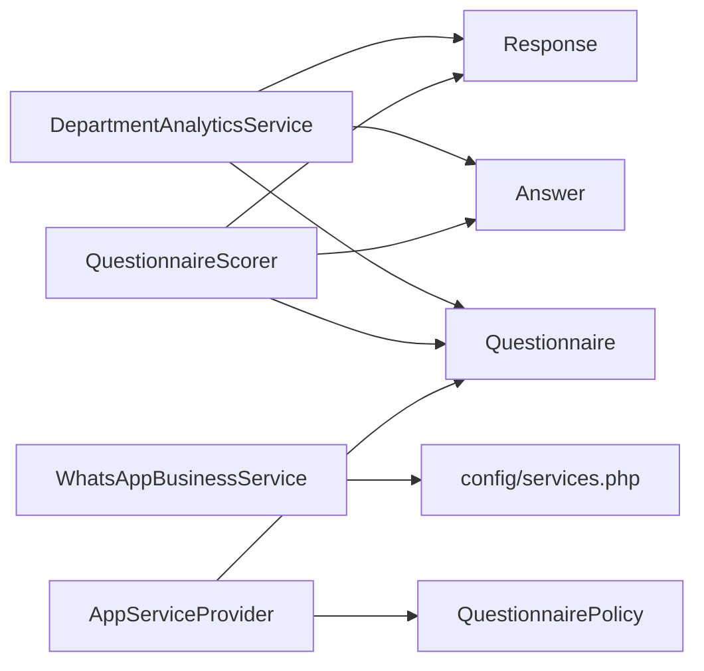

# Service Layer Architecture

<cite>
**Referenced Files in This Document**
- [DepartmentAnalyticsService.php](file://app/Services/DepartmentAnalyticsService.php)
- [QuestionnaireScorer.php](file://app/Services/QuestionnaireScorer.php)
- [WhatsAppBusinessService.php](file://app/Services/WhatsAppBusinessService.php)
- [AppServiceProvider.php](file://app/Providers/AppServiceProvider.php)
- [services.php](file://config/services.php)
- [rbac.php](file://config/rbac.php)
- [Response.php](file://app/Models/Response.php)
- [Answer.php](file://app/Models/Answer.php)
- [Questionnaire.php](file://app/Models/Questionnaire.php)
- [Controller.php](file://app/Http/Controllers/Controller.php)
</cite>

## Table of Contents
1. [Introduction](#introduction)
2. [Project Structure](#project-structure)
3. [Core Components](#core-components)
4. [Architecture Overview](#architecture-overview)
5. [Detailed Component Analysis](#detailed-component-analysis)
6. [Dependency Analysis](#dependency-analysis)
7. [Performance Considerations](#performance-considerations)
8. [Troubleshooting Guide](#troubleshooting-guide)
9. [Conclusion](#conclusion)

## Introduction
This document explains the service layer architecture and business logic organization of the assessment platform. It focuses on three core services:
- DepartmentAnalyticsService for department-level reporting and analytics
- QuestionnaireScorer for assessment scoring and aggregation
- WhatsAppBusinessService for messaging integrations

It also documents separation of concerns between controllers, services, and models, dependency injection patterns, service registration, error handling strategies, and extensibility patterns.

## Project Structure
The service layer resides under app/Services and integrates with Eloquent models under app/Models. Configuration for third-party services is centralized in config/services.php, while role-based access constants are defined in config/rbac.php. Application-wide policy registration occurs in app/Providers/AppServiceProvider.php.

**Diagram sources**
- [Controller.php:1-9](file://app/Http/Controllers/Controller.php#L1-L9)
- [DepartmentAnalyticsService.php:1-279](file://app/Services/DepartmentAnalyticsService.php#L1-L279)
- [QuestionnaireScorer.php:1-139](file://app/Services/QuestionnaireScorer.php#L1-L139)
- [WhatsAppBusinessService.php:1-99](file://app/Services/WhatsAppBusinessService.php#L1-L99)
- [Response.php:1-42](file://app/Models/Response.php#L1-L42)
- [Answer.php:1-44](file://app/Models/Answer.php#L1-L44)
- [Questionnaire.php:1-131](file://app/Models/Questionnaire.php#L1-L131)
- [services.php:1-54](file://config/services.php#L1-L54)
- [rbac.php:1-64](file://config/rbac.php#L1-L64)
- [AppServiceProvider.php:1-28](file://app/Providers/AppServiceProvider.php#L1-L28)

**Section sources**
- [Controller.php:1-9](file://app/Http/Controllers/Controller.php#L1-L9)
- [DepartmentAnalyticsService.php:1-279](file://app/Services/DepartmentAnalyticsService.php#L1-L279)
- [QuestionnaireScorer.php:1-139](file://app/Services/QuestionnaireScorer.php#L1-L139)
- [WhatsAppBusinessService.php:1-99](file://app/Services/WhatsAppBusinessService.php#L1-L99)
- [Response.php:1-42](file://app/Models/Response.php#L1-L42)
- [Answer.php:1-44](file://app/Models/Answer.php#L1-L44)
- [Questionnaire.php:1-131](file://app/Models/Questionnaire.php#L1-L131)
- [services.php:1-54](file://config/services.php#L1-L54)
- [rbac.php:1-64](file://config/rbac.php#L1-L64)
- [AppServiceProvider.php:1-28](file://app/Providers/AppServiceProvider.php#L1-L28)

## Core Components
- DepartmentAnalyticsService: Provides paginated summaries, role-level analytics, and user-level analytics for departments. Uses Eloquent queries, joins, and caching to compute participation rates, average scores, and distributions.
- QuestionnaireScorer: Computes per-answer scores, aggregates overall and per-group averages, and builds question-level statistics and distribution percentages.
- WhatsAppBusinessService: Sends verification codes via configurable providers (WABA/WABLAS) with robust error handling and logging.

These services encapsulate business logic, depend on models for persistence, and rely on configuration for external integrations.

**Section sources**
- [DepartmentAnalyticsService.php:12-95](file://app/Services/DepartmentAnalyticsService.php#L12-L95)
- [QuestionnaireScorer.php:12-112](file://app/Services/QuestionnaireScorer.php#L12-L112)
- [WhatsAppBusinessService.php:8-97](file://app/Services/WhatsAppBusinessService.php#L8-L97)

## Architecture Overview
The service layer follows a clean architecture pattern:
- Controllers orchestrate requests and delegate business logic to services.
- Services encapsulate domain-specific algorithms and coordinate model interactions.
- Models represent domain entities and relationships.
- Configuration files supply runtime settings for external services and policies.

**Diagram sources**
- [DepartmentAnalyticsService.php:12-279](file://app/Services/DepartmentAnalyticsService.php#L12-L279)
- [QuestionnaireScorer.php:12-139](file://app/Services/QuestionnaireScorer.php#L12-L139)
- [WhatsAppBusinessService.php:8-99](file://app/Services/WhatsAppBusinessService.php#L8-L99)
- [Response.php:11-42](file://app/Models/Response.php#L11-L42)
- [Answer.php:10-44](file://app/Models/Answer.php#L10-L44)
- [Questionnaire.php:13-131](file://app/Models/Questionnaire.php#L13-L131)
- [services.php:38-51](file://config/services.php#L38-L51)

## Detailed Component Analysis

### DepartmentAnalyticsService
Responsibilities:
- Compute department-level KPIs: employee counts, respondents, participation rates, and average scores.
- Provide role-level breakdowns within a department.
- Provide user-level breakdowns within a department and role.
- Paginate collection results and build chart-friendly datasets.

Key implementation patterns:
- Subqueries and joins to aggregate counts and averages efficiently.
- Config-driven evaluator slugs for filtering active evaluators.
- Caching for repeated analytics queries.
- Sorting and pagination helpers.

Example method implementations (paths):
- Summarize departments: [summarize:20-95](file://app/Services/DepartmentAnalyticsService.php#L20-L95)
- Summarize roles by department: [summarizeRolesByDepartment:109-189](file://app/Services/DepartmentAnalyticsService.php#L109-L189)
- Summarize users by department and role: [summarizeUsersByDepartmentRole:199-256](file://app/Services/DepartmentAnalyticsService.php#L199-L256)

Processing logic flow (summarize):

**Diagram sources**
- [DepartmentAnalyticsService.php:20-95](file://app/Services/DepartmentAnalyticsService.php#L20-L95)

Error handling and edge cases:
- Defaults invalid sort keys to a safe value.
- Uses COALESCE and rounding to avoid division-by-zero and precision issues.
- Returns empty collections safely converted to arrays.

Extensibility:
- New metrics can be added by extending selectRaw and aggregation subqueries.
- Pagination logic is centralized in a private helper.

**Section sources**
- [DepartmentAnalyticsService.php:12-279](file://app/Services/DepartmentAnalyticsService.php#L12-L279)
- [rbac.php:4-6](file://config/rbac.php#L4-L6)

### QuestionnaireScorer
Responsibilities:
- Calculate per-answer scores based on selected options.
- Aggregate overall and per-group averages.
- Produce question-level statistics and score distributions with percentages.

Key implementation patterns:
- Uses model relationships to traverse answers, responses, and questions.
- Leverages database aggregation functions for averages and counts.
- Converts raw DB rows into structured summary arrays.

Example method implementations (paths):
- Score calculation: [calculateScoreForAnswer:14-23](file://app/Services/QuestionnaireScorer.php#L14-L23)
- Questionnaire summary: [summarizeQuestionnaire:33-112](file://app/Services/QuestionnaireScorer.php#L33-L112)

Processing logic flow (summarizeQuestionnaire):

**Diagram sources**
- [QuestionnaireScorer.php:33-112](file://app/Services/QuestionnaireScorer.php#L33-L112)

Error handling and edge cases:
- Null option IDs return null scores.
- Averages default to zero when no valid scores exist.
- Percentages avoid division-by-zero by using safe totals.

Extensibility:
- Additional grouping or metrics can be added to the aggregation selects.
- Distribution computation is encapsulated in a private helper.

**Section sources**
- [QuestionnaireScorer.php:12-139](file://app/Services/QuestionnaireScorer.php#L12-L139)
- [rbac.php:6-11](file://config/rbac.php#L6-L11)

### WhatsAppBusinessService
Responsibilities:
- Send login verification codes via configured providers.
- Support two provider modes: Meta Business Platform and WABLAS.
- Centralized configuration and robust error handling/logging.

Key implementation patterns:
- Reads configuration from config/services.php for base URLs, tokens, and templates.
- Detects provider type and constructs appropriate payloads.
- Uses HTTP client with timeouts and JSON handling.
- Logs warnings for disabled or misconfigured services and errors for failed sends.

Example method implementations (paths):
- Verification code sending: [sendVerificationCode:13-97](file://app/Services/WhatsAppBusinessService.php#L13-L97)

Sequence flow (sendVerificationCode):

**Diagram sources**
- [WhatsAppBusinessService.php:13-97](file://app/Services/WhatsAppBusinessService.php#L13-L97)
- [services.php:38-51](file://config/services.php#L38-L51)

Error handling and edge cases:
- Graceful skip when service is disabled or configuration is incomplete.
- Detailed logging on failures with status and response bodies.
- Message ID extraction supports multiple provider response shapes.

Extensibility:
- New providers can be supported by adding detection logic and payload construction.
- Template customization and language support can be extended via configuration.

**Section sources**
- [WhatsAppBusinessService.php:8-99](file://app/Services/WhatsAppBusinessService.php#L8-L99)
- [services.php:38-51](file://config/services.php#L38-L51)

## Dependency Analysis
Service-layer dependencies and relationships:
- DepartmentAnalyticsService depends on Response, Answer, and Questionnaire models for aggregations and joins.
- QuestionnaireScorer depends on Response, Answer, and Questionnaire models for scoring and summaries.
- WhatsAppBusinessService depends on configuration values for provider settings.

**Diagram sources**
- [DepartmentAnalyticsService.php:12-279](file://app/Services/DepartmentAnalyticsService.php#L12-L279)
- [QuestionnaireScorer.php:12-139](file://app/Services/QuestionnaireScorer.php#L12-L139)
- [WhatsAppBusinessService.php:8-99](file://app/Services/WhatsAppBusinessService.php#L8-L99)
- [Response.php:11-42](file://app/Models/Response.php#L11-L42)
- [Answer.php:10-44](file://app/Models/Answer.php#L10-L44)
- [Questionnaire.php:13-131](file://app/Models/Questionnaire.php#L13-L131)
- [AppServiceProvider.php:10-27](file://app/Providers/AppServiceProvider.php#L10-L27)
- [services.php:38-51](file://config/services.php#L38-L51)

**Section sources**
- [DepartmentAnalyticsService.php:12-279](file://app/Services/DepartmentAnalyticsService.php#L12-L279)
- [QuestionnaireScorer.php:12-139](file://app/Services/QuestionnaireScorer.php#L12-L139)
- [WhatsAppBusinessService.php:8-99](file://app/Services/WhatsAppBusinessService.php#L8-L99)
- [Response.php:11-42](file://app/Models/Response.php#L11-L42)
- [Answer.php:10-44](file://app/Models/Answer.php#L10-L44)
- [Questionnaire.php:13-131](file://app/Models/Questionnaire.php#L13-L131)
- [AppServiceProvider.php:10-27](file://app/Providers/AppServiceProvider.php#L10-L27)
- [services.php:38-51](file://config/services.php#L38-L51)

## Performance Considerations
- Aggregation efficiency: Services use subqueries and grouped aggregations to minimize N+1 queries and reduce memory overhead.
- Caching: DepartmentAnalyticsService caches role and user-level analytics for short TTLs to reduce repeated heavy computations.
- Pagination: A dedicated paginator helper ensures efficient slicing of large result sets.
- Database indexing: Ensure indexes exist on frequently filtered columns (e.g., responses.status, responses.submitted_at, answers.calculated_score).
- Configuration reads: Reuse cached config values; avoid repeated reads in tight loops.

[No sources needed since this section provides general guidance]

## Troubleshooting Guide
Common issues and resolutions:
- WhatsApp service disabled or misconfigured:
  - Verify service flags and tokens in configuration.
  - Check logs for skipped or failed send attempts.
  - Paths: [sendVerificationCode:28-35](file://app/Services/WhatsAppBusinessService.php#L28-L35), [services.php:38-51](file://config/services.php#L38-L51)
- Analytics returning zeros or unexpected participation rates:
  - Confirm evaluator role slugs and active users.
  - Validate date filters and department membership.
  - Paths: [summarize:20-95](file://app/Services/DepartmentAnalyticsService.php#L20-L95), [rbac.php:4-6](file://config/rbac.php#L4-L6)
- Scoring inconsistencies:
  - Ensure answer options have scores and responses are submitted.
  - Paths: [calculateScoreForAnswer:14-23](file://app/Services/QuestionnaireScorer.php#L14-L23), [summarizeQuestionnaire:33-112](file://app/Services/QuestionnaireScorer.php#L33-L112)
- Policy-related access control:
  - Confirm policy registration for Questionnaire model.
  - Paths: [boot:23-26](file://app/Providers/AppServiceProvider.php#L23-L26)

**Section sources**
- [WhatsAppBusinessService.php:28-35](file://app/Services/WhatsAppBusinessService.php#L28-L35)
- [services.php:38-51](file://config/services.php#L38-L51)
- [DepartmentAnalyticsService.php:20-95](file://app/Services/DepartmentAnalyticsService.php#L20-L95)
- [rbac.php:4-6](file://config/rbac.php#L4-L6)
- [QuestionnaireScorer.php:14-23](file://app/Services/QuestionnaireScorer.php#L14-L23)
- [AppServiceProvider.php:23-26](file://app/Providers/AppServiceProvider.php#L23-L26)

## Conclusion
The service layer cleanly separates business logic from HTTP and presentation concerns. DepartmentAnalyticsService, QuestionnaireScorer, and WhatsAppBusinessService each encapsulate focused responsibilities, leverage models for persistence, and consume configuration for external integrations. The architecture supports scalability through caching, efficient aggregations, and clear extension points for new metrics, providers, and scoring rules.