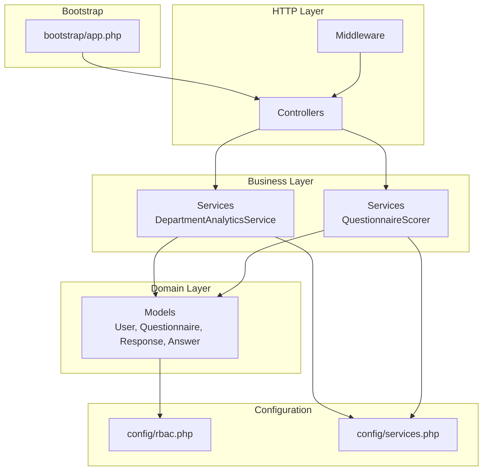
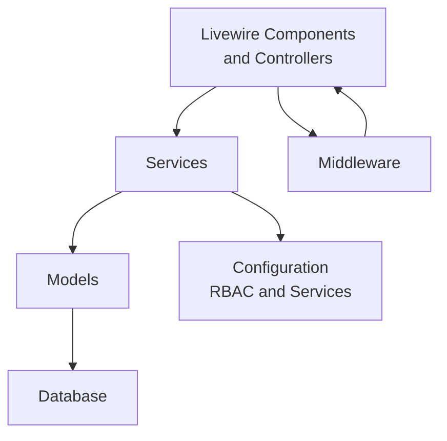
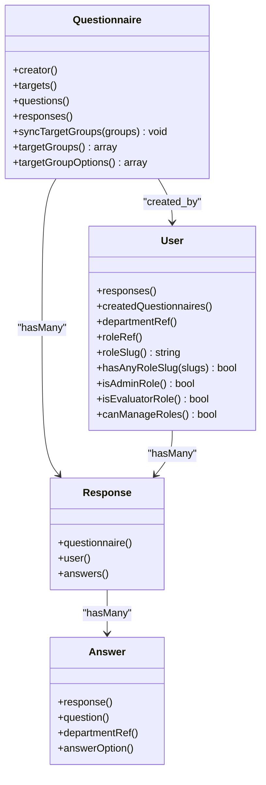
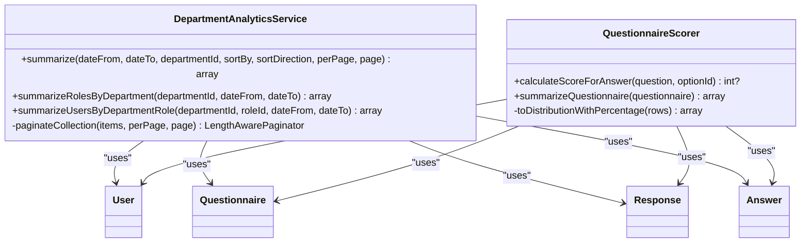
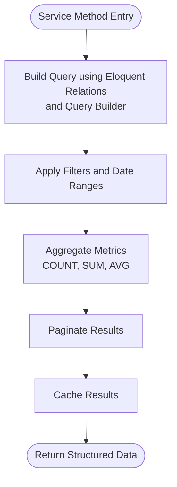
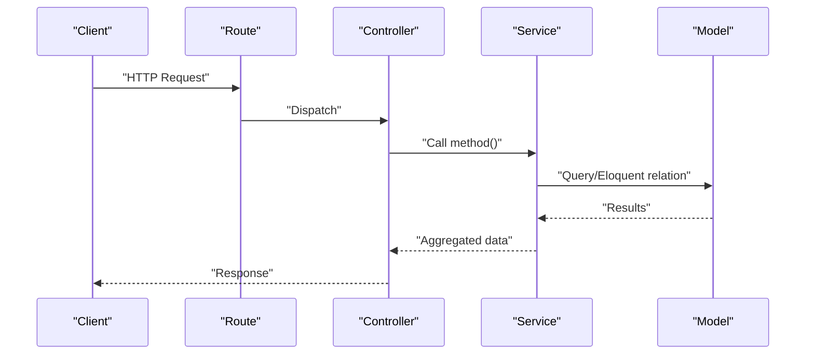
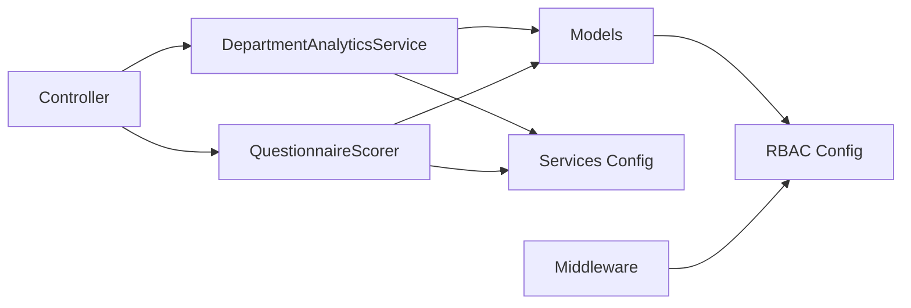

# System Design Patterns

<cite>
**Referenced Files in This Document**
- [app.php](file://bootstrap/app.php)
- [AppServiceProvider.php](file://app/Providers/AppServiceProvider.php)
- [DepartmentAnalyticsService.php](file://app/Services/DepartmentAnalyticsService.php)
- [QuestionnaireScorer.php](file://app/Services/QuestionnaireScorer.php)
- [User.php](file://app/Models/User.php)
- [Questionnaire.php](file://app/Models/Questionnaire.php)
- [Response.php](file://app/Models/Response.php)
- [Answer.php](file://app/Models/Answer.php)
- [services.php](file://config/services.php)
- [rbac.php](file://config/rbac.php)
</cite>

## Table of Contents
1. [Introduction](#introduction)
2. [Project Structure](#project-structure)
3. [Core Components](#core-components)
4. [Architecture Overview](#architecture-overview)
5. [Detailed Component Analysis](#detailed-component-analysis)
6. [Dependency Analysis](#dependency-analysis)
7. [Performance Considerations](#performance-considerations)
8. [Troubleshooting Guide](#troubleshooting-guide)
9. [Conclusion](#conclusion)

## Introduction
This document explains the system design patterns implemented in the assessment platform, focusing on:
- Model-View-Controller (MVC) pattern usage
- Service Layer pattern for business logic separation
- Repository pattern for data access
- Dependency injection container usage
- Singleton patterns for services
- Factory patterns for model creation

It also highlights the benefits of each pattern choice and how they contribute to maintainability and testability.

## Project Structure
The application follows Laravel conventions:
- Models under app/Models represent domain entities and encapsulate persistence via Eloquent.
- Services under app/Services encapsulate business logic and orchestrate model interactions.
- Controllers under app/Http/Controllers handle HTTP requests and delegate to services.
- Livewire components under app/Livewire provide interactive UI logic.
- Configuration files under config define runtime behavior (RBAC, third-party services).
- The bootstrap/app.php configures routing, middleware aliases, and CSRF exceptions.

**Diagram sources**
- [app.php:10-36](file://bootstrap/app.php#L10-L36)
- [DepartmentAnalyticsService.php:12-95](file://app/Services/DepartmentAnalyticsService.php#L12-L95)
- [QuestionnaireScorer.php:12-112](file://app/Services/QuestionnaireScorer.php#L12-L112)
- [User.php:12-94](file://app/Models/User.php#L12-L94)
- [Questionnaire.php:13-131](file://app/Models/Questionnaire.php#L13-L131)
- [Response.php:11-42](file://app/Models/Response.php#L11-L42)
- [Answer.php:10-44](file://app/Models/Answer.php#L10-L44)
- [rbac.php:1-64](file://config/rbac.php#L1-L64)
- [services.php:1-54](file://config/services.php#L1-L54)

**Section sources**
- [app.php:10-36](file://bootstrap/app.php#L10-L36)
- [rbac.php:1-64](file://config/rbac.php#L1-L64)
- [services.php:1-54](file://config/services.php#L1-L54)

## Core Components
- Models: Encapsulate entity state and relations (Eloquent). Examples include User, Questionnaire, Response, Answer.
- Services: Business logic modules that coordinate models and external configurations.
- Controllers: HTTP entry points that receive requests, validate inputs, and call services.
- Livewire Components: Interactive UI components that encapsulate presentation and behavior.
- Middleware: Cross-cutting concerns for authorization and request shaping.
- Configuration: RBAC and third-party service credentials.

Benefits:
- Separation of concerns improves maintainability and testability.
- Centralized business logic in services reduces duplication and increases reusability.
- Eloquent models provide a familiar ORM interface for data access.

**Section sources**
- [User.php:12-94](file://app/Models/User.php#L12-L94)
- [Questionnaire.php:13-131](file://app/Models/Questionnaire.php#L13-L131)
- [Response.php:11-42](file://app/Models/Response.php#L11-L42)
- [Answer.php:10-44](file://app/Models/Answer.php#L10-L44)
- [DepartmentAnalyticsService.php:12-95](file://app/Services/DepartmentAnalyticsService.php#L12-L95)
- [QuestionnaireScorer.php:12-112](file://app/Services/QuestionnaireScorer.php#L12-L112)

## Architecture Overview
The system adheres to layered architecture:
- Presentation: Controllers and Livewire components
- Application: Services orchestrating business rules
- Domain: Eloquent models and relations
- Infrastructure: Configuration and third-party integrations

**Diagram sources**
- [DepartmentAnalyticsService.php:12-95](file://app/Services/DepartmentAnalyticsService.php#L12-L95)
- [QuestionnaireScorer.php:12-112](file://app/Services/QuestionnaireScorer.php#L12-L112)
- [User.php:12-94](file://app/Models/User.php#L12-L94)
- [Questionnaire.php:13-131](file://app/Models/Questionnaire.php#L13-L131)
- [Response.php:11-42](file://app/Models/Response.php#L11-L42)
- [Answer.php:10-44](file://app/Models/Answer.php#L10-L44)
- [rbac.php:1-64](file://config/rbac.php#L1-L64)
- [services.php:1-54](file://config/services.php#L1-L54)

## Detailed Component Analysis

### Model-View-Controller (MVC) Pattern
- View: Blade templates and Livewire components render UI and bind reactive state.
- Controller: HTTP controllers receive requests and delegate to services.
- Model: Eloquent models encapsulate entity state and relations.

Implementation evidence:
- Controllers extend a base controller class and rely on services for business logic.
- Livewire components encapsulate UI and state transitions.
- Models define relations and attributes for persistence.

**Diagram sources**
- [User.php:12-94](file://app/Models/User.php#L12-L94)
- [Questionnaire.php:13-131](file://app/Models/Questionnaire.php#L13-L131)
- [Response.php:11-42](file://app/Models/Response.php#L11-L42)
- [Answer.php:10-44](file://app/Models/Answer.php#L10-L44)

**Section sources**
- [User.php:12-94](file://app/Models/User.php#L12-L94)
- [Questionnaire.php:13-131](file://app/Models/Questionnaire.php#L13-L131)
- [Response.php:11-42](file://app/Models/Response.php#L11-L42)
- [Answer.php:10-44](file://app/Models/Answer.php#L10-L44)

### Service Layer Pattern
Services encapsulate business logic and coordinate models and configuration.

Examples:
- DepartmentAnalyticsService: Aggregates analytics across departments, roles, and users; paginates results; caches outcomes.
- QuestionnaireScorer: Computes scores per answer and generates questionnaire summaries.

**Diagram sources**
- [DepartmentAnalyticsService.php:12-279](file://app/Services/DepartmentAnalyticsService.php#L12-L279)
- [QuestionnaireScorer.php:12-139](file://app/Services/QuestionnaireScorer.php#L12-L139)
- [User.php:12-94](file://app/Models/User.php#L12-L94)
- [Questionnaire.php:13-131](file://app/Models/Questionnaire.php#L13-L131)
- [Response.php:11-42](file://app/Models/Response.php#L11-L42)
- [Answer.php:10-44](file://app/Models/Answer.php#L10-L44)

Benefits:
- Centralizes business logic outside controllers and Livewire components.
- Improves testability by enabling unit tests against service methods.
- Enables caching and pagination logic to be contained within services.

**Section sources**
- [DepartmentAnalyticsService.php:12-95](file://app/Services/DepartmentAnalyticsService.php#L12-L95)
- [DepartmentAnalyticsService.php:109-189](file://app/Services/DepartmentAnalyticsService.php#L109-L189)
- [DepartmentAnalyticsService.php:199-256](file://app/Services/DepartmentAnalyticsService.php#L199-L256)
- [QuestionnaireScorer.php:12-112](file://app/Services/QuestionnaireScorer.php#L12-L112)

### Repository Pattern for Data Access
While explicit repositories are not defined as separate classes, the codebase leverages:
- Eloquent models as repositories for persistence operations.
- Query Builder for complex aggregations and joins.
- Soft deletes and transactions for data integrity.

Evidence:
- Models expose relations and attribute casts.
- Services compose queries using DB::table and Eloquent relations.
- Transactions wrap synchronization operations.

**Diagram sources**
- [DepartmentAnalyticsService.php:20-95](file://app/Services/DepartmentAnalyticsService.php#L20-L95)
- [QuestionnaireScorer.php:33-112](file://app/Services/QuestionnaireScorer.php#L33-L112)

**Section sources**
- [Questionnaire.php:55-83](file://app/Models/Questionnaire.php#L55-L83)
- [DepartmentAnalyticsService.php:20-95](file://app/Services/DepartmentAnalyticsService.php#L20-L95)
- [QuestionnaireScorer.php:33-112](file://app/Services/QuestionnaireScorer.php#L33-L112)

### Dependency Injection Container Usage
- The framework’s container resolves dependencies automatically for controllers and services.
- Middleware registration demonstrates container-managed bindings.
- Policies are bound via the service provider, leveraging container resolution.

Evidence:
- bootstrap/app.php registers middleware aliases and routes.
- AppServiceProvider binds policies to models.

**Diagram sources**
- [app.php:10-36](file://bootstrap/app.php#L10-L36)
- [AppServiceProvider.php:23-26](file://app/Providers/AppServiceProvider.php#L23-L26)

**Section sources**
- [app.php:17-32](file://bootstrap/app.php#L17-L32)
- [AppServiceProvider.php:23-26](file://app/Providers/AppServiceProvider.php#L23-L26)

### Singleton Patterns for Services
- Services are stateless and instantiated by the container; they behave like singletons during a request lifecycle.
- Benefits: Shared configuration access, reduced memory footprint, predictable behavior.

Evidence:
- Services depend on configuration and facades (Cache, DB) managed by the container.

**Section sources**
- [DepartmentAnalyticsService.php:9-10](file://app/Services/DepartmentAnalyticsService.php#L9-L10)
- [QuestionnaireScorer.php:9-10](file://app/Services/QuestionnaireScorer.php#L9-L10)

### Factory Patterns for Model Creation
- Eloquent factories are used for seeding and testing, enabling controlled creation of model instances.
- Factories are defined under database/factories and support mass creation and attribute customization.

Evidence:
- Factories for Answer, AnswerOption, Question, Questionnaire, QuestionnaireTarget, Response, and User exist.

**Section sources**
- [Answer.php:10-44](file://app/Models/Answer.php#L10-L44)
- [Questionnaire.php:13-131](file://app/Models/Questionnaire.php#L13-L131)
- [Response.php:11-42](file://app/Models/Response.php#L11-L42)

## Dependency Analysis
- Controllers depend on Services for business logic.
- Services depend on Models and configuration.
- Models depend on Eloquent and configuration for roles and slugs.
- Middleware depends on RBAC configuration for role gates.
- Third-party service configuration is consumed by services and components.

**Diagram sources**
- [DepartmentAnalyticsService.php:12-95](file://app/Services/DepartmentAnalyticsService.php#L12-L95)
- [QuestionnaireScorer.php:12-112](file://app/Services/QuestionnaireScorer.php#L12-L112)
- [User.php:12-94](file://app/Models/User.php#L12-L94)
- [rbac.php:1-64](file://config/rbac.php#L1-L64)
- [services.php:1-54](file://config/services.php#L1-L54)

**Section sources**
- [rbac.php:1-64](file://config/rbac.php#L1-L64)
- [services.php:1-54](file://config/services.php#L1-L54)

## Performance Considerations
- Caching: Services cache analytics results for a short TTL to reduce repeated heavy queries.
- Pagination: Services paginate collections to limit payload sizes and improve responsiveness.
- Aggregation queries: Services use joins and grouped aggregates to compute metrics efficiently.
- Transactions: Synchronization operations are wrapped in transactions to maintain consistency.

Recommendations:
- Monitor cache hit rates and adjust TTLs based on data volatility.
- Add database indexes for frequently filtered columns (e.g., submitted_at, status).
- Consider precomputing aggregates for dashboards if real-time updates are not required.

**Section sources**
- [DepartmentAnalyticsService.php:114-119](file://app/Services/DepartmentAnalyticsService.php#L114-L119)
- [DepartmentAnalyticsService.php:261-277](file://app/Services/DepartmentAnalyticsService.php#L261-L277)
- [QuestionnaireScorer.php:118-137](file://app/Services/QuestionnaireScorer.php#L118-L137)

## Troubleshooting Guide
Common issues and resolutions:
- Authorization failures: Verify RBAC slugs and middleware aliases in configuration.
- Missing analytics data: Confirm cache keys and TTL; clear cache if stale.
- Incorrect scoring: Validate questionnaire target groups and scoring logic in services.
- Role-based redirects: Ensure role aliases and dashboard paths align with RBAC configuration.

**Section sources**
- [rbac.php:1-64](file://config/rbac.php#L1-L64)
- [services.php:38-51](file://config/services.php#L38-L51)

## Conclusion
The assessment platform employs well-defined patterns that promote clean separation of concerns:
- MVC separates presentation from business logic.
- Service Layer centralizes business rules and improves testability.
- Repository-style usage via Eloquent and Query Builder ensures flexible data access.
- Dependency injection and policy binding streamline cross-cutting concerns.
- Caching and pagination enhance performance.
These patterns collectively improve maintainability, scalability, and developer productivity.