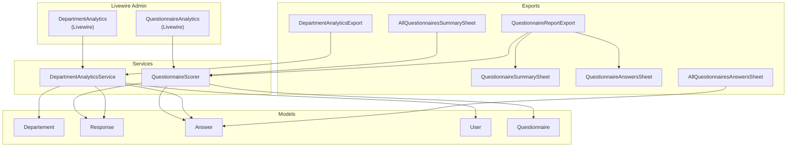
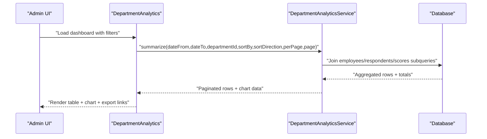
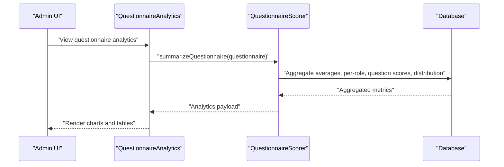
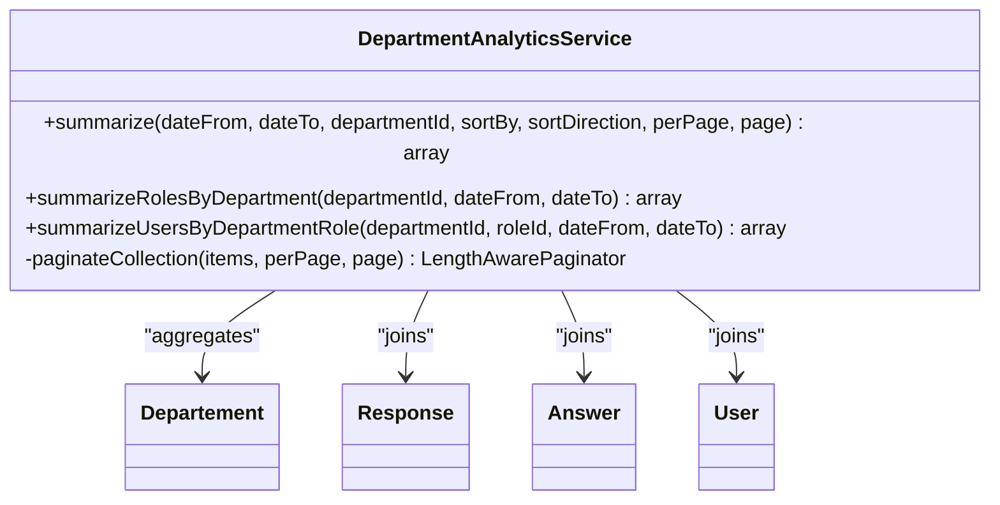
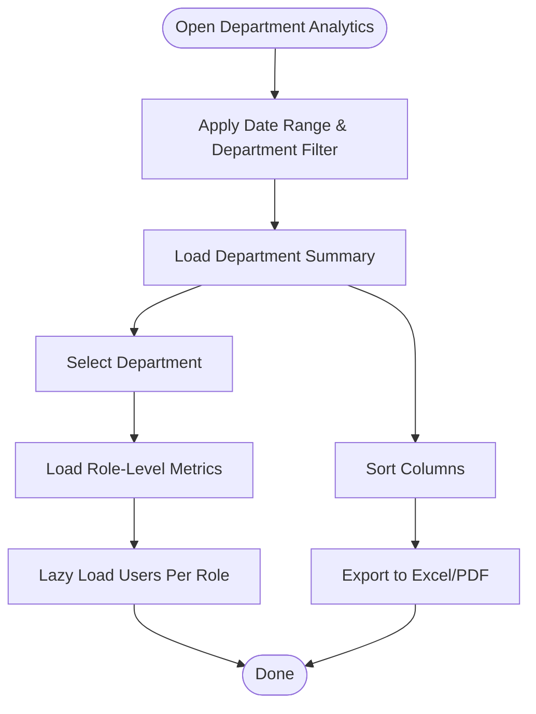
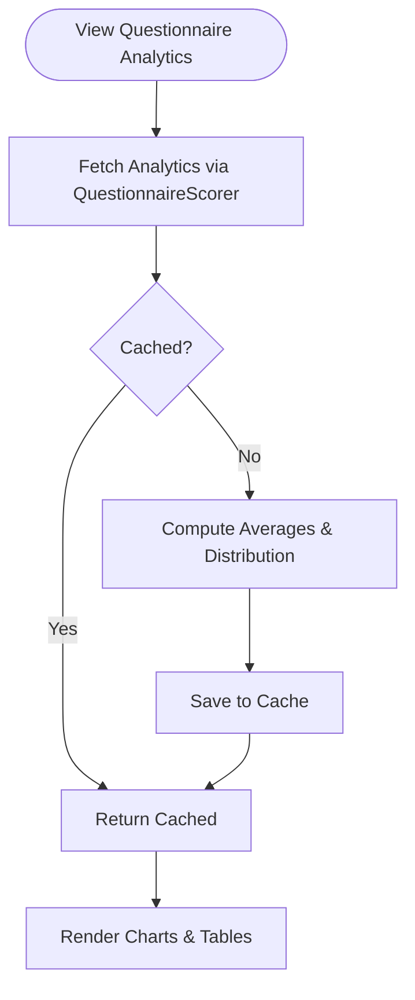
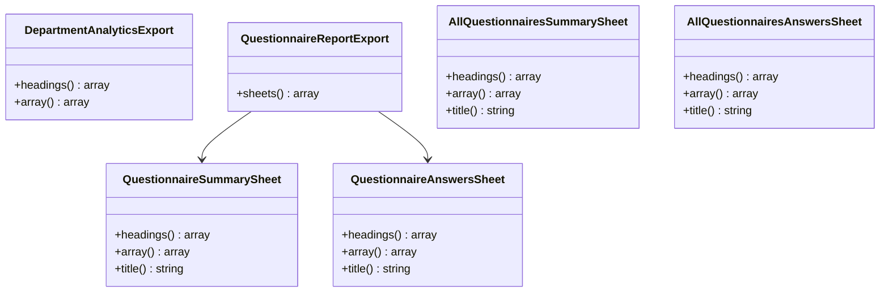
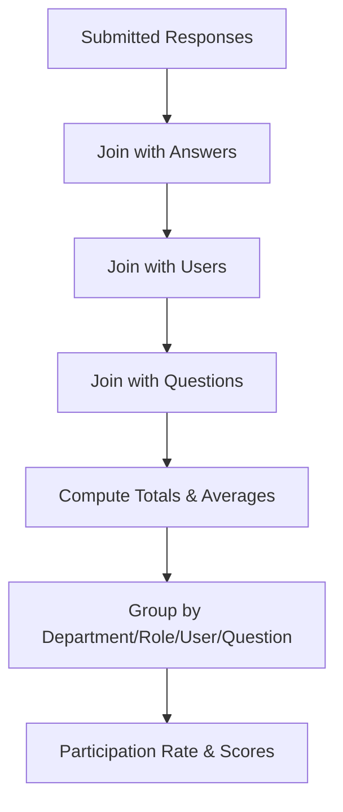
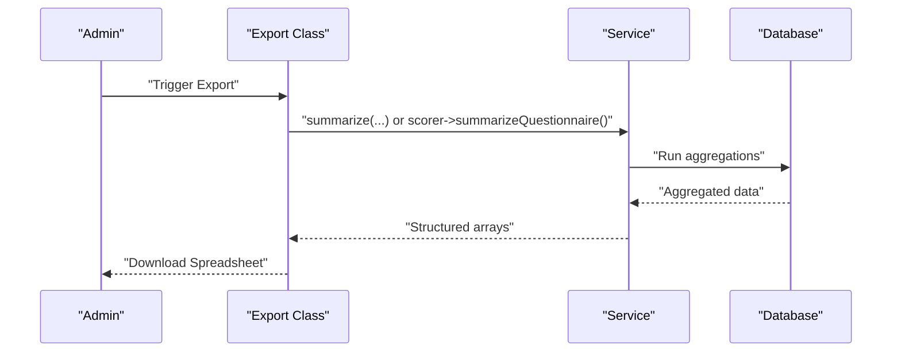
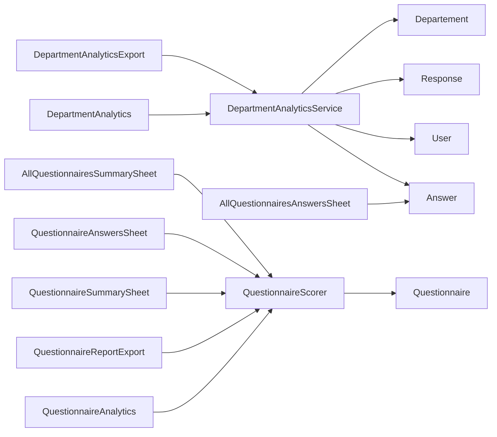

# Analytics and Reporting

<cite>
**Referenced Files in This Document**
- [DepartmentAnalyticsService.php](file://app/Services/DepartmentAnalyticsService.php)
- [DepartmentAnalytics.php](file://app/Livewire/Admin/DepartmentAnalytics.php)
- [QuestionnaireAnalytics.php](file://app/Livewire/Admin/QuestionnaireAnalytics.php)
- [DepartmentAnalyticsExport.php](file://app/Exports/DepartmentAnalyticsExport.php)
- [QuestionnaireReportExport.php](file://app/Exports/QuestionnaireReportExport.php)
- [AllQuestionnairesAnswersSheet.php](file://app/Exports/Sheets/AllQuestionnairesAnswersSheet.php)
- [AllQuestionnairesSummarySheet.php](file://app/Exports/Sheets/AllQuestionnairesSummarySheet.php)
- [QuestionnaireAnswersSheet.php](file://app/Exports/Sheets/QuestionnaireAnswersSheet.php)
- [QuestionnaireSummarySheet.php](file://app/Exports/Sheets/QuestionnaireSummarySheet.php)
- [QuestionnaireScorer.php](file://app/Services/QuestionnaireScorer.php)
- [Departement.php](file://app/Models/Departement.php)
- [Response.php](file://app/Models/Response.php)
- [Answer.php](file://app/Models/Answer.php)
- [User.php](file://app/Models/User.php)
- [Questionnaire.php](file://app/Models/Questionnaire.php)
</cite>

## Table of Contents
1. [Introduction](#introduction)
2. [Project Structure](#project-structure)
3. [Core Components](#core-components)
4. [Architecture Overview](#architecture-overview)
5. [Detailed Component Analysis](#detailed-component-analysis)
6. [Dependency Analysis](#dependency-analysis)
7. [Performance Considerations](#performance-considerations)
8. [Troubleshooting Guide](#troubleshooting-guide)
9. [Conclusion](#conclusion)
10. [Appendices](#appendices)

## Introduction
This document describes the analytics and reporting system for department-level assessments and questionnaire insights. It covers:
- Department-level dashboard: assessment trends, performance metrics, and comparative analysis
- Questionnaire-specific analytics: response rates, scoring distributions, and completion statistics
- Export capabilities for spreadsheets and PDFs
- Implementation of DepartmentAnalyticsService, data aggregation algorithms, and report generation workflows
- Examples of common analytical queries and visualization patterns

## Project Structure
The analytics and reporting features are implemented across Livewire components, services, and Excel export classes:
- Livewire Admin components render dashboards and charts
- Services encapsulate data aggregation and scoring logic
- Export classes produce spreadsheets with multiple sheets
- Eloquent models define the domain and relationships

**Diagram sources**
- [DepartmentAnalytics.php:1-271](file://app/Livewire/Admin/DepartmentAnalytics.php#L1-L271)
- [QuestionnaireAnalytics.php:1-74](file://app/Livewire/Admin/QuestionnaireAnalytics.php#L1-L74)
- [DepartmentAnalyticsService.php:1-279](file://app/Services/DepartmentAnalyticsService.php#L1-L279)
- [QuestionnaireScorer.php:1-139](file://app/Services/QuestionnaireScorer.php#L1-L139)
- [DepartmentAnalyticsExport.php:1-51](file://app/Exports/DepartmentAnalyticsExport.php#L1-L51)
- [QuestionnaireReportExport.php:1-29](file://app/Exports/QuestionnaireReportExport.php#L1-L29)
- [QuestionnaireSummarySheet.php:1-77](file://app/Exports/Sheets/QuestionnaireSummarySheet.php#L1-L77)
- [QuestionnaireAnswersSheet.php:1-91](file://app/Exports/Sheets/QuestionnaireAnswersSheet.php#L1-L91)
- [AllQuestionnairesSummarySheet.php:1-75](file://app/Exports/Sheets/AllQuestionnairesSummarySheet.php#L1-L75)
- [AllQuestionnairesAnswersSheet.php:1-87](file://app/Exports/Sheets/AllQuestionnairesAnswersSheet.php#L1-L87)
- [Departement.php:1-34](file://app/Models/Departement.php#L1-L34)
- [Response.php:1-42](file://app/Models/Response.php#L1-L42)
- [Answer.php:1-44](file://app/Models/Answer.php#L1-L44)
- [User.php:1-94](file://app/Models/User.php#L1-L94)
- [Questionnaire.php:1-131](file://app/Models/Questionnaire.php#L1-L131)

**Section sources**
- [DepartmentAnalytics.php:1-271](file://app/Livewire/Admin/DepartmentAnalytics.php#L1-L271)
- [QuestionnaireAnalytics.php:1-74](file://app/Livewire/Admin/QuestionnaireAnalytics.php#L1-L74)
- [DepartmentAnalyticsService.php:1-279](file://app/Services/DepartmentAnalyticsService.php#L1-L279)
- [QuestionnaireScorer.php:1-139](file://app/Services/QuestionnaireScorer.php#L1-L139)
- [DepartmentAnalyticsExport.php:1-51](file://app/Exports/DepartmentAnalyticsExport.php#L1-L51)
- [QuestionnaireReportExport.php:1-29](file://app/Exports/QuestionnaireReportExport.php#L1-L29)
- [QuestionnaireSummarySheet.php:1-77](file://app/Exports/Sheets/QuestionnaireSummarySheet.php#L1-L77)
- [QuestionnaireAnswersSheet.php:1-91](file://app/Exports/Sheets/QuestionnaireAnswersSheet.php#L1-L91)
- [AllQuestionnairesSummarySheet.php:1-75](file://app/Exports/Sheets/AllQuestionnairesSummarySheet.php#L1-L75)
- [AllQuestionnairesAnswersSheet.php:1-87](file://app/Exports/Sheets/AllQuestionnairesAnswersSheet.php#L1-L87)
- [Departement.php:1-34](file://app/Models/Departement.php#L1-L34)
- [Response.php:1-42](file://app/Models/Response.php#L1-L42)
- [Answer.php:1-44](file://app/Models/Answer.php#L1-L44)
- [User.php:1-94](file://app/Models/User.php#L1-L94)
- [Questionnaire.php:1-131](file://app/Models/Questionnaire.php#L1-L131)

## Core Components
- DepartmentAnalyticsService: Aggregates department-level metrics (employee counts, respondents, participation rate, average score) and supports role-level and user-level roll-ups. Implements pagination and caching.
- QuestionnaireScorer: Computes questionnaire-wide averages, per-role averages, question-level averages, and response distributions.
- Livewire Admin components:
  - DepartmentAnalytics: Renders department dashboard, handles filters/sorting, and exposes export URLs.
  - QuestionnaireAnalytics: Renders questionnaire analytics with grouped averages and question averages.
- Export system:
  - DepartmentAnalyticsExport: Produces a single-sheet summary for departments.
  - QuestionnaireReportExport: Produces a multi-sheet report (summary and answers).
  - Additional sheets for organization-wide summaries and answers.

**Section sources**
- [DepartmentAnalyticsService.php:12-279](file://app/Services/DepartmentAnalyticsService.php#L12-L279)
- [QuestionnaireScorer.php:12-139](file://app/Services/QuestionnaireScorer.php#L12-L139)
- [DepartmentAnalytics.php:13-271](file://app/Livewire/Admin/DepartmentAnalytics.php#L13-L271)
- [QuestionnaireAnalytics.php:14-74](file://app/Livewire/Admin/QuestionnaireAnalytics.php#L14-L74)
- [DepartmentAnalyticsExport.php:9-51](file://app/Exports/DepartmentAnalyticsExport.php#L9-L51)
- [QuestionnaireReportExport.php:11-29](file://app/Exports/QuestionnaireReportExport.php#L11-L29)
- [QuestionnaireSummarySheet.php:10-77](file://app/Exports/Sheets/QuestionnaireSummarySheet.php#L10-L77)
- [QuestionnaireAnswersSheet.php:11-91](file://app/Exports/Sheets/QuestionnaireAnswersSheet.php#L11-L91)
- [AllQuestionnairesSummarySheet.php:11-75](file://app/Exports/Sheets/AllQuestionnairesSummarySheet.php#L11-L75)
- [AllQuestionnairesAnswersSheet.php:10-87](file://app/Exports/Sheets/AllQuestionnairesAnswersSheet.php#L10-L87)

## Architecture Overview
The analytics pipeline integrates Livewire presentation, service-layer aggregation, and export generation.

**Diagram sources**
- [DepartmentAnalytics.php:236-269](file://app/Livewire/Admin/DepartmentAnalytics.php#L236-L269)
- [DepartmentAnalyticsService.php:20-95](file://app/Services/DepartmentAnalyticsService.php#L20-L95)

**Diagram sources**
- [QuestionnaireAnalytics.php:27-57](file://app/Livewire/Admin/QuestionnaireAnalytics.php#L27-L57)
- [QuestionnaireScorer.php:33-112](file://app/Services/QuestionnaireScorer.php#L33-L112)

## Detailed Component Analysis

### DepartmentAnalyticsService
Implements three primary summarization functions:
- summarize: Department-level KPIs with pagination and chart data
- summarizeRolesByDepartment: Role-level participation and average scores within a department
- summarizeUsersByDepartmentRole: User-level submission counts and average scores within a department/role

Key features:
- Uses subqueries to compute employee counts, respondents, and average scores
- Applies date range filtering and department scoping
- Sorts and paginates results
- Caches role/user roll-up queries for 5 minutes
- Returns structured data suitable for charts and tables

**Diagram sources**
- [DepartmentAnalyticsService.php:12-279](file://app/Services/DepartmentAnalyticsService.php#L12-L279)
- [Departement.php:9-34](file://app/Models/Departement.php#L9-L34)
- [Response.php:11-42](file://app/Models/Response.php#L11-L42)
- [Answer.php:10-44](file://app/Models/Answer.php#L10-L44)
- [User.php:12-94](file://app/Models/User.php#L12-L94)

**Section sources**
- [DepartmentAnalyticsService.php:20-95](file://app/Services/DepartmentAnalyticsService.php#L20-L95)
- [DepartmentAnalyticsService.php:109-189](file://app/Services/DepartmentAnalyticsService.php#L109-L189)
- [DepartmentAnalyticsService.php:199-256](file://app/Services/DepartmentAnalyticsService.php#L199-L256)

### Department Analytics Dashboard (Livewire)
- Provides filters: date range, department selection, sorting
- Renders:
  - Paginated table of departments with participation rate and average score
  - Chart data for average scores and participation rates
  - Export links for Excel/PDF
- Handles user interactions:
  - Sorting by name, total respondents, participation rate, average score, order
  - Selecting a department to drill into role-level metrics
  - Lazy-loading user-level lists per role with error handling

**Diagram sources**
- [DepartmentAnalytics.php:181-210](file://app/Livewire/Admin/DepartmentAnalytics.php#L181-L210)
- [DepartmentAnalytics.php:236-269](file://app/Livewire/Admin/DepartmentAnalytics.php#L236-L269)

**Section sources**
- [DepartmentAnalytics.php:18-125](file://app/Livewire/Admin/DepartmentAnalytics.php#L18-L125)
- [DepartmentAnalytics.php:174-210](file://app/Livewire/Admin/DepartmentAnalytics.php#L174-L210)
- [DepartmentAnalytics.php:236-269](file://app/Livewire/Admin/DepartmentAnalytics.php#L236-L269)

### Questionnaire Analytics
- Computes:
  - Overall average score
  - Per-role averages using configured role slugs
  - Question-level average scores
  - Response distribution with percentages
- Caches analytics keyed by last update timestamps of responses and answers to minimize recomputation
- Provides chart labels and values for rendering

**Diagram sources**
- [QuestionnaireAnalytics.php:32-72](file://app/Livewire/Admin/QuestionnaireAnalytics.php#L32-L72)
- [QuestionnaireScorer.php:33-112](file://app/Services/QuestionnaireScorer.php#L33-L112)

**Section sources**
- [QuestionnaireAnalytics.php:19-74](file://app/Livewire/Admin/QuestionnaireAnalytics.php#L19-L74)
- [QuestionnaireScorer.php:33-112](file://app/Services/QuestionnaireScorer.php#L33-L112)

### Export Capabilities
- DepartmentAnalyticsExport: Single sheet with department-level metrics
- QuestionnaireReportExport: Multi-sheet report with:
  - QuestionnaireSummarySheet: Overall averages, per-role averages, and counts
  - QuestionnaireAnswersSheet: Detailed answer records
- Organization-wide sheets:
  - AllQuestionnairesSummarySheet: Averages and counts across all questionnaires
  - AllQuestionnairesAnswersSheet: All submitted answers across all questionnaires

**Diagram sources**
- [DepartmentAnalyticsExport.php:9-51](file://app/Exports/DepartmentAnalyticsExport.php#L9-L51)
- [QuestionnaireReportExport.php:11-29](file://app/Exports/QuestionnaireReportExport.php#L11-L29)
- [QuestionnaireSummarySheet.php:10-77](file://app/Exports/Sheets/QuestionnaireSummarySheet.php#L10-L77)
- [QuestionnaireAnswersSheet.php:11-91](file://app/Exports/Sheets/QuestionnaireAnswersSheet.php#L11-L91)
- [AllQuestionnairesSummarySheet.php:11-75](file://app/Exports/Sheets/AllQuestionnairesSummarySheet.php#L11-L75)
- [AllQuestionnairesAnswersSheet.php:10-87](file://app/Exports/Sheets/AllQuestionnairesAnswersSheet.php#L10-L87)

**Section sources**
- [DepartmentAnalyticsExport.php:19-51](file://app/Exports/DepartmentAnalyticsExport.php#L19-L51)
- [QuestionnaireReportExport.php:19-29](file://app/Exports/QuestionnaireReportExport.php#L19-L29)
- [QuestionnaireSummarySheet.php:26-62](file://app/Exports/Sheets/QuestionnaireSummarySheet.php#L26-L62)
- [QuestionnaireAnswersSheet.php:18-84](file://app/Exports/Sheets/QuestionnaireAnswersSheet.php#L18-L84)
- [AllQuestionnairesSummarySheet.php:18-60](file://app/Exports/Sheets/AllQuestionnairesSummarySheet.php#L18-L60)
- [AllQuestionnairesAnswersSheet.php:12-80](file://app/Exports/Sheets/AllQuestionnairesAnswersSheet.php#L12-L80)

### Data Aggregation Algorithms
- Department-level:
  - Employees: Count active evaluators by department
  - Respondents: Distinct users who submitted responses within date range
  - Average score: Average of calculated scores for submitted answers
  - Participation rate: Respondents divided by employees, percentage rounded
- Role-level:
  - Total users per role within a department
  - Participation rate: Respondents per role divided by total users per role
  - Average score: Average of calculated scores for submitted answers per role
- User-level:
  - Submission count: Number of submitted responses per user
  - Average score: Average of calculated scores for submitted answers per user
- Questionnaire-level:
  - Overall average: Average of calculated scores for submitted answers
  - Per-role averages: Averages filtered by user role slugs
  - Question averages: Average score per question for submitted answers
  - Distribution: Counts and percentages per option per question

**Diagram sources**
- [DepartmentAnalyticsService.php:29-53](file://app/Services/DepartmentAnalyticsService.php#L29-L53)
- [DepartmentAnalyticsService.php:124-156](file://app/Services/DepartmentAnalyticsService.php#L124-L156)
- [DepartmentAnalyticsService.php:214-231](file://app/Services/DepartmentAnalyticsService.php#L214-L231)
- [QuestionnaireScorer.php:36-98](file://app/Services/QuestionnaireScorer.php#L36-L98)

**Section sources**
- [DepartmentAnalyticsService.php:29-95](file://app/Services/DepartmentAnalyticsService.php#L29-L95)
- [DepartmentAnalyticsService.php:124-189](file://app/Services/DepartmentAnalyticsService.php#L124-L189)
- [DepartmentAnalyticsService.php:214-256](file://app/Services/DepartmentAnalyticsService.php#L214-L256)
- [QuestionnaireScorer.php:36-112](file://app/Services/QuestionnaireScorer.php#L36-L112)

### Report Generation Workflows
- Department analytics export:
  - Service computes department-level metrics
  - Export class maps results to rows and writes headings
- Questionnaire report export:
  - Scorer computes analytics
  - Summary sheet writes questionnaire-level metrics
  - Answers sheet writes detailed records
- Organization-wide exports:
  - Iterate all questionnaires and aggregate summary metrics
  - Export all answers across the system

**Diagram sources**
- [DepartmentAnalyticsExport.php:29-49](file://app/Exports/DepartmentAnalyticsExport.php#L29-L49)
- [QuestionnaireReportExport.php:19-27](file://app/Exports/QuestionnaireReportExport.php#L19-L27)
- [AllQuestionnairesSummarySheet.php:36-60](file://app/Exports/Sheets/AllQuestionnairesSummarySheet.php#L36-L60)
- [AllQuestionnairesAnswersSheet.php:35-80](file://app/Exports/Sheets/AllQuestionnairesAnswersSheet.php#L35-L80)

**Section sources**
- [DepartmentAnalyticsExport.php:29-49](file://app/Exports/DepartmentAnalyticsExport.php#L29-L49)
- [QuestionnaireReportExport.php:19-27](file://app/Exports/QuestionnaireReportExport.php#L19-L27)
- [AllQuestionnairesSummarySheet.php:36-60](file://app/Exports/Sheets/AllQuestionnairesSummarySheet.php#L36-L60)
- [AllQuestionnairesAnswersSheet.php:35-80](file://app/Exports/Sheets/AllQuestionnairesAnswersSheet.php#L35-L80)

## Dependency Analysis
- Livewire components depend on services for data retrieval
- Services depend on Eloquent models and database relationships
- Exports depend on services and sheets for data shaping
- Questionnaire analytics depend on scorer and cached keys

**Diagram sources**
- [DepartmentAnalytics.php:10-10](file://app/Livewire/Admin/DepartmentAnalytics.php#L10-L10)
- [QuestionnaireAnalytics.php:8-8](file://app/Livewire/Admin/QuestionnaireAnalytics.php#L8-L8)
- [DepartmentAnalyticsExport.php:5-5](file://app/Exports/DepartmentAnalyticsExport.php#L5-L5)
- [QuestionnaireReportExport.php:8-8](file://app/Exports/QuestionnaireReportExport.php#L8-L8)
- [QuestionnaireSummarySheet.php:5-5](file://app/Exports/Sheets/QuestionnaireSummarySheet.php#L5-L5)
- [QuestionnaireAnswersSheet.php:6-6](file://app/Exports/Sheets/QuestionnaireAnswersSheet.php#L6-L6)
- [AllQuestionnairesSummarySheet.php:6-6](file://app/Exports/Sheets/AllQuestionnairesSummarySheet.php#L6-L6)
- [AllQuestionnairesAnswersSheet.php:5-5](file://app/Exports/Sheets/AllQuestionnairesAnswersSheet.php#L5-L5)
- [DepartmentAnalyticsService.php:5-5](file://app/Services/DepartmentAnalyticsService.php#L5-L5)
- [QuestionnaireScorer.php:5-5](file://app/Services/QuestionnaireScorer.php#L5-L5)
- [Departement.php:9-9](file://app/Models/Departement.php#L9-L9)
- [Response.php:11-11](file://app/Models/Response.php#L11-L11)
- [Answer.php:10-10](file://app/Models/Answer.php#L10-L10)
- [User.php:12-12](file://app/Models/User.php#L12-L12)
- [Questionnaire.php:13-13](file://app/Models/Questionnaire.php#L13-L13)

**Section sources**
- [DepartmentAnalytics.php:10-10](file://app/Livewire/Admin/DepartmentAnalytics.php#L10-L10)
- [QuestionnaireAnalytics.php:8-8](file://app/Livewire/Admin/QuestionnaireAnalytics.php#L8-L8)
- [DepartmentAnalyticsExport.php:5-5](file://app/Exports/DepartmentAnalyticsExport.php#L5-L5)
- [QuestionnaireReportExport.php:8-8](file://app/Exports/QuestionnaireReportExport.php#L8-L8)
- [DepartmentAnalyticsService.php:5-5](file://app/Services/DepartmentAnalyticsService.php#L5-L5)
- [QuestionnaireScorer.php:5-5](file://app/Services/QuestionnaireScorer.php#L5-L5)
- [Departement.php:9-9](file://app/Models/Departement.php#L9-L9)
- [Response.php:11-11](file://app/Models/Response.php#L11-L11)
- [Answer.php:10-10](file://app/Models/Answer.php#L10-L10)
- [User.php:12-12](file://app/Models/User.php#L12-L12)
- [Questionnaire.php:13-13](file://app/Models/Questionnaire.php#L13-L13)

## Performance Considerations
- Subquery-based aggregation minimizes joins and leverages grouped counts/averages
- Pagination reduces memory footprint for large datasets
- Caching:
  - Role-level and user-level roll-ups cached for short intervals
  - Questionnaire analytics cached using last-update hashes
- Efficient grouping and ordering on indexed columns (e.g., status, submitted_at, role)

[No sources needed since this section provides general guidance]

## Troubleshooting Guide
Common issues and mitigations:
- Empty or missing analytics:
  - Verify date filters and department selection
  - Confirm that responses have status “submitted” and calculated scores are present
- Slow dashboard loading:
  - Reduce date range or disable department filter
  - Clear browser cache and ensure database indexes exist on status and timestamps
- Export failures:
  - Ensure sufficient memory for large datasets
  - Retry after clearing caches
- Role/user drill-down errors:
  - Confirm selected department and role IDs are valid
  - Check for soft-deleted users or responses affecting counts

**Section sources**
- [DepartmentAnalytics.php:107-125](file://app/Livewire/Admin/DepartmentAnalytics.php#L107-L125)
- [DepartmentAnalytics.php:159-172](file://app/Livewire/Admin/DepartmentAnalytics.php#L159-L172)
- [DepartmentAnalyticsService.php:114-119](file://app/Services/DepartmentAnalyticsService.php#L114-L119)
- [DepartmentAnalyticsService.php:205-211](file://app/Services/DepartmentAnalyticsService.php#L205-L211)

## Conclusion
The analytics and reporting system provides a robust foundation for monitoring assessment performance across departments and questionnaires. It combines efficient database aggregation, caching, and flexible export formats to support both real-time dashboards and batch reporting needs.

[No sources needed since this section summarizes without analyzing specific files]

## Appendices

### Common Analytical Queries and Visualization Patterns
- Department-level trends:
  - Compare participation rates and average scores across departments over time
  - Visualize bar charts for average scores and participation rates ordered by department number
- Role-level comparisons:
  - Show participation rate and average score per role within a department
  - Use stacked bars for respondent breakdowns by role
- Questionnaire insights:
  - Rank questions by average score to identify top and low-performing items
  - Display distribution of answer options as percentage bars per question
- Export patterns:
  - Download department summary for stakeholder review
  - Export questionnaire report with summary and detailed answers for audit

[No sources needed since this section provides general guidance]