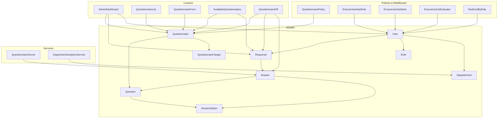
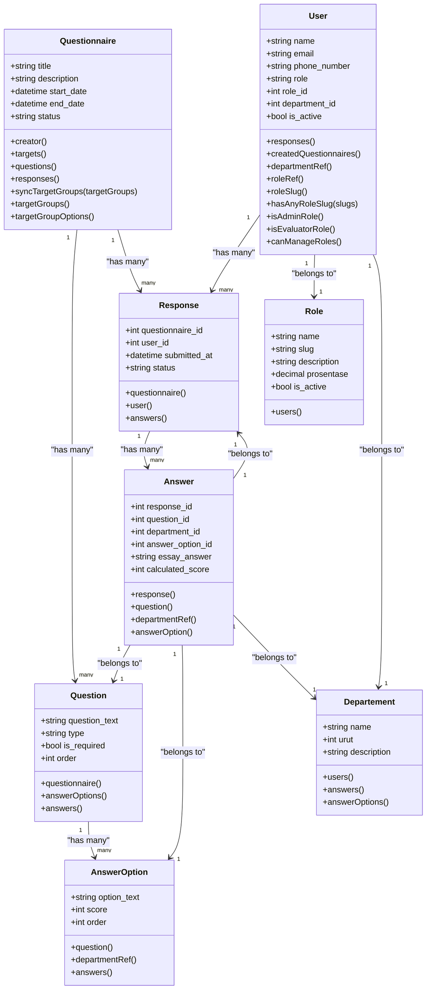
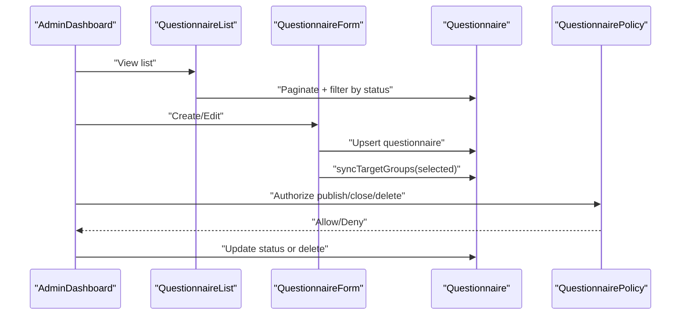
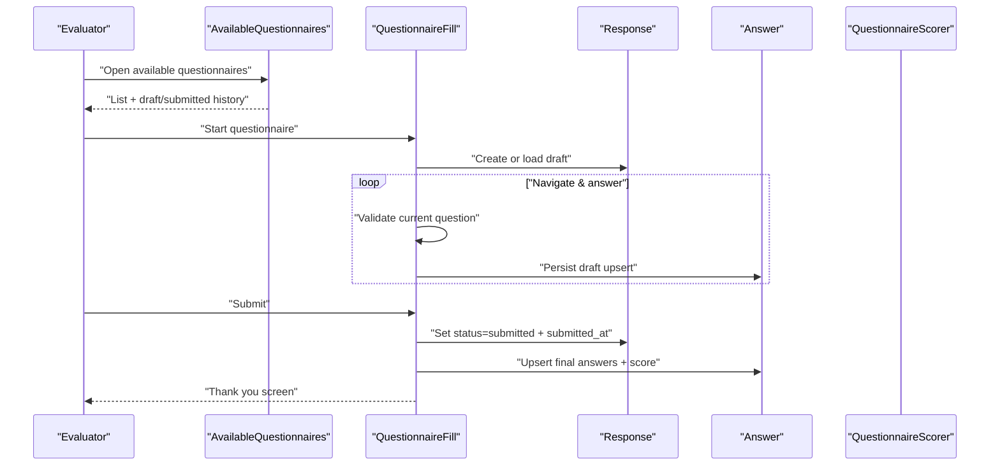
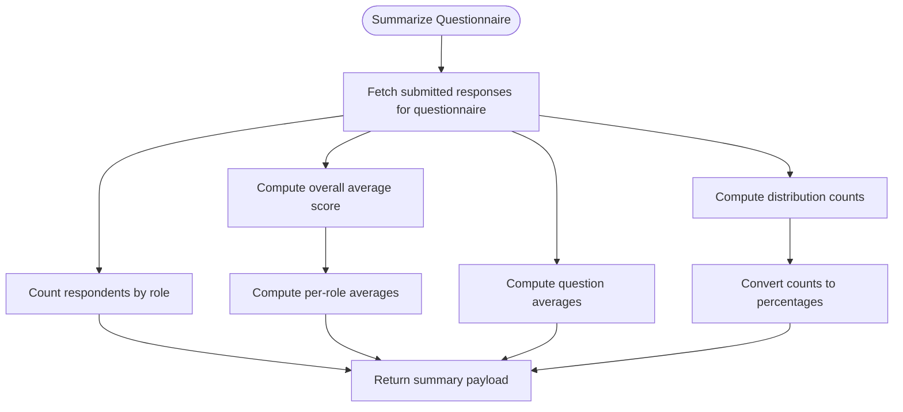
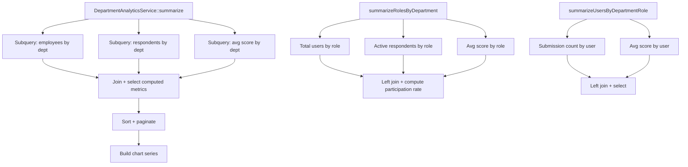
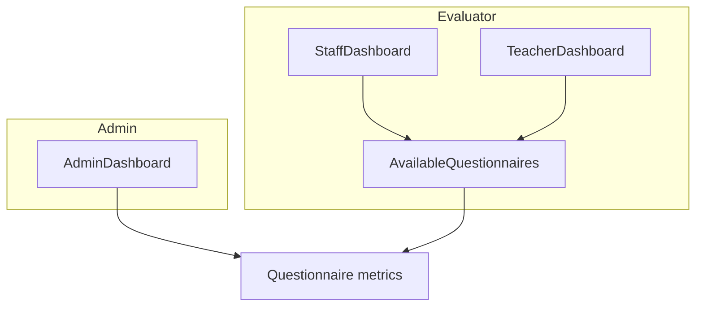
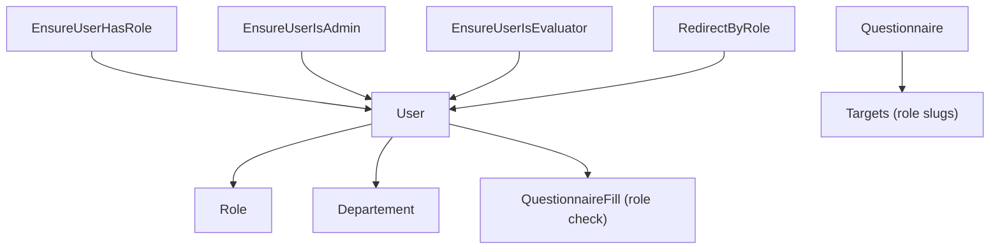
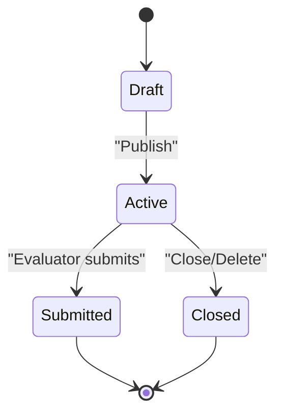
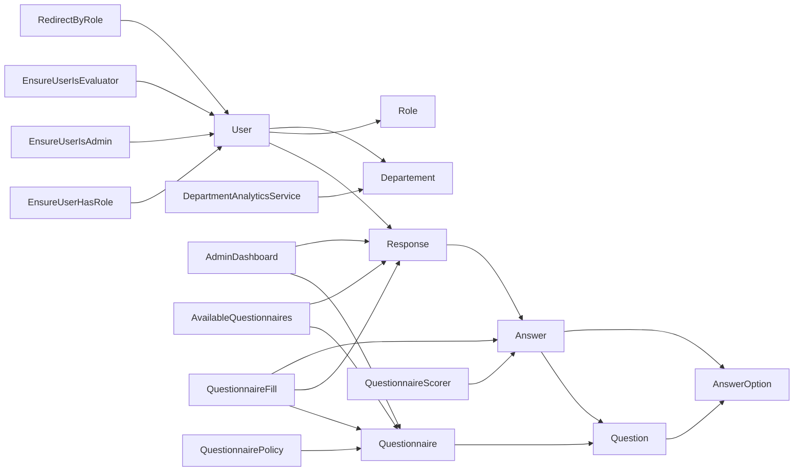

# Core Features

<cite>
**Referenced Files in This Document**
- [Questionnaire.php](file://app/Models/Questionnaire.php)
- [Question.php](file://app/Models/Question.php)
- [Answer.php](file://app/Models/Answer.php)
- [Response.php](file://app/Models/Response.php)
- [AnswerOption.php](file://app/Models/AnswerOption.php)
- [User.php](file://app/Models/User.php)
- [Role.php](file://app/Models/Role.php)
- [Departement.php](file://app/Models/Departement.php)
- [QuestionnaireScorer.php](file://app/Services/QuestionnaireScorer.php)
- [DepartmentAnalyticsService.php](file://app/Services/DepartmentAnalyticsService.php)
- [AdminDashboard.php](file://app/Livewire/Admin/AdminDashboard.php)
- [QuestionnaireList.php](file://app/Livewire/Admin/QuestionnaireList.php)
- [QuestionnaireForm.php](file://app/Livewire/Admin/QuestionnaireForm.php)
- [AvailableQuestionnaires.php](file://app/Livewire/Fill/AvailableQuestionnaires.php)
- [QuestionnaireFill.php](file://app/Livewire/Fill/QuestionnaireFill.php)
- [QuestionnairePolicy.php](file://app/Policies/QuestionnairePolicy.php)
- [EnsureUserHasRole.php](file://app/Http/Middleware/EnsureUserHasRole.php)
- [EnsureUserIsAdmin.php](file://app/Http/Middleware/EnsureUserIsAdmin.php)
- [EnsureUserIsEvaluator.php](file://app/Http/Middleware/EnsureUserIsEvaluator.php)
- [RedirectByRole.php](file://app/Http/Middleware/RedirectByRole.php)
- [StoreQuestionnaireRequest.php](file://app/Http/Requests/StoreQuestionnaireRequest.php)
- [UpdateQuestionnaireRequest.php](file://app/Http/Requests/UpdateQuestionnaireRequest.php)
- [rbac.php](file://config/rbac.php)
- [features.php](file://config/features.php)
- [01-general.md](file://.clinerules/01-general.md)
- [02-laravel.md](file://.clinerules/02-laravel.md)
- [03-livewire-flux.md](file://.clinerules/03-livewire-flux.md)
- [04-security.md](file://.clinerules/04-security.md)
- [05-workflow.md](file://.clinerules/05-workflow.md)
- [06-kepsekeval.md](file://.clinerules/06-kepsekeval.md)
- [07-scoring.md](file://.clinerules/07-scoring.md)
- [08-dynamic-form.md](file://.clinerules/08-dynamic-form.md)
- [09-role-assignment.md](file://.clinerules/09-role-assignment.md)
</cite>

## Table of Contents
1. [Introduction](#introduction)
2. [Project Structure](#project-structure)
3. [Core Components](#core-components)
4. [Architecture Overview](#architecture-overview)
5. [Detailed Component Analysis](#detailed-component-analysis)
6. [Dependency Analysis](#dependency-analysis)
7. [Performance Considerations](#performance-considerations)
8. [Troubleshooting Guide](#troubleshooting-guide)
9. [Conclusion](#conclusion)
10. [Appendices](#appendices)

## Introduction
This document explains the core assessment platform features: the questionnaire system, evaluation workflows, user role management, scoring and analytics, and dashboards for administrators, evaluators, and regular users. It documents the complete assessment lifecycle from creation to completion, and provides practical examples of common use cases and feature interactions.

## Project Structure
The platform is a Laravel application with Livewire components. Key areas:
- Models define the assessment domain: Questionnaire, Question, AnswerOption, Answer, Response, User, Role, Department.
- Services encapsulate scoring and analytics computations.
- Livewire components implement admin and evaluator dashboards and the questionnaire filling experience.
- Policies and middleware govern access control and role-based navigation.
- Configuration files define RBAC slugs, feature flags, and questionnaire target groups.

**Diagram sources**
- [Questionnaire.php:13-50](file://app/Models/Questionnaire.php#L13-L50)
- [Question.php:11-41](file://app/Models/Question.php#L11-L41)
- [AnswerOption.php:10-36](file://app/Models/AnswerOption.php#L10-L36)
- [Answer.php:10-42](file://app/Models/Answer.php#L10-L42)
- [Response.php:11-40](file://app/Models/Response.php#L11-L40)
- [User.php:12-57](file://app/Models/User.php#L12-L57)
- [Role.php:9-29](file://app/Models/Role.php#L9-L29)
- [Departement.php:9-32](file://app/Models/Departement.php#L9-L32)
- [QuestionnaireScorer.php:12-112](file://app/Services/QuestionnaireScorer.php#L12-L112)
- [DepartmentAnalyticsService.php:12-95](file://app/Services/DepartmentAnalyticsService.php#L12-L95)
- [AdminDashboard.php:16-135](file://app/Livewire/Admin/AdminDashboard.php#L16-L135)
- [QuestionnaireList.php:12-81](file://app/Livewire/Admin/QuestionnaireList.php#L12-L81)
- [QuestionnaireForm.php:15-132](file://app/Livewire/Admin/QuestionnaireForm.php#L15-L132)
- [AvailableQuestionnaires.php:12-63](file://app/Livewire/Fill/AvailableQuestionnaires.php#L12-L63)
- [QuestionnaireFill.php:19-514](file://app/Livewire/Fill/QuestionnaireFill.php#L19-L514)
- [QuestionnairePolicy.php](file://app/Policies/QuestionnairePolicy.php)
- [EnsureUserHasRole.php](file://app/Http/Middleware/EnsureUserHasRole.php)
- [EnsureUserIsAdmin.php](file://app/Http/Middleware/EnsureUserIsAdmin.php)
- [EnsureUserIsEvaluator.php](file://app/Http/Middleware/EnsureUserIsEvaluator.php)
- [RedirectByRole.php](file://app/Http/Middleware/RedirectByRole.php)

**Section sources**
- [Questionnaire.php:13-131](file://app/Models/Questionnaire.php#L13-L131)
- [Question.php:11-43](file://app/Models/Question.php#L11-L43)
- [Answer.php:10-44](file://app/Models/Answer.php#L10-L44)
- [Response.php:11-42](file://app/Models/Response.php#L11-L42)
- [AnswerOption.php:10-38](file://app/Models/AnswerOption.php#L10-L38)
- [User.php:12-94](file://app/Models/User.php#L12-L94)
- [Role.php:9-31](file://app/Models/Role.php#L9-L31)
- [Departement.php:9-34](file://app/Models/Departement.php#L9-L34)
- [QuestionnaireScorer.php:12-139](file://app/Services/QuestionnaireScorer.php#L12-L139)
- [DepartmentAnalyticsService.php:12-279](file://app/Services/DepartmentAnalyticsService.php#L12-L279)
- [AdminDashboard.php:16-137](file://app/Livewire/Admin/AdminDashboard.php#L16-L137)
- [QuestionnaireList.php:12-82](file://app/Livewire/Admin/QuestionnaireList.php#L12-L82)
- [QuestionnaireForm.php:15-133](file://app/Livewire/Admin/QuestionnaireForm.php#L15-L133)
- [AvailableQuestionnaires.php:12-64](file://app/Livewire/Fill/AvailableQuestionnaires.php#L12-L64)
- [QuestionnaireFill.php:19-515](file://app/Livewire/Fill/QuestionnaireFill.php#L19-L515)

## Core Components
- Questionnaire: Assessment form with title, dates, status, creator, targets, questions, and responses.
- Question: Individual items with type, required flag, order, answer options, and answers.
- AnswerOption: Possible choices with scores for scoring.
- Answer: Per-response selections and essay answers, with calculated score.
- Response: Submission record per user-questionnaire pair, with status and timestamps.
- User: Authenticatable entity with role and department, plus created questionnaires and responses.
- Role: Defines evaluator/admin slugs and activity; used for targeting and permissions.
- Department: Organizational unit linking users and answers for analytics.

**Section sources**
- [Questionnaire.php:18-50](file://app/Models/Questionnaire.php#L18-L50)
- [Question.php:16-41](file://app/Models/Question.php#L16-L41)
- [AnswerOption.php:15-36](file://app/Models/AnswerOption.php#L15-L36)
- [Answer.php:15-42](file://app/Models/Answer.php#L15-L42)
- [Response.php:16-40](file://app/Models/Response.php#L16-L40)
- [User.php:16-57](file://app/Models/User.php#L16-L57)
- [Role.php:13-29](file://app/Models/Role.php#L13-L29)
- [Departement.php:13-32](file://app/Models/Departement.php#L13-L32)

## Architecture Overview
The system separates concerns:
- Data modeling via Eloquent models and relations.
- Business logic in services (scoring, analytics).
- UI via Livewire components for admin and evaluator experiences.
- Access control via policies and middleware.
- Configuration-driven role targeting and feature toggles.

**Diagram sources**
- [Questionnaire.php:18-131](file://app/Models/Questionnaire.php#L18-L131)
- [Question.php:16-43](file://app/Models/Question.php#L16-L43)
- [AnswerOption.php:15-38](file://app/Models/AnswerOption.php#L15-L38)
- [Answer.php:15-44](file://app/Models/Answer.php#L15-L44)
- [Response.php:16-42](file://app/Models/Response.php#L16-L42)
- [User.php:16-94](file://app/Models/User.php#L16-L94)
- [Role.php:13-31](file://app/Models/Role.php#L13-L31)
- [Departement.php:13-34](file://app/Models/Departement.php#L13-L34)

## Detailed Component Analysis

### Questionnaire System
- Creation and editing: Admins create/edit questionnaires, set status, dates, and target groups. Target groups derive from roles or configuration.
- Targeting: Questionnaires target evaluator roles via QuestionnaireTarget entries synchronized from selected role slugs.
- Lifecycle: Draft → Active (publish) → Closed (delete or auto-close via policy/list actions).

**Diagram sources**
- [AdminDashboard.php:25-135](file://app/Livewire/Admin/AdminDashboard.php#L25-L135)
- [QuestionnaireList.php:61-81](file://app/Livewire/Admin/QuestionnaireList.php#L61-L81)
- [QuestionnaireForm.php:74-107](file://app/Livewire/Admin/QuestionnaireForm.php#L74-L107)
- [Questionnaire.php:55-83](file://app/Models/Questionnaire.php#L55-L83)
- [QuestionnairePolicy.php](file://app/Policies/QuestionnairePolicy.php)

**Section sources**
- [Questionnaire.php:55-129](file://app/Models/Questionnaire.php#L55-L129)
- [QuestionnaireForm.php:40-107](file://app/Livewire/Admin/QuestionnaireForm.php#L40-L107)
- [QuestionnaireList.php:36-59](file://app/Livewire/Admin/QuestionnaireList.php#L36-L59)
- [QuestionnairePolicy.php](file://app/Policies/QuestionnairePolicy.php)

### Evaluation Workflow
- Discovery: Evaluators see active questionnaires matching their role or aliases.
- Drafting: Per-user Response created; answers persisted incrementally.
- Validation: Required questions enforced per type; navigation highlights invalid items.
- Submission: Final confirmation; transaction persists answers and calculated scores.

**Diagram sources**
- [AvailableQuestionnaires.php:14-63](file://app/Livewire/Fill/AvailableQuestionnaires.php#L14-L63)
- [QuestionnaireFill.php:44-245](file://app/Livewire/Fill/QuestionnaireFill.php#L44-L245)
- [QuestionnaireScorer.php:14-23](file://app/Services/QuestionnaireScorer.php#L14-L23)

**Section sources**
- [AvailableQuestionnaires.php:16-59](file://app/Livewire/Fill/AvailableQuestionnaires.php#L16-L59)
- [QuestionnaireFill.php:44-515](file://app/Livewire/Fill/QuestionnaireFill.php#L44-L515)

### Scoring Mechanism
- Per-answer calculation: Score taken from AnswerOption when present; otherwise null.
- Summarization: Overall average, per-role averages, question averages, and distribution with percentages computed from submitted answers.

**Diagram sources**
- [QuestionnaireScorer.php:33-112](file://app/Services/QuestionnaireScorer.php#L33-L112)
- [QuestionnaireScorer.php:118-137](file://app/Services/QuestionnaireScorer.php#L118-L137)

**Section sources**
- [QuestionnaireScorer.php:14-139](file://app/Services/QuestionnaireScorer.php#L14-L139)
- [AnswerOption.php:15-21](file://app/Models/AnswerOption.php#L15-L21)
- [Answer.php:15-22](file://app/Models/Answer.php#L15-L22)

### Analytics and Reporting
- Department-level overview: Employees, respondents, participation rate, average score; paginated with sortable columns.
- Role-level breakdown: Participation rates and averages by role within a department.
- User-level drill-down: Submissions and average scores by user within a department and role.
- Caching: Results cached for short periods to reduce DB load.

**Diagram sources**
- [DepartmentAnalyticsService.php:20-95](file://app/Services/DepartmentAnalyticsService.php#L20-L95)
- [DepartmentAnalyticsService.php:109-189](file://app/Services/DepartmentAnalyticsService.php#L109-L189)
- [DepartmentAnalyticsService.php:199-256](file://app/Services/DepartmentAnalyticsService.php#L199-L256)

**Section sources**
- [DepartmentAnalyticsService.php:20-279](file://app/Services/DepartmentAnalyticsService.php#L20-L279)

### Dashboard Systems
- Admin dashboard: Metrics include active questionnaires, total respondents, participation rate, average score, and role-wise breakdown cards.
- Evaluator dashboards: Separate dashboards for staff and teachers; available questionnaires page lists active, unsubmitted, and draft/submitted histories.

**Diagram sources**
- [AdminDashboard.php:25-135](file://app/Livewire/Admin/AdminDashboard.php#L25-L135)
- [AvailableQuestionnaires.php:14-63](file://app/Livewire/Fill/AvailableQuestionnaires.php#L14-L63)

**Section sources**
- [AdminDashboard.php:25-137](file://app/Livewire/Admin/AdminDashboard.php#L25-L137)
- [AvailableQuestionnaires.php:14-64](file://app/Livewire/Fill/AvailableQuestionnaires.php#L14-L64)

### User Role Management
- Roles define evaluator/admin slugs and activity; users belong to a role and department.
- Role-based targeting: Questionnaires target roles via slugs; aliases expand coverage.
- Access control: Middleware and policies restrict actions by role and ownership.

**Diagram sources**
- [User.php:59-92](file://app/Models/User.php#L59-L92)
- [Role.php:13-29](file://app/Models/Role.php#L13-L29)
- [Questionnaire.php:88-108](file://app/Models/Questionnaire.php#L88-L108)
- [QuestionnaireFill.php:49-76](file://app/Livewire/Fill/QuestionnaireFill.php#L49-L76)
- [EnsureUserHasRole.php](file://app/Http/Middleware/EnsureUserHasRole.php)
- [EnsureUserIsAdmin.php](file://app/Http/Middleware/EnsureUserIsAdmin.php)
- [EnsureUserIsEvaluator.php](file://app/Http/Middleware/EnsureUserIsEvaluator.php)
- [RedirectByRole.php](file://app/Http/Middleware/RedirectByRole.php)

**Section sources**
- [User.php:59-94](file://app/Models/User.php#L59-L94)
- [Role.php:13-31](file://app/Models/Role.php#L13-L31)
- [Questionnaire.php:88-129](file://app/Models/Questionnaire.php#L88-L129)
- [QuestionnaireFill.php:49-76](file://app/Livewire/Fill/QuestionnaireFill.php#L49-L76)

### Assessment Lifecycle
- Creation: Admin creates questionnaire, sets dates/status, selects target groups.
- Publishing: Questionnaire becomes active; evaluators can discover it.
- Filling: Evaluator starts, navigates, autosaves, validates, submits.
- Scoring: Answers scored via AnswerOption; summary computed.
- Reporting: Admin and department analytics surfaces insights.

**Diagram sources**
- [QuestionnaireList.php:36-50](file://app/Livewire/Admin/QuestionnaireList.php#L36-L50)
- [QuestionnaireFill.php:203-245](file://app/Livewire/Fill/QuestionnaireFill.php#L203-L245)
- [QuestionnaireScorer.php:33-112](file://app/Services/QuestionnaireScorer.php#L33-L112)

**Section sources**
- [QuestionnaireList.php:36-59](file://app/Livewire/Admin/QuestionnaireList.php#L36-L59)
- [QuestionnaireFill.php:203-245](file://app/Livewire/Fill/QuestionnaireFill.php#L203-L245)

### Practical Examples and Feature Interactions
- Example 1: Admin publishes a questionnaire targeting "teacher" and "staff" roles; aliases expand reach; evaluators see it in AvailableQuestionnaires.
- Example 2: Evaluator completes a questionnaire; autosave persists draft; submission triggers scoring and finalization.
- Example 3: Admin reviews AdminDashboard metrics; navigates to analytics for department-level insights; exports reports via provided export classes.

**Section sources**
- [QuestionnaireForm.php:40-107](file://app/Livewire/Admin/QuestionnaireForm.php#L40-L107)
- [AvailableQuestionnaires.php:16-59](file://app/Livewire/Fill/AvailableQuestionnaires.php#L16-L59)
- [QuestionnaireFill.php:172-245](file://app/Livewire/Fill/QuestionnaireFill.php#L172-L245)
- [AdminDashboard.php:27-130](file://app/Livewire/Admin/AdminDashboard.php#L27-L130)
- [DepartmentAnalyticsService.php:20-95](file://app/Services/DepartmentAnalyticsService.php#L20-L95)

## Dependency Analysis
- Models depend on Eloquent relations; services depend on models and DB queries.
- Livewire components orchestrate model interactions and pass data to views.
- Policies and middleware enforce role-based access.
- Configuration files drive role slugs, evaluator/admin slugs, and feature flags.

**Diagram sources**
- [Questionnaire.php:18-50](file://app/Models/Questionnaire.php#L18-L50)
- [Question.php:28-41](file://app/Models/Question.php#L28-L41)
- [AnswerOption.php:23-36](file://app/Models/AnswerOption.php#L23-L36)
- [Answer.php:24-42](file://app/Models/Answer.php#L24-L42)
- [Response.php:27-40](file://app/Models/Response.php#L27-L40)
- [User.php:39-57](file://app/Models/User.php#L39-L57)
- [Role.php:26-29](file://app/Models/Role.php#L26-L29)
- [Departement.php:19-32](file://app/Models/Departement.php#L19-L32)
- [QuestionnaireScorer.php:12-112](file://app/Services/QuestionnaireScorer.php#L12-L112)
- [DepartmentAnalyticsService.php:12-95](file://app/Services/DepartmentAnalyticsService.php#L12-L95)
- [AdminDashboard.php:16-135](file://app/Livewire/Admin/AdminDashboard.php#L16-L135)
- [AvailableQuestionnaires.php:12-63](file://app/Livewire/Fill/AvailableQuestionnaires.php#L12-L63)
- [QuestionnaireFill.php:19-515](file://app/Livewire/Fill/QuestionnaireFill.php#L19-L515)
- [QuestionnairePolicy.php](file://app/Policies/QuestionnairePolicy.php)
- [EnsureUserHasRole.php](file://app/Http/Middleware/EnsureUserHasRole.php)
- [EnsureUserIsAdmin.php](file://app/Http/Middleware/EnsureUserIsAdmin.php)
- [EnsureUserIsEvaluator.php](file://app/Http/Middleware/EnsureUserIsEvaluator.php)
- [RedirectByRole.php](file://app/Http/Middleware/RedirectByRole.php)

**Section sources**
- [rbac.php](file://config/rbac.php)
- [features.php](file://config/features.php)

## Performance Considerations
- Caching: Admin dashboard metrics and department analytics use caching to reduce query load.
- Pagination: Department analytics supports pagination to limit result set sizes.
- Efficient joins: Analytics rely on precomputed subqueries and grouped aggregations.
- Autosave: Draft persistence minimizes data loss and reduces server load by batching writes.

[No sources needed since this section provides general guidance]

## Troubleshooting Guide
- Access denied during questionnaire fill: Check role targeting and aliases; ensure the questionnaire status is active and the evaluator’s role matches targets.
- Validation errors on submit: Required questions must be answered according to type; the component scrolls to the first invalid question.
- No questionnaires visible: Confirm active status, correct target groups, and absence of prior submissions.
- Scoring not appearing: Ensure AnswerOption entries exist with scores; confirm submission path updates Answer.calculated_score.

**Section sources**
- [QuestionnaireFill.php:49-76](file://app/Livewire/Fill/QuestionnaireFill.php#L49-L76)
- [QuestionnaireFill.php:342-388](file://app/Livewire/Fill/QuestionnaireFill.php#L342-L388)
- [QuestionnaireFill.php:203-245](file://app/Livewire/Fill/QuestionnaireFill.php#L203-L245)
- [Questionnaire.php:88-108](file://app/Models/Questionnaire.php#L88-L108)

## Conclusion
The platform provides a robust, role-aware assessment system with clear lifecycle stages, strong validation, efficient scoring, and insightful analytics. Admins manage questionnaires and view high-level metrics; evaluators can easily discover, fill, and submit assessments; services deliver department-level insights with caching and pagination.

[No sources needed since this section summarizes without analyzing specific files]

## Appendices
- Coding standards and guidelines are documented in the repository’s linting rules.

**Section sources**
- [.clinerules/01-general.md](file://.clinerules/01-general.md)
- [.clinerules/02-laravel.md](file://.clinerules/02-laravel.md)
- [.clinerules/03-livewire-flux.md](file://.clinerules/03-livewire-flux.md)
- [.clinerules/04-security.md](file://.clinerules/04-security.md)
- [.clinerules/05-workflow.md](file://.clinerules/05-workflow.md)
- [.clinerules/06-kepsekeval.md](file://.clinerules/06-kepsekeval.md)
- [.clinerules/07-scoring.md](file://.clinerules/07-scoring.md)
- [.clinerules/08-dynamic-form.md](file://.clinerules/08-dynamic-form.md)
- [.clinerules/09-role-assignment.md](file://.clinerules/09-role-assignment.md)