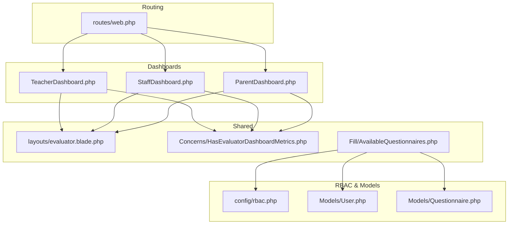
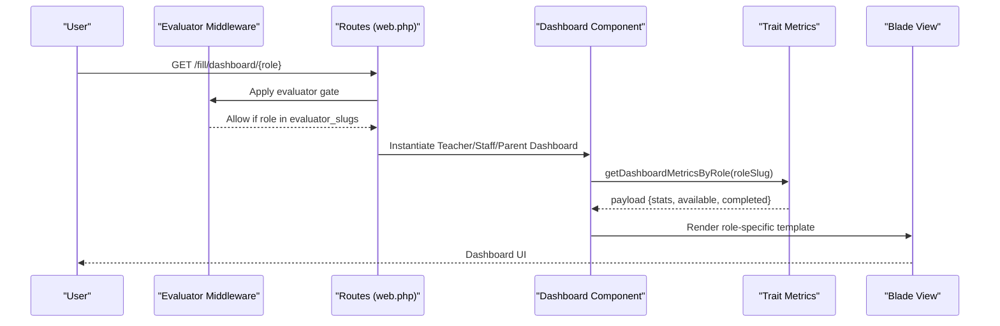
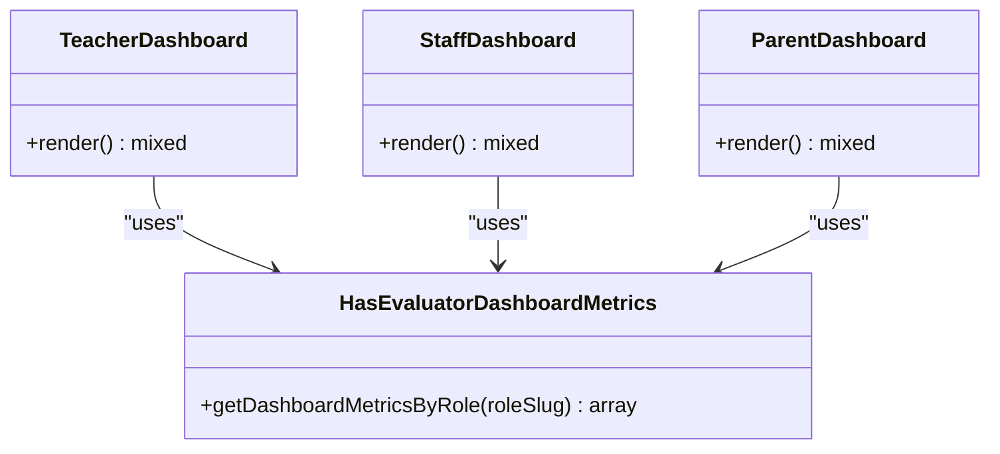
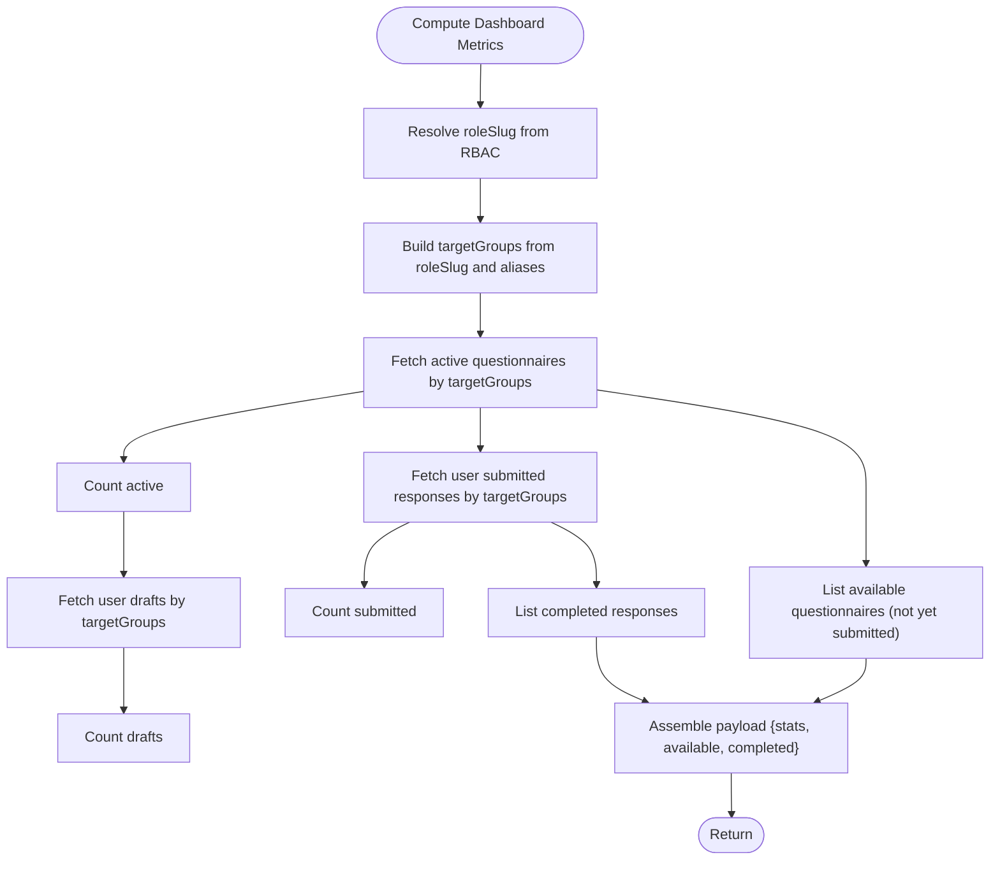
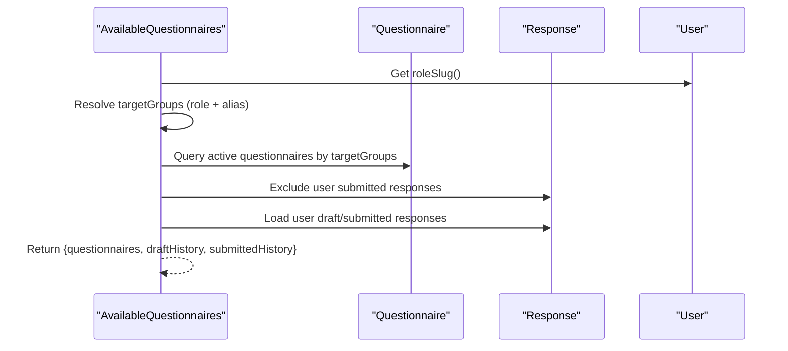
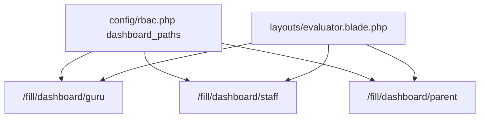
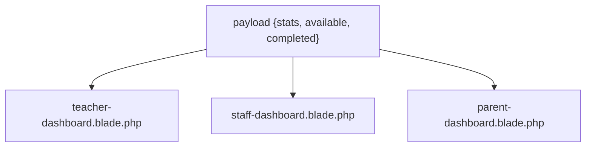
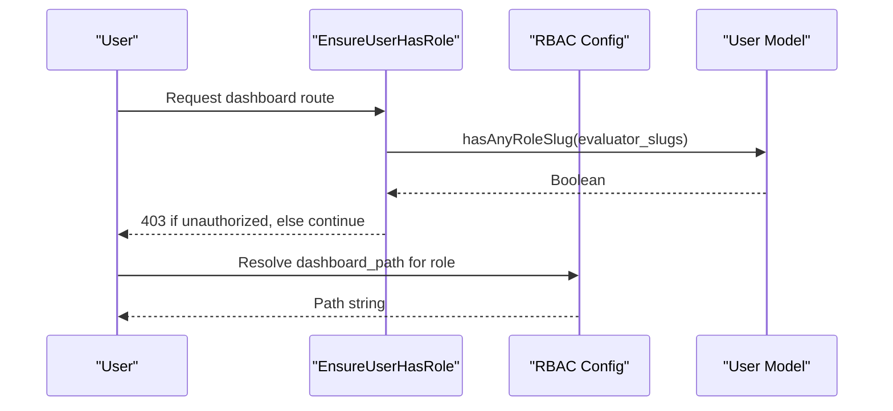
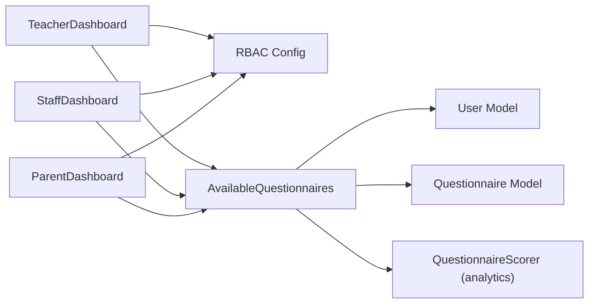

# Dashboard Systems

<cite>
**Referenced Files in This Document**
- [TeacherDashboard.php](file://app/Livewire/Fill/TeacherDashboard.php)
- [StaffDashboard.php](file://app/Livewire/Fill/StaffDashboard.php)
- [ParentDashboard.php](file://app/Livewire/Fill/ParentDashboard.php)
- [HasEvaluatorDashboardMetrics.php](file://app/Livewire/Fill/Concerns/HasEvaluatorDashboardMetrics.php)
- [AvailableQuestionnaires.php](file://app/Livewire/Fill/AvailableQuestionnaires.php)
- [QuestionnaireScorer.php](file://app/Livewire/Fill/Concerns/HasEvaluatorDashboardMetrics.php)
- [User.php](file://app/Models/User.php)
- [Questionnaire.php](file://app/Models/Questionnaire.php)
- [rbac.php](file://config/rbac.php)
- [evaluator.blade.php](file://resources/views/layouts/evaluator.blade.php)
- [teacher-dashboard.blade.php](file://resources/views/livewire/fill/teacher-dashboard.blade.php)
- [staff-dashboard.blade.php](file://resources/views/livewire/fill/staff-dashboard.blade.php)
- [parent-dashboard.blade.php](file://resources/views/livewire/fill/parent-dashboard.blade.php)
- [web.php](file://routes/web.php)
- [EnsureUserHasRole.php](file://app/Http/Middleware/EnsureUserHasRole.php)
</cite>

## Table of Contents
1. [Introduction](#introduction)
2. [Project Structure](#project-structure)
3. [Core Components](#core-components)
4. [Architecture Overview](#architecture-overview)
5. [Detailed Component Analysis](#detailed-component-analysis)
6. [Dependency Analysis](#dependency-analysis)
7. [Performance Considerations](#performance-considerations)
8. [Troubleshooting Guide](#troubleshooting-guide)
9. [Conclusion](#conclusion)
10. [Appendices](#appendices)

## Introduction
This document describes the dashboard systems that provide role-based access to evaluation workflows. It covers three evaluators’ dashboards:
- Teacher dashboard for educators
- Staff dashboard for administrative personnel
- Parent dashboard for guardians

It explains metric calculations, progress tracking, available questionnaire lists, navigation, filtering capabilities, and performance indicators. It also includes examples of dashboard layouts, data visualization components, and user interaction patterns specific to each role.

## Project Structure
The dashboards are implemented as Livewire components with Blade templates and share a common evaluator layout. Routing groups separate admin and evaluator spaces, while RBAC configuration defines role slugs, aliases, and dashboard paths.

**Diagram sources**
- [web.php:149-160](file://routes/web.php#L149-L160)
- [TeacherDashboard.php:10-21](file://app/Livewire/Fill/TeacherDashboard.php#L10-L21)
- [StaffDashboard.php:10-21](file://app/Livewire/Fill/StaffDashboard.php#L10-L21)
- [ParentDashboard.php:10-21](file://app/Livewire/Fill/ParentDashboard.php#L10-L21)
- [evaluator.blade.php:26-71](file://resources/views/layouts/evaluator.blade.php#L26-L71)
- [HasEvaluatorDashboardMetrics.php](file://app/Livewire/Fill/Concerns/HasEvaluatorDashboardMetrics.php)
- [AvailableQuestionnaires.php:14-62](file://app/Livewire/Fill/AvailableQuestionnaires.php#L14-L62)
- [rbac.php:12-16](file://config/rbac.php#L12-L16)
- [User.php:59-67](file://app/Models/User.php#L59-L67)
- [Questionnaire.php:37-50](file://app/Models/Questionnaire.php#L37-L50)

**Section sources**
- [web.php:149-160](file://routes/web.php#L149-L160)
- [rbac.php:12-16](file://config/rbac.php#L12-L16)

## Core Components
- Role-aware dashboards: Each evaluator dashboard component resolves its role slug and delegates metric computation to a shared trait.
- Shared metrics concern: Provides dashboard metrics aggregation by role.
- Available questionnaires listing: Filters questionnaires by target groups and user’s submission history.
- RBAC configuration: Defines role slugs, aliases, and dashboard paths.
- Evaluator layout: Supplies common header, navigation, and theme controls.

Key responsibilities:
- TeacherDashboard: Renders teacher-specific metrics and lists.
- StaffDashboard: Renders staff-specific metrics and lists.
- ParentDashboard: Renders parent-specific metrics and lists.
- HasEvaluatorDashboardMetrics: Computes stats and available/questionnaire lists per role.
- AvailableQuestionnaires: Lists active questionnaires and submission history for the current evaluator.
- RBAC config: Maps role slugs to dashboard paths and target groups.

**Section sources**
- [TeacherDashboard.php:10-21](file://app/Livewire/Fill/TeacherDashboard.php#L10-L21)
- [StaffDashboard.php:10-21](file://app/Livewire/Fill/StaffDashboard.php#L10-L21)
- [ParentDashboard.php:10-21](file://app/Livewire/Fill/ParentDashboard.php#L10-L21)
- [HasEvaluatorDashboardMetrics.php](file://app/Livewire/Fill/Concerns/HasEvaluatorDashboardMetrics.php)
- [AvailableQuestionnaires.php:14-62](file://app/Livewire/Fill/AvailableQuestionnaires.php#L14-L62)
- [rbac.php:12-16](file://config/rbac.php#L12-L16)

## Architecture Overview
The dashboards follow a layered pattern:
- HTTP routing groups separate admin and evaluator spaces.
- Evaluator middleware ensures access by configured evaluator slugs.
- Dashboards resolve role slugs and delegate metric computation to a shared trait.
- Blade templates render role-specific summaries, available questionnaires, and submission history.

**Diagram sources**
- [web.php:149-160](file://routes/web.php#L149-L160)
- [EnsureUserHasRole.php:11-25](file://app/Http/Middleware/EnsureUserHasRole.php#L11-L25)
- [TeacherDashboard.php:16-20](file://app/Livewire/Fill/TeacherDashboard.php#L16-L20)
- [HasEvaluatorDashboardMetrics.php](file://app/Livewire/Fill/Concerns/HasEvaluatorDashboardMetrics.php)
- [teacher-dashboard.blade.php:1-55](file://resources/views/livewire/fill/teacher-dashboard.blade.php#L1-L55)

## Detailed Component Analysis

### Role-Based Dashboards
Each dashboard component:
- Resolves its role slug from RBAC configuration.
- Uses a shared trait to compute metrics.
- Renders a role-specific Blade template.

**Diagram sources**
- [TeacherDashboard.php:10-21](file://app/Livewire/Fill/TeacherDashboard.php#L10-L21)
- [StaffDashboard.php:10-21](file://app/Livewire/Fill/StaffDashboard.php#L10-L21)
- [ParentDashboard.php:10-21](file://app/Livewire/Fill/ParentDashboard.php#L10-L21)
- [HasEvaluatorDashboardMetrics.php](file://app/Livewire/Fill/Concerns/HasEvaluatorDashboardMetrics.php)

**Section sources**
- [TeacherDashboard.php:16-20](file://app/Livewire/Fill/TeacherDashboard.php#L16-L20)
- [StaffDashboard.php:16-20](file://app/Livewire/Fill/StaffDashboard.php#L16-L20)
- [ParentDashboard.php:16-20](file://app/Livewire/Fill/ParentDashboard.php#L16-L20)

### Metric Calculation and Progress Tracking
The shared trait aggregates:
- Active questionnaires count
- Available-to-fill questionnaires count
- Completed submissions count
- Lists of available and completed questionnaires

These metrics are computed by joining responses, answers, and users filtered by role slugs and aliases. The AvailableQuestionnaires component further refines the lists by:
- Target groups derived from the user’s role slug and aliases
- Excluding previously submitted responses
- Providing draft and submitted history

**Diagram sources**
- [HasEvaluatorDashboardMetrics.php](file://app/Livewire/Fill/Concerns/HasEvaluatorDashboardMetrics.php)
- [AvailableQuestionnaires.php:24-55](file://app/Livewire/Fill/AvailableQuestionnaires.php#L24-L55)
- [rbac.php:7-11](file://config/rbac.php#L7-L11)
- [User.php:59-67](file://app/Models/User.php#L59-L67)

**Section sources**
- [HasEvaluatorDashboardMetrics.php](file://app/Livewire/Fill/Concerns/HasEvaluatorDashboardMetrics.php)
- [AvailableQuestionnaires.php:18-39](file://app/Livewire/Fill/AvailableQuestionnaires.php#L18-L39)

### Available Questionnaires Filtering
The AvailableQuestionnaires component filters questionnaires by:
- Status “active”
- Targets matching the user’s role slug and its alias group
- Excluding responses already submitted by the current user
- Providing draft and submitted histories for quick access

**Diagram sources**
- [AvailableQuestionnaires.php:16-55](file://app/Livewire/Fill/AvailableQuestionnaires.php#L16-L55)
- [rbac.php:7-11](file://config/rbac.php#L7-L11)
- [Questionnaire.php:37-50](file://app/Models/Questionnaire.php#L37-L50)

**Section sources**
- [AvailableQuestionnaires.php:24-55](file://app/Livewire/Fill/AvailableQuestionnaires.php#L24-L55)

### Dashboard Navigation and Layout
All evaluator dashboards use a shared layout that:
- Displays role-aware dashboard links via RBAC dashboard paths
- Provides navigation to available questionnaires, history, profile, and logout
- Supports theme switching persisted in local storage

**Diagram sources**
- [evaluator.blade.php:20-24](file://resources/views/layouts/evaluator.blade.php#L20-L24)
- [rbac.php:49-62](file://config/rbac.php#L49-L62)
- [web.php:150-154](file://routes/web.php#L150-L154)

**Section sources**
- [evaluator.blade.php:42-67](file://resources/views/layouts/evaluator.blade.php#L42-L67)
- [rbac.php:49-62](file://config/rbac.php#L49-L62)

### Role-Specific Dashboard Views
Each role’s Blade template displays:
- Summary cards for active, available-to-fill, and completed counts
- A list of available questionnaires with a link to fill
- A history section for completed submissions

**Diagram sources**
- [teacher-dashboard.blade.php:7-53](file://resources/views/livewire/fill/teacher-dashboard.blade.php#L7-L53)
- [staff-dashboard.blade.php:7-53](file://resources/views/livewire/fill/staff-dashboard.blade.php#L7-L53)
- [parent-dashboard.blade.php:7-53](file://resources/views/livewire/fill/parent-dashboard.blade.php#L7-L53)

**Section sources**
- [teacher-dashboard.blade.php:1-55](file://resources/views/livewire/fill/teacher-dashboard.blade.php#L1-L55)
- [staff-dashboard.blade.php:1-55](file://resources/views/livewire/fill/staff-dashboard.blade.php#L1-L55)
- [parent-dashboard.blade.php:1-55](file://resources/views/livewire/fill/parent-dashboard.blade.php#L1-L55)

### Access Control and Role Resolution
Access control relies on:
- Middleware ensuring the user belongs to configured evaluator slugs
- User model resolving role slugs and determining evaluator/admin roles
- RBAC configuration mapping slugs to dashboard paths and aliases

**Diagram sources**
- [EnsureUserHasRole.php:11-25](file://app/Http/Middleware/EnsureUserHasRole.php#L11-L25)
- [User.php:64-87](file://app/Models/User.php#L64-L87)
- [rbac.php:4-6](file://config/rbac.php#L4-L6)
- [rbac.php:49-62](file://config/rbac.php#L49-L62)

**Section sources**
- [EnsureUserHasRole.php:11-25](file://app/Http/Middleware/EnsureUserHasRole.php#L11-L25)
- [User.php:64-87](file://app/Models/User.php#L64-L87)
- [rbac.php:4-6](file://config/rbac.php#L4-L6)

## Dependency Analysis
- Dashboards depend on RBAC for role slugs and dashboard paths.
- Shared metrics rely on AvailableQuestionnaires filtering logic and user role resolution.
- Questionnaire scoring service computes analytics for administrators but is not used by evaluator dashboards.

**Diagram sources**
- [TeacherDashboard.php:16](file://app/Livewire/Fill/TeacherDashboard.php#L16)
- [StaffDashboard.php:16](file://app/Livewire/Fill/StaffDashboard.php#L16)
- [ParentDashboard.php:16](file://app/Livewire/Fill/ParentDashboard.php#L16)
- [AvailableQuestionnaires.php:16-55](file://app/Livewire/Fill/AvailableQuestionnaires.php#L16-L55)
- [User.php:59-67](file://app/Models/User.php#L59-L67)
- [Questionnaire.php:37-50](file://app/Models/Questionnaire.php#L37-L50)
- [QuestionnaireScorer.php:33-112](file://app/Livewire/Fill/Concerns/HasEvaluatorDashboardMetrics.php)

**Section sources**
- [web.php:149-160](file://routes/web.php#L149-L160)
- [rbac.php:12-16](file://config/rbac.php#L12-L16)

## Performance Considerations
- Prefer eager loading of related models (e.g., questionnaire questions and counts) to reduce N+1 queries.
- Use targeted scopes and joins to limit dataset sizes early in queries.
- Cache frequently accessed RBAC mappings and role aliases to minimize repeated reads.
- Paginate long lists of available and completed questionnaires when datasets grow large.

## Troubleshooting Guide
Common issues and resolutions:
- Unauthorized access to dashboards: Verify the user’s role slug is included in evaluator slugs and that the evaluator middleware is applied.
- Empty dashboard metrics: Confirm that target groups align with the user’s role slug and aliases; ensure questionnaires are active and not excluded by prior submissions.
- Incorrect dashboard path: Check RBAC dashboard paths for the resolved role slug.

**Section sources**
- [EnsureUserHasRole.php:22](file://app/Http/Middleware/EnsureUserHasRole.php#L22)
- [rbac.php:49-62](file://config/rbac.php#L49-L62)
- [AvailableQuestionnaires.php:24-39](file://app/Livewire/Fill/AvailableQuestionnaires.php#L24-L39)

## Conclusion
The evaluator dashboards provide a consistent, role-aware interface for teachers, staff, and parents to discover, fill, and track evaluation questionnaires. They leverage RBAC configuration, shared metrics computation, and a unified layout to deliver a cohesive user experience. Extending support for new roles or metrics requires updating RBAC mappings and the shared metrics trait.

## Appendices

### Dashboard Layout Examples
- Teacher dashboard: Three summary cards, available questionnaires list, and completed history.
- Staff dashboard: Identical structure to teacher dashboard.
- Parent dashboard: Identical structure to teacher dashboard.

**Section sources**
- [teacher-dashboard.blade.php:1-55](file://resources/views/livewire/fill/teacher-dashboard.blade.php#L1-L55)
- [staff-dashboard.blade.php:1-55](file://resources/views/livewire/fill/staff-dashboard.blade.php#L1-L55)
- [parent-dashboard.blade.php:1-55](file://resources/views/livewire/fill/parent-dashboard.blade.php#L1-L55)

### Data Visualization Components
- Summary cards: Display counts for active, available-to-fill, and completed questionnaires.
- Lists: Interactive cards with action buttons to start filling or review history.
- History panels: Chronological lists of submitted questionnaires with timestamps.

**Section sources**
- [teacher-dashboard.blade.php:7-53](file://resources/views/livewire/fill/teacher-dashboard.blade.php#L7-L53)
- [staff-dashboard.blade.php:7-53](file://resources/views/livewire/fill/staff-dashboard.blade.php#L7-L53)
- [parent-dashboard.blade.php:7-53](file://resources/views/livewire/fill/parent-dashboard.blade.php#L7-L53)

### User Interaction Patterns
- Navigation: From the evaluator layout, users navigate to available questionnaires, history, profile, and logout.
- Actions: Click “Fill” on available questionnaires to proceed to the questionnaire form; view history entries for completed submissions.

**Section sources**
- [evaluator.blade.php:42-67](file://resources/views/layouts/evaluator.blade.php#L42-L67)
- [teacher-dashboard.blade.php:31](file://resources/views/livewire/fill/teacher-dashboard.blade.php#L31)