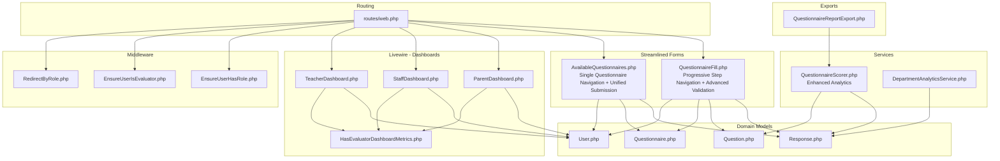
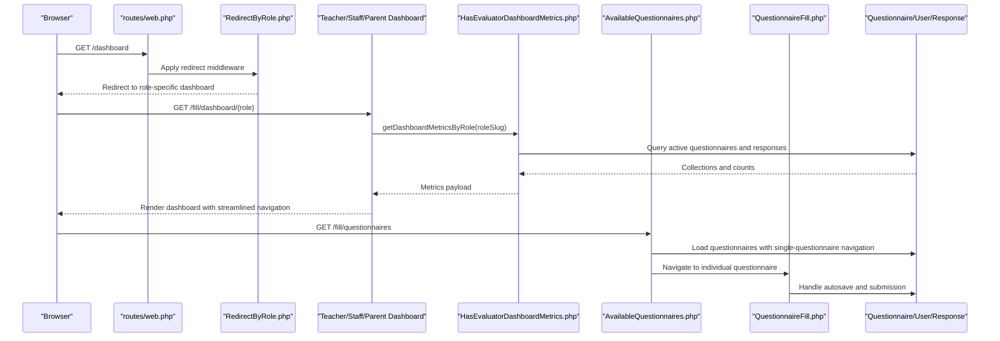
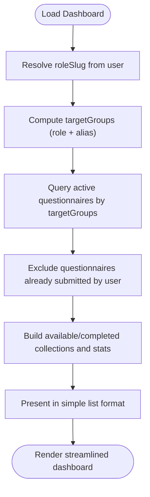
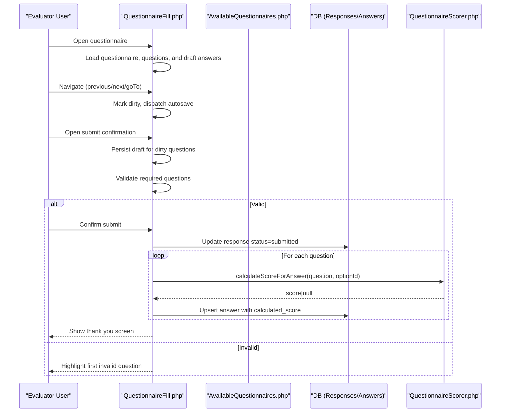
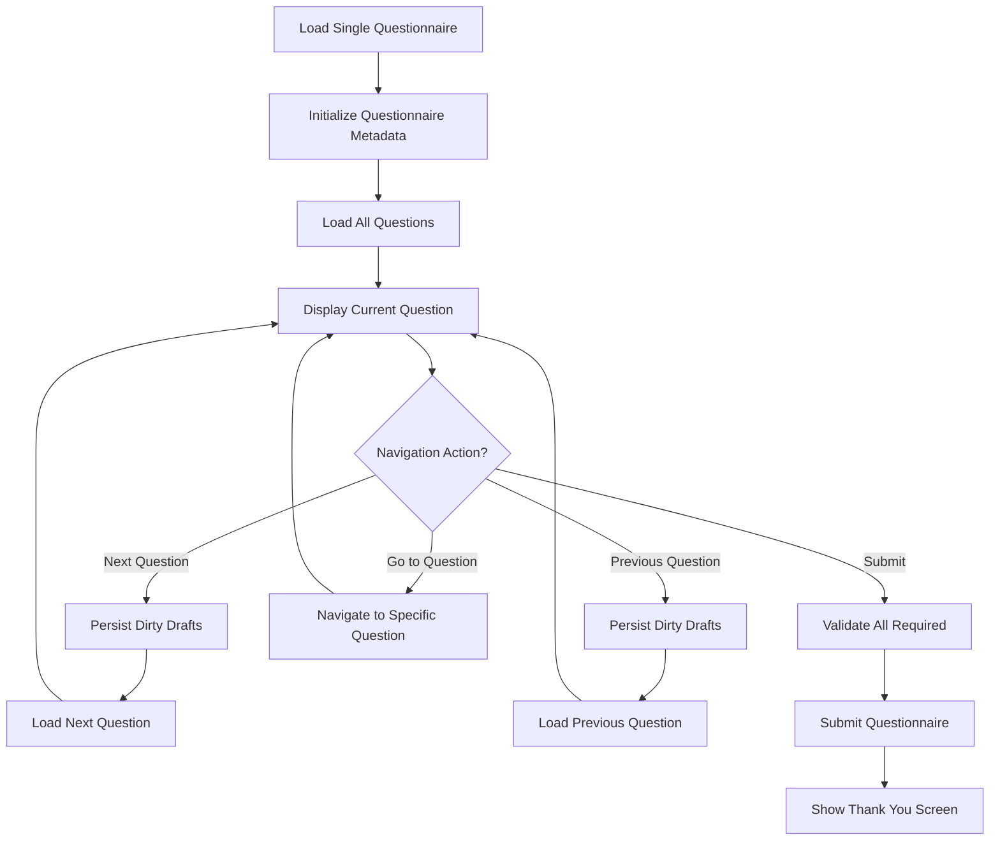
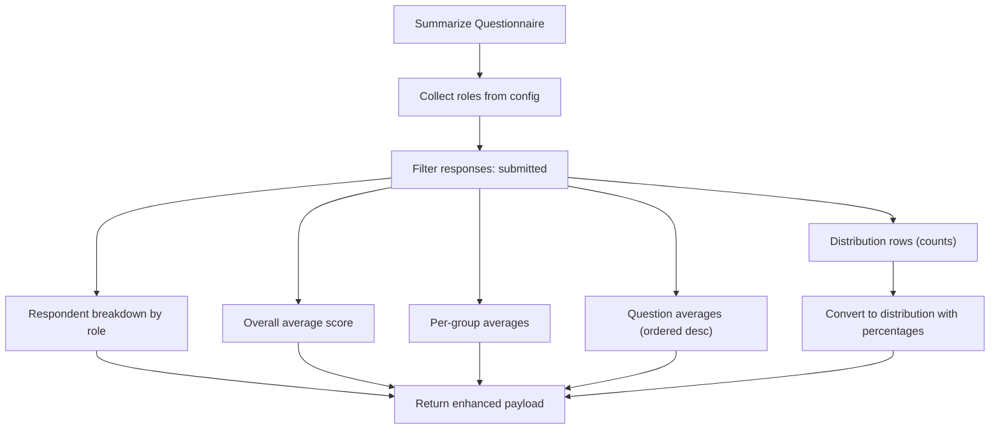
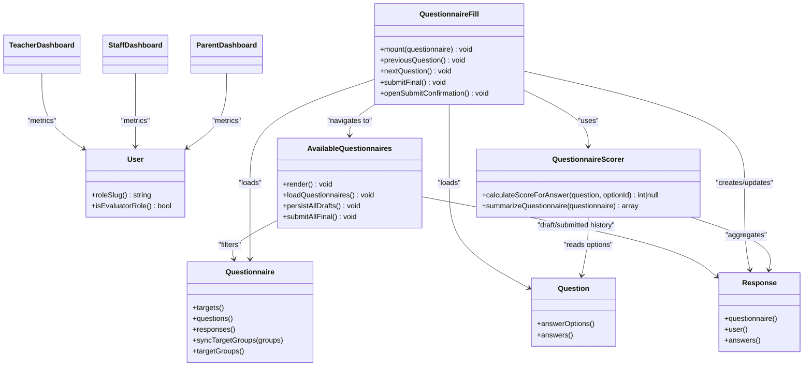

# Evaluation Workflows

<cite>
**Referenced Files in This Document**
- [routes/web.php](file://routes/web.php)
- [config/rbac.php](file://config/rbac.php)
- [config/features.php](file://config/features.php)
- [app/Http/Middleware/EnsureUserHasRole.php](file://app/Http/Middleware/EnsureUserHasRole.php)
- [app/Http/Middleware/EnsureUserIsEvaluator.php](file://app/Http/Middleware/EnsureUserIsEvaluator.php)
- [app/Http/Middleware/RedirectByRole.php](file://app/Http/Middleware/RedirectByRole.php)
- [app/Livewire/Fill/AvailableQuestionnaires.php](file://app/Livewire/Fill/AvailableQuestionnaires.php)
- [app/Livewire/Fill/QuestionnaireFill.php](file://app/Livewire/Fill/QuestionnaireFill.php)
- [app/Livewire/Fill/TeacherDashboard.php](file://app/Livewire/Fill/TeacherDashboard.php)
- [app/Livewire/Fill/StaffDashboard.php](file://app/Livewire/Fill/StaffDashboard.php)
- [app/Livewire/Fill/ParentDashboard.php](file://app/Livewire/Fill/ParentDashboard.php)
- [app/Livewire/Fill/Concerns/HasEvaluatorDashboardMetrics.php](file://app/Livewire/Fill/Concerns/HasEvaluatorDashboardMetrics.php)
- [app/Services/QuestionnaireScorer.php](file://app/Services/QuestionnaireScorer.php)
- [app/Services/DepartmentAnalyticsService.php](file://app/Services/DepartmentAnalyticsService.php)
- [app/Models/User.php](file://app/Models/User.php)
- [app/Models/Questionnaire.php](file://app/Models/Questionnaire.php)
- [app/Models/Question.php](file://app/Models/Question.php)
- [app/Models/Response.php](file://app/Models/Response.php)
- [app/Exports/QuestionnaireReportExport.php](file://app/Exports/QuestionnaireReportExport.php)
- [resources/views/livewire/fill/available-questionnaires.blade.php](file://resources/views/livewire/fill/available-questionnaires.blade.php)
- [resources/views/livewire/fill/questionnaire-fill.blade.php](file://resources/views/livewire/fill/questionnaire-fill.blade.php)
</cite>

## Update Summary
**Changes Made**
- Complete removal of grouped questionnaire system - replaced with streamlined single-questionnaire step-based navigation
- Enhanced single questionnaire filling interface with progressive step-by-step completion
- Improved autosave functionality with draft persistence across navigation
- Advanced validation system with real-time error highlighting and global validation
- Single question mode for improved user experience
- Enhanced dashboard metrics with role-based grouping and progress tracking
- Improved scoring algorithm with advanced analytics and distribution calculations

## Table of Contents
1. [Introduction](#introduction)
2. [Project Structure](#project-structure)
3. [Core Components](#core-components)
4. [Architecture Overview](#architecture-overview)
5. [Detailed Component Analysis](#detailed-component-analysis)
6. [Dependency Analysis](#dependency-analysis)
7. [Performance Considerations](#performance-considerations)
8. [Troubleshooting Guide](#troubleshooting-guide)
9. [Conclusion](#conclusion)
10. [Appendices](#appendices)

## Introduction
This document describes the evaluation and assessment workflow system, covering the end-to-end lifecycle from questionnaire assignment to completion, scoring, and analytics. The system has been comprehensively enhanced with single-questionnaire step-based navigation, autosave functionality, unified submission processes, and advanced validation systems. It explains how different user roles (teacher, staff, parent) access dashboards, how the streamlined questionnaire filling interface works with progressive step navigation and autosave, and how scoring and result aggregation are performed. It also provides scenario-based walkthroughs of typical user interactions with the improved workflow.

## Project Structure
The evaluation workflow spans routing, middleware-driven role gating, Livewire components for dashboards and forms, Eloquent models for domain entities, and services for scoring and analytics. The routes define the entry points for evaluators and administrators, while middleware ensures only authorized users can access evaluator pages. The system now features streamlined single-questionnaire navigation, autosave functionality, and unified submission processes.

**Diagram sources**
- [routes/web.php:149-160](file://routes/web.php#L149-L160)
- [app/Http/Middleware/EnsureUserHasRole.php:1-28](file://app/Http/Middleware/EnsureUserHasRole.php#L1-L28)
- [app/Http/Middleware/EnsureUserIsEvaluator.php:1-23](file://app/Http/Middleware/EnsureUserIsEvaluator.php#L1-L23)
- [app/Http/Middleware/RedirectByRole.php:1-31](file://app/Http/Middleware/RedirectByRole.php#L1-L31)
- [app/Livewire/Fill/TeacherDashboard.php:1-23](file://app/Livewire/Fill/TeacherDashboard.php#L1-L23)
- [app/Livewire/Fill/StaffDashboard.php:1-23](file://app/Livewire/Fill/StaffDashboard.php#L1-L23)
- [app/Livewire/Fill/ParentDashboard.php:1-23](file://app/Livewire/Fill/ParentDashboard.php#L1-L23)
- [app/Livewire/Fill/Concerns/HasEvaluatorDashboardMetrics.php:1-73](file://app/Livewire/Fill/Concerns/HasEvaluatorDashboardMetrics.php#L1-L73)
- [app/Livewire/Fill/AvailableQuestionnaires.php:1-670](file://app/Livewire/Fill/AvailableQuestionnaires.php#L1-L670)
- [app/Livewire/Fill/QuestionnaireFill.php:1-515](file://app/Livewire/Fill/QuestionnaireFill.php#L1-L515)
- [app/Models/User.php:1-94](file://app/Models/User.php#L1-L94)
- [app/Models/Questionnaire.php:1-131](file://app/Models/Questionnaire.php#L1-L131)
- [app/Models/Question.php:1-43](file://app/Models/Question.php#L1-L43)
- [app/Models/Response.php:1-42](file://app/Models/Response.php#L1-L42)
- [app/Services/QuestionnaireScorer.php:1-139](file://app/Services/QuestionnaireScorer.php#L1-L139)
- [app/Services/DepartmentAnalyticsService.php:1-279](file://app/Services/DepartmentAnalyticsService.php#L1-L279)
- [app/Exports/QuestionnaireReportExport.php:1-29](file://app/Exports/QuestionnaireReportExport.php#L1-L29)

**Section sources**
- [routes/web.php:149-160](file://routes/web.php#L149-L160)
- [config/rbac.php:1-64](file://config/rbac.php#L1-L64)

## Core Components
- **Streamlined Routing and role redirection**: Routes under the evaluator prefix and role redirect middleware guide users to appropriate dashboards with simplified navigation.
- **Advanced Middleware**: Role-based gates ensure only eligible users access evaluator pages; evaluator-only gate prevents non-evaluators from entering.
- **Unified Dashboard components**: Teacher, staff, and parent dashboards share a common metrics trait to compute available, completed, and summary counts with role-based grouping.
- **Comprehensive Questionnaire assignment and history**: Users see active questionnaires targeting their role (and aliases), draft and submitted histories with streamlined organization.
- **Enhanced Questionnaire filling**: Interactive form with progressive step navigation, autosave on transitions, validation per question type, and final submission with unified processing.
- **Enhanced Scoring and analytics**: Per-answer score lookup via question option scores; summary aggregates by overall, per-group, question averages, and distributions; department-level analytics; exportable reports.

**Section sources**
- [routes/web.php:149-160](file://routes/web.php#L149-L160)
- [app/Http/Middleware/EnsureUserHasRole.php:1-28](file://app/Http/Middleware/EnsureUserHasRole.php#L1-L28)
- [app/Http/Middleware/EnsureUserIsEvaluator.php:1-23](file://app/Http/Middleware/EnsureUserIsEvaluator.php#L1-L23)
- [app/Http/Middleware/RedirectByRole.php:1-31](file://app/Http/Middleware/RedirectByRole.php#L1-L31)
- [app/Livewire/Fill/Concerns/HasEvaluatorDashboardMetrics.php:1-73](file://app/Livewire/Fill/Concerns/HasEvaluatorDashboardMetrics.php#L1-L73)
- [app/Livewire/Fill/AvailableQuestionnaires.php:1-670](file://app/Livewire/Fill/AvailableQuestionnaires.php#L1-L670)
- [app/Livewire/Fill/QuestionnaireFill.php:1-515](file://app/Livewire/Fill/QuestionnaireFill.php#L1-L515)
- [app/Services/QuestionnaireScorer.php:1-139](file://app/Services/QuestionnaireScorer.php#L1-L139)
- [app/Services/DepartmentAnalyticsService.php:1-279](file://app/Services/DepartmentAnalyticsService.php#L1-L279)
- [app/Exports/QuestionnaireReportExport.php:1-29](file://app/Exports/QuestionnaireReportExport.php#L1-L29)

## Architecture Overview
The system separates concerns across routing, middleware, Livewire components, domain models, and services. Role slugs and aliases from configuration drive visibility and access. The questionnaire lifecycle is enforced by model relations and controller-less Livewire flows with streamlined single-questionnaire navigation and autosave capabilities.

**Diagram sources**
- [routes/web.php:57-59](file://routes/web.php#L57-L59)
- [app/Http/Middleware/RedirectByRole.php:19-29](file://app/Http/Middleware/RedirectByRole.php#L19-L29)
- [app/Livewire/Fill/TeacherDashboard.php:16-21](file://app/Livewire/Fill/TeacherDashboard.php#L16-L21)
- [app/Livewire/Fill/StaffDashboard.php:16-21](file://app/Livewire/Fill/StaffDashboard.php#L16-L21)
- [app/Livewire/Fill/ParentDashboard.php:16-21](file://app/Livewire/Fill/ParentDashboard.php#L16-L21)
- [app/Livewire/Fill/Concerns/HasEvaluatorDashboardMetrics.php:11-71](file://app/Livewire/Fill/Concerns/HasEvaluatorDashboardMetrics.php#L11-L71)
- [app/Livewire/Fill/AvailableQuestionnaires.php:56-60](file://app/Livewire/Fill/AvailableQuestionnaires.php#L56-L60)
- [app/Livewire/Fill/QuestionnaireFill.php:44-122](file://app/Livewire/Fill/QuestionnaireFill.php#L44-L122)
- [app/Models/Questionnaire.php:37-50](file://app/Models/Questionnaire.php#L37-L50)
- [app/Models/Response.php:27-40](file://app/Models/Response.php#L27-L40)
- [app/Models/User.php:59-62](file://app/Models/User.php#L59-L62)

## Detailed Component Analysis

### Streamlined Dashboard Views by Role
Each evaluator dashboard computes the same metrics for a specific role slug with simplified navigation:
- **Available questionnaires**: active, targeted at the role or alias, and not yet submitted by the current user.
- **Completed questionnaires**: submitted responses for the current user and matching target groups.
- **Stats**: counts of active questionnaires, available to fill, and total completed.
- **Streamlined navigation**: questionnaires are presented in a single list for easier access.

**Diagram sources**
- [app/Livewire/Fill/Concerns/HasEvaluatorDashboardMetrics.php:11-71](file://app/Livewire/Fill/Concerns/HasEvaluatorDashboardMetrics.php#L11-L71)
- [config/rbac.php:7-16](file://config/rbac.php#L7-L16)
- [app/Models/Questionnaire.php:37-50](file://app/Models/Questionnaire.php#L37-L50)
- [app/Models/Response.php:27-40](file://app/Models/Response.php#L27-L40)
- [app/Models/User.php:59-62](file://app/Models/User.php#L59-L62)

**Section sources**
- [app/Livewire/Fill/TeacherDashboard.php:16-21](file://app/Livewire/Fill/TeacherDashboard.php#L16-L21)
- [app/Livewire/Fill/StaffDashboard.php:16-21](file://app/Livewire/Fill/StaffDashboard.php#L16-L21)
- [app/Livewire/Fill/ParentDashboard.php:16-21](file://app/Livewire/Fill/ParentDashboard.php#L16-L21)
- [app/Livewire/Fill/Concerns/HasEvaluatorDashboardMetrics.php:11-71](file://app/Livewire/Fill/Concerns/HasEvaluatorDashboardMetrics.php#L11-L71)
- [config/rbac.php:12-16](file://config/rbac.php#L12-L16)

### Comprehensive Questionnaire Assignment and History
- **Streamlined active questionnaires**: visible to the user are filtered by questionnaire targets aligned with the user's role and configured aliases.
- **Improved draft and submitted histories**: fetched for the current user and matching target groups, ordered by date with status tracking.
- **Simplified organization**: questionnaires are presented in a straightforward list format for better user experience.

**Section sources**
- [app/Livewire/Fill/AvailableQuestionnaires.php:234-301](file://app/Livewire/Fill/AvailableQuestionnaires.php#L234-L301)
- [config/rbac.php:7-16](file://config/rbac.php#L7-L16)

### Enhanced Questionnaire Filling Interface and Navigation
The filling component orchestrates streamlined features:
- **Initialization**: validates login, active status, and role targeting; loads questions and existing draft answers.
- **Progressive navigation**: supports single questionnaire mode with step-by-step navigation.
- **Advanced navigation**: previous, next, and direct jump to a question index; autosave queued on transitions.
- **Sophisticated validation**: per-question rules vary by type (single choice, essay, combined) with real-time error highlighting.
- **Unified submission**: finalizes answers, persists calculated scores, marks response as submitted, and shows completion.
- **Single question mode**: optional single question display mode for focused interaction.

**Diagram sources**
- [app/Livewire/Fill/QuestionnaireFill.php:44-122](file://app/Livewire/Fill/QuestionnaireFill.php#L44-L122)
- [app/Livewire/Fill/QuestionnaireFill.php:124-186](file://app/Livewire/Fill/QuestionnaireFill.php#L124-L186)
- [app/Livewire/Fill/QuestionnaireFill.php:193-245](file://app/Livewire/Fill/QuestionnaireFill.php#L193-L245)
- [app/Livewire/Fill/QuestionnaireFill.php:301-388](file://app/Livewire/Fill/QuestionnaireFill.php#L301-L388)
- [app/Livewire/Fill/QuestionnaireFill.php:408-470](file://app/Livewire/Fill/QuestionnaireFill.php#L408-L470)
- [app/Services/QuestionnaireScorer.php:14-23](file://app/Services/QuestionnaireScorer.php#L14-L23)

**Section sources**
- [app/Livewire/Fill/QuestionnaireFill.php:44-122](file://app/Livewire/Fill/QuestionnaireFill.php#L44-L122)
- [app/Livewire/Fill/QuestionnaireFill.php:124-186](file://app/Livewire/Fill/QuestionnaireFill.php#L124-L186)
- [app/Livewire/Fill/QuestionnaireFill.php:193-245](file://app/Livewire/Fill/QuestionnaireFill.php#L193-L245)
- [app/Livewire/Fill/QuestionnaireFill.php:301-388](file://app/Livewire/Fill/QuestionnaireFill.php#L301-L388)
- [app/Livewire/Fill/QuestionnaireFill.php:408-470](file://app/Livewire/Fill/QuestionnaireFill.php#L408-L470)
- [app/Services/QuestionnaireScorer.php:14-23](file://app/Services/QuestionnaireScorer.php#L14-L23)

### Streamlined Single Questionnaire Navigation System
The enhanced system provides comprehensive single-questionnaire management:
- **Single questionnaire focus**: users navigate through questions within a single questionnaire with step-by-step progression.
- **Progressive navigation**: users can move between questions with visual indicators and progress tracking.
- **Unified submission**: allows submitting a single questionnaire with single confirmation.
- **Global validation**: validates all required questions before submission.
- **Draft persistence**: automatically saves drafts when navigating between questions.

**Diagram sources**
- [app/Livewire/Fill/AvailableQuestionnaires.php:56-60](file://app/Livewire/Fill/AvailableQuestionnaires.php#L56-L60)
- [app/Livewire/Fill/AvailableQuestionnaires.php:153-184](file://app/Livewire/Fill/AvailableQuestionnaires.php#L153-L184)
- [app/Livewire/Fill/AvailableQuestionnaires.php:199-209](file://app/Livewire/Fill/AvailableQuestionnaires.php#L199-L209)

**Section sources**
- [app/Livewire/Fill/AvailableQuestionnaires.php:1-670](file://app/Livewire/Fill/AvailableQuestionnaires.php#L1-L670)
- [resources/views/livewire/fill/available-questionnaires.blade.php:143-196](file://resources/views/livewire/fill/available-questionnaires.blade.php#L143-L196)
- [resources/views/livewire/fill/available-questionnaires.blade.php:394-446](file://resources/views/livewire/fill/available-questionnaires.blade.php#L394-L446)

### Enhanced Scoring Algorithm and Result Aggregation
- **Per-answer scoring**: The service returns the score associated with the selected answer option; missing option yields null.
- **Advanced summarization**: Computes overall average, per-group averages, question-level averages, and distribution with counts and percentages.
- **Distribution percentage**: Derived from counts per option within each question, normalized by total responses per question.
- **Enhanced analytics**: Provides detailed breakdown by role, questionnaire, and question type.

**Diagram sources**
- [app/Services/QuestionnaireScorer.php:33-112](file://app/Services/QuestionnaireScorer.php#L33-L112)
- [app/Services/QuestionnaireScorer.php:118-137](file://app/Services/QuestionnaireScorer.php#L118-L137)

**Section sources**
- [app/Services/QuestionnaireScorer.php:14-23](file://app/Services/QuestionnaireScorer.php#L14-L23)
- [app/Services/QuestionnaireScorer.php:33-112](file://app/Services/QuestionnaireScorer.php#L33-L112)
- [app/Services/QuestionnaireScorer.php:118-137](file://app/Services/QuestionnaireScorer.php#L118-L137)

### Department-Level Analytics and Export
- **Enhanced department analytics**: Computes average scores and participation rates per department, optionally filtered by date range and department.
- **Advanced role-level summaries**: Participation rate and average score per role within a department with detailed breakdown.
- **Comprehensive user-level summaries**: Submission counts and average score per user within a department and role.
- **Export capabilities**: Generates a multi-sheet Excel report containing summary and raw answers, powered by the enhanced scorer's analytics.

**Section sources**
- [app/Services/DepartmentAnalyticsService.php:20-95](file://app/Services/DepartmentAnalyticsService.php#L20-L95)
- [app/Services/DepartmentAnalyticsService.php:109-189](file://app/Services/DepartmentAnalyticsService.php#L109-L189)
- [app/Services/DepartmentAnalyticsService.php:199-255](file://app/Services/DepartmentAnalyticsService.php#L199-L255)
- [app/Exports/QuestionnaireReportExport.php:19-27](file://app/Exports/QuestionnaireReportExport.php#L19-L27)

## Dependency Analysis
The following diagram highlights key dependencies among components involved in the streamlined evaluation workflow.

**Diagram sources**
- [app/Models/User.php:59-87](file://app/Models/User.php#L59-L87)
- [app/Models/Questionnaire.php:37-83](file://app/Models/Questionnaire.php#L37-L83)
- [app/Models/Question.php:33-41](file://app/Models/Question.php#L33-L41)
- [app/Models/Response.php:27-40](file://app/Models/Response.php#L27-L40)
- [app/Services/QuestionnaireScorer.php:14-112](file://app/Services/QuestionnaireScorer.php#L14-L112)
- [app/Livewire/Fill/AvailableQuestionnaires.php:234-301](file://app/Livewire/Fill/AvailableQuestionnaires.php#L234-L301)
- [app/Livewire/Fill/QuestionnaireFill.php:44-122](file://app/Livewire/Fill/QuestionnaireFill.php#L44-L122)
- [app/Livewire/Fill/TeacherDashboard.php:16-21](file://app/Livewire/Fill/TeacherDashboard.php#L16-L21)
- [app/Livewire/Fill/StaffDashboard.php:16-21](file://app/Livewire/Fill/StaffDashboard.php#L16-L21)
- [app/Livewire/Fill/ParentDashboard.php:16-21](file://app/Livewire/Fill/ParentDashboard.php#L16-L21)

**Section sources**
- [app/Models/User.php:59-87](file://app/Models/User.php#L59-L87)
- [app/Models/Questionnaire.php:37-83](file://app/Models/Questionnaire.php#L37-L83)
- [app/Models/Question.php:33-41](file://app/Models/Question.php#L33-L41)
- [app/Models/Response.php:27-40](file://app/Models/Response.php#L27-L40)
- [app/Services/QuestionnaireScorer.php:14-112](file://app/Services/QuestionnaireScorer.php#L14-L112)
- [app/Livewire/Fill/AvailableQuestionnaires.php:234-301](file://app/Livewire/Fill/AvailableQuestionnaires.php#L234-L301)
- [app/Livewire/Fill/QuestionnaireFill.php:44-122](file://app/Livewire/Fill/QuestionnaireFill.php#L44-L122)

## Performance Considerations
- **Enhanced autosave strategy**: Draft persistence occurs on navigation transitions rather than continuous polling, reducing write load with improved efficiency.
- **Optimized single-query approach**: Summary computations use efficient queries with better indexing on frequently filtered columns (e.g., responses.status, answers.calculated_score).
- **Pagination improvements**: Department analytics paginates results to limit memory usage for large datasets with enhanced performance.
- **Caching enhancements**: Role and user analytics are cached for short periods to reduce repeated heavy queries with improved caching strategies.
- **Memory optimization**: Single questionnaire loading optimizes memory usage by loading questions on-demand rather than all at once.

## Troubleshooting Guide
Common issues and remedies with streamlined system:
- **Access denied during questionnaire fill**:
  - Ensure the user is logged in and the questionnaire is active and targeted to the user's role.
  - Prevented by guards in the mounting logic and middleware.
- **Duplicate submission**:
  - The system checks for an existing submitted response and redirects if found.
- **Enhanced validation failures**:
  - Required single-choice, essay, or combined answers trigger immediate focus on the invalid question with improved error messages.
- **Autosave not persisting**:
  - Autosave triggers on navigation; ensure navigation actions are used rather than page refreshes.
- **Progressive navigation issues**:
  - Ensure all required questions in the current questionnaire are filled before moving to next question.
- **Unified submission problems**:
  - Use the global validation to ensure all required questions are filled before submission.

**Section sources**
- [app/Livewire/Fill/QuestionnaireFill.php:49-79](file://app/Livewire/Fill/QuestionnaireFill.php#L49-L79)
- [app/Livewire/Fill/QuestionnaireFill.php:172-186](file://app/Livewire/Fill/QuestionnaireFill.php#L172-L186)
- [app/Livewire/Fill/QuestionnaireFill.php:342-388](file://app/Livewire/Fill/QuestionnaireFill.php#L342-L388)
- [app/Livewire/Fill/QuestionnaireFill.php:156-159](file://app/Livewire/Fill/QuestionnaireFill.php#L156-L159)
- [app/Livewire/Fill/AvailableQuestionnaires.php:153-184](file://app/Livewire/Fill/AvailableQuestionnaires.php#L153-L184)
- [app/Livewire/Fill/AvailableQuestionnaires.php:446-486](file://app/Livewire/Fill/AvailableQuestionnaires.php#L446-L486)

## Conclusion
The streamlined evaluation workflow integrates role-aware routing, robust middleware, and Livewire-driven dashboards and forms with single-questionnaire step navigation, autosave, and unified submission capabilities. It enforces assignment rules, supports guided navigation with autosave, validates inputs per question type, and computes accurate scores and analytics. The system now provides enhanced user experience through streamlined single-questionnaire navigation, real-time validation, and simplified submission processes. Administrators can export consolidated reports for deeper insights with improved analytics.

## Appendices

### Enhanced Workflow Scenarios and User Interactions
- **Teacher dashboard**:
  - Loads available and completed questionnaires based on the teacher role slug and aliases; shows summary statistics with streamlined organization.
- **Staff dashboard**:
  - Mirrors teacher dashboard for staff role with simplified navigation capabilities.
- **Parent dashboard**:
  - Mirrors teacher dashboard for parent role with improved navigation.
- **Streamlined questionnaire filling**:
  - User opens an available questionnaire, navigates through questions with progressive step-by-step completion, autosaves on transitions, reviews progress, and submits when ready.
- **Single questionnaire submission**:
  - User can navigate between questions, validate all required questions globally, and submit the questionnaire with single confirmation.
- **Advanced scoring and reporting**:
  - After submission, answers carry calculated scores; administrators can generate enhanced analytics and export comprehensive reports.

**Section sources**
- [app/Livewire/Fill/TeacherDashboard.php:16-21](file://app/Livewire/Fill/TeacherDashboard.php#L16-L21)
- [app/Livewire/Fill/StaffDashboard.php:16-21](file://app/Livewire/Fill/StaffDashboard.php#L16-L21)
- [app/Livewire/Fill/ParentDashboard.php:16-21](file://app/Livewire/Fill/ParentDashboard.php#L16-L21)
- [app/Livewire/Fill/AvailableQuestionnaires.php:234-301](file://app/Livewire/Fill/AvailableQuestionnaires.php#L234-L301)
- [app/Livewire/Fill/QuestionnaireFill.php:124-186](file://app/Livewire/Fill/QuestionnaireFill.php#L124-L186)
- [app/Services/QuestionnaireScorer.php:33-112](file://app/Services/QuestionnaireScorer.php#L33-L112)
- [app/Exports/QuestionnaireReportExport.php:19-27](file://app/Exports/QuestionnaireReportExport.php#L19-L27)