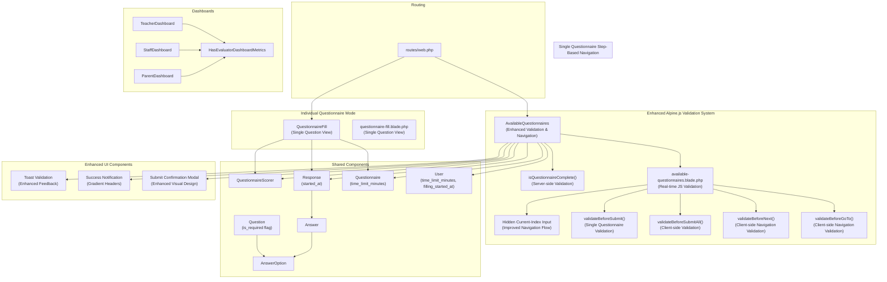
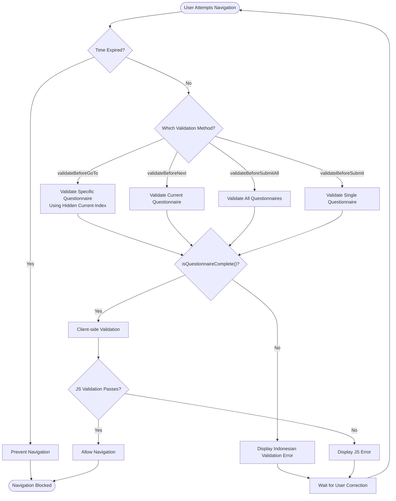
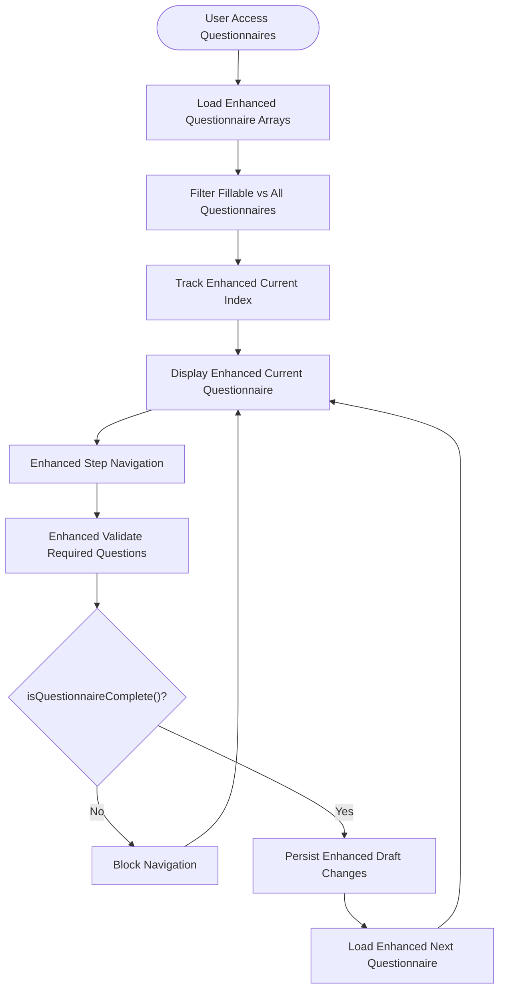
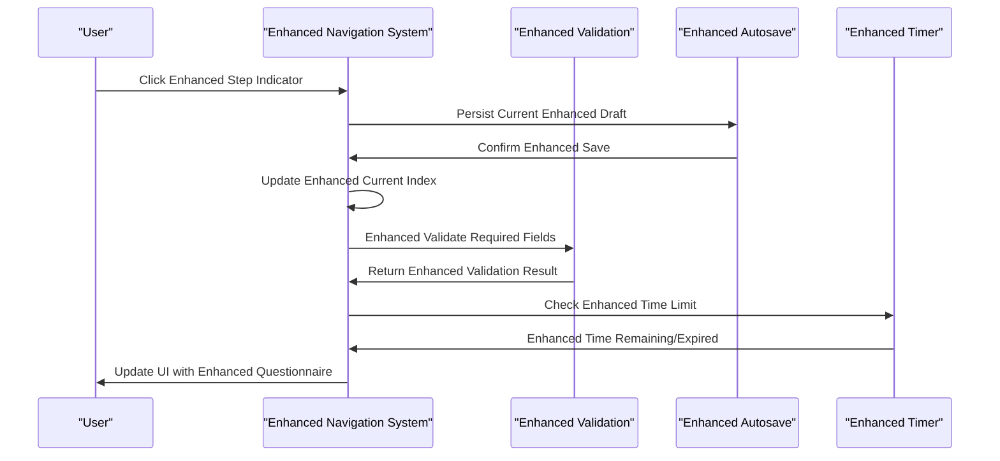
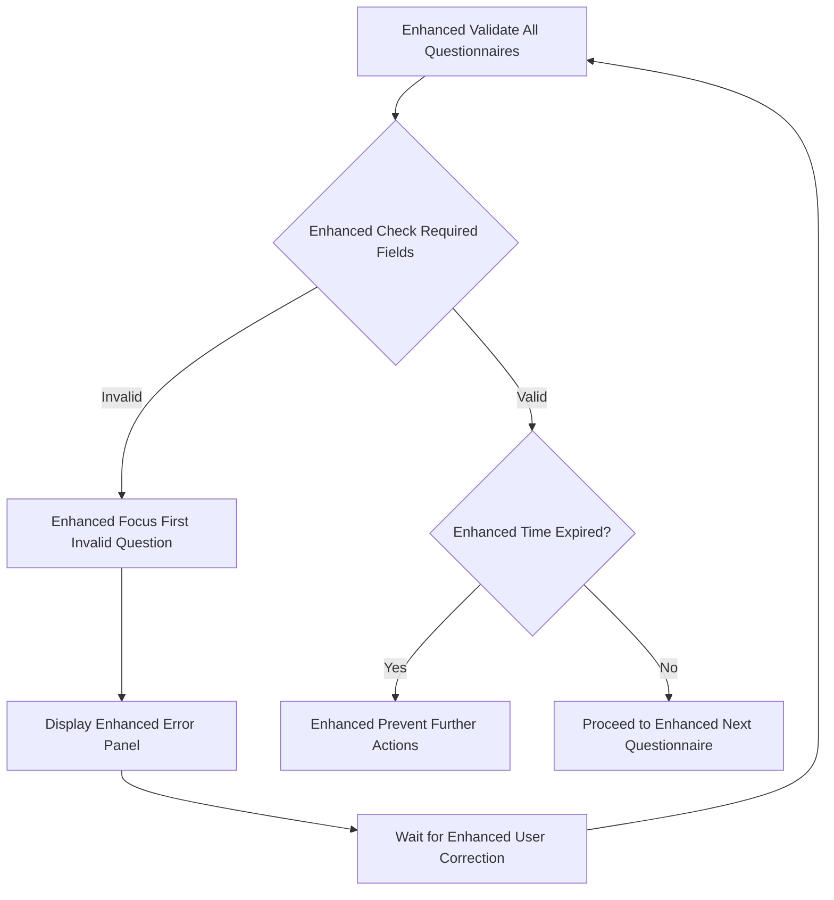
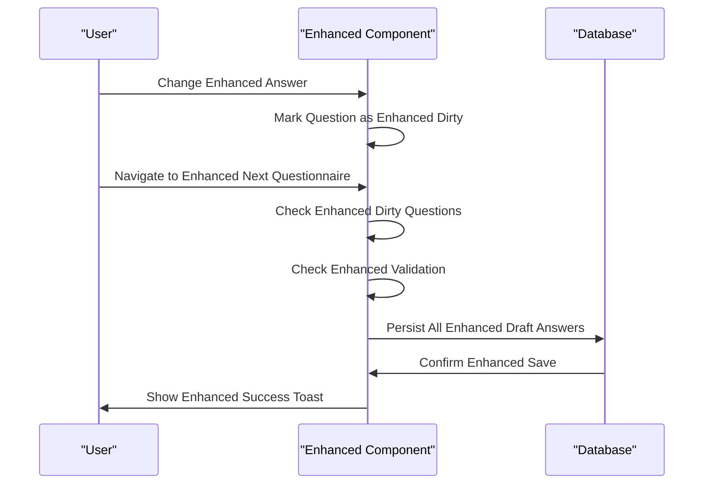
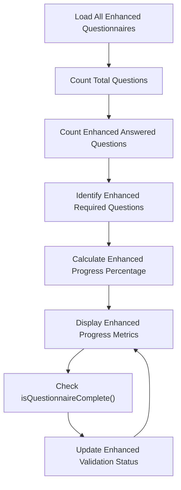
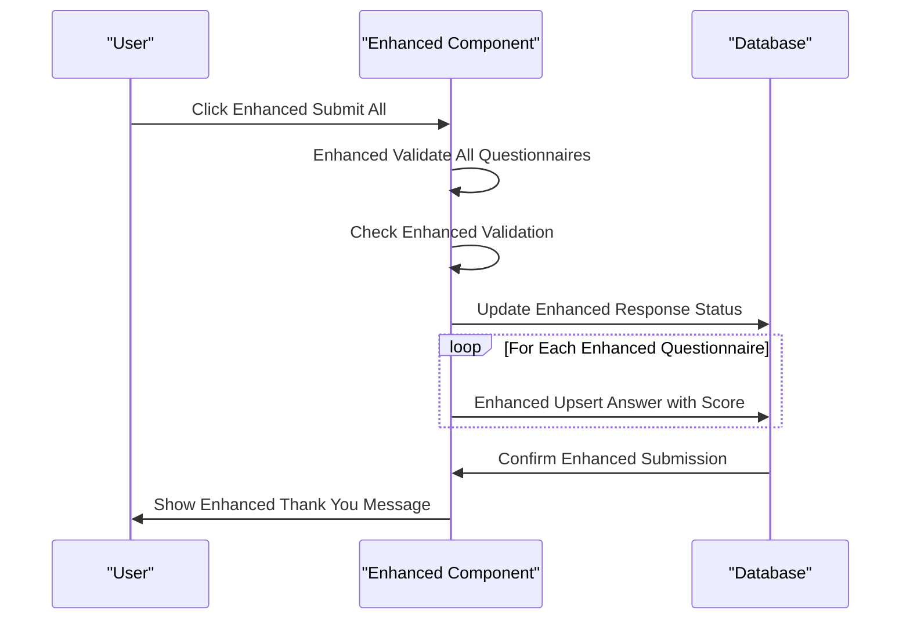

# Questionnaire Filling Interface

<cite>
**Referenced Files in This Document**
- [AvailableQuestionnaires.php](file://app/Livewire/Fill/AvailableQuestionnaires.php)
- [available-questionnaires.blade.php](file://resources/views/livewire/fill/available-questionnaires.blade.php)
- [QuestionnaireFill.php](file://app/Livewire/Fill/QuestionnaireFill.php)
- [questionnaire-fill.blade.php](file://resources/views/livewire/fill/questionnaire-fill.blade.php)
- [Questionnaire.php](file://app/Models/Questionnaire.php)
- [Question.php](file://app/Models/Question.php)
- [AnswerOption.php](file://app/Models/AnswerOption.php)
- [Response.php](file://app/Models/Response.php)
- [Answer.php](file://app/Models/Answer.php)
- [User.php](file://app/Models/User.php)
- [QuestionnaireScorer.php](file://app/Services/QuestionnaireScorer.php)
- [TeacherDashboard.php](file://app/Livewire/Fill/TeacherDashboard.php)
- [StaffDashboard.php](file://app/Livewire/Fill/StaffDashboard.php)
- [ParentDashboard.php](file://app/Livewire/Fill/ParentDashboard.php)
- [HasEvaluatorDashboardMetrics.php](file://app/Livewire/Fill/Concerns/HasEvaluatorDashboardMetrics.php)
- [2026_04_21_003136_add_time_limit_to_questionnaires_table.php](file://database/migrations/2026_04_21_003136_add_time_limit_to_questionnaires_table.php)
- [2026_04_21_020644_add_time_limit_and_filling_started_at_to_users_table.php](file://database/migrations/2026_04_21_020644_add_time_limit_and_filling_started_at_to_users_table.php)
- [features.php](file://config/features.php)
- [web.php](file://routes/web.php)
- [questionnaire-navigation-fix.md](file://docs/questionnaire-navigation-fix.md)
</cite>

## Update Summary
**Changes Made**
- Updated validation system documentation to reflect simplified requirements for essay and combined question types
- Enhanced documentation to clarify that essay and combined questions are now validated only when explicitly marked as required
- Updated validation mechanisms to show administrator flexibility in designing optional essay responses
- Revised validation rules to remove automatic requirement for essay and combined question types
- Updated progress tracking documentation to reflect new validation logic for required question counting

## Table of Contents
1. [Introduction](#introduction)
2. [System Architecture](#system-architecture)
3. [Core Components](#core-components)
4. [Enhanced Alpine.js Validation System](#enhanced-alpinejs-validation-system)
5. [Single Questionnaire Step-Based Navigation](#single-questionnaire-step-based-navigation)
6. [Navigation and User Experience](#navigation-and-user-experience)
7. [Question Types and Input Handling](#question-types-and-input-handling)
8. [Validation and Error Handling](#validation-and-error-handling)
9. [Autosave and Draft Management](#autosave-and-draft-management)
10. [Progress Tracking and Analytics](#progress-tracking-and-analytics)
11. [Submission and Finalization](#submission-and-finalization)
12. [Dashboard Components](#dashboard-components)
13. [Accessibility and Mobile Responsiveness](#accessibility-and-mobile-responsiveness)
14. [Performance Considerations](#performance-considerations)
15. [Troubleshooting Guide](#troubleshooting-guide)
16. [Conclusion](#conclusion)

## Introduction
This document describes the interactive questionnaire filling interface used by evaluators to complete assessment forms through a streamlined single-questionnaire step-based navigation system with comprehensive time-based completion capabilities. The interface features progressive questionnaire navigation, autosave functionality, step indicators, enhanced time limit management, automatic submission when time expires, and comprehensive validation mechanisms. It covers step-by-step navigation, question types (single choice, essay, combined), validation mechanisms, autosave and draft management, progress tracking, enhanced time-based session management, UI components, keyboard shortcuts, accessibility, and mobile responsiveness. The interface is built with Laravel Livewire and Blade, styled with Tailwind CSS and Flux UI components.

**Updated** The validation system has been enhanced to provide administrators greater flexibility by removing automatic requirements for essay and combined question types, allowing them to design questionnaires where certain essay responses or combined question components may be optional.

## System Architecture
The questionnaire filling system operates through a single-questionnaire step-based navigation approach with integrated enhanced validation that streamlines the user experience by focusing on one questionnaire at a time while maintaining cross-questionnaire progress tracking and robust validation constraints:



**Diagram sources**
- [AvailableQuestionnaires.php:18-705](file://app/Livewire/Fill/AvailableQuestionnaires.php#L18-L705)
- [available-questionnaires.blade.php:1-798](file://resources/views/livewire/fill/available-questionnaires.blade.php#L1-L798)
- [Questionnaire.php:23](file://app/Models/Questionnaire.php#L23)
- [Response.php:19](file://app/Models/Response.php#L19)
- [User.php:26-27](file://app/Models/User.php#L26-L27)
- [QuestionnaireFill.php:19-515](file://app/Livewire/Fill/QuestionnaireFill.php#L19-L515)
- [TeacherDashboard.php:10-23](file://app/Livewire/Fill/TeacherDashboard.php#L10-L23)
- [StaffDashboard.php:10-23](file://app/Livewire/Fill/StaffDashboard.php#L10-L23)
- [ParentDashboard.php:10-23](file://app/Livewire/Fill/ParentDashboard.php#L10-L23)
- [HasEvaluatorDashboardMetrics.php:9-73](file://app/Livewire/Fill/Concerns/HasEvaluatorDashboardMetrics.php#L9-L73)

**Section sources**
- [AvailableQuestionnaires.php:56-60](file://app/Livewire/Fill/AvailableQuestionnaires.php#L56-L60)
- [QuestionnaireFill.php:44-122](file://app/Livewire/Fill/QuestionnaireFill.php#L44-L122)
- [web.php:149-160](file://routes/web.php#L149-L160)

## Core Components
The system consists of two main components that work together to provide a streamlined questionnaire filling experience with comprehensive validation and enhanced user feedback:

### AvailableQuestionnaires Component
- **Progressive Navigation**: Manages multiple questionnaires through step-based navigation with $questionnaireIds/$allQuestionnaireIds arrays
- **Enhanced Alpine.js Validation System**: Implements comprehensive validation through `isQuestionnaireComplete()` method and real-time JavaScript validation with validateBeforeGoTo
- **Cross-Questionnaire Progress**: Provides overall progress tracking across all fillable questionnaires
- **Enhanced Time Limit Management**: Handles time-expired scenarios with automatic submission and session status indicators
- **Enhanced Session Timer Integration**: Manages user-level time limits and session start/end times with improved error handling
- **Enhanced Step Indicators**: Visual step markers showing current position in questionnaire sequence with enhanced validation status

### QuestionnaireFill Component
- **Single Question Focus**: Provides focused, distraction-free question answering for individual questionnaires
- **Step Navigation**: Sequential navigation with previous/next buttons and direct question access
- **Individual State Management**: Standalone response tracking with independent autosave functionality
- **Enhanced Progress Monitoring**: Separate progress tracking for each questionnaire with improved validation

### Dashboard Components
- **TeacherDashboard**, **StaffDashboard**, **ParentDashboard**: Role-specific dashboards with metrics and navigation
- **HasEvaluatorDashboardMetrics**: Shared trait for dashboard metric calculation

**Section sources**
- [AvailableQuestionnaires.php:25-45](file://app/Livewire/Fill/AvailableQuestionnaires.php#L25-L45)
- [AvailableQuestionnaires.php:53-54](file://app/Livewire/Fill/AvailableQuestionnaires.php#L53-L54)
- [AvailableQuestionnaires.php:42-42](file://app/Livewire/Fill/AvailableQuestionnaires.php#L42-L42)
- [QuestionnaireFill.php:21-42](file://app/Livewire/Fill/QuestionnaireFill.php#L21-L42)
- [TeacherDashboard.php:10-23](file://app/Livewire/Fill/TeacherDashboard.php#L10-L23)
- [StaffDashboard.php:10-23](file://app/Livewire/Fill/StaffDashboard.php#L10-L23)
- [ParentDashboard.php:10-23](file://app/Livewire/Fill/ParentDashboard.php#L10-L23)
- [HasEvaluatorDashboardMetrics.php:9-73](file://app/Livewire/Fill/Concerns/HasEvaluatorDashboardMetrics.php#L9-L73)

## Enhanced Alpine.js Validation System
The system implements a comprehensive enhanced validation mechanism that ensures questionnaire completion before allowing navigation and submission, with both server-side and client-side validation layers:

### Enhanced Alpine.js Validation Methods
- **validateBeforeGoTo(targetIndex)**: Validates current questionnaire before navigating to a specific questionnaire index, utilizing the hidden current-index input field for improved navigation flow
- **validateBeforeNext()**: Validates current questionnaire before moving to the next questionnaire
- **validateBeforeSubmitAll()**: Comprehensive validation for bulk submission with detailed error reporting
- **validateBeforeSubmit()**: Individual questionnaire validation for single-questionnaire mode with comprehensive error handling
- **validateAllRequiredQuestions()**: Validates all required questions across the entire questionnaire

### Enhanced Validation Error Handling
- **Indonesian Error Messages**: All validation errors display in Indonesian language for better user experience
- **Targeted Error Messages**: Displays specific error messages for each incomplete required question
- **Scroll-to-Error**: Automatically scrolls to the first invalid question for better user experience
- **Visual Error Indicators**: Highlights invalid questions with visual styling and error borders
- **Essay-Specific Validation**: Special handling for essay questions with character count validation

### Enhanced Validation State Management
- **Dynamic Validation State**: Maintains validation state for individual questions and displays targeted error messages
- **Invalid Question Tracking**: Tracks invalid question IDs for visual feedback and error highlighting
- **Essay Validation Tracking**: Special tracking for essay questions with character count validation
- **Validation Error Aggregation**: Collects and displays all validation errors in a unified panel

### Enhanced Navigation Flow Improvements
- **Hidden Current-Index Input**: Adds a hidden input field with id="current-index" that stores the current questionnaire index for improved navigation validation
- **Smart Navigation Logic**: Allows going back to previously visited tabs without validation while preventing forward navigation when incomplete
- **Client-Side Navigation Handlers**: Replaces Livewire click handlers with custom validation functions for better user experience



**Diagram sources**
- [available-questionnaires.blade.php:141-204](file://resources/views/livewire/fill/available-questionnaires.blade.php#L141-L204)
- [available-questionnaires.blade.php:86-140](file://resources/views/livewire/fill/available-questionnaires.blade.php#L86-L140)
- [available-questionnaires.blade.php:205-259](file://resources/views/livewire/fill/available-questionnaires.blade.php#L205-L259)
- [questionnaire-fill.blade.php:14-67](file://resources/views/livewire/fill/questionnaire-fill.blade.php#L14-L67)

**Section sources**
- [available-questionnaires.blade.php:141-204](file://resources/views/livewire/fill/available-questionnaires.blade.php#L141-L204)
- [available-questionnaires.blade.php:86-140](file://resources/views/livewire/fill/available-questionnaires.blade.php#L86-L140)
- [available-questionnaires.blade.php:205-259](file://resources/views/livewire/fill/available-questionnaires.blade.php#L205-L259)
- [questionnaire-fill.blade.php:14-67](file://resources/views/livewire/fill/questionnaire-fill.blade.php#L14-L67)
- [QuestionnaireFill.php:301-335](file://app/Livewire/Fill/QuestionnaireFill.php#L301-L335)

## Single Questionnaire Step-Based Navigation
The system implements a streamlined step-based navigation approach that focuses on one questionnaire at a time while maintaining cross-questionnaire awareness and integrating with the enhanced validation system:

### Enhanced Progressive Questionnaire Management
- **Ordered Questionnaire Arrays**: $questionnaireIds contains fillable questionnaire IDs, $allQuestionnaireIds includes all questionnaires
- **Current Index Tracking**: $currentIndex (0-based) manages position within the fillable questionnaire sequence
- **Enhanced Step-by-Step Navigation**: Previous/Next buttons with automatic draft saving and validation
- **Direct Access**: Step indicators allow jumping to any questionnaire in the sequence
- **Enhanced Validation Control**: Navigation disabled when `isQuestionnaireComplete()` returns false

### Enhanced State Management
- **Enhanced Dirty Question Tracking**: $dirtyQuestionIds array efficiently tracks which questions have unsaved changes
- **Enhanced Cross-Questionnaire Persistence**: Maintains separate responses for each questionnaire with selective autosave
- **Enhanced Validation Integration**: Automatic validation through `isQuestionnaireComplete()` method prevents progression
- **Enhanced Session Status Awareness**: Navigation and UI elements respond to enhanced session timer state



**Diagram sources**
- [AvailableQuestionnaires.php:234-301](file://app/Livewire/Fill/AvailableQuestionnaires.php#L234-L301)
- [AvailableQuestionnaires.php:153-184](file://app/Livewire/Fill/AvailableQuestionnaires.php#L153-L184)
- [AvailableQuestionnaires.php:342-363](file://app/Livewire/Fill/AvailableQuestionnaires.php#L342-L363)

**Section sources**
- [AvailableQuestionnaires.php:25-32](file://app/Livewire/Fill/AvailableQuestionnaires.php#L25-L32)
- [AvailableQuestionnaires.php:53-54](file://app/Livewire/Fill/AvailableQuestionnaires.php#L53-L54)
- [AvailableQuestionnaires.php:153-184](file://app/Livewire/Fill/AvailableQuestionnaires.php#L153-L184)
- [available-questionnaires.blade.php:144-196](file://resources/views/livewire/fill/available-questionnaires.blade.php#L144-L196)

## Navigation and User Experience
The system provides intuitive step-based navigation with enhanced user experience features including comprehensive validation and improved visual feedback:

### Enhanced Step-Based Navigation
- **Enhanced Visual Step Indicators**: Dots showing current, visited, and upcoming questionnaires with clear visual hierarchy
- **Progressive Loading**: Only loads current questionnaire questions to optimize performance
- **Enhanced Automatic Draft Saving**: Persists changes when navigating between questionnaires
- **Boundary Management**: Prevents navigation beyond questionnaire array bounds
- **Enhanced Validation Control**: Navigation disabled when `isQuestionnaireComplete()` returns false

### Enhanced User Experience Features
- **Enhanced Validation Feedback**: Real-time validation with error highlighting and scroll positioning
- **Responsive Design**: Adapts to different screen sizes with horizontal scrolling for step indicators
- **Accessibility Support**: Keyboard navigation and screen reader compatibility
- **Enhanced Session Status Indicators**: Clear visual indicators showing session state and remaining time



**Diagram sources**
- [AvailableQuestionnaires.php:153-184](file://app/Livewire/Fill/AvailableQuestionnaires.php#L153-L184)
- [AvailableQuestionnaires.php:342-363](file://app/Livewire/Fill/AvailableQuestionnaires.php#L342-L363)
- [available-questionnaires.blade.php:448-470](file://resources/views/livewire/fill/available-questionnaires.blade.php#L448-L470)

**Section sources**
- [AvailableQuestionnaires.php:153-184](file://app/Livewire/Fill/AvailableQuestionnaires.php#L153-L184)
- [available-questionnaires.blade.php:144-196](file://resources/views/livewire/fill/available-questionnaires.blade.php#L144-L196)
- [available-questionnaires.blade.php:198-212](file://resources/views/livewire/fill/available-questionnaires.blade.php#L198-L212)

## Question Types and Input Handling
The system supports three question types with specialized input handling optimized for the step-based navigation and enhanced validation:

### Single Choice Questions
- **Radio Button Interface**: Exclusive selection with immediate validation
- **Required Field Handling**: Enforced selection for required questions
- **Option Scoring**: Automatic score calculation based on selected option
- **Enhanced Validation Integration**: Integrated with `isQuestionnaireComplete()` method

### Essay Questions
- **Textarea Input**: Multi-line text input with character limits
- **Enhanced Live Validation**: Real-time validation with character counter
- **Debounced Updates**: Input debouncing to optimize performance
- **Enhanced Validation Integration**: Character count validation and required field enforcement
- **Administrator Flexibility**: Now validated only when explicitly marked as required in the questionnaire design

### Combined Questions
- **Dual Input System**: Radio button selection followed by essay explanation
- **Conditional Display**: Essay field appears only after option selection
- **Enhanced Comprehensive Validation**: Both selection and explanation required when marked as required
- **Enhanced Validation Integration**: Dual validation for both radio and textarea
- **Administrator Flexibility**: Now validated only when explicitly marked as required in the questionnaire design

**Updated** The validation system now provides administrators greater flexibility by removing automatic requirements for essay and combined question types. Questionnaires can now include optional essay responses and combined question components where administrators can choose whether these elements should be mandatory or optional.

```mermaid
classDiagram
class Question {
+int id
+string question_text
+string type
+bool is_required
+int order
+int time_limit_minutes
}
class AnswerOption {
+int id
+int question_id
+string option_text
+int score
+int order
}
class Answer {
+int id
+int response_id
+int question_id
+int answer_option_id
+string essay_answer
+int calculated_score
}
class User {
+int time_limit_minutes
+datetime filling_started_at
}
class Response {
+int id
+int questionnaire_id
+int user_id
+datetime started_at
+datetime submitted_at
+string status
}
Question "1" o-- "many" AnswerOption : "has many"
Answer "belongs to" Question : "question_id"
Answer "belongs to" AnswerOption : "answer_option_id"
Response "belongs to" Questionnaire : "questionnaire_id"
Response "belongs to" User : "user_id"
Answer "belongs to" Response : "response_id"
```

**Diagram sources**
- [Question.php:16-26](file://app/Models/Question.php#L16-L26)
- [AnswerOption.php:15-21](file://app/Models/AnswerOption.php#L15-L21)
- [Answer.php:15-22](file://app/Models/Answer.php#L15-L22)
- [User.php:26-27](file://app/Models/User.php#L26-L27)
- [Response.php:19](file://app/Models/Response.php#L19)

**Section sources**
- [available-questionnaires.blade.php:283-377](file://resources/views/livewire/fill/available-questionnaires.blade.php#L283-L377)
- [QuestionnaireFill.php:301-335](file://app/Livewire/Fill/QuestionnaireFill.php#L301-L335)
- [questionnaire-fill.blade.php:196-283](file://resources/views/livewire/fill/questionnaire-fill.blade.php#L196-L283)

## Validation and Error Handling
The system implements comprehensive validation at both individual question and cross-questionnaire levels with integrated enhanced validation system:

### Enhanced Per-Question Validation
- **Individual Question Validation**: Validates current question immediately on change
- **Enhanced Real-time Feedback**: Visual highlighting and error messages for invalid inputs
- **Type-Specific Rules**: Different validation rules based on question type
- **Enhanced Validation Integration**: Used by `isQuestionnaireComplete()` method

### Enhanced Cross-Questionnaire Validation
- **Global Validation**: Validates all required questions across all fillable questionnaires
- **Step Validation**: Ensures each questionnaire has valid responses before proceeding
- **Error Aggregation**: Collects and displays all validation errors in a unified panel
- **Enhanced Validation Prevention**: Validation prevented when time has expired

### Enhanced Error Handling Mechanisms
- **Automatic Focus**: Automatically focuses on first invalid question
- **Scroll Positioning**: Scrolls to invalid questions for better user experience
- **Persistent Error States**: Maintains error states until corrections are made
- **Enhanced Validation Feedback**: Comprehensive error messages with specific guidance

**Updated** The validation system now provides administrators greater flexibility by removing automatic requirements for essay and combined question types. The validation logic has been simplified to only enforce requirements when explicitly marked as required in the questionnaire design.



**Diagram sources**
- [AvailableQuestionnaires.php:446-486](file://app/Livewire/Fill/AvailableQuestionnaires.php#L446-L486)
- [AvailableQuestionnaires.php:201-223](file://app/Livewire/Fill/AvailableQuestionnaires.php#L201-L223)
- [QuestionnaireFill.php:342-388](file://app/Livewire/Fill/QuestionnaireFill.php#L342-L388)

**Section sources**
- [AvailableQuestionnaires.php:446-486](file://app/Livewire/Fill/AvailableQuestionnaires.php#L446-L486)
- [available-questionnaires.blade.php:198-212](file://resources/views/livewire/fill/available-questionnaires.blade.php#L198-L212)
- [questionnaire-fill.blade.php:102-115](file://resources/views/livewire/fill/questionnaire-fill.blade.php#L102-L115)

## Autosave and Draft Management
The enhanced autosave system provides robust draft persistence optimized for the step-based navigation model with integrated enhanced validation:

### Enhanced Progressive Autosave System
- **Navigation-Based Autosave**: Primary autosave triggered on navigation actions with $dirtyQuestionIds tracking
- **Manual Save Option**: Users can manually trigger autosave at any time
- **Efficient Persistence**: Only persists questions with actual answers, removing empty entries
- **Enhanced Validation Integration**: Autosave prevented when time has expired

### Enhanced Cross-Questionnaire Draft Management
- **Individual Response Tracking**: Each questionnaire maintains its own response state
- **Batch Processing**: Efficiently processes multiple questionnaires during autosave
- **Status Management**: Maintains draft status with timestamps for audit trails
- **Enhanced Validation Coordination**: Respects `isQuestionnaireComplete()` validation constraints

### Enhanced Draft Persistence Logic
- **Selective Persistence**: Only persists questions with actual answers
- **Empty Answer Cleanup**: Removes entries when both answer option and essay are empty
- **Enhanced Validation Integration**: Automatically handles validation constraints with forced submission
- **Enhanced Session Timer Coordination**: Coordinates with enhanced session timer for optimal autosave timing



**Diagram sources**
- [AvailableQuestionnaires.php:186-197](file://app/Livewire/Fill/AvailableQuestionnaires.php#L186-L197)
- [AvailableQuestionnaires.php:342-363](file://app/Livewire/Fill/AvailableQuestionnaires.php#L342-L363)

**Section sources**
- [AvailableQuestionnaires.php:186-197](file://app/Livewire/Fill/AvailableQuestionnaires.php#L186-L197)
- [AvailableQuestionnaires.php:342-444](file://app/Livewire/Fill/AvailableQuestionnaires.php#L342-L444)
- [QuestionnaireFill.php:146-154](file://app/Livewire/Fill/QuestionnaireFill.php#L146-L154)

## Progress Tracking and Analytics
The system provides comprehensive progress tracking across multiple questionnaires with real-time updates and integrated enhanced validation:

### Enhanced Cross-Questionnaire Metrics
- **Overall Progress**: Tracks answered vs total questions across all fillable questionnaires
- **Required Question Tracking**: Separates required from optional questions with completion percentages
- **Percentage Calculation**: Real-time progress percentage computation across all questionnaires
- **Enhanced Validation Monitoring**: Visual indicators showing questionnaire completion status
- **Enhanced Session Status Tracking**: Real-time session state and remaining time display

### Enhanced Individual Questionnaire Metrics
- **Question-Level Progress**: Tracks answered vs total questions for current questionnaire
- **Required Question Tracking**: Separates required from optional questions
- **Percentage Calculation**: Real-time progress percentage computation
- **Enhanced Validation Status**: Progress tracking integrated with `isQuestionnaireComplete()` method

### Enhanced Dashboard Integration
- **Role-Based Metrics**: Different metrics for teachers, staff, and parents
- **Submission Status**: Tracks completed vs pending questionnaire submissions
- **Enhanced Validation Analytics**: Completion timing and response patterns
- **Enhanced Session Statistics**: Time limit utilization and session effectiveness metrics

**Updated** The progress tracking now reflects the simplified validation system where essay and combined questions are only counted as required when explicitly marked as such in the questionnaire design, providing more accurate progress metrics.



**Diagram sources**
- [AvailableQuestionnaires.php:75-111](file://app/Livewire/Fill/AvailableQuestionnaires.php#L75-L111)
- [AvailableQuestionnaires.php:252-299](file://app/Livewire/Fill/QuestionnaireFill.php#L252-L299)

**Section sources**
- [AvailableQuestionnaires.php:75-111](file://app/Livewire/Fill/AvailableQuestionnaires.php#L75-L111)
- [AvailableQuestionnaires.php:117-119](file://app/Livewire/Fill/AvailableQuestionnaires.php#L117-L119)
- [QuestionnaireFill.php:252-299](file://app/Livewire/Fill/QuestionnaireFill.php#L252-L299)

## Submission and Finalization
The submission process is streamlined with enhanced validation, user confirmation, and comprehensive enhanced validation handling:

### Enhanced Cross-Questionnaire Submission
- **Bulk Submission**: Submits all fillable questionnaires simultaneously with validation
- **Enhanced Cross-Questionnaire Validation**: Validates all required questions across all questionnaires
- **Individual Response Creation**: Creates separate responses for each questionnaire
- **Enhanced Validation Handling**: Automatic submission when validation constraints are met

### Enhanced Finalization Process
- **Confirmation Dialog**: Shows summary of all responses before final submission
- **Transaction Processing**: Uses database transactions for data integrity
- **Success Feedback**: Provides clear success messages and navigation options
- **Enhanced Validation Integration**: Automatic submission when validation constraints are satisfied
- **Enhanced Session Status Update**: Updates enhanced session timer and status indicators

### Enhanced Single Questionnaire Submission
- **Individual Questionnaire Finalization**: Direct submission of one questionnaire
- **Immediate Validation**: Validates all required questions before submission
- **Score Calculation**: Calculates scores for all answered questions
- **Enhanced Validation Integration**: Handles single questionnaire submission with validation constraints

**Updated** The submission process now respects the simplified validation system where essay and combined questions are only validated when explicitly marked as required, allowing administrators to create more flexible questionnaire designs.



**Diagram sources**
- [AvailableQuestionnaires.php:216-232](file://app/Livewire/Fill/AvailableQuestionnaires.php#L216-L232)
- [AvailableQuestionnaires.php:582-668](file://app/Livewire/Fill/AvailableQuestionnaires.php#L582-L668)
- [QuestionnaireFill.php:172-245](file://app/Livewire/Fill/QuestionnaireFill.php#L172-L245)

**Section sources**
- [AvailableQuestionnaires.php:204-232](file://app/Livewire/Fill/AvailableQuestionnaires.php#L204-L232)
- [AvailableQuestionnaires.php:582-668](file://app/Livewire/Fill/AvailableQuestionnaires.php#L582-L668)
- [QuestionnaireFill.php:172-245](file://app/Livewire/Fill/QuestionnaireFill.php#L172-L245)

## Dashboard Components
The system includes role-specific dashboards with comprehensive metrics and enhanced validation analytics:

### Enhanced Dashboard Architecture
- **Trait-Based Implementation**: Uses HasEvaluatorDashboardMetrics trait for common functionality
- **Role-Based Filtering**: Filters questionnaires based on user roles and aliases
- **Enhanced Metric Aggregation**: Provides statistics for available, completed, and active questionnaires
- **Enhanced Validation Analytics**: Integrates validation and completion metrics

### Enhanced Dashboard Features
- **Available Questionnaires List**: Shows questionnaires eligible for the current user with validation information
- **Completed Questionnaires**: Lists previously submitted questionnaires with completion timestamps
- **Statistics Display**: Shows counts for active questionnaires, available to fill, and completed total
- **Navigation Integration**: Direct links to questionnaire filling interfaces
- **Enhanced Validation Status Display**: Shows current validation state and completion progress

### Enhanced Role-Specific Dashboards
- **Teacher Dashboard**: Metrics tailored for educational staff with enhanced validation analytics
- **Staff Dashboard**: Administrative staff questionnaire management with enhanced validation tracking
- **Parent Dashboard**: Parent portal for student-related questionnaires with enhanced validation awareness

**Section sources**
- [TeacherDashboard.php:10-23](file://app/Livewire/Fill/TeacherDashboard.php#L10-L23)
- [StaffDashboard.php:10-23](file://app/Livewire/Fill/StaffDashboard.php#L10-L23)
- [ParentDashboard.php:10-23](file://app/Livewire/Fill/ParentDashboard.php#L10-L23)
- [HasEvaluatorDashboardMetrics.php:9-73](file://app/Livewire/Fill/Concerns/HasEvaluatorDashboardMetrics.php#L9-L73)

## Accessibility and Mobile Responsiveness
The interface is designed with accessibility and mobile usability in mind, including comprehensive enhanced validation features:

### Enhanced Accessibility Features
- **Keyboard Navigation**: Full keyboard support for all interactive elements including enhanced validation controls
- **Screen Reader Support**: Proper ARIA attributes and semantic HTML for enhanced validation and session status
- **Focus Management**: Logical tab order and focus indication for enhanced validation display and controls
- **Color Contrast**: High contrast ratios for text and interactive elements, especially for enhanced validation states
- **Enhanced Validation Accessibility**: Special handling for validation states with clear accessibility cues

### Enhanced Mobile Responsiveness
- **Adaptive Layouts**: Responsive grid systems adapt to different screen sizes with enhanced validation display adjustments
- **Touch-Friendly Controls**: Appropriately sized touch targets for mobile devices including enhanced validation controls
- **Horizontal Scrolling**: Step indicators adapt to narrow screens with enhanced validation display optimization
- **Performance Optimization**: Optimized rendering for mobile browsers with enhanced validation efficiency
- **Enhanced Validation Display Optimization**: Validation display adapts to small screens with clear readability

### Enhanced User Experience Enhancements
- **Enhanced Toast Notifications**: Non-intrusive status updates with appropriate timing including enhanced validation feedback
- **Loading States**: Visual feedback during enhanced autosave and submission operations with enhanced validation synchronization
- **Error Communication**: Clear error messages with actionable guidance including enhanced validation notifications
- **Progress Visualization**: Intuitive progress indicators and completion tracking with enhanced validation updates
- **Enhanced Validation Communication**: Clear communication of validation state and completion progress to users

**Section sources**
- [available-questionnaires.blade.php:472-487](file://resources/views/livewire/fill/available-questionnaires.blade.php#L472-L487)
- [questionnaire-fill.blade.php:387-401](file://resources/views/livewire/fill/questionnaire-fill.blade.php#L387-L401)

## Performance Considerations
The system is optimized for efficient operation across multiple scenarios with integrated enhanced validation:

### Enhanced Rendering Optimization
- **Component-Level Rendering**: Only renders visible components and current questionnaire with enhanced validation display
- **Lazy Loading**: Questionnaires are loaded as needed based on user navigation with enhanced validation efficiency
- **Efficient Data Structures**: Enhanced optimized data structures for questionnaire and answer management with enhanced validation tracking
- **Enhanced Validation Efficiency**: Client-side validation optimization to minimize performance impact

### Enhanced Database Performance
- **Batch Operations**: Efficient batch processing for autosave and submission operations with enhanced validation constraints
- **Query Optimization**: Optimized queries for loading questionnaires and responses with enhanced validation filtering
- **Connection Pooling**: Proper database connection management for concurrent users with enhanced validation synchronization
- **Enhanced Validation Data Optimization**: Efficient handling of validation state data and enhanced constraint information

### Enhanced Memory Management
- **State Cleanup**: Automatic cleanup of unused state data including enhanced validation state and session information
- **Event Management**: Efficient event handling for autosave, validation, and enhanced validation operations
- **Resource Optimization**: Minimized memory footprint for large questionnaire sets with enhanced validation efficiency
- **Enhanced Validation Resource Management**: Optimized validation resource usage to prevent memory leaks

## Troubleshooting Guide
Common issues and their solutions with comprehensive enhanced validation troubleshooting:

### Enhanced Access and Authentication Issues
- **Cannot Access Questionnaires**: Verify user role matches questionnaire target groups
- **Permission Denied**: Check RBAC configuration and role aliases for proper access
- **Session Timeout**: Ensure user authentication is maintained throughout the enhanced session
- **Enhanced Validation Not Applied**: Verify `isQuestionnaireComplete()` method is properly implemented

### Enhanced Navigation Problems
- **Step Navigation Not Working**: Verify enhanced autosave completes successfully before navigation
- **Questionnaire Jump Issues**: Check that questionnaire IDs are properly mapped in arrays
- **Progress Tracking Errors**: Validate that enhanced progress calculations account for all question types
- **Enhanced Validation Not Triggering**: Check that `isQuestionnaireComplete()` method executes correctly
- **Hidden Current-Index Input Issues**: Verify the hidden input field with id="current-index" is present and functioning

### Enhanced Autosave and Draft Issues
- **Enhanced Autosave Not Triggering**: Ensure navigation events are firing correctly
- **Draft Not Saved**: Verify that answers meet enhanced validation criteria before autosave
- **Data Loss**: Check that database transactions are completing successfully
- **Enhanced Validation Autosave Issues**: Verify that autosave respects enhanced validation constraints

### Enhanced Validation and Submission Problems
- **Enhanced Validation Errors**: Review enhanced validation error messages and fix required fields
- **Submission Failures**: Check database connectivity and transaction status
- **Score Calculation Issues**: Verify that enhanced scoring logic matches expected outcomes
- **Enhanced Validation Submission Issues**: Check that enhanced auto-submit functionality works correctly

**Updated** The validation system now provides administrators greater flexibility by removing automatic requirements for essay and combined question types. If you encounter issues with essay or combined questions not being validated as expected, check that the questions are properly marked as required in the questionnaire design.

### Enhanced Validation System Issues
- **Enhanced Validation Not Displaying**: Verify that validation state is properly computed and passed to the view
- **Validation Not Detected**: Check that `isQuestionnaireComplete()` function executes correctly
- **Auto-Submit Not Working**: Verify that enhanced validation prevents progression when incomplete
- **Enhanced Validation State Issues**: Check that enhanced validation state management works correctly
- **validateBeforeGoTo Method Issues**: Verify that the JavaScript method properly utilizes the hidden current-index input field
- **validateBeforeSubmit Method Issues**: Verify that the single-questionnaire validation method properly validates all required questions

**Section sources**
- [AvailableQuestionnaires.php:56-60](file://app/Livewire/Fill/AvailableQuestionnaires.php#L56-L60)
- [AvailableQuestionnaires.php:153-184](file://app/Livewire/Fill/AvailableQuestionnaires.php#L153-L184)
- [questionnaire-fill.blade.php:102-115](file://resources/views/livewire/fill/questionnaire-fill.blade.php#L102-L115)

## Conclusion
The streamlined questionnaire filling interface provides a comprehensive, accessible, and responsive solution for evaluator assessment through progressive step-based navigation with integrated enhanced validation capabilities. The system's transformation from grouped questionnaire display to single-questionnaire step-based navigation delivers an excellent user experience with robust autosave functionality, comprehensive validation, rich progress tracking, and sophisticated enhanced validation integration across all device types and user roles. The enhanced validation system provides seamless questionnaire completion management, automatic validation handling, and comprehensive enhanced validation integration that ensures reliable and efficient questionnaire completion. The modular design ensures maintainability and extensibility for future enhancements while providing efficient performance optimization for large-scale questionnaire management with enhanced validation constraints.

**Updated** The recent enhancement to the validation system provides administrators greater flexibility by removing automatic requirements for essay and combined question types. This change allows administrators to design questionnaires where certain essay responses or combined question components may be optional, giving them more control over the assessment process while maintaining the robust validation framework that ensures data quality and completeness.

The implementation of the validateBeforeGoTo JavaScript method, validateBeforeNext method, validateBeforeSubmitAll method, and validateBeforeSubmit method represents a significant advancement in the validation system. These methods provide comprehensive client-side validation with real-time feedback, Indonesian error messages, and automatic scroll-to-error functionality. The replacement of Livewire click handlers with custom validation functions, and the addition of the hidden current-index input field represent significant improvements to the navigation flow and user experience. These changes ensure that users can navigate between questionnaires seamlessly while maintaining proper validation constraints and providing clear feedback when validation fails.

The simplified validation requirements for essay and combined question types represent a key improvement that enhances the flexibility of the questionnaire design system. Administrators can now create more nuanced assessment forms that balance the need for comprehensive data collection with practical considerations for respondent burden and assessment context.