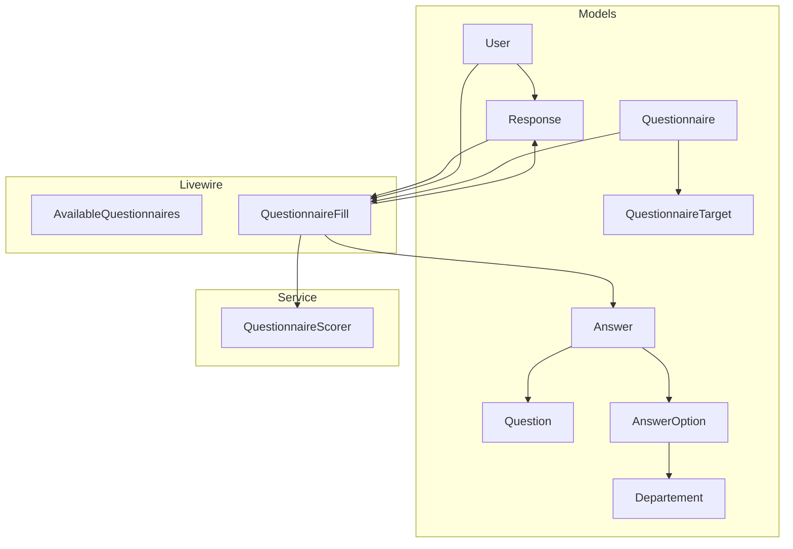
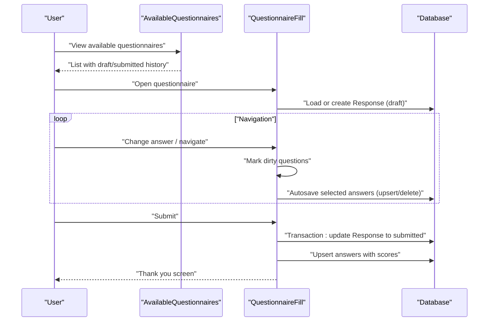
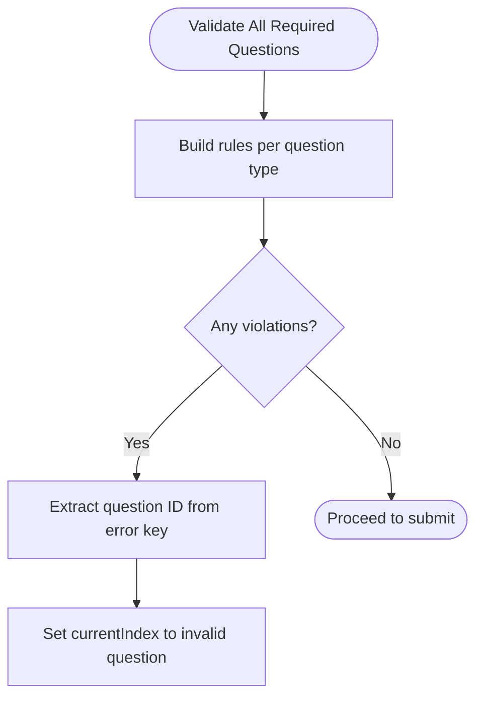
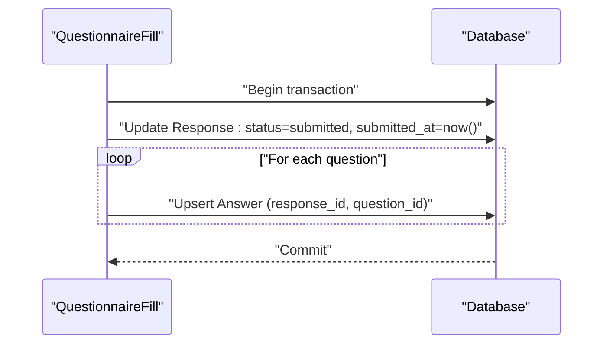
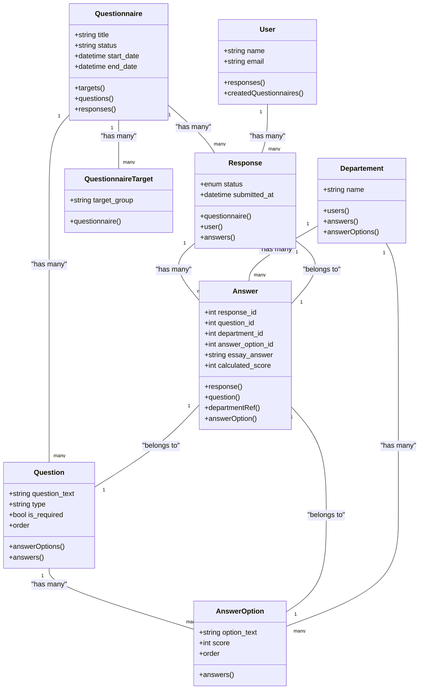
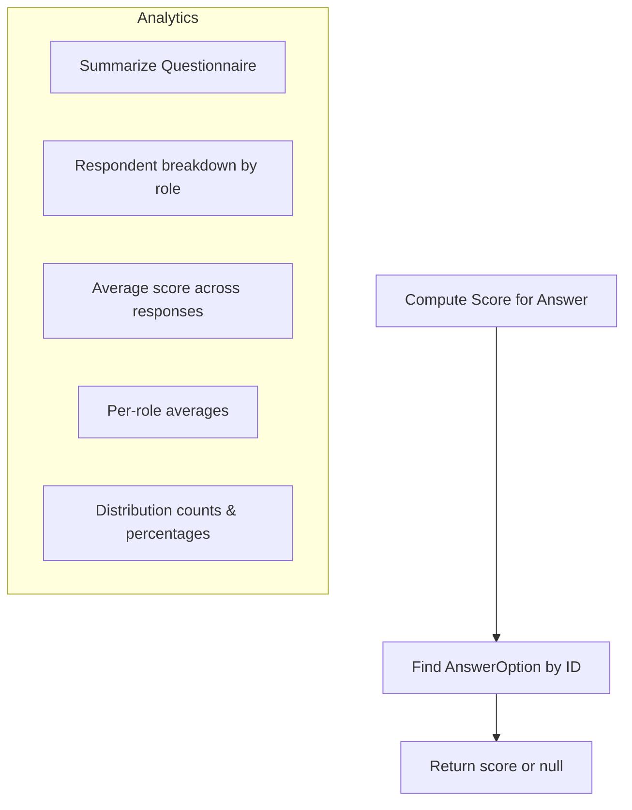
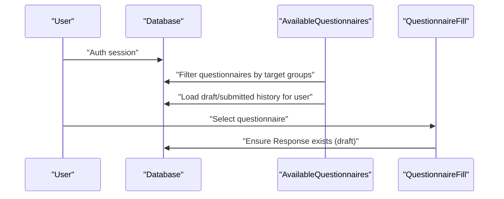
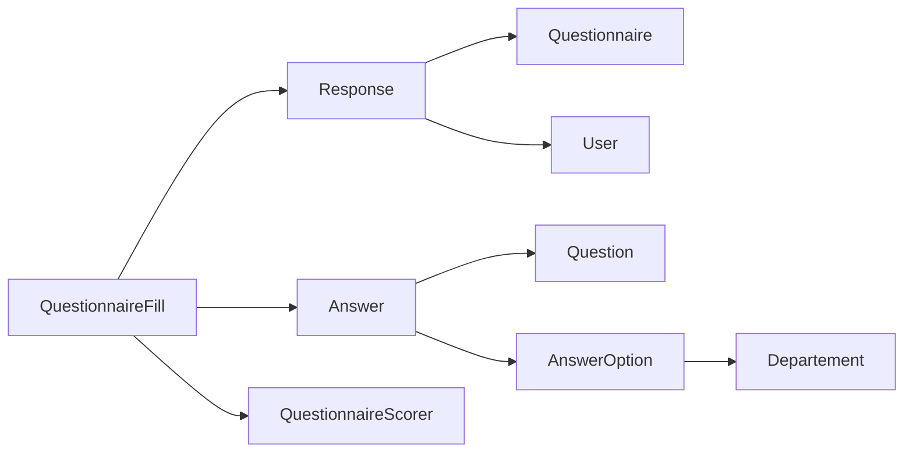

# Response Management

<cite>
**Referenced Files in This Document**
- [Response.php](file://app/Models/Response.php)
- [Answer.php](file://app/Models/Answer.php)
- [Questionnaire.php](file://app/Models/Questionnaire.php)
- [Question.php](file://app/Models/Question.php)
- [AnswerOption.php](file://app/Models/AnswerOption.php)
- [User.php](file://app/Models/User.php)
- [QuestionnaireTarget.php](file://app/Models/QuestionnaireTarget.php)
- [Departement.php](file://app/Models/Departement.php)
- [QuestionnaireScorer.php](file://app/Services/QuestionnaireScorer.php)
- [AvailableQuestionnaires.php](file://app/Livewire/Fill/AvailableQuestionnaires.php)
- [QuestionnaireFill.php](file://app/Livewire/Fill/QuestionnaireFill.php)
- [2026_04_16_020000_create_responses_table.php](file://database/migrations/2026_04_16_020000_create_responses_table.php)
- [2026_04_16_020100_create_answers_table.php](file://database/migrations/2026_04_16_020100_create_answers_table.php)
- [ResponseFactory.php](file://database/factories/ResponseFactory.php)
- [AnswerFactory.php](file://database/factories/AnswerFactory.php)
</cite>

## Table of Contents
1. [Introduction](#introduction)
2. [Project Structure](#project-structure)
3. [Core Components](#core-components)
4. [Architecture Overview](#architecture-overview)
5. [Detailed Component Analysis](#detailed-component-analysis)
6. [Dependency Analysis](#dependency-analysis)
7. [Performance Considerations](#performance-considerations)
8. [Troubleshooting Guide](#troubleshooting-guide)
9. [Conclusion](#conclusion)
10. [Appendices](#appendices)

## Introduction
This document describes the complete response management system for questionnaire filling and assessment. It covers the lifecycle from initial draft creation to final submission, including autosave mechanics, partial completion tracking, validation, transaction handling for concurrent submissions, and data integrity. It also documents the data models for responses and answers, scoring integration, and the relationships among responses, user sessions, and questionnaire assignments.

## Project Structure
The response management system spans Eloquent models, Livewire components, database migrations, factories, and a scoring service:
- Models define domain entities and relationships
- Livewire components orchestrate the UI and state transitions
- Migrations define the relational schema
- Factories support testing and seeding
- Scoring service computes scores for submitted answers

**Diagram sources**
- [Response.php:11-41](file://app/Models/Response.php#L11-L41)
- [Answer.php:10-43](file://app/Models/Answer.php#L10-L43)
- [Questionnaire.php:13-50](file://app/Models/Questionnaire.php#L13-L50)
- [Question.php:11-42](file://app/Models/Question.php#L11-L42)
- [AnswerOption.php:10-37](file://app/Models/AnswerOption.php#L10-L37)
- [User.php:12-57](file://app/Models/User.php#L12-L57)
- [QuestionnaireTarget.php:9-23](file://app/Models/QuestionnaireTarget.php#L9-L23)
- [Departement.php:9-33](file://app/Models/Departement.php#L9-L33)
- [AvailableQuestionnaires.php:12-63](file://app/Livewire/Fill/AvailableQuestionnaires.php#L12-L63)
- [QuestionnaireFill.php:19-514](file://app/Livewire/Fill/QuestionnaireFill.php#L19-L514)
- [QuestionnaireScorer.php:12-138](file://app/Services/QuestionnaireScorer.php#L12-L138)

**Section sources**
- [Response.php:11-41](file://app/Models/Response.php#L11-L41)
- [Answer.php:10-43](file://app/Models/Answer.php#L10-L43)
- [Questionnaire.php:13-50](file://app/Models/Questionnaire.php#L13-L50)
- [QuestionnaireFill.php:19-514](file://app/Livewire/Fill/QuestionnaireFill.php#L19-L514)

## Core Components
- Response: Represents a single user's attempt at a questionnaire, with draft/submitted status and timestamps.
- Answer: Stores per-question answers linked to a response, supporting multiple-choice, essay, and combined types.
- Questionnaire: Defines the survey with targets, questions, and lifecycle controls.
- Question: Holds question text, type, requirement flag, and ordering.
- AnswerOption: Options for multiple-choice questions with scores.
- User: Authenticates users and connects responses and roles.
- QuestionnaireTarget: Associates a questionnaire to target role slugs.
- Departement: Department context for answers and options.
- QuestionnaireScorer: Computes per-answer scores and aggregates analytics.

**Section sources**
- [Response.php:16-25](file://app/Models/Response.php#L16-L25)
- [Answer.php:15-22](file://app/Models/Answer.php#L15-L22)
- [Questionnaire.php:18-30](file://app/Models/Questionnaire.php#L18-L30)
- [Question.php:16-26](file://app/Models/Question.php#L16-L26)
- [AnswerOption.php:15-21](file://app/Models/AnswerOption.php#L15-L21)
- [User.php:16-37](file://app/Models/User.php#L16-L37)
- [QuestionnaireTarget.php:14-17](file://app/Models/QuestionnaireTarget.php#L14-L17)
- [Departement.php:13-17](file://app/Models/Departement.php#L13-L17)
- [QuestionnaireScorer.php:14-23](file://app/Services/QuestionnaireScorer.php#L14-L23)

## Architecture Overview
The response lifecycle is managed by Livewire components backed by Eloquent models and database transactions. Users select a questionnaire, navigate questions, autosave drafts, and submit when ready. Submission updates the response status and persists answers atomically.

**Diagram sources**
- [AvailableQuestionnaires.php:24-55](file://app/Livewire/Fill/AvailableQuestionnaires.php#L24-L55)
- [QuestionnaireFill.php:94-122](file://app/Livewire/Fill/QuestionnaireFill.php#L94-L122)
- [QuestionnaireFill.php:203-241](file://app/Livewire/Fill/QuestionnaireFill.php#L203-L241)
- [QuestionnaireFill.php:447-470](file://app/Livewire/Fill/QuestionnaireFill.php#L447-L470)

## Detailed Component Analysis

### Response Lifecycle and Draft Autosave
- Initial creation: On first visit, a draft Response is created for the user and questionnaire combination.
- Partial completion: As users change answers, dirty flags track modified questions; navigation triggers autosave.
- Autosave mechanics: Selected answers are upserted; empty answers are deleted for the current response.
- Submission: Final submission updates Response status to submitted and persists all answers in a single transaction, computing scores via the scoring service.

```mermaid
flowchart TD
Start(["Mount QuestionnaireFill"]) --> LoadDraft["Load or create Response (draft)"]
LoadDraft --> TrackDirty["Track dirty questions"]
TrackDirty --> Nav["Navigate / Change answer"]
Nav --> Autosave["Autosave selected answers<br/>Upsert/Delete per question"]
Autosave --> Nav
Nav --> Submit["Open submit confirmation"]
Submit --> Validate["Validate required questions"]
Validate --> |Fail| FocusError["Focus first invalid question"]
Validate --> |Pass| Finalize["Transaction: set submitted_at/status"]
Finalize --> PersistAnswers["Upsert answers with scores"]
PersistAnswers --> ThankYou(["Show thank you"])
```

**Diagram sources**
- [QuestionnaireFill.php:94-122](file://app/Livewire/Fill/QuestionnaireFill.php#L94-L122)
- [QuestionnaireFill.php:172-186](file://app/Livewire/Fill/QuestionnaireFill.php#L172-L186)
- [QuestionnaireFill.php:193-245](file://app/Livewire/Fill/QuestionnaireFill.php#L193-L245)
- [QuestionnaireFill.php:408-470](file://app/Livewire/Fill/QuestionnaireFill.php#L408-L470)

**Section sources**
- [QuestionnaireFill.php:94-122](file://app/Livewire/Fill/QuestionnaireFill.php#L94-L122)
- [QuestionnaireFill.php:172-186](file://app/Livewire/Fill/QuestionnaireFill.php#L172-L186)
- [QuestionnaireFill.php:193-245](file://app/Livewire/Fill/QuestionnaireFill.php#L193-L245)
- [QuestionnaireFill.php:408-470](file://app/Livewire/Fill/QuestionnaireFill.php#L408-L470)

### Submission Validation and Error Recovery
- Validation rules vary by question type and requirement flags.
- Required validations are checked before allowing submission; on failure, the component focuses the first invalid question.
- Error recovery: The component extracts the offending question from validation keys and jumps to it for correction.

**Diagram sources**
- [QuestionnaireFill.php:342-388](file://app/Livewire/Fill/QuestionnaireFill.php#L342-L388)
- [QuestionnaireFill.php:390-403](file://app/Livewire/Fill/QuestionnaireFill.php#L390-L403)

**Section sources**
- [QuestionnaireFill.php:301-335](file://app/Livewire/Fill/QuestionnaireFill.php#L301-L335)
- [QuestionnaireFill.php:342-388](file://app/Livewire/Fill/QuestionnaireFill.php#L342-L388)
- [QuestionnaireFill.php:390-403](file://app/Livewire/Fill/QuestionnaireFill.php#L390-L403)

### Transaction Handling and Data Integrity
- Submission uses a database transaction to ensure atomicity: updating Response status and writing/updating Answer rows together.
- Autosave also uses transactions to prevent partial writes during upsert/delete sequences.
- Unique constraints enforce one Response per user-questionnaire and one Answer per Response-question.

**Diagram sources**
- [QuestionnaireFill.php:203-241](file://app/Livewire/Fill/QuestionnaireFill.php#L203-L241)
- [2026_04_16_020000_create_responses_table.php:14-21](file://database/migrations/2026_04_16_020000_create_responses_table.php#L14-L21)
- [2026_04_16_020100_create_answers_table.php:12-21](file://database/migrations/2026_04_16_020100_create_answers_table.php#L12-L21)

**Section sources**
- [QuestionnaireFill.php:203-241](file://app/Livewire/Fill/QuestionnaireFill.php#L203-L241)
- [QuestionnaireFill.php:447-462](file://app/Livewire/Fill/QuestionnaireFill.php#L447-L462)
- [2026_04_16_020000_create_responses_table.php:14-21](file://database/migrations/2026_04_16_020000_create_responses_table.php#L14-L21)
- [2026_04_16_020100_create_answers_table.php:12-21](file://database/migrations/2026_04_16_020100_create_answers_table.php#L12-L21)

### Data Models and Relationships
The models define a strict hierarchy: Questionnaire contains Questions; Users create Responses; Responses contain Answers; Answers link to Questions and AnswerOptions and optionally carry calculated scores.

**Diagram sources**
- [Questionnaire.php:18-50](file://app/Models/Questionnaire.php#L18-L50)
- [Question.php:16-41](file://app/Models/Question.php#L16-L41)
- [AnswerOption.php:15-36](file://app/Models/AnswerOption.php#L15-L36)
- [Response.php:16-40](file://app/Models/Response.php#L16-L40)
- [Answer.php:15-42](file://app/Models/Answer.php#L15-L42)
- [User.php:16-47](file://app/Models/User.php#L16-L47)
- [QuestionnaireTarget.php:14-22](file://app/Models/QuestionnaireTarget.php#L14-L22)
- [Departement.php:13-32](file://app/Models/Departement.php#L13-L32)

**Section sources**
- [Questionnaire.php:18-50](file://app/Models/Questionnaire.php#L18-L50)
- [Question.php:16-41](file://app/Models/Question.php#L16-L41)
- [AnswerOption.php:15-36](file://app/Models/AnswerOption.php#L15-L36)
- [Response.php:16-40](file://app/Models/Response.php#L16-L40)
- [Answer.php:15-42](file://app/Models/Answer.php#L15-L42)
- [User.php:16-47](file://app/Models/User.php#L16-L47)
- [QuestionnaireTarget.php:14-22](file://app/Models/QuestionnaireTarget.php#L14-L22)
- [Departement.php:13-32](file://app/Models/Departement.php#L13-L32)

### Scoring Integration and Analytics
- Per-answer scoring: The scoring service reads the selected AnswerOption score for a given question.
- Analytics: The service aggregates counts, averages, question scores, and distribution percentages for submitted responses.

**Diagram sources**
- [QuestionnaireScorer.php:14-23](file://app/Services/QuestionnaireScorer.php#L14-L23)
- [QuestionnaireScorer.php:33-112](file://app/Services/QuestionnaireScorer.php#L33-L112)

**Section sources**
- [QuestionnaireScorer.php:14-23](file://app/Services/QuestionnaireScorer.php#L14-L23)
- [QuestionnaireScorer.php:33-112](file://app/Services/QuestionnaireScorer.php#L33-L112)

### Relationship Between Responses, User Sessions, and Assignments
- Assignment: Questionnaires declare target groups via QuestionnaireTarget entries; users’ role slugs determine eligibility.
- Session: Livewire components rely on the authenticated user to filter available questionnaires and to create/update responses.
- History: The available questionnaires page surfaces draft and submitted histories filtered by user and target groups.

**Diagram sources**
- [AvailableQuestionnaires.php:16-55](file://app/Livewire/Fill/AvailableQuestionnaires.php#L16-L55)
- [QuestionnaireFill.php:44-103](file://app/Livewire/Fill/QuestionnaireFill.php#L44-L103)
- [Questionnaire.php:52-108](file://app/Models/Questionnaire.php#L52-L108)
- [User.php:59-67](file://app/Models/User.php#L59-L67)

**Section sources**
- [AvailableQuestionnaires.php:16-55](file://app/Livewire/Fill/AvailableQuestionnaires.php#L16-L55)
- [QuestionnaireFill.php:44-103](file://app/Livewire/Fill/QuestionnaireFill.php#L44-L103)
- [Questionnaire.php:52-108](file://app/Models/Questionnaire.php#L52-L108)
- [User.php:59-67](file://app/Models/User.php#L59-L67)

## Dependency Analysis
- Cohesion: QuestionnaireFill orchestrates Response and Answer persistence; it depends on QuestionnaireScorer for scoring.
- Coupling: Livewire components depend on models and services; migrations define schema-level constraints.
- Constraints: Unique indexes on (questionnaire_id, user_id) and (response_id, question_id) enforce data integrity.

**Diagram sources**
- [QuestionnaireFill.php:19-514](file://app/Livewire/Fill/QuestionnaireFill.php#L19-L514)
- [Response.php:11-41](file://app/Models/Response.php#L11-L41)
- [Answer.php:10-43](file://app/Models/Answer.php#L10-L43)
- [QuestionnaireScorer.php:12-138](file://app/Services/QuestionnaireScorer.php#L12-L138)
- [Questionnaire.php:13-50](file://app/Models/Questionnaire.php#L13-L50)
- [Question.php:11-42](file://app/Models/Question.php#L11-L42)
- [AnswerOption.php:10-37](file://app/Models/AnswerOption.php#L10-L37)
- [Departement.php:9-33](file://app/Models/Departement.php#L9-L33)

**Section sources**
- [QuestionnaireFill.php:19-514](file://app/Livewire/Fill/QuestionnaireFill.php#L19-L514)
- [Response.php:11-41](file://app/Models/Response.php#L11-L41)
- [Answer.php:10-43](file://app/Models/Answer.php#L10-L43)
- [QuestionnaireScorer.php:12-138](file://app/Services/QuestionnaireScorer.php#L12-L138)
- [Questionnaire.php:13-50](file://app/Models/Questionnaire.php#L13-L50)
- [Question.php:11-42](file://app/Models/Question.php#L11-L42)
- [AnswerOption.php:10-37](file://app/Models/AnswerOption.php#L10-L37)
- [Departement.php:9-33](file://app/Models/Departement.php#L9-L33)

## Performance Considerations
- Upsert batching: Autosave and submission batch upserts per question to minimize round-trips.
- Indexes: Unique indexes on Response-question pairs and Response-user pairs reduce write conflicts and improve lookup performance.
- Scoring: Scores are computed in-memory from AnswerOption associations; analytics queries leverage joins and grouping for aggregation.
- Concurrency: Transactions serialize critical sections for submission and autosave, preventing race conditions.

[No sources needed since this section provides general guidance]

## Troubleshooting Guide
- Autosave not persisting: Verify that dirty flags are set and navigation dispatches autosave; confirm upsert/delete paths execute within a transaction.
- Submission fails validation: Inspect the first invalid question index derived from validation keys and ensure required fields are populated.
- Duplicate response error: Confirm unique constraint on (questionnaire_id, user_id) and that a draft Response exists before autosave.
- Score missing after submission: Ensure AnswerOption IDs are valid and normalized; scoring occurs only when a valid option is present.

**Section sources**
- [QuestionnaireFill.php:408-470](file://app/Livewire/Fill/QuestionnaireFill.php#L408-L470)
- [QuestionnaireFill.php:342-388](file://app/Livewire/Fill/QuestionnaireFill.php#L342-L388)
- [2026_04_16_020000_create_responses_table.php:14-21](file://database/migrations/2026_04_16_020000_create_responses_table.php#L14-L21)
- [QuestionnaireFill.php:483-493](file://app/Livewire/Fill/QuestionnaireFill.php#L483-L493)

## Conclusion
The response management system integrates Livewire-driven UI with robust Eloquent models and database transactions to support a seamless draft-and-submit workflow. Autosave ensures progress is preserved, validation prevents incomplete submissions, and transactions guarantee data integrity. Scoring and analytics services provide post-submission insights, while assignment logic ties responses to eligible users through questionnaire targets.

[No sources needed since this section summarizes without analyzing specific files]

## Appendices

### Data Model Definitions
- Response: status, submitted_at, foreign keys to Questionnaire and User, unique composite index with questionnaire_id and user_id.
- Answer: foreign keys to Response and Question, optional AnswerOption and essay answer, unique composite index with response_id and question_id.
- Questionnaire: title, description, dates, status, targets, questions, responses.
- Question: question_text, type, is_required, order, answerOptions, answers.
- AnswerOption: option_text, score, order, question, answers.
- User: authenticatable fields, role and department relations, responses and createdQuestionnaires.
- QuestionnaireTarget: target_group, questionnaire.
- Departement: name, description, users, answers, answerOptions.

**Section sources**
- [2026_04_16_020000_create_responses_table.php:10-22](file://database/migrations/2026_04_16_020000_create_responses_table.php#L10-L22)
- [2026_04_16_020100_create_answers_table.php:10-22](file://database/migrations/2026_04_16_020100_create_answers_table.php#L10-L22)
- [Response.php:16-25](file://app/Models/Response.php#L16-L25)
- [Answer.php:15-22](file://app/Models/Answer.php#L15-L22)
- [Questionnaire.php:18-30](file://app/Models/Questionnaire.php#L18-L30)
- [Question.php:16-26](file://app/Models/Question.php#L16-L26)
- [AnswerOption.php:15-21](file://app/Models/AnswerOption.php#L15-L21)
- [User.php:16-37](file://app/Models/User.php#L16-L37)
- [QuestionnaireTarget.php:14-17](file://app/Models/QuestionnaireTarget.php#L14-L17)
- [Departement.php:13-17](file://app/Models/Departement.php#L13-L17)

### Example Workflows
- Draft creation: On first load, a draft Response is created for the current user and questionnaire.
- Partial completion: Navigate between questions; autosave writes only changed answers.
- Submission: Validate required questions; on success, commit transaction to finalize submission.

**Section sources**
- [QuestionnaireFill.php:94-122](file://app/Livewire/Fill/QuestionnaireFill.php#L94-L122)
- [QuestionnaireFill.php:172-186](file://app/Livewire/Fill/QuestionnaireFill.php#L172-L186)
- [QuestionnaireFill.php:193-245](file://app/Livewire/Fill/QuestionnaireFill.php#L193-L245)