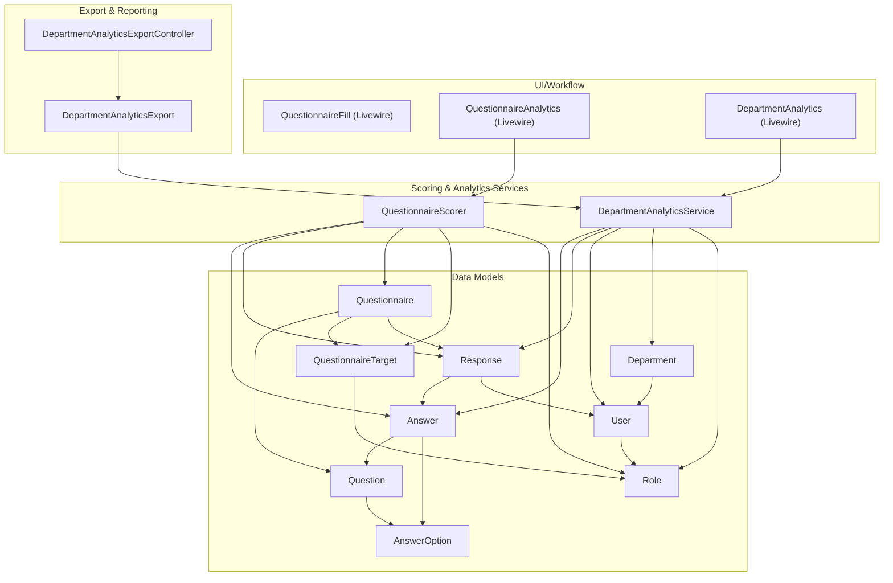
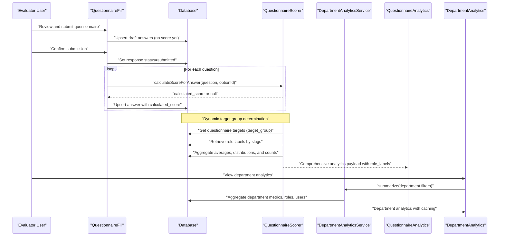
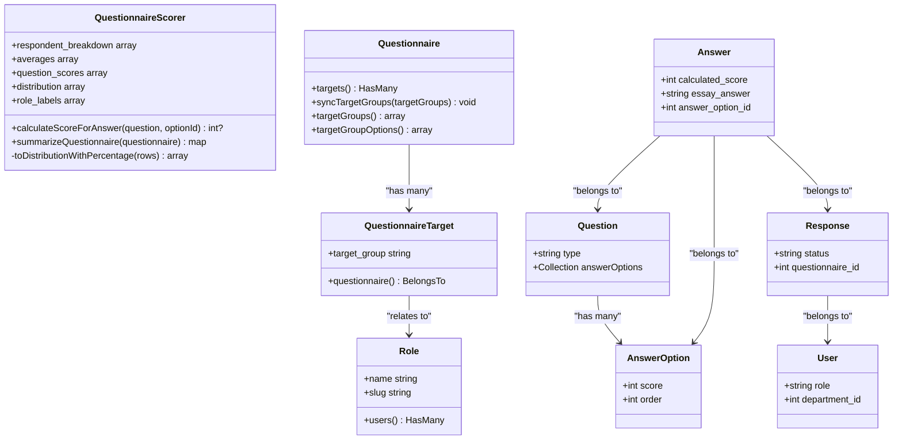
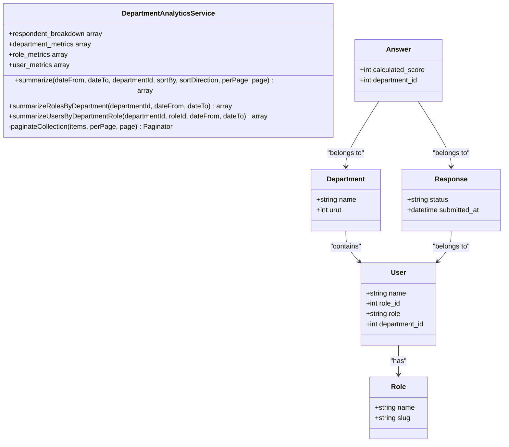
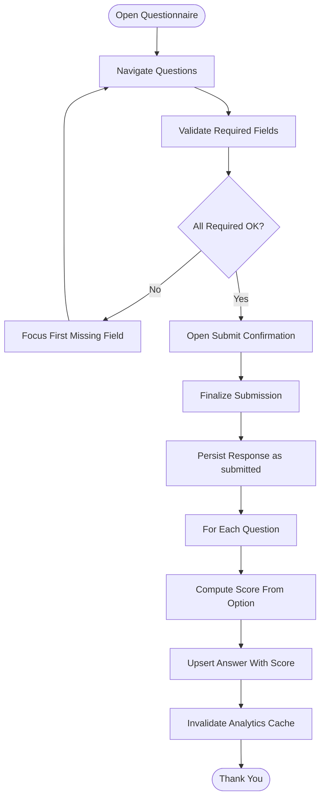
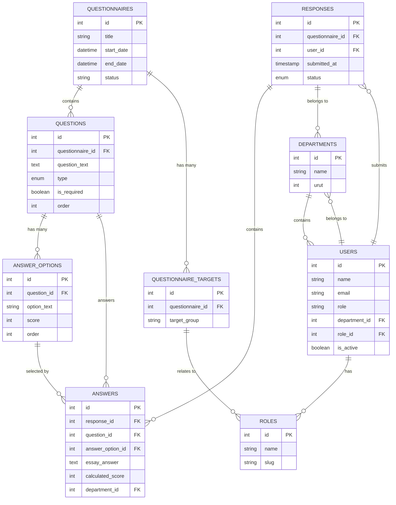
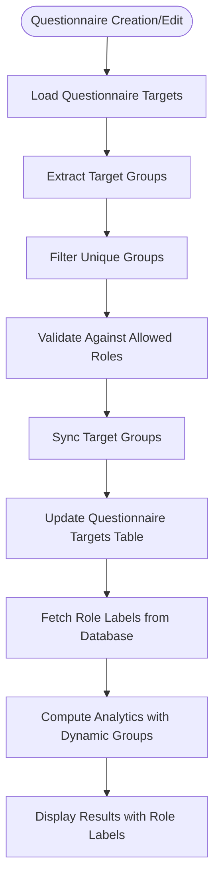
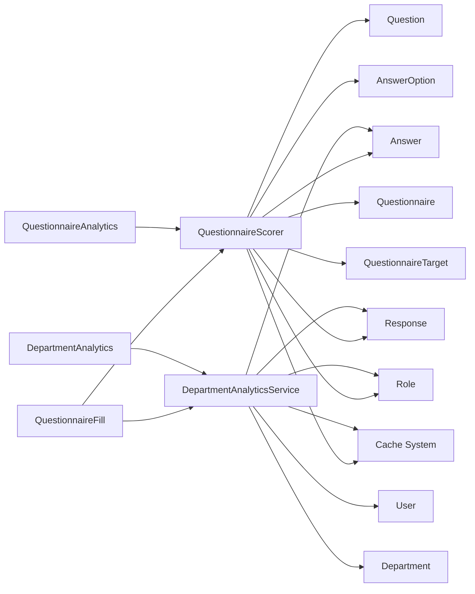

# Scoring Algorithm

<cite>
**Referenced Files in This Document**
- [QuestionnaireScorer.php](file://app/Services/QuestionnaireScorer.php)
- [QuestionnaireFill.php](file://app/Livewire/Fill/QuestionnaireFill.php)
- [Answer.php](file://app/Models/Answer.php)
- [AnswerOption.php](file://app/Models/AnswerOption.php)
- [Question.php](file://app/Models/Question.php)
- [Response.php](file://app/Models/Response.php)
- [Questionnaire.php](file://app/Models/Questionnaire.php)
- [QuestionnaireTarget.php](file://app/Models/QuestionnaireTarget.php)
- [Role.php](file://app/Models/Role.php)
- [DepartmentAnalyticsService.php](file://app/Services/DepartmentAnalyticsService.php)
- [QuestionnaireAnalytics.php](file://app/Livewire/Admin/QuestionnaireAnalytics.php)
- [DepartmentAnalytics.php](file://app/Livewire/Admin/DepartmentAnalytics.php)
- [DepartmentAnalyticsExport.php](file://app/Exports/DepartmentAnalyticsExport.php)
- [DepartmentAnalyticsExportController.php](file://app/Http/Controllers/Admin/DepartmentAnalyticsExportController.php)
- [2026_04_16_010241_create_questions_table.php](file://database/migrations/2026_04_16_010241_create_questions_table.php)
- [2026_04_16_010242_create_answer_options_table.php](file://database/migrations/2026_04_16_010242_create_answer_options_table.php)
- [2026_04_16_020000_create_responses_table.php](file://database/migrations/2026_04_16_020000_create_responses_table.php)
- [2026_04_16_020100_create_answers_table.php](file://database/migrations/2026_04_16_020100_create_answers_table.php)
- [2026_04_16_010240_create_questionnaire_targets_table.php](file://database/migrations/2026_04_16_010240_create_questionnaire_targets_table.php)
- [2026_04_17_093035_create_roles_table.php](file://database/migrations/2026_04_17_093035_create_roles_table.php)
- [rbac.php](file://config/rbac.php)
- [07-scoring.md](file://.clinerules/07-scoring.md)
</cite>

## Update Summary
**Changes Made**
- Enhanced QuestionnaireScorer.php to dynamically determine target groups from questionnaire relationships instead of using static configuration
- Added database-driven role label retrieval mechanism for improved flexibility
- Updated analytics computation to use dynamic role slugs from questionnaire targets
- Enhanced scoring service architecture with database-backed role management
- Improved role label resolution with fallback to configuration-based labels
- Implemented comprehensive dynamic target group management system with Questionnaire model enhancements

## Table of Contents
1. [Introduction](#introduction)
2. [Project Structure](#project-structure)
3. [Core Components](#core-components)
4. [Architecture Overview](#architecture-overview)
5. [Detailed Component Analysis](#detailed-component-analysis)
6. [Enhanced Analytics Capabilities](#enhanced-analytics-capabilities)
7. [Dynamic Target Group Management](#dynamic-target-group-management)
8. [Dependency Analysis](#dependency-analysis)
9. [Performance Considerations](#performance-considerations)
10. [Troubleshooting Guide](#troubleshooting-guide)
11. [Conclusion](#conclusion)
12. [Appendices](#appendices)

## Introduction
This document explains the automated scoring algorithm used in questionnaire evaluation with enhanced analytics capabilities and dynamic target group management. The system now provides comprehensive statistical analysis including respondent breakdown by role, overall and group-specific averages, question-by-question score distributions, and detailed answer option distributions with percentage calculations. The enhanced scoring service dynamically determines target groups from questionnaire relationships and retrieves role labels from the database, replacing the previous static configuration approach. It covers how scores are calculated for single-choice, essay, and combined question types, how weighted scoring is applied via answer options, and how aggregated analytics are produced at both questionnaire and department levels. The document also documents the scoring service architecture, calculation precision, performance optimization techniques, and integration with the overall evaluation workflow.

## Project Structure
The scoring system spans several model, service, and analytics layers with enhanced statistical capabilities and dynamic target group management:
- Data models define the persisted structures for questions, answer options, responses, answers, questionnaires, questionnaire targets, and roles.
- The scoring service encapsulates scoring logic and comprehensive analytics computation with dynamic target group determination.
- Department analytics service provides organizational-level insights with role and user breakdowns.
- The questionnaire fill Livewire component orchestrates submission and triggers scoring during finalization.
- Analytics components handle caching, visualization, and export functionality with dynamic role label resolution.

**Diagram sources**
- [QuestionnaireScorer.php:12-150](file://app/Services/QuestionnaireScorer.php#L12-L150)
- [DepartmentAnalyticsService.php:12-279](file://app/Services/DepartmentAnalyticsService.php#L12-L279)
- [QuestionnaireFill.php:19-515](file://app/Livewire/Fill/QuestionnaireFill.php#L19-L515)
- [QuestionnaireAnalytics.php:15-74](file://app/Livewire/Admin/QuestionnaireAnalytics.php#L15-L74)
- [DepartmentAnalytics.php:13-271](file://app/Livewire/Admin/DepartmentAnalytics.php#L13-L271)
- [Answer.php:10-44](file://app/Models/Answer.php#L10-L44)
- [AnswerOption.php:10-38](file://app/Models/AnswerOption.php#L10-L38)
- [Question.php:11-43](file://app/Models/Question.php#L11-L43)
- [Response.php:11-42](file://app/Models/Response.php#L11-L42)
- [Questionnaire.php:13-133](file://app/Models/Questionnaire.php#L13-L133)
- [QuestionnaireTarget.php:1-24](file://app/Models/QuestionnaireTarget.php#L1-L24)
- [Role.php:1-31](file://app/Models/Role.php#L1-L31)
- [Department.php](file://app/Models/Departement.php)
- [User.php](file://app/Models/User.php)

**Section sources**
- [QuestionnaireScorer.php:12-150](file://app/Services/QuestionnaireScorer.php#L12-L150)
- [DepartmentAnalyticsService.php:12-279](file://app/Services/DepartmentAnalyticsService.php#L12-L279)
- [QuestionnaireFill.php:19-515](file://app/Livewire/Fill/QuestionnaireFill.php#L19-L515)
- [QuestionnaireAnalytics.php:15-74](file://app/Livewire/Admin/QuestionnaireAnalytics.php#L15-L74)
- [DepartmentAnalytics.php:13-271](file://app/Livewire/Admin/DepartmentAnalytics.php#L13-L271)
- [Answer.php:10-44](file://app/Models/Answer.php#L10-L44)
- [AnswerOption.php:10-38](file://app/Models/AnswerOption.php#L10-L38)
- [Question.php:11-43](file://app/Models/Question.php#L11-L43)
- [Response.php:11-42](file://app/Models/Response.php#L11-L42)
- [Questionnaire.php:13-133](file://app/Models/Questionnaire.php#L13-L133)

## Core Components
- **QuestionnaireScorer**: Central scoring service that computes per-answer scores and produces comprehensive analytics summaries including dynamic target group determination, respondent breakdown by role, averages, question scores, and detailed distributions with role label resolution.
- **DepartmentAnalyticsService**: Advanced analytics service providing organizational-level insights with role-based and user-level breakdowns, participation rates, and performance metrics.
- **QuestionnaireFill**: Submission workflow that persists answers and triggers scoring at finalization.
- **Models**: Question, AnswerOption, Response, Answer, Questionnaire, QuestionnaireTarget, Role, Department, User define the data schema and relationships with enhanced target group management.

**Enhanced Analytics Features**:
- Dynamic target group determination from questionnaire relationships
- Database-driven role label retrieval with fallback mechanisms
- Comprehensive respondent breakdown by role with caching mechanisms
- Overall and group-specific averages computation with dynamic role slugs
- Question-by-question score distributions with percentage calculations
- Detailed answer option distributions including count and percentage metrics
- Department-level analytics with role and user breakdowns
- Export functionality for analytics data

**Precision and Rounding**:
- Averages are rounded to two decimal places
- Percentages are rounded to two decimal places for distribution metrics
- Participation rates are rounded to one decimal place for department analytics

**Section sources**
- [QuestionnaireScorer.php:14-150](file://app/Services/QuestionnaireScorer.php#L14-L150)
- [DepartmentAnalyticsService.php:14-279](file://app/Services/DepartmentAnalyticsService.php#L14-L279)
- [QuestionnaireFill.php:193-245](file://app/Livewire/Fill/QuestionnaireFill.php#L193-L245)
- [Answer.php:15-22](file://app/Models/Answer.php#L15-L22)
- [AnswerOption.php:15-21](file://app/Models/AnswerOption.php#L15-L21)
- [Question.php:16-26](file://app/Models/Question.php#L16-L26)

## Architecture Overview
The enhanced scoring pipeline integrates UI submission, persistence, comprehensive analytics computation with dynamic target group management, and advanced reporting capabilities.

**Diagram sources**
- [QuestionnaireFill.php:193-245](file://app/Livewire/Fill/QuestionnaireFill.php#L193-L245)
- [QuestionnaireScorer.php:33-123](file://app/Services/QuestionnaireScorer.php#L33-L123)
- [DepartmentAnalyticsService.php:20-95](file://app/Services/DepartmentAnalyticsService.php#L20-L95)
- [QuestionnaireAnalytics.php:27-57](file://app/Livewire/Admin/QuestionnaireAnalytics.php#L27-L57)
- [DepartmentAnalytics.php:236-269](file://app/Livewire/Admin/DepartmentAnalytics.php#L236-L269)

## Detailed Component Analysis

### QuestionnaireScorer
**Enhanced Responsibilities**:
- Compute per-answer score from selected answer option
- Dynamically determine target groups from questionnaire relationships
- Retrieve role labels from database with fallback mechanisms
- Produce comprehensive analytics summary including:
  - Respondent breakdown by role with caching support
  - Overall average and per-group averages
  - Question-level averages with response counts
  - Detailed distribution counts and percentages per option
  - Question-by-question score distributions
  - Dynamic role label resolution

**Enhanced Scoring Method**:
- For single-choice: returns the score attached to the selected answer option; returns null if no option is selected
- For essay and combined: essay text is stored but not numerically scored by this service

**Dynamic Target Group Management**:
- Extracts target groups from questionnaire relationships using `$questionnaire->targets()->pluck('target_group')`
- Retrieves unique target groups and converts them to values array
- Uses database-driven role label retrieval with `$roleLabels = Role::query()->whereIn('slug', $roles)->pluck('name', 'slug')->all()`

**Advanced Analytics Computation**:
- Filters submissions by status "submitted" for all computations
- Uses dynamic target role slugs from questionnaire relationships to segment averages and breakdowns
- Computes respondent breakdown by role with distinct user counting
- Calculates overall averages across all submitted responses
- Computes group-specific averages for each dynamic role
- Generates question-by-question averages with response counts
- Creates detailed answer option distributions with counts and percentages
- Rounds all averages and percentages to specified decimal places
- Includes role_labels in analytics payload for frontend display

**Diagram sources**
- [QuestionnaireScorer.php:12-150](file://app/Services/QuestionnaireScorer.php#L12-L150)
- [Questionnaire.php:39-131](file://app/Models/Questionnaire.php#L39-L131)
- [QuestionnaireTarget.php:19-23](file://app/Models/QuestionnaireTarget.php#L19-L23)
- [Role.php:26-30](file://app/Models/Role.php#L26-L30)
- [Answer.php:10-44](file://app/Models/Answer.php#L10-L44)
- [AnswerOption.php:10-38](file://app/Models/AnswerOption.php#L10-L38)
- [Question.php:11-43](file://app/Models/Question.php#L11-L43)
- [Response.php:11-42](file://app/Models/Response.php#L11-L42)
- [User.php](file://app/Models/User.php)

**Section sources**
- [QuestionnaireScorer.php:14-150](file://app/Services/QuestionnaireScorer.php#L14-L150)
- [Questionnaire.php:39-131](file://app/Models/Questionnaire.php#L39-L131)
- [QuestionnaireTarget.php:19-23](file://app/Models/QuestionnaireTarget.php#L19-L23)
- [Role.php:26-30](file://app/Models/Role.php#L26-L30)

### DepartmentAnalyticsService
**Advanced Responsibilities**:
- Provide comprehensive department-level analytics with role and user breakdowns
- Calculate participation rates, average scores, and response counts
- Generate hierarchical analytics from department to user level
- Implement caching strategies for performance optimization
- Support date-range filtering and pagination

**Department-Level Analytics**:
- Calculates total employees, total respondents, and participation rates per department
- Computes average scores across departments with configurable sorting
- Provides pagination support for large datasets

**Role-Based Analytics**:
- Summarizes metrics by role within selected departments
- Calculates participation rates and average scores per role
- Handles multiple roles with proper aggregation

**User-Level Analytics**:
- Provides individual user performance metrics within selected departments and roles
- Calculates total submissions and average scores per user
- Supports expansion/collapse functionality for detailed views

**Caching Strategy**:
- Implements multi-level caching with version-based cache keys
- Uses last update timestamps for automatic cache invalidation
- Provides 5-minute cache expiration for analytics data

**Diagram sources**
- [DepartmentAnalyticsService.php:12-279](file://app/Services/DepartmentAnalyticsService.php#L12-L279)
- [Department.php](file://app/Models/Departement.php)
- [User.php](file://app/Models/User.php)
- [Role.php](file://app/Models/Role.php)
- [Response.php](file://app/Models/Response.php)
- [Answer.php](file://app/Models/Answer.php)

**Section sources**
- [DepartmentAnalyticsService.php:14-279](file://app/Services/DepartmentAnalyticsService.php#L14-L279)

### QuestionnaireFill (Submission Workflow)
Submission lifecycle with enhanced scoring:
- Draft answers are upserted without a calculated score
- On final submission:
  - Response status transitions to submitted
  - For each question, the service normalizes the selected option ID against available options
  - Calls the scoring service to compute the score from the selected answer option
  - Upserts the answer record with the computed score

Validation and required fields:
- Enforces required single-choice, essay, and combined question rules
- Progress and requirement counters help guide completion

**Diagram sources**
- [QuestionnaireFill.php:193-245](file://app/Livewire/Fill/QuestionnaireFill.php#L193-L245)
- [QuestionnaireFill.php:342-388](file://app/Livewire/Fill/QuestionnaireFill.php#L342-L388)

**Section sources**
- [QuestionnaireFill.php:193-245](file://app/Livewire/Fill/QuestionnaireFill.php#L193-L245)
- [QuestionnaireFill.php:342-388](file://app/Livewire/Fill/QuestionnaireFill.php#L342-L388)

### Data Models and Relationships
The enhanced scoring system relies on the following comprehensive schema with dynamic target group management:

**Diagram sources**
- [2026_04_16_010241_create_questions_table.php:11-22](file://database/migrations/2026_04_16_010241_create_questions_table.php#L11-L22)
- [2026_04_16_010242_create_answer_options_table.php:11-20](file://database/migrations/2026_04_16_010242_create_answer_options_table.php#L11-L20)
- [2026_04_16_020000_create_responses_table.php:10-22](file://database/migrations/2026_04_16_020000_create_responses_table.php#L10-L22)
- [2026_04_16_020100_create_answers_table.php:10-22](file://database/migrations/2026_04_16_020100_create_answers_table.php#L10-L22)
- [2026_04_16_010240_create_questionnaire_targets_table.php:11-18](file://database/migrations/2026_04_16_010240_create_questionnaire_targets_table.php#L11-L18)
- [2026_04_17_093035_create_roles_table.php:14-21](file://database/migrations/2026_04_17_093035_create_roles_table.php#L14-L21)
- [Departement.php](file://app/Models/Departement.php)
- [User.php](file://app/Models/User.php)
- [Role.php](file://app/Models/Role.php)
- [Questionnaire.php](file://app/Models/Questionnaire.php)
- [QuestionnaireTarget.php](file://app/Models/QuestionnaireTarget.php)

**Section sources**
- [Questionnaire.php:42-50](file://app/Models/Questionnaire.php#L42-L50)
- [QuestionnaireTarget.php:14-17](file://app/Models/QuestionnaireTarget.php#L14-L17)
- [Question.php:33-41](file://app/Models/Question.php#L33-L41)
- [AnswerOption.php:33-36](file://app/Models/AnswerOption.php#L33-L36)
- [Response.php:37-40](file://app/Models/Response.php#L37-L40)
- [Answer.php:24-42](file://app/Models/Answer.php#L24-L42)

## Enhanced Analytics Capabilities

### Comprehensive Statistical Analysis
The enhanced analytics system provides four main categories of statistical insights with dynamic target group support:

**1. Dynamic Target Group Determination**
- Extracts target groups from questionnaire relationships using `$questionnaire->targets()->pluck('target_group')`
- Retrieves unique target groups and converts them to values array for processing
- Eliminates dependency on static configuration for target group management
- Supports flexible questionnaire-to-role associations

**2. Database-Driven Role Label Resolution**
- Retrieves role labels from database using `Role::query()->whereIn('slug', $roles)->pluck('name', 'slug')->all()`
- Provides human-readable role names for analytics display
- Includes fallback mechanisms for role label resolution
- Supports dynamic role management without configuration updates

**3. Overall and Group-Specific Averages**
- Computes overall average score across all submitted responses
- Calculates per-group averages for each dynamic role extracted from questionnaire targets
- Uses only responses with non-null calculated scores
- Rounded to two decimal places for consistency

**4. Question-by-Question Score Distributions**
- Provides average scores for each question with response counts
- Orders questions by average score for easy identification of trends
- Includes question metadata (ID, text, type) for context
- Supports both single-choice and combined question types

**5. Detailed Answer Option Distributions**
- Shows count and percentage distribution for each answer option
- Calculates percentages based on question totals (not overall totals)
- Includes option text, score values, and response counts
- Handles null scores for essay/combined questions appropriately

### Caching and Performance Optimization
**Multi-Level Caching Strategy**:
- Analytics data cached for 5 minutes to reduce database load
- Cache keys include last update timestamps for automatic invalidation
- Version-based cache keys prevent stale data issues
- Separate cache handling for different analytics endpoints

**Performance Optimizations**:
- Efficient SQL queries with appropriate joins and aggregations
- Pagination support for large datasets
- Composite indexes on frequently queried columns
- Batch operations for data processing

**Section sources**
- [QuestionnaireScorer.php:33-123](file://app/Services/QuestionnaireScorer.php#L33-L123)
- [QuestionnaireAnalytics.php:27-72](file://app/Livewire/Admin/QuestionnaireAnalytics.php#L27-L72)
- [DepartmentAnalyticsService.php:114-189](file://app/Services/DepartmentAnalyticsService.php#L114-L189)

## Dynamic Target Group Management

### Enhanced Target Group Architecture
The system now supports dynamic target group management through questionnaire relationships:

**Target Group Extraction**:
- Uses `$questionnaire->targets()->pluck('target_group')->unique()->values()->all()` to extract unique target groups
- Eliminates hard-coded configuration dependencies
- Supports flexible questionnaire-to-role associations

**Role Label Retrieval**:
- Retrieves role labels from database using `Role::query()->whereIn('slug', $roles)->pluck('name', 'slug')->all()`
- Provides human-readable labels for analytics display
- Supports dynamic role management without configuration updates

**Fallback Mechanisms**:
- Maintains backward compatibility with static configuration
- Falls back to RBAC configuration if database retrieval fails
- Ensures system stability during migration periods

**Enhanced Questionnaire Management**:
- `syncTargetGroups(array $targetGroups)` method manages target group associations
- Validates target groups against allowed role slugs
- Supports transactional updates for data consistency

**Diagram sources**
- [Questionnaire.php:57-85](file://app/Models/Questionnaire.php#L57-L85)
- [QuestionnaireScorer.php:35-44](file://app/Services/QuestionnaireScorer.php#L35-L44)

**Section sources**
- [Questionnaire.php:57-131](file://app/Models/Questionnaire.php#L57-L131)
- [QuestionnaireScorer.php:35-44](file://app/Services/QuestionnaireScorer.php#L35-L44)
- [QuestionnaireTarget.php:14-17](file://app/Models/QuestionnaireTarget.php#L14-L17)
- [Role.php:13-19](file://app/Models/Role.php#L13-L19)

## Dependency Analysis
**Enhanced Dependencies**:
- QuestionnaireScorer depends on:
  - Answer, Question, Response models for data access
  - Questionnaire and QuestionnaireTarget models for dynamic target group management
  - Role model for database-driven role label retrieval
  - Database queries to compute comprehensive averages and distributions
  - Cache system for analytics data optimization

- DepartmentAnalyticsService depends on:
  - Answer, Response, User, Department, Role models
  - Database subqueries for complex aggregations
  - Cache system for performance optimization
  - Pagination utilities for large datasets

- QuestionnaireFill depends on:
  - QuestionnaireScorer for computing scores
  - Eloquent models for persistence
  - Request validation rules for required fields
  - Cache invalidation for analytics updates

**Diagram sources**
- [QuestionnaireScorer.php:5-10](file://app/Services/QuestionnaireScorer.php#L5-L10)
- [DepartmentAnalyticsService.php:5-10](file://app/Services/DepartmentAnalyticsService.php#L5-L10)
- [QuestionnaireFill.php:8-14](file://app/Livewire/Fill/QuestionnaireFill.php#L8-L14)
- [QuestionnaireAnalytics.php:8-12](file://app/Livewire/Admin/QuestionnaireAnalytics.php#L8-L12)
- [DepartmentAnalytics.php:6-8](file://app/Livewire/Admin/DepartmentAnalytics.php#L6-L8)
- [Questionnaire.php:39-42](file://app/Models/Questionnaire.php#L39-L42)
- [QuestionnaireTarget.php:19-22](file://app/Models/QuestionnaireTarget.php#L19-L22)
- [Role.php:26-29](file://app/Models/Role.php#L26-L29)

**Section sources**
- [QuestionnaireScorer.php:5-10](file://app/Services/QuestionnaireScorer.php#L5-L10)
- [DepartmentAnalyticsService.php:5-10](file://app/Services/DepartmentAnalyticsService.php#L5-L10)
- [QuestionnaireFill.php:8-14](file://app/Livewire/Fill/QuestionnaireFill.php#L8-L14)
- [QuestionnaireAnalytics.php:8-12](file://app/Livewire/Admin/QuestionnaireAnalytics.php#L8-L12)
- [DepartmentAnalytics.php:6-8](file://app/Livewire/Admin/DepartmentAnalytics.php#L6-L8)
- [Questionnaire.php:39-42](file://app/Models/Questionnaire.php#L39-L42)
- [QuestionnaireTarget.php:19-22](file://app/Models/QuestionnaireTarget.php#L19-L22)
- [Role.php:26-29](file://app/Models/Role.php#L26-L29)

## Performance Considerations
**Enhanced Performance Features**:
- **Calculation Precision**:
  - Averages and percentages are rounded to two decimals for display consistency
  - Participation rates use one decimal place for department analytics
  - Question averages are ordered by score for trend identification

- **Query Efficiency**:
  - Aggregations filter by questionnaire and submission status to limit dataset size
  - Subqueries used for complex department-level aggregations
  - Composite indexes on foreign keys and unique constraints
  - Efficient joins between responses, answers, and user tables
  - Dynamic target group extraction uses optimized database queries

- **Caching Strategy**:
  - Analytics data cached for 5 minutes to reduce database load
  - Cache keys include last update timestamps for automatic invalidation
  - Separate cache handling for questionnaire and department analytics
  - Version-based cache keys prevent stale data issues

- **Batch Operations**:
  - Draft and final submissions use bulk upserts to minimize round-trips
  - Department analytics support pagination for large datasets
  - Export functionality processes large datasets efficiently

- **Memory Optimization**:
  - Streaming results for large analytics queries
  - Efficient collection processing with lazy evaluation
  - Proper resource cleanup in analytics services

- **Dynamic Target Group Optimization**:
  - Target group extraction uses efficient database queries
  - Role label retrieval optimized with single database call
  - Caching of role label mappings for repeated use

**Section sources**
- [QuestionnaireScorer.php:104-111](file://app/Services/QuestionnaireScorer.php#L104-L111)
- [DepartmentAnalyticsService.php:261-277](file://app/Services/DepartmentAnalyticsService.php#L261-L277)
- [QuestionnaireAnalytics.php:32-36](file://app/Livewire/Admin/QuestionnaireAnalytics.php#L32-L36)

## Troubleshooting Guide
**Enhanced Troubleshooting**:
- **Missing or Invalid Option ID**:
  - The scoring service returns null when no option is selected; ensure normalization occurs before scoring
  - Check answer option availability and selection logic

- **Essay-Only Answers**:
  - Essay answers are stored but not scored; they do not contribute to numerical averages
  - Combined questions require both essay and selected answer option for scoring

- **Dynamic Target Group Issues**:
  - Verify questionnaire targets table contains proper target_group entries
  - Check that target groups match existing role slugs in the database
  - Ensure QuestionnaireTarget model properly relates to Questionnaire model

- **Role Label Retrieval Problems**:
  - Verify Role model contains entries for all target group slugs
  - Check database connectivity for role label retrieval queries
  - Ensure slug/name relationships are properly maintained in Role table

- **Analytics Gaps**:
  - Verify that only "submitted" responses are included in averages and distributions
  - Check cache invalidation after new submissions
  - Ensure proper indexing on analytics queries

- **Department Analytics Issues**:
  - Verify department assignments in user records
  - Check role permissions for analytics access
  - Ensure proper cache key generation with version timestamps

- **Performance Problems**:
  - Monitor cache hit rates for analytics data
  - Check query execution plans for slow analytics queries
  - Verify proper pagination implementation

- **Migration Issues**:
  - Ensure QuestionnaireTarget table exists and is properly migrated
  - Verify Role table contains all required role entries
  - Check for proper foreign key constraints between models

**Section sources**
- [QuestionnaireScorer.php:14-23](file://app/Services/QuestionnaireScorer.php#L14-L23)
- [QuestionnaireFill.php:483-493](file://app/Livewire/Fill/QuestionnaireFill.php#L483-L493)
- [Questionnaire.php:57-131](file://app/Models/Questionnaire.php#L57-L131)
- [QuestionnaireTarget.php:14-17](file://app/Models/QuestionnaireTarget.php#L14-L17)
- [Role.php:13-19](file://app/Models/Role.php#L13-L19)
- [DepartmentAnalyticsService.php:114-189](file://app/Services/DepartmentAnalyticsService.php#L114-L189)

## Conclusion
The enhanced scoring system provides comprehensive statistical analysis capabilities with four main categories of insights: dynamic target group determination, database-driven role label resolution, overall and group-specific averages, question-by-question score distributions, and detailed answer option distributions. The system maintains clean separation between submission, persistence, and analytics while adding sophisticated caching mechanisms and performance optimizations. The dynamic target group management eliminates dependency on static configuration, allowing flexible questionnaire-to-role associations. Scores are derived from answer options for single-choice questions, while essay and combined responses contribute qualitative insights alongside quantitative metrics. The enhanced analytics services provide robust aggregation with precise rounding and comprehensive reporting, supporting both questionnaire-level and department-level decision-making. Extending caching strategies and implementing precomputed summaries can further improve performance for large-scale evaluations.

## Appendices

### Enhanced Scoring Methodology and Examples
**Single Choice Scoring**:
- Choose an answer option; the associated score is recorded
- Example scenario: A five-option scale yields scores 5, 4, 3, 2, 0 for "Very Agree", "Agree", "Neutral", "Disagree", and "Abstain" respectively

**Essay Responses**:
- No numeric score is computed; stored as free text
- Example scenario: A teacher's narrative feedback does not affect quantitative averages
- Essay responses contribute to qualitative insights but not numerical metrics

**Combined Question Types**:
- Requires both a selected answer option and an essay
- The numeric score is taken from the selected answer option
- Example scenario: A rating plus justification contributes to averages while the justification remains un-scored

**Enhanced Analytics Examples**:
- **Dynamic Target Groups**: Questionnaire targets "guru", "tata_usaha", "orang_tua" extracted from relationships
- **Role Label Resolution**: Database retrieves "Guru", "Tata Usaha", "Orang Tua" for display
- **Respondent Breakdown**: Shows 15 teachers, 8 staff members, and 25 parents who completed the questionnaire
- **Overall Average**: 4.23 out of 5.00 across all respondents
- **Group-Specific Averages**: Teachers: 4.5, Staff: 3.8, Parents: 4.1
- **Question Distribution**: Question 1: 60% "Very Agree", 25% "Agree", 10% "Neutral", 5% "Disagree"
- **Department Analytics**: Department A: 75% participation rate, average score 4.3, Department B: 68% participation rate, average score 3.9

**Section sources**
- [07-scoring.md:3-12](file://.clinerules/07-scoring.md#L3-L12)
- [07-scoring.md:14-22](file://.clinerules/07-scoring.md#L14-L22)
- [QuestionnaireFill.php:209-240](file://app/Livewire/Fill/QuestionnaireFill.php#L209-L240)
- [QuestionnaireScorer.php:25-32](file://app/Services/QuestionnaireScorer.php#L25-L32)

### Enhanced Calculation Triggers and Result Storage
**Calculation Triggers**:
- Final submission of a response triggers per-question scoring
- Analytics data automatically invalidated and recomputed on new submissions
- Department analytics cache uses version-based invalidation with timestamp checks
- Dynamic target group extraction triggered during analytics computation

**Result Storage**:
- Answers store the computed score and optional essay text
- Analytics summaries are computed on-demand from persisted data with caching
- Department analytics data stored for hierarchical reporting and export
- Role labels stored temporarily in analytics payload for display purposes

**Export Functionality**:
- Department analytics export supports Excel and PDF formats
- Export includes department name, total respondents, participation rates, and average scores
- PDF export provides printable analytics reports with date range filtering

**Section sources**
- [QuestionnaireFill.php:203-245](file://app/Livewire/Fill/QuestionnaireFill.php#L203-L245)
- [Answer.php:15-22](file://app/Models/Answer.php#L15-L22)
- [QuestionnaireScorer.php:33-123](file://app/Services/QuestionnaireScorer.php#L33-L123)
- [DepartmentAnalyticsExport.php:19-50](file://app/Exports/DepartmentAnalyticsExport.php#L19-L50)
- [DepartmentAnalyticsExportController.php:15-62](file://app/Http/Controllers/Admin/DepartmentAnalyticsExportController.php#L15-L62)