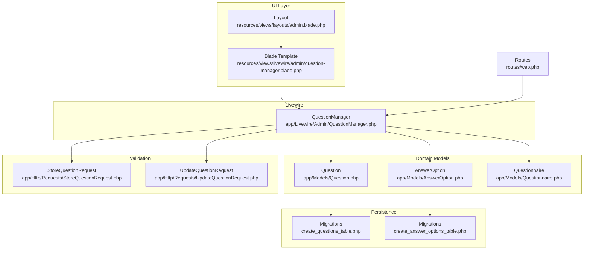
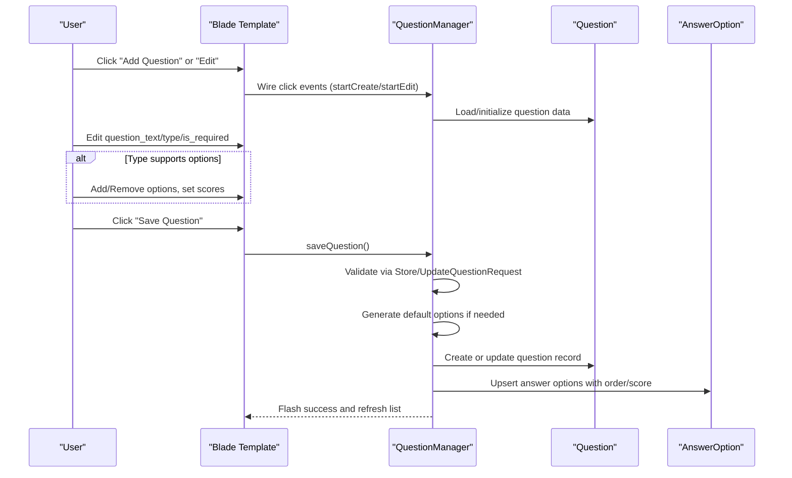
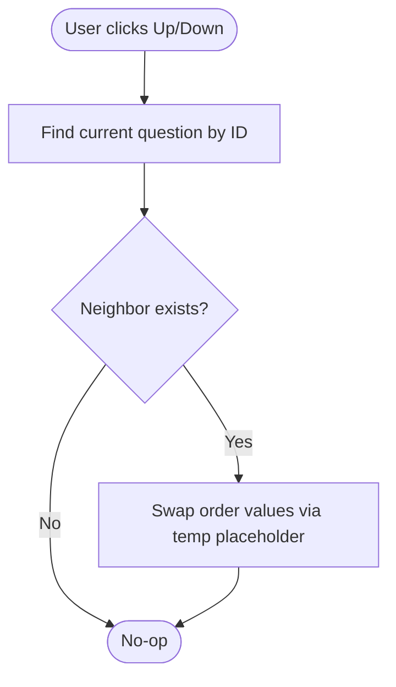
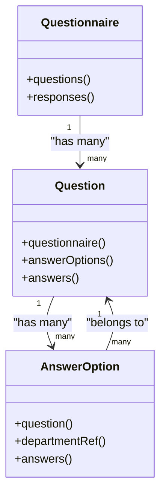
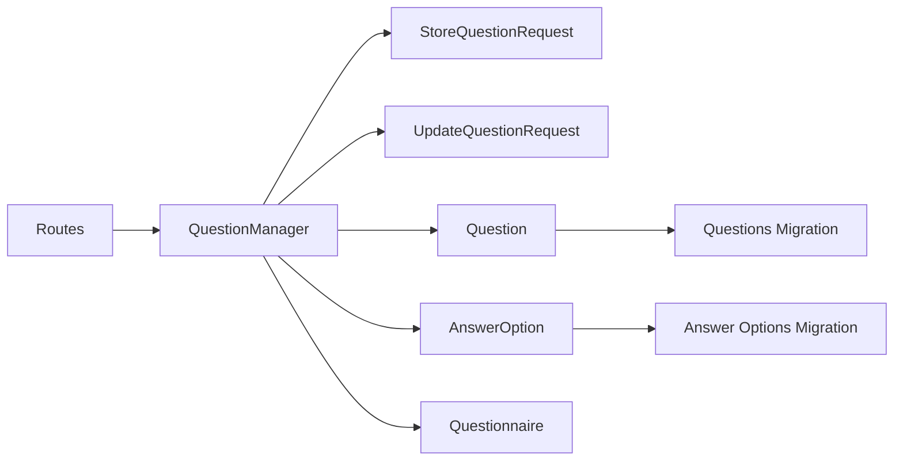
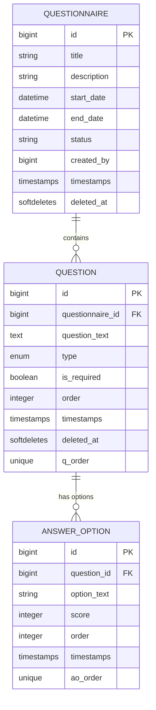

# Question Management

<cite>
**Referenced Files in This Document**
- [QuestionManager.php](file://app/Livewire/Admin/QuestionManager.php)
- [question-manager.blade.php](file://resources/views/livewire/admin/question-manager.blade.php)
- [Question.php](file://app/Models/Question.php)
- [AnswerOption.php](file://app/Models/AnswerOption.php)
- [Questionnaire.php](file://app/Models/Questionnaire.php)
- [StoreQuestionRequest.php](file://app/Http/Requests/StoreQuestionRequest.php)
- [UpdateQuestionRequest.php](file://app/Http/Requests/UpdateQuestionRequest.php)
- [2026_04_16_010241_create_questions_table.php](file://database/migrations/2026_04_16_010241_create_questions_table.php)
- [2026_04_16_010242_create_answer_options_table.php](file://database/migrations/2026_04_16_010242_create_answer_options_table.php)
- [web.php](file://routes/web.php)
- [admin.blade.php](file://resources/views/layouts/admin.blade.php)
</cite>

## Update Summary
**Changes Made**
- Added documentation for the new `defaultOptions()` method that provides predefined Indonesian rating scale options
- Updated answer option configuration section to reflect automatic application of default options
- Enhanced validation rules documentation to include new default option handling
- Updated examples to demonstrate the new default Indonesian rating scale options

## Table of Contents
1. [Introduction](#introduction)
2. [Project Structure](#project-structure)
3. [Core Components](#core-components)
4. [Architecture Overview](#architecture-overview)
5. [Detailed Component Analysis](#detailed-component-analysis)
6. [Dependency Analysis](#dependency-analysis)
7. [Performance Considerations](#performance-considerations)
8. [Troubleshooting Guide](#troubleshooting-guide)
9. [Conclusion](#conclusion)
10. [Appendices](#appendices)

## Introduction
This document explains the question management system used to create, edit, order, and delete questions within assessment questionnaires. It covers supported question types, answer option configuration, validation rules, ordering via drag-and-drop controls, and the relationships between questions and answer options. The system now includes enhanced default option generation with predefined Indonesian rating scale options for improved user experience and consistency.

## Project Structure
The question management feature is implemented as a Livewire component integrated into the admin layout. The backend persists data through Eloquent models and database migrations. Routes expose the question management page under the admin section.

**Diagram sources**
- [question-manager.blade.php:1-188](file://resources/views/livewire/admin/question-manager.blade.php#L1-L188)
- [admin.blade.php:1-105](file://resources/views/layouts/admin.blade.php#L1-L105)
- [QuestionManager.php:1-296](file://app/Livewire/Admin/QuestionManager.php#L1-L296)
- [Question.php:1-43](file://app/Models/Question.php#L1-L43)
- [AnswerOption.php:1-38](file://app/Models/AnswerOption.php#L1-L38)
- [Questionnaire.php:1-131](file://app/Models/Questionnaire.php#L1-L131)
- [StoreQuestionRequest.php:1-47](file://app/Http/Requests/StoreQuestionRequest.php#L1-L47)
- [UpdateQuestionRequest.php:1-30](file://app/Http/Requests/UpdateQuestionRequest.php#L1-L30)
- [2026_04_16_010241_create_questions_table.php:1-30](file://database/migrations/2026_04_16_010241_create_questions_table.php#L1-L30)
- [2026_04_16_010242_create_answer_options_table.php:1-28](file://database/migrations/2026_04_16_010242_create_answer_options_table.php#L1-L28)
- [web.php:72-83](file://routes/web.php#L72-L83)

**Section sources**
- [web.php:72-83](file://routes/web.php#L72-L83)
- [admin.blade.php:1-105](file://resources/views/layouts/admin.blade.php#L1-L105)
- [question-manager.blade.php:1-188](file://resources/views/livewire/admin/question-manager.blade.php#L1-L188)
- [QuestionManager.php:1-296](file://app/Livewire/Admin/QuestionManager.php#L1-L296)

## Core Components
- QuestionManager: The Livewire component orchestrating question creation/editing, validation, persistence, and ordering. Now includes enhanced default option generation with predefined Indonesian rating scales.
- Question: Eloquent model representing a single question within a questionnaire, with relationships to answer options and responses.
- AnswerOption: Eloquent model representing selectable answer choices for supported question types, with ordering and scoring.
- Questionnaire: Eloquent model representing an assessment form; provides questions and targets.
- StoreQuestionRequest/UpdateQuestionRequest: Validation rules ensuring data integrity during create/update operations.
- Blade Template: UI for creating/editing questions, managing answer options, previewing, and ordering actions.

Key capabilities:
- Create and edit questions with live preview.
- Configure answer options for supported types with automatic default option generation.
- Enforce validation rules per question type including enhanced default option handling.
- Manage question order via Up/Down buttons.
- Delete questions with confirmation.

**Section sources**
- [QuestionManager.php:1-296](file://app/Livewire/Admin/QuestionManager.php#L1-L296)
- [Question.php:1-43](file://app/Models/Question.php#L1-L43)
- [AnswerOption.php:1-38](file://app/Models/AnswerOption.php#L1-L38)
- [Questionnaire.php:1-131](file://app/Models/Questionnaire.php#L1-L131)
- [StoreQuestionRequest.php:1-47](file://app/Http/Requests/StoreQuestionRequest.php#L1-L47)
- [UpdateQuestionRequest.php:1-30](file://app/Http/Requests/UpdateQuestionRequest.php#L1-L30)
- [question-manager.blade.php:1-188](file://resources/views/livewire/admin/question-manager.blade.php#L1-L188)

## Architecture Overview
The system follows a layered architecture:
- UI: Livewire component with a Blade template.
- Domain: Eloquent models encapsulate business entities.
- Persistence: Migrations define relational schema with unique ordering constraints.
- Validation: Form requests enforce domain rules.
- Routing: Web routes expose the question management page.

**Diagram sources**
- [question-manager.blade.php:8-124](file://resources/views/livewire/admin/question-manager.blade.php#L8-L124)
- [QuestionManager.php:42-173](file://app/Livewire/Admin/QuestionManager.php#L42-L173)
- [StoreQuestionRequest.php:26-45](file://app/Http/Requests/StoreQuestionRequest.php#L26-L45)
- [UpdateQuestionRequest.php:25-28](file://app/Http/Requests/UpdateQuestionRequest.php#L25-L28)

## Detailed Component Analysis

### Question Types and Supported Operations
Supported question types:
- Single choice: Requires answer options with scores; minimum two options enforced.
- Essay: No answer options; options array is ignored.
- Combined: Behaves like single choice with scoring; requires options and scores.

Enhanced behavior with default options:
- When switching to a type that supports options without existing options, the system automatically applies predefined Indonesian rating scale options.
- Default options include "Sangat Tidak Setuju" (Very Disagree) through "Sangat Setuju" (Very Agree) with scores 1-5 respectively.
- When switching to a type that does not support options, options are cleared.

Best practices:
- Use single choice for standardized scoring and automated analytics.
- Use essay for qualitative feedback or open-ended insights.
- Use combined when you want both structured options and scoring.
- Leverage default Indonesian rating scales for consistent user experience across assessments.

**Section sources**
- [QuestionManager.php:28,93-102,278-287](file://app/Livewire/Admin/QuestionManager.php#L28,L93-L102,L278-L287)
- [question-manager.blade.php:46-48](file://resources/views/livewire/admin/question-manager.blade.php#L46-L48)

### Answer Option Configuration
- Each option includes text and an optional numeric score.
- Options are ordered; order is maintained during updates.
- For single choice and combined, options must have non-empty text and numeric scores.
- Empty options are filtered out before persisting.

Enhanced default option generation:
- The `defaultOptions()` method provides predefined Indonesian rating scale options:
  - "Sangat Tidak Setuju" (Very Disagree) - Score: 1
  - "Tidak Setuju" (Disagree) - Score: 2
  - "Netral" (Neutral) - Score: 3
  - "Setuju" (Agree) - Score: 4
  - "Sangat Setuju" (Very Agree) - Score: 5
- Default options are automatically applied when creating new questions with selectable options.

Configuration UI:
- Add/remove options dynamically.
- Live preview of question text and selected type/required flag.
- Default options appear automatically when selecting option-supporting question types.

**Section sources**
- [QuestionManager.php:32,56-68,113-127,146-169,235-250,255-262,278-287](file://app/Livewire/Admin/QuestionManager.php#L32,L56-L68,L113-L127,L146-L169,L235-L250,L255-L262,L278-L287)
- [question-manager.blade.php:66-111](file://resources/views/livewire/admin/question-manager.blade.php#L66-L111)

### Drag-and-Drop Ordering System
The UI exposes Up/Down buttons to reorder questions. Internally, the system swaps order values using a temporary placeholder to avoid conflicts during the transaction.

**Diagram sources**
- [QuestionManager.php:183-224](file://app/Livewire/Admin/QuestionManager.php#L183-L224)

**Section sources**
- [question-manager.blade.php:162-163](file://resources/views/livewire/admin/question-manager.blade.php#L162-L163)
- [QuestionManager.php:183-224](file://app/Livewire/Admin/QuestionManager.php#L183-L224)

### Validation Rules for Question Content
Validation ensures data integrity:
- question_text: required, string, max length enforced.
- type: required and must be one of the supported types.
- is_required: required boolean.
- options: array with nullable entries; each entry allows id, option_text, and score with length/score constraints.

Enhanced runtime validations with default options:
- Single choice and combined require at least two non-empty options.
- Scores must be present for single choice and combined options.
- Default Indonesian rating scale options are automatically generated when needed.
- Error messages are localized in Indonesian for better user experience.

**Section sources**
- [StoreQuestionRequest.php:26-45](file://app/Http/Requests/StoreQuestionRequest.php#L26-L45)
- [UpdateQuestionRequest.php:25-28](file://app/Http/Requests/UpdateQuestionRequest.php#L25-L28)
- [QuestionManager.php:106-127,278-287](file://app/Livewire/Admin/QuestionManager.php#L106-L127,L278-L287)

### Relationship Management Between Questions and Answer Options
- Question has many AnswerOptions ordered by order.
- AnswerOption belongs to Question and optionally to a Department.
- On save, the system:
  - Creates a new question with next order number if creating.
  - Updates an existing question if editing.
  - For non-option types, deletes existing options.
  - For option types, upserts options with order and score, then prunes removed ones.
  - Automatically applies default Indonesian rating scale options when needed.

**Diagram sources**
- [Questionnaire.php:42-45](file://app/Models/Questionnaire.php#L42-L45)
- [Question.php:28-41](file://app/Models/Question.php#L28-L41)
- [AnswerOption.php:23-36](file://app/Models/AnswerOption.php#L23-L36)

**Section sources**
- [Question.php:33-36](file://app/Models/Question.php#L33-L36)
- [AnswerOption.php:23-36](file://app/Models/AnswerOption.php#L23-L36)
- [QuestionManager.php:136-169](file://app/Livewire/Admin/QuestionManager.php#L136-L169)

### Question Editing Interface
- Edit mode loads existing question data and answer options, sorted by order.
- Live debounced inputs update the form state immediately.
- Preview section reflects current question text, type, and required flag.
- Save triggers validation and persistence.
- Default Indonesian rating scale options are automatically applied when editing option-supporting questions.

Bulk operations:
- Add/remove options while editing.
- Toggle required flag.
- Switch question type to automatically adjust option availability and apply default options when needed.

**Section sources**
- [QuestionManager.php:48-71,104-173](file://app/Livewire/Admin/QuestionManager.php#L48-L71,L104-L173)
- [question-manager.blade.php:19-124](file://resources/views/livewire/admin/question-manager.blade.php#L19-L124)

### Question Deletion Procedures
- Delete button invokes deleteQuestion with confirmation.
- The selected question is removed; dependent answer options are cascade-deleted via foreign key constraints.

**Section sources**
- [QuestionManager.php:175-181](file://app/Livewire/Admin/QuestionManager.php#L175-L181)
- [2026_04_16_010241_create_questions_table.php:13-19](file://database/migrations/2026_04_16_010241_create_questions_table.php#L13-L19)
- [2026_04_16_010242_create_answer_options_table.php:13-17](file://database/migrations/2026_04_16_010242_create_answer_options_table.php#L13-L17)

### Examples of Question Types and Best Practices
- Single choice:
  - Use for quantitative scoring with standardized rating scales.
  - Default Indonesian rating scale options are automatically applied.
  - Provide 2–5 clear, mutually exclusive options with meaningful scores.
  - Assign scores 1-5 to reflect intensity levels from Very Disagree to Very Agree.
- Essay:
  - Use for qualitative feedback.
  - Keep prompt concise but specific.
  - Consider word limits externally if needed.
- Combined:
  - Mix structured options with scoring and an optional open-ended field.
  - Default Indonesian rating scale options are automatically applied.
  - Ensure scoring aligns with the assessment rubric.

**Section sources**
- [QuestionManager.php:278-287](file://app/Livewire/Admin/QuestionManager.php#L278-L287)

## Dependency Analysis
The component depends on:
- Authorization checks via policy gates.
- Request validation classes.
- Eloquent relationships for loading/saving data.
- Database migrations for schema and constraints.

**Diagram sources**
- [QuestionManager.php:5-13,35-40](file://app/Livewire/Admin/QuestionManager.php#L5-L13,L35-L40)
- [StoreQuestionRequest.php:10-21](file://app/Http/Requests/StoreQuestionRequest.php#L10-L21)
- [UpdateQuestionRequest.php:9-20](file://app/Http/Requests/UpdateQuestionRequest.php#L9-L20)
- [Question.php:11-42](file://app/Models/Question.php#L11-L42)
- [AnswerOption.php:10-37](file://app/Models/AnswerOption.php#L10-L37)
- [Questionnaire.php:13-50](file://app/Models/Questionnaire.php#L13-L50)
- [2026_04_16_010241_create_questions_table.php:9-22](file://database/migrations/2026_04_16_010241_create_questions_table.php#L9-L22)
- [2026_04_16_010242_create_answer_options_table.php:9-20](file://database/migrations/2026_04_16_010242_create_answer_options_table.php#L9-L20)
- [web.php:82](file://routes/web.php#L82)

**Section sources**
- [QuestionManager.php:5-13,35-40](file://app/Livewire/Admin/QuestionManager.php#L5-L13,L35-L40)
- [web.php:82](file://routes/web.php#L82)

## Performance Considerations
- Ordering uses a transaction with a temporary placeholder to prevent constraint violations during swaps.
- Answer options are upserted with order indices; pruning removes obsolete options efficiently.
- Queries fetch questions with answer options and sort by order to minimize client-side work.
- Default option generation is performed only when needed, reducing unnecessary processing.

Recommendations:
- Keep the number of answer options reasonable for single choice to improve rendering performance.
- Use soft deletes on questions to maintain audit trails and avoid accidental data loss.
- Default Indonesian rating scale options are cached in memory to avoid repeated generation.

**Section sources**
- [QuestionManager.php:213-224](file://app/Livewire/Admin/QuestionManager.php#L213-L224)
- [Question.php:33-36](file://app/Models/Question.php#L33-L36)

## Troubleshooting Guide
Common issues and resolutions:
- Saving single choice/combined without sufficient options:
  - Ensure at least two non-empty options with numeric scores.
  - Default Indonesian rating scale options are automatically applied when creating new questions.
- Scores missing for option types:
  - Provide integer scores for each option.
  - Default options automatically include scores 1-5.
- Ordering conflicts:
  - Use the Up/Down buttons; the system handles swapping safely.
- Deleting a question:
  - Confirm deletion; dependent options are removed automatically.
- Default options not appearing:
  - Ensure the question type supports selectable options.
  - Default options are automatically applied when switching to option-supporting types.

**Section sources**
- [QuestionManager.php:113-127,175-181,278-287](file://app/Livewire/Admin/QuestionManager.php#L113-L127,L175-L181,L278-L287)

## Conclusion
The question management system provides a robust, validated interface for creating and maintaining assessment questions. It supports multiple question types, dynamic answer option configuration with automatic default Indonesian rating scale options, and safe reordering. The enhanced default option generation system improves user experience by providing standardized rating scales that are culturally appropriate for Indonesian users. By following the validation rules and best practices outlined here, administrators can build reliable and effective questionnaires.

## Appendices

### Data Model Definitions

**Diagram sources**
- [2026_04_16_010241_create_questions_table.php:11-22](file://database/migrations/2026_04_16_010241_create_questions_table.php#L11-L22)
- [2026_04_16_010242_create_answer_options_table.php:11-20](file://database/migrations/2026_04_16_010242_create_answer_options_table.php#L11-L20)

### Default Indonesian Rating Scale Options
The system provides predefined Indonesian rating scale options for consistent user experience:

- **Sangat Tidak Setuju** (Very Disagree) - Score: 1
- **Tidak Setuju** (Disagree) - Score: 2  
- **Netral** (Neutral) - Score: 3
- **Setuju** (Agree) - Score: 4
- **Sangat Setuju** (Very Agree) - Score: 5

These default options are automatically applied when creating new questions with selectable options and can be customized or replaced as needed.

**Section sources**
- [QuestionManager.php:278-287](file://app/Livewire/Admin/QuestionManager.php#L278-L287)