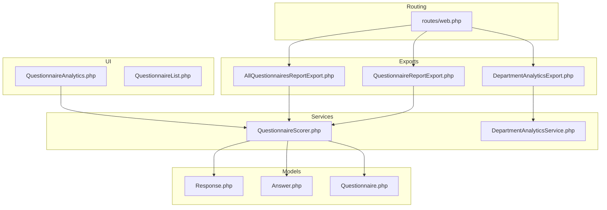
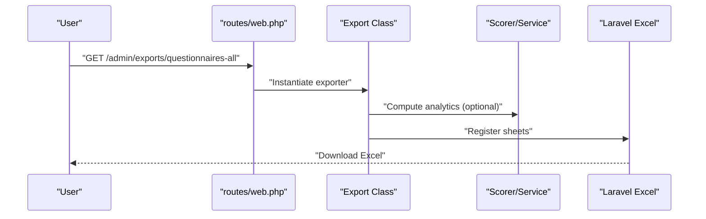
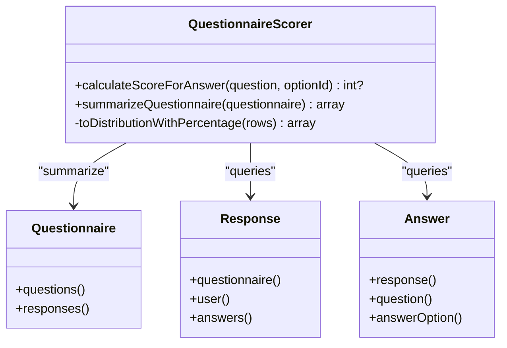
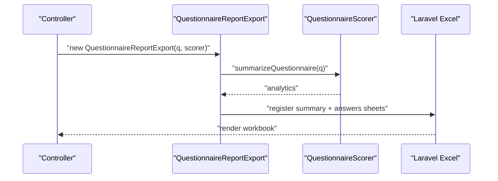
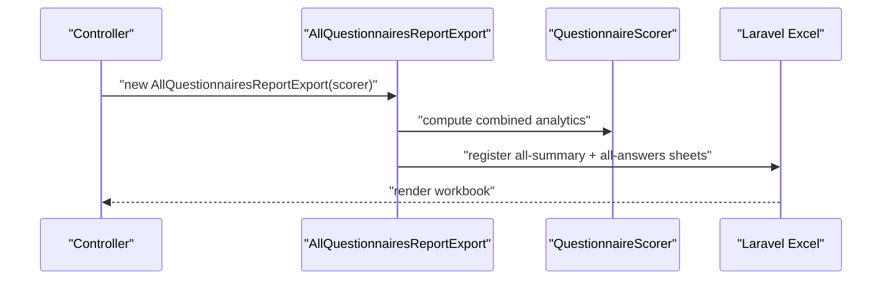
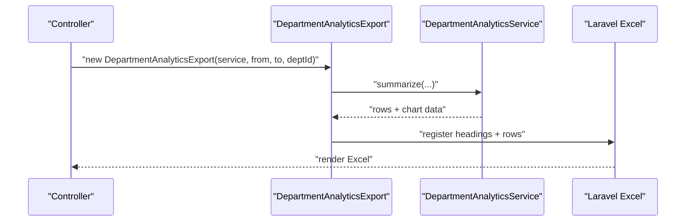
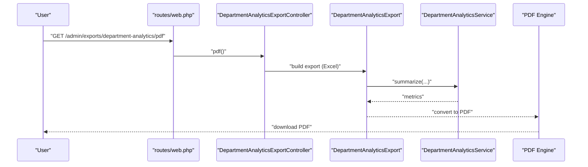
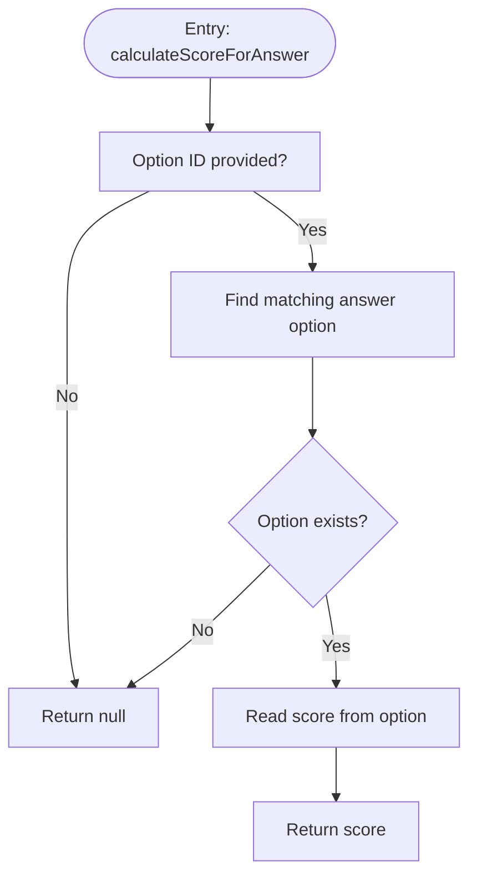
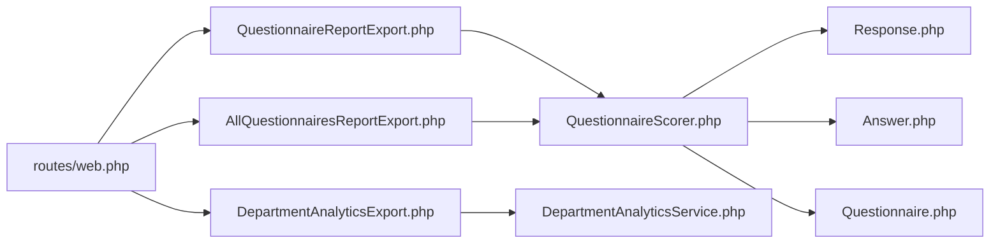

# Questionnaire Export & Reports

<cite>
**Referenced Files in This Document**
- [AllQuestionnairesReportExport.php](file://app/Exports/AllQuestionnairesReportExport.php)
- [QuestionnaireReportExport.php](file://app/Exports/QuestionnaireReportExport.php)
- [DepartmentAnalyticsExport.php](file://app/Exports/DepartmentAnalyticsExport.php)
- [QuestionnaireScorer.php](file://app/Services/QuestionnaireScorer.php)
- [DepartmentAnalyticsService.php](file://app/Services/DepartmentAnalyticsService.php)
- [Response.php](file://app/Models/Response.php)
- [Answer.php](file://app/Models/Answer.php)
- [Questionnaire.php](file://app/Models/Questionnaire.php)
- [web.php](file://routes/web.php)
- [QuestionnaireAnalytics.php](file://app/Livewire/Admin/QuestionnaireAnalytics.php)
- [QuestionnaireList.php](file://app/Livewire/Admin/QuestionnaireList.php)
</cite>

## Table of Contents
1. [Introduction](#introduction)
2. [Project Structure](#project-structure)
3. [Core Components](#core-components)
4. [Architecture Overview](#architecture-overview)
5. [Detailed Component Analysis](#detailed-component-analysis)
6. [Dependency Analysis](#dependency-analysis)
7. [Performance Considerations](#performance-considerations)
8. [Troubleshooting Guide](#troubleshooting-guide)
9. [Conclusion](#conclusion)
10. [Appendices](#appendices)

## Introduction
This document explains the questionnaire export and reporting system, focusing on:
- Individual questionnaire export and all-questionnaires export
- Excel export format, sheet organization, and data transformation
- Scoring algorithms and report generation workflows
- PDF export capabilities for department analytics
- Examples of export configurations and integration points

The system leverages Laravel Excel for spreadsheet exports and a dedicated QuestionnaireScorer service to compute analytics and scores from submitted responses.

## Project Structure
The export/reporting system spans exports, services, models, routes, and Livewire components:
- Exports: Excel exporters and sheet classes
- Services: Business logic for scoring and analytics
- Models: Domain entities for responses, answers, and questionnaires
- Routes: Web endpoints for initiating exports and PDF generation
- Livewire: Analytics UI that consumes the same scoring service

**Diagram sources**
- [AllQuestionnairesReportExport.php:1-25](file://app/Exports/AllQuestionnairesReportExport.php#L1-L25)
- [QuestionnaireReportExport.php:1-29](file://app/Exports/QuestionnaireReportExport.php#L1-L29)
- [DepartmentAnalyticsExport.php:1-51](file://app/Exports/DepartmentAnalyticsExport.php#L1-L51)
- [QuestionnaireScorer.php:1-139](file://app/Services/QuestionnaireScorer.php#L1-L139)
- [DepartmentAnalyticsService.php:1-279](file://app/Services/DepartmentAnalyticsService.php#L1-L279)
- [Response.php:1-42](file://app/Models/Response.php#L1-L42)
- [Answer.php:1-44](file://app/Models/Answer.php#L1-L44)
- [Questionnaire.php:1-131](file://app/Models/Questionnaire.php#L1-L131)
- [web.php:85-90](file://routes/web.php#L85-L90)
- [QuestionnaireAnalytics.php:1-74](file://app/Livewire/Admin/QuestionnaireAnalytics.php#L1-L74)
- [QuestionnaireList.php:1-82](file://app/Livewire/Admin/QuestionnaireList.php#L1-L82)

**Section sources**
- [web.php:85-90](file://routes/web.php#L85-L90)

## Core Components
- QuestionnaireScorer: Computes per-question averages, overall averages, distribution percentages, and respondent breakdowns for a given questionnaire.
- QuestionnaireReportExport: Builds a two-sheet report for a single questionnaire (summary and answers).
- AllQuestionnairesReportExport: Builds a two-sheet report for all questionnaires (summary and answers).
- DepartmentAnalyticsExport: Produces a single-sheet Excel export of department-level analytics.
- DepartmentAnalyticsService: Aggregates department metrics (respondents, participation rate, average score) and supports role/user-level rollups.
- Response and Answer models: Provide the data backbone for scoring and analytics.
- Routes: Expose endpoints to trigger exports and PDF generation.

**Section sources**
- [QuestionnaireScorer.php:12-139](file://app/Services/QuestionnaireScorer.php#L12-L139)
- [QuestionnaireReportExport.php:11-29](file://app/Exports/QuestionnaireReportExport.php#L11-L29)
- [AllQuestionnairesReportExport.php:10-25](file://app/Exports/AllQuestionnairesReportExport.php#L10-L25)
- [DepartmentAnalyticsExport.php:9-51](file://app/Exports/DepartmentAnalyticsExport.php#L9-L51)
- [DepartmentAnalyticsService.php:12-279](file://app/Services/DepartmentAnalyticsService.php#L12-L279)
- [Response.php:11-42](file://app/Models/Response.php#L11-L42)
- [Answer.php:10-44](file://app/Models/Answer.php#L10-L44)
- [web.php:85-90](file://routes/web.php#L85-L90)

## Architecture Overview
The export pipeline follows a consistent pattern:
- A route handler invokes an export class.
- The export class constructs sheets using data from the QuestionnaireScorer or DepartmentAnalyticsService.
- Laravel Excel renders the workbook/sheets to the client.

**Diagram sources**
- [web.php:85-90](file://routes/web.php#L85-L90)
- [AllQuestionnairesReportExport.php:10-25](file://app/Exports/AllQuestionnairesReportExport.php#L10-L25)
- [QuestionnaireReportExport.php:11-29](file://app/Exports/QuestionnaireReportExport.php#L11-L29)
- [QuestionnaireScorer.php:33-112](file://app/Services/QuestionnaireScorer.php#L33-L112)
- [DepartmentAnalyticsExport.php:9-51](file://app/Exports/DepartmentAnalyticsExport.php#L9-L51)
- [DepartmentAnalyticsService.php:20-95](file://app/Services/DepartmentAnalyticsService.php#L20-L95)

## Detailed Component Analysis

### QuestionnaireScorer Service
Responsibilities:
- Calculate score for a selected answer option per question.
- Summarize a questionnaire: overall average, per-group averages, per-question averages, and distribution with percentages.

Key behaviors:
- Uses configuration-defined target role slugs to filter respondents.
- Filters responses by submission status.
- Computes averages via joins across answers, responses, questions, and users.
- Transforms distribution rows into counts and percentages per question.

**Diagram sources**
- [QuestionnaireScorer.php:12-139](file://app/Services/QuestionnaireScorer.php#L12-L139)
- [Response.php:11-42](file://app/Models/Response.php#L11-L42)
- [Answer.php:10-44](file://app/Models/Answer.php#L10-L44)
- [Questionnaire.php:13-131](file://app/Models/Questionnaire.php#L13-L131)

**Section sources**
- [QuestionnaireScorer.php:14-23](file://app/Services/QuestionnaireScorer.php#L14-L23)
- [QuestionnaireScorer.php:33-112](file://app/Services/QuestionnaireScorer.php#L33-L112)
- [QuestionnaireScorer.php:118-137](file://app/Services/QuestionnaireScorer.php#L118-L137)

### Questionnaire Report Export (Single Questionnaire)
Behavior:
- Accepts a Questionnaire and a QuestionnaireScorer instance.
- Calls scorer to compute analytics.
- Returns two sheets: summary and answers.

**Diagram sources**
- [QuestionnaireReportExport.php:11-29](file://app/Exports/QuestionnaireReportExport.php#L11-L29)
- [QuestionnaireScorer.php:33-112](file://app/Services/QuestionnaireScorer.php#L33-L112)

**Section sources**
- [QuestionnaireReportExport.php:19-27](file://app/Exports/QuestionnaireReportExport.php#L19-L27)

### All Questionnaires Report Export (Combined)
Behavior:
- Accepts a QuestionnaireScorer instance.
- Returns two sheets: combined summary and combined answers.

**Diagram sources**
- [AllQuestionnairesReportExport.php:10-25](file://app/Exports/AllQuestionnairesReportExport.php#L10-L25)
- [QuestionnaireScorer.php:33-112](file://app/Services/QuestionnaireScorer.php#L33-L112)

**Section sources**
- [AllQuestionnairesReportExport.php:17-23](file://app/Exports/AllQuestionnairesReportExport.php#L17-L23)

### Department Analytics Export (Excel)
Behavior:
- Implements array and headings contracts.
- Delegates aggregation to DepartmentAnalyticsService.
- Outputs a single sheet with department-level metrics.

**Diagram sources**
- [DepartmentAnalyticsExport.php:9-51](file://app/Exports/DepartmentAnalyticsExport.php#L9-L51)
- [DepartmentAnalyticsService.php:20-95](file://app/Services/DepartmentAnalyticsService.php#L20-L95)

**Section sources**
- [DepartmentAnalyticsExport.php:19-49](file://app/Exports/DepartmentAnalyticsExport.php#L19-L49)

### PDF Export for Department Analytics
Behavior:
- The route exposes a PDF endpoint for department analytics.
- The export class produces an Excel; PDF generation is handled by the controller action bound to the route.

**Diagram sources**
- [web.php:89](file://routes/web.php#L89)
- [DepartmentAnalyticsExport.php:9-51](file://app/Exports/DepartmentAnalyticsExport.php#L9-L51)
- [DepartmentAnalyticsService.php:20-95](file://app/Services/DepartmentAnalyticsService.php#L20-L95)

**Section sources**
- [web.php:89](file://routes/web.php#L89)

### Excel Sheet Organization and Data Transformation
- Single Questionnaire Export:
  - Sheet 1: Summary (computed by QuestionnaireScorer)
  - Sheet 2: Answers (raw answer data)
- All Questionnaires Export:
  - Sheet 1: Combined Summary (computed by QuestionnaireScorer)
  - Sheet 2: Combined Answers (raw answer data)
- Department Analytics Export:
  - Single Sheet: Headings + rows produced by DepartmentAnalyticsService

Data transformation highlights:
- Distribution percentages computed per question by dividing counts by question totals.
- Averages rounded to two decimals for readability.
- Role-based filtering via configuration-defined slugs.

**Section sources**
- [QuestionnaireReportExport.php:19-27](file://app/Exports/QuestionnaireReportExport.php#L19-L27)
- [AllQuestionnairesReportExport.php:17-23](file://app/Exports/AllQuestionnairesReportExport.php#L17-L23)
- [DepartmentAnalyticsExport.php:19-49](file://app/Exports/DepartmentAnalyticsExport.php#L19-L49)
- [QuestionnaireScorer.php:118-137](file://app/Services/QuestionnaireScorer.php#L118-L137)

### Scoring Algorithms
- Per-answer score retrieval:
  - If no option is selected, the score is null.
  - Otherwise, the score is taken from the matched answer option.
- Questionnaire-level analytics:
  - Respondent breakdown by configured role slugs.
  - Overall average score across all submitted answers with calculated scores.
  - Per-group averages by role slug.
  - Per-question averages and response counts.
  - Distribution with counts and percentages per option per question.

**Diagram sources**
- [QuestionnaireScorer.php:14-23](file://app/Services/QuestionnaireScorer.php#L14-L23)

**Section sources**
- [QuestionnaireScorer.php:14-23](file://app/Services/QuestionnaireScorer.php#L14-L23)
- [QuestionnaireScorer.php:33-112](file://app/Services/QuestionnaireScorer.php#L33-L112)

### Report Generation Workflows
- Single questionnaire:
  - Controller constructs QuestionnaireReportExport with a Questionnaire and QuestionnaireScorer.
  - Export registers summary and answers sheets.
- All questionnaires:
  - Controller constructs AllQuestionnairesReportExport with a QuestionnaireScorer.
  - Export registers combined summary and answers sheets.
- Department analytics:
  - Controller constructs DepartmentAnalyticsExport with DepartmentAnalyticsService and optional filters.
  - Export registers headings and rows.

**Section sources**
- [QuestionnaireReportExport.php:11-29](file://app/Exports/QuestionnaireReportExport.php#L11-L29)
- [AllQuestionnairesReportExport.php:10-25](file://app/Exports/AllQuestionnairesReportExport.php#L10-L25)
- [DepartmentAnalyticsExport.php:9-51](file://app/Exports/DepartmentAnalyticsExport.php#L9-L51)

### Integration with External Systems
- Excel/PDF downloads are initiated via web routes.
- The analytics computed by QuestionnaireScorer and DepartmentAnalyticsService can be consumed by:
  - Livewire analytics pages for visualization.
  - Exporters for offline reporting.
- Configuration-driven role targeting ensures exports reflect organizational roles.

**Section sources**
- [web.php:85-90](file://routes/web.php#L85-L90)
- [QuestionnaireAnalytics.php:29-56](file://app/Livewire/Admin/QuestionnaireAnalytics.php#L29-L56)
- [QuestionnaireList.php:63-80](file://app/Livewire/Admin/QuestionnaireList.php#L63-L80)

## Dependency Analysis
- QuestionnaireReportExport depends on QuestionnaireScorer and Questionnaire model.
- AllQuestionnairesReportExport depends on QuestionnaireScorer.
- DepartmentAnalyticsExport depends on DepartmentAnalyticsService.
- QuestionnaireScorer depends on Response, Answer, Question, and configuration for role slugs.
- Routes bind controllers to export actions.

**Diagram sources**
- [web.php:85-90](file://routes/web.php#L85-L90)
- [QuestionnaireReportExport.php:7-29](file://app/Exports/QuestionnaireReportExport.php#L7-L29)
- [AllQuestionnairesReportExport.php:5-25](file://app/Exports/AllQuestionnairesReportExport.php#L5-L25)
- [DepartmentAnalyticsExport.php:5-51](file://app/Exports/DepartmentAnalyticsExport.php#L5-L51)
- [QuestionnaireScorer.php:5-139](file://app/Services/QuestionnaireScorer.php#L5-L139)
- [DepartmentAnalyticsService.php:5-279](file://app/Services/DepartmentAnalyticsService.php#L5-L279)
- [Response.php:5-42](file://app/Models/Response.php#L5-L42)
- [Answer.php:5-44](file://app/Models/Answer.php#L5-L44)
- [Questionnaire.php:5-131](file://app/Models/Questionnaire.php#L5-L131)

**Section sources**
- [web.php:85-90](file://routes/web.php#L85-L90)

## Performance Considerations
- Caching:
  - Questionnaire analytics are cached based on last updates to responses and answers, reducing recomputation overhead.
- Pagination:
  - Department analytics support pagination to limit memory usage for large datasets.
- Efficient aggregations:
  - Scoring and analytics rely on grouped queries and computed averages to minimize PHP-side loops.
- Distribution percentage computation:
  - Pre-aggregated totals per question avoid repeated scans during transformation.

**Section sources**
- [QuestionnaireAnalytics.php:32-72](file://app/Livewire/Admin/QuestionnaireAnalytics.php#L32-L72)
- [DepartmentAnalyticsService.php:261-277](file://app/Services/DepartmentAnalyticsService.php#L261-L277)
- [QuestionnaireScorer.php:118-137](file://app/Services/QuestionnaireScorer.php#L118-L137)

## Troubleshooting Guide
- No sheets appear in export:
  - Verify the export class returns a non-empty sheets array and that the scorer’s summary is computed successfully.
- Missing roles in analytics:
  - Ensure configuration defines questionnaire target slugs and role labels; otherwise defaults are used.
- Empty or zero averages:
  - Confirm responses are marked as submitted and answers have calculated scores.
- Slow exports:
  - Enable caching for analytics and consider limiting date ranges for department analytics.

**Section sources**
- [QuestionnaireScorer.php:33-112](file://app/Services/QuestionnaireScorer.php#L33-L112)
- [QuestionnaireAnalytics.php:29-56](file://app/Livewire/Admin/QuestionnaireAnalytics.php#L29-L56)
- [DepartmentAnalyticsService.php:20-95](file://app/Services/DepartmentAnalyticsService.php#L20-L95)

## Conclusion
The export and reporting system centers on a robust QuestionnaireScorer service and clean separation of concerns across exporters. It supports:
- Single and combined questionnaire exports with summary and answers sheets
- Department analytics export and PDF generation
- Configurable role-based analytics
- Efficient aggregation and caching for performance

## Appendices

### Export Endpoints Reference
- All questionnaires export: GET /admin/exports/questionnaires-all
- Single questionnaire export: GET /admin/exports/questionnaires/{id}
- Department analytics Excel: GET /admin/exports/department-analytics/excel
- Department analytics PDF: GET /admin/exports/department-analytics/pdf

**Section sources**
- [web.php:85-90](file://routes/web.php#L85-L90)