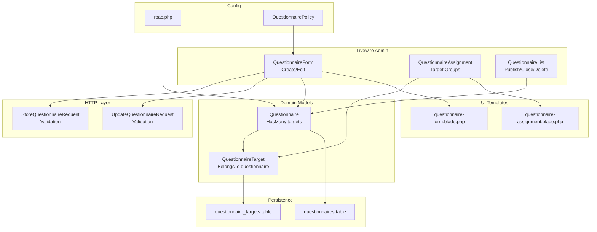
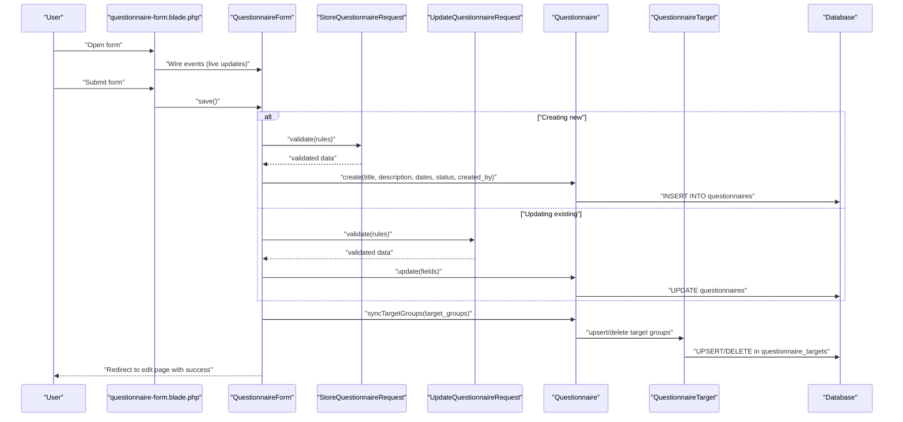
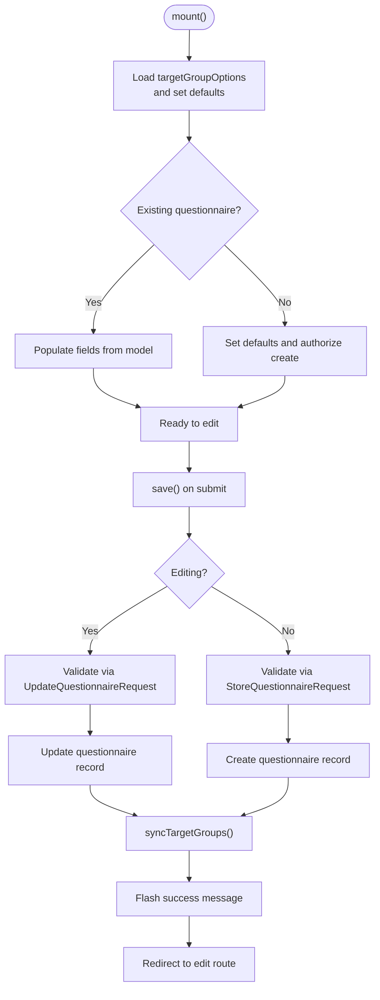
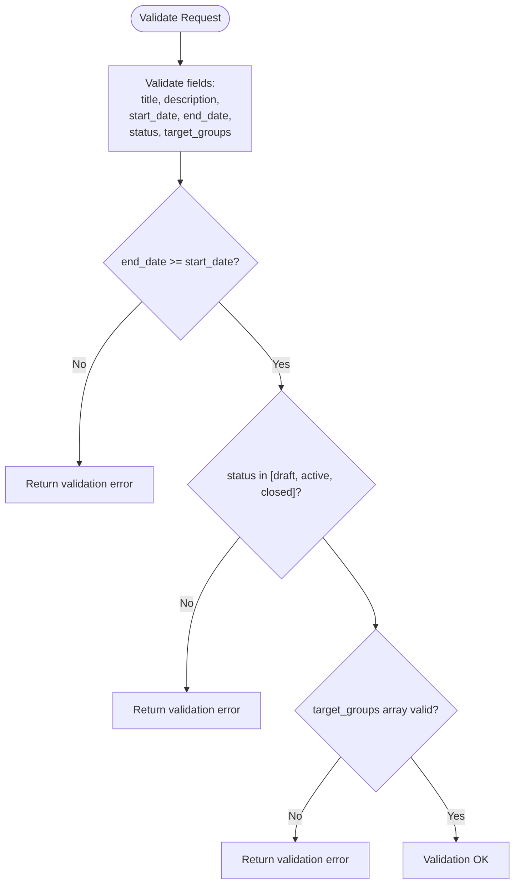
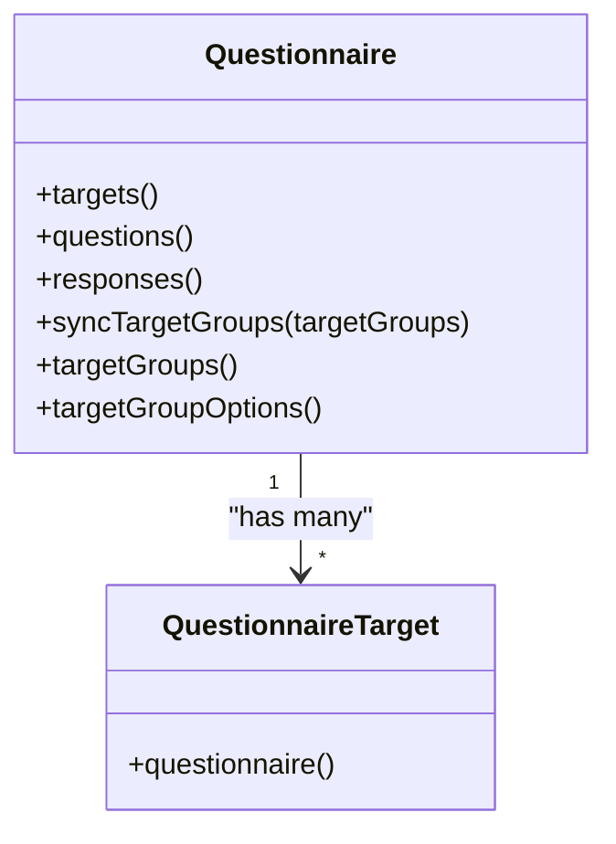
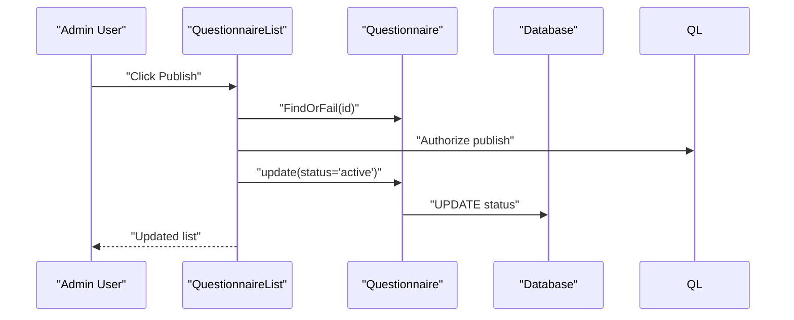
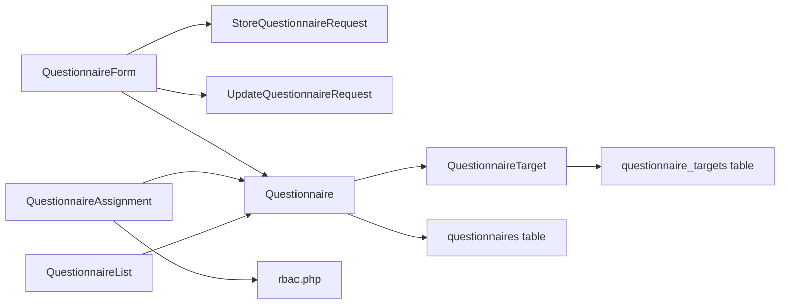

# Questionnaire Form Builder

<cite>
**Referenced Files in This Document**
- [QuestionnaireForm.php](file://app/Livewire/Admin/QuestionnaireForm.php)
- [StoreQuestionnaireRequest.php](file://app/Http/Requests/StoreQuestionnaireRequest.php)
- [UpdateQuestionnaireRequest.php](file://app/Http/Requests/UpdateQuestionnaireRequest.php)
- [Questionnaire.php](file://app/Models/Questionnaire.php)
- [QuestionnaireTarget.php](file://app/Models/QuestionnaireTarget.php)
- [QuestionnaireAssignment.php](file://app/Livewire/Admin/QuestionnaireAssignment.php)
- [QuestionnaireList.php](file://app/Livewire/Admin/QuestionnaireList.php)
- [questionnaire-form.blade.php](file://resources/views/livewire/admin/questionnaire-form.blade.php)
- [questionnaire-assignment.blade.php](file://resources/views/livewire/admin/questionnaire-assignment.blade.php)
- [2026_04_16_010239_create_questionnaires_table.php](file://database/migrations/2026_04_16_010239_create_questionnaires_table.php)
- [2026_04_16_010240_create_questionnaire_targets_table.php](file://database/migrations/2026_04_16_010240_create_questionnaire_targets_table.php)
- [rbac.php](file://config/rbac.php)
- [QuestionnairePolicy.php](file://app/Policies/QuestionnairePolicy.php)
</cite>

## Table of Contents
1. [Introduction](#introduction)
2. [Project Structure](#project-structure)
3. [Core Components](#core-components)
4. [Architecture Overview](#architecture-overview)
5. [Detailed Component Analysis](#detailed-component-analysis)
6. [Dependency Analysis](#dependency-analysis)
7. [Performance Considerations](#performance-considerations)
8. [Troubleshooting Guide](#troubleshooting-guide)
9. [Conclusion](#conclusion)

## Introduction
This document describes the questionnaire form builder component used to create and edit assessment questionnaires. It covers the complete interface for managing title, description, date ranges, status, and target groups, along with validation rules, user input handling, and the end-to-end workflow from creation to publishing. It also documents how form data maps to backend models and database records.

## Project Structure
The questionnaire builder spans Livewire components, Blade templates, request validators, Eloquent models, policies, and database migrations:

- Livewire Admin Components:
  - QuestionnaireForm: primary form for creating/editing questionnaires
  - QuestionnaireAssignment: separate target group assignment editor
  - QuestionnaireList: administrative listing with publish/close actions
- Request Validators:
  - StoreQuestionnaireRequest and UpdateQuestionnaireRequest define validation rules
- Models:
  - Questionnaire: main entity with targets relationship
  - QuestionnaireTarget: junction model for target groups
- Blade Templates:
  - questionnaire-form.blade.php renders the main form UI
  - questionnaire-assignment.blade.php renders the target group assignment UI
- Migrations:
  - questionnaires and questionnaire_targets tables
- Configuration:
  - rbac.php defines target group slugs and aliases
- Policy:
  - QuestionnairePolicy controls access to create/update/publish/close operations



**Diagram sources**
- [QuestionnaireForm.php:15-132](file://app/Livewire/Admin/QuestionnaireForm.php#L15-L132)
- [QuestionnaireAssignment.php:10-90](file://app/Livewire/Admin/QuestionnaireAssignment.php#L10-L90)
- [QuestionnaireList.php:12-81](file://app/Livewire/Admin/QuestionnaireList.php#L12-L81)
- [StoreQuestionnaireRequest.php:10-40](file://app/Http/Requests/StoreQuestionnaireRequest.php#L10-L40)
- [UpdateQuestionnaireRequest.php:9-29](file://app/Http/Requests/UpdateQuestionnaireRequest.php#L9-L29)
- [Questionnaire.php:13-130](file://app/Models/Questionnaire.php#L13-L130)
- [QuestionnaireTarget.php:9-23](file://app/Models/QuestionnaireTarget.php#L9-L23)
- [questionnaire-form.blade.php:1-149](file://resources/views/livewire/admin/questionnaire-form.blade.php#L1-L149)
- [questionnaire-assignment.blade.php:1-37](file://resources/views/livewire/admin/questionnaire-assignment.blade.php#L1-L37)
- [2026_04_16_010239_create_questionnaires_table.php:11-21](file://database/migrations/2026_04_16_010239_create_questionnaires_table.php#L11-L21)
- [2026_04_16_010240_create_questionnaire_targets_table.php:11-18](file://database/migrations/2026_04_16_010240_create_questionnaire_targets_table.php#L11-L18)
- [rbac.php:6-11](file://config/rbac.php#L6-L11)
- [QuestionnairePolicy.php:8-54](file://app/Policies/QuestionnairePolicy.php#L8-L54)

**Section sources**
- [QuestionnaireForm.php:15-132](file://app/Livewire/Admin/QuestionnaireForm.php#L15-L132)
- [questionnaire-form.blade.php:1-149](file://resources/views/livewire/admin/questionnaire-form.blade.php#L1-L149)

## Core Components
- QuestionnaireForm: handles creation and editing of questionnaires, validates inputs, persists data, manages target groups, and redirects after save.
- QuestionnaireAssignment: dedicated editor for target group selection with real-time validation and synchronization.
- QuestionnaireList: administrative listing with filtering/search, plus publish/close/delete actions.
- Request Validators: enforce field requirements, date range rules, status enumeration, and target group constraints.
- Models: Questionnaire and QuestionnaireTarget with relationships and target group utilities.
- Blade Templates: render the forms and validation feedback.
- Configuration: rbac.php defines allowed target group slugs and aliases.
- Policy: restricts operations to admin roles.

**Section sources**
- [QuestionnaireForm.php:19-107](file://app/Livewire/Admin/QuestionnaireForm.php#L19-L107)
- [QuestionnaireAssignment.php:16-68](file://app/Livewire/Admin/QuestionnaireAssignment.php#L16-L68)
- [QuestionnaireList.php:36-50](file://app/Livewire/Admin/QuestionnaireList.php#L36-L50)
- [StoreQuestionnaireRequest.php:20-39](file://app/Http/Requests/StoreQuestionnaireRequest.php#L20-L39)
- [UpdateQuestionnaireRequest.php:25-28](file://app/Http/Requests/UpdateQuestionnaireRequest.php#L25-L28)
- [Questionnaire.php:55-83](file://app/Models/Questionnaire.php#L55-L83)
- [QuestionnaireTarget.php:14-22](file://app/Models/QuestionnaireTarget.php#L14-L22)
- [questionnaire-form.blade.php:23-132](file://resources/views/livewire/admin/questionnaire-form.blade.php#L23-L132)
- [questionnaire-assignment.blade.php:13-36](file://resources/views/livewire/admin/questionnaire-assignment.blade.php#L13-L36)
- [rbac.php:6-11](file://config/rbac.php#L6-L11)
- [QuestionnairePolicy.php:20-48](file://app/Policies/QuestionnairePolicy.php#L20-L48)

## Architecture Overview
The questionnaire builder follows a layered pattern:
- UI layer: Livewire components with Blade templates
- Validation layer: FormRequest classes
- Domain layer: Eloquent models and business logic
- Persistence layer: Database tables with foreign keys and unique constraints
- Authorization layer: Policies and role checks



**Diagram sources**
- [QuestionnaireForm.php:74-107](file://app/Livewire/Admin/QuestionnaireForm.php#L74-L107)
- [StoreQuestionnaireRequest.php:20-39](file://app/Http/Requests/StoreQuestionnaireRequest.php#L20-L39)
- [UpdateQuestionnaireRequest.php:25-28](file://app/Http/Requests/UpdateQuestionnaireRequest.php#L25-L28)
- [Questionnaire.php:55-83](file://app/Models/Questionnaire.php#L55-L83)
- [QuestionnaireTarget.php:14-22](file://app/Models/QuestionnaireTarget.php#L14-L22)
- [questionnaire-form.blade.php:23-132](file://resources/views/livewire/admin/questionnaire-form.blade.php#L23-L132)

## Detailed Component Analysis

### QuestionnaireForm: Creation and Editing Workflow
Responsibilities:
- Initialize form state from existing questionnaire or defaults
- Validate inputs using request classes
- Persist questionnaire and synchronize target groups
- Redirect to edit page after save
- Provide edit mode detection

Key behaviors:
- On mount, loads available target groups and sets defaults
- On save, chooses between store or update path and persists data
- Synchronizes target groups via Questionnaire::syncTargetGroups
- Uses session flash for success messages
- Redirects to admin.edit route after save



**Diagram sources**
- [QuestionnaireForm.php:40-107](file://app/Livewire/Admin/QuestionnaireForm.php#L40-L107)
- [StoreQuestionnaireRequest.php:20-39](file://app/Http/Requests/StoreQuestionnaireRequest.php#L20-L39)
- [UpdateQuestionnaireRequest.php:25-28](file://app/Http/Requests/UpdateQuestionnaireRequest.php#L25-L28)
- [Questionnaire.php:55-83](file://app/Models/Questionnaire.php#L55-L83)

**Section sources**
- [QuestionnaireForm.php:40-107](file://app/Livewire/Admin/QuestionnaireForm.php#L40-L107)
- [questionnaire-form.blade.php:23-132](file://resources/views/livewire/admin/questionnaire-form.blade.php#L23-L132)

### Validation Rules and Field Requirements
Validation rules enforced by the request classes:
- Title: required, string, max length 255
- Description: nullable, string, max length 5000
- Start date: required, date
- End date: required, date, must be after or equal to start date
- Status: required, must be one of draft, active, closed
- Target groups: required, array, minimum 1 item, each item must be a distinct string present in allowed target groups

Additional model-level validation:
- syncTargetGroups enforces at least one target group remains selected



**Diagram sources**
- [StoreQuestionnaireRequest.php:28-39](file://app/Http/Requests/StoreQuestionnaireRequest.php#L28-L39)
- [Questionnaire.php:55-83](file://app/Models/Questionnaire.php#L55-L83)

**Section sources**
- [StoreQuestionnaireRequest.php:20-39](file://app/Http/Requests/StoreQuestionnaireRequest.php#L20-L39)
- [UpdateQuestionnaireRequest.php:25-28](file://app/Http/Requests/UpdateQuestionnaireRequest.php#L25-L28)
- [Questionnaire.php:55-83](file://app/Models/Questionnaire.php#L55-L83)

### Target Group Management
Target groups are managed via:
- Questionnaire::targetGroups and Questionnaire::targetGroupOptions for allowed values
- Questionnaire::syncTargetGroups to upsert/delete target entries
- QuestionnaireAssignment component for interactive editing
- rbac.php configuration for slugs and aliases



**Diagram sources**
- [Questionnaire.php:37-129](file://app/Models/Questionnaire.php#L37-L129)
- [QuestionnaireTarget.php:19-22](file://app/Models/QuestionnaireTarget.php#L19-L22)

**Section sources**
- [Questionnaire.php:88-129](file://app/Models/Questionnaire.php#L88-L129)
- [QuestionnaireAssignment.php:27-68](file://app/Livewire/Admin/QuestionnaireAssignment.php#L27-L68)
- [rbac.php:6-11](file://config/rbac.php#L6-L11)

### Backend Models and Database Mapping
Questionnaire entity fields persisted to the questionnaires table:
- title: string
- description: text (nullable)
- start_date: datetime
- end_date: datetime
- status: enum draft|active|closed
- created_by: foreign key to users

Target group assignments persisted to questionnaire_targets table:
- questionnaire_id: foreign key to questionnaires
- target_group: string (unique per questionnaire)

```mermaid
erDiagram
QUESTIONNAIRES {
bigint id PK
string title
text description
datetime start_date
datetime end_date
enum status
bigint created_by FK
timestamps
softdeletes
}
QUESTIONNAIRE_TARGETS {
bigint id PK
bigint questionnaire_id FK
string target_group
timestamps
}
QUESTIONNAIRES ||--o{ QUESTIONNAIRE_TARGETS : "has many"
```

**Diagram sources**
- [2026_04_16_010239_create_questionnaires_table.php:11-21](file://database/migrations/2026_04_16_010239_create_questionnaires_table.php#L11-L21)
- [2026_04_16_010240_create_questionnaire_targets_table.php:11-18](file://database/migrations/2026_04_16_010240_create_questionnaire_targets_table.php#L11-L18)
- [Questionnaire.php:18-30](file://app/Models/Questionnaire.php#L18-L30)
- [QuestionnaireTarget.php:14-17](file://app/Models/QuestionnaireTarget.php#L14-L17)

**Section sources**
- [2026_04_16_010239_create_questionnaires_table.php:11-21](file://database/migrations/2026_04_16_010239_create_questionnaires_table.php#L11-L21)
- [2026_04_16_010240_create_questionnaire_targets_table.php:11-18](file://database/migrations/2026_04_16_010240_create_questionnaire_targets_table.php#L11-L18)
- [Questionnaire.php:18-30](file://app/Models/Questionnaire.php#L18-L30)
- [QuestionnaireTarget.php:14-17](file://app/Models/QuestionnaireTarget.php#L14-L17)

### User Input Handling and UI
The form template provides:
- Live debounced updates for title and description
- Real-time datetime-local inputs for start/end dates
- Status dropdown with predefined values
- Target group checkboxes (creation) or labels (edit)
- Inline validation error rendering
- Preview section reflecting current values

Submission triggers the save method, which validates and persists data.

**Section sources**
- [questionnaire-form.blade.php:23-132](file://resources/views/livewire/admin/questionnaire-form.blade.php#L23-L132)

### Publishing and Status Management
Administrators can change questionnaire status from draft to active or close a questionnaire. These actions are authorized via policy methods and update the status field.



**Diagram sources**
- [QuestionnaireList.php:36-50](file://app/Livewire/Admin/QuestionnaireList.php#L36-L50)
- [QuestionnairePolicy.php:45-48](file://app/Policies/QuestionnairePolicy.php#L45-L48)

**Section sources**
- [QuestionnaireList.php:36-50](file://app/Livewire/Admin/QuestionnaireList.php#L36-L50)
- [QuestionnairePolicy.php:45-48](file://app/Policies/QuestionnairePolicy.php#L45-L48)

## Dependency Analysis
- QuestionnaireForm depends on:
  - StoreQuestionnaireRequest/UpdateQuestionnaireRequest for validation
  - Questionnaire model for persistence and target sync
  - QuestionnaireAssignment component for target group updates
- QuestionnaireAssignment depends on:
  - Questionnaire::targetGroupOptions for available groups
  - Questionnaire::syncTargetGroups for persistence
  - rbac.php for aliases and slugs
- QuestionnaireList depends on:
  - Questionnaire model for queries and status updates
  - QuestionnairePolicy for authorization
- Models depend on:
  - Database migrations for schema
  - Each other via relationships



**Diagram sources**
- [QuestionnaireForm.php:5-17](file://app/Livewire/Admin/QuestionnaireForm.php#L5-L17)
- [QuestionnaireAssignment.php:5-8](file://app/Livewire/Admin/QuestionnaireAssignment.php#L5-L8)
- [QuestionnaireList.php:5-9](file://app/Livewire/Admin/QuestionnaireList.php#L5-L9)
- [Questionnaire.php:5-16](file://app/Models/Questionnaire.php#L5-L16)
- [QuestionnaireTarget.php:6-12](file://app/Models/QuestionnaireTarget.php#L6-L12)
- [2026_04_16_010239_create_questionnaires_table.php:11-21](file://database/migrations/2026_04_16_010239_create_questionnaires_table.php#L11-L21)
- [2026_04_16_010240_create_questionnaire_targets_table.php:11-18](file://database/migrations/2026_04_16_010240_create_questionnaire_targets_table.php#L11-L18)

**Section sources**
- [QuestionnaireForm.php:5-17](file://app/Livewire/Admin/QuestionnaireForm.php#L5-L17)
- [QuestionnaireAssignment.php:5-8](file://app/Livewire/Admin/QuestionnaireAssignment.php#L5-L8)
- [QuestionnaireList.php:5-9](file://app/Livewire/Admin/QuestionnaireList.php#L5-L9)
- [Questionnaire.php:5-16](file://app/Models/Questionnaire.php#L5-L16)

## Performance Considerations
- Debounced live updates reduce unnecessary re-renders for title and description.
- Unique constraint on questionnaire_targets prevents duplicates at the database level.
- Pagination in QuestionnaireList limits result set size.
- Using withCount on questions and responses avoids N+1 queries in listings.
- Transaction in syncTargetGroups ensures atomicity during target group updates.

## Troubleshooting Guide
Common issues and resolutions:
- Validation errors on save:
  - Ensure title length is within limits and description is within bounds
  - Verify end_date is not earlier than start_date
  - Confirm status is one of the allowed values
  - Select at least one target group; if removing the last, the system will fallback to a default
- Target group synchronization failures:
  - syncTargetGroups throws a validation error if no target groups remain after normalization
  - Use QuestionnaireAssignment to adjust selections and trigger validation
- Authorization failures:
  - Only admin roles can create, update, publish, or close questionnaires
- Redirect and flash messages:
  - After successful save, the system redirects to the edit page and displays a success message

**Section sources**
- [StoreQuestionnaireRequest.php:28-39](file://app/Http/Requests/StoreQuestionnaireRequest.php#L28-L39)
- [Questionnaire.php:65-69](file://app/Models/Questionnaire.php#L65-L69)
- [QuestionnairePolicy.php:20-48](file://app/Policies/QuestionnairePolicy.php#L20-L48)
- [QuestionnaireForm.php:104-106](file://app/Livewire/Admin/QuestionnaireForm.php#L104-L106)

## Conclusion
The questionnaire form builder provides a robust, validated, and secure interface for administrators to create, edit, and manage assessment questionnaires. It enforces strict validation rules, integrates target group assignment, and persists data to normalized database tables. The separation of concerns across Livewire components, request validators, models, and policies ensures maintainability and clarity of responsibilities.