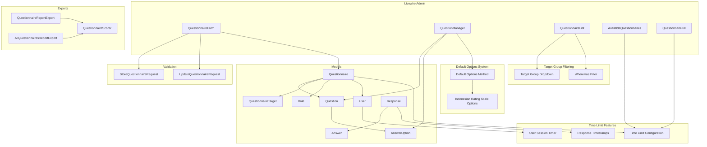
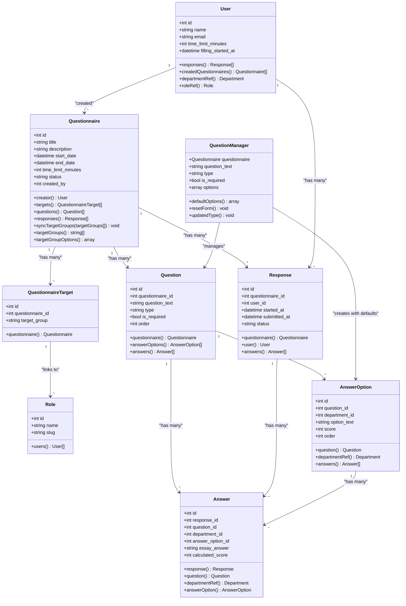
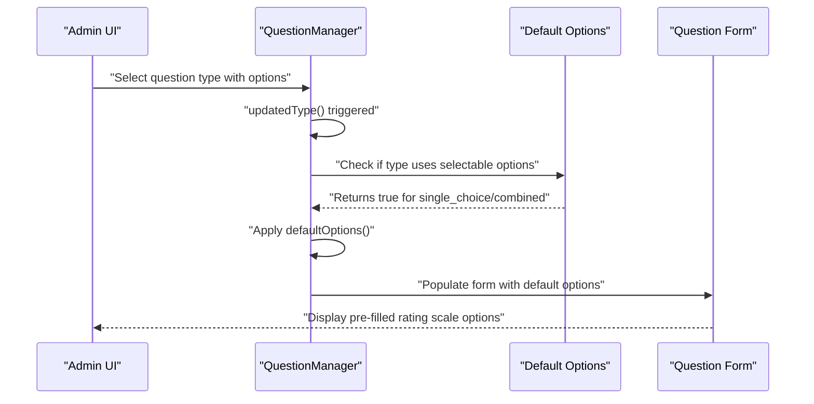
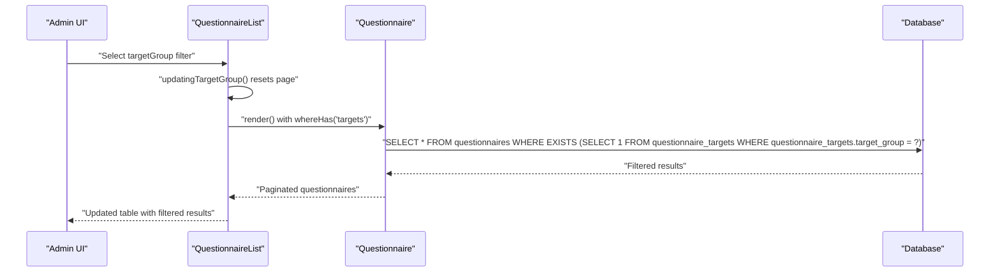
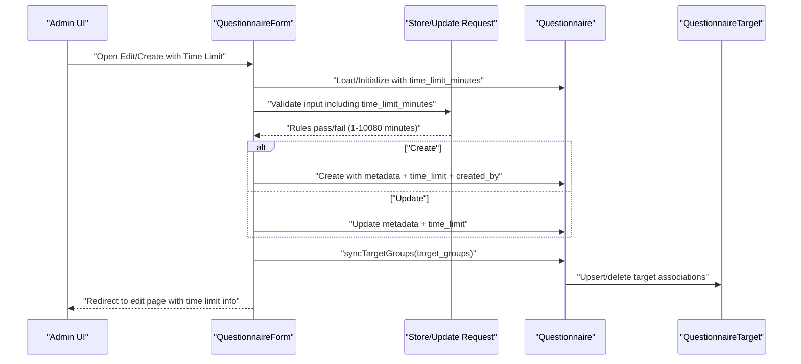
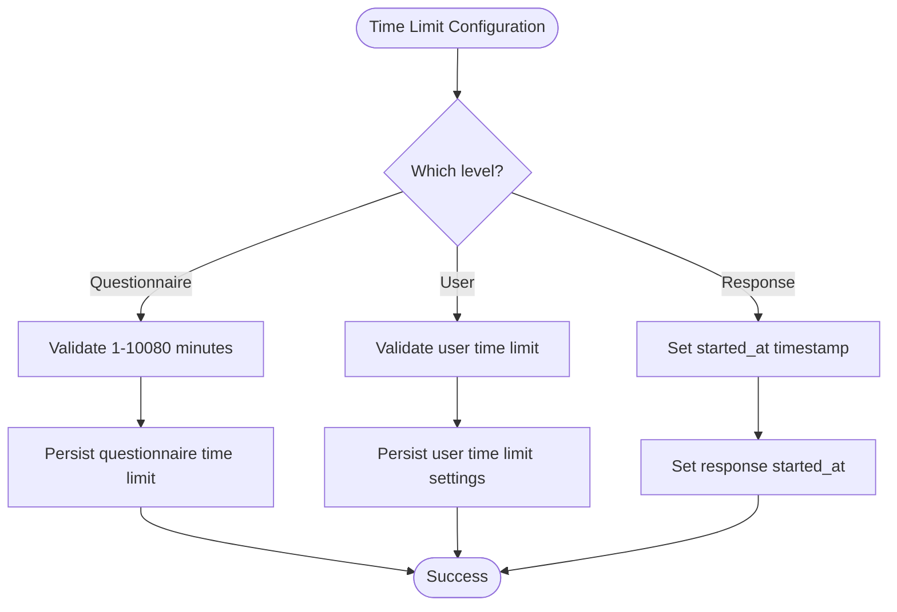
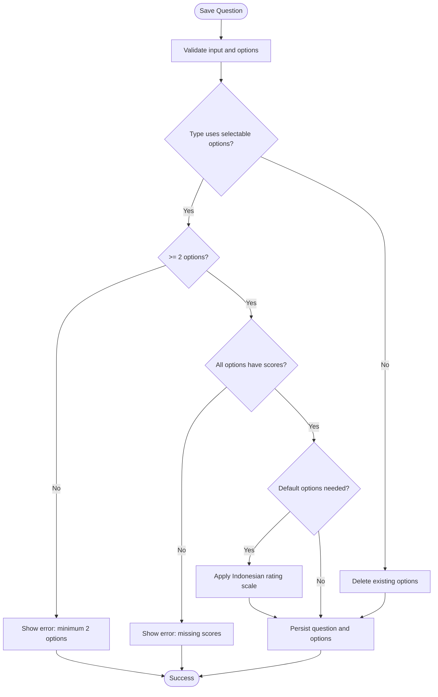
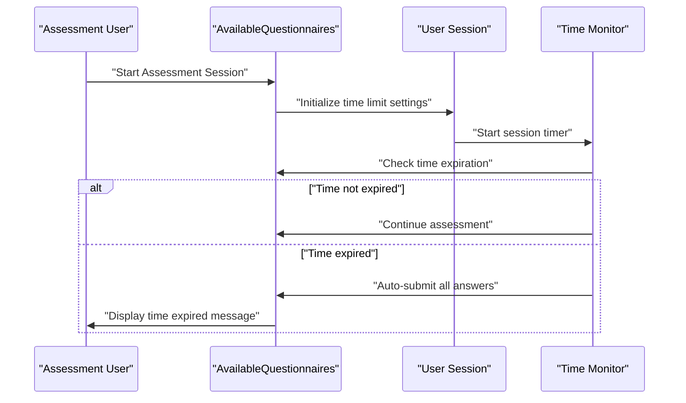
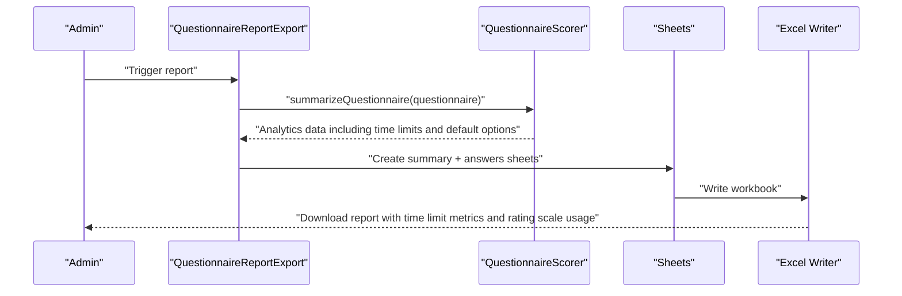
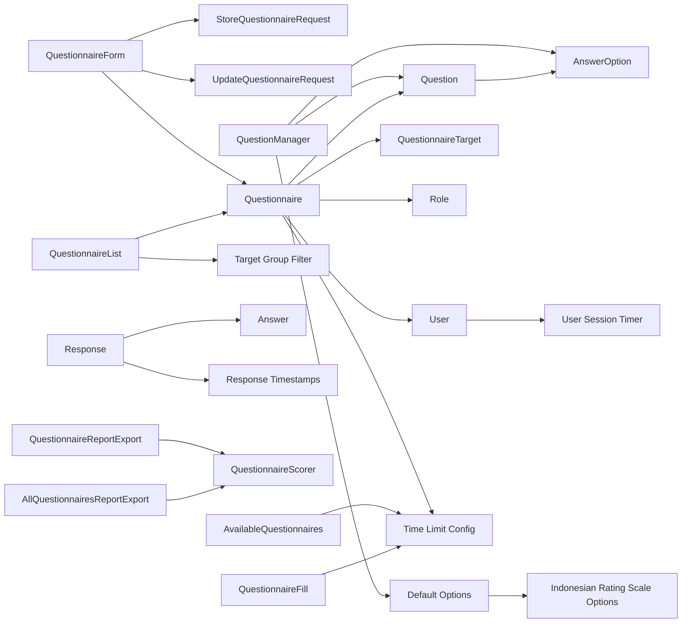

# Questionnaire Management

<cite>
**Referenced Files in This Document**
- [Questionnaire.php](file://app/Models/Questionnaire.php)
- [Question.php](file://app/Models/Question.php)
- [AnswerOption.php](file://app/Models/AnswerOption.php)
- [QuestionnaireTarget.php](file://app/Models/QuestionnaireTarget.php)
- [Response.php](file://app/Models/Response.php)
- [Answer.php](file://app/Models/Answer.php)
- [User.php](file://app/Models/User.php)
- [Role.php](file://app/Models/Role.php)
- [QuestionnaireForm.php](file://app/Livewire/Admin/QuestionnaireForm.php)
- [QuestionManager.php](file://app/Livewire/Admin/QuestionManager.php)
- [QuestionnaireList.php](file://app/Livewire/Admin/QuestionnaireList.php)
- [AvailableQuestionnaires.php](file://app/Livewire/Fill/AvailableQuestionnaires.php)
- [QuestionnaireFill.php](file://app/Livewire/Fill/QuestionnaireFill.php)
- [StoreQuestionnaireRequest.php](file://app/Http/Requests/StoreQuestionnaireRequest.php)
- [UpdateQuestionnaireRequest.php](file://app/Http/Requests/UpdateQuestionnaireRequest.php)
- [QuestionnaireReportExport.php](file://app/Exports/QuestionnaireReportExport.php)
- [AllQuestionnairesReportExport.php](file://app/Exports/AllQuestionnairesReportExport.php)
- [QuestionnaireScorer.php](file://app/Services/QuestionnaireScorer.php)
- [questionnaire-form.blade.php](file://resources/views/livewire/admin/questionnaire-form.blade.php)
- [questionnaire-list.blade.php](file://resources/views/livewire/admin/questionnaire-list.blade.php)
- [question-manager.blade.php](file://resources/views/livewire/admin/question-manager.blade.php)
- [2026_04_21_003136_add_time_limit_to_questionnaires_table.php](file://database/migrations/2026_04_21_003136_add_time_limit_to_questionnaires_table.php)
- [2026_04_21_003142_add_started_at_to_responses_table.php](file://database/migrations/2026_04_21_003142_add_started_at_to_responses_table.php)
- [2026_04_21_020644_add_time_limit_and_filling_started_at_to_users_table.php](file://database/migrations/2026_04_21_020644_add_time_limit_and_filling_started_at_to_users_table.php)
- [2026_04_16_010240_create_questionnaire_targets_table.php](file://database/migrations/2026_04_16_010240_create_questionnaire_targets_table.php)
- [2026_04_16_010242_create_answer_options_table.php](file://database/migrations/2026_04_16_010242_create_answer_options_table.php)
- [AnswerOptionFactory.php](file://database/factories/AnswerOptionFactory.php)
- [QuestionnaireSeeder.php](file://database/seeders/QuestionnaireSeeder.php)
</cite>

## Update Summary
**Changes Made**
- Enhanced Question Manager with new defaultOptions() method providing predefined Indonesian rating scale options
- Improved default option generation system with automatic application when creating new questions with selectable options
- Added five-point Likert scale options: Sangat Tidak Setuju (1), Tidak Setuju (2), Netral (3), Setuju (4), Sangat Setuju (5)
- Integrated default options into the question creation workflow through updatedType() and resetForm() methods
- Enhanced user experience with ready-to-use rating scales for Indonesian language assessments

## Table of Contents
1. [Introduction](#introduction)
2. [Project Structure](#project-structure)
3. [Core Components](#core-components)
4. [Architecture Overview](#architecture-overview)
5. [Detailed Component Analysis](#detailed-component-analysis)
6. [Dependency Analysis](#dependency-analysis)
7. [Performance Considerations](#performance-considerations)
8. [Troubleshooting Guide](#troubleshooting-guide)
9. [Conclusion](#conclusion)
10. [Appendices](#appendices)

## Introduction
This document describes the questionnaire management system, covering the end-to-end lifecycle of creating, editing, validating, assigning target groups, building forms, and exporting analytics. It explains the data model relationships among questionnaires, questions, answer options, responses, and answers, and documents the form builder interface, validation rules, publishing workflows, and reporting capabilities. The system now includes comprehensive time limit management functionality for both individual questionnaires and user assessment sessions, enhanced administrative filtering capabilities including target group filtering, and improved default option generation with predefined Indonesian rating scales.

## Project Structure
The system is organized around Eloquent models, Livewire components for administration, form requests for validation, and Excel export services for analytics. Time limit functionality spans across multiple layers including database migrations, model definitions, validation rules, and frontend components. The QuestionnaireList component now includes target group filtering capabilities for improved administrative control. The QuestionManager component has been enhanced with intelligent default option generation for Indonesian language assessments.

**Diagram sources**
- [Questionnaire.php:13-133](file://app/Models/Questionnaire.php#L13-L133)
- [QuestionnaireTarget.php:9-24](file://app/Models/QuestionnaireTarget.php#L9-L24)
- [Role.php:9-31](file://app/Models/Role.php#L9-L31)
- [Question.php:11-43](file://app/Models/Question.php#L11-L43)
- [AnswerOption.php:10-38](file://app/Models/AnswerOption.php#L10-L38)
- [Response.php:11-44](file://app/Models/Response.php#L11-L44)
- [Answer.php:10-44](file://app/Models/Answer.php#L10-L44)
- [User.php:12-98](file://app/Models/User.php#L12-L98)
- [QuestionnaireForm.php:15-138](file://app/Livewire/Admin/QuestionnaireForm.php#L15-L138)
- [QuestionManager.php:16-296](file://app/Livewire/Admin/QuestionManager.php#L16-L296)
- [QuestionnaireList.php:12-91](file://app/Livewire/Admin/QuestionnaireList.php#L12-L91)
- [AvailableQuestionnaires.php:17-677](file://app/Livewire/Fill/AvailableQuestionnaires.php#L17-L677)
- [QuestionnaireFill.php:18-515](file://app/Livewire/Fill/QuestionnaireFill.php#L18-515)
- [StoreQuestionnaireRequest.php:10-47](file://app/Http/Requests/StoreQuestionnaireRequest.php#L10-L47)
- [UpdateQuestionnaireRequest.php:9-30](file://app/Http/Requests/UpdateQuestionnaireRequest.php#L9-L30)
- [QuestionnaireReportExport.php:11-29](file://app/Exports/QuestionnaireReportExport.php#L11-L29)
- [AllQuestionnairesReportExport.php:10-25](file://app/Exports/AllQuestionnairesReportExport.php#L10-L25)
- [QuestionnaireScorer.php:12-139](file://app/Services/QuestionnaireScorer.php#L12-L139)

**Section sources**
- [Questionnaire.php:13-133](file://app/Models/Questionnaire.php#L13-L133)
- [QuestionnaireForm.php:15-138](file://app/Livewire/Admin/QuestionnaireForm.php#L15-L138)
- [QuestionManager.php:16-296](file://app/Livewire/Admin/QuestionManager.php#L16-L296)
- [QuestionnaireList.php:12-91](file://app/Livewire/Admin/QuestionnaireList.php#L12-L91)
- [StoreQuestionnaireRequest.php:10-47](file://app/Http/Requests/StoreQuestionnaireRequest.php#L10-L47)
- [UpdateQuestionnaireRequest.php:9-30](file://app/Http/Requests/UpdateQuestionnaireRequest.php#L9-L30)
- [QuestionnaireReportExport.php:11-29](file://app/Exports/QuestionnaireReportExport.php#L11-L29)
- [AllQuestionnairesReportExport.php:10-25](file://app/Exports/AllQuestionnairesReportExport.php#L10-L25)
- [QuestionnaireScorer.php:12-139](file://app/Services/QuestionnaireScorer.php#L12-L139)

## Core Components
- Questionnaire: central entity with metadata, lifecycle status, creator, target groups, ordered questions, responses, and time limit configuration.
- Question: belongs to a questionnaire, supports multiple types, required flag, ordering, and answer options.
- AnswerOption: defines selectable choices with scores for specific question types.
- QuestionnaireTarget: links a questionnaire to target role slugs with unique constraint for efficient filtering.
- Role: defines target groups with slug-based identification for questionnaire assignment.
- Response: captures a submission by a user for a questionnaire with timestamp tracking.
- Answer: stores selected option or essay answer linked to a response and question.
- User: includes time limit settings and session tracking for assessment control.
- QuestionnaireForm: creates/edit questionnaire with validation, target group sync, time limit configuration, and persistence.
- QuestionManager: manages questions and answer options per questionnaire, including reordering, validation, and intelligent default option generation.
- QuestionnaireList: displays filtered list of questionnaires with search, status, and target group filtering capabilities.
- AvailableQuestionnaires: handles bulk assessment workflow with time limit enforcement and session management.
- QuestionnaireFill: manages individual questionnaire filling with time limit validation.
- Validation Requests: enforce field constraints, target group eligibility, and time limit validation.
- Export and Scoring: aggregates analytics and produces Excel reports.

**Section sources**
- [Questionnaire.php:13-133](file://app/Models/Questionnaire.php#L13-L133)
- [Question.php:11-43](file://app/Models/Question.php#L11-L43)
- [AnswerOption.php:10-38](file://app/Models/AnswerOption.php#L10-L38)
- [QuestionnaireTarget.php:9-24](file://app/Models/QuestionnaireTarget.php#L9-L24)
- [Role.php:9-31](file://app/Models/Role.php#L9-L31)
- [Response.php:11-44](file://app/Models/Response.php#L11-L44)
- [Answer.php:10-44](file://app/Models/Answer.php#L10-L44)
- [User.php:12-98](file://app/Models/User.php#L12-L98)
- [QuestionnaireForm.php:15-138](file://app/Livewire/Admin/QuestionnaireForm.php#L15-L138)
- [QuestionManager.php:16-296](file://app/Livewire/Admin/QuestionManager.php#L16-L296)
- [QuestionnaireList.php:12-91](file://app/Livewire/Admin/QuestionnaireList.php#L12-L91)
- [AvailableQuestionnaires.php:17-677](file://app/Livewire/Fill/AvailableQuestionnaires.php#L17-L677)
- [QuestionnaireFill.php:18-515](file://app/Livewire/Fill/QuestionnaireFill.php#L18-515)
- [StoreQuestionnaireRequest.php:10-47](file://app/Http/Requests/StoreQuestionnaireRequest.php#L10-L47)
- [UpdateQuestionnaireRequest.php:9-30](file://app/Http/Requests/UpdateQuestionnaireRequest.php#L9-L30)
- [QuestionnaireReportExport.php:11-29](file://app/Exports/QuestionnaireReportExport.php#L11-L29)
- [AllQuestionnairesReportExport.php:10-25](file://app/Exports/AllQuestionnairesReportExport.php#L10-L25)
- [QuestionnaireScorer.php:12-139](file://app/Services/QuestionnaireScorer.php#L12-L139)

## Architecture Overview
The system follows a layered architecture with enhanced time limit management capabilities, improved administrative filtering, and intelligent default option generation for Indonesian language assessments:
- Presentation: Livewire components for admin UI (form builder, question manager with default options, and questionnaire list with filtering) and assessment interfaces.
- Application: Controllers and services orchestrate workflows (validation, persistence, analytics, time limit enforcement, target group filtering, and intelligent default option management).
- Domain: Eloquent models define domain entities and relationships with time limit support, target group management, and rating scale integration.
- Persistence: Laravel Eloquent ORM with soft deletes, explicit casts, time limit tracking, efficient filtering through whereHas relationships, and intelligent default option caching.

**Diagram sources**
- [Questionnaire.php:13-133](file://app/Models/Questionnaire.php#L13-L133)
- [QuestionnaireTarget.php:9-24](file://app/Models/QuestionnaireTarget.php#L9-L24)
- [Role.php:9-31](file://app/Models/Role.php#L9-L31)
- [Question.php:11-43](file://app/Models/Question.php#L11-L43)
- [AnswerOption.php:10-38](file://app/Models/AnswerOption.php#L10-L38)
- [Response.php:11-44](file://app/Models/Response.php#L11-L44)
- [Answer.php:10-44](file://app/Models/Answer.php#L10-L44)
- [User.php:12-98](file://app/Models/User.php#L12-L98)
- [QuestionManager.php:16-296](file://app/Livewire/Admin/QuestionManager.php#L16-L296)

## Detailed Component Analysis

### Question Manager with Enhanced Default Options System
The QuestionManager component has been significantly enhanced with intelligent default option generation for Indonesian language assessments. The new defaultOptions() method provides predefined five-point Likert scale options that automatically populate when creating new questions with selectable options.

Key features:
- **Intelligent default option generation**: The defaultOptions() method returns predefined Indonesian rating scale options
- **Automatic application**: Default options are automatically applied when creating new questions with selectable types
- **Five-point rating scale**: Options range from "Sangat Tidak Setuju" (Very Disagree) to "Sangat Setuju" (Very Agree)
- **Predefined scoring**: Scores automatically assigned as 1-5 respectively for each rating level
- **Seamless integration**: Works with existing question creation and editing workflows

**Diagram sources**
- [QuestionManager.php:93-102](file://app/Livewire/Admin/QuestionManager.php#L93-L102)
- [QuestionManager.php:278-287](file://app/Livewire/Admin/QuestionManager.php#L278-L287)
- [QuestionManager.php:264-273](file://app/Livewire/Admin/QuestionManager.php#L264-L273)

**Updated** Enhanced Question Manager with intelligent default option generation system

Practical example: Creating a new question with default Indonesian rating scale
- Select question type "Single Choice" or "Combined".
- The system automatically applies five predefined Indonesian rating scale options.
- Options include: "Sangat Tidak Setuju" (1), "Tidak Setuju" (2), "Netral" (3), "Setuju" (4), "Sangat Setuju" (5).
- Administrator can modify or remove options as needed.
- Automatic scoring ensures proper numerical values for each rating level.

Practical example: Resetting form with default options
- When creating new questions, the resetForm() method initializes with defaultOptions().
- Ensures consistent baseline for all new questions requiring selectable options.

**Section sources**
- [QuestionManager.php:93-102](file://app/Livewire/Admin/QuestionManager.php#L93-L102)
- [QuestionManager.php:264-273](file://app/Livewire/Admin/QuestionManager.php#L264-L273)
- [QuestionManager.php:278-287](file://app/Livewire/Admin/QuestionManager.php#L278-L287)
- [question-manager.blade.php:66-111](file://resources/views/livewire/admin/question-manager.blade.php#L66-L111)

### Questionnaire List with Target Group Filtering
The QuestionnaireList component provides comprehensive administrative filtering capabilities including target group filtering. This enhancement allows administrators to efficiently locate questionnaires based on their assigned target groups.

Key features:
- **Multi-criteria filtering**: Supports search by title/description, status, and target group simultaneously.
- **Live filtering**: Uses wire:model.live for real-time filtering without page reload.
- **Target group dropdown**: Dynamic dropdown populated from Role model with unique target group options.
- **Efficient database queries**: Uses whereHas relationship for target group filtering with proper indexing.
- **Responsive pagination**: Resets pagination when filters change to maintain consistent results.

**Diagram sources**
- [QuestionnaireList.php:38-41](file://app/Livewire/Admin/QuestionnaireList.php#L38-L41)
- [QuestionnaireList.php:81](file://app/Livewire/Admin/QuestionnaireList.php#L81)
- [Questionnaire.php:115-131](file://app/Models/Questionnaire.php#L115-L131)

**Updated** Enhanced administrative filtering with target group capability

Practical example: Filtering by target group
- Navigate to the Questionnaire Management page.
- Select a target group from the dropdown (e.g., "teacher", "staff").
- The table instantly updates to show only questionnaires assigned to that target group.
- Combine with search and status filters for precise filtering.

**Section sources**
- [QuestionnaireList.php:12-91](file://app/Livewire/Admin/QuestionnaireList.php#L12-L91)
- [questionnaire-list.blade.php:37-46](file://resources/views/livewire/admin/questionnaire-list.blade.php#L37-L46)
- [Questionnaire.php:115-131](file://app/Models/Questionnaire.php#L115-L131)

### Questionnaire Form Builder with Time Limit Configuration
The form builder enables administrators to create or update a questionnaire with comprehensive time limit management capabilities. Administrators can set time limits for individual questionnaires and manage target groups effectively.

Key behaviors:
- Loads available target groups and labels for selection.
- On edit, ensures at least one target group remains selected.
- Validates time limit inputs with range constraints (1-10080 minutes, 7 days max).
- Persists questionnaire metadata, time limits, and synchronizes target groups atomically.

**Diagram sources**
- [QuestionnaireForm.php:77-112](file://app/Livewire/Admin/QuestionnaireForm.php#L77-L112)
- [StoreQuestionnaireRequest.php:35](file://app/Http/Requests/StoreQuestionnaireRequest.php#L35)
- [UpdateQuestionnaireRequest.php:27](file://app/Http/Requests/UpdateQuestionnaireRequest.php#L27)
- [Questionnaire.php:54-85](file://app/Models/Questionnaire.php#L54-L85)

Practical example: Creating a new questionnaire with time limit
- Navigate to the form, fill title, description, start/end dates, and set time limit (optional).
- Select at least one target group and choose status (draft/active/closed).
- Submit to persist with time limit configuration.

Practical example: Editing an existing questionnaire with time limit
- Open the edit page, adjust dates/status, set or modify time limit.
- Time limit validation ensures values are between 1 and 10080 minutes.
- Target groups can be reassigned via the "Target Group Assignment" panel.

**Section sources**
- [QuestionnaireForm.php:77-112](file://app/Livewire/Admin/QuestionnaireForm.php#L77-L112)
- [questionnaire-form.blade.php:55-63](file://resources/views/livewire/admin/questionnaire-form.blade.php#L55-L63)
- [StoreQuestionnaireRequest.php:35](file://app/Http/Requests/StoreQuestionnaireRequest.php#L35)
- [UpdateQuestionnaireRequest.php:27](file://app/Http/Requests/UpdateQuestionnaireRequest.php#L27)
- [Questionnaire.php:54-85](file://app/Models/Questionnaire.php#L54-L85)

### Time Limit Configuration and Validation
Time limit functionality is implemented at multiple levels with comprehensive validation:

**Questionnaire Level Time Limits:**
- Database column: `time_limit_minutes` (unsigned integer, nullable)
- Validation: Range 1-10080 minutes (7 days max)
- UI: Input field with min/max attributes and explanatory text
- Default: Null (no time limit)

**User Level Time Limits:**
- Database columns: `time_limit_minutes`, `filling_started_at`
- Session-based assessment control
- Prevents unauthorized access when limits expire

**Response Level Timestamps:**
- Database column: `started_at` for tracking when users begin filling
- Helps monitor assessment session duration

**Diagram sources**
- [StoreQuestionnaireRequest.php:35](file://app/Http/Requests/StoreQuestionnaireRequest.php#L35)
- [2026_04_21_003136_add_time_limit_to_questionnaires_table.php:14-16](file://database/migrations/2026_04_21_003136_add_time_limit_to_questionnaires_table.php#L14-L16)
- [2026_04_21_003142_add_started_at_to_responses_table.php:14-16](file://database/migrations/2026_04_21_003142_add_started_at_to_responses_table.php#L14-L16)
- [2026_04_21_020644_add_time_limit_and_filling_started_at_to_users_table.php:14-17](file://database/migrations/2026_04_21_020644_add_time_limit_and_filling_started_at_to_users_table.php#L14-L17)

**Section sources**
- [StoreQuestionnaireRequest.php:35](file://app/Http/Requests/StoreQuestionnaireRequest.php#L35)
- [UpdateQuestionnaireRequest.php:27](file://app/Http/Requests/UpdateQuestionnaireRequest.php#L27)
- [2026_04_21_003136_add_time_limit_to_questionnaires_table.php:14-16](file://database/migrations/2026_04_21_003136_add_time_limit_to_questionnaires_table.php#L14-L16)
- [2026_04_21_003142_add_started_at_to_responses_table.php:14-16](file://database/migrations/2026_04_21_003142_add_started_at_to_responses_table.php#L14-L16)
- [2026_04_21_020644_add_time_limit_and_filling_started_at_to_users_table.php:14-17](file://database/migrations/2026_04_21_020644_add_time_limit_and_filling_started_at_to_users_table.php#L14-L17)

### Question Manager and Answer Options
The question manager supports adding, editing, deleting, and reordering questions within a questionnaire. It enforces type-specific constraints for answer options and maintains ordering. The enhanced default option system provides intelligent baseline options for Indonesian language assessments.

Key behaviors:
- Supports question types that require selectable options (e.g., single_choice, combined).
- Enforces minimum two options and requires numeric scores for selectable types.
- Automatically manages option ordering and updates or creates options per question.
- Provides move up/down reordering with atomic swaps.
- **Updated**: Intelligent default option generation with predefined Indonesian rating scales.

**Diagram sources**
- [QuestionManager.php:104-173](file://app/Livewire/Admin/QuestionManager.php#L104-L173)
- [QuestionManager.php:226-229](file://app/Livewire/Admin/QuestionManager.php#L226-L229)
- [QuestionManager.php:235-250](file://app/Livewire/Admin/QuestionManager.php#L235-L250)
- [QuestionManager.php:278-287](file://app/Livewire/Admin/QuestionManager.php#L278-L287)

**Updated** Enhanced default option generation system with Indonesian rating scales

Practical example: Adding a new question with default Indonesian rating scale
- Select type single_choice or combined.
- The system automatically applies five predefined Indonesian rating scale options.
- Options include: "Sangat Tidak Setuju" (1), "Tidak Setuju" (2), "Netral" (3), "Setuju" (4), "Sangat Setuju" (5).
- Administrator can modify scores or add custom options as needed.

Practical example: Reordering questions
- Use move up/down actions; the system swaps order values atomically.

**Section sources**
- [QuestionManager.php:16-296](file://app/Livewire/Admin/QuestionManager.php#L16-L296)
- [Question.php:11-43](file://app/Models/Question.php#L11-L43)
- [AnswerOption.php:10-38](file://app/Models/AnswerOption.php#L10-L38)

### Time Limit Enforcement in Assessment Workflows
The system implements comprehensive time limit enforcement across different assessment scenarios:

**Individual Questionnaire Filling:**
- Each questionnaire can have its own time limit setting
- Users can start filling immediately or with confirmation
- Automatic submission when time expires

**Bulk Assessment Workflow:**
- User-level time limits apply across all questionnaires
- Session timer starts when user confirms assessment session
- Automatic submission of all completed questionnaires when time expires

**Session Management:**
- `filling_started_at` tracks when assessment session begins
- `started_at` on responses tracks individual questionnaire start time
- Real-time countdown with automatic submission on expiration

**Diagram sources**
- [AvailableQuestionnaires.php:528-583](file://app/Livewire/Fill/AvailableQuestionnaires.php#L528-L583)
- [AvailableQuestionnaires.php:544-557](file://app/Livewire/Fill/AvailableQuestionnaires.php#L544-L557)
- [AvailableQuestionnaires.php:253-260](file://app/Livewire/Fill/AvailableQuestionnaires.php#L253-L260)

**Section sources**
- [AvailableQuestionnaires.php:528-583](file://app/Livewire/Fill/AvailableQuestionnaires.php#L528-L583)
- [AvailableQuestionnaires.php:544-557](file://app/Livewire/Fill/AvailableQuestionnaires.php#L544-L557)
- [AvailableQuestionnaires.php:253-260](file://app/Livewire/Fill/AvailableQuestionnaires.php#L253-L260)
- [QuestionnaireFill.php:44-122](file://app/Livewire/Fill/QuestionnaireFill.php#L44-122)

### Validation Rules and Publishing Workflows
Validation ensures data integrity and policy compliance with enhanced time limit support:
- Title, description, dates, status, and target groups are validated.
- End date must be after or equal to start date.
- Status must be one of draft, active, closed.
- Target groups must be a non-empty array of valid role slugs.
- **Updated**: Time limit must be between 1 and 10080 minutes (7 days max) when provided.
- **Updated**: Question types with selectable options must have at least 2 options with valid scores.

Publishing workflow:
- Set status to active to enable submissions.
- Close status to finalize and prevent further submissions.
- Time limits are enforced regardless of questionnaire status.

**Section sources**
- [StoreQuestionnaireRequest.php:35](file://app/Http/Requests/StoreQuestionnaireRequest.php#L35)
- [UpdateQuestionnaireRequest.php:27](file://app/Http/Requests/UpdateQuestionnaireRequest.php#L27)
- [Questionnaire.php:88-108](file://app/Models/Questionnaire.php#L88-L108)

### Export Functionality for Reports and Analytics
Two export strategies are supported:
- Per-questionnaire export: summary and answers sheets.
- All-questionnaires export: summary and answers sheets.

Analytics computation:
- Aggregates respondent breakdown by target role.
- Computes overall and per-group averages.
- Calculates question-level averages and response counts.
- Builds distribution of answers with percentages.
- **Updated**: Includes time limit compliance metrics and session duration analysis.
- **Updated**: Incorporates default option usage statistics for Indonesian rating scales.

**Diagram sources**
- [QuestionnaireReportExport.php:19-27](file://app/Exports/QuestionnaireReportExport.php#L19-L27)
- [AllQuestionnairesReportExport.php:17-23](file://app/Exports/AllQuestionnairesReportExport.php#L17-L23)
- [QuestionnaireScorer.php:33-112](file://app/Services/QuestionnaireScorer.php#L33-L112)

**Updated** Enhanced export functionality with default option usage statistics

Practical example: Generating a questionnaire report
- Navigate to the questionnaire's analytics page and export.
- Download an Excel workbook containing summary and answers sheets.
- **Updated**: Report includes time limit compliance statistics, session duration metrics, and default option usage patterns.

Practical example: Bulk operations
- Use the all-questionnaires export to compile cross-questionnaire analytics.
- **Updated**: Export includes aggregated time limit performance data and default option adoption rates across all assessments.

**Section sources**
- [QuestionnaireReportExport.php:11-29](file://app/Exports/QuestionnaireReportExport.php#L11-L29)
- [AllQuestionnairesReportExport.php:10-25](file://app/Exports/AllQuestionnairesReportExport.php#L10-L25)
- [QuestionnaireScorer.php:12-139](file://app/Services/QuestionnaireScorer.php#L12-L139)

### Administrative Controls and Target Groups
Administrators can:
- Assign target groups to questionnaires using role slugs.
- Sync target groups atomically, ensuring at least one remains selected.
- Configure time limits for individual questionnaires (1-10080 minutes).
- Set user-level time limits for session-based assessment control.
- View and manage target assignments via the assignment panel.
- **Updated**: Filter questionnaires by target group using the dropdown filter.
- **Updated**: Utilize intelligent default options for consistent Indonesian language assessments.

Target group resolution:
- Derives allowed slugs from roles excluding special IDs.
- Falls back to configured slugs if no roles are available.
- **Updated**: Populates dropdown with formatted role names and slugs for user-friendly filtering.

**Section sources**
- [Questionnaire.php:54-85](file://app/Models/Questionnaire.php#L54-L85)
- [Questionnaire.php:88-108](file://app/Models/Questionnaire.php#L88-L108)
- [Questionnaire.php:113-131](file://app/Models/Questionnaire.php#L113-L131)
- [QuestionnaireForm.php:77-112](file://app/Livewire/Admin/QuestionnaireForm.php#L77-L112)
- [QuestionnaireList.php:87](file://app/Livewire/Admin/QuestionnaireList.php#L87)

## Dependency Analysis
The following diagram highlights key dependencies among components with time limit functionality, target group filtering, and enhanced default option generation:

**Diagram sources**
- [QuestionnaireForm.php:15-138](file://app/Livewire/Admin/QuestionnaireForm.php#L15-L138)
- [QuestionnaireList.php:12-91](file://app/Livewire/Admin/QuestionnaireList.php#L12-L91)
- [QuestionManager.php:16-296](file://app/Livewire/Admin/QuestionManager.php#L16-L296)
- [StoreQuestionnaireRequest.php:10-47](file://app/Http/Requests/StoreQuestionnaireRequest.php#L10-L47)
- [UpdateQuestionnaireRequest.php:9-30](file://app/Http/Requests/UpdateQuestionnaireRequest.php#L9-L30)
- [Questionnaire.php:13-133](file://app/Models/Questionnaire.php#L13-L133)
- [QuestionnaireTarget.php:9-24](file://app/Models/QuestionnaireTarget.php#L9-L24)
- [Role.php:9-31](file://app/Models/Role.php#L9-L31)
- [Question.php:11-43](file://app/Models/Question.php#L11-L43)
- [AnswerOption.php:10-38](file://app/Models/AnswerOption.php#L10-L38)
- [Response.php:11-44](file://app/Models/Response.php#L11-L44)
- [Answer.php:10-44](file://app/Models/Answer.php#L10-L44)
- [User.php:12-98](file://app/Models/User.php#L12-L98)
- [QuestionnaireReportExport.php:11-29](file://app/Exports/QuestionnaireReportExport.php#L11-L29)
- [AllQuestionnairesReportExport.php:10-25](file://app/Exports/AllQuestionnairesReportExport.php#L10-L25)
- [QuestionnaireScorer.php:12-139](file://app/Services/QuestionnaireScorer.php#L12-L139)
- [AvailableQuestionnaires.php:17-677](file://app/Livewire/Fill/AvailableQuestionnaires.php#L17-L677)
- [QuestionnaireFill.php:18-515](file://app/Livewire/Fill/QuestionnaireFill.php#L18-L515)

**Section sources**
- [QuestionnaireForm.php:15-138](file://app/Livewire/Admin/QuestionnaireForm.php#L15-L138)
- [QuestionnaireList.php:12-91](file://app/Livewire/Admin/QuestionnaireList.php#L12-L91)
- [QuestionManager.php:16-296](file://app/Livewire/Admin/QuestionManager.php#L16-L296)
- [StoreQuestionnaireRequest.php:10-47](file://app/Http/Requests/StoreQuestionnaireRequest.php#L10-L47)
- [UpdateQuestionnaireRequest.php:9-30](file://app/Http/Requests/UpdateQuestionnaireRequest.php#L9-L30)
- [Questionnaire.php:13-133](file://app/Models/Questionnaire.php#L13-L133)
- [QuestionnaireTarget.php:9-24](file://app/Models/QuestionnaireTarget.php#L9-L24)
- [Role.php:9-31](file://app/Models/Role.php#L9-L31)
- [Question.php:11-43](file://app/Models/Question.php#L11-L43)
- [AnswerOption.php:10-38](file://app/Models/AnswerOption.php#L10-L38)
- [Response.php:11-44](file://app/Models/Response.php#L11-L44)
- [Answer.php:10-44](file://app/Models/Answer.php#L10-L44)
- [User.php:12-98](file://app/Models/User.php#L12-L98)
- [QuestionnaireReportExport.php:11-29](file://app/Exports/QuestionnaireReportExport.php#L11-L29)
- [AllQuestionnairesReportExport.php:10-25](file://app/Exports/AllQuestionnairesReportExport.php#L10-L25)
- [QuestionnaireScorer.php:12-139](file://app/Services/QuestionnaireScorer.php#L12-L139)
- [AvailableQuestionnaires.php:17-677](file://app/Livewire/Fill/AvailableQuestionnaires.php#L17-L677)
- [QuestionnaireFill.php:18-515](file://app/Livewire/Fill/QuestionnaireFill.php#L18-L515)

## Performance Considerations
- Use database-level ordering and indexing on order fields to optimize reordering operations.
- Batch updates and deletions for answer options during question saves to minimize queries.
- Leverage eager loading (with relations) in Livewire components to avoid N+1 queries.
- Consider pagination for large lists of responses and answers in exports.
- **Updated**: Implement efficient time limit checking with database-level timestamp comparisons.
- **Updated**: Cache time limit configurations to reduce database queries during assessment sessions.
- **Updated**: Optimize target group filtering with proper indexing on questionnaire_targets table.
- **Updated**: Use whereHas relationships for target group filtering to leverage database optimization.
- **Updated**: Cache default option arrays to reduce repeated array instantiation during question creation.

## Troubleshooting Guide
Common issues and resolutions:
- Target group validation errors: ensure at least one target group is selected; the system prevents removing the last remaining group.
- Option validation errors: for single_choice and combined types, provide at least two options with numeric scores.
- **Updated**: Default option generation errors: verify that defaultOptions() method returns properly formatted arrays with required keys (id, option_text, score).
- **Updated**: Indonesian rating scale issues: ensure "Sangat Tidak Setuju" through "Sangat Setuju" options are properly recognized and scored.
- Date validation errors: end date must be after or equal to start date.
- Reordering anomalies: use move up/down actions; the system performs atomic swaps to maintain order integrity.
- **Updated**: Time limit validation errors: ensure time limit values are between 1 and 10080 minutes when provided.
- **Updated**: Session timer issues: verify `filling_started_at` is properly set when user confirms assessment session.
- **Updated**: Time limit enforcement problems: check both questionnaire-level and user-level time limit configurations.
- **Updated**: Target group filtering issues: ensure target groups are properly assigned to questionnaires; check database constraints and role slugs.

**Section sources**
- [QuestionnaireForm.php:64-68](file://app/Livewire/Admin/QuestionnaireForm.php#L64-L68)
- [QuestionManager.php:113-127](file://app/Livewire/Admin/QuestionManager.php#L113-L127)
- [QuestionManager.php:278-287](file://app/Livewire/Admin/QuestionManager.php#L278-L287)
- [StoreQuestionnaireRequest.php:35](file://app/Http/Requests/StoreQuestionnaireRequest.php#L35)

## Conclusion
The questionnaire management system provides a robust, validated, and extensible foundation for designing assessments, managing questions and options, assigning target groups, and generating analytics. The enhanced time limit functionality adds comprehensive assessment control capabilities, supporting both individual questionnaire time limits and user session-based time management. The newly added target group filtering capability in the QuestionnaireList component significantly improves administrative efficiency by enabling precise questionnaire discovery and management. The enhanced QuestionManager component with intelligent default option generation provides administrators with ready-to-use Indonesian rating scales, improving user experience and ensuring consistent assessment quality. Its modular architecture supports efficient administration, strong data integrity, scalable reporting, and reliable time limit enforcement across all assessment scenarios.

## Appendices
- Data model relationships and cardinalities are defined in the class diagram and model files.
- Validation rules and publishing workflows are enforced by form requests and status transitions.
- Reporting leverages a scorer service and Excel export infrastructure for comprehensive analytics.
- **Updated**: Time limit configurations are stored in database migrations and enforced through validation rules and UI components.
- **Updated**: Assessment workflows integrate time limit enforcement with real-time session monitoring and automatic submission capabilities.
- **Updated**: Target group filtering utilizes whereHas relationships for efficient database querying and proper indexing strategies.
- **Updated**: The QuestionnaireList component provides comprehensive multi-criteria filtering with live updates and responsive pagination.
- **Updated**: The QuestionManager component now includes intelligent default option generation with predefined Indonesian rating scales for enhanced user experience.