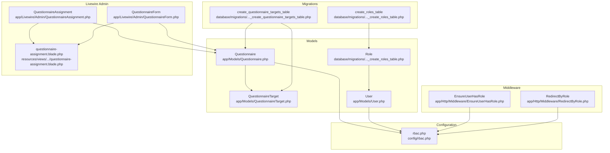
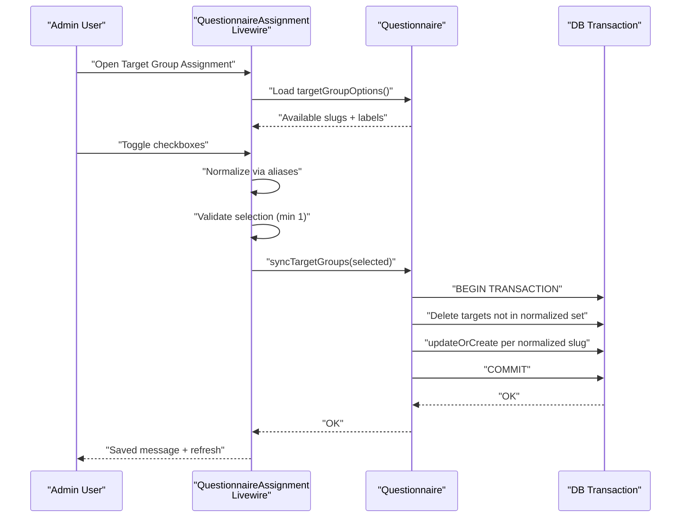
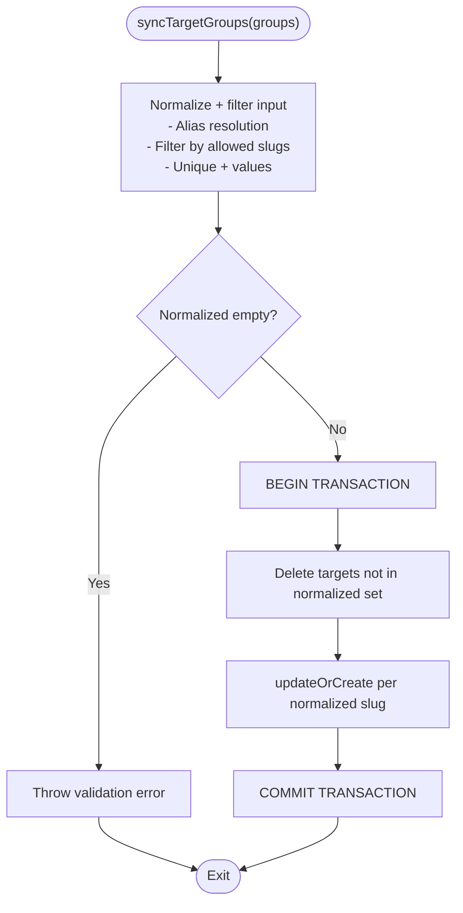
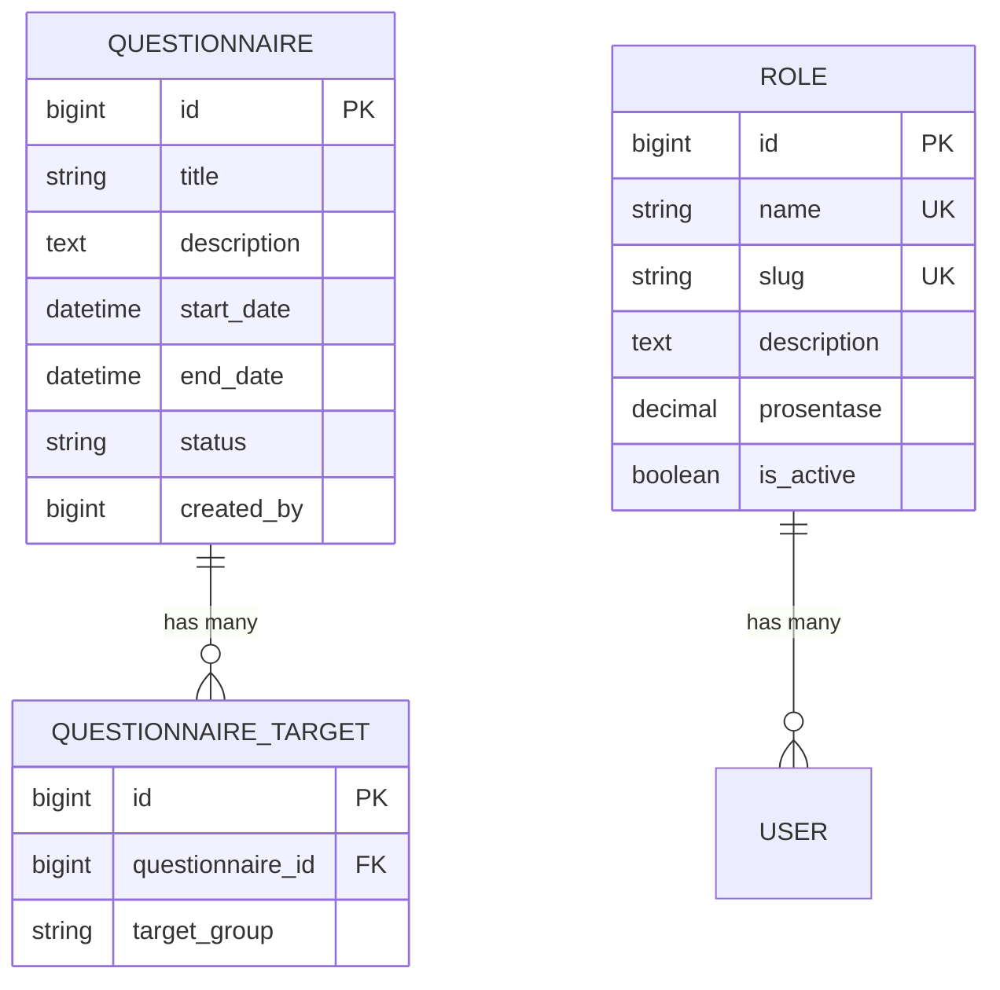
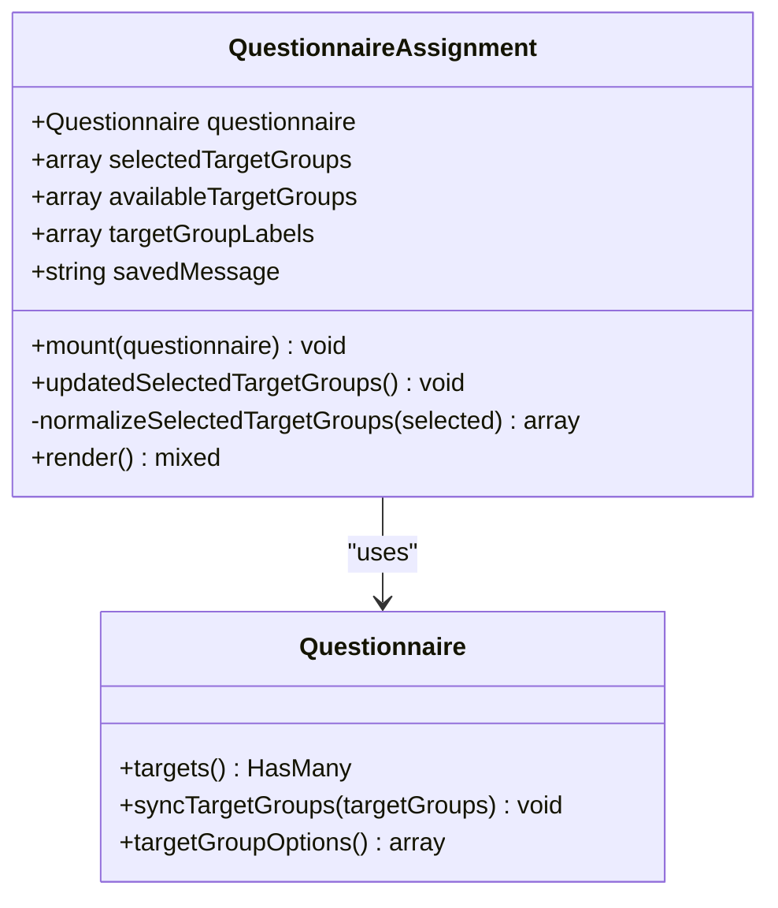
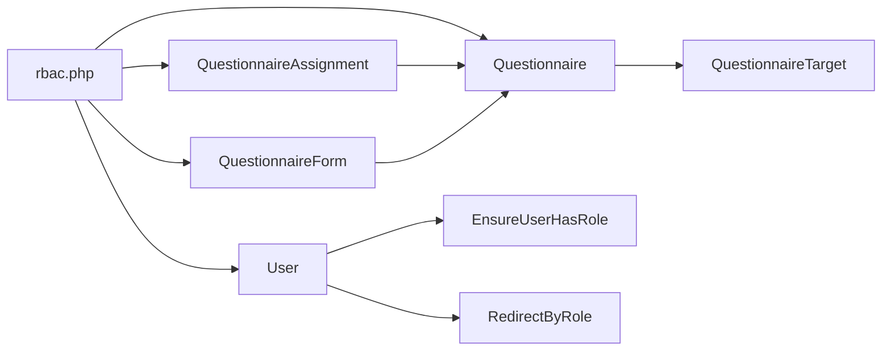

# Target Group Assignment

<cite>
**Referenced Files in This Document**
- [Questionnaire.php](file://app/Models/Questionnaire.php)
- [QuestionnaireTarget.php](file://app/Models/QuestionnaireTarget.php)
- [QuestionnaireAssignment.php](file://app/Livewire/Admin/QuestionnaireAssignment.php)
- [QuestionnaireForm.php](file://app/Livewire/Admin/QuestionnaireForm.php)
- [questionnaire-assignment.blade.php](file://resources/views/livewire/admin/questionnaire-assignment.blade.php)
- [2026_04_16_010240_create_questionnaire_targets_table.php](file://database/migrations/2026_04_16_010240_create_questionnaire_targets_table.php)
- [2026_04_17_093035_create_roles_table.php](file://database/migrations/2026_04_17_093035_create_roles_table.php)
- [rbac.php](file://config/rbac.php)
- [User.php](file://app/Models/User.php)
- [EnsureUserHasRole.php](file://app/Http/Middleware/EnsureUserHasRole.php)
- [RedirectByRole.php](file://app/Http/Middleware/RedirectByRole.php)
</cite>

## Update Summary
**Changes Made**
- Enhanced the `syncTargetGroups` method with database transaction support for atomic operations
- Improved dynamic target group management through enhanced validation and synchronization logic
- Added comprehensive error handling and validation for target group assignments
- Strengthened the relationship between questionnaire targets and user roles with improved role label mapping

## Table of Contents
1. [Introduction](#introduction)
2. [Project Structure](#project-structure)
3. [Core Components](#core-components)
4. [Architecture Overview](#architecture-overview)
5. [Detailed Component Analysis](#detailed-component-analysis)
6. [Enhanced Synchronization Logic](#enhanced-synchronization-logic)
7. [Dynamic Target Group Management](#dynamic-target-group-management)
8. [Dependency Analysis](#dependency-analysis)
9. [Performance Considerations](#performance-considerations)
10. [Troubleshooting Guide](#troubleshooting-guide)
11. [Conclusion](#conclusion)
12. [Appendices](#appendices)

## Introduction
This document explains the Target Group Assignment system that controls which user roles can view and fill a given questionnaire. The system has been enhanced with dynamic target group management capabilities, featuring atomic database transactions for managing questionnaire-target group associations and sophisticated role label mapping. It covers how questionnaire targets are defined, validated, synchronized, and surfaced in the dynamic target group selection interface. The document also details the relationship between roles and target groups, role-based questionnaire targeting, configuration options, and common troubleshooting steps.

## Project Structure
The target group assignment spans models, Livewire components, Blade views, configuration, migrations, and middleware. The enhanced system now includes robust transactional operations and improved dynamic management capabilities.

**Diagram sources**
- [Questionnaire.php:1-133](file://app/Models/Questionnaire.php#L1-L133)
- [QuestionnaireTarget.php:1-24](file://app/Models/QuestionnaireTarget.php#L1-L24)
- [QuestionnaireAssignment.php:1-91](file://app/Livewire/Admin/QuestionnaireAssignment.php#L1-L91)
- [QuestionnaireForm.php:1-138](file://app/Livewire/Admin/QuestionnaireForm.php#L1-L138)
- [questionnaire-assignment.blade.php:1-37](file://resources/views/livewire/admin/questionnaire-assignment.blade.php#L1-L37)
- [rbac.php:1-64](file://config/rbac.php#L1-L64)
- [User.php:1-98](file://app/Models/User.php#L1-L98)
- [EnsureUserHasRole.php:1-28](file://app/Http/Middleware/EnsureUserHasRole.php#L1-L28)
- [RedirectByRole.php:1-31](file://app/Http/Middleware/RedirectByRole.php#L1-L31)
- [2026_04_16_010240_create_questionnaire_targets_table.php:1-26](file://database/migrations/2026_04_16_010240_create_questionnaire_targets_table.php#L1-L26)
- [2026_04_17_093035_create_roles_table.php:1-33](file://database/migrations/2026_04_17_093035_create_roles_table.php#L1-L33)

**Section sources**
- [Questionnaire.php:1-133](file://app/Models/Questionnaire.php#L1-L133)
- [QuestionnaireTarget.php:1-24](file://app/Models/QuestionnaireTarget.php#L1-L24)
- [QuestionnaireAssignment.php:1-91](file://app/Livewire/Admin/QuestionnaireAssignment.php#L1-L91)
- [QuestionnaireForm.php:1-138](file://app/Livewire/Admin/QuestionnaireForm.php#L1-L138)
- [questionnaire-assignment.blade.php:1-37](file://resources/views/livewire/admin/questionnaire-assignment.blade.php#L1-L37)
- [rbac.php:1-64](file://config/rbac.php#L1-L64)
- [User.php:1-98](file://app/Models/User.php#L1-L98)
- [EnsureUserHasRole.php:1-28](file://app/Http/Middleware/EnsureUserHasRole.php#L1-L28)
- [RedirectByRole.php:1-31](file://app/Http/Middleware/RedirectByRole.php#L1-L31)
- [2026_04_16_010240_create_questionnaire_targets_table.php:1-26](file://database/migrations/2026_04_16_010240_create_questionnaire_targets_table.php#L1-L26)
- [2026_04_17_093035_create_roles_table.php:1-33](file://database/migrations/2026_04_17_093035_create_roles_table.php#L1-L33)

## Core Components
- **Questionnaire**: Enhanced with atomic transaction-based synchronization for target group management, comprehensive validation, and dynamic role label mapping.
- **QuestionnaireTarget**: Associates a questionnaire with a target group slug with unique constraints and cascading deletes.
- **QuestionnaireAssignment (Livewire)**: Provides dynamic UI for target group selection with real-time validation, alias normalization, and transactional persistence.
- **QuestionnaireForm (Livewire)**: Manages questionnaire creation and editing with integrated target group assignment and validation.
- **Blade View**: Renders checkbox grids with validation feedback, disabled states for last selection protection, and success messaging.
- **rbac.php**: Central configuration for role slugs, target slugs, aliases, labels, and dashboard routing with comprehensive role definitions.
- **User**: Supplies role slug resolution and role-based access control integration.
- **Middleware**: Enforces role-based access and redirects based on role configurations.

Key responsibilities:
- **Enhanced Validation**: Ensures at least one target group remains selected with comprehensive error handling.
- **Atomic Synchronization**: Uses database transactions to delete absent target groups and upsert present ones atomically.
- **Dynamic UI**: Presents available target groups with alias normalization and real-time validation feedback.
- **Transaction Management**: Guarantees data consistency through atomic operations during synchronization.

**Section sources**
- [Questionnaire.php:54-131](file://app/Models/Questionnaire.php#L54-L131)
- [QuestionnaireTarget.php:14-22](file://app/Models/QuestionnaireTarget.php#L14-L22)
- [QuestionnaireAssignment.php:27-91](file://app/Livewire/Admin/QuestionnaireAssignment.php#L27-L91)
- [QuestionnaireForm.php:42-138](file://app/Livewire/Admin/QuestionnaireForm.php#L42-L138)
- [questionnaire-assignment.blade.php:13-36](file://resources/views/livewire/admin/questionnaire-assignment.blade.php#L13-L36)
- [rbac.php:3-63](file://config/rbac.php#L3-L63)
- [User.php:58-97](file://app/Models/User.php#L58-L97)
- [EnsureUserHasRole.php:11-25](file://app/Http/Middleware/EnsureUserHasRole.php#L11-L25)
- [RedirectByRole.php:26-29](file://app/Http/Middleware/RedirectByRole.php#L26-L29)

## Architecture Overview
The enhanced assignment system centers around atomic database transactions for managing questionnaire-target group associations. The system uses a many-to-many-like association represented by QuestionnaireTarget records, with enhanced validation, alias normalization, and real-time UI feedback. The architecture ensures data consistency through transactional operations and provides comprehensive error handling.

**Diagram sources**
- [QuestionnaireAssignment.php:27-68](file://app/Livewire/Admin/QuestionnaireAssignment.php#L27-L68)
- [Questionnaire.php:57-85](file://app/Models/Questionnaire.php#L57-L85)
- [questionnaire-assignment.blade.php:13-36](file://resources/views/livewire/admin/questionnaire-assignment.blade.php#L13-L36)

## Detailed Component Analysis

### Enhanced Questionnaire Model: Atomic Synchronization and Validation
The Questionnaire model now features comprehensive validation and atomic transaction-based synchronization for target group management:

- **Allowed Target Groups**: Derived from role slugs with administrative role exclusion and non-empty validation.
- **Dynamic Options**: Provides both slug and human-readable name combinations for UI rendering.
- **Enhanced Synchronization Logic**:
  - Validates input to ensure at least one target group exists.
  - Executes within a database transaction for atomic operations.
  - Deletes absent target groups and upserts present ones.
  - Prevents empty sets by throwing validation errors.

**Diagram sources**
- [Questionnaire.php:57-85](file://app/Models/Questionnaire.php#L57-L85)

**Section sources**
- [Questionnaire.php:54-131](file://app/Models/Questionnaire.php#L54-L131)

### QuestionnaireTarget Model and Enhanced Database Schema
The QuestionnaireTarget model maintains the association between questionnaires and target groups with enhanced constraints:

- **Association Representation**: Represents questionnaire-target group relationships with unique constraints.
- **Database Constraints**: Enforces uniqueness on (questionnaire_id, target_group) pair.
- **Cascade Operations**: Ensures cleanup when questionnaires are removed.
- **Enhanced Validation**: Comprehensive input validation and filtering.

**Diagram sources**
- [QuestionnaireTarget.php:14-22](file://app/Models/QuestionnaireTarget.php#L14-L22)
- [2026_04_16_010240_create_questionnaire_targets_table.php:11-18](file://database/migrations/2026_04_16_010240_create_questionnaire_targets_table.php#L11-L18)
- [2026_04_17_093035_create_roles_table.php:14-22](file://database/migrations/2026_04_17_093035_create_roles_table.php#L14-L22)

**Section sources**
- [QuestionnaireTarget.php:14-22](file://app/Models/QuestionnaireTarget.php#L14-L22)
- [2026_04_16_010240_create_questionnaire_targets_table.php:11-18](file://database/migrations/2026_04_16_010240_create_questionnaire_targets_table.php#L11-L18)
- [2026_04_17_093035_create_roles_table.php:14-22](file://database/migrations/2026_04_17_093035_create_roles_table.php#L14-L22)

### Enhanced QuestionnaireAssignment Livewire Component: Dynamic Management
The QuestionnaireAssignment component now provides enhanced dynamic management with real-time validation and transactional persistence:

- **Dynamic Loading**: Loads available target groups from configuration-derived role slugs with label mapping.
- **Advanced Normalization**: Normalizes user selections via aliases and filters disallowed values.
- **Comprehensive Validation**: Ensures at least one target group remains selected with detailed error handling.
- **Transactional Persistence**: Calls model synchronization method within transaction boundaries.
- **Real-time Feedback**: Dispatches Livewire events for UI updates and provides success messaging.

**Diagram sources**
- [QuestionnaireAssignment.php:10-91](file://app/Livewire/Admin/QuestionnaireAssignment.php#L10-L91)
- [Questionnaire.php:39-131](file://app/Models/Questionnaire.php#L39-L131)

**Section sources**
- [QuestionnaireAssignment.php:27-91](file://app/Livewire/Admin/QuestionnaireAssignment.php#L27-L91)
- [questionnaire-assignment.blade.php:13-36](file://resources/views/livewire/admin/questionnaire-assignment.blade.php#L13-L36)

### QuestionnaireForm Livewire Component: Integrated Management
The QuestionnaireForm component provides integrated management for both creating and editing questionnaires with target group assignment:

- **Dual Mode Operation**: Handles both questionnaire creation and editing scenarios.
- **Default Assignment**: Automatically assigns default target groups when none exist.
- **Event Integration**: Listens for target group updates and refreshes UI accordingly.
- **Comprehensive Validation**: Integrates with form validation and target group synchronization.

**Section sources**
- [QuestionnaireForm.php:42-138](file://app/Livewire/Admin/QuestionnaireForm.php#L42-L138)

### Enhanced Blade View: Advanced UI and Validation
The Blade view provides advanced UI features with comprehensive validation feedback:

- **Checkbox Grid**: Renders grid of checkboxes for available target groups with dynamic labeling.
- **Last Selection Protection**: Disables removal of the last selected group to prevent accidental deselection.
- **Validation Messaging**: Displays detailed validation messages for missing selections and invalid entries.
- **Success Feedback**: Shows success messages after successful saves with automatic refresh.

**Section sources**
- [questionnaire-assignment.blade.php:13-36](file://resources/views/livewire/admin/questionnaire-assignment.blade.php#L13-L36)

### Enhanced Configuration: Comprehensive Role Management
The rbac configuration now provides comprehensive role management with enhanced flexibility:

- **Role Definitions**: Complete role catalog with names, slugs, descriptions, and permissions.
- **Alias Mapping**: Extensive alias definitions for flexible role handling.
- **Dashboard Routing**: Comprehensive dashboard path definitions for all role types.
- **Legacy Support**: Legacy role slug support and fallback mechanisms.

**Section sources**
- [rbac.php:3-63](file://config/rbac.php#L3-L63)

### Enhanced Role-Based Access Control
The system now provides enhanced role-based access control with comprehensive middleware integration:

- **Middleware Integration**: Ensures requests match configured role slugs for protected routes.
- **Dynamic Redirection**: Routes users to role-specific dashboards based on configuration.
- **Role Resolution**: Provides comprehensive role slug resolution for access control decisions.

**Section sources**
- [EnsureUserHasRole.php:11-25](file://app/Http/Middleware/EnsureUserHasRole.php#L11-L25)
- [RedirectByRole.php:26-29](file://app/Http/Middleware/RedirectByRole.php#L26-L29)
- [User.php:58-97](file://app/Models/User.php#L58-L97)

## Enhanced Synchronization Logic
The enhanced synchronization logic provides atomic operations for managing questionnaire-target group associations:

### Transaction-Based Operations
- **Atomic Execution**: All synchronization operations execute within a single database transaction.
- **Consistency Guarantee**: Ensures data consistency even if individual operations fail.
- **Rollback Capability**: Automatic rollback on validation failures or database errors.

### Advanced Validation and Filtering
- **Input Normalization**: Filters and normalizes input arrays to remove duplicates and invalid entries.
- **Alias Resolution**: Resolves aliases to canonical role slugs before validation.
- **Constraint Checking**: Validates that all selected target groups exist in available target groups.

### Error Handling and Recovery
- **Validation Exceptions**: Throws detailed validation errors for empty selections.
- **Transaction Safety**: Ensures partial updates never occur during synchronization.
- **Fallback Mechanisms**: Provides default target group assignments when none exist.

**Section sources**
- [Questionnaire.php:57-85](file://app/Models/Questionnaire.php#L57-L85)

## Dynamic Target Group Management
The system now features comprehensive dynamic target group management capabilities:

### Real-time Validation
- **Live Validation**: Provides real-time validation feedback as users interact with the interface.
- **Immediate Feedback**: Displays validation errors immediately when selections become invalid.
- **Preventive Measures**: Prevents invalid states through client-side and server-side validation.

### Enhanced User Experience
- **Intelligent Defaults**: Automatically assigns default target groups when none are selected.
- **Smart Normalization**: Handles alias resolution and slug normalization transparently.
- **Responsive Interface**: Provides immediate visual feedback for all user interactions.

### Event-Driven Updates
- **Livewire Events**: Dispatches events when target groups are updated for real-time UI refresh.
- **Cross-component Communication**: Enables seamless communication between related components.
- **State Synchronization**: Maintains consistent state across multiple components.

**Section sources**
- [QuestionnaireAssignment.php:56-68](file://app/Livewire/Admin/QuestionnaireAssignment.php#L56-L68)
- [QuestionnaireForm.php:114-126](file://app/Livewire/Admin/QuestionnaireForm.php#L114-L126)

## Dependency Analysis
The enhanced system maintains clear dependency relationships with improved transactional integrity:

- **Questionnaire Dependencies**: Depends on Role slugs, configuration aliases, and database constraints.
- **Component Dependencies**: QuestionnaireAssignment and QuestionnaireForm depend on Questionnaire model and configuration.
- **Database Integrity**: Maintains referential integrity and uniqueness constraints for target-group associations.
- **Middleware Integration**: User model and middleware depend on comprehensive configuration for role management.

**Diagram sources**
- [rbac.php:3-63](file://config/rbac.php#L3-L63)
- [Questionnaire.php:88-131](file://app/Models/Questionnaire.php#L88-L131)
- [QuestionnaireAssignment.php:79-91](file://app/Livewire/Admin/QuestionnaireAssignment.php#L79-L91)
- [QuestionnaireForm.php:114-138](file://app/Livewire/Admin/QuestionnaireForm.php#L114-L138)
- [User.php:58-97](file://app/Models/User.php#L58-L97)
- [EnsureUserHasRole.php:11-25](file://app/Http/Middleware/EnsureUserHasRole.php#L11-L25)
- [RedirectByRole.php:26-29](file://app/Http/Middleware/RedirectByRole.php#L26-L29)

**Section sources**
- [Questionnaire.php:88-131](file://app/Models/Questionnaire.php#L88-L131)
- [QuestionnaireAssignment.php:79-91](file://app/Livewire/Admin/QuestionnaireAssignment.php#L79-L91)
- [QuestionnaireForm.php:114-138](file://app/Livewire/Admin/QuestionnaireForm.php#L114-L138)
- [rbac.php:3-63](file://config/rbac.php#L3-L63)
- [User.php:58-97](file://app/Models/User.php#L58-L97)
- [EnsureUserHasRole.php:11-25](file://app/Http/Middleware/EnsureUserHasRole.php#L11-L25)
- [RedirectByRole.php:26-29](file://app/Http/Middleware/RedirectByRole.php#L26-L29)

## Performance Considerations
The enhanced system maintains optimal performance through several optimizations:

- **Transaction Efficiency**: Single transaction reduces database round trips and ensures consistency.
- **In-Memory Processing**: Filtering and deduplication occur in memory before database writes.
- **Unique Constraints**: Database-level unique constraints prevent duplicates and enable fast lookups.
- **Lazy Loading**: Eager loading of related models reduces N+1 query problems.
- **Validation Optimization**: Client-side validation reduces unnecessary server requests.

## Troubleshooting Guide
Enhanced troubleshooting for the improved system:

### Common Issues and Resolutions
- **Transaction Failures**: Check database connectivity and transaction isolation levels.
- **Validation Errors**: Review alias mappings and ensure all slugs exist in configuration.
- **Missing Target Groups**: Verify role definitions and ensure roles have non-empty slugs.
- **Event Communication**: Check Livewire event listeners and component registration.
- **Permission Issues**: Verify user role slugs match configured access patterns.

### Enhanced Debugging Capabilities
- **Transaction Logging**: Monitor transaction boundaries and rollback points.
- **Validation Tracing**: Trace validation failures through the normalization pipeline.
- **Event Flow**: Monitor Livewire event propagation and component lifecycle.
- **Database State**: Inspect database state before and after transaction operations.

**Section sources**
- [Questionnaire.php:57-85](file://app/Models/Questionnaire.php#L57-L85)
- [QuestionnaireAssignment.php:56-68](file://app/Livewire/Admin/QuestionnaireAssignment.php#L56-L68)
- [rbac.php:7-11](file://config/rbac.php#L7-L11)

## Conclusion
The enhanced Target Group Assignment system provides robust, maintainable role-based questionnaire targeting with comprehensive transactional integrity. The system cleanly separates concerns: configuration defines allowed slugs and aliases, models enforce validation and atomic synchronization, Livewire components provide responsive UI with real-time validation, and middleware/dashboards integrate role-aware navigation. The enhanced transaction-based synchronization ensures data consistency, while dynamic management capabilities provide flexible target group assignment with comprehensive validation and error handling.

## Appendices

### Enhanced Role-Based Questionnaire Targeting Examples
- **Example 1**: Questionnaire targeting educators and staff via slugs with alias resolution.
- **Example 2**: Complex alias mapping normalizing "guru_staf" to "guru" and "komite" to "orang_tua".
- **Example 3**: Transactional synchronization ensuring atomic updates during target group changes.
- **Example 4**: Default assignment fallback when no target groups exist initially.

**Section sources**
- [rbac.php:6-11](file://config/rbac.php#L6-L11)
- [Questionnaire.php:88-131](file://app/Models/Questionnaire.php#L88-L131)
- [QuestionnaireAssignment.php:79-91](file://app/Livewire/Admin/QuestionnaireAssignment.php#L79-L91)

### Enhanced Target Group Configuration Checklist
- **Define Role Catalog**: Complete role definitions with names, slugs, descriptions, and permissions.
- **Configure Aliases**: Set up comprehensive alias mappings for flexible role handling.
- **Establish Defaults**: Define fallback slugs for questionnaire targets.
- **Set Up Labels**: Configure human-readable labels for UI display.
- **Dashboard Integration**: Define dashboard paths for all role types.
- **Validation Rules**: Establish validation rules for target group assignments.

**Section sources**
- [rbac.php:3-63](file://config/rbac.php#L3-L63)

### Transaction Management Best Practices
- **Atomic Operations**: Always wrap synchronization operations in transactions.
- **Error Handling**: Implement comprehensive error handling for transaction failures.
- **Validation First**: Validate inputs before attempting database operations.
- **State Consistency**: Ensure UI state remains consistent with database state.
- **Performance Monitoring**: Monitor transaction performance and optimize as needed.

**Section sources**
- [Questionnaire.php:57-85](file://app/Models/Questionnaire.php#L57-L85)