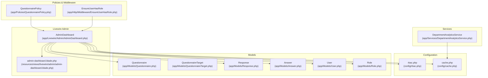
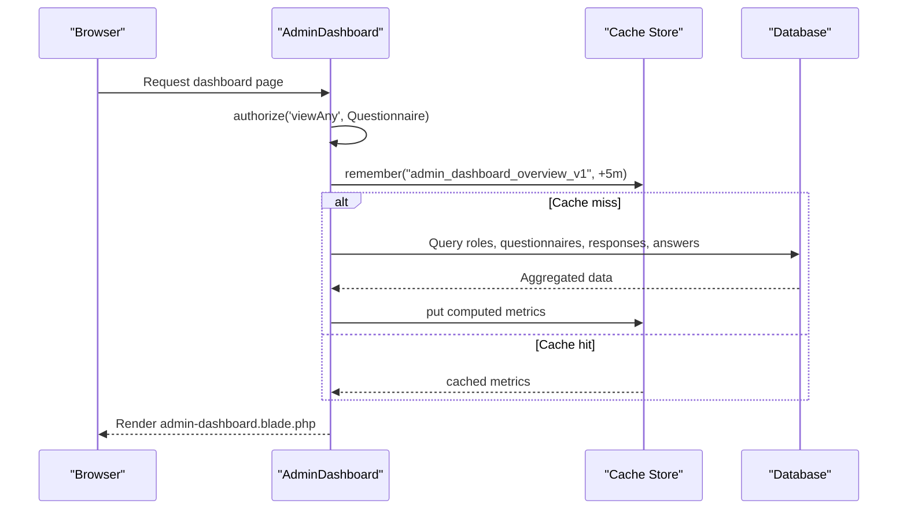
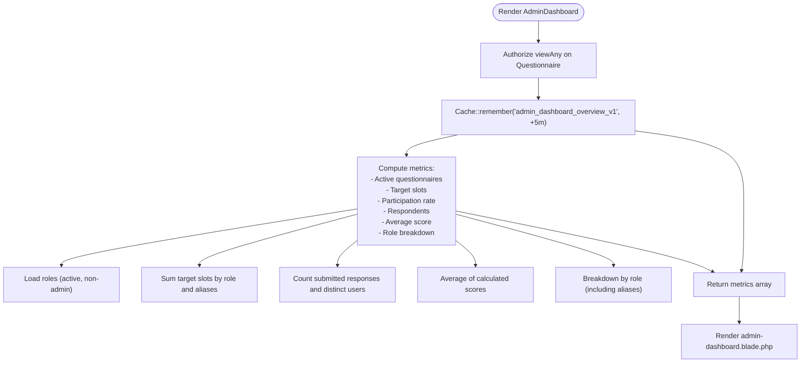
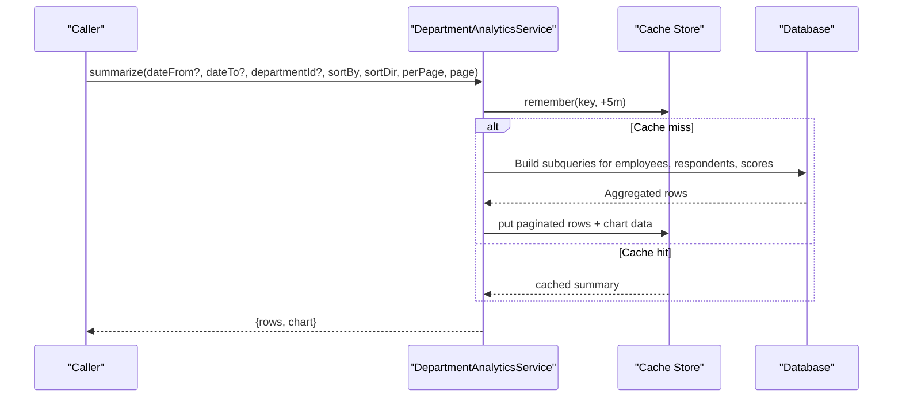
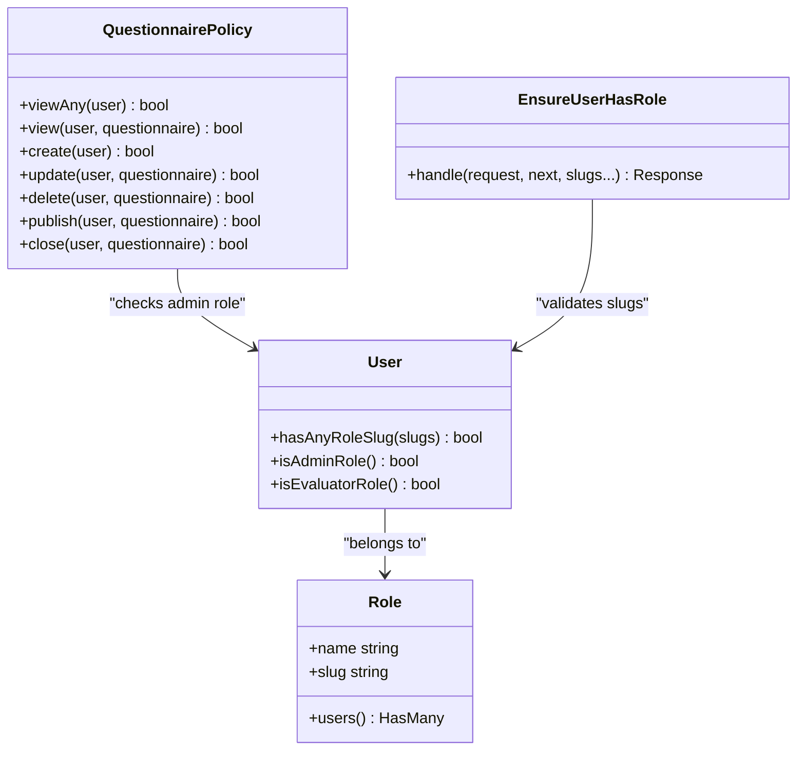
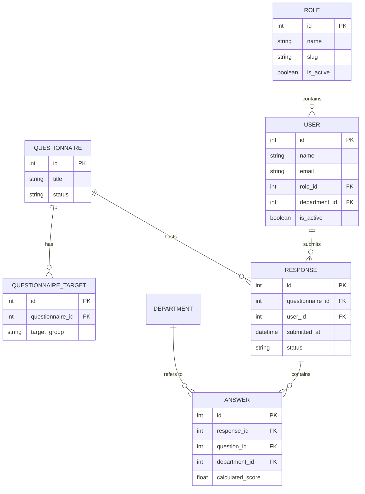
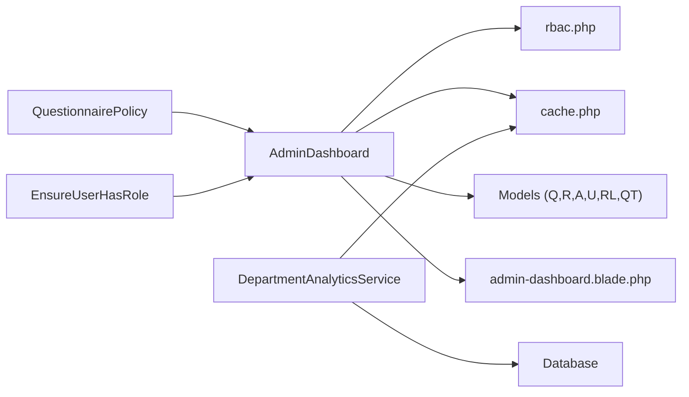

# Administrator Dashboard

<cite>
**Referenced Files in This Document**
- [AdminDashboard.php](file://app/Livewire/Admin/AdminDashboard.php)
- [DepartmentAnalyticsService.php](file://app\Services/DepartmentAnalyticsService.php)
- [rbac.php](file://config/rbac.php)
- [cache.php](file://config/cache.php)
- [Questionnaire.php](file://app/Models/Questionnaire.php)
- [Response.php](file://app/Models/Response.php)
- [Answer.php](file://app/Models/Answer.php)
- [User.php](file://app/Models/User.php)
- [Role.php](file://app/Models/Role.php)
- [QuestionnaireTarget.php](file://app/Models/QuestionnaireTarget.php)
- [QuestionnairePolicy.php](file://app/Policies/QuestionnairePolicy.php)
- [EnsureUserHasRole.php](file://app/Http/Middleware/EnsureUserHasRole.php)
- [admin-dashboard.blade.php](file://resources/views/livewire/admin/admin-dashboard.blade.php)
</cite>

## Table of Contents
1. [Introduction](#introduction)
2. [Project Structure](#project-structure)
3. [Core Components](#core-components)
4. [Architecture Overview](#architecture-overview)
5. [Detailed Component Analysis](#detailed-component-analysis)
6. [Dependency Analysis](#dependency-analysis)
7. [Performance Considerations](#performance-considerations)
8. [Troubleshooting Guide](#troubleshooting-guide)
9. [Conclusion](#conclusion)

## Introduction
This document describes the Administrator Dashboard system, focusing on analytics widgets, metric computation, caching, and data aggregation. It explains how the dashboard computes:
- Total active questionnaires
- Participation rate
- Average scores
- Respondent breakdowns by role
- Target slot calculations for active questionnaires
- Role-based user distribution charts and administrative overview components

It also documents configuration options for dashboard metrics, cache expiration settings, and RBAC integration for admin permissions.

## Project Structure
The Administrator Dashboard is implemented as a Livewire component rendering a Blade view. Supporting services and configuration provide analytics summaries and caching behavior. Models represent domain entities and relationships used in computations.

**Diagram sources**
- [AdminDashboard.php:1-137](file://app/Livewire/Admin/AdminDashboard.php#L1-L137)
- [DepartmentAnalyticsService.php:1-279](file://app/Services/DepartmentAnalyticsService.php#L1-L279)
- [rbac.php:1-64](file://config/rbac.php#L1-L64)
- [cache.php:1-131](file://config/cache.php#L1-L131)
- [Questionnaire.php:1-131](file://app/Models/Questionnaire.php#L1-L131)
- [QuestionnaireTarget.php:1-24](file://app/Models/QuestionnaireTarget.php#L1-L24)
- [Response.php:1-42](file://app/Models/Response.php#L1-L42)
- [Answer.php:1-44](file://app/Models/Answer.php#L1-L44)
- [User.php:1-94](file://app/Models/User.php#L1-L94)
- [Role.php:1-31](file://app/Models/Role.php#L1-L31)
- [QuestionnairePolicy.php:1-55](file://app/Policies/QuestionnairePolicy.php#L1-L55)
- [EnsureUserHasRole.php:1-28](file://app/Http/Middleware/EnsureUserHasRole.php#L1-L28)
- [admin-dashboard.blade.php](file://resources/views/livewire/admin/admin-dashboard.blade.php)

**Section sources**
- [AdminDashboard.php:1-137](file://app/Livewire/Admin/AdminDashboard.php#L1-L137)
- [DepartmentAnalyticsService.php:1-279](file://app/Services/DepartmentAnalyticsService.php#L1-L279)
- [rbac.php:1-64](file://config/rbac.php#L1-L64)
- [cache.php:1-131](file://config/cache.php#L1-L131)

## Core Components
- AdminDashboard: Computes and caches overview metrics, participates in RBAC checks, and renders the dashboard view.
- DepartmentAnalyticsService: Provides department-level analytics with caching and pagination support.
- RBAC configuration: Defines admin slugs, evaluator slugs, target aliases, and role mappings used by dashboards.
- Cache configuration: Controls cache store and expiration behavior.
- Models: Questionnaire, Response, Answer, User, Role, and QuestionnaireTarget underpin metric calculations.

Key responsibilities:
- Metrics computation: Active questionnaires, participation rate, average score, respondent counts by role.
- Caching: Centralized caching via Cache::remember with 5-minute TTL for dashboard overview.
- Data aggregation: Joins across users, roles, responses, and answers; groups and computes averages.
- RBAC integration: Admin-only access enforced via policy and middleware.

**Section sources**
- [AdminDashboard.php:20-130](file://app/Livewire/Admin/AdminDashboard.php#L20-L130)
- [DepartmentAnalyticsService.php:20-95](file://app/Services/DepartmentAnalyticsService.php#L20-L95)
- [rbac.php:4-36](file://config/rbac.php#L4-L36)
- [cache.php:18-115](file://config/cache.php#L18-L115)

## Architecture Overview
The dashboard follows a layered pattern:
- Presentation: Livewire component renders a Blade view.
- Business logic: Computes metrics and aggregates data.
- Persistence: Uses Eloquent models and database queries.
- Caching: Applies cache with configurable TTL.
- Security: Enforces admin permissions via policy and middleware.

**Diagram sources**
- [AdminDashboard.php:20-135](file://app/Livewire/Admin/AdminDashboard.php#L20-L135)
- [QuestionnairePolicy.php:10-13](file://app/Policies/QuestionnairePolicy.php#L10-L13)
- [EnsureUserHasRole.php:11-25](file://app/Http/Middleware/EnsureUserHasRole.php#L11-L25)
- [cache.php:18-115](file://config/cache.php#L18-L115)

## Detailed Component Analysis

### AdminDashboard Component
Responsibilities:
- Authorization: Ensures the current user can view questionnaires (admin-only).
- Metric computation: Builds an overview payload with totals and breakdowns.
- Caching: Stores the computed metrics for 5 minutes under a fixed key.
- Rendering: Passes metrics to the Blade view.

Metric computation highlights:
- Active questionnaires count: Filters questionnaires by status and loads targets.
- Target slots: Sums users per target group, applying aliases from RBAC.
- Participation rate: Submissions divided by total target slots; handles zero-slot guard.
- Respondents: Distinct user count among submitted responses.
- Average score: Average of calculated scores from answers linked to submitted responses.
- Breakdown: Count of distinct respondents per role slug; includes alias aggregation.

**Diagram sources**
- [AdminDashboard.php:20-130](file://app/Livewire/Admin/AdminDashboard.php#L20-L130)
- [rbac.php:4-16](file://config/rbac.php#L4-L16)

**Section sources**
- [AdminDashboard.php:20-130](file://app/Livewire/Admin/AdminDashboard.php#L20-L130)
- [Questionnaire.php:37-40](file://app/Models/Questionnaire.php#L37-L40)
- [Response.php:27-35](file://app/Models/Response.php#L27-L35)
- [Answer.php:24-27](file://app/Models/Answer.php#L24-L27)
- [User.php:59-72](file://app/Models/User.php#L59-L72)
- [Role.php:26-29](file://app/Models/Role.php#L26-L29)
- [QuestionnaireTarget.php:19-22](file://app/Models/QuestionnaireTarget.php#L19-L22)

### DepartmentAnalyticsService
Responsibilities:
- Summarize departments: Employees, respondents, participation rate, average score.
- Role-level analytics within departments.
- User-level analytics by department and role.
- Caching: Uses Cache::remember with 5-minute TTL per query variant.
- Pagination: Paginates collection results for large datasets.

Key computations:
- Participation rate: Respondents divided by employees per department.
- Average score: Average of calculated scores for submitted answers.
- Role-level participation: Respondents divided by total users per role.
- User-level submissions: Counts submissions and averages scores per user.

**Diagram sources**
- [DepartmentAnalyticsService.php:20-95](file://app/Services/DepartmentAnalyticsService.php#L20-L95)
- [cache.php:18-115](file://config/cache.php#L18-L115)

**Section sources**
- [DepartmentAnalyticsService.php:20-95](file://app/Services/DepartmentAnalyticsService.php#L20-L95)
- [DepartmentAnalyticsService.php:109-189](file://app/Services/DepartmentAnalyticsService.php#L109-L189)
- [DepartmentAnalyticsService.php:199-256](file://app/Services/DepartmentAnalyticsService.php#L199-L256)

### RBAC Integration and Admin Permissions
- Admin slugs: Used to filter out admin roles from dashboard metrics and to gate access.
- Target aliases: Combine counts for roles like "guru" and "tata_usaha" under "guru_staf".
- Middleware: EnsureUserHasRole validates requested role slugs against the current user.
- Policy: QuestionnairePolicy restricts questionnaire actions to admin roles.

**Diagram sources**
- [User.php:59-92](file://app/Models/User.php#L59-L92)
- [Role.php:26-29](file://app/Models/Role.php#L26-L29)
- [QuestionnairePolicy.php:10-53](file://app/Policies/QuestionnairePolicy.php#L10-L53)
- [EnsureUserHasRole.php:11-25](file://app/Http/Middleware/EnsureUserHasRole.php#L11-L25)

**Section sources**
- [rbac.php:4-16](file://config/rbac.php#L4-L16)
- [QuestionnairePolicy.php:10-13](file://app/Policies/QuestionnairePolicy.php#L10-L13)
- [EnsureUserHasRole.php:11-25](file://app/Http/Middleware/EnsureUserHasRole.php#L11-L25)

### Data Models and Relationships
The dashboard relies on the following model relationships and attributes:
- Questionnaire has many QuestionnaireTargets and Responses.
- Response belongs to Questionnaire and User; has many Answers.
- Answer belongs to Response and optionally to Department.
- User belongs to Role and Department; has many Responses.
- Role has many Users.

**Diagram sources**
- [Questionnaire.php:37-50](file://app/Models/Questionnaire.php#L37-L50)
- [QuestionnaireTarget.php:19-22](file://app/Models/QuestionnaireTarget.php#L19-L22)
- [Response.php:27-40](file://app/Models/Response.php#L27-L40)
- [Answer.php:24-37](file://app/Models/Answer.php#L24-L37)
- [User.php:39-57](file://app/Models/User.php#L39-L57)
- [Role.php:26-29](file://app/Models/Role.php#L26-L29)

**Section sources**
- [Questionnaire.php:18-50](file://app/Models/Questionnaire.php#L18-L50)
- [Response.php:16-25](file://app/Models/Response.php#L16-L25)
- [Answer.php:15-22](file://app/Models/Answer.php#L15-L22)
- [User.php:16-37](file://app/Models/User.php#L16-L37)
- [Role.php:13-24](file://app/Models/Role.php#L13-L24)

## Dependency Analysis
- AdminDashboard depends on:
  - RBAC configuration for admin slugs and target aliases.
  - Cache configuration for store selection and TTL.
  - Models for querying and aggregating data.
  - Blade view for presentation.
- DepartmentAnalyticsService depends on:
  - Cache configuration for TTL.
  - Database for aggregated subqueries and joins.
- Policies and middleware enforce admin-only access to questionnaire-related operations.

**Diagram sources**
- [AdminDashboard.php:20-135](file://app/Livewire/Admin/AdminDashboard.php#L20-L135)
- [DepartmentAnalyticsService.php:20-95](file://app/Services/DepartmentAnalyticsService.php#L20-L95)
- [rbac.php:4-16](file://config/rbac.php#L4-L16)
- [cache.php:18-115](file://config/cache.php#L18-L115)
- [QuestionnairePolicy.php:10-13](file://app/Policies/QuestionnairePolicy.php#L10-L13)
- [EnsureUserHasRole.php:11-25](file://app/Http/Middleware/EnsureUserHasRole.php#L11-L25)

**Section sources**
- [AdminDashboard.php:20-135](file://app/Livewire/Admin/AdminDashboard.php#L20-L135)
- [DepartmentAnalyticsService.php:20-95](file://app/Services/DepartmentAnalyticsService.php#L20-L95)
- [QuestionnairePolicy.php:10-13](file://app/Policies/QuestionnairePolicy.php#L10-L13)
- [EnsureUserHasRole.php:11-25](file://app/Http/Middleware/EnsureUserHasRole.php#L11-L25)

## Performance Considerations
- Caching: The dashboard overview is cached for 5 minutes. Adjust the TTL in the component’s Cache::remember call if more/less frequent refresh is desired.
- Cache store: The default cache store is configurable; ensure the selected driver supports distributed caching if running multiple instances.
- Aggregation queries: The component performs grouped counts and averages; ensure appropriate indexes exist on status, submitted_at, and foreign keys.
- Pagination: Department analytics service paginates results to limit memory usage for large datasets.
- Aliases and grouping: Role aliases reduce repeated counting; keep alias mappings minimal and aligned with actual roles to avoid excessive joins.

[No sources needed since this section provides general guidance]

## Troubleshooting Guide
Common issues and resolutions:
- Unauthorized access: Ensure the user has an admin role slug configured; the policy and middleware enforce admin-only access.
- Empty metrics: Verify that active questionnaires exist and that responses have calculated scores; confirm that users are assigned to non-admin roles.
- Incorrect participation rate: Check that target aliases align with actual role slugs and that user counts per target group are accurate.
- Cache not updating: Clear the cache or adjust the cache key/ttl; confirm the cache store is reachable and writable.
- Slow queries: Review indexes on responses.status, responses.submitted_at, answers.calculated_score, and foreign keys; consider increasing cache TTL to reduce load.

**Section sources**
- [QuestionnairePolicy.php:10-13](file://app/Policies/QuestionnairePolicy.php#L10-L13)
- [EnsureUserHasRole.php:11-25](file://app/Http/Middleware/EnsureUserHasRole.php#L11-L25)
- [cache.php:18-115](file://config/cache.php#L18-L115)

## Conclusion
The Administrator Dashboard provides a comprehensive overview of assessment activity, combining role-based analytics, participation metrics, and average scores. Its design leverages RBAC configuration, caching, and efficient database aggregation to deliver timely insights. Administrators can rely on the dashboard for monitoring and reporting while maintaining strict access controls and scalable performance.