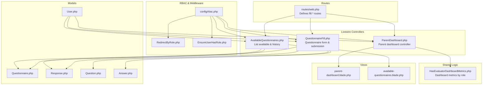
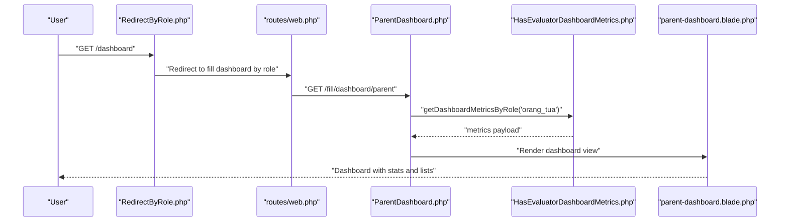
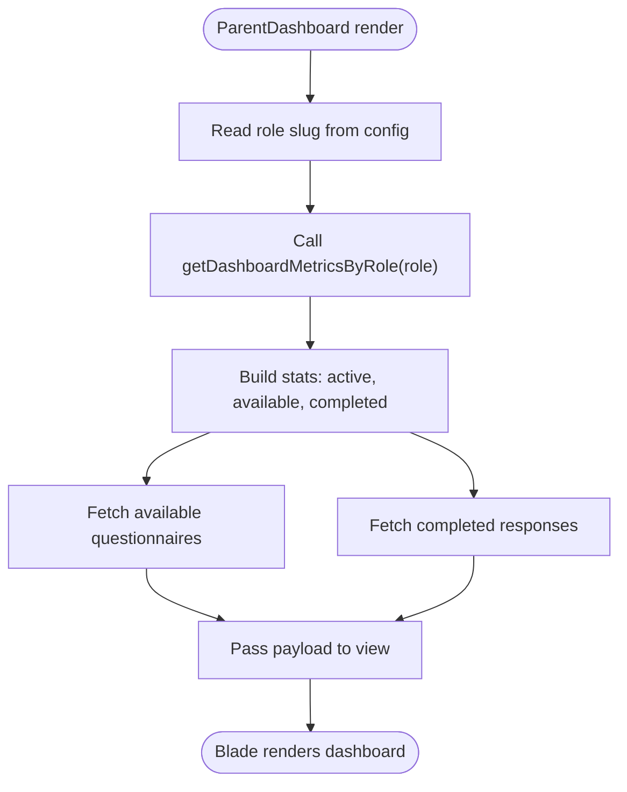
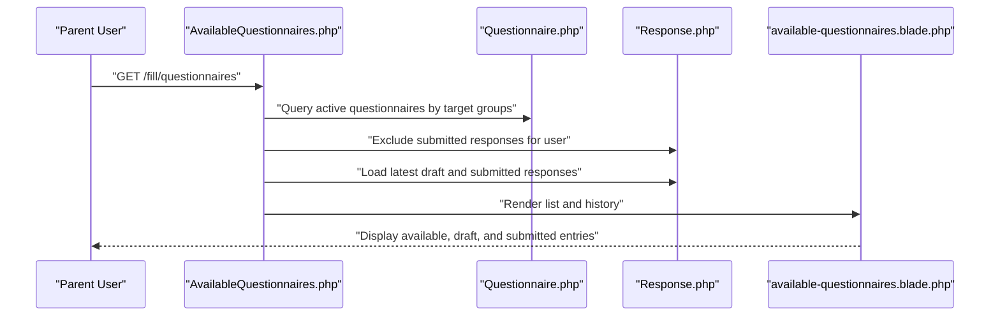
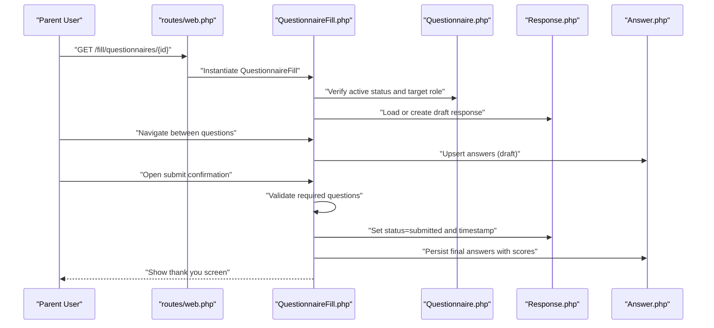
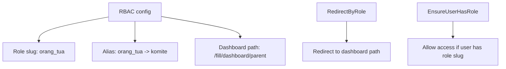
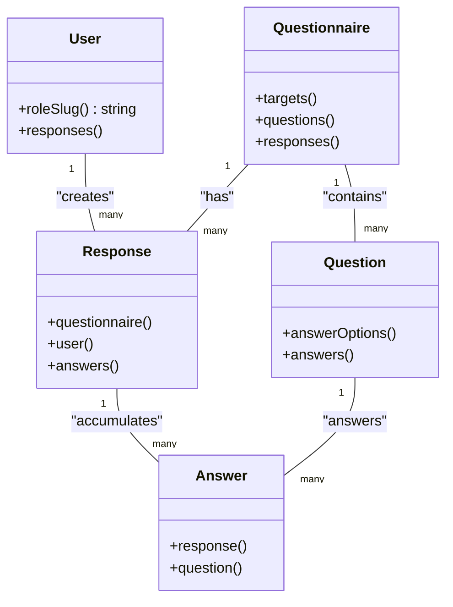
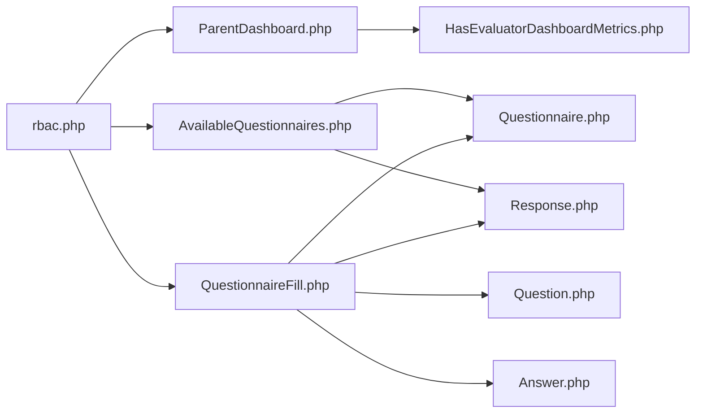

# Parent Dashboard

<cite>
**Referenced Files in This Document**
- [ParentDashboard.php](file://app/Livewire/Fill/ParentDashboard.php)
- [parent-dashboard.blade.php](file://resources/views/livewire/fill/parent-dashboard.blade.php)
- [HasEvaluatorDashboardMetrics.php](file://app/Livewire/Fill/Concerns/HasEvaluatorDashboardMetrics.php)
- [AvailableQuestionnaires.php](file://app/Livewire/Fill/AvailableQuestionnaires.php)
- [available-questionnaires.blade.php](file://resources/views/livewire/fill/available-questionnaires.blade.php)
- [QuestionnaireFill.php](file://app/Livewire/Fill/QuestionnaireFill.php)
- [rbac.php](file://config/rbac.php)
- [web.php](file://routes/web.php)
- [EnsureUserHasRole.php](file://app/Http/Middleware/EnsureUserHasRole.php)
- [RedirectByRole.php](file://app/Http/Middleware/RedirectByRole.php)
- [Questionnaire.php](file://app/Models/Questionnaire.php)
- [Response.php](file://app/Models/Response.php)
- [Question.php](file://app/Models/Question.php)
- [Answer.php](file://app/Models/Answer.php)
- [User.php](file://app/Models/User.php)
</cite>

## Table of Contents
1. [Introduction](#introduction)
2. [Project Structure](#project-structure)
3. [Core Components](#core-components)
4. [Architecture Overview](#architecture-overview)
5. [Detailed Component Analysis](#detailed-component-analysis)
6. [Dependency Analysis](#dependency-analysis)
7. [Performance Considerations](#performance-considerations)
8. [Troubleshooting Guide](#troubleshooting-guide)
9. [Conclusion](#conclusion)

## Introduction
This document describes the Parent Dashboard interface and its associated child assessment and feedback system. It explains how parents access available questionnaires, manage submissions, track completed assessments, and view educational evaluation metrics tailored to their role. The documentation covers dashboard components, navigation patterns, parent permissions, child-specific evaluation categories, and the end-to-end educational assessment workflow.

## Project Structure
The Parent Dashboard is part of the Fill module within a Livewire-driven frontend. It integrates with role-based access control (RBAC) configuration and leverages shared dashboard metrics logic. The key files include:
- ParentDashboard controller and Blade view
- Shared metrics trait used across evaluator dashboards
- Available questionnaires listing and submission history
- Questionnaire filling component and supporting models
- RBAC configuration and routing for evaluator dashboards

**Diagram sources**
- [web.php:149-160](file://routes/web.php#L149-L160)
- [ParentDashboard.php:10-22](file://app/Livewire/Fill/ParentDashboard.php#L10-L22)
- [AvailableQuestionnaires.php:12-63](file://app/Livewire/Fill/AvailableQuestionnaires.php#L12-L63)
- [QuestionnaireFill.php:19-514](file://app/Livewire/Fill/QuestionnaireFill.php#L19-L514)
- [HasEvaluatorDashboardMetrics.php:9-72](file://app/Livewire/Fill/Concerns/HasEvaluatorDashboardMetrics.php#L9-L72)
- [rbac.php:1-64](file://config/rbac.php#L1-L64)
- [parent-dashboard.blade.php:1-55](file://resources/views/livewire/fill/parent-dashboard.blade.php#L1-L55)
- [available-questionnaires.blade.php:1-85](file://resources/views/livewire/fill/available-questionnaires.blade.php#L1-L85)
- [Questionnaire.php:13-131](file://app/Models/Questionnaire.php#L13-L131)
- [Response.php:11-42](file://app/Models/Response.php#L11-L42)
- [Question.php:11-43](file://app/Models/Question.php#L11-L43)
- [Answer.php:10-44](file://app/Models/Answer.php#L10-L44)
- [User.php:12-94](file://app/Models/User.php#L12-L94)

**Section sources**
- [web.php:149-160](file://routes/web.php#L149-L160)
- [rbac.php:12-24](file://config/rbac.php#L12-L24)

## Core Components
- ParentDashboard: Renders the parent’s dashboard, computes metrics via a shared trait, and displays available questionnaires and completed submissions.
- AvailableQuestionnaires: Lists active questionnaires targeted to the parent role, draft and submitted histories.
- QuestionnaireFill: Handles the interactive questionnaire form, autosave/draft persistence, and final submission with scoring.
- Shared metrics: Provides reusable logic to compute stats and lists for evaluator dashboards.
- RBAC and routing: Defines role slugs, aliases, dashboard paths, and middleware gates for evaluator roles.

Key capabilities:
- Role-aware filtering of questionnaires based on target groups and aliases.
- Metrics: Active questionnaires, available to fill, and total completed.
- Navigation: From dashboard to questionnaire forms and back to history.
- Submission lifecycle: Draft, autosave, review, and final submission.

**Section sources**
- [ParentDashboard.php:10-22](file://app/Livewire/Fill/ParentDashboard.php#L10-L22)
- [HasEvaluatorDashboardMetrics.php:11-71](file://app/Livewire/Fill/Concerns/HasEvaluatorDashboardMetrics.php#L11-L71)
- [AvailableQuestionnaires.php:14-62](file://app/Livewire/Fill/AvailableQuestionnaires.php#L14-L62)
- [QuestionnaireFill.php:44-122](file://app/Livewire/Fill/QuestionnaireFill.php#L44-L122)

## Architecture Overview
The Parent Dashboard follows a layered pattern:
- Routes define evaluator-accessible areas and dashboard endpoints.
- Controllers fetch data and delegate rendering to Blade views.
- Shared traits encapsulate dashboard metrics computation.
- Models represent questionnaires, responses, questions, and answers.
- RBAC configuration and middleware enforce role-based access and redirects.

**Diagram sources**
- [RedirectByRole.php:11-29](file://app/Http/Middleware/RedirectByRole.php#L11-L29)
- [web.php:57-59](file://routes/web.php#L57-L59)
- [web.php:150-154](file://routes/web.php#L150-L154)
- [ParentDashboard.php:14-21](file://app/Livewire/Fill/ParentDashboard.php#L14-L21)
- [HasEvaluatorDashboardMetrics.php:11-71](file://app/Livewire/Fill/Concerns/HasEvaluatorDashboardMetrics.php#L11-L71)
- [parent-dashboard.blade.php:1-55](file://resources/views/livewire/fill/parent-dashboard.blade.php#L1-L55)

## Detailed Component Analysis

### Parent Dashboard Controller and View
- Controller responsibilities:
  - Reads the parent role slug from configuration.
  - Computes dashboard metrics using shared logic.
  - Passes metrics to the view for rendering.
- View responsibilities:
  - Displays three summary cards: active questionnaires, available to fill, and completed total.
  - Lists available questionnaires with quick action buttons.
  - Shows completed submission history with timestamps.

**Diagram sources**
- [ParentDashboard.php:16-21](file://app/Livewire/Fill/ParentDashboard.php#L16-L21)
- [HasEvaluatorDashboardMetrics.php:11-71](file://app/Livewire/Fill/Concerns/HasEvaluatorDashboardMetrics.php#L11-L71)
- [parent-dashboard.blade.php:7-53](file://resources/views/livewire/fill/parent-dashboard.blade.php#L7-L53)

**Section sources**
- [ParentDashboard.php:10-22](file://app/Livewire/Fill/ParentDashboard.php#L10-L22)
- [parent-dashboard.blade.php:1-55](file://resources/views/livewire/fill/parent-dashboard.blade.php#L1-L55)

### Available Questionnaires Listing and History
- Filters active questionnaires targeting the parent role and its alias.
- Prevents duplicate submissions by excluding previously submitted responses.
- Provides quick actions to start or resume filling.
- Maintains draft and submitted history for the current user.

**Diagram sources**
- [AvailableQuestionnaires.php:24-55](file://app/Livewire/Fill/AvailableQuestionnaires.php#L24-L55)
- [available-questionnaires.blade.php:8-83](file://resources/views/livewire/fill/available-questionnaires.blade.php#L8-L83)
- [Questionnaire.php:37-50](file://app/Models/Questionnaire.php#L37-L50)
- [Response.php:27-40](file://app/Models/Response.php#L27-L40)

**Section sources**
- [AvailableQuestionnaires.php:12-63](file://app/Livewire/Fill/AvailableQuestionnaires.php#L12-L63)
- [available-questionnaires.blade.php:1-85](file://resources/views/livewire/fill/available-questionnaires.blade.php#L1-L85)

### Questionnaire Filling Workflow
- Access control:
  - Requires authentication and active questionnaire status.
  - Validates that the questionnaire targets the user’s role or alias.
  - Prevents resubmission of the same questionnaire.
- Data model:
  - Creates or loads a draft response per user-questionnaire pair.
  - Persists answers incrementally and supports combined/single choice/essay types.
- Submission:
  - Validates required questions before allowing submission.
  - Commits answers and marks the response as submitted with a timestamp.

**Diagram sources**
- [web.php:156-159](file://routes/web.php#L156-L159)
- [QuestionnaireFill.php:44-122](file://app/Livewire/Fill/QuestionnaireFill.php#L44-L122)
- [QuestionnaireFill.php:193-245](file://app/Livewire/Fill/QuestionnaireFill.php#L193-L245)
- [Questionnaire.php:37-50](file://app/Models/Questionnaire.php#L37-L50)
- [Response.php:27-40](file://app/Models/Response.php#L27-L40)
- [Answer.php:24-42](file://app/Models/Answer.php#L24-L42)

**Section sources**
- [QuestionnaireFill.php:19-514](file://app/Livewire/Fill/QuestionnaireFill.php#L19-L514)

### Role-Based Permissions and Target Groups
- Role slugs and aliases:
  - Parent role slug is mapped to "orang_tua".
  - Aliases map "orang_tua" to "komite" for expanded targeting.
- Dashboard paths:
  - Parent dashboard route resolves to "/fill/dashboard/parent".
- Middleware:
  - EnsureUserHasRole enforces allowed role slugs.
  - RedirectByRole redirects unauthenticated users and routes authenticated users to their role dashboard.

**Diagram sources**
- [rbac.php:7-16](file://config/rbac.php#L7-L16)
- [rbac.php:49-62](file://config/rbac.php#L49-L62)
- [RedirectByRole.php:26-29](file://app/Http/Middleware/RedirectByRole.php#L26-L29)
- [EnsureUserHasRole.php:11-25](file://app/Http/Middleware/EnsureUserHasRole.php#L11-L25)

**Section sources**
- [rbac.php:1-64](file://config/rbac.php#L1-L64)
- [EnsureUserHasRole.php:1-28](file://app/Http/Middleware/EnsureUserHasRole.php#L1-L28)
- [RedirectByRole.php:1-31](file://app/Http/Middleware/RedirectByRole.php#L1-L31)

### Educational Evaluation Tracking
- Metrics computed by role:
  - Active questionnaires count for the parent role.
  - Available-to-fill count excludes previously submitted responses.
  - Completed total counts submitted responses for the parent role.
- Child-specific categories:
  - Questionnaire target groups are derived from roles and configured slugs.
  - Parents see questionnaires explicitly targeted to "orang_tua" or its alias "komite".

**Diagram sources**
- [User.php:39-62](file://app/Models/User.php#L39-L62)
- [Questionnaire.php:37-50](file://app/Models/Questionnaire.php#L37-L50)
- [Response.php:27-40](file://app/Models/Response.php#L27-L40)
- [Question.php:28-41](file://app/Models/Question.php#L28-L41)
- [Answer.php:24-42](file://app/Models/Answer.php#L24-L42)

**Section sources**
- [HasEvaluatorDashboardMetrics.php:11-71](file://app/Livewire/Fill/Concerns/HasEvaluatorDashboardMetrics.php#L11-L71)
- [Questionnaire.php:88-108](file://app/Models/Questionnaire.php#L88-L108)

## Dependency Analysis
- ParentDashboard depends on:
  - RBAC configuration for role slugs and dashboard paths.
  - Shared metrics trait for computing stats and lists.
  - Blade view for rendering.
- AvailableQuestionnaires depends on:
  - Questionnaire and Response models to filter and list.
  - RBAC aliases to expand target groups.
- QuestionnaireFill depends on:
  - Questionnaire, Response, Question, and Answer models.
  - Scoring service for calculated scores.
  - RBAC for role-based access checks.

**Diagram sources**
- [rbac.php:1-64](file://config/rbac.php#L1-L64)
- [ParentDashboard.php:10-22](file://app/Livewire/Fill/ParentDashboard.php#L10-L22)
- [AvailableQuestionnaires.php:12-63](file://app/Livewire/Fill/AvailableQuestionnaires.php#L12-L63)
- [QuestionnaireFill.php:19-514](file://app/Livewire/Fill/QuestionnaireFill.php#L19-L514)
- [HasEvaluatorDashboardMetrics.php:9-72](file://app/Livewire/Fill/Concerns/HasEvaluatorDashboardMetrics.php#L9-L72)
- [Questionnaire.php:13-131](file://app/Models/Questionnaire.php#L13-L131)
- [Response.php:11-42](file://app/Models/Response.php#L11-L42)
- [Question.php:11-43](file://app/Models/Question.php#L11-L43)
- [Answer.php:10-44](file://app/Models/Answer.php#L10-L44)

**Section sources**
- [rbac.php:1-64](file://config/rbac.php#L1-L64)
- [web.php:149-160](file://routes/web.php#L149-L160)

## Performance Considerations
- Efficient queries:
  - Use of whereHas and whereDoesntHave to limit datasets early.
  - withCount and with eager loading reduce N+1 queries.
- Autosave strategy:
  - Draft persistence occurs during navigation to minimize data loss and server load.
- Pagination and ordering:
  - Ordering by start_date and latest timestamps ensures relevant items appear first.

[No sources needed since this section provides general guidance]

## Troubleshooting Guide
Common issues and resolutions:
- Access denied when navigating to a questionnaire:
  - Ensure the questionnaire is active and targets the parent role or its alias.
  - Verify that the user has not already submitted the questionnaire.
- No available questionnaires displayed:
  - Confirm that active questionnaires exist and are targeted to "orang_tua" or "komite".
  - Check that the user has not previously submitted all applicable questionnaires.
- Submission errors:
  - Required questions must be answered before submission.
  - Combined types require both a selected option and an essay answer.

**Section sources**
- [QuestionnaireFill.php:53-79](file://app/Livewire/Fill/QuestionnaireFill.php#L53-L79)
- [QuestionnaireFill.php:342-388](file://app/Livewire/Fill/QuestionnaireFill.php#L342-L388)
- [AvailableQuestionnaires.php:24-39](file://app/Livewire/Fill/AvailableQuestionnaires.php#L24-L39)

## Conclusion
The Parent Dashboard provides a streamlined interface for parents to discover, fill, and track educational assessments aligned with their role. Through RBAC-driven targeting, autosave-enabled forms, and role-aware metrics, the system ensures secure, efficient, and transparent participation in the school evaluation process. The modular design allows easy extension to additional evaluation categories and reporting features.