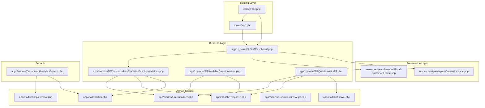
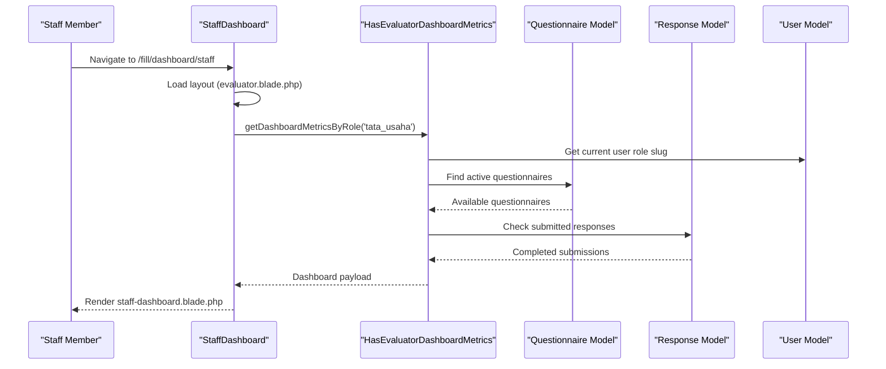
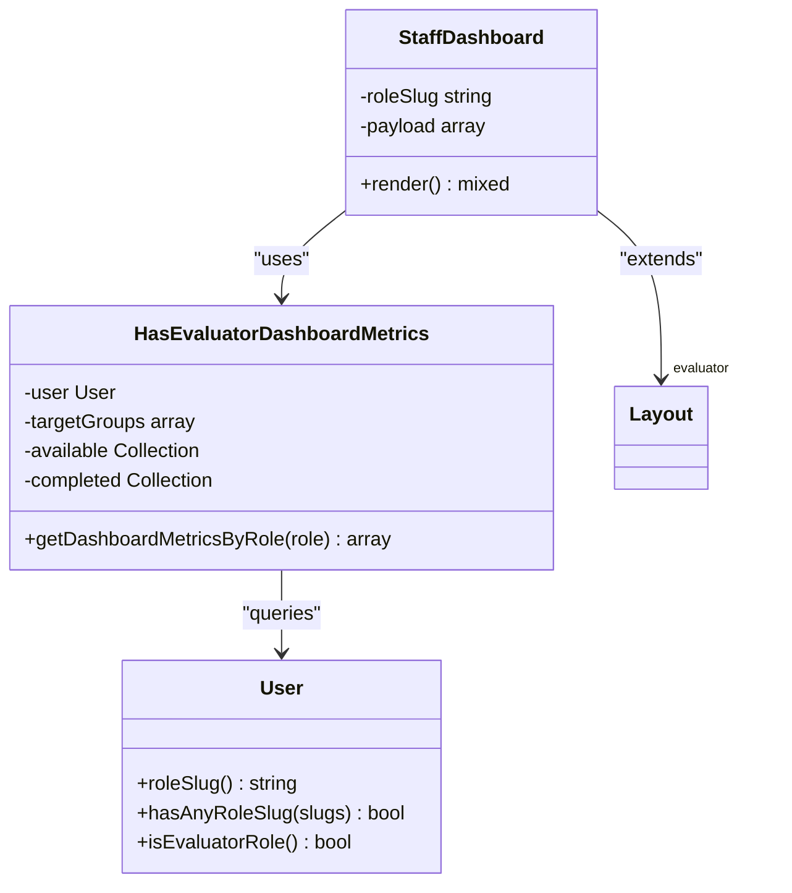
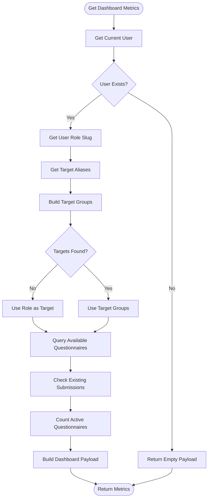
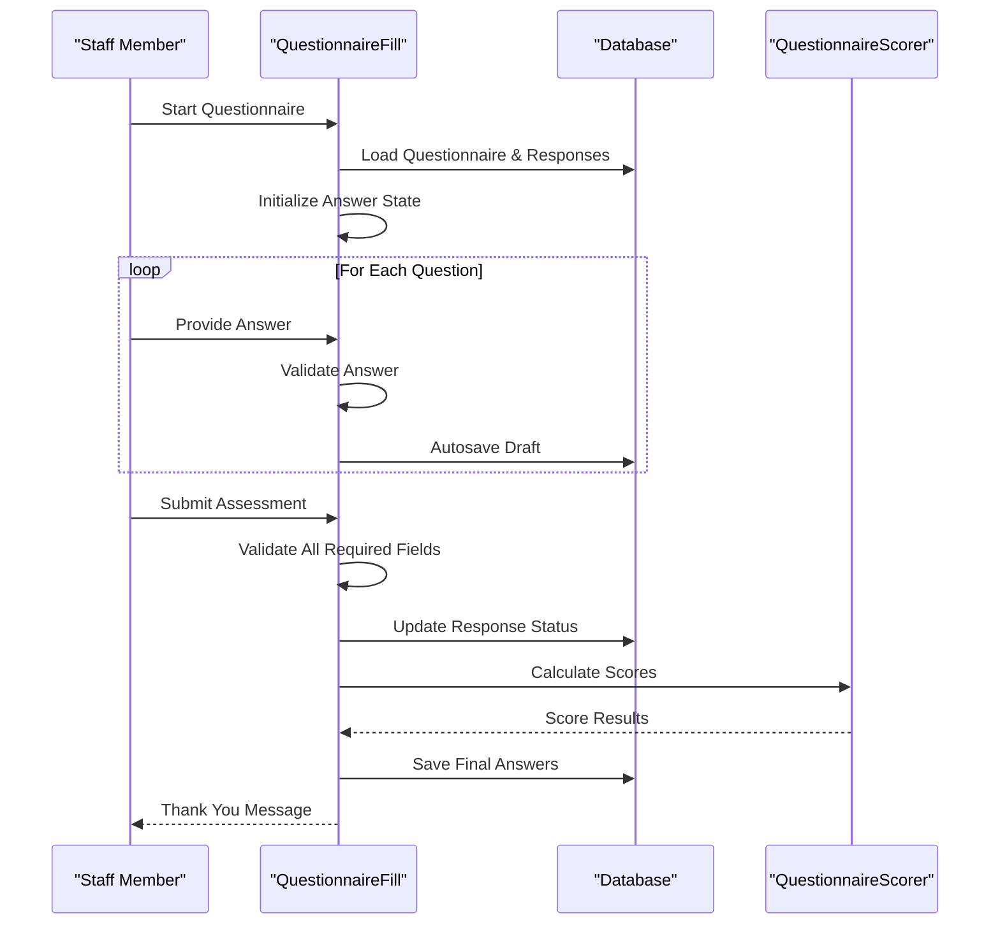
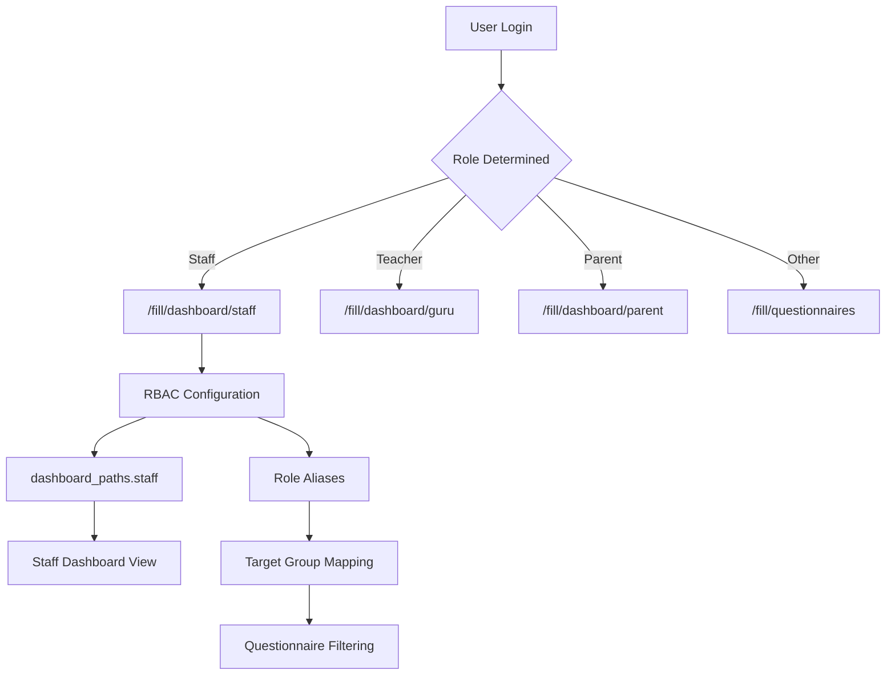
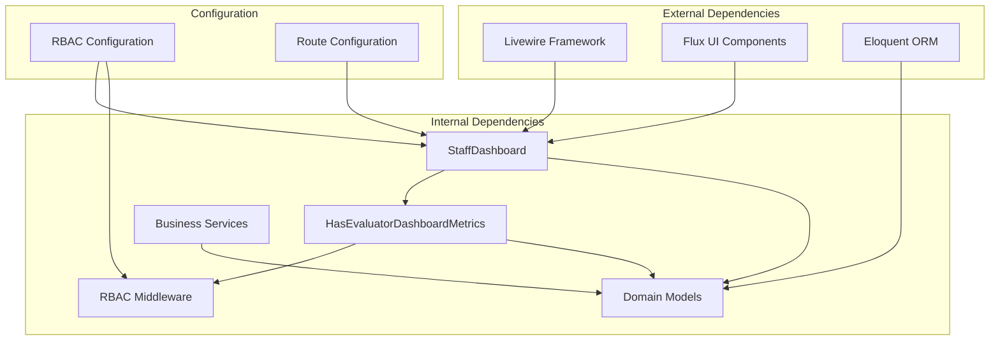

# Staff Dashboard

<cite>
**Referenced Files in This Document**
- [StaffDashboard.php](file://app/Livewire/Fill/StaffDashboard.php)
- [HasEvaluatorDashboardMetrics.php](file://app/Livewire/Fill/Concerns/HasEvaluatorDashboardMetrics.php)
- [staff-dashboard.blade.php](file://resources/views/livewire/fill/staff-dashboard.blade.php)
- [routes/web.php](file://routes/web.php)
- [rbac.php](file://config/rbac.php)
- [User.php](file://app/models/User.php)
- [Questionnaire.php](file://app/models/Questionnaire.php)
- [Response.php](file://app/models/Response.php)
- [Answer.php](file://app/models/Answer.php)
- [QuestionnaireTarget.php](file://app/models/QuestionnaireTarget.php)
- [AvailableQuestionnaires.php](file://app/Livewire/Fill/AvailableQuestionnaires.php)
- [QuestionnaireFill.php](file://app/Livewire/Fill/QuestionnaireFill.php)
- [DepartmentAnalyticsService.php](file://app/Services/DepartmentAnalyticsService.php)
- [Departement.php](file://app/models/Departement.php)
- [EnsureUserHasRole.php](file://app/Http/Middleware/EnsureUserHasRole.php)
- [EnsureUserIsEvaluator.php](file://app/Http/Middleware/EnsureUserIsEvaluator.php)
- [RedirectByRole.php](file://app/Http/Middleware/RedirectByRole.php)
- [evaluator.blade.php](file://resources/views/layouts/evaluator.blade.php)
</cite>

## Table of Contents
1. [Introduction](#introduction)
2. [Project Structure](#project-structure)
3. [Core Components](#core-components)
4. [Architecture Overview](#architecture-overview)
5. [Detailed Component Analysis](#detailed-component-analysis)
6. [Dependency Analysis](#dependency-analysis)
7. [Performance Considerations](#performance-considerations)
8. [Troubleshooting Guide](#troubleshooting-guide)
9. [Conclusion](#conclusion)

## Introduction
The Staff Dashboard is a Livewire-based interface designed for staff members (Tata Usaha) within the assessment platform. It provides a centralized view of available evaluations, submission tracking, and performance analytics tailored to staff users. The dashboard integrates with the organization's role-based access control (RBAC) system to ensure staff members only see assessments relevant to their role and department.

The dashboard displays three primary metrics: active questionnaires, available questionnaires for the staff role, and completed submissions. It also offers quick navigation to fill available questionnaires and review submission history.

## Project Structure
The Staff Dashboard system is organized around Livewire components, Blade templates, routing configuration, and supporting models/services. The structure emphasizes separation of concerns with dedicated components for dashboards, evaluation forms, and analytics.

**Diagram sources**
- [routes/web.php:149-160](file://routes/web.php#L149-L160)
- [rbac.php:12-16](file://rbac.php#L12-L16)
- [StaffDashboard.php:10-22](file://app/Livewire/Fill/StaffDashboard.php#L10-L22)
- [HasEvaluatorDashboardMetrics.php:9-72](file://app/Livewire/Fill/Concerns/HasEvaluatorDashboardMetrics.php#L9-L72)

**Section sources**
- [routes/web.php:149-160](file://routes/web.php#L149-L160)
- [rbac.php:12-16](file://rbac.php#L12-L16)

## Core Components
The Staff Dashboard system consists of several interconnected components that work together to provide a seamless assessment experience for staff members.

### StaffDashboard Component
The StaffDashboard component serves as the main entry point for staff members. It extends the evaluator layout and utilizes a metrics trait to fetch and display relevant data.

### Metrics Trait
The HasEvaluatorDashboardMetrics trait encapsulates the core logic for calculating dashboard metrics. It handles role-based filtering, questionnaire availability checks, and completion tracking.

### Evaluation Forms
The system includes two primary form components: AvailableQuestionnaires for browsing and starting new assessments, and QuestionnaireFill for completing individual assessments.

### Navigation and Layout
The evaluator layout provides consistent navigation across all staff-related pages, including quick links to dashboards, profile management, and logout functionality.

**Section sources**
- [StaffDashboard.php:10-22](file://app/Livewire/Fill/StaffDashboard.php#L10-L22)
- [HasEvaluatorDashboardMetrics.php:9-72](file://app/Livewire/Fill/Concerns/HasEvaluatorDashboardMetrics.php#L9-L72)
- [AvailableQuestionnaires.php:12-63](file://app/Livewire/Fill/AvailableQuestionnaires.php#L12-L63)
- [QuestionnaireFill.php:19-514](file://app/Livewire/Fill/QuestionnaireFill.php#L19-L514)

## Architecture Overview
The Staff Dashboard follows a layered architecture pattern with clear separation between presentation, business logic, and data access layers.

**Diagram sources**
- [StaffDashboard.php:14-21](file://app/Livewire/Fill/StaffDashboard.php#L14-L21)
- [HasEvaluatorDashboardMetrics.php:11-71](file://app/Livewire/Fill/Concerns/HasEvaluatorDashboardMetrics.php#L11-L71)
- [routes/web.php:150-154](file://routes/web.php#L150-L154)

The architecture ensures that staff members can quickly access their relevant assessments while maintaining proper role-based access control and data integrity.

**Section sources**
- [routes/web.php:149-160](file://routes/web.php#L149-L160)
- [evaluator.blade.php:26-76](file://resources/views/layouts/evaluator.blade.php#L26-L76)

## Detailed Component Analysis

### StaffDashboard Component Analysis
The StaffDashboard component is responsible for orchestrating the staff member's assessment interface. It leverages the RBAC configuration to determine the appropriate role slug and delegates metric calculation to the metrics trait.

**Diagram sources**
- [StaffDashboard.php:10-22](file://app/Livewire/Fill/StaffDashboard.php#L10-L22)
- [HasEvaluatorDashboardMetrics.php:9-72](file://app/Livewire/Fill/Concerns/HasEvaluatorDashboardMetrics.php#L9-L72)
- [User.php:59-87](file://app/models/User.php#L59-L87)

The component follows a clean separation of concerns by delegating data retrieval and processing to the metrics trait, while focusing on presentation logic and layout integration.

**Section sources**
- [StaffDashboard.php:10-22](file://app/Livewire/Fill/StaffDashboard.php#L10-L22)
- [HasEvaluatorDashboardMetrics.php:11-71](file://app/Livewire/Fill/Concerns/HasEvaluatorDashboardMetrics.php#L11-L71)

### Dashboard Metrics Calculation
The metrics calculation process involves complex queries that filter questionnaires based on role targeting, submission status, and temporal constraints.

**Diagram sources**
- [HasEvaluatorDashboardMetrics.php:11-71](file://app/Livewire/Fill/Concerns/HasEvaluatorDashboardMetrics.php#L11-L71)

The metric calculation considers multiple factors including questionnaire status, target group matching, and submission history to provide accurate dashboard statistics.

**Section sources**
- [HasEvaluatorDashboardMetrics.php:11-71](file://app/Livewire/Fill/Concerns/HasEvaluatorDashboardMetrics.php#L11-L71)

### Evaluation Form Workflow
The evaluation form workflow demonstrates a sophisticated multi-step process for completing assessments, including validation, autosaving, and final submission.

**Diagram sources**
- [QuestionnaireFill.php:44-122](file://app/Livewire/Fill/QuestionnaireFill.php#L44-L122)
- [QuestionnaireFill.php:193-245](file://app/Livewire/Fill/QuestionnaireFill.php#L193-L245)

The workflow ensures data integrity through transactional operations and provides immediate feedback through validation and autosave mechanisms.

**Section sources**
- [QuestionnaireFill.php:19-514](file://app/Livewire/Fill/QuestionnaireFill.php#L19-L514)

### Navigation and Role-Based Routing
The navigation system integrates with the RBAC configuration to provide role-appropriate dashboards and redirects.

**Diagram sources**
- [rbac.php:49-62](file://config/rbac.php#L49-L62)
- [routes/web.php:149-160](file://routes/web.php#L149-L160)
- [RedirectByRole.php:26-29](file://app/Http/Middleware/RedirectByRole.php#L26-L29)

The navigation system ensures that staff members are directed to the appropriate dashboard based on their role configuration.

**Section sources**
- [rbac.php:49-62](file://config/rbac.php#L49-L62)
- [routes/web.php:149-160](file://routes/web.php#L149-L160)
- [RedirectByRole.php:26-29](file://app/Http/Middleware/RedirectByRole.php#L26-L29)

## Dependency Analysis
The Staff Dashboard system exhibits well-structured dependencies that promote maintainability and testability.

**Diagram sources**
- [StaffDashboard.php:5-6](file://app/Livewire/Fill/StaffDashboard.php#L5-L6)
- [HasEvaluatorDashboardMetrics.php:5-7](file://app/Livewire/Fill/Concerns/HasEvaluatorDashboardMetrics.php#L5-L7)
- [rbac.php:1-64](file://config/rbac.php#L1-L64)

The dependency graph reveals a clean architecture where presentation components depend on business logic traits, which in turn depend on domain models and configuration. This structure facilitates unit testing and maintains loose coupling between components.

**Section sources**
- [StaffDashboard.php:5-6](file://app/Livewire/Fill/StaffDashboard.php#L5-L6)
- [HasEvaluatorDashboardMetrics.php:5-7](file://app/Livewire/Fill/Concerns/HasEvaluatorDashboardMetrics.php#L5-L7)
- [rbac.php:1-64](file://config/rbac.php#L1-L64)

## Performance Considerations
The Staff Dashboard system incorporates several performance optimization strategies:

### Query Optimization
- **Eager Loading**: The metrics trait uses `withCount('questions')` to prevent N+1 query problems when displaying questionnaire counts.
- **Conditional Queries**: Role-based filtering is applied at the database level using `whereHas` and `whereDoesntHave` constraints.
- **Pagination**: Analytics services utilize pagination for large datasets to prevent memory exhaustion.

### Caching Strategy
- **Short-term Caching**: Department analytics service implements 5-minute caching for role and user summaries to reduce database load.
- **Computed Properties**: Livewire components use computed properties to avoid redundant calculations during re-renders.

### Memory Management
- **Collection Processing**: Large result sets are processed using collections with lazy evaluation where appropriate.
- **Resource Cleanup**: Components properly manage their lifecycle to prevent memory leaks in long-running sessions.

## Troubleshooting Guide

### Common Issues and Solutions

#### Dashboard Shows No Available Questionnaires
**Symptoms**: Staff dashboard displays zero available questionnaires despite active assessments existing.
**Causes**: 
- Role slug mismatch in RBAC configuration
- Missing questionnaire target groups
- User department assignment issues

**Solutions**:
1. Verify role slug configuration in `config/rbac.php`
2. Check questionnaire target group assignments
3. Confirm user department and role associations

#### Access Denied Errors
**Symptoms**: Users receive access denied messages when navigating to assessment pages.
**Causes**:
- Missing evaluator role middleware
- Incorrect role slug configuration
- Session expiration issues

**Solutions**:
1. Ensure `EnsureUserIsEvaluator` middleware is applied to assessment routes
2. Verify role slugs match between RBAC configuration and user records
3. Check middleware aliases in RBAC configuration

#### Form Submission Failures
**Symptoms**: Assessment forms fail to submit or lose autosaved data.
**Causes**:
- Validation rule mismatches
- Database transaction failures
- Missing required answer options

**Solutions**:
1. Review validation rules in `QuestionnaireFill` component
2. Check database connection and transaction handling
3. Verify answer option configurations for required questions

**Section sources**
- [EnsureUserHasRole.php:11-25](file://app/Http/Middleware/EnsureUserHasRole.php#L11-L25)
- [EnsureUserIsEvaluator.php:12-21](file://app/Http/Middleware/EnsureUserIsEvaluator.php#L12-L21)
- [QuestionnaireFill.php:342-388](file://app/Livewire/Fill/QuestionnaireFill.php#L342-L388)

### Debugging Tools and Techniques
- **Role Verification**: Use `{{ auth()->user()->roleSlug() }}` in templates to confirm current user role
- **Metric Inspection**: Add temporary logging to `HasEvaluatorDashboardMetrics` to trace query execution
- **Route Testing**: Utilize Laravel's route inspector to verify middleware application
- **Database Queries**: Enable query logging to analyze performance bottlenecks

## Conclusion
The Staff Dashboard system provides a robust, role-aware assessment interface specifically designed for staff members within the educational institution. Its architecture emphasizes separation of concerns, maintainability, and performance optimization while ensuring strict adherence to organizational role-based access controls.

The system successfully balances functionality with simplicity, offering staff members a streamlined experience for discovering, completing, and tracking their assessment submissions. The integration with department analytics and the comprehensive middleware protection ensures both usability and security.

Key strengths of the implementation include:
- Clean separation between presentation and business logic
- Comprehensive role-based access control integration
- Efficient query optimization and caching strategies
- Robust error handling and validation mechanisms
- Extensible architecture supporting future enhancements

The Staff Dashboard represents a well-engineered solution that effectively addresses the needs of staff assessment participation while maintaining the system's overall reliability and performance standards.