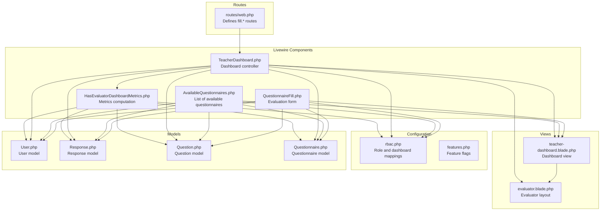
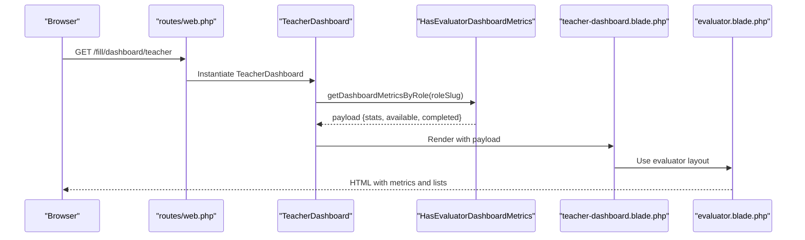
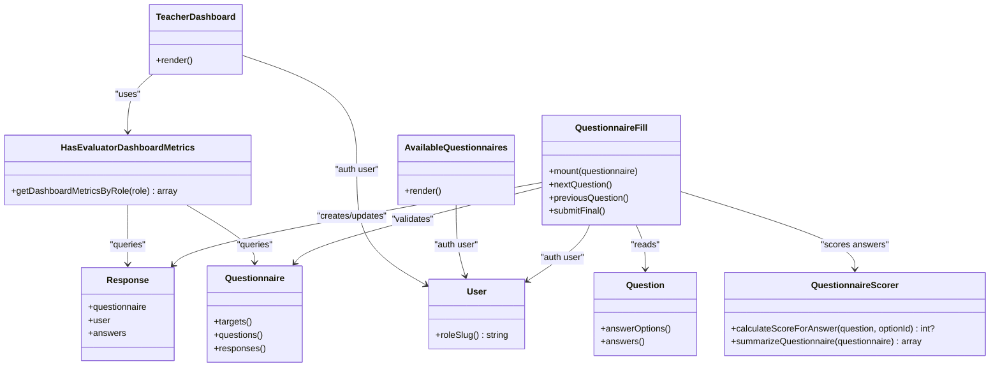

# Teacher Dashboard

<cite>
**Referenced Files in This Document**
- [TeacherDashboard.php](file://app/Livewire/Fill/TeacherDashboard.php)
- [teacher-dashboard.blade.php](file://resources/views/livewire/fill/teacher-dashboard.blade.php)
- [HasEvaluatorDashboardMetrics.php](file://app/Livewire/Fill/Concerns/HasEvaluatorDashboardMetrics.php)
- [AvailableQuestionnaires.php](file://app/Livewire/Fill/AvailableQuestionnaires.php)
- [QuestionnaireFill.php](file://app/Livewire/Fill/QuestionnaireFill.php)
- [web.php](file://routes/web.php)
- [rbac.php](file://config/rbac.php)
- [evaluator.blade.php](file://resources/views/layouts/evaluator.blade.php)
- [Questionnaire.php](file://app/Models/Questionnaire.php)
- [Response.php](file://app/Models/Response.php)
- [User.php](file://app/Models/User.php)
- [Question.php](file://app/Models/Question.php)
- [QuestionnaireScorer.php](file://app/Services/QuestionnaireScorer.php)
- [features.php](file://config/features.php)
</cite>

## Table of Contents
1. [Introduction](#introduction)
2. [Project Structure](#project-structure)
3. [Core Components](#core-components)
4. [Architecture Overview](#architecture-overview)
5. [Detailed Component Analysis](#detailed-component-analysis)
6. [Dependency Analysis](#dependency-analysis)
7. [Performance Considerations](#performance-considerations)
8. [Troubleshooting Guide](#troubleshooting-guide)
9. [Conclusion](#conclusion)

## Introduction
This document describes the Teacher Dashboard interface for the assessment application. It explains how teachers evaluate questionnaires, how available questionnaires are presented, how submissions are tracked, and how performance metrics are computed and displayed. It also documents the dashboard widgets for pending evaluations, completed assessments, and submission status indicators, along with navigation patterns to evaluation forms, results viewing, and managing teaching-related assessments. Finally, it covers teacher-specific analytics, response history, and integration with the questionnaire assignment system.

## Project Structure
The Teacher Dashboard is implemented as a Livewire component rendered inside the evaluator layout. It leverages a shared metrics trait to compute dashboard statistics and integrates with routing, configuration, and models to present available questionnaires, submission history, and evaluation workflows.

**Diagram sources**
- [web.php:149-160](file://routes/web.php#L149-L160)
- [TeacherDashboard.php:10-22](file://app/Livewire/Fill/TeacherDashboard.php#L10-L22)
- [HasEvaluatorDashboardMetrics.php:11-71](file://app/Livewire/Fill/Concerns/HasEvaluatorDashboardMetrics.php#L11-L71)
- [AvailableQuestionnaires.php:12-62](file://app/Livewire/Fill/AvailableQuestionnaires.php#L12-L62)
- [QuestionnaireFill.php:18-514](file://app/Livewire/Fill/QuestionnaireFill.php#L18-L514)
- [teacher-dashboard.blade.php:1-55](file://resources/views/livewire/fill/teacher-dashboard.blade.php#L1-L55)
- [evaluator.blade.php:19-71](file://resources/views/layouts/evaluator.blade.php#L19-L71)
- [rbac.php:12-62](file://config/rbac.php#L12-L62)
- [features.php:3-6](file://config/features.php#L3-L6)
- [User.php:59-62](file://app/Models/User.php#L59-L62)
- [Response.php:16-25](file://app/Models/Response.php#L16-L25)
- [Question.php:16-26](file://app/Models/Question.php#L16-L26)
- [Questionnaire.php:18-30](file://app/Models/Questionnaire.php#L18-L30)

**Section sources**
- [web.php:149-160](file://routes/web.php#L149-L160)
- [TeacherDashboard.php:10-22](file://app/Livewire/Fill/TeacherDashboard.php#L10-L22)
- [HasEvaluatorDashboardMetrics.php:11-71](file://app/Livewire/Fill/Concerns/HasEvaluatorDashboardMetrics.php#L11-L71)
- [teacher-dashboard.blade.php:1-55](file://resources/views/livewire/fill/teacher-dashboard.blade.php#L1-L55)
- [evaluator.blade.php:19-71](file://resources/views/layouts/evaluator.blade.php#L19-L71)
- [rbac.php:12-62](file://config/rbac.php#L12-L62)

## Core Components
- TeacherDashboard: The dashboard controller that renders the teacher view and injects metrics computed via a shared trait.
- HasEvaluatorDashboardMetrics: A trait that computes dashboard metrics for any evaluator role, including active questionnaires count, available-to-fill count, completed total, available questionnaires list, and completed responses list.
- teacher-dashboard.blade.php: The dashboard view displaying three summary cards and two lists: available questionnaires and submission history.
- AvailableQuestionnaires: Lists active questionnaires targeted to the current role (including aliases) and shows draft/submitted history.
- QuestionnaireFill: The evaluation form component handling navigation, autosave, validation, and submission of responses.
- evaluator.blade.php: The evaluator layout providing global navigation and theme controls.
- Routing under fill/*: Routes for dashboard and questionnaire filling.
- Configuration: rbac.php defines role slugs, dashboard paths, and target aliases; features.php enables single-question mode.

**Section sources**
- [TeacherDashboard.php:10-22](file://app/Livewire/Fill/TeacherDashboard.php#L10-L22)
- [HasEvaluatorDashboardMetrics.php:11-71](file://app/Livewire/Fill/Concerns/HasEvaluatorDashboardMetrics.php#L11-L71)
- [teacher-dashboard.blade.php:1-55](file://resources/views/livewire/fill/teacher-dashboard.blade.php#L1-L55)
- [AvailableQuestionnaires.php:12-62](file://app/Livewire/Fill/AvailableQuestionnaires.php#L12-L62)
- [QuestionnaireFill.php:18-514](file://app/Livewire/Fill/QuestionnaireFill.php#L18-L514)
- [evaluator.blade.php:19-71](file://resources/views/layouts/evaluator.blade.php#L19-L71)
- [web.php:149-160](file://routes/web.php#L149-L160)
- [rbac.php:12-62](file://config/rbac.php#L12-L62)
- [features.php:3-6](file://config/features.php#L3-L6)

## Architecture Overview
The Teacher Dashboard follows a layered pattern:
- Presentation: Blade views render metrics and lists.
- Behavior: Livewire components encapsulate interactivity and state.
- Data: Eloquent models and relationships connect users, questionnaires, responses, and answers.
- Configuration: RBAC maps roles to dashboards and questionnaire targets; feature flags adjust behavior.

**Diagram sources**
- [web.php:150-151](file://routes/web.php#L150-L151)
- [TeacherDashboard.php:14-21](file://app/Livewire/Fill/TeacherDashboard.php#L14-L21)
- [HasEvaluatorDashboardMetrics.php:11-71](file://app/Livewire/Fill/Concerns/HasEvaluatorDashboardMetrics.php#L11-L71)
- [teacher-dashboard.blade.php:1-55](file://resources/views/livewire/fill/teacher-dashboard.blade.php#L1-L55)
- [evaluator.blade.php:19-71](file://resources/views/layouts/evaluator.blade.php#L19-L71)

## Detailed Component Analysis

### TeacherDashboard
Responsibilities:
- Determines the teacher role slug from configuration.
- Computes dashboard metrics using the shared trait.
- Renders the teacher dashboard view with the computed payload.

Key behaviors:
- Uses the evaluator layout for consistent navigation and theming.
- Delegates metric computation to the trait to ensure reuse across evaluator dashboards.

**Section sources**
- [TeacherDashboard.php:10-22](file://app/Livewire/Fill/TeacherDashboard.php#L10-L22)
- [rbac.php:12-16](file://config/rbac.php#L12-L16)

### HasEvaluatorDashboardMetrics
Responsibilities:
- Builds target groups from the user’s role and configured aliases.
- Queries active questionnaires assigned to those target groups and filters out those already submitted by the user.
- Aggregates counts for active questionnaires, available-to-fill, and completed submissions.
- Returns structured payload consumed by the dashboard view.

Important logic:
- Target groups include the role slug and its alias if configured.
- Available questionnaires exclude those already submitted by the user.
- Completed responses are filtered by target groups and ordered by submission date.

**Section sources**
- [HasEvaluatorDashboardMetrics.php:11-71](file://app/Livewire/Fill/Concerns/HasEvaluatorDashboardMetrics.php#L11-L71)
- [rbac.php:7-11](file://config/rbac.php#L7-L11)

### teacher-dashboard.blade.php
Widgets and sections:
- Summary cards:
  - Active questionnaires
  - Available to fill
  - Completed total
- Available questionnaires list:
  - Title and question count per questionnaire
  - “Fill” button linking to the questionnaire show route
- Submission history:
  - List of submitted responses with questionnaire title and submission timestamp

Navigation:
- Links to Kuisioner Saya (My Questionnaires), History, Profile, and Logout via the evaluator layout.

**Section sources**
- [teacher-dashboard.blade.php:7-55](file://resources/views/livewire/fill/teacher-dashboard.blade.php#L7-L55)
- [evaluator.blade.php:42-66](file://resources/views/layouts/evaluator.blade.php#L42-L66)

### AvailableQuestionnaires
Responsibilities:
- Lists active questionnaires targeting the current role (including aliases).
- Prevents duplicate submissions by excluding questionnaires already submitted by the user.
- Provides draft and submitted history for the current role and target groups.

Data retrieval:
- Uses withCount and with relations to enrich questionnaire listings.
- Draft and submitted histories are fetched separately for quick access.

**Section sources**
- [AvailableQuestionnaires.php:12-62](file://app/Livewire/Fill/AvailableQuestionnaires.php#L12-L62)
- [rbac.php:7-11](file://config/rbac.php#L7-L11)

### QuestionnaireFill
Responsibilities:
- Validates access by role and active status.
- Prevents multiple submissions for the same questionnaire.
- Manages response lifecycle: draft creation, autosave, navigation, and final submission.
- Calculates scores for answers using the scoring service.

Workflow highlights:
- Mount initializes questions, response, and answers state.
- Navigation methods move between questions and trigger autosave.
- Submit confirmation validates required questions before finalizing submission.
- Final submission persists answers and marks the response as submitted.

Submission tracking:
- Response status transitions from draft to submitted.
- Submitted timestamp is recorded upon successful submission.

**Section sources**
- [QuestionnaireFill.php:44-122](file://app/Livewire/Fill/QuestionnaireFill.php#L44-L122)
- [QuestionnaireFill.php:172-245](file://app/Livewire/Fill/QuestionnaireFill.php#L172-L245)
- [QuestionnaireFill.php:500-513](file://app/Livewire/Fill/QuestionnaireFill.php#L500-L513)
- [QuestionnaireScorer.php:14-23](file://app/Services/QuestionnaireScorer.php#L14-L23)

### Navigation Patterns
- Dashboard access:
  - Route: GET /fill/dashboard/teacher
  - Controller: TeacherDashboard
- Accessing evaluation forms:
  - From dashboard: Click “Fill” on an available questionnaire row.
  - From layout: “Kuisioner Saya” navigates to the available questionnaires list.
- Viewing results:
  - From layout: “Riwayat Pengisian” navigates to the teacher dashboard, which displays completed submissions.
- Managing assessments:
  - Teachers can review available questionnaires and submission history from the dashboard.

Routing and layout:
- Routes are defined under fill.* namespace.
- Evaluator layout provides consistent navigation and actions.

**Section sources**
- [web.php:149-160](file://routes/web.php#L149-L160)
- [teacher-dashboard.blade.php:31-33](file://resources/views/livewire/fill/teacher-dashboard.blade.php#L31-L33)
- [evaluator.blade.php:42-48](file://resources/views/layouts/evaluator.blade.php#L42-L48)

### Performance Metrics and Analytics
- Dashboard metrics:
  - Active questionnaires count
  - Available-to-fill count
  - Completed total
- Teacher-specific analytics:
  - The scoring service computes averages, distributions, and breakdowns for submitted responses.
  - These analytics are suitable for administrators and evaluators but are surfaced in the teacher dashboard primarily through submission history and available questionnaire counts.

Note: The teacher dashboard focuses on actionable metrics for the teacher (counts and lists). Detailed analytics are computed by the scoring service and intended for administrative reporting.

**Section sources**
- [HasEvaluatorDashboardMetrics.php:62-70](file://app/Livewire/Fill/Concerns/HasEvaluatorDashboardMetrics.php#L62-L70)
- [QuestionnaireScorer.php:33-112](file://app/Services/QuestionnaireScorer.php#L33-L112)

### Integration with Questionnaire Assignment System
- Target groups:
  - Derived from the user’s role slug and configured aliases.
- Assignment filtering:
  - Available questionnaires are filtered by status and target groups.
  - Already submitted questionnaires are excluded from availability.
- Submission tracking:
  - Responses record submission status and timestamps.
  - Completed submissions are listed on the dashboard.

**Section sources**
- [HasEvaluatorDashboardMetrics.php:26-34](file://app/Livewire/Fill/Concerns/HasEvaluatorDashboardMetrics.php#L26-L34)
- [HasEvaluatorDashboardMetrics.php:36-55](file://app/Livewire/Fill/Concerns/HasEvaluatorDashboardMetrics.php#L36-L55)
- [rbac.php:7-11](file://config/rbac.php#L7-L11)
- [Response.php:16-25](file://app/Models/Response.php#L16-L25)

## Dependency Analysis
The dashboard depends on configuration-driven role mappings and models representing the assessment domain. The following diagram shows key dependencies among components and models.

**Diagram sources**
- [TeacherDashboard.php:10-22](file://app/Livewire/Fill/TeacherDashboard.php#L10-L22)
- [HasEvaluatorDashboardMetrics.php:11-71](file://app/Livewire/Fill/Concerns/HasEvaluatorDashboardMetrics.php#L11-L71)
- [AvailableQuestionnaires.php:12-62](file://app/Livewire/Fill/AvailableQuestionnaires.php#L12-L62)
- [QuestionnaireFill.php:18-514](file://app/Livewire/Fill/QuestionnaireFill.php#L18-L514)
- [User.php:59-62](file://app/Models/User.php#L59-L62)
- [Response.php:27-40](file://app/Models/Response.php#L27-L40)
- [Questionnaire.php:37-50](file://app/Models/Questionnaire.php#L37-L50)
- [Question.php:28-41](file://app/Models/Question.php#L28-L41)
- [QuestionnaireScorer.php:14-112](file://app/Services/QuestionnaireScorer.php#L14-L112)

**Section sources**
- [TeacherDashboard.php:10-22](file://app/Livewire/Fill/TeacherDashboard.php#L10-L22)
- [HasEvaluatorDashboardMetrics.php:11-71](file://app/Livewire/Fill/Concerns/HasEvaluatorDashboardMetrics.php#L11-L71)
- [AvailableQuestionnaires.php:12-62](file://app/Livewire/Fill/AvailableQuestionnaires.php#L12-L62)
- [QuestionnaireFill.php:18-514](file://app/Livewire/Fill/QuestionnaireFill.php#L18-L514)
- [User.php:59-62](file://app/Models/User.php#L59-L62)
- [Response.php:27-40](file://app/Models/Response.php#L27-L40)
- [Questionnaire.php:37-50](file://app/Models/Questionnaire.php#L37-L50)
- [Question.php:28-41](file://app/Models/Question.php#L28-L41)
- [QuestionnaireScorer.php:14-112](file://app/Services/QuestionnaireScorer.php#L14-L112)

## Performance Considerations
- Efficient queries:
  - The metrics trait and available questionnaires component use eager loading (withCount, with) to minimize N+1 queries.
- Filtering by target groups:
  - Target group resolution avoids unnecessary joins by combining role slug and aliases.
- Autosave and navigation:
  - Autosave is triggered on navigation to reduce server load and improve UX.
- Single-question mode:
  - Feature flag allows rendering a single question per page, reducing DOM and processing overhead.

Recommendations:
- Indexes on frequently filtered columns (status, target_group, user_id) can further improve query performance.
- Pagination for long lists of completed responses if needed.

**Section sources**
- [HasEvaluatorDashboardMetrics.php:36-47](file://app/Livewire/Fill/Concerns/HasEvaluatorDashboardMetrics.php#L36-L47)
- [AvailableQuestionnaires.php:24-39](file://app/Livewire/Fill/AvailableQuestionnaires.php#L24-L39)
- [QuestionnaireFill.php:156-159](file://app/Livewire/Fill/QuestionnaireFill.php#L156-L159)
- [features.php:3-6](file://config/features.php#L3-L6)

## Troubleshooting Guide
Common issues and resolutions:
- Access denied when opening a questionnaire:
  - The component checks authentication, active status, and role targeting. Ensure the user is logged in, the questionnaire is active, and the user’s role matches the questionnaire’s target groups.
- Duplicate submission prevention:
  - If a user attempts to re-open a questionnaire they already submitted, they are redirected to the index with an error message.
- Validation errors during submission:
  - Required questions and specific types (single choice, essay, combined) enforce validation rules. The component scrolls to the first invalid question after validation failure.
- Autosave behavior:
  - Autosave triggers on navigation; ensure navigation events are firing to persist drafts.

**Section sources**
- [QuestionnaireFill.php:49-79](file://app/Livewire/Fill/QuestionnaireFill.php#L49-L79)
- [QuestionnaireFill.php:172-186](file://app/Livewire/Fill/QuestionnaireFill.php#L172-L186)
- [QuestionnaireFill.php:342-388](file://app/Livewire/Fill/QuestionnaireFill.php#L342-L388)
- [QuestionnaireFill.php:408-470](file://app/Livewire/Fill/QuestionnaireFill.php#L408-L470)

## Conclusion
The Teacher Dashboard provides a focused, role-aware interface for teachers to discover and complete assessments, track submissions, and manage their evaluation workflow. Its design leverages shared metrics logic, robust routing, and a clean separation of concerns across Livewire components, Blade views, and configuration-driven role mappings. The integration with the questionnaire assignment system ensures that only appropriate assessments are presented, while submission tracking and optional single-question mode enhance usability.