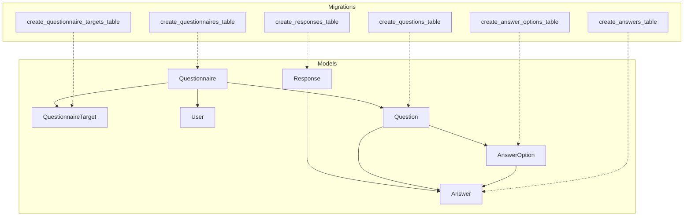
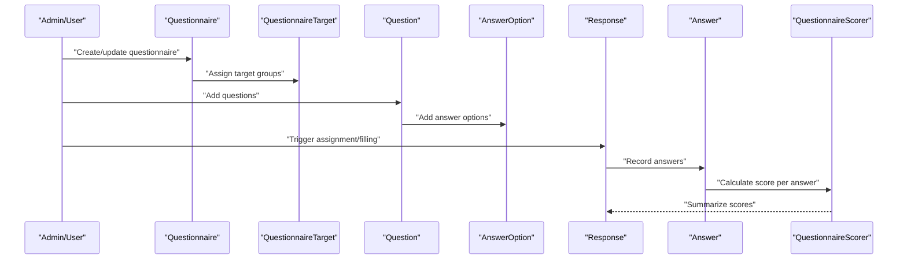
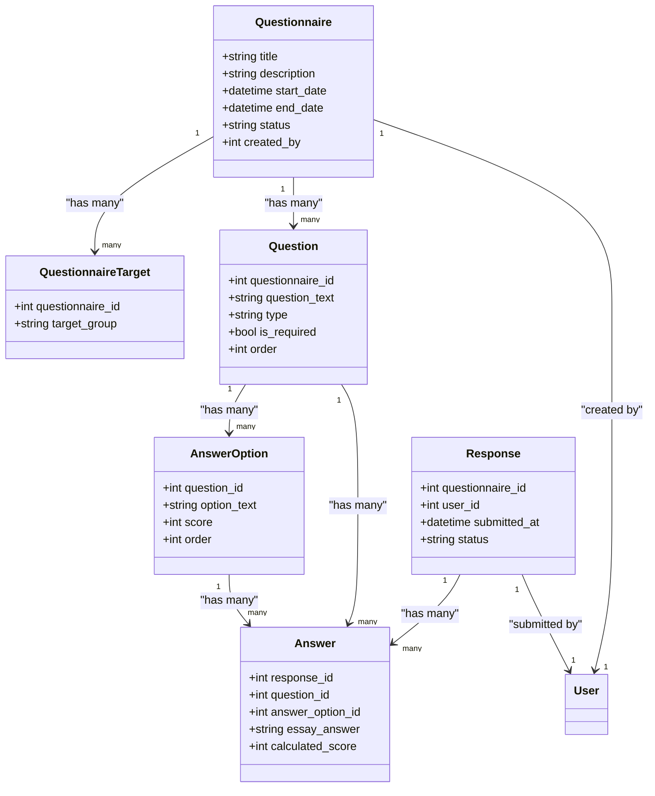
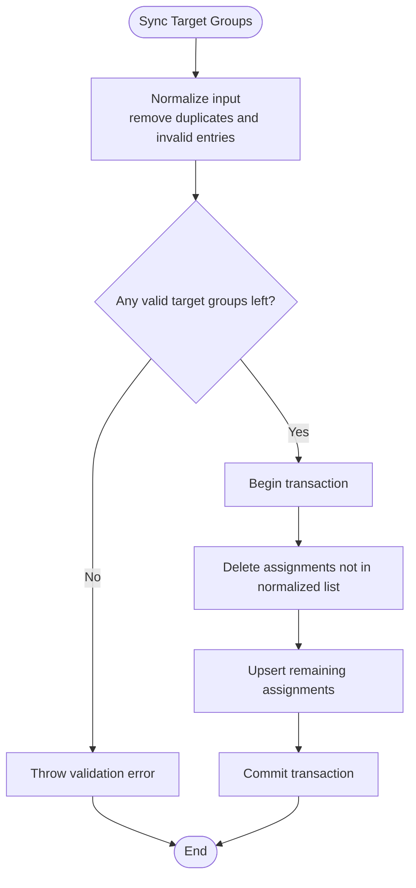
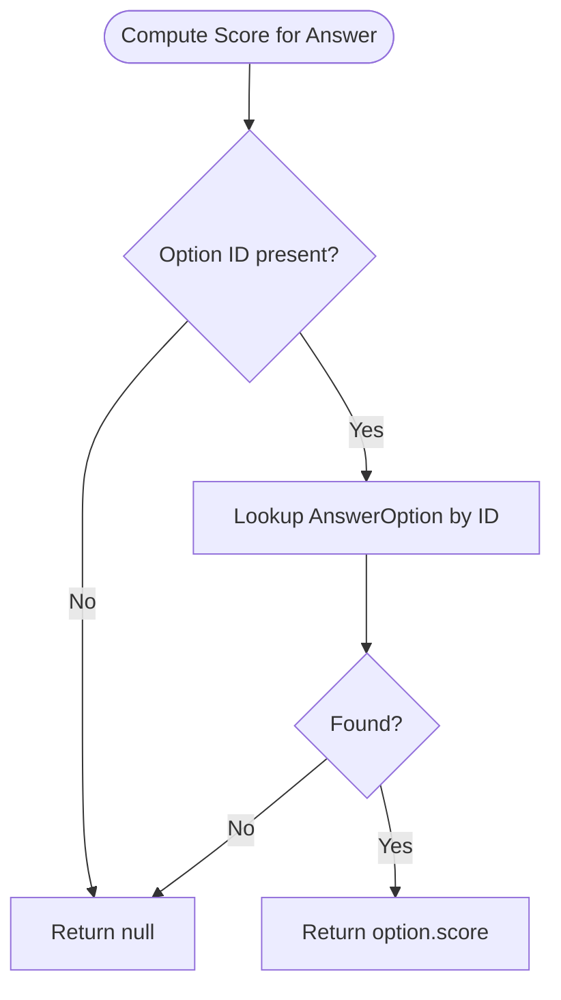
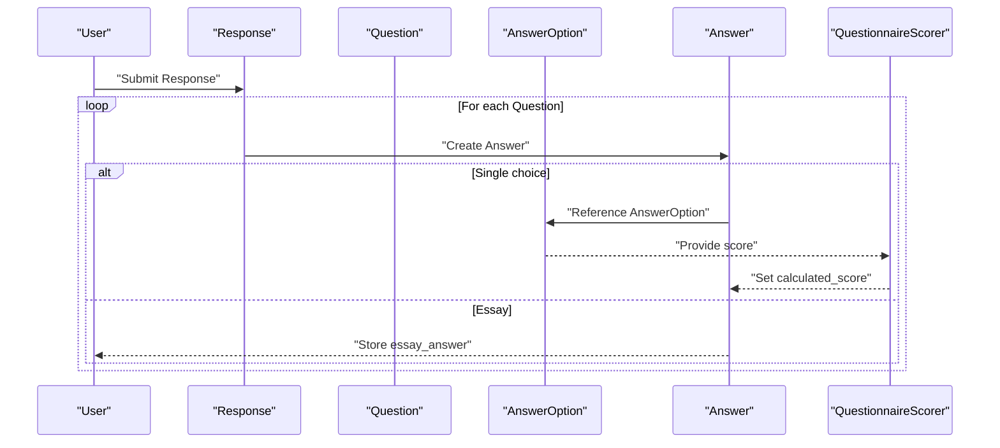
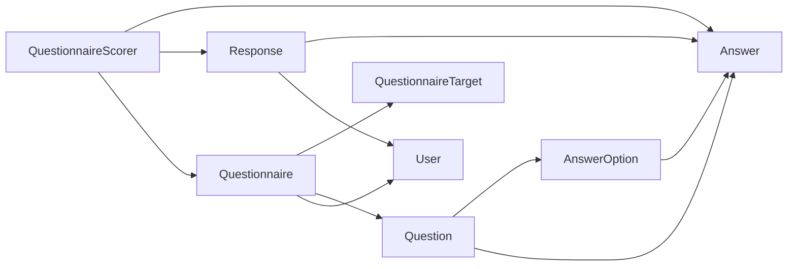
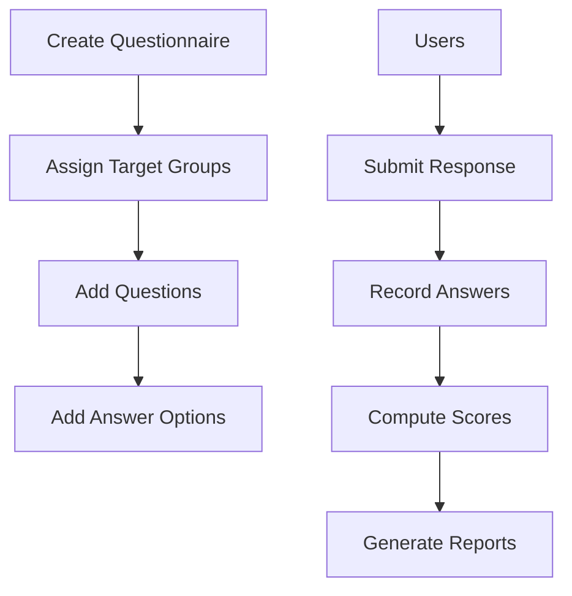

# Assessment Entities

<cite>
**Referenced Files in This Document**
- [Questionnaire.php](file://app/Models/Questionnaire.php)
- [Question.php](file://app/Models/Question.php)
- [AnswerOption.php](file://app/Models/AnswerOption.php)
- [Response.php](file://app/Models/Response.php)
- [Answer.php](file://app/Models/Answer.php)
- [QuestionnaireTarget.php](file://app/Models/QuestionnaireTarget.php)
- [QuestionnaireScorer.php](file://app/Services/QuestionnaireScorer.php)
- [2026_04_16_010239_create_questionnaires_table.php](file://database/migrations/2026_04_16_010239_create_questionnaires_table.php)
- [2026_04_16_010241_create_questions_table.php](file://database/migrations/2026_04_16_010241_create_questions_table.php)
- [2026_04_16_010242_create_answer_options_table.php](file://database/migrations/2026_04_16_010242_create_answer_options_table.php)
- [2026_04_16_020000_create_responses_table.php](file://database/migrations/2026_04_16_020000_create_responses_table.php)
- [2026_04_16_020100_create_answers_table.php](file://database/migrations/2026_04_16_020100_create_answers_table.php)
- [2026_04_16_010240_create_questionnaire_targets_table.php](file://database/migrations/2026_04_16_010240_create_questionnaire_targets_table.php)
- [StoreQuestionnaireRequest.php](file://app/Http/Requests/StoreQuestionnaireRequest.php)
- [StoreQuestionRequest.php](file://app/Http/Requests/StoreQuestionRequest.php)
</cite>

## Table of Contents
1. [Introduction](#introduction)
2. [Project Structure](#project-structure)
3. [Core Components](#core-components)
4. [Architecture Overview](#architecture-overview)
5. [Detailed Component Analysis](#detailed-component-analysis)
6. [Dependency Analysis](#dependency-analysis)
7. [Performance Considerations](#performance-considerations)
8. [Troubleshooting Guide](#troubleshooting-guide)
9. [Conclusion](#conclusion)
10. [Appendices](#appendices)

## Introduction
This document describes the assessment-related data model and workflow in the system. It focuses on the entities Questionnaire, Question, AnswerOption, Response, Answer, and QuestionnaireTarget, and explains how they relate to each other. It also documents the questionnaire-target assignment mechanism, the scoring logic, and the end-to-end assessment data flow from creation to submission and scoring.

## Project Structure
The assessment domain is implemented using Laravel Eloquent models and migrations. The relevant models and their relationships are defined under app/Models, and the database schema is defined under database/migrations. Scoring and analytics are encapsulated in a dedicated service under app/Services.

**Diagram sources**
- [Questionnaire.php:13-50](file://app/Models/Questionnaire.php#L13-L50)
- [QuestionnaireTarget.php:9-23](file://app/Models/QuestionnaireTarget.php#L9-L23)
- [Question.php:11-42](file://app/Models/Question.php#L11-L42)
- [AnswerOption.php:10-37](file://app/Models/AnswerOption.php#L10-L37)
- [Response.php:11-41](file://app/Models/Response.php#L11-L41)
- [Answer.php:10-43](file://app/Models/Answer.php#L10-L43)
- [2026_04_16_010239_create_questionnaires_table.php:11-21](file://database/migrations/2026_04_16_010239_create_questionnaires_table.php#L11-L21)
- [2026_04_16_010240_create_questionnaire_targets_table.php:11-18](file://database/migrations/2026_04_16_010240_create_questionnaire_targets_table.php#L11-L18)
- [2026_04_16_010241_create_questions_table.php:11-22](file://database/migrations/2026_04_16_010241_create_questions_table.php#L11-L22)
- [2026_04_16_010242_create_answer_options_table.php:11-20](file://database/migrations/2026_04_16_010242_create_answer_options_table.php#L11-L20)
- [2026_04_16_020000_create_responses_table.php:10-22](file://database/migrations/2026_04_16_020000_create_responses_table.php#L10-L22)
- [2026_04_16_020100_create_answers_table.php:10-22](file://database/migrations/2026_04_16_020100_create_answers_table.php#L10-L22)

**Section sources**
- [Questionnaire.php:13-50](file://app/Models/Questionnaire.php#L13-L50)
- [Question.php:11-42](file://app/Models/Question.php#L11-L42)
- [AnswerOption.php:10-37](file://app/Models/AnswerOption.php#L10-L37)
- [Response.php:11-41](file://app/Models/Response.php#L11-L41)
- [Answer.php:10-43](file://app/Models/Answer.php#L10-L43)
- [QuestionnaireTarget.php:9-23](file://app/Models/QuestionnaireTarget.php#L9-L23)
- [2026_04_16_010239_create_questionnaires_table.php:11-21](file://database/migrations/2026_04_16_010239_create_questionnaires_table.php#L11-L21)
- [2026_04_16_010240_create_questionnaire_targets_table.php:11-18](file://database/migrations/2026_04_16_010240_create_questionnaire_targets_table.php#L11-L18)
- [2026_04_16_010241_create_questions_table.php:11-22](file://database/migrations/2026_04_16_010241_create_questions_table.php#L11-L22)
- [2026_04_16_010242_create_answer_options_table.php:11-20](file://database/migrations/2026_04_16_010242_create_answer_options_table.php#L11-L20)
- [2026_04_16_020000_create_responses_table.php:10-22](file://database/migrations/2026_04_16_020000_create_responses_table.php#L10-L22)
- [2026_04_16_020100_create_answers_table.php:10-22](file://database/migrations/2026_04_16_020100_create_answers_table.php#L10-L22)

## Core Components
This section defines each entity’s purpose, fields, relationships, and constraints.

- Questionnaire
  - Purpose: Defines an assessment form with metadata, lifecycle, and target groups.
  - Key fields: title, description, start_date, end_date, status, created_by.
  - Relationships: belongsTo User (creator), hasMany QuestionnaireTarget, hasMany Question, hasMany Response.
  - Business constraints:
    - Status must be draft, active, or closed.
    - Target groups must be validated against configured role slugs.
  - Validation rules: enforced via StoreQuestionnaireRequest.

- QuestionnaireTarget
  - Purpose: Associates a questionnaire with a target group (role slug).
  - Key fields: questionnaire_id, target_group.
  - Constraints: unique(target_group) per questionnaire.

- Question
  - Purpose: Represents a single item in a questionnaire.
  - Key fields: questionnaire_id, question_text, type, is_required, order.
  - Relationships: belongsTo Questionnaire, hasMany AnswerOption, hasMany Answer.
  - Constraints: unique(order) per questionnaire.

- AnswerOption
  - Purpose: Provides choices for a question with optional scores.
  - Key fields: question_id, option_text, score, order.
  - Relationships: belongsTo Question, hasMany Answer.
  - Constraints: unique(order) per question.

- Response
  - Purpose: Represents a single submission of a questionnaire by a user.
  - Key fields: questionnaire_id, user_id, submitted_at, status.
  - Relationships: belongsTo Questionnaire, belongsTo User, hasMany Answer.
  - Constraints: unique(questionnaire_id, user_id); status draft/submitted.

- Answer
  - Purpose: Stores the user’s response to a specific question within a submission.
  - Key fields: response_id, question_id, answer_option_id, essay_answer, calculated_score.
  - Relationships: belongsTo Response, belongsTo Question, belongsTo AnswerOption.
  - Constraints: unique(response_id, question_id).

**Section sources**
- [Questionnaire.php:18-50](file://app/Models/Questionnaire.php#L18-L50)
- [QuestionnaireTarget.php:14-22](file://app/Models/QuestionnaireTarget.php#L14-L22)
- [Question.php:16-41](file://app/Models/Question.php#L16-L41)
- [AnswerOption.php:15-36](file://app/Models/AnswerOption.php#L15-L36)
- [Response.php:16-40](file://app/Models/Response.php#L16-L40)
- [Answer.php:15-42](file://app/Models/Answer.php#L15-L42)
- [2026_04_16_010239_create_questionnaires_table.php:11-21](file://database/migrations/2026_04_16_010239_create_questionnaires_table.php#L11-L21)
- [2026_04_16_010240_create_questionnaire_targets_table.php:11-18](file://database/migrations/2026_04_16_010240_create_questionnaire_targets_table.php#L11-L18)
- [2026_04_16_010241_create_questions_table.php:11-22](file://database/migrations/2026_04_16_010241_create_questions_table.php#L11-L22)
- [2026_04_16_010242_create_answer_options_table.php:11-20](file://database/migrations/2026_04_16_010242_create_answer_options_table.php#L11-L20)
- [2026_04_16_020000_create_responses_table.php:10-22](file://database/migrations/2026_04_16_020000_create_responses_table.php#L10-L22)
- [2026_04_16_020100_create_answers_table.php:10-22](file://database/migrations/2026_04_16_020100_create_answers_table.php#L10-L22)

## Architecture Overview
The assessment workflow spans creation, assignment, filling, and scoring. The following diagram maps the end-to-end flow across models and the scoring service.

**Diagram sources**
- [Questionnaire.php:37-50](file://app/Models/Questionnaire.php#L37-L50)
- [QuestionnaireTarget.php:19-22](file://app/Models/QuestionnaireTarget.php#L19-L22)
- [Question.php:33-41](file://app/Models/Question.php#L33-L41)
- [AnswerOption.php:23-36](file://app/Models/AnswerOption.php#L23-L36)
- [Response.php:37-40](file://app/Models/Response.php#L37-L40)
- [Answer.php:24-42](file://app/Models/Answer.php#L24-L42)
- [QuestionnaireScorer.php:14-23](file://app/Services/QuestionnaireScorer.php#L14-L23)

## Detailed Component Analysis

### Data Model Class Diagram
This diagram shows the core assessment entities and their relationships.

**Diagram sources**
- [Questionnaire.php:18-50](file://app/Models/Questionnaire.php#L18-L50)
- [QuestionnaireTarget.php:14-22](file://app/Models/QuestionnaireTarget.php#L14-L22)
- [Question.php:16-41](file://app/Models/Question.php#L16-L41)
- [AnswerOption.php:15-36](file://app/Models/AnswerOption.php#L15-L36)
- [Response.php:16-40](file://app/Models/Response.php#L16-L40)
- [Answer.php:15-42](file://app/Models/Answer.php#L15-L42)

### Questionnaire-Target Assignment Mechanism
- Target groups are derived from role slugs or a configuration fallback.
- The synchronization method ensures only the provided target groups remain for a questionnaire, deleting orphaned assignments and creating/updating existing ones.
- Validation enforces at least one target group and accepts only known slugs.

**Diagram sources**
- [Questionnaire.php:55-83](file://app/Models/Questionnaire.php#L55-L83)

**Section sources**
- [Questionnaire.php:55-108](file://app/Models/Questionnaire.php#L55-L108)
- [StoreQuestionnaireRequest.php:28-38](file://app/Http/Requests/StoreQuestionnaireRequest.php#L28-L38)

### Scoring Logic and Calculation
- Per-answer score retrieval: For a given question and selected option ID, the score is taken from the matching AnswerOption.
- Summarization: The service computes overall averages, per-group averages, question-level averages, and distribution percentages across options.

**Diagram sources**
- [QuestionnaireScorer.php:14-23](file://app/Services/QuestionnaireScorer.php#L14-L23)

**Section sources**
- [QuestionnaireScorer.php:14-137](file://app/Services/QuestionnaireScorer.php#L14-L137)

### Response Collection Process
- A Response is created per-user per-questionnaire.
- Each Answer corresponds to a question within that Response and may reference an AnswerOption or capture an essay answer.
- Calculated scores are stored per Answer after evaluation.

**Diagram sources**
- [Response.php:37-40](file://app/Models/Response.php#L37-L40)
- [Answer.php:24-42](file://app/Models/Answer.php#L24-L42)
- [AnswerOption.php:23-36](file://app/Models/AnswerOption.php#L23-L36)
- [QuestionnaireScorer.php:14-23](file://app/Services/QuestionnaireScorer.php#L14-L23)

**Section sources**
- [Response.php:16-40](file://app/Models/Response.php#L16-L40)
- [Answer.php:15-42](file://app/Models/Answer.php#L15-L42)
- [AnswerOption.php:15-36](file://app/Models/AnswerOption.php#L15-L36)

### Validation Rules and Business Constraints
- Questionnaire creation/update:
  - Title, description, dates, status, and target_groups are validated.
  - Target groups must be non-empty and match allowed slugs.
- Question creation/update:
  - Question text, type, requirement flag, and options are validated.
  - Options support id, option_text, and score.

**Section sources**
- [StoreQuestionnaireRequest.php:28-38](file://app/Http/Requests/StoreQuestionnaireRequest.php#L28-L38)
- [StoreQuestionRequest.php:34-44](file://app/Http/Requests/StoreQuestionRequest.php#L34-L44)

## Dependency Analysis
The following diagram highlights the primary dependencies among models and the scoring service.

**Diagram sources**
- [Questionnaire.php:32-50](file://app/Models/Questionnaire.php#L32-L50)
- [QuestionnaireTarget.php:19-22](file://app/Models/QuestionnaireTarget.php#L19-L22)
- [Question.php:28-41](file://app/Models/Question.php#L28-L41)
- [AnswerOption.php:23-36](file://app/Models/AnswerOption.php#L23-L36)
- [Response.php:27-40](file://app/Models/Response.php#L27-L40)
- [Answer.php:24-42](file://app/Models/Answer.php#L24-L42)
- [QuestionnaireScorer.php:5-10](file://app/Services/QuestionnaireScorer.php#L5-L10)

**Section sources**
- [Questionnaire.php:32-50](file://app/Models/Questionnaire.php#L32-L50)
- [QuestionnaireTarget.php:19-22](file://app/Models/QuestionnaireTarget.php#L19-L22)
- [Question.php:28-41](file://app/Models/Question.php#L28-L41)
- [AnswerOption.php:23-36](file://app/Models/AnswerOption.php#L23-L36)
- [Response.php:27-40](file://app/Models/Response.php#L27-L40)
- [Answer.php:24-42](file://app/Models/Answer.php#L24-L42)
- [QuestionnaireScorer.php:5-10](file://app/Services/QuestionnaireScorer.php#L5-L10)

## Performance Considerations
- Indexes: Responses table includes indexes on questionnaire_id and user_id, and a unique constraint on the pair to prevent duplicates and speed up lookups.
- Aggregations: Scoring summaries rely on joins and grouped aggregations; ensure appropriate indexing and consider materialized summaries for very large datasets.
- Unique constraints: Enforcing uniqueness at the database level prevents duplicate submissions and answer records, reducing cleanup overhead.

[No sources needed since this section provides general guidance]

## Troubleshooting Guide
- Target group validation failures:
  - Ensure target_groups are non-empty and match allowed slugs. The synchronization method throws a validation error if none are valid.
- Duplicate submissions:
  - The unique index on (questionnaire_id, user_id) prevents multiple responses; handle duplicate attempts gracefully in UI.
- Missing scores:
  - For essay-type questions, no calculated_score is set; ensure downstream logic handles null scores appropriately.
- Option mismatch:
  - If an Answer references an AnswerOption that does not belong to the Question, scoring may return null for that answer.

**Section sources**
- [Questionnaire.php:55-83](file://app/Models/Questionnaire.php#L55-L83)
- [2026_04_16_020000_create_responses_table.php:19-21](file://database/migrations/2026_04_16_020000_create_responses_table.php#L19-L21)
- [QuestionnaireScorer.php:14-23](file://app/Services/QuestionnaireScorer.php#L14-L23)

## Conclusion
The assessment data model cleanly separates questionnaire definition, question composition, answer options, and submission responses. The scoring service provides robust aggregation and reporting. The questionnaire-target assignment mechanism ties assessments to roles via configurable slugs, ensuring flexible targeting. Together, these components enable a scalable and maintainable assessment workflow.

[No sources needed since this section summarizes without analyzing specific files]

## Appendices

### Appendix A: Assessment Workflow Data Flow
- Creation: Admin creates a Questionnaire with status and target groups; adds Questions and AnswerOptions.
- Assignment: QuestionnaireTargets link the questionnaire to role slugs.
- Filling: Users submit a Response; for each Question, an Answer is recorded referencing either an AnswerOption or storing an essay answer.
- Scoring: The scorer computes per-answer scores and aggregates statistics.

[No sources needed since this diagram shows conceptual workflow, not actual code structure]