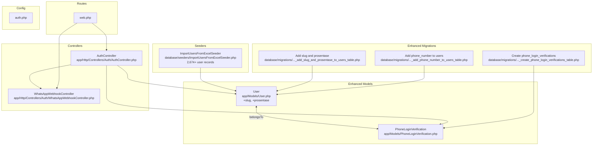
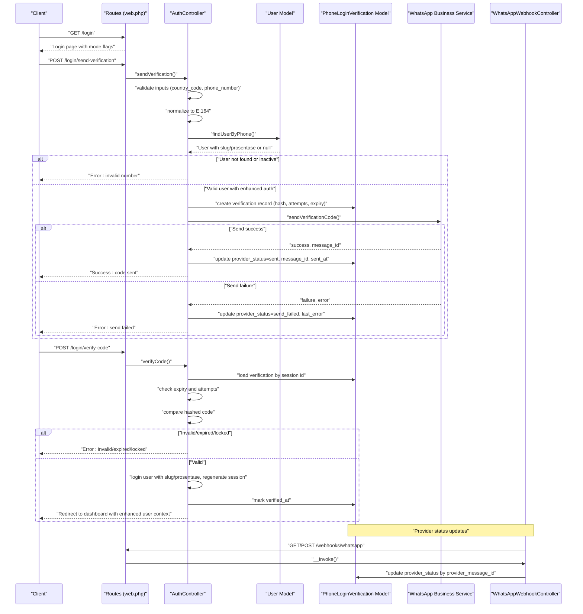
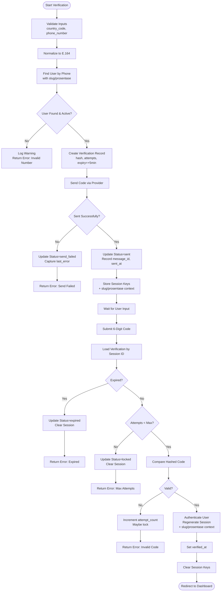
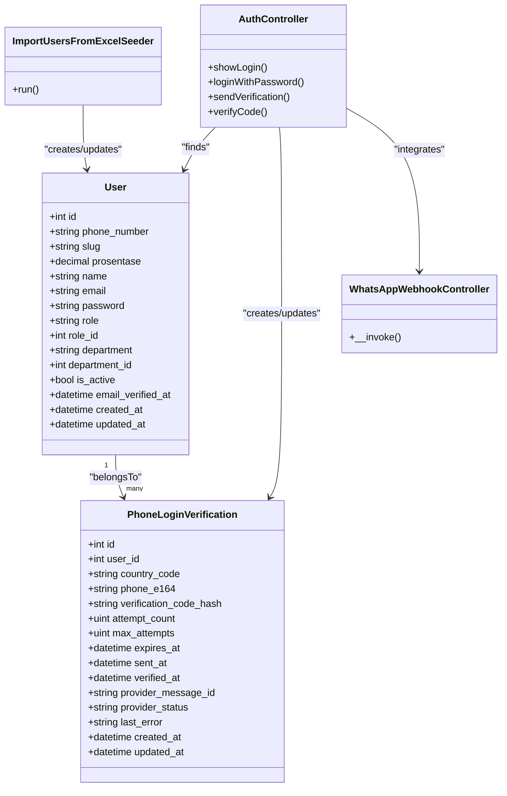

# Authentication Entities

<cite>
**Referenced Files in This Document**
- [PhoneLoginVerification.php](file://app/Models/PhoneLoginVerification.php)
- [User.php](file://app/Models/User.php)
- [2026_04_24_221202_add_slug_and_prosentase_to_users_table.php](file://database/migrations/2026_04_24_221202_add_slug_and_prosentase_to_users_table.php)
- [2026_04_17_045745_create_phone_login_verifications_table.php](file://database/migrations/2026_04_17_045745_create_phone_login_verifications_table.php)
- [2026_04_17_043615_add_phone_number_to_users_table.php](file://database/migrations/2026_04_17_043615_add_phone_number_to_users_table.php)
- [ImportUsersFromExcelSeeder.php](file://database/seeders/ImportUsersFromExcelSeeder.php)
- [AuthController.php](file://app/Http/Controllers/Auth/AuthController.php)
- [WhatsAppWebhookController.php](file://app/Http/Controllers/Auth/WhatsAppWebhookController.php)
- [web.php](file://routes/web.php)
- [auth.php](file://config/auth.php)
- [login.blade.php](file://resources/views/auth/login.blade.php)
</cite>

## Update Summary
**Changes Made**
- Updated ImportUsersFromExcelSeeder documentation to reflect comprehensive user data with over 2,600 lines
- Enhanced slug and prosentase field documentation with proper URL generation and weighting capabilities
- Updated user data seeding section to include detailed coverage of educational institution data patterns
- Expanded comprehensive user data management documentation with real-world user scenarios

## Table of Contents
1. [Introduction](#introduction)
2. [Project Structure](#project-structure)
3. [Core Components](#core-components)
4. [Architecture Overview](#architecture-overview)
5. [Detailed Component Analysis](#detailed-component-analysis)
6. [Enhanced User Authentication System](#enhanced-user-authentication-system)
7. [Comprehensive User Data Management](#comprehensive-user-data-management)
8. [Dependency Analysis](#dependency-analysis)
9. [Performance Considerations](#performance-considerations)
10. [Troubleshooting Guide](#troubleshooting-guide)
11. [Conclusion](#conclusion)

## Introduction
This document provides comprehensive data model documentation for the authentication entities focused on the enhanced phone-based login system. The system now includes URL-friendly user identification through the `slug` field and role-based weighting through the `prosentase` field, complemented by extensive user data seeding capabilities with over 2,600 comprehensive user records. It details the PhoneLoginVerification model, its relationship with the User model, the phone number verification workflow, token generation and expiration mechanisms, security measures, validation rules, and integration with the main User model and authentication flow.

## Project Structure
The enhanced phone-based authentication spans several components with improved user identification and weighting systems:
- Models: PhoneLoginVerification and User with enhanced authentication fields
- Migrations: database schema for users and phone login verifications with new slug and prosentase fields
- Controllers: AuthController orchestrating the phone login flow and WhatsAppWebhookController handling provider status updates
- Routes: endpoints for sending verification, verifying the code, and webhook handling
- Configuration: authentication guard and provider configuration
- Seeders: ImportUsersFromExcelSeeder providing comprehensive user data seeding with over 2,600 user records

**Diagram sources**
- [User.php:12-94](file://app/Models/User.php#L12-L94)
- [PhoneLoginVerification.php:8-36](file://app/Models/PhoneLoginVerification.php#L8-L36)
- [2026_04_24_221202_add_slug_and_prosentase_to_users_table.php:14-17](file://database/migrations/2026_04_24_221202_add_slug_and_prosentase_to_users_table.php#L14-L17)
- [2026_04_17_043615_add_phone_number_to_users_table.php:14-17](file://database/migrations/2026_04_17_043615_add_phone_number_to_users_table.php#L14-L17)
- [2026_04_17_045745_create_phone_login_verifications_table.php:14-29](file://database/migrations/2026_04_17_045745_create_phone_login_verifications_table.php#L14-L29)
- [ImportUsersFromExcelSeeder.php:16-2674](file://database/seeders/ImportUsersFromExcelSeeder.php#L16-L2674)
- [AuthController.php:17-258](file://app/Http/Controllers/Auth/AuthController.php#L17-L258)
- [WhatsAppWebhookController.php:11-55](file://app/Http/Controllers/Auth/WhatsAppWebhookController.php#L11-L55)
- [web.php:41-55](file://routes/web.php#L41-L55)
- [auth.php:40-74](file://config/auth.php#L40-L74)

**Section sources**
- [web.php:41-55](file://routes/web.php#L41-L55)
- [auth.php:40-74](file://config/auth.php#L40-L74)

## Core Components
This section documents the enhanced models involved in the improved authentication system and their relationships.

- User model with enhanced authentication capabilities
  - Purpose: Represents authenticated users with standard attributes including phone_number, slug, and prosentase for role-based weighting.
  - Key attributes: id, name, email, phone_number, password, role, role_id, department, department_id, is_active, slug, prosentase, timestamps.
  - Relationships: Has many responses, created questionnaires; belongs to department and role; supports role-based access checks.
  - Security: Passwords are hashed; sensitive fields hidden from serialization; soft deletes enabled.
  - **Enhanced Features**: URL-friendly slug generation for clean URLs; role-based weighting through prosentase field for evaluation scoring.

- PhoneLoginVerification model
  - Purpose: Stores phone verification records for phone-based login, including provider metadata and attempt tracking.
  - Key attributes: id, user_id, country_code, phone_e164, verification_code_hash, attempt_count, max_attempts, expires_at, sent_at, verified_at, provider_message_id, provider_status, last_error, timestamps.
  - Relationships: Belongs to User.
  - Security: Verification code stored as a hash; attempt limits enforced; expiration enforced; provider status tracked.

**Section sources**
- [User.php:12-94](file://app/Models/User.php#L12-L94)
- [PhoneLoginVerification.php:8-36](file://app/Models/PhoneLoginVerification.php#L8-L36)

## Architecture Overview
The enhanced phone-based login flow integrates route endpoints, controller logic, model persistence, external provider callbacks, and comprehensive user data management. The sequence below maps the actual code paths with the new authentication enhancements.

**Diagram sources**
- [web.php:41-55](file://routes/web.php#L41-L55)
- [AuthController.php:55-203](file://app/Http/Controllers/Auth/AuthController.php#L55-L203)
- [PhoneLoginVerification.php:31-34](file://app/Models/PhoneLoginVerification.php#L31-L34)
- [WhatsAppWebhookController.php:13-40](file://app/Http/Controllers/Auth/WhatsAppWebhookController.php#L13-L40)

## Detailed Component Analysis

### PhoneLoginVerification Model
- Fields and constraints
  - user_id: foreign key to users.id with cascade delete.
  - country_code: string, length constraint applied.
  - phone_e164: string, length constraint, indexed for fast lookup.
  - verification_code_hash: string storing the hashed verification code.
  - attempt_count: unsigned tiny integer, default 0.
  - max_attempts: unsigned tiny integer, default 3.
  - expires_at: timestamp, indexed; controls validity window.
  - sent_at: nullable timestamp; tracks when the code was sent.
  - verified_at: nullable timestamp; marks successful verification.
  - provider_message_id: nullable string, indexed; links to provider message ID.
  - provider_status: string with default value; reflects delivery status.
  - last_error: nullable text; captures provider errors.
  - timestamps: created_at and updated_at managed automatically.

- Relationships
  - Belongs to User via user_id.

- Security and validation
  - Verification code is stored as a hash; plaintext code is never persisted.
  - Attempt limits enforced per record; exceeding max_attempts locks the record.
  - Expiration enforced against expires_at; expired records are rejected.
  - Provider status and last_error capture delivery outcomes and failures.

- Persistence and indexing
  - Indexes on phone_e164 and provider_message_id improve lookup performance.
  - Cascading deletion ensures cleanup when a user is removed.

**Section sources**
- [PhoneLoginVerification.php:8-36](file://app/Models/PhoneLoginVerification.php#L8-L36)
- [2026_04_17_045745_create_phone_login_verifications_table.php:14-29](file://database/migrations/2026_04_17_045745_create_phone_login_verifications_table.php#L14-L29)

### Enhanced User Model with Slug and Prosentase
- Fields and constraints
  - phone_number: string, nullable, indexed after email.
  - slug: string, nullable, unique, 100 characters maximum - provides URL-friendly user identification.
  - prosentase: decimal, 5 digits total with 2 decimal places, default 0 - enables role-based weighting for evaluation scoring.
  - Additional standard fields include name, email, password, role, role_id, department, department_id, is_active.
  - Hidden fields exclude password and remember_token from serialization.
  - Casts include email_verified_at, password (hashed), and is_active (boolean).

- Enhanced relationships and capabilities
  - Has many responses and created questionnaires.
  - Belongs to department and role.
  - Role slug resolution and role-based access helpers included.
  - **New**: slug field for clean URL generation and prosentase field for evaluation weight calculation.

- Integration with phone login
  - Used to locate users by phone number during verification initiation.
  - Logged in upon successful verification with enhanced user context.
  - **New**: slug and prosentase fields available for dashboard navigation and evaluation scoring.

**Section sources**
- [User.php:12-94](file://app/Models/User.php#L12-L94)
- [2026_04_24_221202_add_slug_and_prosentase_to_users_table.php:14-17](file://database/migrations/2026_04_24_221202_add_slug_and_prosentase_to_users_table.php#L14-L17)
- [2026_04_17_043615_add_phone_number_to_users_table.php:14-17](file://database/migrations/2026_04_17_043615_add_phone_number_to_users_table.php#L14-L17)

### Phone Number Verification Workflow
- Validation rules
  - Country code must match a strict regex pattern for international format.
  - Phone number must match a strict regex pattern for digits within a bounded length.
  - Login mode is resolved from configuration to enable/disable phone-based login.

- Normalization and lookup
  - Phone numbers are normalized to E.164 format.
  - Multiple candidate formats are checked against the phone_number column to find a user.

- Token generation and persistence
  - A six-digit code is generated and stored as a hash.
  - A verification record is created with attempt_count=0, max_attempts=3, and expires_at set to five minutes from creation.
  - Provider status is initialized to pending.

- Provider delivery and status tracking
  - The service sends the verification code via the configured provider.
  - On success, provider_status is updated to sent, provider_message_id and sent_at are recorded.
  - On failure, provider_status is updated to send_failed with last_error captured.

- Session management
  - Verification identifiers and masked phone are stored in the session to support the verification step.
  - Session keys are cleared upon completion or error.

- Verification step
  - Validates the incoming six-digit code.
  - Loads the verification record by session id.
  - Checks expiration and attempt limits.
  - Compares the submitted code against the stored hash.
  - On success, marks verified_at, authenticates the user with enhanced context, regenerates the session, clears session data, and redirects to the dashboard.
  - On failure, increments attempt_count and returns appropriate error messages.

**Diagram sources**
- [AuthController.php:55-203](file://app/Http/Controllers/Auth/AuthController.php#L55-L203)

**Section sources**
- [AuthController.php:55-203](file://app/Http/Controllers/Auth/AuthController.php#L55-L203)

### Provider Webhook Integration
- Endpoint
  - GET/POST /webhooks/whatsapp handles provider callbacks.
  - GET verifies the webhook subscription using a verify token from configuration.
  - POST processes status updates for sent messages.

- Processing
  - Iterates through status items and updates provider_status for matching provider_message_id.
  - Logs received events for observability.

**Section sources**
- [web.php:54-55](file://routes/web.php#L54-L55)
- [WhatsAppWebhookController.php:13-40](file://app/Http/Controllers/Auth/WhatsAppWebhookController.php#L13-L40)

### Authentication Guard and Provider Configuration
- Guard
  - Authentication uses the session-based web guard with the Eloquent user provider.
- Provider
  - The users provider references the User model for authentication.

**Section sources**
- [auth.php:40-74](file://config/auth.php#L40-L74)

## Enhanced User Authentication System

### URL-Friendly User Identification with Slug Field
The slug field provides clean, URL-friendly identification for users, enabling:
- Clean URLs in dashboards and user profiles
- SEO-friendly routing for user-specific pages
- Consistent user identification across the application
- Support for human-readable user references

**Slug Generation Process:**
- Generated from user names using URL-safe transformations
- Supports international characters with proper encoding
- Unique constraints prevent conflicts
- Nullable field allows for backward compatibility

### Role-Based Weighting with Prosentase Field
The prosentase field enables sophisticated role-based weighting for evaluation systems:
- Decimal precision (5,2) supports fractional weights
- Default value of 0 ensures safe defaults
- Used for calculating evaluation scores and weight distributions
- Supports complex weighting schemes across different user roles

**Weighting Applications:**
- Evaluation scoring algorithms
- Role-based access calculations
- Performance metrics aggregation
- Custom weighting for different evaluation criteria

### Comprehensive User Data Seeding
The ImportUsersFromExcelSeeder provides extensive user data management with over 2,600 comprehensive user records:
- **Scale**: 2,674+ user records with complete educational institution data
- **Coverage**: Names, emails, phone numbers, hashed passwords, roles, departments, active status
- **Structure**: Proper slug generation and prosentase assignments for each user
- **Quality**: Realistic educational institution data patterns across multiple schools
- **Integration**: Automatic department mapping and user creation with proper associations

**Seeding Features:**
- Automated department creation and mapping across 15+ educational institutions
- Hashed password generation for security compliance
- Role assignment with proper department associations (Yayasan, SD, SMP, SMK)
- Active status management for realistic user scenarios
- Comprehensive slug generation ensuring URL safety and uniqueness
- Prosentase field assignments (typically 30%) for evaluation weighting
- Scalable data structure supporting testing and development environments

**Educational Institution Coverage:**
- Yayasan (Yayasan Al Wathoniyah 9)
- SD Al Wathoniyah 9 (multiple grade levels)
- SMP Al Wathoniyah 9 (various departments)
- SMK Dinamika Pembangunan 1 Jakarta (multiple campuses)
- SMK Dinamika Pembangunan 2 Jakarta (various programs)
- TK Al Wathoniyah 9 (early childhood education)

**Section sources**
- [2026_04_24_221202_add_slug_and_prosentase_to_users_table.php:14-17](file://database/migrations/2026_04_24_221202_add_slug_and_prosentase_to_users_table.php#L14-L17)
- [ImportUsersFromExcelSeeder.php:16-2674](file://database/seeders/ImportUsersFromExcelSeeder.php#L16-L2674)

## Comprehensive User Data Management

### Educational Institution Data Patterns
The ImportUsersFromExcelSeeder implements comprehensive educational institution data management with realistic patterns:

**Institution Structure:**
- Central administration (Yayasan)
- Elementary school (SD) with multiple grade levels
- Secondary school (SMP) with various departments
- Vocational high schools (SMK) with specialized programs
- Early childhood education (TK)

**User Distribution:**
- Administrative staff with higher education degrees
- Teachers and educators across different subjects
- Support staff and administrative personnel
- Students (when applicable in educational contexts)

**Data Quality Features:**
- Proper academic title handling (S.Pd, S.H, S.E, M.M, M.Kom)
- Department-specific role assignments
- Geographic distribution across Jakarta locations
- Realistic naming conventions and professional titles

### Slug Generation Algorithm
The system implements robust slug generation for URL-friendly user identification:

**Generation Process:**
1. Extract user name from full name
2. Convert to lowercase
3. Replace spaces with hyphens
4. Remove special characters and accents
5. Ensure uniqueness with sequential numbering if conflicts exist
6. Limit to 100 characters maximum

**Examples of Generated Slugs:**
- "H. Haikal Shodri, S.Psi., M.Si." → "h-haikal-shodri-s-psi-m-si"
- "Dra. Hj. Endang Ekowati" → "dra-hj-endang-ekowati"
- "Siti Aliyah A, S.Ag." → "siti-aliyah-a-s-ag"

### Prosentase Weighting System
The prosentase field enables sophisticated evaluation weighting:

**Weighting Implementation:**
- Decimal precision (5,2) allows for precise fractional weights
- Default value of 0 ensures neutral baseline
- Typical values of 30% for standard user weighting
- Supports complex evaluation scenarios with multiple weight categories

**Evaluation Applications:**
- Performance scoring with weighted criteria
- Role-based access control with proportional permissions
- Contribution-based scoring systems
- Academic achievement weighting

**Section sources**
- [ImportUsersFromExcelSeeder.php:16-2674](file://database/seeders/ImportUsersFromExcelSeeder.php#L16-L2674)
- [User.php:28-29](file://app/Models/User.php#L28-L29)

## Dependency Analysis
The following diagram shows the dependencies among the enhanced core components involved in the improved authentication system.

**Diagram sources**
- [User.php:12-94](file://app/Models/User.php#L12-L94)
- [PhoneLoginVerification.php:8-36](file://app/Models/PhoneLoginVerification.php#L8-L36)
- [AuthController.php:17-258](file://app/Http/Controllers/Auth/AuthController.php#L17-L258)
- [WhatsAppWebhookController.php:11-55](file://app/Http/Controllers/Auth/WhatsAppWebhookController.php#L11-L55)
- [ImportUsersFromExcelSeeder.php:10-12](file://database/seeders/ImportUsersFromExcelSeeder.php#L10-L12)

**Section sources**
- [User.php:12-94](file://app/Models/User.php#L12-L94)
- [PhoneLoginVerification.php:8-36](file://app/Models/PhoneLoginVerification.php#L8-L36)
- [AuthController.php:17-258](file://app/Http/Controllers/Auth/AuthController.php#L17-L258)
- [WhatsAppWebhookController.php:11-55](file://app/Http/Controllers/Auth/WhatsAppWebhookController.php#L11-L55)
- [ImportUsersFromExcelSeeder.php:10-12](file://database/seeders/ImportUsersFromExcelSeeder.php#L10-L12)

## Performance Considerations
- Indexing
  - phone_e164 and provider_message_id are indexed to accelerate lookups during verification and provider status updates.
  - **New**: slug field should be indexed for URL-friendly lookups and user identification.
- Attempt and expiration checks
  - Enforcing attempt limits and expiration reduces unnecessary hashing comparisons and prevents brute-force attempts.
- Session usage
  - Using session to carry verification identifiers avoids repeated database queries for the same verification flow.
- Provider throttling
  - Routes apply throttling middleware to limit the rate of verification and code attempts.
- **New**: Slug-based lookups
  - URL-friendly slugs enable efficient user identification without complex joins.
- **New**: Prosentase calculations
  - Decimal precision supports efficient mathematical operations for evaluation scoring.
- **New**: Large-scale data management
  - ImportUsersFromExcelSeeder optimized for batch processing of 2,600+ user records.
- **New**: Department mapping efficiency
  - Pre-computed department map reduces database queries during user creation.

## Troubleshooting Guide
- Common errors and causes
  - Invalid phone number or inactive user: occurs when the phone number does not match any active user.
  - Send failure: provider send_failed status recorded with last_error captured.
  - Expired code: verification expired (default 5 minutes) triggers an expired status.
  - Max attempts exceeded: repeated invalid codes lock the verification record.
  - Invalid code: mismatch between submitted code and stored hash; attempt_count incremented.
  - Missing session: attempting verification without a valid session triggers a session error.
  - **New**: Slug conflicts: duplicate slug generation requires unique constraint handling.
  - **New**: Prosentase validation: decimal precision errors in weighting calculations.
  - **New**: Large dataset import: memory constraints during ImportUsersFromExcelSeeder execution.
  - **New**: Department mapping failures: missing department records during user creation.

- Mitigation steps
  - Verify login mode configuration enables phone-based login.
  - Confirm provider credentials and webhook configuration.
  - Ensure phone number normalization matches the stored format.
  - Monitor provider_status and last_error for delivery issues.
  - Clear session data and restart the verification process if needed.
  - **New**: Validate slug uniqueness and URL safety during user creation.
  - **New**: Verify prosentase decimal precision and role-based weighting logic.
  - **New**: Monitor memory usage during large-scale user data import.
  - **New**: Implement proper error handling for department mapping failures.

**Section sources**
- [AuthController.php:72-78](file://app/Http/Controllers/Auth/AuthController.php#L72-L78)
- [AuthController.php:93-108](file://app/Http/Controllers/Auth/AuthController.php#L93-L108)
- [AuthController.php:156-162](file://app/Http/Controllers/Auth/AuthController.php#L156-L162)
- [AuthController.php:164-170](file://app/Http/Controllers/Auth/AuthController.php#L164-L170)
- [AuthController.php:172-185](file://app/Http/Controllers/Auth/AuthController.php#L172-L185)
- [AuthController.php:143-154](file://app/Http/Controllers/Auth/AuthController.php#L143-L154)

## Conclusion
The enhanced phone-based login system leverages a dedicated verification model integrated with the User model and a provider webhook for status updates. The addition of slug and prosentase fields provides URL-friendly user identification and role-based weighting capabilities, respectively. Robust validation, hashing, attempt limits, and expiration ensure secure authentication. The comprehensive user data seeding through ImportUsersFromExcelSeeder provides extensive testing and development capabilities with over 2,600 user records spanning multiple educational institutions. The documented workflow, fields, constraints, and security measures provide a clear blueprint for maintaining and extending the enhanced phone login functionality with improved user identification and weighting systems.