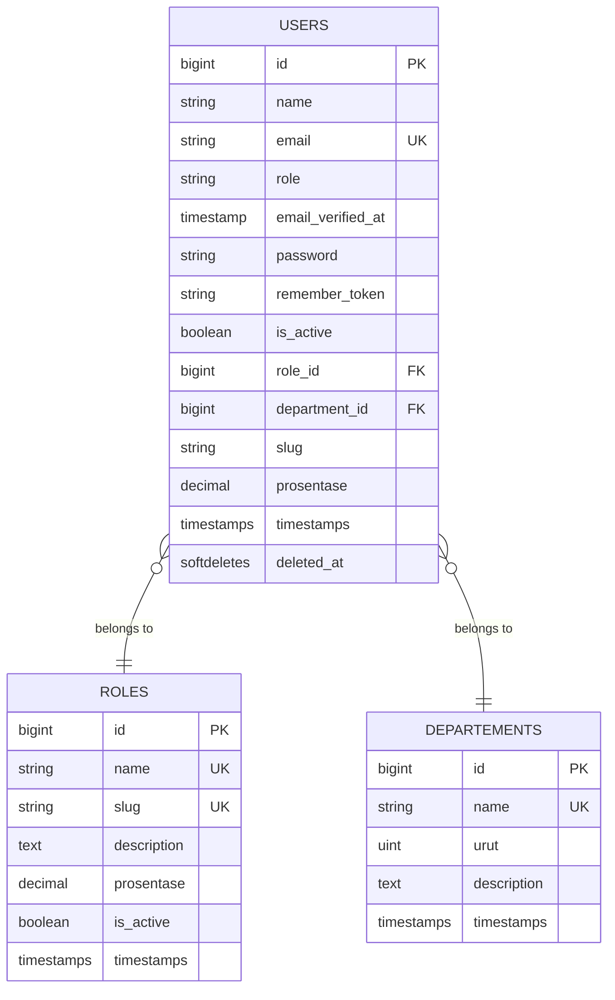
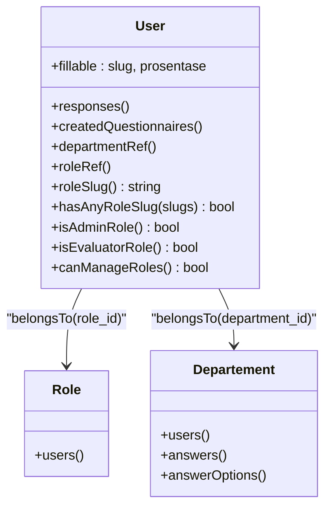
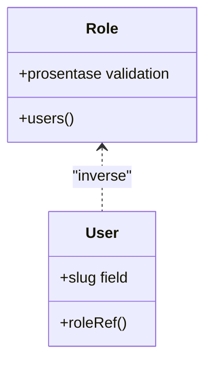
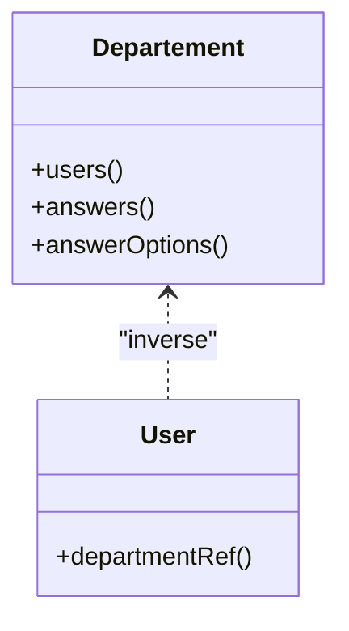
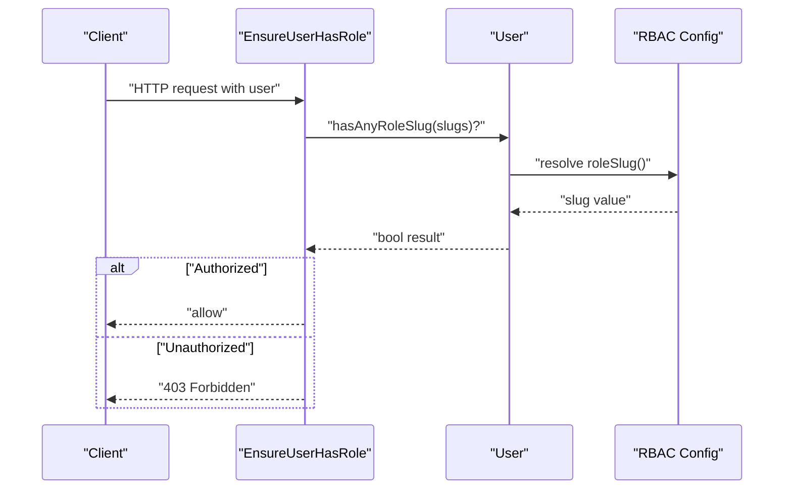
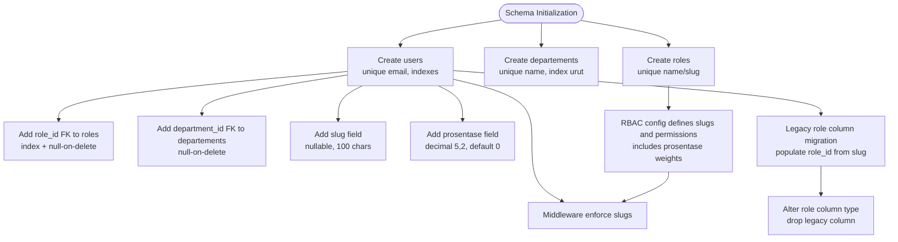

# Core Entities

<cite>
**Referenced Files in This Document**
- [User.php](file://app/Models/User.php)
- [Role.php](file://app/Models/Role.php)
- [Departement.php](file://app/Models/Departement.php)
- [create_users_table.php](file://database/migrations/0001_01_01_000000_create_users_table.php)
- [add_is_active_to_users_table.php](file://database/migrations/2026_04_16_135841_add_is_active_to_users_table.php)
- [add_department_to_users_table.php](file://database/migrations/2026_04_16_235040_add_department_to_users_table.php)
- [alter_role_column_type_on_users_table.php](file://database/migrations/2026_04_17_140500_alter_role_column_type_on_users_table.php)
- [create_roles_table.php](file://database/migrations/2026_04_17_093035_create_roles_table.php)
- [add_role_id_to_users_table.php](file://database/migrations/2026_04_17_093235_add_role_id_to_users_table.php)
- [create_departements_table.php](file://database/migrations/2026_04_17_000821_create_departements_table.php)
- [add_department_id_to_users_table.php](file://database/migrations/2026_04_17_000854_add_department_id_to_users_table.php)
- [add_slug_and_prosentase_to_users_table.php](file://database/migrations/2026_04_24_221202_add_slug_and_prosentase_to_users_table.php)
- [rbac.php](file://config/rbac.php)
- [EnsureUserHasRole.php](file://app/Http/Middleware/EnsureUserHasRole.php)
- [EnsureUserIsAdmin.php](file://app/Http/Middleware/EnsureUserIsAdmin.php)
- [EnsureUserIsEvaluator.php](file://app/Http/Middleware/EnsureUserIsEvaluator.php)
- [RedirectByRole.php](file://app/Http/Middleware/RedirectByRole.php)
- [RoleController.php](file://app/Http/Controllers/Admin/RoleController.php)
- [check-role-slugs.php](file://scripts/ci/check-role-slugs.php)
</cite>

## Update Summary
**Changes Made**
- Updated User model documentation to reflect new slug and prosentase fields in fillable attributes
- Added comprehensive coverage of URL-friendly slug field for user identification
- Documented percentage-based role weight system for sophisticated role assignment
- Enhanced data validation rules and business logic for slug and prosentase fields
- Updated architecture diagrams to show new database schema with slug and prosentase columns

## Table of Contents
1. [Introduction](#introduction)
2. [Project Structure](#project-structure)
3. [Core Components](#core-components)
4. [Architecture Overview](#architecture-overview)
5. [Detailed Component Analysis](#detailed-component-analysis)
6. [Dependency Analysis](#dependency-analysis)
7. [Performance Considerations](#performance-considerations)
8. [Troubleshooting Guide](#troubleshooting-guide)
9. [Conclusion](#conclusion)
10. [Appendices](#appendices)

## Introduction
This document describes the core data models for User, Role, and Department, including their relationships, constraints, indexes, and business logic. It explains how roles and departments are linked to users, how access control is enforced via middleware and configuration, and how the RBAC implementation maps role slugs to dashboards and permissions. The User model now supports comprehensive user data management with URL-friendly slugs and percentage-based role weights, enabling more sophisticated user role assignment and identification systems.

## Project Structure
The core models and their supporting migration files define the relational schema. Middleware enforces access control based on role slugs configured centrally. The enhanced User model now includes slug and prosentase (percentage) fields for improved user identification and role weighting.

```mermaid
graph TB
subgraph "Models"
U["User<br/>app/Models/User.php"]
R["Role<br/>app/Models/Role.php"]
D["Department<br/>app/Models/Departement.php"]
end
subgraph "Migrations"
MU["users table<br/>database/migrations/..._create_users_table.php"]
MR["roles table<br/>database/migrations/..._create_roles_table.php"]
MD["departements table<br/>database/migrations/..._create_departements_table.php"]
MUR["add role_id to users<br/>database/migrations/..._add_role_id_to_users_table.php"]
MUD["add department_id to users<br/>database/migrations/..._add_department_id_to_users_table.php"]
MUS["add slug and prosentase to users<br/>database/migrations/..._add_slug_and_prosentase_to_users_table.php"]
end
subgraph "RBAC Config"
CFG["RBAC config<br/>config/rbac.php"]
end
subgraph "Middleware"
MID1["EnsureUserHasRole<br/>app/Http/Middleware/EnsureUserHasRole.php"]
MID2["EnsureUserIsAdmin<br/>app/Http/Middleware/EnsureUserIsAdmin.php"]
MID3["EnsureUserIsEvaluator<br/>app/Http/Middleware/EnsureUserIsEvaluator.php"]
MID4["RedirectByRole<br/>app/Http/Middleware/RedirectByRole.php"]
end
U --- MU
U --- MUS
R --- MR
D --- MD
U --- MUR
U --- MUD
U --- CFG
MID1 --- CFG
MID2 --- CFG
MID3 --- CFG
MID4 --- CFG
```

**Diagram sources**
- [User.php:12-99](file://app/Models/User.php#L12-L99)
- [Role.php:9-31](file://app/Models/Role.php#L9-L31)
- [Departement.php:9-34](file://app/Models/Departement.php#L9-L34)
- [create_users_table.php:13-23](file://database/migrations/0001_01_01_000000_create_users_table.php#L13-L23)
- [create_roles_table.php:14-22](file://database/migrations/2026_04_17_093035_create_roles_table.php#L14-L22)
- [create_departements_table.php:14-20](file://database/migrations/2026_04_17_000821_create_departements_table.php#L14-L20)
- [add_role_id_to_users_table.php:15-22](file://database/migrations/2026_04_17_093235_add_role_id_to_users_table.php#L15-L22)
- [add_department_id_to_users_table.php:14-20](file://database/migrations/2026_04_17_000854_add_department_id_to_users_table.php#L14-L20)
- [add_slug_and_prosentase_to_users_table.php:14-16](file://database/migrations/2026_04_24_221202_add_slug_and_prosentase_to_users_table.php#L14-L16)
- [rbac.php:1-64](file://config/rbac.php#L1-L64)
- [EnsureUserHasRole.php:9-28](file://app/Http/Middleware/EnsureUserHasRole.php#L9-L28)
- [EnsureUserIsAdmin.php:10-23](file://app/Http/Middleware/EnsureUserIsAdmin.php#L10-L23)
- [EnsureUserIsEvaluator.php:10-23](file://app/Http/Middleware/EnsureUserIsEvaluator.php#L10-L23)
- [RedirectByRole.php:9-31](file://app/Http/Middleware/RedirectByRole.php#L9-L31)

**Section sources**
- [User.php:12-99](file://app/Models/User.php#L12-L99)
- [Role.php:9-31](file://app/Models/Role.php#L9-L31)
- [Departement.php:9-34](file://app/Models/Departement.php#L9-L34)
- [create_users_table.php:13-23](file://database/migrations/0001_01_01_000000_create_users_table.php#L13-L23)
- [create_roles_table.php:14-22](file://database/migrations/2026_04_17_093035_create_roles_table.php#L14-L22)
- [create_departements_table.php:14-20](file://database/migrations/2026_04_17_000821_create_departements_table.php#L14-L20)
- [add_role_id_to_users_table.php:15-22](file://database/migrations/2026_04_17_093235_add_role_id_to_users_table.php#L15-L22)
- [add_department_id_to_users_table.php:14-20](file://database/migrations/2026_04_17_000854_add_department_id_to_users_table.php#L14-L20)
- [add_slug_and_prosentase_to_users_table.php:14-16](file://database/migrations/2026_04_24_221202_add_slug_and_prosentase_to_users_table.php#L14-L16)
- [rbac.php:1-64](file://config/rbac.php#L1-L64)

## Core Components
This section documents the three core entities and their relationships, with enhanced focus on the User model's new capabilities.

- User
  - Purpose: Represents an application user with identity, credentials, role, department, activity status, URL-friendly slug, and percentage-based role weight.
  - Key relations: belongs to Role via role_id; belongs to Department via department_id; has many Responses and created Questionnaires.
  - Enhanced fillable attributes: slug (string, 100 chars, nullable) and prosentase (decimal 5,2, default 0) enable comprehensive user data management.
  - Role resolution: Provides helpers to resolve role slug from either role_id or legacy role column, and to detect admin vs evaluator roles.
  - Access control helpers: canManageRoles delegates to admin role check.

- Role
  - Purpose: Defines roles with unique name and slug, optional description, percentage weight (prosentase), and activation flag.
  - Key relation: has many Users via role_id.
  - Enhanced validation: prosentase field validated as numeric between 0-100 for role weighting.

- Department
  - Purpose: Organizes users and evaluation data by department with ordering and description.
  - Key relations: has many Users, Answers, and AnswerOptions via department_id.

**Section sources**
- [User.php:16-30](file://app/Models/User.php#L16-L30)
- [Role.php:9-31](file://app/Models/Role.php#L9-L31)
- [Departement.php:9-34](file://app/Models/Departement.php#L9-L34)
- [add_slug_and_prosentase_to_users_table.php:14-16](file://database/migrations/2026_04_24_221202_add_slug_and_prosentase_to_users_table.php#L14-L16)
- [RoleController.php:119-122](file://app/Http/Controllers/Admin/RoleController.php#L119-L122)

## Architecture Overview
The data model centers around three entities with foreign keys linking users to roles and departments. The enhanced User model now includes slug and prosentase fields for improved user identification and role weighting. Access control is enforced by middleware using role slugs configured centrally.

**Diagram sources**
- [create_users_table.php:13-23](file://database/migrations/0001_01_01_000000_create_users_table.php#L13-L23)
- [add_is_active_to_users_table.php:14-16](file://database/migrations/2026_04_16_135841_add_is_active_to_users_table.php#L14-L16)
- [alter_role_column_type_on_users_table.php:11-19](file://database/migrations/2026_04_17_140500_alter_role_column_type_on_users_table.php#L11-L19)
- [create_roles_table.php:14-22](file://database/migrations/2026_04_17_093035_create_roles_table.php#L14-L22)
- [create_departements_table.php:14-20](file://database/migrations/2026_04_17_000821_create_departements_table.php#L14-L20)
- [add_role_id_to_users_table.php:15-22](file://database/migrations/2026_04_17_093235_add_role_id_to_users_table.php#L15-L22)
- [add_department_id_to_users_table.php:14-20](file://database/migrations/2026_04_17_000854_add_department_id_to_users_table.php#L14-L20)
- [add_slug_and_prosentase_to_users_table.php:14-16](file://database/migrations/2026_04_24_221202_add_slug_and_prosentase_to_users_table.php#L14-L16)

## Detailed Component Analysis

### User Model
- Fields and types
  - Identity: id, name, email (unique), role (string), email_verified_at, password, remember_token.
  - Enhanced fields: slug (string, 100 chars, nullable) for URL-friendly identification, prosentase (decimal 5,2, default 0) for percentage-based role weights.
  - Flags: is_active (boolean), soft deletes.
  - Foreign keys: role_id (nullable), department_id (nullable).
  - Timestamps: created_at, updated_at, deleted_at.
- Enhanced fillable attributes
  - slug: URL-friendly identifier for user profiles and routing
  - prosentase: percentage weight for role-based calculations and priority assignments
- Constraints and indexes
  - role_id is a foreign key to roles.id with on-delete SET NULL.
  - role_id is indexed.
  - email is unique.
  - department_id is a foreign key to departements.id with on-delete SET NULL.
  - slug field added with nullable constraint for backward compatibility.
- Relationships
  - belongs to Role via role_id.
  - belongs to Department via department_id.
  - has many Responses via user_id.
  - has many created Questionnaires via created_by.
- Business logic and access control
  - Role slug resolution: resolves slug from role_id if present, otherwise falls back to legacy role column.
  - Admin detection: checks against configured admin slugs.
  - Evaluator detection: checks configured evaluator slugs; if none configured and role_id exists, any non-admin role counts as evaluator.
  - Management capability: canManageRoles returns true for admin roles.
- Validation and normalization
  - Legacy role column normalized to role_id via migration that populates role_id from matching roles.slug and drops the legacy column after migration.
  - Slug field provides URL-friendly identifiers for user profiles and routing purposes.

**Diagram sources**
- [User.php:39-57](file://app/Models/User.php#L39-L57)
- [Role.php:26-29](file://app/Models/Role.php#L26-L29)
- [Departement.php:19-32](file://app/Models/Departement.php#L19-L32)

**Section sources**
- [User.php:16-30](file://app/Models/User.php#L16-L30)
- [User.php:39-57](file://app/Models/User.php#L39-L57)
- [User.php:59-92](file://app/Models/User.php#L59-L92)
- [add_role_id_to_users_table.php:15-22](file://database/migrations/2026_04_17_093235_add_role_id_to_users_table.php#L15-L22)
- [add_department_id_to_users_table.php:14-20](file://database/migrations/2026_04_17_000854_add_department_id_to_users_table.php#L14-L20)
- [alter_role_column_type_on_users_table.php:11-19](file://database/migrations/2026_04_17_140500_alter_role_column_type_on_users_table.php#L11-L19)
- [add_slug_and_prosentase_to_users_table.php:14-16](file://database/migrations/2026_04_24_221202_add_slug_and_prosentase_to_users_table.php#L14-L16)

### Role Model
- Fields and types
  - Identity: id, name (unique), slug (unique), description (nullable), prosentase (decimal with precision 5, scale 2), is_active (boolean), timestamps.
- Enhanced validation
  - prosentase field validated as numeric between 0-100 for role weighting and priority assignments.
- Relationships
  - has many Users via role_id.
- Notes
  - The prosentase field is cast to decimal with two decimals for consistent numeric handling.
  - Role definitions in RBAC configuration demonstrate percentage-based role weights (40-100%).

**Diagram sources**
- [Role.php:26-29](file://app/Models/Role.php#L26-L29)
- [User.php:54-57](file://app/Models/User.php#L54-L57)
- [RoleController.php:119-122](file://app/Http/Controllers/Admin/RoleController.php#L119-L122)

**Section sources**
- [Role.php:13-24](file://app/Models/Role.php#L13-L24)
- [Role.php:26-29](file://app/Models/Role.php#L26-L29)
- [create_roles_table.php:14-22](file://database/migrations/2026_04_17_093035_create_roles_table.php#L14-L22)
- [RoleController.php:119-122](file://app/Http/Controllers/Admin/RoleController.php#L119-L122)
- [rbac.php:41-48](file://config/rbac.php#L41-L48)

### Department Model
- Fields and types
  - Identity: id, name (unique), urut (unsigned integer, default 0), description (nullable), timestamps.
- Indexes
  - urut is indexed for ordering.
- Relationships
  - has many Users via department_id.
  - has many Answers via department_id.
  - has many AnswerOptions via department_id.
- Notes
  - Department name is unique; ordering stored in urut; answers and answer options also scoped by department_id.

**Diagram sources**
- [Departement.php:19-32](file://app/Models/Departement.php#L19-L32)
- [User.php:49-52](file://app/Models/User.php#L49-L52)

**Section sources**
- [Departement.php:13-17](file://app/Models/Departement.php#L13-L17)
- [Departement.php:19-32](file://app/Models/Departement.php#L19-L32)
- [create_departements_table.php:14-20](file://database/migrations/2026_04_17_000821_create_departements_table.php#L14-L20)

### RBAC Implementation and Access Control
- Role slugs and configuration
  - Admin slugs and evaluator slugs are defined in configuration.
  - Dashboard paths are mapped per role slug.
  - Aliases and labels support role normalization and presentation.
  - Role definitions include prosentase values for percentage-based role weights.
- Middleware enforcement
  - EnsureUserHasRole: checks that the authenticated user's role slug matches any provided slug(s); denies unauthorized access otherwise.
  - EnsureUserIsAdmin: denies access unless the user's role is considered admin.
  - EnsureUserIsEvaluator: denies access unless the user qualifies as an evaluator.
  - RedirectByRole: redirects authenticated users to a dashboard route based on their current role slug.
- User-level helpers
  - roleSlug(): resolves slug from role_id or legacy role column.
  - hasAnyRoleSlug(): checks membership in a set of slugs.
  - isAdminRole(): checks admin slugs.
  - isEvaluatorRole(): checks evaluator slugs or treats any non-admin role as evaluator when applicable.
- Slug validation and CI enforcement
  - Centralized slug management through rbac.php configuration.
  - CI script validates that role slugs are only defined in configuration, not hardcoded literals.

**Diagram sources**
- [EnsureUserHasRole.php:11-25](file://app/Http/Middleware/EnsureUserHasRole.php#L11-L25)
- [User.php:59-67](file://app/Models/User.php#L59-L67)
- [rbac.php:4-6](file://config/rbac.php#L4-L6)
- [check-role-slugs.php:65-66](file://scripts/ci/check-role-slugs.php#L65-L66)

**Section sources**
- [rbac.php:4-63](file://config/rbac.php#L4-L63)
- [EnsureUserHasRole.php:11-25](file://app/Http/Middleware/EnsureUserHasRole.php#L11-L25)
- [EnsureUserIsAdmin.php:12-21](file://app/Http/Middleware/EnsureUserIsAdmin.php#L12-L21)
- [EnsureUserIsEvaluator.php:12-21](file://app/Http/Middleware/EnsureUserIsEvaluator.php#L12-L21)
- [RedirectByRole.php:19-29](file://app/Http/Middleware/RedirectByRole.php#L19-L29)
- [User.php:59-92](file://app/Models/User.php#L59-L92)
- [check-role-slugs.php:1-155](file://scripts/ci/check-role-slugs.php#L1-L155)

## Dependency Analysis
- Primary keys
  - roles.id
  - departements.id
  - users.id
- Foreign keys
  - users.role_id → roles.id (ON DELETE SET NULL)
  - users.department_id → departements.id (ON DELETE SET NULL)
- Enhanced indexes and constraints
  - users.role_id (indexed)
  - departements.urut (indexed)
  - users.email (unique)
  - roles.name/slug (unique)
  - departements.name (unique)
  - users.slug (nullable, added via migration)
- Enhanced constraints
  - role_id and department_id are nullable in users.
  - Legacy role column was migrated to role_id and later dropped via type change migration.
  - slug field added with nullable constraint for URL-friendly user identification.
  - prosentase field added with default 0 for percentage-based role weights.

**Diagram sources**
- [create_roles_table.php:14-22](file://database/migrations/2026_04_17_093035_create_roles_table.php#L14-L22)
- [create_departements_table.php:14-20](file://database/migrations/2026_04_17_000821_create_departements_table.php#L14-L20)
- [create_users_table.php:13-23](file://database/migrations/0001_01_01_000000_create_users_table.php#L13-L23)
- [add_role_id_to_users_table.php:15-22](file://database/migrations/2026_04_17_093235_add_role_id_to_users_table.php#L15-L22)
- [add_department_id_to_users_table.php:14-20](file://database/migrations/2026_04_17_000854_add_department_id_to_users_table.php#L14-L20)
- [alter_role_column_type_on_users_table.php:11-19](file://database/migrations/2026_04_17_140500_alter_role_column_type_on_users_table.php#L11-L19)
- [add_slug_and_prosentase_to_users_table.php:14-16](file://database/migrations/2026_04_24_221202_add_slug_and_prosentase_to_users_table.php#L14-L16)
- [rbac.php:4-63](file://config/rbac.php#L4-L63)

**Section sources**
- [create_roles_table.php:14-22](file://database/migrations/2026_04_17_093035_create_roles_table.php#L14-L22)
- [create_departements_table.php:14-20](file://database/migrations/2026_04_17_000821_create_departements_table.php#L14-L20)
- [create_users_table.php:13-23](file://database/migrations/0001_01_01_000000_create_users_table.php#L13-L23)
- [add_role_id_to_users_table.php:15-22](file://database/migrations/2026_04_17_093235_add_role_id_to_users_table.php#L15-L22)
- [add_department_id_to_users_table.php:14-20](file://database/migrations/2026_04_17_000854_add_department_id_to_users_table.php#L14-L20)
- [alter_role_column_type_on_users_table.php:11-19](file://database/migrations/2026_04_17_140500_alter_role_column_type_on_users_table.php#L11-L19)
- [add_slug_and_prosentase_to_users_table.php:14-16](file://database/migrations/2026_04_24_221202_add_slug_and_prosentase_to_users_table.php#L14-L16)

## Performance Considerations
- Indexes
  - role_id and department_id are indexed on users to speed up joins and filtering.
  - departements.urut is indexed to support ordered queries.
  - users.email is unique, aiding fast lookups and preventing duplicates.
  - slug field added for URL-friendly user identification (nullable).
- Enhanced casting
  - Boolean and decimal casts reduce ORM overhead and ensure consistent handling.
  - prosentase field cast to decimal with two decimals for percentage calculations.
- Nullable FKs
  - Allowing null enables graceful handling of unassigned roles/departments during onboarding or cleanup.
- Slug optimization
  - slug field with 100-character limit provides sufficient space for URL-friendly identifiers.
  - prosentase field uses efficient decimal storage for percentage-based calculations.

## Troubleshooting Guide
- Unauthorized access errors
  - Ensure the user's role slug is included in the middleware guard's slug list.
  - Verify RBAC configuration for admin and evaluator slugs.
- Role mismatch after migration
  - Confirm that role_id was populated from legacy role values and that the migration executed successfully.
- Unexpected evaluator/admin classification
  - Check RBAC evaluator fallback logic when evaluator slugs are not configured but role_id exists.
- Slug-related issues
  - Verify slug field is properly populated for URL-friendly user identification.
  - Check that slug values are unique and URL-safe.
- Prosentase validation errors
  - Ensure prosentase values are numeric between 0-100 for role definitions.
  - Verify role weight calculations use the prosentase field correctly.

**Section sources**
- [EnsureUserHasRole.php:11-25](file://app/Http/Middleware/EnsureUserHasRole.php#L11-L25)
- [EnsureUserIsAdmin.php:12-21](file://app/Http/Middleware/EnsureUserIsAdmin.php#L12-L21)
- [EnsureUserIsEvaluator.php:12-21](file://app/Http/Middleware/EnsureUserIsEvaluator.php#L12-L21)
- [rbac.php:4-63](file://config/rbac.php#L4-L63)
- [add_role_id_to_users_table.php:24-29](file://database/migrations/2026_04_17_093235_add_role_id_to_users_table.php#L24-L29)
- [add_slug_and_prosentase_to_users_table.php:14-16](file://database/migrations/2026_04_24_221202_add_slug_and_prosentase_to_users_table.php#L14-L16)
- [RoleController.php:119-122](file://app/Http/Controllers/Admin/RoleController.php#L119-L122)

## Conclusion
The User, Role, and Department models form a clean RBAC foundation with enhanced capabilities. Users are linked to roles and departments via foreign keys, with indexes and constraints ensuring referential integrity and query performance. The enhanced User model now supports URL-friendly slugs and percentage-based role weights, enabling more sophisticated user role assignment and identification systems. Access control is enforced through middleware using a centralized RBAC configuration, enabling flexible role-based navigation and permission checks with comprehensive data management features.

## Appendices

### Sample Data Structures
- Role
  - name: string (unique)
  - slug: string (unique)
  - description: text (nullable)
  - prosentase: decimal (5-digit total with 2 decimals, 0-100 range)
  - is_active: boolean
- Department
  - name: string (unique)
  - urut: unsigned integer (indexed)
  - description: text (nullable)
- User
  - name: string
  - email: string (unique)
  - role: string (legacy; migrated to role_id)
  - role_id: bigint (nullable, FK)
  - department_id: bigint (nullable, FK)
  - slug: string (nullable, 100 chars for URL-friendly identification)
  - prosentase: decimal (5,2, default 0 for percentage-based role weights)
  - is_active: boolean
  - timestamps and soft deletes

**Section sources**
- [create_roles_table.php:14-22](file://database/migrations/2026_04_17_093035_create_roles_table.php#L14-L22)
- [create_departements_table.php:14-20](file://database/migrations/2026_04_17_000821_create_departements_table.php#L14-L20)
- [create_users_table.php:13-23](file://database/migrations/0001_01_01_000000_create_users_table.php#L13-L23)
- [add_is_active_to_users_table.php:14-16](file://database/migrations/2026_04_16_135841_add_is_active_to_users_table.php#L14-L16)
- [add_role_id_to_users_table.php:15-22](file://database/migrations/2026_04_17_093235_add_role_id_to_users_table.php#L15-L22)
- [add_department_id_to_users_table.php:14-20](file://database/migrations/2026_04_17_000854_add_department_id_to_users_table.php#L14-L20)
- [add_slug_and_prosentase_to_users_table.php:14-16](file://database/migrations/2026_04_24_221202_add_slug_and_prosentase_to_users_table.php#L14-L16)