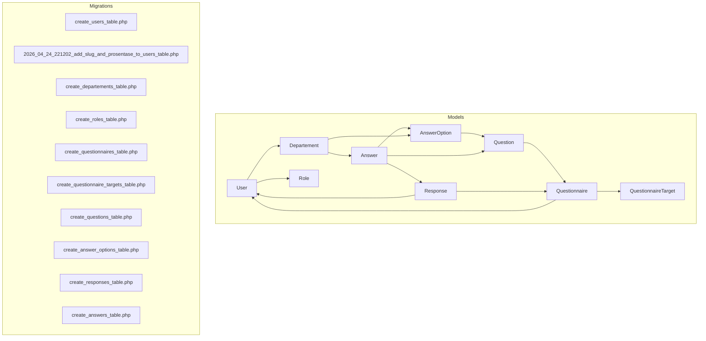
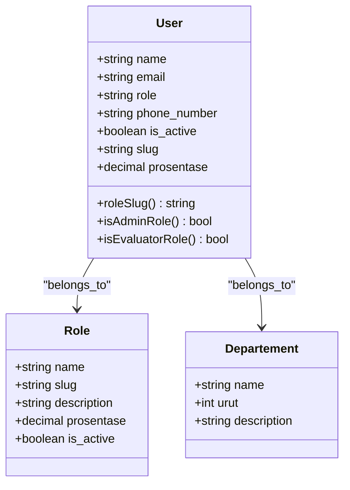
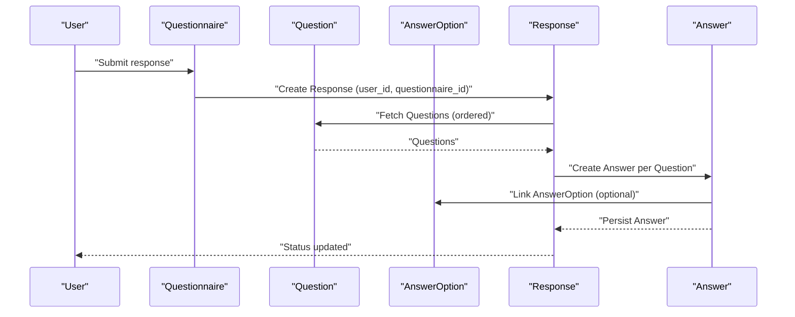
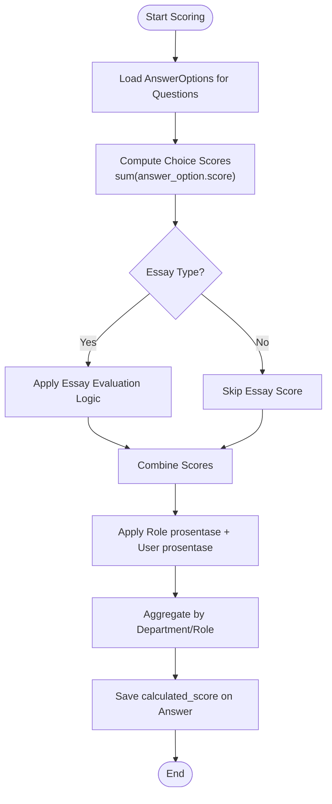
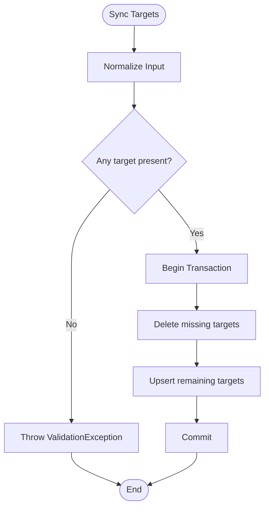
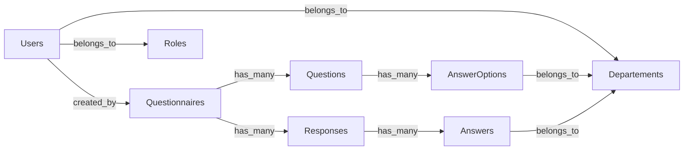

# Data Models & Database Schema

<cite>
**Referenced Files in This Document**
- [User.php](file://app/Models/User.php)
- [Departement.php](file://app/Models/Departement.php)
- [Role.php](file://app/Models/Role.php)
- [Questionnaire.php](file://app/Models/Questionnaire.php)
- [Question.php](file://app/Models/Question.php)
- [AnswerOption.php](file://app/Models/AnswerOption.php)
- [Response.php](file://app/Models/Response.php)
- [Answer.php](file://app/Models/Answer.php)
- [create_users_table.php](file://database/migrations/0001_01_01_000000_create_users_table.php)
- [2026_04_24_221202_add_slug_and_prosentase_to_users_table.php](file://database/migrations/2026_04_24_221202_add_slug_and_prosentase_to_users_table.php)
- [create_roles_table.php](file://database/migrations/2026_04_17_093035_create_roles_table.php)
- [create_departements_table.php](file://database/migrations/2026_04_17_000821_create_departements_table.php)
- [create_questionnaires_table.php](file://database/migrations/2026_04_16_010239_create_questionnaires_table.php)
- [create_questionnaire_targets_table.php](file://database/migrations/2026_04_16_010240_create_questionnaire_targets_table.php)
- [create_questions_table.php](file://database/migrations/2026_04_16_010241_create_questions_table.php)
- [create_answer_options_table.php](file://database/migrations/2026_04_16_020000_create_responses_table.php)
- [create_responses_table.php](file://database/migrations/2026_04_16_020000_create_responses_table.php)
- [create_answers_table.php](file://database/migrations/2026_04_16_020100_create_answers_table.php)
- [QuestionnaireScorer.php](file://app/Services/QuestionnaireScorer.php)
- [UserManagementController.php](file://app/Http/Controllers/Admin/UserManagementController.php)
- [StoreUserRequest.php](file://app/Http/Requests/StoreUserRequest.php)
- [UpdateUserRequest.php](file://app/Http/Requests/UpdateUserRequest.php)
- [StoreQuestionnaireRequest.php](file://app/Http/Requests/StoreQuestionnaireRequest.php)
- [UpdateQuestionnaireRequest.php](file://app/Http/Requests/UpdateQuestionnaireRequest.php)
- [StoreQuestionRequest.php](file://app/Http/Requests/StoreQuestionRequest.php)
- [UpdateQuestionRequest.php](file://app/Http/Requests/UpdateQuestionRequest.php)
- [StoreDepartementRequest.php](file://app/Http/Requests/StoreDepartementRequest.php)
- [UpdateDepartementRequest.php](file://app/Http/Requests/UpdateDepartementRequest.php)
- [rbac.php](file://config/rbac.php)
</cite>

## Update Summary
**Changes Made**
- Updated User model documentation to include new slug and prosentase fields
- Added new section documenting URL-friendly identification and percentage-based role weights
- Updated User relationship documentation to reflect enhanced role management capabilities
- Enhanced scoring logic documentation to account for user-level percentage weights
- Updated sample data structures to include new User fields

## Table of Contents
1. [Introduction](#introduction)
2. [Project Structure](#project-structure)
3. [Core Components](#core-components)
4. [Architecture Overview](#architecture-overview)
5. [Detailed Component Analysis](#detailed-component-analysis)
6. [Dependency Analysis](#dependency-analysis)
7. [Performance Considerations](#performance-considerations)
8. [Troubleshooting Guide](#troubleshooting-guide)
9. [Conclusion](#conclusion)
10. [Appendices](#appendices)

## Introduction
This document provides comprehensive data model documentation for the assessment platform. It details entity relationships, field definitions, data types, primary and foreign keys, indexes, and constraints. It also explains the questionnaire-answer-response relationship, scoring logic, validation rules, business constraints, and department-user-role hierarchies. Sample data structures and schema diagrams are included to aid understanding.

**Updated** Added documentation for new slug and prosentase fields in User model for URL-friendly identification and percentage-based role weights.

## Project Structure
The assessment platform follows Laravel conventions with Eloquent models representing domain entities and migrations defining the relational schema. The models encapsulate relationships and business logic, while migrations define tables, constraints, and indexes.



**Diagram sources**
- [User.php:12-94](file://app/Models/User.php#L12-L94)
- [Departement.php:9-34](file://app/Models/Departement.php#L9-L34)
- [Role.php:9-31](file://app/Models/Role.php#L9-L31)
- [Questionnaire.php:13-131](file://app/Models/Questionnaire.php#L13-L131)
- [Question.php:11-43](file://app/Models/Question.php#L11-L43)
- [AnswerOption.php:10-38](file://app/Models/AnswerOption.php#L10-L38)
- [Response.php:11-42](file://app/Models/Response.php#L11-L42)
- [Answer.php:10-44](file://app/Models/Answer.php#L10-L44)
- [create_users_table.php:11-23](file://database/migrations/0001_01_01_000000_create_users_table.php#L11-L23)
- [2026_04_24_221202_add_slug_and_prosentase_to_users_table.php:14-17](file://database/migrations/2026_04_24_221202_add_slug_and_prosentase_to_users_table.php#L14-L17)
- [create_departements_table.php:12-20](file://database/migrations/2026_04_17_000821_create_departements_table.php#L12-L20)
- [create_roles_table.php:12-22](file://database/migrations/2026_04_17_093035_create_roles_table.php#L12-L22)
- [create_questionnaires_table.php:9-21](file://database/migrations/2026_04_16_010239_create_questionnaires_table.php#L9-L21)
- [create_questionnaire_targets_table.php:9-21](file://database/migrations/2026_04_16_010240_create_questionnaire_targets_table.php#L9-L21)
- [create_questions_table.php:9-22](file://database/migrations/2026_04_16_010241_create_questions_table.php#L9-L22)
- [create_answer_options_table.php:9-20](file://database/migrations/2026_04_16_020000_create_responses_table.php#L9-L20)
- [create_responses_table.php:7-22](file://database/migrations/2026_04_16_020000_create_responses_table.php#L7-L22)
- [create_answers_table.php:7-22](file://database/migrations/2026_04_16_020100_create_answers_table.php#L7-L22)

**Section sources**
- [User.php:12-94](file://app/Models/User.php#L12-L94)
- [Departement.php:9-34](file://app/Models/Departement.php#L9-L34)
- [Role.php:9-31](file://app/Models/Role.php#L9-L31)
- [Questionnaire.php:13-131](file://app/Models/Questionnaire.php#L13-L131)
- [Question.php:11-43](file://app/Models/Question.php#L11-L43)
- [AnswerOption.php:10-38](file://app/Models/AnswerOption.php#L10-L38)
- [Response.php:11-42](file://app/Models/Response.php#L11-L42)
- [Answer.php:10-44](file://app/Models/Answer.php#L10-L44)
- [create_users_table.php:11-23](file://database/migrations/0001_01_01_000000_create_users_table.php#L11-L23)
- [2026_04_24_221202_add_slug_and_prosentase_to_users_table.php:14-17](file://database/migrations/2026_04_24_221202_add_slug_and_prosentase_to_users_table.php#L14-L17)
- [create_departements_table.php:12-20](file://database/migrations/2026_04_17_000821_create_departements_table.php#L12-L20)
- [create_roles_table.php:12-22](file://database/migrations/2026_04_17_093035_create_roles_table.php#L12-L22)
- [create_questionnaires_table.php:9-21](file://database/migrations/2026_04_16_010239_create_questionnaires_table.php#L9-L21)
- [create_questionnaire_targets_table.php:9-21](file://database/migrations/2026_04_16_010240_create_questionnaire_targets_table.php#L9-L21)
- [create_questions_table.php:9-22](file://database/migrations/2026_04_16_010241_create_questions_table.php#L9-L22)
- [create_answer_options_table.php:9-20](file://database/migrations/2026_04_16_020000_create_responses_table.php#L9-L20)
- [create_responses_table.php:7-22](file://database/migrations/2026_04_16_020000_create_responses_table.php#L7-L22)
- [create_answers_table.php:7-22](file://database/migrations/2026_04_16_020100_create_answers_table.php#L7-L22)

## Core Components
This section documents the core entities and their attributes, relationships, and constraints.

- Users
  - Purpose: Authenticate and manage platform access with enhanced role management capabilities.
  - Fields: id, name, email (unique), role (legacy string), role_id (FK), phone_number, password, rememberToken, timestamps, soft deletes, slug (URL-friendly identifier), prosentase (percentage weight).
  - Relationships: belongsTo Department via department_id; belongsTo Role via role_id; hasMany Responses; hasMany Questionnaires (created_by).
  - Constraints: email unique; role_id references roles.id; department_id references departements.id; created_by references users.id; slug provides URL-friendly identification; prosentase enables percentage-based role weights.
  - **Updated** Added slug and prosentase fields for enhanced URL identification and percentage-based role weighting.

- Roles
  - Purpose: Define user roles and scoring percentage thresholds.
  - Fields: id, name (unique), slug (unique), description, prosentase (decimal), is_active (boolean), timestamps.
  - Relationships: hasMany Users.
  - Constraints: name unique; slug unique; prosentase decimal(5,2); default 0.

- Departments
  - Purpose: Hierarchical organizational unit.
  - Fields: id, name (unique), urut (indexed), description, timestamps.
  - Relationships: hasMany Users; hasMany Answers; hasMany AnswerOptions.
  - Constraints: name unique; urut indexed; soft deletes.

- Questionnaires
  - Purpose: Assessment forms with target groups and lifecycle.
  - Fields: id, title, description, start_date, end_date, status (enum draft/active/closed), created_by (FK), timestamps, soft deletes.
  - Relationships: belongsTo User (creator); hasMany QuestionnaireTargets; hasMany Questions; hasMany Responses.
  - Constraints: created_by FK to users; unique status enum; soft deletes.

- QuestionnaireTargets
  - Purpose: Target groups for distributing questionnaires.
  - Fields: id, questionnaire_id (FK), target_group (slug), timestamps.
  - Relationships: belongsTo Questionnaire; belongsToMany Roles via slugs.
  - Constraints: composite unique(questionnaire_id, target_group); target_group derived from Role slugs.

- Questions
  - Purpose: Individual items within a questionnaire.
  - Fields: id, questionnaire_id (FK), question_text, type (enum single_choice/essay/combined), is_required (boolean), order, timestamps, soft deletes.
  - Relationships: belongsTo Questionnaire; hasMany AnswerOptions; hasMany Answers.
  - Constraints: unique(questionnaire_id, order); soft deletes.

- AnswerOptions
  - Purpose: Options for choice-type questions with optional scores.
  - Fields: id, question_id (FK), option_text, score (nullable), order, timestamps.
  - Relationships: belongsTo Question; hasMany Answers.
  - Constraints: unique(question_id, order).

- Responses
  - Purpose: Submissions by users for a questionnaire.
  - Fields: id, questionnaire_id (FK), user_id (FK), submitted_at (nullable), status (enum draft/submitted), timestamps, soft deletes.
  - Relationships: belongsTo Questionnaire; belongsTo User; hasMany Answers.
  - Constraints: unique(questionnaire_id, user_id); indexes on questionnaire_id, user_id; soft deletes.

- Answers
  - Purpose: Specific responses to questions within a submission.
  - Fields: id, response_id (FK), question_id (FK), answer_option_id (nullable, FK), essay_answer (nullable), calculated_score (nullable), timestamps, soft deletes.
  - Relationships: belongsTo Response; belongsTo Question; belongsTo AnswerOption; belongsTo Department (via department_id).
  - Constraints: unique(response_id, question_id); indexes on question_id; soft deletes.

**Section sources**
- [User.php:16-37](file://app/Models/User.php#L16-L37)
- [User.php:39-57](file://app/Models/User.php#L39-L57)
- [User.php:28-29](file://app/Models/User.php#L28-L29)
- [Role.php:13-24](file://app/Models/Role.php#L13-L24)
- [Role.php:26-29](file://app/Models/Role.php#L26-L29)
- [Departement.php:13-17](file://app/Models/Departement.php#L13-L17)
- [Departement.php:19-32](file://app/Models/Departement.php#L19-L32)
- [Questionnaire.php:18-30](file://app/Models/Questionnaire.php#L18-L30)
- [Questionnaire.php:32-50](file://app/Models/Questionnaire.php#L32-L50)
- [Questionnaire.php:55-83](file://app/Models/Questionnaire.php#L55-L83)
- [Questionnaire.php:88-108](file://app/Models/Questionnaire.php#L88-L108)
- [Questionnaire.php:113-129](file://app/Models/Questionnaire.php#L113-L129)
- [Question.php:16-26](file://app/Models/Question.php#L16-L26)
- [Question.php:28-41](file://app/Models/Question.php#L28-L41)
- [AnswerOption.php:15-21](file://app/Models/AnswerOption.php#L15-L21)
- [AnswerOption.php:23-36](file://app/Models/AnswerOption.php#L23-L36)
- [Response.php:16-25](file://app/Models/Response.php#L16-L25)
- [Response.php:27-40](file://app/Models/Response.php#L27-L40)
- [Answer.php:15-22](file://app/Models/Answer.php#L15-L22)
- [Answer.php:24-42](file://app/Models/Answer.php#L24-L42)

## Architecture Overview
The assessment platform uses a relational schema centered around questionnaires, questions, responses, and answers. Scoring is computed per response and aggregated per department and role with enhanced percentage-based weighting capabilities.

```mermaid
erDiagram
USERS {
bigint id PK
string name
string email UK
string role
string slug
decimal prosentase
string password
string remember_token
timestamp email_verified_at
timestamps
softdeleted_at
}
ROLES {
bigint id PK
string name UK
string slug UK
text description
decimal prosentase
boolean is_active
timestamps
}
DEPARTEMENTS {
bigint id PK
string name UK
int urut IX
text description
timestamps
softdeleted_at
}
QUESTIONNAIRES {
bigint id PK
string title
text description
datetime start_date
datetime end_date
enum status
bigint created_by FK
timestamps
softdeleted_at
}
QUESTIONNAIRE_TARGETS {
bigint id PK
bigint questionnaire_id FK
string target_group
timestamps
}
QUESTIONS {
bigint id PK
bigint questionnaire_id FK
text question_text
enum type
boolean is_required
int order
timestamps
softdeleted_at
}
ANSWER_OPTIONS {
bigint id PK
bigint question_id FK
string option_text
int score
int order
timestamps
}
RESPONSES {
bigint id PK
bigint questionnaire_id FK
bigint user_id FK
timestamp submitted_at
enum status
timestamps
softdeleted_at
}
ANSWERS {
bigint id PK
bigint response_id FK
bigint question_id FK
bigint answer_option_id FK
text essay_answer
int calculated_score
timestamps
softdeleted_at
}
USERS }o--|| DEPARTEMENTS : "belongs_to"
USERS }o--|| ROLES : "belongs_to"
USERS }o--o{ QUESTIONNAIRES : "created_by"
QUESTIONNAIRES }o--o{ QUESTIONNAIRE_TARGETS : "has_many"
QUESTIONNAIRES }o--o{ QUESTIONS : "has_many"
QUESTIONS }o--o{ ANSWER_OPTIONS : "has_many"
RESPONSES }o--o{ ANSWERS : "has_many"
USERS ||--o{ RESPONSES : "has_many"
QUESTIONNAIRES ||--o{ RESPONSES : "has_many"
ANSWER_OPTIONS ||--o{ ANSWERS : "has_many"
DEPARTEMENTS ||--o{ ANSWERS : "has_many"
DEPARTEMENTS ||--o{ ANSWER_OPTIONS : "has_many"
```

**Diagram sources**
- [create_users_table.php:13-23](file://database/migrations/0001_01_01_000000_create_users_table.php#L13-L23)
- [2026_04_24_221202_add_slug_and_prosentase_to_users_table.php:14-17](file://database/migrations/2026_04_24_221202_add_slug_and_prosentase_to_users_table.php#L14-L17)
- [create_roles_table.php:14-22](file://database/migrations/2026_04_17_093035_create_roles_table.php#L14-L22)
- [create_departements_table.php:14-20](file://database/migrations/2026_04_17_000821_create_departements_table.php#L14-L20)
- [create_questionnaires_table.php:11-21](file://database/migrations/2026_04_16_010239_create_questionnaires_table.php#L11-L21)
- [create_questionnaire_targets_table.php:9-21](file://database/migrations/2026_04_16_010240_create_questionnaire_targets_table.php#L9-L21)
- [create_questionnaires_table.php:11-21](file://database/migrations/2026_04_16_010239_create_questionnaires_table.php#L11-L21)
- [create_questionnaire_targets_table.php:9-21](file://database/migrations/2026_04_16_010240_create_questionnaire_targets_table.php#L9-L21)
- [create_questions_table.php:9-22](file://database/migrations/2026_04_16_010241_create_questions_table.php#L9-L22)
- [create_answer_options_table.php:9-20](file://database/migrations/2026_04_16_020000_create_responses_table.php#L9-L20)
- [create_responses_table.php:7-22](file://database/migrations/2026_04_16_020000_create_responses_table.php#L7-L22)
- [create_answers_table.php:7-22](file://database/migrations/2026_04_16_020100_create_answers_table.php#L7-L22)

## Detailed Component Analysis

### Department-User-Role Relationship
- Department hierarchy: One department can have many users and many answer options/answers.
- Role-based access: Users belong to a Role; Questionnaire distribution targets are aligned to Role slugs.
- User roles: Users derive roleSlug from Role; evaluator fallback logic applies when configured evaluators are absent.
- **Enhanced** URL-friendly identification: Users now support slug field for clean URLs and prosentase for percentage-based role weights.



**Diagram sources**
- [Role.php:13-24](file://app/Models/Role.php#L13-L24)
- [User.php:59-87](file://app/Models/User.php#L59-L87)
- [User.php:28-29](file://app/Models/User.php#L28-L29)
- [Departement.php:13-17](file://app/Models/Departement.php#L13-L17)

**Section sources**
- [User.php:59-87](file://app/Models/User.php#L59-L87)
- [User.php:28-29](file://app/Models/User.php#L28-L29)
- [Role.php:13-24](file://app/Models/Role.php#L13-L24)
- [Departement.php:13-17](file://app/Models/Departement.php#L13-L17)

### Questionnaire-Question-AnswerOption-Response-Answer Flow
- Questionnaire lifecycle: draft → active → closed; created_by links to User.
- Question ordering: unique per questionnaire via (questionnaire_id, order).
- Response uniqueness: (questionnaire_id, user_id) ensures one submission per user per questionnaire.
- Answer uniqueness: (response_id, question_id) ensures one answer per question in a response.
- Essay vs choice: Essay answers stored in essay_answer; choice answers reference AnswerOption.



**Diagram sources**
- [Questionnaire.php:47-50](file://app/Models/Questionnaire.php#L47-L50)
- [Question.php:38-41](file://app/Models/Question.php#L38-L41)
- [Response.php:37-40](file://app/Models/Response.php#L37-L40)
- [Answer.php:24-42](file://app/Models/Answer.php#L24-L42)

**Section sources**
- [Questionnaire.php:47-50](file://app/Models/Questionnaire.php#L47-L50)
- [Question.php:38-41](file://app/Models/Question.php#L38-L41)
- [Response.php:37-40](file://app/Models/Response.php#L37-L40)
- [Answer.php:24-42](file://app/Models/Answer.php#L24-L42)

### Scoring Logic and Aggregation
- Per-option scoring: AnswerOption.score contributes to Answer.calculated_score when selected.
- Question type awareness: Combined questions may require both essay and choice scoring.
- Aggregation: QuestionnaireScorer service computes totals per department and role; prosentase from Role determines weight.
- **Enhanced** Percentage-based weighting: Users now support prosentase field for individual user-level percentage weighting in addition to role-based percentages.



**Diagram sources**
- [AnswerOption.php:15-21](file://app/Models/AnswerOption.php#L15-L21)
- [Answer.php:15-22](file://app/Models/Answer.php#L15-L22)
- [QuestionnaireScorer.php](file://app/Services/QuestionnaireScorer.php)
- [User.php:28-29](file://app/Models/User.php#L28-L29)

**Section sources**
- [AnswerOption.php:15-21](file://app/Models/AnswerOption.php#L15-L21)
- [Answer.php:15-22](file://app/Models/Answer.php#L15-L22)
- [QuestionnaireScorer.php](file://app/Services/QuestionnaireScorer.php)
- [User.php:28-29](file://app/Models/User.php#L28-L29)

### Data Validation Rules and Business Constraints
- Questionnaire target groups:
  - Validation enforces at least one target group selection.
  - Sync method removes obsolete targets and creates missing ones.
  - Target groups sourced from Role slugs or configuration fallback.
- Question ordering:
  - Unique constraint ensures no duplicate order positions per questionnaire.
- Response uniqueness:
  - Composite unique index prevents duplicate submissions.
- Required questions:
  - is_required flag enforced at model level; requests validate presence.
- **Enhanced** User validation:
  - Slug field provides URL-friendly identifiers for clean routing.
  - Prosentase field enables precise percentage-based role weighting.



**Diagram sources**
- [Questionnaire.php:55-83](file://app/Models/Questionnaire.php#L55-L83)
- [Questionnaire.php:88-108](file://app/Models/Questionnaire.php#L88-L108)
- [StoreQuestionnaireRequest.php](file://app/Http/Requests/StoreQuestionnaireRequest.php)
- [UpdateQuestionnaireRequest.php](file://app/Http/Requests/UpdateQuestionnaireRequest.php)

**Section sources**
- [Questionnaire.php:55-83](file://app/Models/Questionnaire.php#L55-L83)
- [Questionnaire.php:88-108](file://app/Models/Questionnaire.php#L88-L108)
- [StoreQuestionnaireRequest.php](file://app/Http/Requests/StoreQuestionnaireRequest.php)
- [UpdateQuestionnaireRequest.php](file://app/Http/Requests/UpdateQuestionnaireRequest.php)

### Sample Data Structures
- User
  - Fields: name, email, role, role_id, department_id, phone_number, password, is_active, slug, prosentase.
  - Example: { name: "John Doe", email: "john@example.com", role_id: 3, department_id: 1, is_active: true, slug: "john-doe", prosentase: 95.00 }.
- Role
  - Fields: name, slug, prosentase, is_active.
  - Example: { name: "Evaluator", slug: "evaluator", prosentase: 85.00, is_active: true }.
- Department
  - Fields: name, urut, description.
  - Example: { name: "Engineering", urut: 10, description: "Software and hardware engineering" }.
- Questionnaire
  - Fields: title, description, start_date, end_date, status, created_by.
  - Example: { title: "Q1 2025", status: "active", created_by: 1 }.
- Question
  - Fields: questionnaire_id, question_text, type, is_required, order.
  - Example: { questionnaire_id: 1, type: "single_choice", is_required: true, order: 1 }.
- AnswerOption
  - Fields: question_id, option_text, score, order.
  - Example: { question_id: 5, score: 5, order: 1 }.
- Response
  - Fields: questionnaire_id, user_id, submitted_at, status.
  - Example: { questionnaire_id: 1, user_id: 2, status: "submitted" }.
- Answer
  - Fields: response_id, question_id, answer_option_id, essay_answer, calculated_score.
  - Example: { response_id: 10, question_id: 5, answer_option_id: 15, calculated_score: 5 }.

**Section sources**
- [User.php:16-37](file://app/Models/User.php#L16-L37)
- [User.php:28-29](file://app/Models/User.php#L28-L29)
- [Role.php:13-24](file://app/Models/Role.php#L13-L24)
- [Departement.php:13-17](file://app/Models/Departement.php#L13-L17)
- [Questionnaire.php:18-30](file://app/Models/Questionnaire.php#L18-L30)
- [Question.php:16-26](file://app/Models/Question.php#L16-L26)
- [AnswerOption.php:15-21](file://app/Models/AnswerOption.php#L15-L21)
- [Response.php:16-25](file://app/Models/Response.php#L16-L25)
- [Answer.php:15-22](file://app/Models/Answer.php#L15-L22)

## Dependency Analysis
- Foreign key dependencies:
  - Questionnaire.created_by → User.id
  - Question.questionnaire_id → Questionnaire.id
  - AnswerOption.question_id → Question.id
  - Response.questionnaire_id → Questionnaire.id
  - Response.user_id → User.id
  - Answer.response_id → Response.id
  - Answer.question_id → Question.id
  - Answer.answer_option_id → AnswerOption.id
  - User.department_id → Departement.id
  - Answer.department_id → Departement.id
  - AnswerOption.department_id → Departement.id
- Indexes:
  - Responses: unique(qid, uid); indexes(qid), indexes(uid)
  - Questions: unique(qid, order)
  - AnswerOptions: unique(qid, order)
  - Users: email unique; sessions.user_id indexed; slug indexed (implied)
  - Roles: name unique; slug unique
  - Departments: name unique; urut indexed
- Constraints:
  - Soft deletes across entities except roles and departments.
  - Enum constraints for status and type fields.
  - Cascade deletes on related answers when parent records are removed.
- **Enhanced** User field constraints:
  - Slug field supports URL-friendly identification with length limit of 100 characters.
  - Prosentase field provides percentage-based weighting with precision of 5,2.



**Diagram sources**
- [create_questionnaires_table.php:18](file://database/migrations/2026_04_16_010239_create_questionnaires_table.php#L18)
- [create_questions_table.php:13](file://database/migrations/2026_04_16_010241_create_questions_table.php#L13)
- [create_answer_options_table.php:13](file://database/migrations/2026_04_16_020000_create_responses_table.php#L13)
- [create_responses_table.php:12-13](file://database/migrations/2026_04_16_020000_create_responses_table.php#L12-L13)
- [create_answers_table.php:12-14](file://database/migrations/2026_04_16_020100_create_answers_table.php#L12-L14)
- [User.php:49-56](file://app/Models/User.php#L49-L56)
- [Answer.php:34-41](file://app/Models/Answer.php#L34-L41)
- [AnswerOption.php:28-30](file://app/Models/AnswerOption.php#L28-L30)
- [2026_04_24_221202_add_slug_and_prosentase_to_users_table.php:14-17](file://database/migrations/2026_04_24_221202_add_slug_and_prosentase_to_users_table.php#L14-L17)

**Section sources**
- [create_questionnaires_table.php:18](file://database/migrations/2026_04_16_010239_create_questionnaires_table.php#L18)
- [create_questions_table.php:13](file://database/migrations/2026_04_16_010241_create_questions_table.php#L13)
- [create_answer_options_table.php:13](file://database/migrations/2026_04_16_020000_create_responses_table.php#L13)
- [create_responses_table.php:12-13](file://database/migrations/2026_04_16_020000_create_responses_table.php#L12-L13)
- [create_answers_table.php:12-14](file://database/migrations/2026_04_16_020100_create_answers_table.php#L12-L14)
- [User.php:49-56](file://app/Models/User.php#L49-L56)
- [Answer.php:34-41](file://app/Models/Answer.php#L34-L41)
- [AnswerOption.php:28-30](file://app/Models/AnswerOption.php#L28-L30)
- [2026_04_24_221202_add_slug_and_prosentase_to_users_table.php:14-17](file://database/migrations/2026_04_24_221202_add_slug_and_prosentase_to_users_table.php#L14-L17)

## Performance Considerations
- Indexes:
  - Responses: unique(qid, uid) and indexes(qid), indexes(uid) optimize lookup and prevent duplicates.
  - Questions and AnswerOptions: unique(order) per parent accelerates ordered retrieval.
- Soft deletes:
  - Reduce table bloat but require careful queries; ensure scopes exclude deleted rows.
- Scoring aggregation:
  - Batch process answers per response and per department to minimize N+1 queries.
- Role-based filtering:
  - Use Role slugs to efficiently filter questionnaire targets without joins.
- **Enhanced** User field optimization:
  - Slug field provides efficient URL routing without complex joins.
  - Prosentase field enables lightweight percentage calculations during scoring.

## Troubleshooting Guide
- Duplicate submission:
  - Symptom: Integrity constraint violation on (qid, uid).
  - Resolution: Check existing Response for user_id and questionnaire_id; update status instead of re-inserting.
- Missing target groups:
  - Symptom: Validation error requiring at least one target group.
  - Resolution: Ensure Role slugs exist or configure fallback slugs in rbac configuration.
- Ordering conflicts:
  - Symptom: Unique constraint violation on (qid, order).
  - Resolution: Reorder questions ensuring uniqueness per questionnaire.
- Essay scoring:
  - Symptom: calculated_score remains null for essay-type questions.
  - Resolution: Implement essay evaluation logic in scorer and persist calculated_score.
- **New** Slug generation issues:
  - Symptom: URL routing problems or duplicate slug values.
  - Resolution: Ensure slug field is properly generated from user names and validated for uniqueness.
- **New** Percentage weighting:
  - Symptom: Unexpected scoring results with user-level percentage adjustments.
  - Resolution: Verify prosentase values are within expected ranges and properly applied in scoring calculations.

**Section sources**
- [create_responses_table.php:19-21](file://database/migrations/2026_04_16_020000_create_responses_table.php#L19-L21)
- [Questionnaire.php:66-68](file://app/Models/Questionnaire.php#L66-L68)
- [create_questions_table.php:21](file://database/migrations/2026_04_16_010241_create_questions_table.php#L21)
- [QuestionnaireScorer.php](file://app/Services/QuestionnaireScorer.php)
- [UserManagementController.php:206-220](file://app/Http/Controllers/Admin/UserManagementController.php#L206-L220)

## Conclusion
The assessment platform's schema and models form a robust foundation for managing questionnaires, responses, and scoring. Clear foreign key relationships, indexes, and constraints ensure data integrity. The questionnaire-target alignment via Role slugs enables flexible distribution, while scoring logic supports both choice and essay evaluations. **Enhanced** with slug and prosentase fields, the User model now provides URL-friendly identification and percentage-based role weights, improving both user experience and scoring flexibility. Adhering to validation rules and indexing strategies ensures optimal performance and reliability.

## Appendices

### Appendix A: Request Validation References
- Questionnaire creation/update validations enforce required fields and target group constraints.
- User creation/update validations ensure unique emails and proper role/department assignments.
- Question creation/update validations enforce type-specific constraints and ordering.

**Section sources**
- [StoreQuestionnaireRequest.php](file://app/Http/Requests/StoreQuestionnaireRequest.php)
- [UpdateQuestionnaireRequest.php](file://app/Http/Requests/UpdateQuestionnaireRequest.php)
- [StoreUserRequest.php](file://app/Http/Requests/StoreUserRequest.php)
- [UpdateUserRequest.php](file://app/Http/Requests/UpdateUserRequest.php)
- [StoreQuestionRequest.php](file://app/Http/Requests/StoreQuestionRequest.php)
- [UpdateQuestionRequest.php](file://app/Http/Requests/UpdateQuestionRequest.php)
- [StoreDepartementRequest.php](file://app/Http/Requests/StoreDepartementRequest.php)
- [UpdateDepartementRequest.php](file://app/Http/Requests/UpdateDepartementRequest.php)

### Appendix B: RBAC Configuration
- Admin and evaluator slugs are configurable and influence role-based access and evaluator detection.

**Section sources**
- [rbac.php](file://config/rbac.php)

### Appendix C: User Management Enhancements
- **New** User management now supports slug generation and prosentase assignment during user creation and updates.
- **New** Role resolution logic considers both legacy role slugs and new prosentase values for comprehensive user management.

**Section sources**
- [UserManagementController.php:104-131](file://app/Http/Controllers/Admin/UserManagementController.php#L104-L131)
- [UserManagementController.php:133-165](file://app/Http/Controllers/Admin/UserManagementController.php#L133-L165)
- [UserManagementController.php:206-220](file://app/Http/Controllers/Admin/UserManagementController.php#L206-L220)