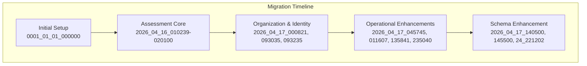
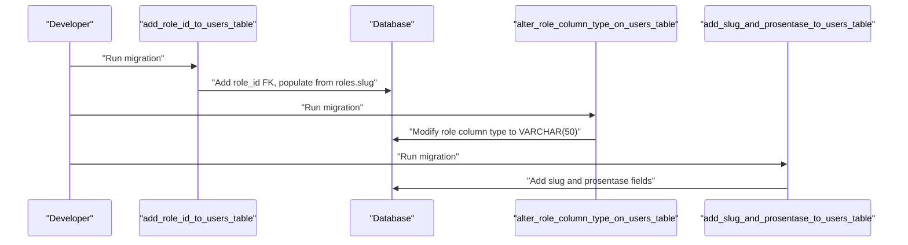
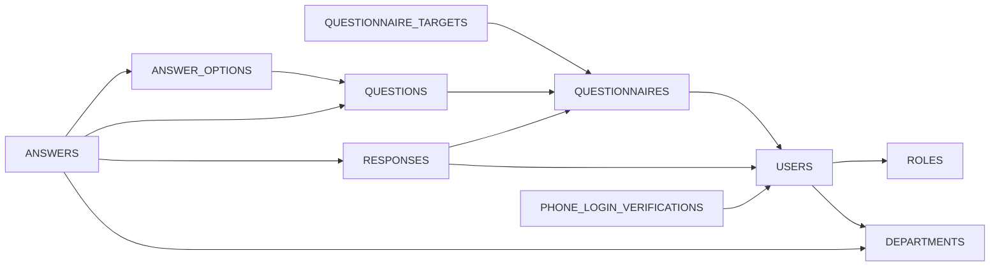

# Database Schema

<cite>
**Referenced Files in This Document**
- [0001_01_01_000000_create_users_table.php](file://database/migrations/0001_01_01_000000_create_users_table.php)
- [2026_04_16_010239_create_questionnaires_table.php](file://database/migrations/2026_04_16_010239_create_questionnaires_table.php)
- [2026_04_16_010240_create_questionnaire_targets_table.php](file://database/migrations/2026_04_16_010240_create_questionnaire_targets_table.php)
- [2026_04_16_010241_create_questions_table.php](file://database/migrations/2026_04_16_010241_create_questions_table.php)
- [2026_04_16_010242_create_answer_options_table.php](file://database/migrations/2026_04_16_010242_create_answer_options_table.php)
- [2026_04_16_020000_create_responses_table.php](file://database/migrations/2026_04_16_020000_create_responses_table.php)
- [2026_04_16_020100_create_answers_table.php](file://database/migrations/2026_04_16_020100_create_answers_table.php)
- [2026_04_17_000821_create_departements_table.php](file://database/migrations/2026_04_17_000821_create_departements_table.php)
- [2026_04_17_000854_add_department_id_to_users_table.php](file://database/migrations/2026_04_17_000854_add_department_id_to_users_table.php)
- [2026_04_17_011607_add_department_id_to_answers_and_answer_options_tables.php](file://database/migrations/2026_04_17_011607_add_department_id_to_answers_and_answer_options_tables.php)
- [2026_04_17_043615_add_phone_number_to_users_table.php](file://database/migrations/2026_04_17_043615_add_phone_number_to_users_table.php)
- [2026_04_17_045745_create_phone_login_verifications_table.php](file://database/migrations/2026_04_17_045745_create_phone_login_verifications_table.php)
- [2026_04_17_093035_create_roles_table.php](file://database/migrations/2026_04_17_093035_create_roles_table.php)
- [2026_04_17_093235_add_role_id_to_users_table.php](file://database/migrations/2026_04_17_093235_add_role_id_to_users_table.php)
- [2026_04_17_140500_alter_role_column_type_on_users_table.php](file://database/migrations/2026_04_17_140500_alter_role_column_type_on_users_table.php)
- [2026_04_17_145500_alter_target_group_column_type_on_questionnaire_targets_table.php](file://database/migrations/2026_04_17_145500_alter_target_group_column_type_on_questionnaire_targets_table.php)
- [2026_04_24_221202_add_slug_and_prosentase_to_users_table.php](file://database/migrations/2026_04_24_221202_add_slug_and_prosentase_to_users_table.php)
</cite>

## Update Summary
**Changes Made**
- Enhanced Users table schema documentation to include new slug and prosentase columns
- Updated Users table definition to reflect the addition of nullable slug field (100 characters) and decimal prosentase field (5,2 precision)
- Expanded role weighting system documentation to explain how prosentase values are inherited from roles
- Updated migration history to show the evolution from legacy role column to role_id foreign key with percentage weighting
- Added comprehensive coverage of the slug-based URL-friendly identification system

## Table of Contents
1. [Introduction](#introduction)
2. [Project Structure](#project-structure)
3. [Core Components](#core-components)
4. [Architecture Overview](#architecture-overview)
5. [Detailed Component Analysis](#detailed-component-analysis)
6. [Dependency Analysis](#dependency-analysis)
7. [Performance Considerations](#performance-considerations)
8. [Troubleshooting Guide](#troubleshooting-guide)
9. [Conclusion](#conclusion)
10. [Appendices](#appendices)

## Introduction
This document provides comprehensive database schema documentation for the assessment system. It covers all migration files, table definitions, foreign key constraints, indexes, and the evolution of the schema over time. The schema has been enhanced with improved user identification through slug fields and role weighting capabilities via prosentase percentages. It explains the relationships between core entities (users, departments, roles) and assessment entities (questionnaires, targets, questions, answer options, responses, answers).

## Project Structure
The database schema is defined via Laravel migrations under the database/migrations directory. The migration sequence demonstrates a deliberate evolution from basic user authentication to a sophisticated role-based system with percentage-weighted access control and departmental scoping.



**Diagram sources**
- [0001_01_01_000000_create_users_table.php:11-38](file://database/migrations/0001_01_01_000000_create_users_table.php#L11-L38)
- [2026_04_16_010239_create_questionnaires_table.php:11-21](file://database/migrations/2026_04_16_010239_create_questionnaires_table.php#L11-L21)
- [2026_04_17_093035_create_roles_table.php:14-22](file://database/migrations/2026_04_17_093035_create_roles_table.php#L14-L22)
- [2026_04_17_045745_create_phone_login_verifications_table.php:14-29](file://database/migrations/2026_04_17_045745_create_phone_login_verifications_table.php#L14-L29)
- [2026_04_24_221202_add_slug_and_prosentase_to_users_table.php:14-17](file://database/migrations/2026_04_24_221202_add_slug_and_prosentase_to_users_table.php#L14-L17)

## Core Components
This section summarizes each table's purpose, primary keys, and key constraints, with emphasis on the enhanced Users table schema.

### Users
- **Purpose**: Stores user accounts, authentication, sessions, and soft deletes with enhanced role identification and weighting capabilities.
- **Key constraints**: Unique email; timestamps, soft deletes.
- **Enhanced Columns**: 
  - `slug` (string, 100 chars, nullable) - URL-friendly identifier for user profiles and role-based routing
  - `prosentase` (decimal, 5,2, default 0) - Percentage weight inherited from role for access control and analytics
  - `role_id` (bigint, nullable, FK) - Foreign key linking to roles table for normalized role management
- **Indexes**: role_id (indexed), phone_number (indexed), **New**: slug (should be indexed for URL lookups)
- **Relationships**: Belongs to Roles (many-to-one), belongs to Departments (nullable), has many Responses and Created Questionnaires

### Roles
- **Purpose**: Defines user roles with slug-based lookup and percentage weight for access control and analytics.
- **Key constraints**: Unique name and slug; timestamps.
- **Enhanced Fields**: `prosentase` (decimal, 5,2, default 0) - Percentage weight representing role importance
- **Usage**: Users inherit role weights through role_id foreign key relationship

### Departments
- **Purpose**: Organizational units with ordering and description for departmental scoping.
- **Key constraints**: Unique name; urut indexed; timestamps.

### Assessment Entities
- **Questionnaires**: Assessment campaigns with status, dates, and creator relationships.
- **Questionnaire Targets**: Target groups per questionnaire with uniqueness constraints.
- **Questions**: Individual questions within questionnaires with order enforcement.
- **Answer Options**: Options for single-choice questions with optional scores.
- **Responses**: Submissions by users for questionnaires with draft/submitted lifecycle.
- **Answers**: Per-question answers within responses with calculated scores.

**Section sources**
- [0001_01_01_000000_create_users_table.php:13-38](file://database/migrations/0001_01_01_000000_create_users_table.php#L13-L38)
- [2026_04_17_093035_create_roles_table.php:14-22](file://database/migrations/2026_04_17_093035_create_roles_table.php#L14-L22)
- [2026_04_17_000821_create_departements_table.php:14-20](file://database/migrations/2026_04_17_000821_create_departements_table.php#L14-L20)
- [2026_04_24_221202_add_slug_and_prosentase_to_users_table.php:14-17](file://database/migrations/2026_04_24_221202_add_slug_and_prosentase_to_users_table.php#L14-L17)

## Architecture Overview
The assessment schema centers around Users, Roles, and Departments, with Questionnaires driving the assessment lifecycle. The enhanced Users table now supports slug-based identification and role weighting through prosentase percentages, enabling sophisticated access control and analytics capabilities.

```mermaid
erDiagram
USERS {
bigint id PK
string name
string email UK
string role
string phone_number
boolean is_active
bigint role_id FK
bigint department_id FK
string slug
decimal prosentase
timestamp email_verified_at
string password
remember_token
timestamps
soft_delete
}
ROLES {
bigint id PK
string name UK
string slug UK
text description
decimal prosentase
boolean is_active
timestamps
}
DEPARTMENTS {
bigint id PK
string name UK
uint urut
text description
timestamps
}
QUESTIONNAIRES {
bigint id PK
string title
text description
datetime start_date
datetime end_date
enum status
bigint created_by FK
timestamps
soft_delete
}
QUESTIONNAIRE_TARGETS {
bigint id PK
bigint questionnaire_id FK
string target_group
timestamps
}
QUESTIONS {
bigint id PK
bigint questionnaire_id FK
text question_text
enum type
boolean is_required
int order
timestamps
soft_delete
}
ANSWER_OPTIONS {
bigint id PK
bigint question_id FK
string option_text
int score
int order
timestamps
}
RESPONSES {
bigint id PK
bigint questionnaire_id FK
bigint user_id FK
datetime submitted_at
enum status
timestamps
soft_delete
}
ANSWERS {
bigint id PK
bigint response_id FK
bigint question_id FK
bigint answer_option_id FK
text essay_answer
int calculated_score
bigint department_id FK
timestamps
soft_delete
}
PHONE_LOGIN_VERIFICATIONS {
bigint id PK
bigint user_id FK
string country_code
string phone_e164
string verification_code_hash
tinyint attempt_count
tinyint max_attempts
datetime expires_at
datetime sent_at
datetime verified_at
string provider_message_id
string provider_status
text last_error
timestamps
}
USERS }o--|| ROLES : "has role"
USERS }o--|| DEPARTMENTS : "belongs to"
QUESTIONNAIRES }o--|| USERS : "created by"
QUESTIONNAIRE_TARGETS }o--|| QUESTIONNAIRES : "targets"
QUESTIONS }o--|| QUESTIONNAIRES : "contains"
ANSWER_OPTIONS }o--|| QUESTIONS : "options for"
RESPONSES }o--|| QUESTIONNAIRES : "submits"
RESPONSES }o--|| USERS : "by"
ANSWERS }o--|| RESPONSES : "part of"
ANSWERS }o--|| QUESTIONS : "answers"
ANSWERS }o--|| ANSWER_OPTIONS : "selects"
PHONE_LOGIN_VERIFICATIONS }o--|| USERS : "for"
```

**Diagram sources**
- [0001_01_01_000000_create_users_table.php:13-38](file://database/migrations/0001_01_01_000000_create_users_table.php#L13-L38)
- [2026_04_17_093035_create_roles_table.php:14-22](file://database/migrations/2026_04_17_093035_create_roles_table.php#L14-L22)
- [2026_04_17_000821_create_departements_table.php:14-20](file://database/migrations/2026_04_17_000821_create_departements_table.php#L14-L20)
- [2026_04_16_010239_create_questionnaires_table.php:11-21](file://database/migrations/2026_04_16_010239_create_questionnaires_table.php#L11-L21)
- [2026_04_16_010240_create_questionnaire_targets_table.php:11-18](file://database/migrations/2026_04_16_010240_create_questionnaire_targets_table.php#L11-L18)
- [2026_04_16_010241_create_questions_table.php:11-22](file://database/migrations/2026_04_16_010241_create_questions_table.php#L11-L22)
- [2026_04_16_010242_create_answer_options_table.php:11-20](file://database/migrations/2026_04_16_010242_create_answer_options_table.php#L11-L20)
- [2026_04_16_020000_create_responses_table.php:10-22](file://database/migrations/2026_04_16_020000_create_responses_table.php#L10-L22)
- [2026_04_16_020100_create_answers_table.php:10-22](file://database/migrations/2026_04_16_020100_create_answers_table.php#L10-L22)
- [2026_04_17_045745_create_phone_login_verifications_table.php:14-29](file://database/migrations/2026_04_17_045745_create_phone_login_verifications_table.php#L14-L29)
- [2026_04_24_221202_add_slug_and_prosentase_to_users_table.php:14-17](file://database/migrations/2026_04_24_221202_add_slug_and_prosentase_to_users_table.php#L14-L17)

## Detailed Component Analysis

### Users and Authentication Enhancement
The Users table has undergone significant enhancement to support modern role-based access control and URL-friendly identification:

#### Initial Schema (Legacy)
- Basic user authentication with email/password
- Simple role column (VARCHAR 50) for access control
- Support for sessions and password reset tokens

#### Enhanced Schema (Current)
- **Slug Field**: `slug` (string, 100 chars, nullable) - Provides URL-friendly identifiers for user profiles and role-based routing
- **Percentage Weighting**: `prosentase` (decimal, 5,2, default 0) - Inherits percentage weight from assigned role for access control calculations
- **Normalized Role Management**: `role_id` (bigint, nullable, FK) - Foreign key relationship to Roles table for improved data integrity
- **Index Optimization**: Maintains indexes on role_id and phone_number for performance

#### Migration Evolution Process


**Diagram sources**
- [2026_04_17_093235_add_role_id_to_users_table.php:15-29](file://database/migrations/2026_04_17_093235_add_role_id_to_users_table.php#L15-L29)
- [2026_04_17_140500_alter_role_column_type_on_users_table.php](file://database/migrations/2026_04_17_140500_alter_role_column_type_on_users_table.php)
- [2026_04_24_221202_add_slug_and_prosentase_to_users_table.php:14-17](file://database/migrations/2026_04_24_221202_add_slug_and_prosentase_to_users_table.php#L14-L17)

**Section sources**
- [0001_01_01_000000_create_users_table.php:13-38](file://database/migrations/0001_01_01_000000_create_users_table.php#L13-L38)
- [2026_04_17_093235_add_role_id_to_users_table.php:15-29](file://database/migrations/2026_04_17_093235_add_role_id_to_users_table.php#L15-L29)
- [2026_04_17_140500_alter_role_column_type_on_users_table.php](file://database/migrations/2026_04_17_140500_alter_role_column_type_on_users_table.php)
- [2026_04_24_221202_add_slug_and_prosentase_to_users_table.php:14-17](file://database/migrations/2026_04_24_221202_add_slug_and_prosentase_to_users_table.php#L14-L17)

### Roles and Percentage Weighting System
The Roles table provides the foundation for sophisticated access control through percentage-based weighting:

#### Role Definition
- **Unique Identifiers**: name (unique, 50 chars) and slug (unique, 50 chars) for flexible role management
- **Percentage Weighting**: `prosentase` (decimal, 5,2, default 0) - Represents role importance and access level
- **Active Status**: is_active flag for role lifecycle management

#### User-Role Relationship
- Users inherit role weights through the `role_id` foreign key relationship
- Percentage weights enable complex access control scenarios and analytics calculations
- The slug field enables URL-friendly role-based routing and identification

**Section sources**
- [2026_04_17_093035_create_roles_table.php:14-22](file://database/migrations/2026_04_17_093035_create_roles_table.php#L14-L22)
- [2026_04_24_221202_add_slug_and_prosentase_to_users_table.php:14-17](file://database/migrations/2026_04_24_221202_add_slug_and_prosentase_to_users_table.php#L14-L17)
- [app/Models/User.php:60-93](file://app/Models/User.php#L60-L93)

### Department and Scoping Enhancements
Departments provide organizational structure with enhanced scoping capabilities:

#### Department Structure
- Unique department names with ordering (urut) for hierarchical organization
- Description field for administrative purposes
- Timestamps for audit trail

#### Department-Scoped Content
- Users can be associated with departments through department_id
- Answers and Answer Options gain department_id for analytics and reporting
- Composite indexes support efficient department-based queries

**Section sources**
- [2026_04_17_000821_create_departements_table.php:14-20](file://database/migrations/2026_04_17_000821_create_departements_table.php#L14-L20)
- [2026_04_17_011607_add_department_id_to_answers_and_answer_options_tables.php:15-48](file://database/migrations/2026_04_17_011607_add_department_id_to_answers_and_answer_options_tables.php#L15-L48)

### Assessment Entity Relationships
The assessment lifecycle follows established patterns with enhanced user integration:

#### Questionnaire Lifecycle
- Questionnaires define assessment campaigns with status and date ranges
- Created_by relationship links to Users for auditability
- Soft deletes support data recovery and compliance

#### Response and Answer Processing
- Responses link users to questionnaires with composite unique constraints
- Answers support both essay and multiple-choice formats
- Calculated scores enable automated assessment processing

**Section sources**
- [2026_04_16_010239_create_questionnaires_table.php:11-21](file://database/migrations/2026_04_16_010239_create_questionnaires_table.php#L11-L21)
- [2026_04_16_020000_create_responses_table.php:10-22](file://database/migrations/2026_04_16_020000_create_responses_table.php#L10-L22)
- [2026_04_16_020100_create_answers_table.php:10-22](file://database/migrations/2026_04_16_020100_create_answers_table.php#L10-L22)

### Phone Login Verification
Enhanced authentication support through phone-based verification:

#### OTP Management
- Hashed verification codes for security
- Attempt limits and expiration for fraud prevention
- Provider integration tracking for SMS delivery

#### Index Optimization
- Indexed phone_e164 for fast lookups
- Indexed expires_at for cleanup operations
- Provider message ID tracking for delivery status

**Section sources**
- [2026_04_17_045745_create_phone_login_verifications_table.php:14-29](file://database/migrations/2026_04_17_045745_create_phone_login_verifications_table.php#L14-L29)

## Dependency Analysis
The enhanced schema maintains clear dependency relationships with improved normalization:



**Diagram sources**
- [2026_04_17_093235_add_role_id_to_users_table.php:15-22](file://database/migrations/2026_04_17_093235_add_role_id_to_users_table.php#L15-L22)
- [2026_04_16_010239_create_questionnaires_table.php](file://database/migrations/2026_04_16_010239_create_questionnaires_table.php#L18)
- [2026_04_16_010240_create_questionnaire_targets_table.php](file://database/migrations/2026_04_16_010240_create_questionnaire_targets_table.php#L13)
- [2026_04_16_010241_create_questions_table.php](file://database/migrations/2026_04_16_010241_create_questions_table.php#L13)
- [2026_04_16_010242_create_answer_options_table.php](file://database/migrations/2026_04_16_010242_create_answer_options_table.php#L13)
- [2026_04_16_020000_create_responses_table.php:12-13](file://database/migrations/2026_04_16_020000_create_responses_table.php#L12-L13)
- [2026_04_16_020100_create_answers_table.php:12-14](file://database/migrations/2026_04_16_020100_create_answers_table.php#L12-L14)
- [2026_04_17_045745_create_phone_login_verifications_table.php](file://database/migrations/2026_04_17_045745_create_phone_login_verifications_table.php#L16)

**Section sources**
- [2026_04_17_093235_add_role_id_to_users_table.php:15-22](file://database/migrations/2026_04_17_093235_add_role_id_to_users_table.php#L15-L22)
- [2026_04_17_000854_add_department_id_to_users_table.php:14-20](file://database/migrations/2026_04_17_000854_add_department_id_to_users_table.php#L14-L20)
- [2026_04_16_010239_create_questionnaires_table.php](file://database/migrations/2026_04_16_010239_create_questionnaires_table.php#L18)
- [2026_04_16_010240_create_questionnaire_targets_table.php](file://database/migrations/2026_04_16_010240_create_questionnaire_targets_table.php#L13)
- [2026_04_16_010241_create_questions_table.php](file://database/migrations/2026_04_16_010241_create_questions_table.php#L13)
- [2026_04_16_010242_create_answer_options_table.php](file://database/migrations/2026_04_16_010242_create_answer_options_table.php#L13)
- [2026_04_16_020000_create_responses_table.php:12-13](file://database/migrations/2026_04_16_020000_create_responses_table.php#L12-L13)
- [2026_04_16_020100_create_answers_table.php:12-14](file://database/migrations/2026_04_16_020100_create_answers_table.php#L12-L14)
- [2026_04_17_045745_create_phone_login_verifications_table.php](file://database/migrations/2026_04_17_045745_create_phone_login_verifications_table.php#L16)

## Performance Considerations
Enhanced indexing strategy supports the new slug and prosentase features:

### Index Strategy
- **Users Table**: 
  - role_id (indexed) - for role-based queries
  - phone_number (indexed) - for authentication lookups
  - **New**: slug (should be indexed) - for URL-friendly user lookups
- **Responses**: indexes on questionnaire_id and user_id; composite unique on (questionnaire_id, user_id)
- **Answers**: index on question_id; unique on (response_id, question_id)
- **Answers and Answer Options**: composite indexes on (department_id, created_at) and (department_id, order)
- **Phone Login Verifications**: indexes on phone_e164, expires_at, provider_message_id

### Data Type Optimizations
- **Decimal Precision**: prosentase uses decimal(5,2) for precise percentage calculations
- **String Lengths**: slug (100 chars) and role (50 chars) accommodate various naming conventions
- **Soft Deletes**: Used across assessment entities for data recovery and audit trails

### Cascading Operations
- Cascade deletes from questionnaires to dependent entities
- Cascade deletes from responses to answers
- Proper foreign key constraints maintain referential integrity

## Troubleshooting Guide
Common issues and resolutions for the enhanced schema:

### Role Migration Issues
- **Symptom**: role_id remains null after migration
- **Cause**: Missing roles table or slug mismatch
- **Resolution**: Verify roles exist with matching slugs and re-run migration

### Slug Field Issues
- **Symptom**: URL routing failures or slug conflicts
- **Cause**: Missing or duplicate slug values
- **Resolution**: Ensure slug field is populated with unique, URL-friendly values; consider adding unique constraint

### Percentage Weight Issues
- **Symptom**: Incorrect role-based permissions or analytics calculations
- **Cause**: Invalid prosentase values outside expected range
- **Resolution**: Verify prosentase values are within 0-100 range and properly cast as decimal

### Department Scoping Issues
- **Symptom**: Analytics queries return unexpected results
- **Cause**: department_id not set on answers/options
- **Resolution**: Ensure department_id is populated during backfills or inserts

**Section sources**
- [2026_04_17_093235_add_role_id_to_users_table.php:24-29](file://database/migrations/2026_04_17_093235_add_role_id_to_users_table.php#L24-L29)
- [2026_04_24_221202_add_slug_and_prosentase_to_users_table.php:14-17](file://database/migrations/2026_04_24_221202_add_slug_and_prosentase_to_users_table.php#L14-L17)

## Conclusion
The assessment database schema has evolved to support modern role-based access control with enhanced user identification and weighting capabilities. The addition of slug and prosentase fields in the Users table enables URL-friendly identification and sophisticated percentage-based access control. The normalized relationship with the Roles table provides scalable role management with inheritance of percentage weights. Combined with departmental scoping and comprehensive indexing strategies, the schema supports both current functionality and future expansion requirements.

## Appendices

### Migration History and Evolution
The migration sequence demonstrates a deliberate progression from basic authentication to sophisticated role-based systems:

#### Phase 1: Foundation (0001_01_01_000000)
- Initial users, password reset tokens, and sessions creation

#### Phase 2: Assessment Core (2026_04_16_010239-020100)
- Complete assessment lifecycle entities (questionnaires, targets, questions, answers)

#### Phase 3: Organization & Identity (2026_04_17_000821, 093035, 093235)
- Departments, roles, and user-role relationships established

#### Phase 4: Operational Enhancements (2026_04_17_045745, 011607, 135841, 235040)
- Phone login verification, department scoping, and column type adjustments

#### Phase 5: Schema Enhancement (2026_04_17_140500, 145500, 24_221202)
- Role column type modification, slug and prosentase field additions for improved user identification and role weighting

**Section sources**
- [0001_01_01_000000_create_users_table.php:11-38](file://database/migrations/0001_01_01_000000_create_users_table.php#L11-L38)
- [2026_04_16_010239_create_questionnaires_table.php:11-21](file://database/migrations/2026_04_16_010239_create_questionnaires_table.php#L11-L21)
- [2026_04_17_093035_create_roles_table.php:14-22](file://database/migrations/2026_04_17_093035_create_roles_table.php#L14-L22)
- [2026_04_17_045745_create_phone_login_verifications_table.php:14-29](file://database/migrations/2026_04_17_045745_create_phone_login_verifications_table.php#L14-L29)
- [2026_04_24_221202_add_slug_and_prosentase_to_users_table.php:14-17](file://database/migrations/2026_04_24_221202_add_slug_and_prosentase_to_users_table.php#L14-L17)