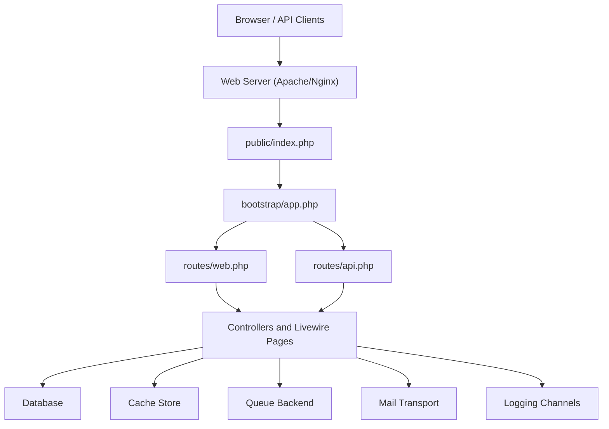
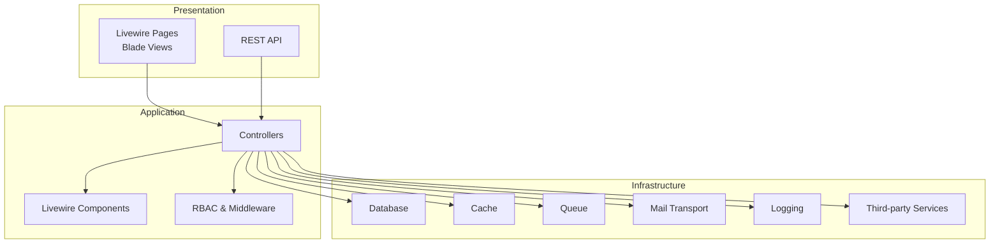
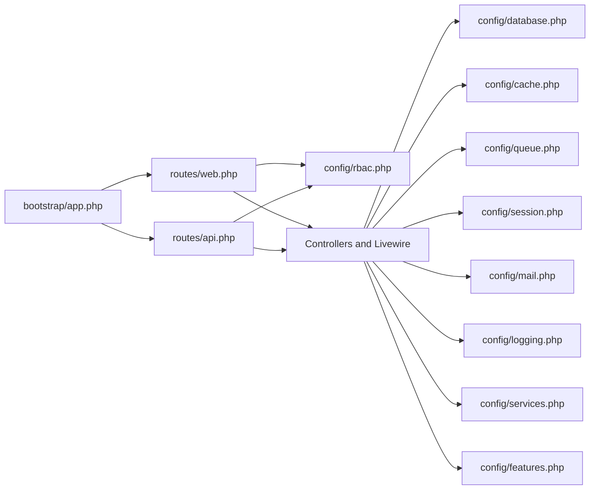

# Deployment & Configuration

<cite>
**Referenced Files in This Document**
- [composer.json](file://composer.json)
- [config/app.php](file://config/app.php)
- [config/database.php](file://config/database.php)
- [config/cache.php](file://config/cache.php)
- [config/queue.php](file://config/queue.php)
- [config/session.php](file://config/session.php)
- [config/mail.php](file://config/mail.php)
- [config/logging.php](file://config/logging.php)
- [config/services.php](file://config/services.php)
- [config/features.php](file://config/features.php)
- [config/rbac.php](file://config/rbac.php)
- [routes/web.php](file://routes/web.php)
- [routes/api.php](file://routes/api.php)
- [bootstrap/app.php](file://bootstrap/app.php)
- [public/.htaccess](file://public/.htaccess)
</cite>

## Table of Contents
1. [Introduction](#introduction)
2. [Project Structure](#project-structure)
3. [Core Components](#core-components)
4. [Architecture Overview](#architecture-overview)
5. [Detailed Component Analysis](#detailed-component-analysis)
6. [Dependency Analysis](#dependency-analysis)
7. [Performance Considerations](#performance-considerations)
8. [Troubleshooting Guide](#troubleshooting-guide)
9. [Conclusion](#conclusion)
10. [Appendices](#appendices)

## Introduction
This document provides comprehensive deployment and configuration guidance for the assessment platform. It covers production environment setup, server requirements, security configurations, environment variables, database and cache settings, deployment strategies, backup procedures, monitoring setup, performance optimization, scaling considerations, maintenance procedures, and troubleshooting for common deployment issues.

## Project Structure
The application is a Laravel 13 project with Livewire 4 components, routing for admin and evaluator dashboards, and integrated WhatsApp Business messaging capabilities. The runtime entrypoint is the web server’s rewrite rules pointing to the front controller, while API routes are protected by role-based middleware.

**Diagram sources**
- [public/.htaccess:1-26](file://public/.htaccess#L1-L26)
- [bootstrap/app.php:10-36](file://bootstrap/app.php#L10-L36)
- [routes/web.php:1-161](file://routes/web.php#L1-L161)
- [routes/api.php:1-14](file://routes/api.php#L1-L14)

**Section sources**
- [public/.htaccess:1-26](file://public/.htaccess#L1-L26)
- [bootstrap/app.php:10-36](file://bootstrap/app.php#L10-L36)
- [routes/web.php:1-161](file://routes/web.php#L1-L161)
- [routes/api.php:1-14](file://routes/api.php#L1-L14)

## Core Components
- Application configuration and environment variables are centralized in configuration files under config/.
- Database, cache, queue, session, mail, logging, and third-party services are configured via dedicated config files.
- RBAC and middleware aliases are defined to enforce role-based access control.
- Routing groups apply authentication and role-based middleware to admin and evaluator sections.
- Composer scripts automate setup, development, and CI checks.

Key configuration areas:
- Application identity, environment, debug, URL, timezone, locale, encryption key, and maintenance mode.
- Database connections (SQLite, MySQL/MariaDB, PostgreSQL, SQL Server) and Redis options.
- Cache stores (database, file, memcached, redis, dynamodb, octane, failover).
- Queue backends (sync, database, beanstalkd, SQS, redis) and failed job storage.
- Session driver, lifetime, cookie policy, and store selection.
- Mail transport configuration and global sender settings.
- Logging channels and deprecation handling.
- Third-party services (Postmark, SES, Slack, WhatsApp, WhatsApp Business).
- Feature flags for questionnaire and login modes.

**Section sources**
- [config/app.php:16-139](file://config/app.php#L16-L139)
- [config/database.php:20-184](file://config/database.php#L20-L184)
- [config/cache.php:18-130](file://config/cache.php#L18-L130)
- [config/queue.php:16-129](file://config/queue.php#L16-L129)
- [config/session.php:21-233](file://config/session.php#L21-L233)
- [config/mail.php:17-118](file://config/mail.php#L17-L118)
- [config/logging.php:21-132](file://config/logging.php#L21-L132)
- [config/services.php:17-53](file://config/services.php#L17-L53)
- [config/features.php:4-6](file://config/features.php#L4-L6)
- [config/rbac.php:31-40](file://config/rbac.php#L31-L40)

## Architecture Overview
The platform uses a layered architecture:
- Presentation: Blade/Livewire pages and API endpoints.
- Application: Controllers and Livewire components.
- Infrastructure: Database, cache, queue, mail, logging, and external services.

**Diagram sources**
- [routes/web.php:1-161](file://routes/web.php#L1-L161)
- [routes/api.php:1-14](file://routes/api.php#L1-L14)
- [config/rbac.php:31-40](file://config/rbac.php#L31-L40)
- [config/database.php:33-117](file://config/database.php#L33-L117)
- [config/cache.php:35-102](file://config/cache.php#L35-L102)
- [config/queue.php:32-92](file://config/queue.php#L32-L92)
- [config/mail.php:38-100](file://config/mail.php#L38-L100)
- [config/logging.php:53-130](file://config/logging.php#L53-L130)
- [config/services.php:38-51](file://config/services.php#L38-L51)

## Detailed Component Analysis

### Environment Variables and Configuration Matrix
Below is a consolidated matrix of environment variables grouped by configuration file and purpose. Use this to populate your .env during deployment.

- Application
  - APP_NAME, APP_ENV, APP_DEBUG, APP_URL, APP_TIMEZONE, APP_LOCALE, APP_FALLBACK_LOCALE, APP_FAKER_LOCALE, APP_KEY, APP_PREVIOUS_KEYS, APP_MAINTENANCE_DRIVER, APP_MAINTENANCE_STORE

- Database
  - DB_CONNECTION, DB_URL, DB_HOST, DB_PORT, DB_DATABASE, DB_USERNAME, DB_PASSWORD, DB_SOCKET, DB_CHARSET, DB_COLLATION, DB_CACHE_CONNECTION, DB_CACHE_TABLE, DB_CACHE_LOCK_CONNECTION, DB_CACHE_LOCK_TABLE, DB_QUEUE_CONNECTION, DB_QUEUE_TABLE, DB_QUEUE, DB_QUEUE_RETRY_AFTER, DB_QUEUE_LOCK_TABLE

- Redis
  - REDIS_CLIENT, REDIS_CLUSTER, REDIS_PREFIX, REDIS_PERSISTENT, REDIS_URL, REDIS_HOST, REDIS_USERNAME, REDIS_PASSWORD, REDIS_PORT, REDIS_DB, REDIS_MAX_RETRIES, REDIS_BACKOFF_ALGORITHM, REDIS_BACKOFF_BASE, REDIS_BACKOFF_CAP, REDIS_CACHE_CONNECTION, REDIS_CACHE_LOCK_CONNECTION

- Cache
  - CACHE_STORE, CACHE_PREFIX, DB_CACHE_CONNECTION, DB_CACHE_TABLE, DB_CACHE_LOCK_CONNECTION, DB_CACHE_LOCK_TABLE, MEMCACHED_HOST, MEMCACHED_PORT, MEMCACHED_USERNAME, MEMCACHED_PASSWORD, AWS_ACCESS_KEY_ID, AWS_SECRET_ACCESS_KEY, AWS_DEFAULT_REGION, DYNAMODB_CACHE_TABLE, DYNAMODB_ENDPOINT

- Queue
  - QUEUE_CONNECTION, DB_QUEUE_CONNECTION, DB_QUEUE_TABLE, DB_QUEUE, DB_QUEUE_RETRY_AFTER, BEANSTALKD_QUEUE_HOST, SQS_PREFIX, SQS_QUEUE, SQS_SUFFIX, AWS_ACCESS_KEY_ID, AWS_SECRET_ACCESS_KEY, AWS_DEFAULT_REGION, REDIS_QUEUE_CONNECTION, REDIS_QUEUE, REDIS_QUEUE_RETRY_AFTER, QUEUE_FAILED_DRIVER, DB_CONNECTION, FAILED_JOBS_TABLE

- Session
  - SESSION_DRIVER, SESSION_LIFETIME, SESSION_EXPIRE_ON_CLOSE, SESSION_ENCRYPT, SESSION_CONNECTION, SESSION_TABLE, SESSION_STORE, SESSION_COOKIE, SESSION_PATH, SESSION_DOMAIN, SESSION_SECURE_COOKIE, SESSION_HTTP_ONLY, SESSION_SAME_SITE, SESSION_PARTITIONED_COOKIE

- Mail
  - MAIL_MAILER, MAIL_URL, MAIL_SCHEME, MAIL_HOST, MAIL_PORT, MAIL_USERNAME, MAIL_PASSWORD, MAIL_EHLO_DOMAIN, MAIL_LOG_CHANNEL, MAIL_FROM_ADDRESS, MAIL_FROM_NAME, AWS_ACCESS_KEY_ID, AWS_SECRET_ACCESS_KEY, AWS_DEFAULT_REGION

- Logging
  - LOG_CHANNEL, LOG_DEPRECATIONS_CHANNEL, LOG_DEPRECATIONS_TRACE, LOG_STACK, LOG_LEVEL, LOG_DAILY_DAYS, LOG_SLACK_WEBHOOK_URL, LOG_SLACK_USERNAME, LOG_SLACK_EMOJI, LOG_PAPERTRAIL_URL, LOG_PAPERTRAIL_PORT, LOG_STDERR_FORMATTER, LOG_SYSLOG_FACILITY

- Services
  - POSTMARK_API_KEY, RESEND_API_KEY, AWS_ACCESS_KEY_ID, AWS_SECRET_ACCESS_KEY, AWS_DEFAULT_REGION, SLACK_BOT_USER_OAUTH_TOKEN, SLACK_BOT_USER_DEFAULT_CHANNEL, WHATSAPP_ENABLED, WHATSAPP_BASE_URL, WHATSAPP_TOKEN, WA_BUSINESS_ENABLED, WA_BUSINESS_BASE_URL, WA_BUSINESS_MESSAGES_ENDPOINT, WA_BUSINESS_ACCESS_TOKEN, WA_BUSINESS_TEMPLATE, WA_BUSINESS_WEBHOOK_VERIFY_TOKEN

- Features
  - FEATURE_QUESTIONNAIRE_SINGLE_MODE, FEATURE_LOGIN_MODE

- RBAC and Middleware Aliases
  - RBAC middleware aliases and route prefixes are applied via configuration.

**Section sources**
- [config/app.php:16-139](file://config/app.php#L16-L139)
- [config/database.php:20-184](file://config/database.php#L20-L184)
- [config/cache.php:18-130](file://config/cache.php#L18-L130)
- [config/queue.php:16-129](file://config/queue.php#L16-L129)
- [config/session.php:21-233](file://config/session.php#L21-L233)
- [config/mail.php:17-118](file://config/mail.php#L17-L118)
- [config/logging.php:21-132](file://config/logging.php#L21-L132)
- [config/services.php:17-53](file://config/services.php#L17-L53)
- [config/features.php:4-6](file://config/features.php#L4-L6)
- [config/rbac.php:31-40](file://config/rbac.php#L31-L40)

### Security Configuration
- CSRF handling: CSRF tokens are validated except for the WhatsApp webhook endpoint.
- Authentication: Routes apply auth middleware and role gates; guest routes are restricted.
- Session security: Secure, HttpOnly, SameSite, and optional partitioned cookies can be enabled via environment variables.
- Encryption: Application key must be set; previous keys are supported for rotation.
- Maintenance mode: Controlled via file or cache driver with a configurable store.

Recommended production hardening:
- Enable HTTPS and set APP_URL to HTTPS.
- Set SESSION_SECURE_COOKIE=true and SESSION_SAME_SITE="strict".
- Configure proper firewall and rate limits for login endpoints.
- Rotate APP_KEY periodically and update APP_PREVIOUS_KEYS accordingly.

**Section sources**
- [bootstrap/app.php:30-32](file://bootstrap/app.php#L30-L32)
- [routes/web.php:41-70](file://routes/web.php#L41-L70)
- [config/session.php:172-202](file://config/session.php#L172-L202)
- [config/app.php:113-137](file://config/app.php#L113-L137)

### Database Configuration
Supported drivers: SQLite, MySQL/MariaDB, PostgreSQL, SQL Server. SSL/TLS options are available for MySQL/MariaDB and PostgreSQL. Redis is used for caching and queues.

Production recommendations:
- Use MySQL/MariaDB or PostgreSQL for production.
- Enable SSL/TLS for remote database connections.
- Separate databases or schemas for cache and queues if needed.
- Use Redis for high-throughput cache and queue workloads.

**Section sources**
- [config/database.php:20-117](file://config/database.php#L20-L117)
- [config/database.php:146-182](file://config/database.php#L146-L182)

### Cache Configuration
Default cache store is database. Additional options include file, memcached, redis, dynamodb, octane, failover, and null. Key prefixing helps isolate environments.

Production recommendations:
- Use Redis for distributed cache and lock stores.
- Set CACHE_PREFIX per environment to avoid key collisions.
- Consider failover cache store for resilience.

**Section sources**
- [config/cache.php:18-130](file://config/cache.php#L18-L130)

### Queue Configuration
Default queue backend is database. Other options include sync, beanstalkd, SQS, and redis. Failed job storage is configurable.

Production recommendations:
- Use Redis or SQS for scalable asynchronous processing.
- Configure retry policies and dead-letter handling.
- Monitor failed jobs and alert on spikes.

**Section sources**
- [config/queue.php:16-129](file://config/queue.php#L16-L129)

### Session Configuration
Default driver is database. Supports file, cookie, database, memcached, redis, dynamodb, and array. Cookie policy and lifetime are configurable.

Production recommendations:
- Use database or redis-backed sessions for scalability.
- Set secure and same-site policies for session cookies.
- Tune SESSION_LIFETIME and lottery settings for cleanup.

**Section sources**
- [config/session.php:21-233](file://config/session.php#L21-L233)

### Mail Configuration
Default mailer is log. Supported transports include smtp, ses, postmark, resend, sendmail, log, array, failover, and roundrobin. Global sender settings are configurable.

Production recommendations:
- Use SES, Postmark, or Resend for reliable delivery.
- Configure failover mailers for redundancy.
- Set MAIL_FROM_ADDRESS and MAIL_FROM_NAME appropriately.

**Section sources**
- [config/mail.php:17-118](file://config/mail.php#L17-L118)

### Logging Configuration
Default channel is stack. Supported channels include single, daily, slack, syslog, stderr, papertrail, and more. Deprecations can be logged with optional tracing.

Production recommendations:
- Use daily or slack channels for production logs.
- Integrate Papertrail or similar for centralized logging.
- Set LOG_LEVEL to appropriate severity.

**Section sources**
- [config/logging.php:21-132](file://config/logging.php#L21-L132)

### Third-Party Services
- WhatsApp and WhatsApp Business integrations are configurable with base URLs, tokens, and webhook verification.
- Slack notifications support bot tokens and default channels.
- AWS credentials enable SES/SQS integrations.

Production recommendations:
- Store secrets in environment variables or a secret manager.
- Validate webhook endpoints and signatures for security.

**Section sources**
- [config/services.php:38-51](file://config/services.php#L38-L51)

### Feature Flags
- Single-questionnaire mode and login mode (password, whatsapp, both) are configurable.

**Section sources**
- [config/features.php:4-6](file://config/features.php#L4-L6)

### RBAC and Middleware
- Middleware aliases for admin, evaluator, role gate, and role redirect are configurable.
- Admin and evaluator routes are guarded by these middleware and throttled endpoints are defined.

**Section sources**
- [config/rbac.php:31-40](file://config/rbac.php#L31-L40)
- [routes/web.php:72-147](file://routes/web.php#L72-L147)

## Dependency Analysis
The application depends on configuration-driven components. The bootstrapper wires routing and middleware, while configuration files define infrastructure backends.

**Diagram sources**
- [bootstrap/app.php:10-36](file://bootstrap/app.php#L10-L36)
- [routes/web.php:1-161](file://routes/web.php#L1-L161)
- [routes/api.php:1-14](file://routes/api.php#L1-L14)
- [config/rbac.php:31-40](file://config/rbac.php#L31-L40)
- [config/database.php:20-184](file://config/database.php#L20-L184)
- [config/cache.php:18-130](file://config/cache.php#L18-L130)
- [config/queue.php:16-129](file://config/queue.php#L16-L129)
- [config/session.php:21-233](file://config/session.php#L21-L233)
- [config/mail.php:17-118](file://config/mail.php#L17-L118)
- [config/logging.php:21-132](file://config/logging.php#L21-L132)
- [config/services.php:17-53](file://config/services.php#L17-L53)
- [config/features.php:4-6](file://config/features.php#L4-L6)

**Section sources**
- [bootstrap/app.php:10-36](file://bootstrap/app.php#L10-L36)
- [routes/web.php:1-161](file://routes/web.php#L1-L161)
- [routes/api.php:1-14](file://routes/api.php#L1-L14)
- [config/rbac.php:31-40](file://config/rbac.php#L31-L40)

## Performance Considerations
- Use Redis for cache and queues to reduce database load.
- Enable database and redis cache stores with appropriate prefixes.
- Tune queue retry and block settings for throughput.
- Use database-backed sessions for persistence and scalability.
- Optimize database queries and add indexes as needed.
- Enable HTTP caching headers and CDN for static assets.
- Monitor queue backlog and cache hit rates.

[No sources needed since this section provides general guidance]

## Troubleshooting Guide
Common deployment issues and resolutions:
- Application key missing or invalid
  - Ensure APP_KEY is set and matches the encryption configuration.
  - Use the key generation script from Composer setup.
- Database connectivity failures
  - Verify DB_CONNECTION and credentials; test SSL/TLS settings for MySQL/MariaDB and PostgreSQL.
- Cache/store misconfiguration
  - Confirm CACHE_STORE and Redis connection settings; check prefixes and lock tables.
- Queue worker not processing jobs
  - Ensure QUEUE_CONNECTION is set; run queue listeners and monitor failed jobs.
- Session issues after deployment
  - Check SESSION_DRIVER and cookie policy; confirm database session table exists.
- Mail delivery problems
  - Validate mailer settings and credentials; use failover configuration for reliability.
- Logging not captured
  - Set LOG_CHANNEL and LOG_LEVEL; verify stack composition and handler paths.
- WhatsApp webhook not triggered
  - Confirm webhook URL and verify token; ensure CSRF exceptions are configured for the endpoint.
- Rate limiting on login endpoints
  - Adjust throttle limits in routes for production traffic.

**Section sources**
- [composer.json:37-44](file://composer.json#L37-L44)
- [config/app.php:113-119](file://config/app.php#L113-L119)
- [config/database.php:20-117](file://config/database.php#L20-L117)
- [config/cache.php:18-130](file://config/cache.php#L18-L130)
- [config/queue.php:16-129](file://config/queue.php#L16-L129)
- [config/session.php:21-233](file://config/session.php#L21-L233)
- [config/mail.php:17-118](file://config/mail.php#L17-L118)
- [config/logging.php:21-132](file://config/logging.php#L21-L132)
- [config/services.php:38-51](file://config/services.php#L38-L51)
- [routes/web.php:41-55](file://routes/web.php#L41-L55)

## Conclusion
This guide outlines a production-ready deployment strategy for the assessment platform, covering environment setup, security hardening, infrastructure configuration, operational procedures, and troubleshooting. Adhering to the configuration matrices and recommendations herein will help ensure a robust, scalable, and maintainable deployment.

[No sources needed since this section summarizes without analyzing specific files]

## Appendices

### Deployment Strategies
- Immutable deployments: Build artifacts and deploy via CI/CD with zero-downtime strategies.
- Blue-green or rolling updates: Switch traffic after health checks pass.
- Canary releases: Gradually shift traffic to new versions.

### Backup Procedures
- Database: Schedule regular logical backups for MySQL/MariaDB/PostgreSQL; retain rotation policy.
- Cache: Back up Redis snapshots or export RDB/AOF as applicable.
- Sessions: Preserve session store data if using database or redis.
- Logs: Archive logs off-box; retain retention policy.

### Monitoring Setup
- Health endpoint: Use the built-in health route for uptime checks.
- Metrics: Track queue depth, cache hit ratio, database query latency, and error rates.
- Alerts: Notify on failed jobs, cache misses, and high latency.

### Scaling Considerations
- Horizontal scaling: Stateless application behind load balancers; scale workers independently.
- Caching: Use Redis cluster for cache and pub/sub.
- Queues: Use SQS or Redis for decoupled processing.
- Sessions: Use redis or database-backed sessions for distributed state.

### Maintenance Procedures
- Regular migrations: Keep schema synchronized across environments.
- Dependency updates: Review and test Composer and NPM updates.
- Security patches: Monitor and apply PHP, Laravel, and package updates promptly.

[No sources needed since this section provides general guidance]