# Admin Components

<cite>
**Referenced Files in This Document**
- [AdminDashboard.php](file://app/Livewire/Admin/AdminDashboard.php)
- [DepartmentDirectory.php](file://app/Livewire/Admin/DepartmentDirectory.php)
- [UserDirectory.php](file://app/Livewire/Admin/UserDirectory.php)
- [RoleDirectory.php](file://app/Livewire/Admin/RoleDirectory.php)
- [QuestionManager.php](file://app/Livewire/Admin/QuestionManager.php)
- [QuestionnaireForm.php](file://app/Livewire/Admin/QuestionnaireForm.php)
- [QuestionnaireList.php](file://app/Livewire/Admin/QuestionnaireList.php)
- [QuestionnaireAssignment.php](file://app/Livewire/Admin/QuestionnaireAssignment.php)
- [AvailableQuestionnaires.php](file://app/Livewire/Fill/AvailableQuestionnaires.php)
- [admin-dashboard.blade.php](file://resources/views/livewire/admin/admin-dashboard.blade.php)
- [department-directory.blade.php](file://resources/views/livewire/admin/department-directory.blade.php)
- [user-directory.blade.php](file://resources/views/livewire/admin/user-directory.blade.php)
- [role-directory.blade.php](file://resources/views/livewire/admin/role-directory.blade.php)
- [question-manager.blade.php](file://resources/views/livewire/admin/question-manager.blade.php)
- [questionnaire-form.blade.php](file://resources/views/livewire/admin/questionnaire-form.blade.php)
- [questionnaire-list.blade.php](file://resources/views/livewire/admin/questionnaire-list.blade.php)
- [questionnaire-assignment.blade.php](file://resources/views/livewire/admin/questionnaire-assignment.blade.php)
- [Departement.php](file://app/Models/Departement.php)
- [Role.php](file://app/Models/Role.php)
- [User.php](file://app/Models/User.php)
- [Questionnaire.php](file://app/Models/Questionnaire.php)
- [Question.php](file://app/Models/Question.php)
- [AnswerOption.php](file://app/Models/AnswerOption.php)
- [QuestionnaireTarget.php](file://app/Models/QuestionnaireTarget.php)
- [Response.php](file://app/Models/Response.php)
- [QuestionnaireScorer.php](file://app/Services/QuestionnaireScorer.php)
- [DepartmentAnalyticsService.php](file://app/Services/DepartmentAnalyticsService.php)
- [EnsureUserIsAdmin.php](file://app/Http/Middleware/EnsureUserIsAdmin.php)
- [EnsureUserHasRole.php](file://app/Http/Middleware/EnsureUserHasRole.php)
- [RedirectByRole.php](file://app/Http/Middleware/RedirectByRole.php)
- [StoreDepartementRequest.php](file://app/Http/Requests/StoreDepartementRequest.php)
- [UpdateDepartementRequest.php](file://app/Http/Requests/UpdateDepartementRequest.php)
- [StoreUserRequest.php](file://app/Http/Requests/StoreUserRequest.php)
- [UpdateUserRequest.php](file://app/Http/Requests/UpdateUserRequest.php)
- [StoreQuestionnaireRequest.php](file://app/Http/Requests/StoreQuestionnaireRequest.php)
- [UpdateQuestionnaireRequest.php](file://app/Http/Requests/UpdateQuestionnaireRequest.php)
- [StoreQuestionRequest.php](file://app/Http/Requests/StoreQuestionRequest.php)
- [UpdateQuestionRequest.php](file://app/Http/Requests/UpdateQuestionRequest.php)
- [rbac.php](file://config/rbac.php)
- [admin.blade.php](file://resources/views/layouts/admin.blade.php)
- [2026_04_16_010240_create_questionnaire_targets_table.php](file://database/migrations/2026_04_16_010240_create_questionnaire_targets_table.php)
- [2026_04_21_020644_add_time_limit_and_filling_started_at_to_users_table.php](file://database/migrations/2026_04_21_020644_add_time_limit_and_filling_started_at_to_users_table.php)
</cite>

## Update Summary
**Changes Made**
- Enhanced QuestionManager component with new defaultOptions() method providing predefined Indonesian rating scale options
- Improved default option generation system with automatic application when creating new questions with selectable options
- Updated component behavior to include enhanced default option management for better user experience
- Added comprehensive Indonesian rating scale with predefined options: "Sangat Tidak Setuju" (1), "Tidak Setuju" (2), "Netral" (3), "Setuju" (4), "Sangat Setuju" (5)

## Table of Contents
1. [Introduction](#introduction)
2. [Project Structure](#project-structure)
3. [Core Components](#core-components)
4. [Architecture Overview](#architecture-overview)
5. [Detailed Component Analysis](#detailed-component-analysis)
6. [Dependency Analysis](#dependency-analysis)
7. [Performance Considerations](#performance-considerations)
8. [Troubleshooting Guide](#troubleshooting-guide)
9. [Conclusion](#conclusion)
10. [Appendices](#appendices)

## Introduction
This document describes the admin-focused Livewire components that power the assessment platform. It covers the admin dashboard, department management, user administration, role management, and questionnaire lifecycle management (creation, editing, assignment, analytics). The questionnaire management system has been significantly enhanced with comprehensive target group filtering capabilities, allowing administrators to filter questionnaires by target groups, assign target groups dynamically, and manage questionnaire access controls more effectively. The UserDirectory component has also been enhanced with time limit management capabilities, enabling administrators to set individual time limits for users, reset user fill sessions, and manage time-based access controls. The QuestionManager component has been enhanced with intelligent default option generation for Indonesian rating scales, improving the user experience when creating questions with selectable answer options.

## Project Structure
The admin components are organized under the Livewire Admin namespace and paired with Blade views. They integrate with middleware for role-based access control and leverage Laravel requests for validation. The questionnaire management system now includes advanced target group filtering and dynamic option management, while the UserDirectory component includes advanced time limit management features integrated with the questionnaire filling system. The QuestionManager component now includes intelligent default option generation for Indonesian rating scales.

```mermaid
graph TB
subgraph "Enhanced Livewire Admin Components"
AD["AdminDashboard"]
DDir["DepartmentDirectory"]
UDir["UserDirectory<br/>+ Time Limit Management"]
RDir["RoleDirectory"]
QForm["QuestionnaireForm<br/>+ Dynamic Target Groups"]
QList["QuestionnaireList<br/>+ Target Group Filtering"]
QAssign["QuestionnaireAssignment<br/>+ Dynamic Options"]
QMgr["QuestionManager<br/>+ Default Options"]
end
subgraph "Blade Views"
VAD["admin-dashboard.blade.php"]
VDD["department-directory.blade.php"]
VUD["user-directory.blade.php<br/>+ Time Limit UI"]
VRD["role-directory.blade.php"]
VQF["questionnaire-form.blade.php<br/>+ Target Group Dropdown"]
VQL["questionnaire-list.blade.php<br/>+ Target Group Filter"]
VQA["questionnaire-assignment.blade.php<br/>+ Dynamic Options"]
VQM["question-manager.blade.php<br/>+ Default Options"]
end
subgraph "Models & Database"
MDept["Departement"]
MRole["Role"]
MUser["User<br/>+ time_limit_minutes<br/>+ filling_started_at"]
MQ["Questionnaire<br/>+ Target Group Options"]
MQst["Question"]
MOpt["AnswerOption"]
MTgt["QuestionnaireTarget<br/>+ Dynamic Slugs"]
MResp["Response<br/>+ status field"]
end
subgraph "Fill System Integration"
AQ["AvailableQuestionnaires<br/>+ Time Limit Logic"]
end
AD --> VAD
DDir --> VDD
UDir --> VUD
RDir --> VRD
QForm --> VQF
QList --> VQL
QAssign --> VQA
QMgr --> VQM
DDir --> MDept
UDir --> MUser
RDir --> MRole
QForm --> MQ
QAssign --> MQ
QMgr --> MQ
QMgr --> MQst
QMgr --> MOpt
QForm --> MTgt
QAssign --> MTgt
UDir --> MResp
AQ --> MResp
AQ --> MUser
```

**Diagram sources**
- [QuestionnaireList.php:21](file://app/Livewire/Admin/QuestionnaireList.php#L21)
- [QuestionnaireList.php:81](file://app/Livewire/Admin/QuestionnaireList.php#L81)
- [QuestionnaireForm.php:36-47](file://app/Livewire/Admin/QuestionnaireForm.php#L36-L47)
- [QuestionnaireAssignment.php:29-36](file://app/Livewire/Admin/QuestionnaireAssignment.php#L29-L36)
- [Questionnaire.php:115-131](file://app/Models/Questionnaire.php#L115-L131)
- [QuestionnaireTarget.php:14-17](file://app/Models/QuestionnaireTarget.php#L14-L17)
- [UserDirectory.php:18-61](file://app/Livewire/Admin/UserDirectory.php#L18-L61)
- [user-directory.blade.php:78-98](file://resources/views/livewire/admin/user-directory.blade.php#L78-L98)
- [AvailableQuestionnaires.php:152-165](file://app/Livewire/Fill/AvailableQuestionnaires.php#L152-L165)
- [2026_04_21_020644_add_time_limit_and_filling_started_at_to_users_table.php:14-16](file://database/migrations/2026_04_21_020644_add_time_limit_and_filling_started_at_to_users_table.php#L14-L16)
- [Response.php:16-27](file://app/Models/Response.php#L16-L27)
- [QuestionManager.php:277-287](file://app/Livewire/Admin/QuestionManager.php#L277-L287)

**Section sources**
- [AdminDashboard.php:15-136](file://app/Livewire/Admin/AdminDashboard.php#L15-L136)
- [DepartmentDirectory.php:12-162](file://app/Livewire/Admin/DepartmentDirectory.php#L12-L162)
- [UserDirectory.php:16-420](file://app/Livewire/Admin/UserDirectory.php#L16-L420)
- [RoleDirectory.php:11-156](file://app/Livewire/Admin/RoleDirectory.php#L11-L156)
- [QuestionnaireForm.php:14-138](file://app/Livewire/Admin/QuestionnaireForm.php#L14-L138)
- [QuestionnaireList.php:11-91](file://app/Livewire/Admin/QuestionnaireList.php#L11-L91)
- [QuestionnaireAssignment.php:10-91](file://app/Livewire/Admin/QuestionnaireAssignment.php#L10-L91)
- [QuestionManager.php:15-296](file://app/Livewire/Admin/QuestionManager.php#L15-L296)

## Core Components
- AdminDashboard: Aggregates and caches overview metrics for active questionnaires, participation rate, respondents, average scores, and role-based breakdowns.
- DepartmentDirectory: CRUD for departments with search, pagination, sorting, and validation.
- UserDirectory: **Enhanced** Full user administration with filters, sorting, password handling, role/department resolution, and comprehensive time limit management including individual user time limits and session reset capabilities.
- RoleDirectory: Role management with validation and alias-aware persistence.
- QuestionnaireForm: **Enhanced** Creates/edit questionnaires with dynamic target group dropdown options, manages targets, and redirects to edit page after save.
- QuestionnaireList: **Enhanced** Lists questionnaires with search, status filter, target group filter, and actions (publish/close/delete).
- QuestionnaireAssignment: **Enhanced** Assigns target groups to questionnaires with dynamic dropdown options, validation, and alias normalization.
- QuestionManager: **Enhanced** Manages questions and answer options per questionnaire, supports ordering and scoring, and provides intelligent default option generation for Indonesian rating scales.

**Section sources**
- [AdminDashboard.php:20-135](file://app/Livewire/Admin/AdminDashboard.php#L20-L135)
- [DepartmentDirectory.php:35-161](file://app/Livewire/Admin/DepartmentDirectory.php#L35-L161)
- [UserDirectory.php:56-420](file://app/Livewire/Admin/UserDirectory.php#L56-L420)
- [RoleDirectory.php:28-155](file://app/Livewire/Admin/RoleDirectory.php#L28-L155)
- [QuestionnaireForm.php:40-138](file://app/Livewire/Admin/QuestionnaireForm.php#L40-L138)
- [QuestionnaireList.php:21-91](file://app/Livewire/Admin/QuestionnaireList.php#L21-L91)
- [QuestionnaireAssignment.php:27-91](file://app/Livewire/Admin/QuestionnaireAssignment.php#L27-L91)
- [QuestionManager.php:35-296](file://app/Livewire/Admin/QuestionManager.php#L35-L296)

## Architecture Overview
The admin components follow a layered pattern with enhanced target group filtering, time limit management, and intelligent default option generation:
- Presentation: Blade views bind Livewire component properties and event handlers, including dynamic target group dropdowns, time limit configuration UI, and intelligent default option management.
- State: Livewire component properties manage UI state, form data, target group options, time limit configurations, and intelligent default option arrays.
- Validation: Request classes define strict validation rules for forms including target group selections, time limit inputs, and question option validation.
- Persistence: Eloquent models encapsulate data access, relationships, target group management, time limit tracking, and intelligent default option persistence.
- Security: Middleware and authorization gates enforce role-based access.
- Caching: Dashboard metrics are cached to reduce database load.
- **Enhanced Integration**: Target group filtering integrates with questionnaire assignment system, while user time limits integrate with the questionnaire filling system for real-time access control. Intelligent default option generation enhances the QuestionManager component with predefined Indonesian rating scales.

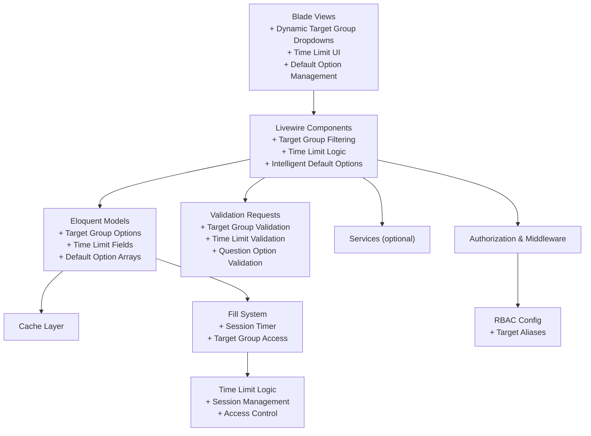

**Diagram sources**
- [questionnaire-list.blade.php:37-46](file://resources/views/livewire/admin/questionnaire-list.blade.php#L37-L46)
- [questionnaire-form.blade.php:109-121](file://resources/views/livewire/admin/questionnaire-form.blade.php#L109-L121)
- [questionnaire-assignment.blade.php:13-26](file://resources/views/livewire/admin/questionnaire-assignment.blade.php#L13-L26)
- [user-directory.blade.php:78-98](file://resources/views/livewire/admin/user-directory.blade.php#L78-L98)
- [QuestionnaireList.php:21](file://app/Livewire/Admin/QuestionnaireList.php#L21)
- [QuestionnaireList.php:81](file://app/Livewire/Admin/QuestionnaireList.php#L81)
- [Questionnaire.php:115-131](file://app/Models/Questionnaire.php#L115-L131)
- [UserDirectory.php:131-193](file://app/Livewire/Admin/UserDirectory.php#L131-L193)
- [AvailableQuestionnaires.php:152-165](file://app/Livewire/Fill/AvailableQuestionnaires.php#L152-L165)
- [2026_04_21_020644_add_time_limit_and_filling_started_at_to_users_table.php:14-16](file://database/migrations/2026_04_21_020644_add_time_limit_and_filling_started_at_to_users_table.php#L14-L16)
- [QuestionManager.php:277-287](file://app/Livewire/Admin/QuestionManager.php#L277-L287)

**Section sources**
- [AdminDashboard.php:11-135](file://app/Livewire/Admin/AdminDashboard.php#L11-L135)
- [DepartmentDirectory.php:15-161](file://app/Livewire/Admin/DepartmentDirectory.php#L15-L161)
- [UserDirectory.php:19-420](file://app/Livewire/Admin/UserDirectory.php#L19-L420)
- [RoleDirectory.php:14-155](file://app/Livewire/Admin/RoleDirectory.php#L14-L155)
- [QuestionnaireForm.php:17-138](file://app/Livewire/Admin/QuestionnaireForm.php#L17-L138)
- [QuestionnaireList.php:14-91](file://app/Livewire/Admin/QuestionnaireList.php#L14-L91)
- [QuestionnaireAssignment.php:12-91](file://app/Livewire/Admin/QuestionnaireAssignment.php#L12-L91)
- [QuestionManager.php:18-296](file://app/Livewire/Admin/QuestionManager.php#L18-L296)

## Detailed Component Analysis

### AdminDashboard
- Purpose: Provide an overview dashboard with cached metrics.
- State: Uses a cache key with TTL to avoid repeated heavy queries.
- Metrics: Active questionnaires, total respondents, participation rate, average score, and role-based breakdown cards.
- Authorization: Requires permission to view questionnaires.

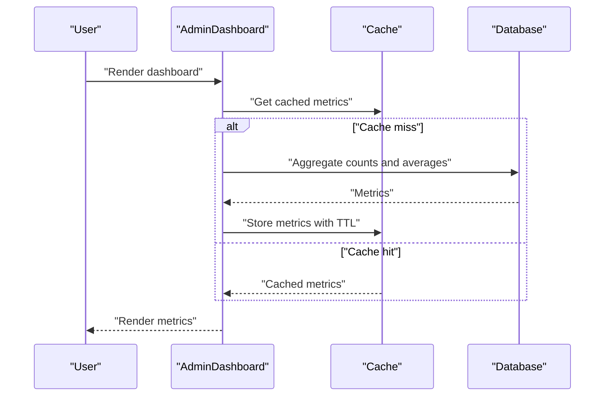

**Diagram sources**
- [AdminDashboard.php:27-130](file://app/Livewire/Admin/AdminDashboard.php#L27-L130)

**Section sources**
- [AdminDashboard.php:20-135](file://app/Livewire/Admin/AdminDashboard.php#L20-L135)
- [admin-dashboard.blade.php:17-49](file://resources/views/livewire/admin/admin-dashboard.blade.php#L17-L49)

### DepartmentDirectory
- Purpose: Manage departments with CRUD, search, pagination, sorting, and validation.
- State: Tracks search term, per-page, sort column, direction, and form visibility.
- Validation: Unique name, integer range for order, optional description.
- Actions: Create, update, delete with soft-delete safety checks and logging.

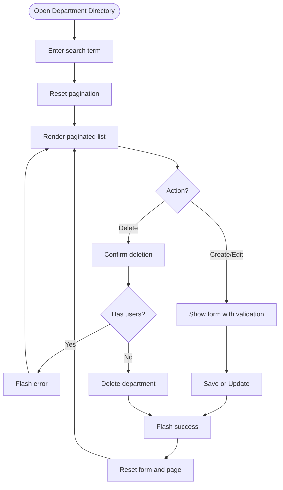

**Diagram sources**
- [DepartmentDirectory.php:40-118](file://app/Livewire/Admin/DepartmentDirectory.php#L40-L118)
- [department-directory.blade.php:44-96](file://resources/views/livewire/admin/department-directory.blade.php#L44-L96)

**Section sources**
- [DepartmentDirectory.php:35-161](file://app/Livewire/Admin/DepartmentDirectory.php#L35-L161)
- [department-directory.blade.php:1-98](file://resources/views/livewire/admin/department-directory.blade.php#L1-L98)
- [StoreDepartementRequest.php](file://app/Http/Requests/StoreDepartementRequest.php)
- [UpdateDepartementRequest.php](file://app/Http/Requests/UpdateDepartementRequest.php)

### UserDirectory
- Purpose: **Enhanced** Full user administration with filters, sorting, password handling, role/department resolution, and comprehensive time limit management.
- State: Tracks search, role/status/department/phone filters, pagination, form fields, and time limit components (hours and minutes).
- Validation: Email uniqueness, phone regex, password rules, role exists, department exists, time limit validation.
- Actions: Create/update (with optional password), delete with self-protection, time limit configuration, and session reset functionality.
- **New Features**: Individual user time limit configuration, session reset capability, time-based access control integration.

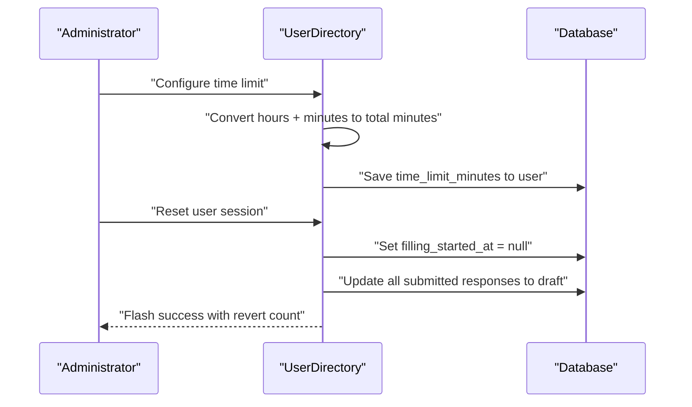

**Diagram sources**
- [UserDirectory.php:131-193](file://app/Livewire/Admin/UserDirectory.php#L131-L193)
- [UserDirectory.php:221-245](file://app/Livewire/Admin/UserDirectory.php#L221-L245)
- [user-directory.blade.php:78-98](file://resources/views/livewire/admin/user-directory.blade.php#L78-L98)

**Section sources**
- [UserDirectory.php:56-420](file://app/Livewire/Admin/UserDirectory.php#L56-L420)
- [user-directory.blade.php:1-234](file://resources/views/livewire/admin/user-directory.blade.php#L1-L234)
- [StoreUserRequest.php](file://app/Http/Requests/StoreUserRequest.php)
- [UpdateUserRequest.php](file://app/Http/Requests/UpdateUserRequest.php)

### RoleDirectory
- Purpose: Manage roles with validation and alias-aware persistence.
- State: Tracks search, per-page, sort column, direction, and form fields.
- Validation: Unique name, percentage range, boolean active flag.
- Actions: Create/update/delete with safety checks against existing users.

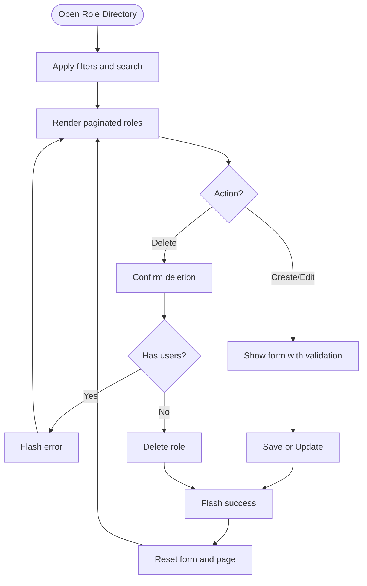

**Diagram sources**
- [RoleDirectory.php:61-109](file://app/Livewire/Admin/RoleDirectory.php#L61-L109)
- [role-directory.blade.php:61-103](file://resources/views/livewire/admin/role-directory.blade.php#L61-L103)

**Section sources**
- [RoleDirectory.php:28-155](file://app/Livewire/Admin/RoleDirectory.php#L28-L155)
- [role-directory.blade.php:1-105](file://resources/views/livewire/admin/role-directory.blade.php#L1-L105)

### QuestionnaireForm
- Purpose: **Enhanced** Create or edit a questionnaire with dynamic target group dropdown options and sync target groups.
- State: Holds title, description, dates, status, time limit, and target groups; resolves dynamic target group options from configuration.
- Validation: Uses dedicated request classes for create/update with target group validation.
- Behavior: On save, persists questionnaire and target groups; redirects to edit page; provides dynamic target group options with labels.

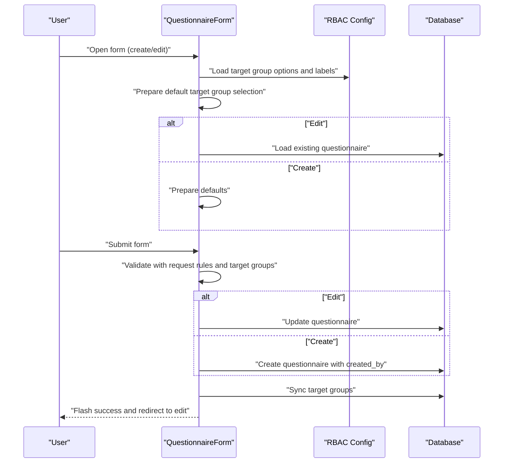

**Diagram sources**
- [QuestionnaireForm.php:42-75](file://app/Livewire/Admin/QuestionnaireForm.php#L42-L75)
- [QuestionnaireForm.php:107-112](file://app/Livewire/Admin/QuestionnaireForm.php#L107-L112)
- [questionnaire-form.blade.php:23-132](file://resources/views/livewire/admin/questionnaire-form.blade.php#L23-L132)

**Section sources**
- [QuestionnaireForm.php:40-138](file://app/Livewire/Admin/QuestionnaireForm.php#L40-L138)
- [questionnaire-form.blade.php:1-149](file://resources/views/livewire/admin/questionnaire-form.blade.php#L1-L149)
- [StoreQuestionnaireRequest.php](file://app/Http/Requests/StoreQuestionnaireRequest.php)
- [UpdateQuestionnaireRequest.php](file://app/Http/Requests/UpdateQuestionnaireRequest.php)

### QuestionnaireList
- Purpose: **Enhanced** List questionnaires with search, status filter, target group filter, and actions.
- State: Tracks search, status filter, and target group filter.
- **New Feature**: Target group filtering capability with dynamic dropdown options.
- Actions: Publish (set status to active), close (set status to closed), delete.

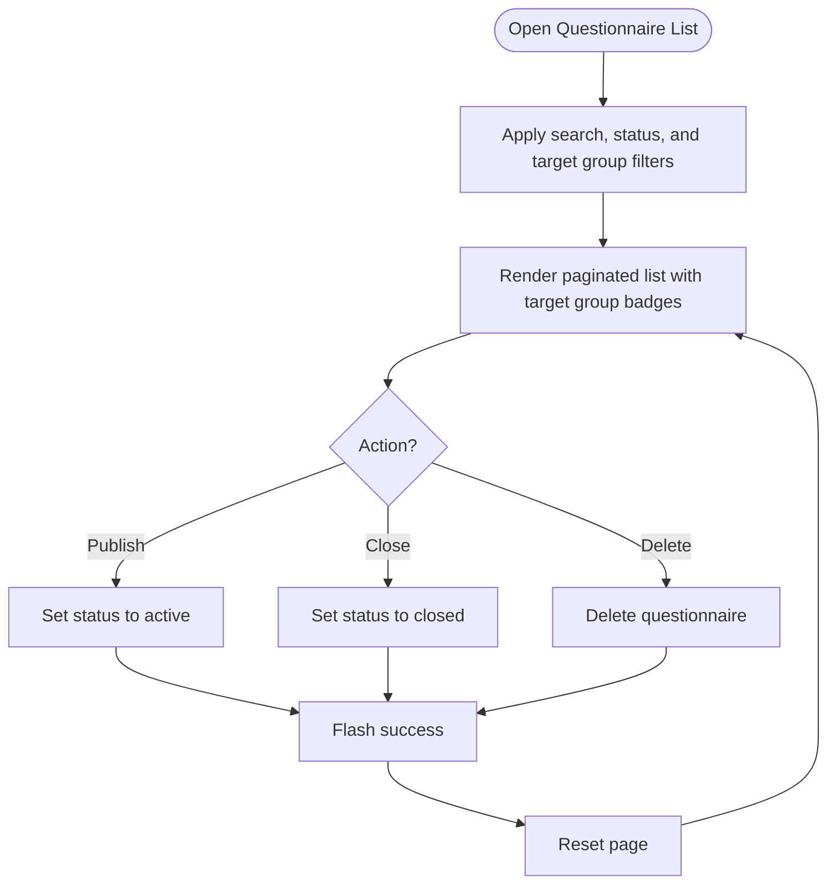

**Diagram sources**
- [QuestionnaireList.php:36-59](file://app/Livewire/Admin/QuestionnaireList.php#L36-L59)
- [QuestionnaireList.php:70-83](file://app/Livewire/Admin/QuestionnaireList.php#L70-L83)
- [questionnaire-list.blade.php:37-46](file://resources/views/livewire/admin/questionnaire-list.blade.php#L37-L46)

**Section sources**
- [QuestionnaireList.php:21-91](file://app/Livewire/Admin/QuestionnaireList.php#L21-L91)
- [questionnaire-list.blade.php:1-137](file://resources/views/livewire/admin/questionnaire-list.blade.php#L1-L137)

### QuestionnaireAssignment
- Purpose: **Enhanced** Assign target groups to a questionnaire with dynamic dropdown options, validation, and alias normalization.
- State: Holds selected target groups, available options, and labels loaded from dynamic configuration.
- **New Feature**: Dynamic target group dropdown options with automatic label resolution.
- Behavior: Normalizes aliases via configuration, validates selection, syncs target groups, and dispatches an event to refresh parent.

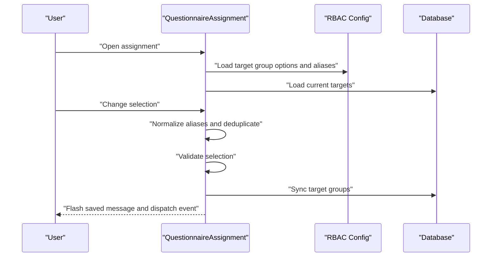

**Diagram sources**
- [QuestionnaireAssignment.php:27-54](file://app/Livewire/Admin/QuestionnaireAssignment.php#L27-L54)
- [QuestionnaireAssignment.php:79-89](file://app/Livewire/Admin/QuestionnaireAssignment.php#L79-L89)
- [questionnaire-assignment.blade.php:13-26](file://resources/views/livewire/admin/questionnaire-assignment.blade.php#L13-L26)
- [rbac.php](file://config/rbac.php)

**Section sources**
- [QuestionnaireAssignment.php:27-91](file://app/Livewire/Admin/QuestionnaireAssignment.php#L27-L91)
- [questionnaire-assignment.blade.php:1-37](file://resources/views/livewire/admin/questionnaire-assignment.blade.php#L1-L37)

### QuestionManager
- Purpose: **Enhanced** Manage questions and answer options for a questionnaire, support ordering and scoring, and provide intelligent default option generation for Indonesian rating scales.
- State: Tracks editing question ID, form visibility, question text, type, requirement, and options array with intelligent default option management.
- **New Feature**: Intelligent default option generation with predefined Indonesian rating scale options.
- Behavior: Validates options for selectable types, prepares options, persists question and options, swaps orders atomically, cleans up orphaned options, and automatically applies default Indonesian rating scale options when creating new questions with selectable answer types.

**Updated** Enhanced with intelligent default option generation system that provides predefined Indonesian rating scale options for better user experience when creating questions with selectable answer options.

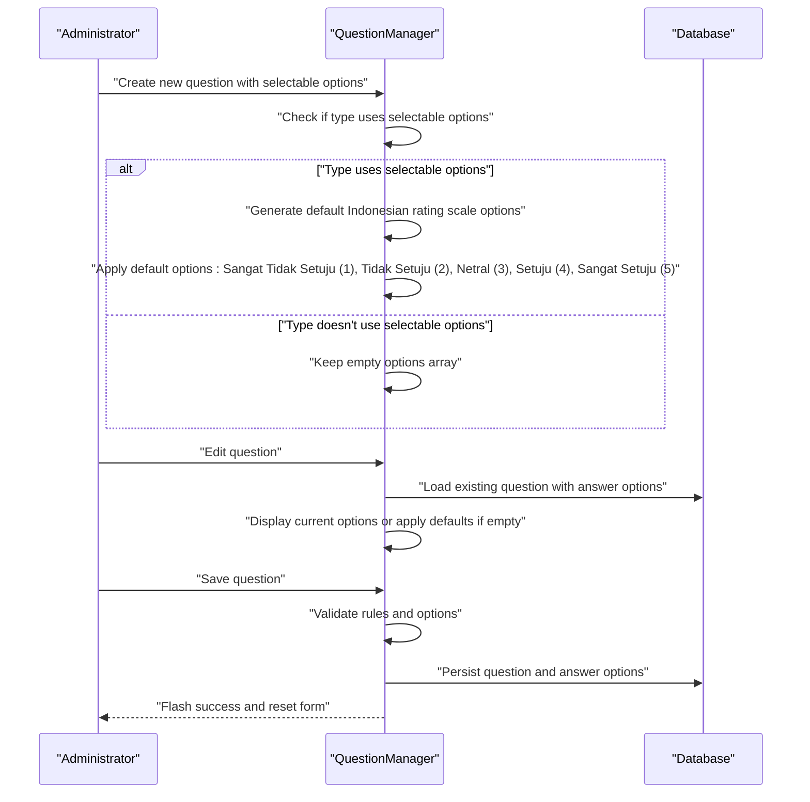

**Diagram sources**
- [QuestionManager.php:93-102](file://app/Livewire/Admin/QuestionManager.php#L93-L102)
- [QuestionManager.php:264-273](file://app/Livewire/Admin/QuestionManager.php#L264-L273)
- [QuestionManager.php:277-287](file://app/Livewire/Admin/QuestionManager.php#L277-L287)
- [question-manager.blade.php:66-111](file://resources/views/livewire/admin/question-manager.blade.php#L66-L111)

**Section sources**
- [QuestionManager.php:35-296](file://app/Livewire/Admin/QuestionManager.php#L35-L296)
- [question-manager.blade.php:1-188](file://resources/views/livewire/admin/question-manager.blade.php#L1-L188)
- [StoreQuestionRequest.php](file://app/Http/Requests/StoreQuestionRequest.php)
- [UpdateQuestionRequest.php](file://app/Http/Requests/UpdateQuestionRequest.php)

## Dependency Analysis
- Components depend on models for data access and relationships.
- Validation is centralized in request classes.
- Security is enforced via middleware and authorization gates.
- Configuration-driven behavior (RBAC) influences component logic.
- **Enhanced Integration**: Target group filtering integrates with questionnaire assignment system, while user time limits integrate with the questionnaire filling system for real-time access control. Intelligent default option generation in QuestionManager enhances user experience with predefined Indonesian rating scales.

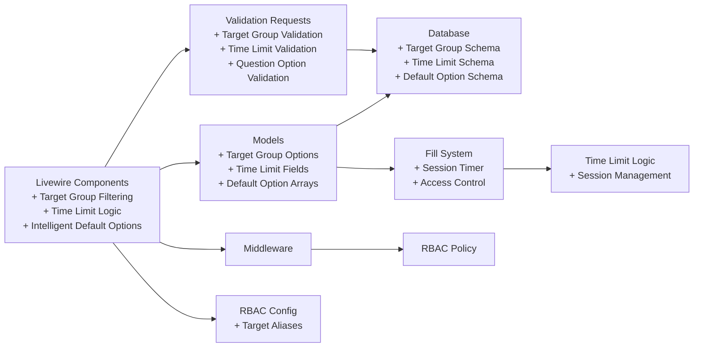

**Diagram sources**
- [QuestionnaireList.php:21](file://app/Livewire/Admin/QuestionnaireList.php#L21)
- [QuestionnaireList.php:81](file://app/Livewire/Admin/QuestionnaireList.php#L81)
- [QuestionnaireForm.php:44-47](file://app/Livewire/Admin/QuestionnaireForm.php#L44-L47)
- [QuestionnaireAssignment.php:29-36](file://app/Livewire/Admin/QuestionnaireAssignment.php#L29-L36)
- [Questionnaire.php:115-131](file://app/Models/Questionnaire.php#L115-L131)
- [UserDirectory.php:131-193](file://app/Livewire/Admin/UserDirectory.php#L131-L193)
- [AvailableQuestionnaires.php:152-165](file://app/Livewire/Fill/AvailableQuestionnaires.php#L152-L165)
- [2026_04_21_020644_add_time_limit_and_filling_started_at_to_users_table.php:14-16](file://database/migrations/2026_04_21_020644_add_time_limit_and_filling_started_at_to_users_table.php#L14-L16)
- [QuestionManager.php:277-287](file://app/Livewire/Admin/QuestionManager.php#L277-L287)

**Section sources**
- [AdminDashboard.php:5-12](file://app/Livewire/Admin/AdminDashboard.php#L5-L12)
- [DepartmentDirectory.php:5-10](file://app/Livewire/Admin/DepartmentDirectory.php#L5-L10)
- [UserDirectory.php:5-14](file://app/Livewire/Admin/UserDirectory.php#L5-L14)
- [RoleDirectory.php:5-9](file://app/Livewire/Admin/RoleDirectory.php#L5-L9)
- [QuestionnaireForm.php:5-12](file://app/Livewire/Admin/QuestionnaireForm.php#L5-L12)
- [QuestionnaireList.php:5-9](file://app/Livewire/Admin/QuestionnaireList.php#L5-L9)
- [QuestionnaireAssignment.php:5-8](file://app/Livewire/Admin/QuestionnaireAssignment.php#L5-L8)
- [QuestionManager.php:5-13](file://app/Livewire/Admin/QuestionManager.php#L5-L13)
- [EnsureUserIsAdmin.php](file://app/Http/Middleware/EnsureUserIsAdmin.php)
- [EnsureUserHasRole.php](file://app/Http/Middleware/EnsureUserHasRole.php)
- [rbac.php](file://config/rbac.php)

## Performance Considerations
- Dashboard caching: Metrics are cached with a TTL to reduce database load.
- Pagination: All list screens use pagination to limit payload sizes.
- Efficient queries: Components use eager loading and selective field retrieval.
- Debounced live updates: Inputs use debounced binding to minimize server round trips.
- Bulk operations: Deletion safeguards prevent accidental mass deletions; alias normalization avoids redundant writes.
- **Enhanced**: Target group filtering uses efficient whereHas queries with proper indexing; time limit calculations are performed efficiently using simple arithmetic operations and database queries. Intelligent default option generation uses lightweight array operations and is only triggered when needed.
- **New**: Default option generation is memory-efficient and only creates predefined arrays when questions with selectable options are created or edited.

## Troubleshooting Guide
- Validation errors: Review request classes for precise validation messages and rules.
- Authorization failures: Ensure user roles and permissions align with middleware and authorization gates.
- Target group assignment: Verify RBAC aliases and availability; ensure at least one target remains selected.
- **New Issue**: Target group filtering not working: Check that target group options are properly configured in RBAC config and that the questionnaire_targets table has valid entries.
- Soft deletes: Some delete actions are soft deletes; confirm model behavior and restore procedures.
- Logging: Components log significant changes; review logs for audit trails.
- **New Issues**: Time limit configuration errors: Verify that hours and minutes inputs are properly validated and converted to total minutes.
- **New Issue**: Default option generation not working: Check that the defaultOptions() method is properly defined and accessible in the QuestionManager component.
- **New Issue**: Indonesian rating scale options not appearing: Verify that the question type is set to 'single_choice' or 'combined' and that the defaultOptions() method is being called correctly.

**Section sources**
- [StoreDepartementRequest.php](file://app/Http/Requests/StoreDepartementRequest.php)
- [UpdateDepartementRequest.php](file://app/Http/Requests/UpdateDepartementRequest.php)
- [StoreUserRequest.php](file://app/Http/Requests/StoreUserRequest.php)
- [UpdateUserRequest.php](file://app/Http/Requests/UpdateUserRequest.php)
- [StoreQuestionnaireRequest.php](file://app/Http/Requests/StoreQuestionnaireRequest.php)
- [UpdateQuestionnaireRequest.php](file://app/Http/Requests/UpdateQuestionnaireRequest.php)
- [StoreQuestionRequest.php](file://app/Http/Requests/StoreQuestionRequest.php)
- [UpdateQuestionRequest.php](file://app/Http/Requests/UpdateQuestionRequest.php)
- [EnsureUserIsAdmin.php](file://app/Http/Middleware/EnsureUserIsAdmin.php)
- [EnsureUserHasRole.php](file://app/Http/Middleware/EnsureUserHasRole.php)
- [RedirectByRole.php](file://app/Http/Middleware/RedirectByRole.php)
- [QuestionManager.php:277-287](file://app/Livewire/Admin/QuestionManager.php#L277-L287)

## Conclusion
The admin components provide a cohesive, secure, and efficient interface for managing departments, users, roles, and questionnaires. They emphasize real-time UX with Livewire, robust validation via request classes, strong authorization via middleware and policies, and configurable behavior through RBAC settings. **The questionnaire management system has been significantly enhanced with comprehensive target group filtering capabilities**, allowing administrators to filter questionnaires by target groups, assign target groups dynamically with proper validation, and manage questionnaire access controls more effectively. **The UserDirectory component has been significantly enhanced with comprehensive time limit management capabilities**, allowing administrators to set individual time limits for users, reset user fill sessions, and manage time-based access controls, integrating seamlessly with the questionnaire filling system. **The QuestionManager component has been enhanced with intelligent default option generation for Indonesian rating scales**, improving the user experience when creating questions with selectable answer options by providing predefined rating scales with culturally appropriate Indonesian terminology.

## Appendices

### Component State Management and Real-Time Updates
- Live bindings: Many inputs use live binding with debouncing to balance responsiveness and performance.
- Events: Components emit and listen to events (e.g., target-groups-updated) to synchronize state across panels.
- Flash messages: Success/error feedback is surfaced via session flash messages.
- **Enhanced**: Target group filtering uses live debounced binding for real-time filtering; time limit inputs use live debounced binding for real-time conversion and validation. Intelligent default option generation triggers automatically when creating questions with selectable options.
- **New**: Default option management uses automatic application when questions with selectable answer types are created or edited.

**Section sources**
- [questionnaire-form.blade.php:109-121](file://resources/views/livewire/admin/questionnaire-form.blade.php#L109-L121)
- [questionnaire-assignment.blade.php:6-11](file://resources/views/livewire/admin/questionnaire-assignment.blade.php#L6-L11)
- [user-directory.blade.php:82-94](file://resources/views/livewire/admin/user-directory.blade.php#L82-L94)
- [QuestionManager.php:93-102](file://app/Livewire/Admin/QuestionManager.php#L93-L102)
- [QuestionManager.php:264-273](file://app/Livewire/Admin/QuestionManager.php#L264-L273)

### Integration with Admin Layouts and Navigation
- Layouts: Components declare the admin layout to ensure consistent navigation and styling.
- Navigation: Blade views include links to lists, forms, and analytics pages.

**Section sources**
- [admin.blade.php](file://resources/views/layouts/admin.blade.php)
- [questionnaire-form.blade.php:12-14](file://resources/views/livewire/admin/questionnaire-form.blade.php#L12-L14)
- [questionnaire-list.blade.php:8-10](file://resources/views/livewire/admin/questionnaire-list.blade.php#L8-L10)

### Security Considerations
- Role-based access: Middleware and authorization gates restrict access to admin and role-manage actions.
- Password handling: Passwords are hashed during create/update.
- Self-protection: Deleting self is prevented in user management.
- Logging: Administrative actions are logged for auditability.
- **Enhanced**: Target group filtering includes proper validation and sanitization of target group inputs; time limit management includes proper validation and sanitization of time inputs. Intelligent default option generation includes proper validation and sanitization of option data.
- **Enhanced**: Default option management ensures proper validation and sanitization of Indonesian rating scale options.

**Section sources**
- [EnsureUserIsAdmin.php](file://app/Http/Middleware/EnsureUserIsAdmin.php)
- [EnsureUserHasRole.php](file://app/Http/Middleware/EnsureUserHasRole.php)
- [UserDirectory.php:174-182](file://app/Livewire/Admin/UserDirectory.php#L174-L182)
- [UserDirectory.php:221-245](file://app/Livewire/Admin/UserDirectory.php#L221-L245)
- [QuestionManager.php:277-287](file://app/Livewire/Admin/QuestionManager.php#L277-L287)

### Data Filtering and Bulk Operations
- Filtering: Users, roles, and questionnaires support multiple filters and sorting.
- **Enhanced**: QuestionnaireList now supports target group filtering with dynamic dropdown options.
- Bulk operations: While individual actions are exposed, bulk operations are not explicitly implemented in the reviewed components.
- **Enhanced**: UserDirectory supports time limit filtering and management through individual user configuration.
- **New**: QuestionManager supports intelligent default option filtering and management for better user experience.

**Section sources**
- [UserDirectory.php:286-420](file://app/Livewire/Admin/UserDirectory.php#L286-L420)
- [RoleDirectory.php:137-155](file://app/Livewire/Admin/RoleDirectory.php#L137-L155)
- [QuestionnaireList.php:61-91](file://app/Livewire/Admin/QuestionnaireList.php#L61-L91)

### Target Group Filtering and Management Features
**New Section**: The questionnaire management system now includes comprehensive target group filtering and management capabilities:

#### Target Group Filtering
- **Dynamic Dropdown Options**: QuestionnaireList now includes a target group filter dropdown populated with dynamic options from the Questionnaire model.
- **Real-time Filtering**: Target group filtering works alongside existing search and status filters with live debounced binding.
- **Comprehensive Coverage**: All questionnaire management components (List, Form, Assignment) now support target group filtering.

#### Dynamic Target Group Options
- **Configuration-driven**: Target group options are loaded from RBAC configuration and Role model relationships.
- **Automatic Label Resolution**: Target group labels are automatically resolved from role names with proper formatting.
- **Consistent Options**: All components use the same target group option source for consistency.

#### Enhanced Questionnaire Management
- **QuestionnaireForm**: Now includes dynamic target group dropdown with default selection and label resolution.
- **QuestionnaireAssignment**: Provides dynamic target group checkboxes with validation and alias normalization.
- **QuestionnaireList**: Displays target group badges and supports filtering by target groups.

#### Database Integration
- **QuestionnaireTargets Table**: New table structure supports multiple target groups per questionnaire with unique constraints.
- **Target Group Options**: Dynamic options loaded from Role model with slug/name pairs.
- **Alias Support**: RBAC configuration supports target group aliases for flexible mapping.

#### Frontend Implementation
- **Dropdown Integration**: Target group filter dropdown in questionnaire list with proper debounced binding.
- **Checkbox Interface**: Dynamic target group selection in assignment component with validation feedback.
- **Badge Display**: Target group badges in questionnaire list with proper formatting.

**Section sources**
- [QuestionnaireList.php:21](file://app/Livewire/Admin/QuestionnaireList.php#L21)
- [QuestionnaireList.php:81](file://app/Livewire/Admin/QuestionnaireList.php#L81)
- [QuestionnaireList.php:87](file://app/Livewire/Admin/QuestionnaireList.php#L87)
- [questionnaire-list.blade.php:37-46](file://resources/views/livewire/admin/questionnaire-list.blade.php#L37-L46)
- [QuestionnaireForm.php:44-47](file://app/Livewire/Admin/QuestionnaireForm.php#L44-L47)
- [QuestionnaireAssignment.php:29-36](file://app/Livewire/Admin/QuestionnaireAssignment.php#L29-L36)
- [Questionnaire.php:115-131](file://app/Models/Questionnaire.php#L115-L131)
- [QuestionnaireTarget.php:14-17](file://app/Models/QuestionnaireTarget.php#L14-L17)
- [rbac.php](file://config/rbac.php)
- [2026_04_16_010240_create_questionnaire_targets_table.php:11-18](file://database/migrations/2026_04_16_010240_create_questionnaire_targets_table.php#L11-L18)

### Time Limit Management Features
**New Section**: The UserDirectory component now includes comprehensive time limit management capabilities:

#### Time Limit Configuration
- **Individual User Limits**: Administrators can set custom time limits for each user using hours and minutes components.
- **Real-time Conversion**: Hours and minutes are automatically converted to total minutes for storage.
- **Flexible Input**: Empty fields indicate no time limit, while values are validated and sanitized.
- **Display Integration**: Time limits are displayed in human-readable format (hours and minutes) throughout the interface.

#### Session Management
- **Session Reset**: Administrators can reset user fill sessions to allow users to retake questionnaires.
- **Automatic Status Recovery**: Submitted responses are automatically reverted to draft status when sessions are reset.
- **Timer Control**: The filling_started_at timestamp controls when the time limit countdown begins.

#### Database Integration
- **Schema Enhancement**: New columns added to users table: `time_limit_minutes` and `filling_started_at`.
- **Data Persistence**: Time limits are stored as total minutes for efficient calculation and comparison.
- **Session Tracking**: Filling sessions are tracked per user for accurate time limit enforcement.

#### Frontend Implementation
- **Dual Input Fields**: Separate hour and minute input fields with validation constraints.
- **Live Calculation**: Real-time display of total minutes equivalent to entered hours/minutes.
- **Conditional Display**: Time limit information is shown in user listings with appropriate formatting.
- **Session Controls**: Reset buttons appear when users have active sessions or submitted responses.

**Section sources**
- [UserDirectory.php:53-57](file://app/Livewire/Admin/UserDirectory.php#L53-L57)
- [UserDirectory.php:112-120](file://app/Livewire/Admin/UserDirectory.php#L112-L120)
- [UserDirectory.php:151](file://app/Livewire/Admin/UserDirectory.php#L151)
- [UserDirectory.php:179](file://app/Livewire/Admin/UserDirectory.php#L179)
- [UserDirectory.php:221-245](file://app/Livewire/Admin/UserDirectory.php#L221-L245)
- [user-directory.blade.php:78-98](file://resources/views/livewire/admin/user-directory.blade.php#L78-L98)
- [user-directory.blade.php:196-213](file://resources/views/livewire/admin/user-directory.blade.php#L196-L213)
- [2026_04_21_020644_add_time_limit_and_filling_started_at_to_users_table.php:14-16](file://database/migrations/2026_04_21_020644_add_time_limit_and_filling_started_at_to_users_table.php#L14-L16)
- [AvailableQuestionnaires.php:152-165](file://app/Livewire/Fill/AvailableQuestionnaires.php#L152-L165)

### Intelligent Default Option Generation Features
**New Section**: The QuestionManager component now includes intelligent default option generation for Indonesian rating scales:

#### Default Option Generation
- **Predefined Indonesian Rating Scale**: The defaultOptions() method provides culturally appropriate Indonesian rating scale options with meaningful translations.
- **Automatic Application**: Default options are automatically applied when creating new questions with selectable answer types (single_choice or combined).
- **Smart Initialization**: Default options are applied when editing questions that have no existing options but use selectable answer types.

#### Indonesian Rating Scale Options
- **Very Dissatisfied**: "Sangat Tidak Setuju" with score 1
- **Dissatisfied**: "Tidak Setuju" with score 2
- **Neutral**: "Netral" with score 3
- **Satisfied**: "Setuju" with score 4
- **Very Satisfied**: "Sangat Setuju" with score 5

#### Enhanced User Experience
- **Reduced Setup Time**: Administrators don't need to manually create common rating scale options.
- **Cultural Appropriateness**: Uses Indonesian terminology that is familiar to local users.
- **Automatic Validation**: Predefined options ensure minimum requirements for selectable question types are met.
- **Smart Defaults**: Only applied when questions use selectable answer types, preserving flexibility for other question types.

#### Technical Implementation
- **Memory Efficient**: Default options are generated as lightweight arrays only when needed.
- **Lazy Loading**: Options are generated on-demand rather than stored permanently.
- **Type-Specific**: Only applied to questions with types that support selectable answers.
- **Validation Integration**: Works seamlessly with existing validation rules for question options.

**Section sources**
- [QuestionManager.php:93-102](file://app/Livewire/Admin/QuestionManager.php#L93-L102)
- [QuestionManager.php:264-273](file://app/Livewire/Admin/QuestionManager.php#L264-L273)
- [QuestionManager.php:277-287](file://app/Livewire/Admin/QuestionManager.php#L277-L287)
- [question-manager.blade.php:66-111](file://resources/views/livewire/admin/question-manager.blade.php#L66-L111)