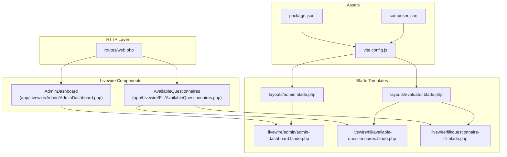
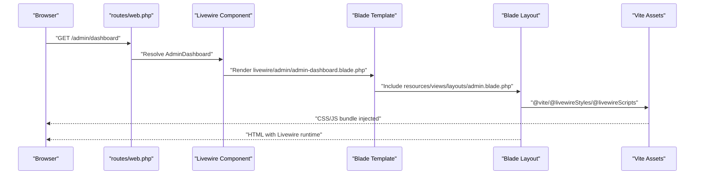
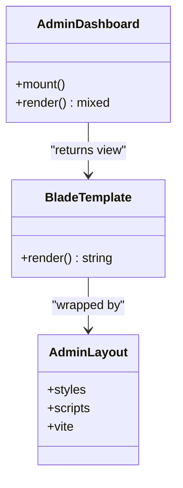
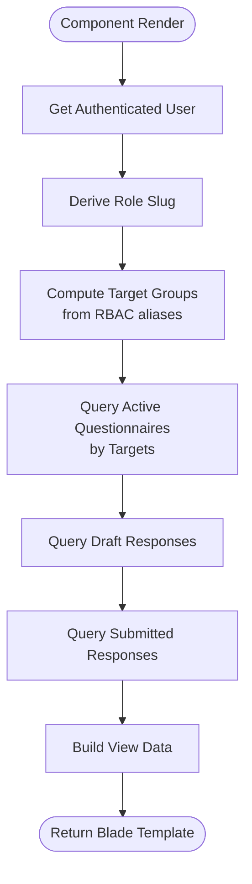
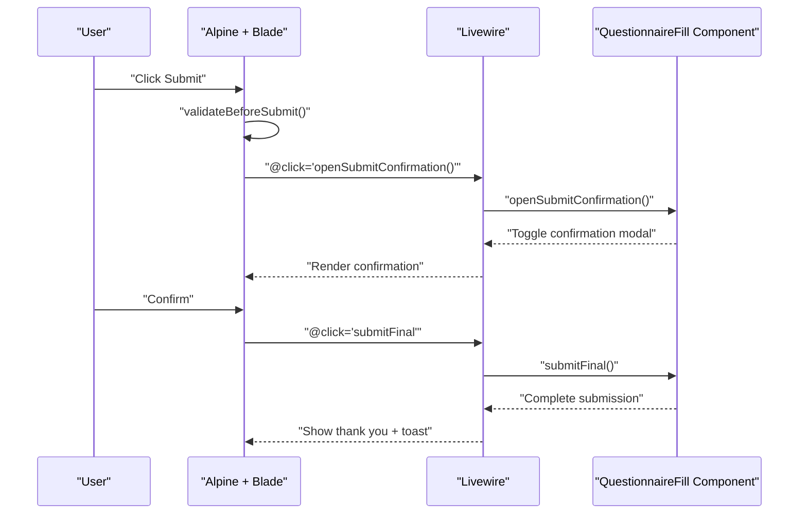
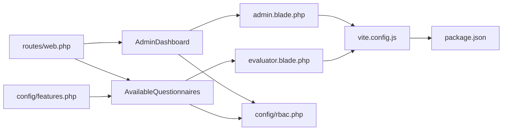

# Component Integration & Configuration

<cite>
**Referenced Files in This Document**
- [composer.json](file://composer.json)
- [vite.config.js](file://vite.config.js)
- [package.json](file://package.json)
- [routes/web.php](file://routes/web.php)
- [resources/views/layouts/admin.blade.php](file://resources/views/layouts/admin.blade.php)
- [resources/views/layouts/evaluator.blade.php](file://resources/views/layouts/evaluator.blade.php)
- [resources/views/livewire/admin/admin-dashboard.blade.php](file://resources/views/livewire/admin/admin-dashboard.blade.php)
- [resources/views/livewire/fill/available-questionnaires.blade.php](file://resources/views/livewire/fill/available-questionnaires.blade.php)
- [resources/views/livewire/fill/questionnaire-fill.blade.php](file://resources/views/livewire/fill/questionnaire-fill.blade.php)
- [app/Livewire/Admin/AdminDashboard.php](file://app/Livewire/Admin/AdminDashboard.php)
- [app/Livewire/Fill/AvailableQuestionnaires.php](file://app/Livewire/Fill/AvailableQuestionnaires.php)
- [config/features.php](file://config/features.php)
- [config/rbac.php](file://config/rbac.php)
</cite>

## Table of Contents
1. [Introduction](#introduction)
2. [Project Structure](#project-structure)
3. [Core Components](#core-components)
4. [Architecture Overview](#architecture-overview)
5. [Detailed Component Analysis](#detailed-component-analysis)
6. [Dependency Analysis](#dependency-analysis)
7. [Performance Considerations](#performance-considerations)
8. [Troubleshooting Guide](#troubleshooting-guide)
9. [Conclusion](#conclusion)
10. [Appendices](#appendices)

## Introduction
This document explains how Livewire components are integrated and configured in the application. It covers component registration via routes, Blade template integration, asset compilation with Vite, build system configuration, layout integration patterns, navigation setup, and component lifecycle management. It also includes examples of component mounting, event broadcasting, inter-component communication, performance optimization, lazy loading strategies, browser compatibility considerations, testing guidance, debugging techniques, and development workflow optimization.

## Project Structure
Livewire components are organized under the application namespace and rendered via Blade views. Routes map HTTP URLs to Livewire components, while Blade layouts provide consistent UI shells. Assets are managed by Vite with Laravel’s Vite plugin and Tailwind CSS.

**Diagram sources**
- [routes/web.php:10-24](file://routes/web.php#L10-L24)
- [app/Livewire/Admin/AdminDashboard.php:15-16](file://app/Livewire/Admin/AdminDashboard.php#L15-L16)
- [app/Livewire/Fill/AvailableQuestionnaires.php:11-12](file://app/Livewire/Fill/AvailableQuestionnaires.php#L11-L12)
- [resources/views/livewire/admin/admin-dashboard.blade.php:1-51](file://resources/views/livewire/admin/admin-dashboard.blade.php#L1-L51)
- [resources/views/livewire/fill/available-questionnaires.blade.php:1-85](file://resources/views/livewire/fill/available-questionnaires.blade.php#L1-L85)
- [resources/views/livewire/fill/questionnaire-fill.blade.php:1-402](file://resources/views/livewire/fill/questionnaire-fill.blade.php#L1-L402)
- [resources/views/layouts/admin.blade.php:16-18](file://resources/views/layouts/admin.blade.php#L16-L18)
- [resources/views/layouts/evaluator.blade.php:15-17](file://resources/views/layouts/evaluator.blade.php#L15-L17)
- [package.json:1-17](file://package.json#L1-L17)
- [vite.config.js:1-19](file://vite.config.js#L1-L19)
- [composer.json:12-13](file://composer.json#L12-L13)

**Section sources**
- [routes/web.php:10-24](file://routes/web.php#L10-L24)
- [resources/views/layouts/admin.blade.php:16-18](file://resources/views/layouts/admin.blade.php#L16-L18)
- [resources/views/layouts/evaluator.blade.php:15-17](file://resources/views/layouts/evaluator.blade.php#L15-L17)
- [vite.config.js:1-19](file://vite.config.js#L1-19)
- [package.json:1-17](file://package.json#L1-L17)
- [composer.json:12-13](file://composer.json#L12-L13)

## Core Components
- AdminDashboard: Renders administrative metrics and integrates with the admin layout. It uses caching to optimize data retrieval and applies authorization in the mount lifecycle hook.
- AvailableQuestionnaires: Lists active questionnaires for the current evaluator role, including draft and submitted history, and integrates with the evaluator layout.

Key integration points:
- Component registration: Routes map to Livewire components.
- Layout integration: #[Layout] attribute and Blade layout files provide consistent shell and assets.
- Asset pipeline: Vite compiles CSS/JS and injects them via Blade directives.

**Section sources**
- [app/Livewire/Admin/AdminDashboard.php:15-16](file://app/Livewire/Admin/AdminDashboard.php#L15-L16)
- [app/Livewire/Admin/AdminDashboard.php:20-23](file://app/Livewire/Admin/AdminDashboard.php#L20-L23)
- [app/Livewire/Admin/AdminDashboard.php:25-135](file://app/Livewire/Admin/AdminDashboard.php#L25-L135)
- [app/Livewire/Fill/AvailableQuestionnaires.php:11-12](file://app/Livewire/Fill/AvailableQuestionnaires.php#L11-L12)
- [app/Livewire/Fill/AvailableQuestionnaires.php:14-62](file://app/Livewire/Fill/AvailableQuestionnaires.php#L14-L62)
- [routes/web.php:72-95](file://routes/web.php#L72-L95)
- [routes/web.php:149-159](file://routes/web.php#L149-L159)
- [resources/views/layouts/admin.blade.php:16-18](file://resources/views/layouts/admin.blade.php#L16-L18)
- [resources/views/layouts/evaluator.blade.php:15-17](file://resources/views/layouts/evaluator.blade.php#L15-L17)

## Architecture Overview
The application follows a clean separation of concerns:
- Routes define entry points and map to Livewire components.
- Components encapsulate state and rendering logic, leveraging Blade templates.
- Blade layouts provide shared UI and asset injection.
- Vite manages frontend assets and hot module replacement during development.

**Diagram sources**
- [routes/web.php:74](file://routes/web.php#L74)
- [app/Livewire/Admin/AdminDashboard.php:15-16](file://app/Livewire/Admin/AdminDashboard.php#L15-L16)
- [resources/views/livewire/admin/admin-dashboard.blade.php:1-51](file://resources/views/livewire/admin/admin-dashboard.blade.php#L1-L51)
- [resources/views/layouts/admin.blade.php:16-18](file://resources/views/layouts/admin.blade.php#L16-L18)
- [resources/views/layouts/admin.blade.php:101-102](file://resources/views/layouts/admin.blade.php#L101-L102)

## Detailed Component Analysis

### AdminDashboard Component
- Lifecycle: Uses #[Layout] attribute to apply the admin layout. Authorization is enforced in the mount hook. Data is cached to reduce database load.
- Rendering: Returns a view that displays aggregated metrics derived from models and configuration.
- Asset integration: The admin layout injects Livewire styles/scripts and Vite bundles.

**Diagram sources**
- [app/Livewire/Admin/AdminDashboard.php:15-16](file://app/Livewire/Admin/AdminDashboard.php#L15-L16)
- [app/Livewire/Admin/AdminDashboard.php:20-23](file://app/Livewire/Admin/AdminDashboard.php#L20-L23)
- [app/Livewire/Admin/AdminDashboard.php:25-135](file://app/Livewire/Admin/AdminDashboard.php#L25-L135)
- [resources/views/layouts/admin.blade.php:16-18](file://resources/views/layouts/admin.blade.php#L16-L18)
- [resources/views/layouts/admin.blade.php:101-102](file://resources/views/layouts/admin.blade.php#L101-L102)

**Section sources**
- [app/Livewire/Admin/AdminDashboard.php:15-16](file://app/Livewire/Admin/AdminDashboard.php#L15-L16)
- [app/Livewire/Admin/AdminDashboard.php:20-23](file://app/Livewire/Admin/AdminDashboard.php#L20-L23)
- [app/Livewire/Admin/AdminDashboard.php:25-135](file://app/Livewire/Admin/AdminDashboard.php#L25-L135)
- [resources/views/livewire/admin/admin-dashboard.blade.php:1-51](file://resources/views/livewire/admin/admin-dashboard.blade.php#L1-L51)
- [resources/views/layouts/admin.blade.php:16-18](file://resources/views/layouts/admin.blade.php#L16-L18)

### AvailableQuestionnaires Component
- Lifecycle: #[Layout] applies the evaluator layout. Computes target groups from RBAC configuration and filters questionnaires accordingly.
- Rendering: Produces lists of available, draft, and submitted questionnaires for the current user.
- Asset integration: Evaluator layout injects Livewire styles/scripts and Vite bundles.

**Diagram sources**
- [app/Livewire/Fill/AvailableQuestionnaires.php:11-12](file://app/Livewire/Fill/AvailableQuestionnaires.php#L11-L12)
- [app/Livewire/Fill/AvailableQuestionnaires.php:14-62](file://app/Livewire/Fill/AvailableQuestionnaires.php#L14-L62)
- [config/rbac.php:7-11](file://config/rbac.php#L7-L11)

**Section sources**
- [app/Livewire/Fill/AvailableQuestionnaires.php:11-12](file://app/Livewire/Fill/AvailableQuestionnaires.php#L11-L12)
- [app/Livewire/Fill/AvailableQuestionnaires.php:14-62](file://app/Livewire/Fill/AvailableQuestionnaires.php#L14-L62)
- [resources/views/livewire/fill/available-questionnaires.blade.php:1-85](file://resources/views/livewire/fill/available-questionnaires.blade.php#L1-L85)
- [resources/views/layouts/evaluator.blade.php:15-17](file://resources/views/layouts/evaluator.blade.php#L15-L17)

### QuestionnaireFill Component (Blade Template)
- Interaction model: Uses Alpine.js for client-side validation and UX, Livewire directives for server interactions, and emits DOM events for autosave feedback.
- Event broadcasting: Emits custom events for autosave status and queues autosave triggers.
- Inter-component communication: Uses Livewire wire:click and Alpine event handlers to coordinate UI state and actions.

**Diagram sources**
- [resources/views/livewire/fill/questionnaire-fill.blade.php:3-68](file://resources/views/livewire/fill/questionnaire-fill.blade.php#L3-L68)
- [resources/views/livewire/fill/questionnaire-fill.blade.php:364-384](file://resources/views/livewire/fill/questionnaire-fill.blade.php#L364-L384)
- [resources/views/livewire/fill/questionnaire-fill.blade.php:352-362](file://resources/views/livewire/fill/questionnaire-fill.blade.php#L352-L362)

**Section sources**
- [resources/views/livewire/fill/questionnaire-fill.blade.php:1-402](file://resources/views/livewire/fill/questionnaire-fill.blade.php#L1-L402)

## Dependency Analysis
- Routing depends on Livewire components declared in routes.
- Components depend on Blade templates and configuration (RBAC, features).
- Layouts depend on Vite and Livewire directives for asset injection.
- Build system depends on Vite and Laravel-Vite plugin.

**Diagram sources**
- [routes/web.php:72-95](file://routes/web.php#L72-L95)
- [routes/web.php:149-159](file://routes/web.php#L149-L159)
- [resources/views/layouts/admin.blade.php:16-18](file://resources/views/layouts/admin.blade.php#L16-L18)
- [resources/views/layouts/evaluator.blade.php:15-17](file://resources/views/layouts/evaluator.blade.php#L15-L17)
- [vite.config.js:1-19](file://vite.config.js#L1-L19)
- [package.json:1-17](file://package.json#L1-L17)
- [config/rbac.php:1-64](file://config/rbac.php#L1-L64)
- [config/features.php:1-7](file://config/features.php#L1-L7)

**Section sources**
- [routes/web.php:72-95](file://routes/web.php#L72-L95)
- [routes/web.php:149-159](file://routes/web.php#L149-L159)
- [resources/views/layouts/admin.blade.php:16-18](file://resources/views/layouts/admin.blade.php#L16-L18)
- [resources/views/layouts/evaluator.blade.php:15-17](file://resources/views/layouts/evaluator.blade.php#L15-L17)
- [vite.config.js:1-19](file://vite.config.js#L1-L19)
- [package.json:1-17](file://package.json#L1-L17)
- [config/rbac.php:1-64](file://config/rbac.php#L1-L64)
- [config/features.php:1-7](file://config/features.php#L1-L7)

## Performance Considerations
- Caching: AdminDashboard caches metrics for a fixed interval to reduce database queries.
- Query optimization: AvailableQuestionnaires uses targeted queries with counts and eager-loading to minimize N+1 issues.
- Debouncing: QuestionnaireFill uses debounced Livewire updates for text inputs to reduce server requests.
- Conditional rendering: Blade templates avoid rendering empty sections and only compute necessary data.
- Asset bundling: Vite builds optimized bundles; development uses HMR for fast iteration.

Recommendations:
- Prefer server-side pagination for large datasets.
- Use lazy loading for heavy components via Livewire’s built-in mechanisms.
- Minimize Alpine-driven DOM churn; batch updates when possible.
- Monitor Livewire network requests and consider chunking large forms.

**Section sources**
- [app/Livewire/Admin/AdminDashboard.php:27-130](file://app/Livewire/Admin/AdminDashboard.php#L27-L130)
- [app/Livewire/Fill/AvailableQuestionnaires.php:24-55](file://app/Livewire/Fill/AvailableQuestionnaires.php#L24-L55)
- [resources/views/livewire/fill/questionnaire-fill.blade.php:218-225](file://resources/views/livewire/fill/questionnaire-fill.blade.php#L218-L225)

## Troubleshooting Guide
Common issues and resolutions:
- Livewire assets missing: Ensure @livewireStyles and @livewireScripts are included in the layout and @vite includes CSS/JS entries.
- Component not rendering: Verify the route maps to the correct component class and the Blade view exists.
- Navigation not applying layout: Confirm #[Layout] attribute is set on the component and the layout path is correct.
- Autosave not triggering: Check Alpine event listeners and Livewire event emission in the template.
- RBAC filtering incorrect: Review target aliases and role slugs in configuration.

Debugging tips:
- Use browser DevTools Network tab to inspect Livewire requests.
- Enable Laravel debug mode and review logs for exceptions.
- Temporarily disable caching to isolate data-source issues.
- Add temporary Blade echo statements to confirm data flow.

**Section sources**
- [resources/views/layouts/admin.blade.php:18](file://resources/views/layouts/admin.blade.php#L18)
- [resources/views/layouts/admin.blade.php:101-102](file://resources/views/layouts/admin.blade.php#L101-L102)
- [resources/views/layouts/evaluator.blade.php:17](file://resources/views/layouts/evaluator.blade.php#L17)
- [resources/views/layouts/evaluator.blade.php:78-79](file://resources/views/layouts/evaluator.blade.php#L78-L79)
- [resources/views/livewire/fill/questionnaire-fill.blade.php:69-75](file://resources/views/livewire/fill/questionnaire-fill.blade.php#L69-L75)

## Conclusion
Livewire components are cleanly integrated through route-based registration, Blade layout composition, and Vite-powered asset management. The application leverages caching, targeted queries, and debounced interactions to maintain responsiveness. By following the patterns outlined here—component lifecycle hooks, layout attributes, asset directives, and configuration-driven behavior—you can extend and maintain the system effectively.

## Appendices

### Component Registration and Mounting
- Registration: Routes map to Livewire components for both admin and evaluator contexts.
- Mounting: Components perform authorization and initialization in mount.

**Section sources**
- [routes/web.php:72-95](file://routes/web.php#L72-L95)
- [routes/web.php:149-159](file://routes/web.php#L149-L159)
- [app/Livewire/Admin/AdminDashboard.php:20-23](file://app/Livewire/Admin/AdminDashboard.php#L20-L23)

### Blade Template Integration and Layout Patterns
- Admin layout includes Livewire styles/scripts and Vite bundles.
- Evaluator layout mirrors the above for evaluator pages.
- Components render Blade views that embed navigation and interactive controls.

**Section sources**
- [resources/views/layouts/admin.blade.php:16-18](file://resources/views/layouts/admin.blade.php#L16-L18)
- [resources/views/layouts/admin.blade.php:101-102](file://resources/views/layouts/admin.blade.php#L101-L102)
- [resources/views/layouts/evaluator.blade.php:15-17](file://resources/views/layouts/evaluator.blade.php#L15-L17)
- [resources/views/layouts/evaluator.blade.php:78-79](file://resources/views/layouts/evaluator.blade.php#L78-L79)

### Asset Compilation and Build System
- Vite configuration defines input assets and enables refresh/watch behavior.
- Laravel-Vite plugin integrates with Laravel routing and hot reload.
- Tailwind CSS is integrated via Vite plugin.

**Section sources**
- [vite.config.js:1-19](file://vite.config.js#L1-L19)
- [package.json:1-17](file://package.json#L1-L17)
- [composer.json:12-13](file://composer.json#L12-L13)

### Navigation Setup
- Admin navigation links use wire:navigate for seamless SPA-like transitions.
- Evaluator header includes role-aware dashboard links and logout.

**Section sources**
- [resources/views/layouts/admin.blade.php:32-66](file://resources/views/layouts/admin.blade.php#L32-L66)
- [resources/views/layouts/evaluator.blade.php:42-67](file://resources/views/layouts/evaluator.blade.php#L42-L67)

### Component Lifecycle Management
- mount: Perform authorization and pre-load data.
- render: Compute and return view data.
- Blade templates: Define UI, Alpine interactions, and Livewire directives.

**Section sources**
- [app/Livewire/Admin/AdminDashboard.php:20-23](file://app/Livewire/Admin/AdminDashboard.php#L20-L23)
- [app/Livewire/Admin/AdminDashboard.php:25-135](file://app/Livewire/Admin/AdminDashboard.php#L25-L135)
- [resources/views/livewire/fill/questionnaire-fill.blade.php:3-68](file://resources/views/livewire/fill/questionnaire-fill.blade.php#L3-L68)

### Event Broadcasting and Inter-Component Communication
- Alpine event channels: Emit autosave status and queue autosave triggers.
- Livewire directives: wire:click, wire:model, and wire:loading for reactive UI.
- Confirmation modals: Livewire toggles show/hide state.

**Section sources**
- [resources/views/livewire/fill/questionnaire-fill.blade.php:69-75](file://resources/views/livewire/fill/questionnaire-fill.blade.php#L69-L75)
- [resources/views/livewire/fill/questionnaire-fill.blade.php:352-362](file://resources/views/livewire/fill/questionnaire-fill.blade.php#L352-L362)
- [resources/views/livewire/fill/questionnaire-fill.blade.php:364-384](file://resources/views/livewire/fill/questionnaire-fill.blade.php#L364-L384)

### Lazy Loading Strategies
- Defer heavy sections until needed.
- Use Livewire’s built-in lazy loading for offscreen components.
- Split large forms into smaller, paginated sections.

[No sources needed since this section provides general guidance]

### Browser Compatibility Considerations
- Livewire requires modern browsers; ensure polyfills if legacy support is required.
- Alpine.js relies on ES2015+ features; verify compatibility matrix.
- Chart.js is loaded globally; confirm availability in older environments.

[No sources needed since this section provides general guidance]

### Testing Guidance
- Feature tests: Assert component renders expected Blade content and applies layout.
- Unit tests: Mock models and cache to validate component logic.
- Integration tests: Simulate user interactions (navigation, form submission) and assert Livewire behavior.

[No sources needed since this section provides general guidance]

### Debugging Techniques
- Inspect Livewire network traffic and component state.
- Use dd/echo in Blade temporarily to trace data flow.
- Disable caching during debugging to isolate data-source issues.

[No sources needed since this section provides general guidance]

### Development Workflow Optimization
- Use npm run dev for HMR and concurrent processes.
- Keep Vite watch ignores aligned with view cache directories.
- Leverage Laravel scripts for setup and local development orchestration.

**Section sources**
- [composer.json:45-48](file://composer.json#L45-L48)
- [vite.config.js:13-17](file://vite.config.js#L13-L17)