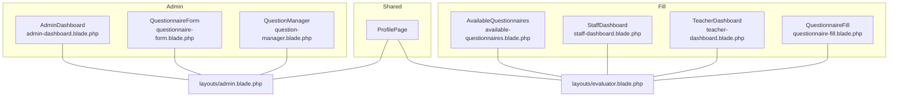
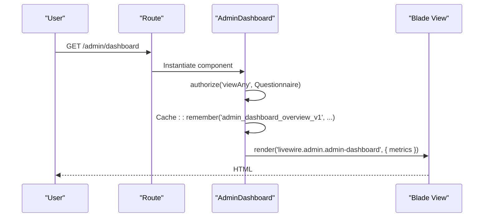
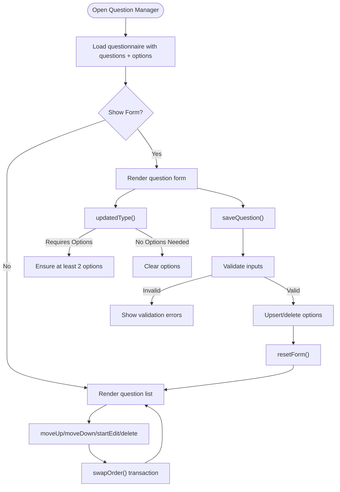
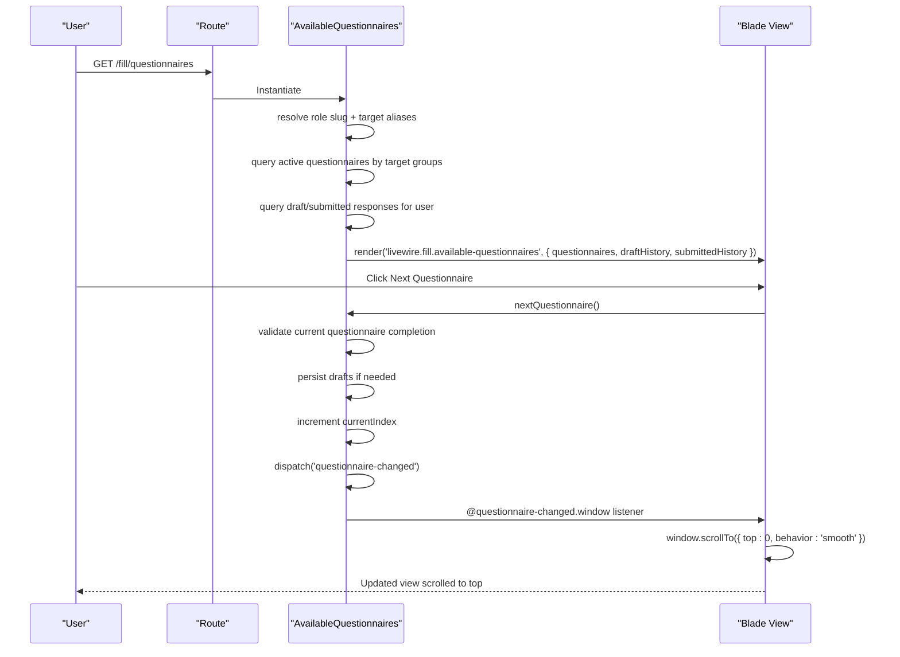
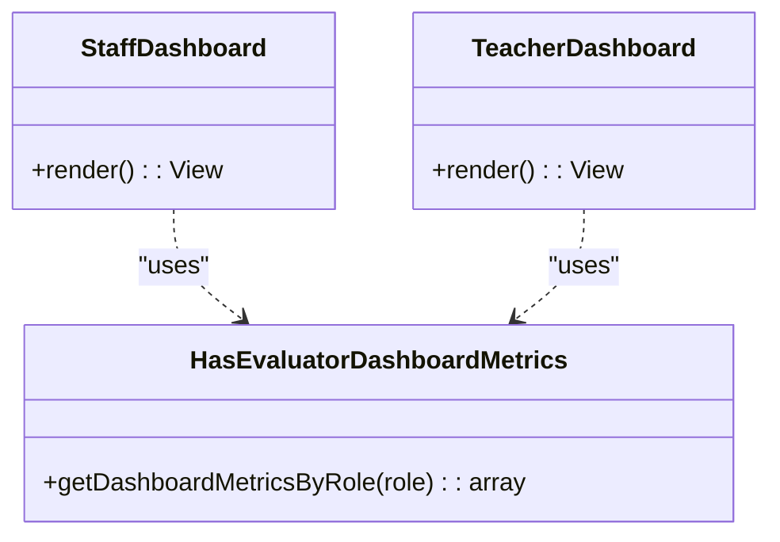
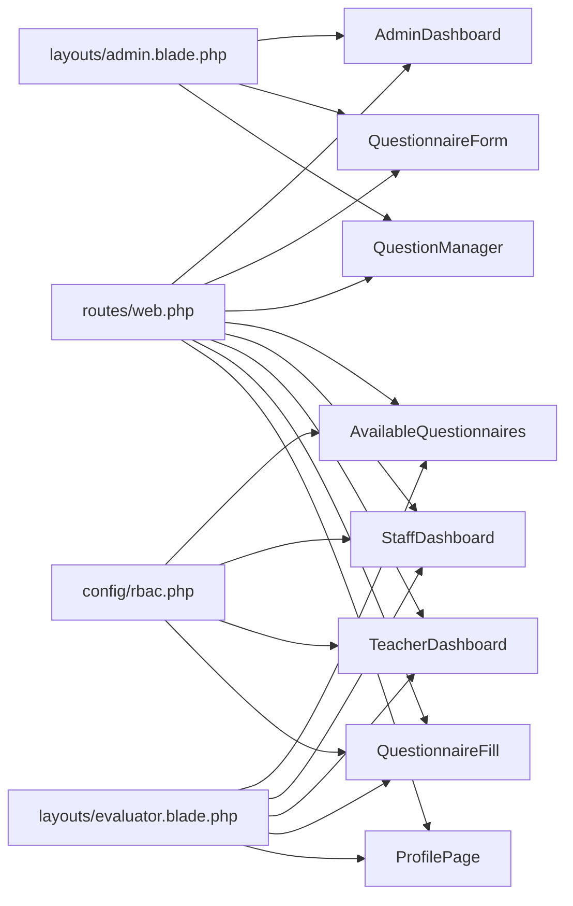

# Livewire Components

<cite>
**Referenced Files in This Document**
- [AdminDashboard.php](file://app/Livewire/Admin/AdminDashboard.php)
- [admin-dashboard.blade.php](file://resources/views/livewire/admin/admin-dashboard.blade.php)
- [AvailableQuestionnaires.php](file://app/Livewire/Fill/AvailableQuestionnaires.php)
- [available-questionnaires.blade.php](file://resources/views/livewire/fill/available-questionnaires.blade.php)
- [StaffDashboard.php](file://app/Livewire/Fill/StaffDashboard.php)
- [staff-dashboard.blade.php](file://resources/views/livewire/fill/staff-dashboard.blade.php)
- [TeacherDashboard.php](file://app/Livewire/Fill/TeacherDashboard.php)
- [teacher-dashboard.blade.php](file://resources/views/livewire/fill/teacher-dashboard.blade.php)
- [HasEvaluatorDashboardMetrics.php](file://app/Livewire/Fill/Concerns/HasEvaluatorDashboardMetrics.php)
- [QuestionnaireFill.php](file://app/Livewire/Fill/QuestionnaireFill.php)
- [questionnaire-fill.blade.php](file://resources/views/livewire/fill/questionnaire-fill.blade.php)
- [QuestionnaireForm.php](file://app/Livewire/Admin/QuestionnaireForm.php)
- [questionnaire-form.blade.php](file://resources/views/livewire/admin/questionnaire-form.blade.php)
- [QuestionManager.php](file://app/Livewire/Admin/QuestionManager.php)
- [question-manager.blade.php](file://resources/views/livewire/admin/question-manager.blade.php)
- [ProfilePage.php](file://app/Livewire/Shared/ProfilePage.php)
- [admin.blade.php](file://resources/views/layouts/admin.blade.php)
- [evaluator.blade.php](file://resources/views/layouts/evaluator.blade.php)
- [rbac.php](file://config/rbac.php)
- [web.php](file://routes/web.php)
</cite>

## Update Summary
**Changes Made**
- Enhanced AvailableQuestionnaires component with questionnaire-changed event dispatching for improved Alpine.js integration
- Added automatic page scrolling functionality when switching between questionnaires
- Updated component lifecycle and event handling documentation to reflect new event-driven behavior

## Table of Contents
1. [Introduction](#introduction)
2. [Project Structure](#project-structure)
3. [Core Components](#core-components)
4. [Architecture Overview](#architecture-overview)
5. [Detailed Component Analysis](#detailed-component-analysis)
6. [Dependency Analysis](#dependency-analysis)
7. [Performance Considerations](#performance-considerations)
8. [Troubleshooting Guide](#troubleshooting-guide)
9. [Conclusion](#conclusion)
10. [Appendices](#appendices)

## Introduction
This document explains the Livewire-based frontend components powering the assessment application. It covers component architecture, real-time interactions, state management, and integration with Blade templates. It documents:
- Admin dashboard and analytics components
- Questionnaire creation and editing interfaces
- Evaluator dashboards and questionnaire filling experiences
- Component lifecycle, event handling, and data binding patterns
- Examples of usage, customization, and performance considerations

## Project Structure
Livewire components are organized by domain:
- Admin: dashboard, analytics, questionnaires, and user/role management
- Fill: evaluator dashboards and questionnaire filling
- Shared: reusable pages like profile

Routing binds URLs to Livewire components, and Blade layouts provide consistent admin and evaluator UI shells.



**Diagram sources**
- [web.php:72-160](file://routes/web.php#L72-L160)
- [admin.blade.php:1-105](file://resources/views/layouts/admin.blade.php#L1-L105)
- [evaluator.blade.php:1-82](file://resources/views/layouts/evaluator.blade.php#L1-L82)

**Section sources**
- [web.php:72-160](file://routes/web.php#L72-L160)
- [admin.blade.php:1-105](file://resources/views/layouts/admin.blade.php#L1-L105)
- [evaluator.blade.php:1-82](file://resources/views/layouts/evaluator.blade.php#L1-L82)

## Core Components
- AdminDashboard: Aggregates global metrics and renders cards for active questionnaires, respondents, participation rate, average score, and per-role breakdown.
- QuestionnaireForm: CRUD for questionnaires with live field updates, validation, and target group selection.
- QuestionManager: Manages questions and answer options within a questionnaire, supports reordering and validation.
- AvailableQuestionnaires: Lists active questionnaires eligible for the current evaluator, draft/submitted history, and provides seamless navigation with automatic scrolling.
- StaffDashboard / TeacherDashboard: Role-specific dashboards powered by shared metrics trait.
- QuestionnaireFill: Full-page interactive questionnaire with navigation, autosave, validation, and submission.
- ProfilePage: Renders user profile with layout selection based on role.

**Section sources**
- [AdminDashboard.php:15-136](file://app/Livewire/Admin/AdminDashboard.php#L15-L136)
- [questionnaire-form.blade.php:1-149](file://resources/views/livewire/admin/questionnaire-form.blade.php#L1-L149)
- [QuestionnaireForm.php:15-132](file://app/Livewire/Admin/QuestionnaireForm.php#L15-L132)
- [QuestionManager.php:16-281](file://app/Livewire/Admin/QuestionManager.php#L16-L281)
- [question-manager.blade.php:1-188](file://resources/views/livewire/admin/question-manager.blade.php#L1-L188)
- [AvailableQuestionnaires.php:12-63](file://app/Livewire/Fill/AvailableQuestionnaires.php#L12-L63)
- [available-questionnaires.blade.php:1-85](file://resources/views/livewire/fill/available-questionnaires.blade.php#L1-L85)
- [StaffDashboard.php:9-22](file://app/Livewire/Fill/StaffDashboard.php#L9-L22)
- [staff-dashboard.blade.php:1-55](file://resources/views/livewire/fill/staff-dashboard.blade.php#L1-L55)
- [TeacherDashboard.php:9-22](file://app/Livewire/Fill/TeacherDashboard.php#L9-L22)
- [teacher-dashboard.blade.php:1-55](file://resources/views/livewire/fill/teacher-dashboard.blade.php#L1-L55)
- [HasEvaluatorDashboardMetrics.php:9-72](file://app/Livewire/Fill/Concerns/HasEvaluatorDashboardMetrics.php#L9-L72)
- [QuestionnaireFill.php:19-514](file://app/Livewire/Fill/QuestionnaireFill.php#L19-L514)
- [questionnaire-fill.blade.php:1-402](file://resources/views/livewire/fill/questionnaire-fill.blade.php#L1-L402)
- [ProfilePage.php:8-17](file://app/Livewire/Shared/ProfilePage.php#L8-L17)

## Architecture Overview
Livewire components encapsulate state and rendering logic. They bind directly to Blade templates, emit and listen to DOM events, and integrate with Laravel models and policies for authorization and persistence.

```mermaid
graph TB
subgraph "Admin Domain"
AD["AdminDashboard"]
QF["QuestionnaireForm"]
QM["QuestionManager"]
end
subgraph "Fill Domain"
AQ["AvailableQuestionnaires"]
SD["StaffDashboard"]
TD["TeacherDashboard"]
QFILL["QuestionnaireFill"]
end
subgraph "Shared"
PP["ProfilePage"]
end
BLADE_ADMIN["admin-dashboard.blade.php"]
BLADE_QFORM["questionnaire-form.blade.php"]
BLADE_QMAN["question-manager.blade.php"]
BLADE_AQ["available-questionnaires.blade.php"]
BLADE_SD["staff-dashboard.blade.php"]
BLADE_TD["teacher-dashboard.blade.php"]
BLADE_QFILL["questionnaire-fill.blade.php"]
LAYOUT_ADMIN["layouts/admin.blade.php"]
LAYOUT_EVAL["layouts/evaluator.blade.php"]
AD --> BLADE_ADMIN
QF --> BLADE_QFORM
QM --> BLADE_QMAN
AQ --> BLADE_AQ
SD --> BLADE_SD
TD --> BLADE_TD
QFILL --> BLADE_QFILL
PP --> LAYOUT_ADMIN
PP --> LAYOUT_EVAL
AD --> LAYOUT_ADMIN
QF --> LAYOUT_ADMIN
QM --> LAYOUT_ADMIN
AQ --> LAYOUT_EVAL
SD --> LAYOUT_EVAL
TD --> LAYOUT_EVAL
QFILL --> LAYOUT_EVAL
```



**Diagram sources**
- [AdminDashboard.php:25-135](file://app/Livewire/Admin/AdminDashboard.php#L25-L135)
- [questionnaire-form.blade.php:1-149](file://resources/views/livewire/admin/questionnaire-form.blade.php#L1-L149)
- [question-manager.blade.php:1-188](file://resources/views/livewire/admin/question-manager.blade.php#L1-L188)
- [available-questionnaires.blade.php:1-85](file://resources/views/livewire/fill/available-questionnaires.blade.php#L1-L85)
- [staff-dashboard.blade.php:1-55](file://resources/views/livewire/fill/staff-dashboard.blade.php#L1-L55)
- [teacher-dashboard.blade.php:1-55](file://resources/views/livewire/fill/teacher-dashboard.blade.php#L1-L55)
- [questionnaire-fill.blade.php:1-402](file://resources/views/livewire/fill/questionnaire-fill.blade.php#L1-L402)
- [admin.blade.php:1-105](file://resources/views/layouts/admin.blade.php#L1-L105)
- [evaluator.blade.php:1-82](file://resources/views/layouts/evaluator.blade.php#L1-L82)

## Detailed Component Analysis

### AdminDashboard
- Purpose: Render administrative overview with cached metrics.
- State: None persisted; computes metrics on render and caches for 5 minutes.
- Real-time interactions: None; relies on cached data.
- Authorization: Requires permission to view questionnaires.
- Rendering: Uses admin layout and admin-dashboard.blade.php.



**Diagram sources**
- [web.php:74](file://routes/web.php#L74)
- [AdminDashboard.php:20-135](file://app/Livewire/Admin/AdminDashboard.php#L20-L135)
- [admin-dashboard.blade.php:1-51](file://resources/views/livewire/admin/admin-dashboard.blade.php#L1-L51)

**Section sources**
- [AdminDashboard.php:15-136](file://app/Livewire/Admin/AdminDashboard.php#L15-L136)
- [admin-dashboard.blade.php:1-51](file://resources/views/livewire/admin/admin-dashboard.blade.php#L1-L51)

### QuestionnaireForm
- Purpose: Create/edit a questionnaire with live field updates and target group assignment.
- State: Public properties mirror form fields; computed labels from available target groups.
- Real-time interactions: Live binding with debounced updates; emits a target-groups-updated event to synchronize dependent components.
- Authorization: Uses policy checks for create/update.
- Rendering: Uses admin layout and questionnaire-form.blade.php.

```mermaid
sequenceDiagram
participant U as "User"
participant R as "Route"
participant C as "QuestionnaireForm"
participant V as "Blade View"
U->>R : GET /admin/questionnaires/create or edit
R->>C : Instantiate with optional Questionnaire
C->>C : mount() load available targets and defaults
C->>V : render('livewire.admin.questionnaire-form')
U->>V : Edit title/description/start/end/status/target_groups
V->>C : wire : model.live + debounce
U->>V : Click Save
V->>C : submit.save()
C->>C : validate + persist
C->>C : syncTargetGroups(data.target_groups)
-->>U : redirect to edit page with success flash
```

**Diagram sources**
- [web.php:79-82](file://routes/web.php#L79-L82)
- [QuestionnaireForm.php:40-107](file://app/Livewire/Admin/QuestionnaireForm.php#L40-L107)
- [questionnaire-form.blade.php:23-132](file://resources/views/livewire/admin/questionnaire-form.blade.php#L23-L132)

**Section sources**
- [QuestionnaireForm.php:15-132](file://app/Livewire/Admin/QuestionnaireForm.php#L15-L132)
- [questionnaire-form.blade.php:1-149](file://resources/views/livewire/admin/questionnaire-form.blade.php#L1-L149)

### QuestionManager
- Purpose: Manage questions and answer options inside a questionnaire.
- State: Tracks current editing question, form visibility, question text/type/required, and options.
- Real-time interactions: Live updates for type change; adds/removes options; validates minimum options for selectable types; reorders via up/down buttons.
- Persistence: Upserts/deletes answer options; swaps order via transaction-safe method.
- Rendering: Uses question-manager.blade.php.



**Diagram sources**
- [QuestionManager.php:35-281](file://app/Livewire/Admin/QuestionManager.php#L35-L281)
- [question-manager.blade.php:19-187](file://resources/views/livewire/admin/question-manager.blade.php#L19-L187)

**Section sources**
- [QuestionManager.php:16-281](file://app/Livewire/Admin/QuestionManager.php#L16-L281)
- [question-manager.blade.php:1-188](file://resources/views/livewire/admin/question-manager.blade.php#L1-L188)

### AvailableQuestionnaires
- Purpose: Show active questionnaires for the current evaluator and their draft/submitted history.
- State: Loads questionnaires filtered by target groups and role aliases; queries draft/submitted responses.
- Real-time interactions: Enhanced with questionnaire-changed event dispatching for improved Alpine.js integration and automatic page scrolling.
- Rendering: Uses evaluator layout and available-questionnaires.blade.php.

**Updated** Enhanced with event-driven navigation that provides seamless user experience through automatic page scrolling and improved Alpine.js integration.



**Diagram sources**
- [web.php:157-159](file://routes/web.php#L157-L159)
- [AvailableQuestionnaires.php:184-200](file://app/Livewire/Fill/AvailableQuestionnaires.php#L184-L200)
- [available-questionnaires.blade.php:281-286](file://resources/views/livewire/fill/available-questionnaires.blade.php#L281-L286)

**Section sources**
- [AvailableQuestionnaires.php:12-63](file://app/Livewire/Fill/AvailableQuestionnaires.php#L12-L63)
- [available-questionnaires.blade.php:1-85](file://resources/views/livewire/fill/available-questionnaires.blade.php#L1-L85)

### StaffDashboard and TeacherDashboard
- Purpose: Role-specific dashboards displaying stats and lists for available and completed questionnaires.
- State: Uses shared trait HasEvaluatorDashboardMetrics to compute stats and lists.
- Real-time interactions: None; renders precomputed payload.
- Rendering: Uses evaluator layout and respective blade templates.



**Diagram sources**
- [HasEvaluatorDashboardMetrics.php:11-71](file://app/Livewire/Fill/Concerns/HasEvaluatorDashboardMetrics.php#L11-L71)
- [StaffDashboard.php:12-21](file://app/Livewire/Fill/StaffDashboard.php#L12-L21)
- [TeacherDashboard.php:12-21](file://app/Livewire/Fill/TeacherDashboard.php#L12-L21)

**Section sources**
- [HasEvaluatorDashboardMetrics.php:9-72](file://app/Livewire/Fill/Concerns/HasEvaluatorDashboardMetrics.php#L9-L72)
- [StaffDashboard.php:9-22](file://app/Livewire/Fill/StaffDashboard.php#L9-L22)
- [staff-dashboard.blade.php:1-55](file://resources/views/livewire/fill/staff-dashboard.blade.php#L1-L55)
- [TeacherDashboard.php:9-22](file://app/Livewire/Fill/TeacherDashboard.php#L9-L22)
- [teacher-dashboard.blade.php:1-55](file://resources/views/livewire/fill/teacher-dashboard.blade.php#L1-L55)

### QuestionnaireFill
- Purpose: Interactive questionnaire with navigation, autosave, validation, and submission.
- State: Holds current question index, answers map, dirty flags, submission confirmation state, and thank-you state.
- Real-time interactions:
  - Live bindings for answers with debounced updates.
  - Autosave triggered on navigation via window events.
  - Validation runs locally in Blade and server-side on submit.
  - Submission persists answers and marks response submitted.
- Rendering: Uses evaluator layout and questionnaire-fill.blade.php.

```mermaid
sequenceDiagram
participant U as "User"
participant R as "Route"
participant C as "QuestionnaireFill"
participant V as "Blade View"
U->>R : GET /fill/questionnaires/{questionnaire}
R->>C : Instantiate with Questionnaire
C->>C : mount() load questions, initialize response & answers
C->>V : render('livewire.fill.questionnaire-fill', { currentQuestion, progress, counts })
U->>V : Navigate between questions
V->>C : goToQuestion()/nextQuestion()/previousQuestion()
V->>C : autosave via @queue-autosave
C->>C : persistDraftForQuestions(dirty ids)
U->>V : Click Submit
V->>C : openSubmitConfirmation()
C->>C : validateAllRequiredQuestions()
alt Valid
U->>V : Confirm submit
V->>C : submitFinal()
C->>C : upsert answers + update response
-->>V : showThankYou
else Invalid
C-->>V : scroll to first invalid question
end
```

**Diagram sources**
- [web.php:158](file://routes/web.php#L158)
- [QuestionnaireFill.php:44-514](file://app/Livewire/Fill/QuestionnaireFill.php#L44-L514)
- [questionnaire-fill.blade.php:69-384](file://resources/views/livewire/fill/questionnaire-fill.blade.php#L69-L384)

**Section sources**
- [QuestionnaireFill.php:19-514](file://app/Livewire/Fill/QuestionnaireFill.php#L19-L514)
- [questionnaire-fill.blade.php:1-402](file://resources/views/livewire/fill/questionnaire-fill.blade.php#L1-L402)

### ProfilePage
- Purpose: Render user profile page with layout selection based on role.
- State: Resolves user and layout dynamically.
- Real-time interactions: None; simple render-time logic.
- Rendering: Returns view with chosen layout.

**Section sources**
- [ProfilePage.php:8-17](file://app/Livewire/Shared/ProfilePage.php#L8-L17)

## Dependency Analysis
- Routing: Routes map to Livewire components and controllers; middleware enforces admin/evaluator access.
- RBAC: Configuration defines slugs, aliases, and dashboard paths used by components and layouts.
- Layouts: Admin and evaluator layouts inject assets and provide navigation; components choose layout via attributes or runtime logic.
- Authorization: Components use policy checks and role gates enforced by middleware.



**Diagram sources**
- [web.php:72-160](file://routes/web.php#L72-L160)
- [rbac.php:1-64](file://config/rbac.php#L1-L64)
- [admin.blade.php:1-105](file://resources/views/layouts/admin.blade.php#L1-L105)
- [evaluator.blade.php:1-82](file://resources/views/layouts/evaluator.blade.php#L1-L82)

**Section sources**
- [web.php:72-160](file://routes/web.php#L72-L160)
- [rbac.php:1-64](file://config/rbac.php#L1-L64)

## Performance Considerations
- Caching: AdminDashboard caches metrics for 5 minutes to reduce DB load.
- Lazy loading: QuestionManager loads questions/options on demand; QuestionnaireFill initializes only current page subset when single-question mode is enabled.
- Debounced input: QuestionnaireForm and QuestionnaireFill use debounced live updates to minimize server requests.
- Minimal reactivity: Components avoid unnecessary reactive properties; state is kept close to UI needs.
- Autosave strategy: Draft persistence occurs on navigation rather than frequent heartbeat, reducing write pressure.
- Blade rendering: Templates precompute counts and labels to keep Livewire state lean.
- Event-driven navigation: AvailableQuestionnaires uses efficient event dispatching for seamless transitions without full page reloads.

[No sources needed since this section provides general guidance]

## Troubleshooting Guide
- Access denied:
  - AdminDashboard requires permission to view questionnaires.
  - QuestionnaireFill denies access if questionnaire is inactive, not targeted, or already submitted.
- Validation errors:
  - QuestionManager enforces minimum options for selectable types and scores presence.
  - QuestionnaireFill validates required questions and displays scroll-to-first-error behavior.
- Target group mismatches:
  - QuestionnaireForm prevents removing the last target group; aliasing handled via configuration.
- Layout issues:
  - ProfilePage selects layout based on role; ensure role configuration aligns with user roles.
- Event integration issues:
  - AvailableQuestionnaires questionnaire-changed event requires proper Alpine.js integration for automatic scrolling functionality.

**Section sources**
- [AdminDashboard.php:20-23](file://app/Livewire/Admin/AdminDashboard.php#L20-L23)
- [QuestionnaireFill.php:44-80](file://app/Livewire/Fill/QuestionnaireFill.php#L44-L80)
- [QuestionManager.php:113-127](file://app/Livewire/Admin/QuestionManager.php#L113-L127)
- [questionnaire-fill.blade.php:103-115](file://resources/views/livewire/fill/questionnaire-fill.blade.php#L103-L115)
- [questionnaire-form.blade.php:96-98](file://resources/views/livewire/admin/questionnaire-form.blade.php#L96-L98)
- [ProfilePage.php:10-16](file://app/Livewire/Shared/ProfilePage.php#L10-L16)

## Conclusion
The Livewire components provide a cohesive, real-time frontend for administration and evaluation workflows. They leverage caching, debounced updates, and robust validation to balance responsiveness and correctness. Blade templates integrate seamlessly with component state, while routing and RBAC ensure secure, role-aware experiences. The enhanced AvailableQuestionnaires component demonstrates improved event-driven architecture with seamless Alpine.js integration for better user experience.

[No sources needed since this section summarizes without analyzing specific files]

## Appendices

### Component Lifecycle and Event Handling
- Lifecycle:
  - mount(): Initialize state and guards.
  - render(): Compute data and return view.
- Events:
  - QuestionnaireForm emits target-groups-updated to synchronize dependent components.
  - QuestionnaireFill dispatches queue-autosave and listens for autosave-status to show feedback.
  - **AvailableQuestionnaires** dispatches questionnaire-changed event for seamless navigation and automatic page scrolling.

**Updated** Enhanced AvailableQuestionnaires component now provides event-driven navigation with automatic page scrolling for improved user experience.

**Section sources**
- [QuestionnaireForm.php:109-121](file://app/Livewire/Admin/QuestionnaireForm.php#L109-L121)
- [questionnaire-fill.blade.php:69-76](file://resources/views/livewire/fill/questionnaire-fill.blade.php#L69-L76)
- [AvailableQuestionnaires.php:197-199](file://app/Livewire/Fill/AvailableQuestionnaires.php#L197-L199)
- [available-questionnaires.blade.php:281-286](file://resources/views/livewire/fill/available-questionnaires.blade.php#L281-L286)

### Data Binding Patterns
- wire:model.live and wire:model.live.debounce for immediate UI updates with throttled persistence.
- wire:click for actions like adding/removing options, moving questions, and navigation.
- wire:loading and wire:target for UX feedback during async operations.
- **Event-driven navigation** for seamless transitions between questionnaires.

**Section sources**
- [questionnaire-form.blade.php:27-64](file://resources/views/livewire/admin/questionnaire-form.blade.php#L27-L64)
- [question-manager.blade.php:32-122](file://resources/views/livewire/admin/question-manager.blade.php#L32-L122)
- [questionnaire-fill.blade.php:124-134](file://resources/views/livewire/fill/questionnaire-fill.blade.php#L124-L134)

### Integration with Blade Templates
- Components return views with compact data; Blade templates consume component-provided props and drive interactivity.
- Layouts inject assets and provide navigation; components choose layout via attributes or runtime logic.
- **Enhanced Alpine.js integration** with event listeners for improved user experience and seamless navigation.

**Section sources**
- [admin-dashboard.blade.php:1-51](file://resources/views/livewire/admin/admin-dashboard.blade.php#L1-L51)
- [questionnaire-fill.blade.php:500-513](file://resources/views/livewire/fill/questionnaire-fill.blade.php#L500-L513)
- [admin.blade.php:17-102](file://resources/views/layouts/admin.blade.php#L17-L102)
- [evaluator.blade.php:16-79](file://resources/views/layouts/evaluator.blade.php#L16-L79)
- [available-questionnaires.blade.php:281-286](file://resources/views/livewire/fill/available-questionnaires.blade.php#L281-L286)