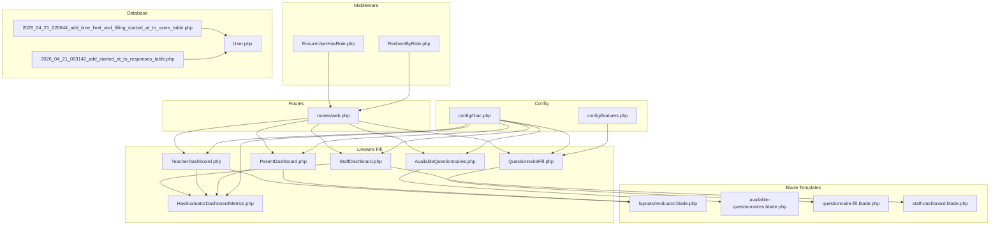
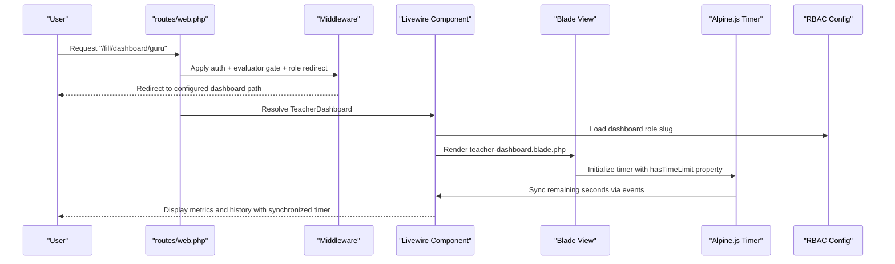
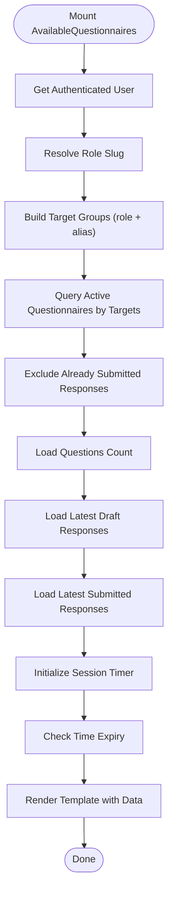
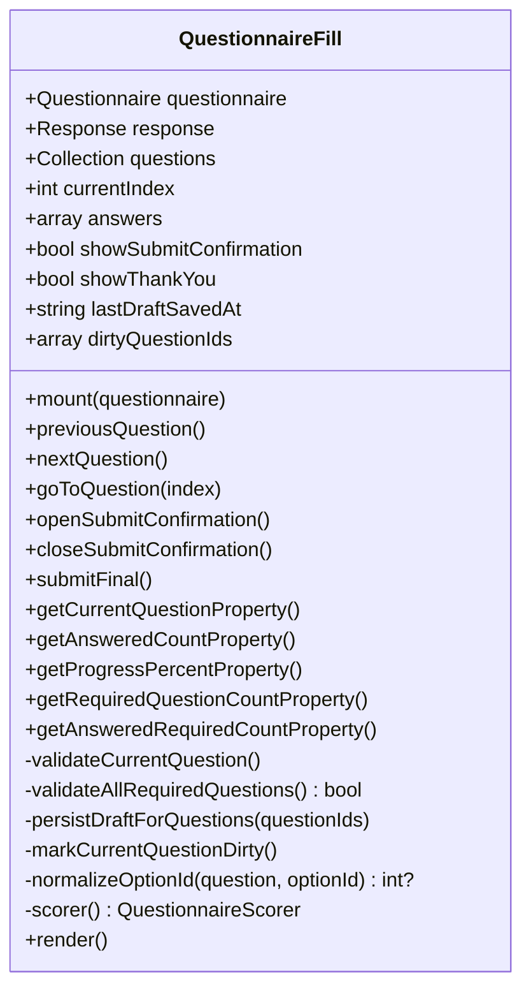
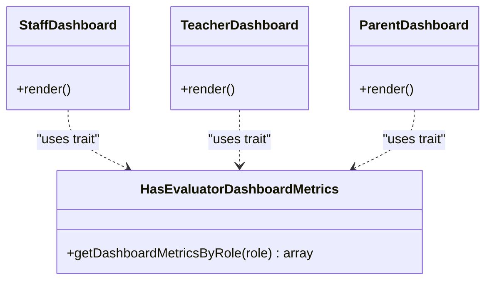
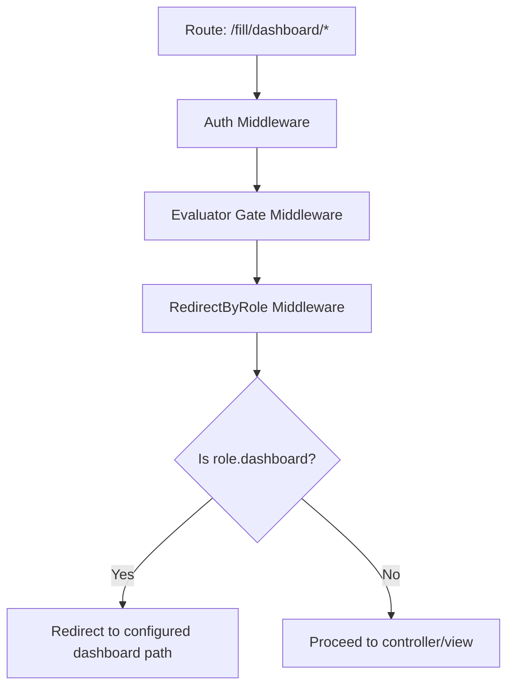
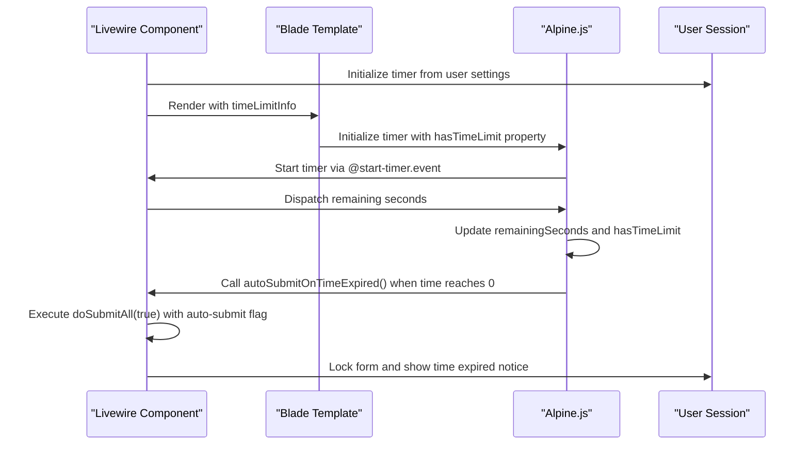
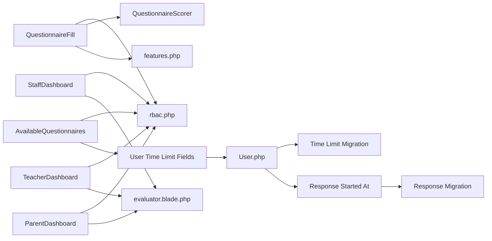

# Questionnaire Filling Components

<cite>
**Referenced Files in This Document**
- [AvailableQuestionnaires.php](file://app/Livewire/Fill/AvailableQuestionnaires.php)
- [QuestionnaireFill.php](file://app/Livewire/Fill/QuestionnaireFill.php)
- [StaffDashboard.php](file://app/Livewire/Fill/StaffDashboard.php)
- [TeacherDashboard.php](file://app/Livewire/Fill/TeacherDashboard.php)
- [ParentDashboard.php](file://app/Livewire/Fill/ParentDashboard.php)
- [HasEvaluatorDashboardMetrics.php](file://app/Livewire/Fill/Concerns/HasEvaluatorDashboardMetrics.php)
- [available-questionnaires.blade.php](file://resources/views/livewire/fill/available-questionnaires.blade.php)
- [questionnaire-fill.blade.php](file://resources/views/livewire/fill/questionnaire-fill.blade.php)
- [staff-dashboard.blade.php](file://resources/views/livewire/fill/staff-dashboard.blade.php)
- [evaluator.blade.php](file://resources/views/layouts/evaluator.blade.php)
- [web.php](file://routes/web.php)
- [rbac.php](file://config/rbac.php)
- [features.php](file://config/features.php)
- [EnsureUserHasRole.php](file://app/Http/Middleware/EnsureUserHasRole.php)
- [RedirectByRole.php](file://app/Http/Middleware/RedirectByRole.php)
- [2026_04_21_020644_add_time_limit_and_filling_started_at_to_users_table.php](file://database/migrations/2026_04_21_020644_add_time_limit_and_filling_started_at_to_users_table.php)
- [2026_04_21_003142_add_started_at_to_responses_table.php](file://database/migrations/2026_04_21_003142_add_started_at_to_responses_table.php)
- [User.php](file://app/Models/User.php)
</cite>

## Update Summary
**Changes Made**
- Enhanced timer synchronization between server-side Livewire component and client-side Alpine.js implementation
- Added new hasTimeLimit property for improved runtime condition checking
- Improved runtime condition checks replacing server-side conditional rendering
- Added comprehensive time limit functionality with session-based timer management
- Implemented auto-submit mechanism for expired time limits

## Table of Contents
1. [Introduction](#introduction)
2. [Project Structure](#project-structure)
3. [Core Components](#core-components)
4. [Architecture Overview](#architecture-overview)
5. [Detailed Component Analysis](#detailed-component-analysis)
6. [Timer Synchronization System](#timer-synchronization-system)
7. [Dependency Analysis](#dependency-analysis)
8. [Performance Considerations](#performance-considerations)
9. [Troubleshooting Guide](#troubleshooting-guide)
10. [Conclusion](#conclusion)
11. [Appendices](#appendices)

## Introduction
This document explains the questionnaire filling and dashboard components used by evaluators (teachers, staff, and parents). It covers:
- Available questionnaires listing and filtering by role
- Interactive questionnaire forms with validation, progress tracking, and submission
- Role-specific dashboards with metrics and history
- Real-time saving behavior and navigation controls
- Lifecycle management, state persistence, and UX patterns
- **Enhanced timer synchronization** between server-side Livewire components and client-side Alpine.js
- Responsive design, accessibility, and cross-device considerations
- Examples for customizing dashboard layouts and questionnaire presentation styles

## Project Structure
The questionnaire and dashboard features are implemented with Laravel Livewire components backed by Blade templates. Routing groups separate admin and evaluator spaces, while RBAC configuration defines role slugs, target aliases, and dashboard paths. The system now includes comprehensive time limit management with synchronized server-client timer functionality.

**Diagram sources**
- [web.php:149-160](file://routes/web.php#L149-L160)
- [AvailableQuestionnaires.php:11-62](file://app/Livewire/Fill/AvailableQuestionnaires.php#L11-L62)
- [QuestionnaireFill.php:18-514](file://app/Livewire/Fill/QuestionnaireFill.php#L18-L514)
- [StaffDashboard.php:9-22](file://app/Livewire/Fill/StaffDashboard.php#L9-L22)
- [TeacherDashboard.php:9-22](file://app/Livewire/Fill/TeacherDashboard.php#L9-L22)
- [ParentDashboard.php:9-22](file://app/Livewire/Fill/ParentDashboard.php#L9-L22)
- [HasEvaluatorDashboardMetrics.php:9-72](file://app/Livewire/Fill/Concerns/HasEvaluatorDashboardMetrics.php#L9-L72)
- [evaluator.blade.php:1-82](file://resources/views/layouts/evaluator.blade.php#L1-L82)
- [available-questionnaires.blade.php:1-85](file://resources/views/livewire/fill/available-questionnaires.blade.php#L1-L85)
- [questionnaire-fill.blade.php:1-402](file://resources/views/livewire/fill/questionnaire-fill.blade.php#L1-L402)
- [staff-dashboard.blade.php:1-55](file://resources/views/livewire/fill/staff-dashboard.blade.php#L1-L55)
- [rbac.php:1-64](file://config/rbac.php#L1-L64)
- [features.php:1-7](file://config/features.php#L1-L7)
- [EnsureUserHasRole.php:9-26](file://app/Http/Middleware/EnsureUserHasRole.php#L9-L26)
- [RedirectByRole.php:9-30](file://app/Http/Middleware/RedirectByRole.php#L9-L30)
- [2026_04_21_020644_add_time_limit_and_filling_started_at_to_users_table.php:14-17](file://database/migrations/2026_04_21_020644_add_time_limit_and_filling_started_at_to_users_table.php#L14-L17)
- [2026_04_21_003142_add_started_at_to_responses_table.php:14-16](file://database/migrations/2026_04_21_003142_add_started_at_to_responses_table.php#L14-L16)
- [User.php:26-27](file://app/Models/User.php#L26-L27)

**Section sources**
- [web.php:149-160](file://routes/web.php#L149-L160)
- [rbac.php:1-64](file://config/rbac.php#L1-L64)

## Core Components
- AvailableQuestionnaires: Lists active questionnaires targeted to the current user's role, excludes those already submitted, and shows draft/submitted histories. **Enhanced with comprehensive time limit management and synchronized timer functionality.**
- QuestionnaireFill: Interactive form with navigation, validation, autosave triggers, progress tracking, and final submission.
- Dashboards (Staff, Teacher, Parent): Role-specific dashboards rendering metrics and history via a shared trait.
- Layout: Evaluator layout with header navigation, theme toggle, and responsive container.

Key capabilities:
- Role-aware filtering and access control
- Draft persistence per response
- Validation per question type and required fields
- Progress percentage and answered counts
- Single-question vs page-mode rendering
- Confirmation modal before submission
- **Enhanced timer synchronization with hasTimeLimit property for runtime condition checking**
- **Auto-submit functionality for expired time limits**
- **Session-based timer management with start confirmation popup**

**Section sources**
- [AvailableQuestionnaires.php:14-62](file://app/Livewire/Fill/AvailableQuestionnaires.php#L14-L62)
- [AvailableQuestionnaires.php:47-58](file://app/Livewire/Fill/AvailableQuestionnaires.php#L47-L58)
- [AvailableQuestionnaires.php:557-586](file://app/Livewire/Fill/AvailableQuestionnaires.php#L557-L586)
- [QuestionnaireFill.php:44-122](file://app/Livewire/Fill/QuestionnaireFill.php#L44-L122)
- [QuestionnaireFill.php:247-299](file://app/Livewire/Fill/QuestionnaireFill.php#L247-L299)
- [QuestionnaireFill.php:301-388](file://app/Livewire/Fill/QuestionnaireFill.php#L301-L388)
- [QuestionnaireFill.php:408-470](file://app/Livewire/Fill/QuestionnaireFill.php#L408-L470)
- [StaffDashboard.php:14-21](file://app/Livewire/Fill/StaffDashboard.php#L14-L21)
- [TeacherDashboard.php:14-21](file://app/Livewire/Fill/TeacherDashboard.php#L14-L21)
- [ParentDashboard.php:14-21](file://app/Livewire/Fill/ParentDashboard.php#L14-L21)
- [HasEvaluatorDashboardMetrics.php:11-71](file://app/Livewire/Fill/Concerns/HasEvaluatorDashboardMetrics.php#L11-L71)
- [evaluator.blade.php:19-76](file://resources/views/layouts/evaluator.blade.php#L19-L76)

## Architecture Overview
The evaluator flow connects routes to Livewire components and Blade views, with RBAC configuration controlling role-based access and dashboard paths. **The system now includes sophisticated timer synchronization between server-side Livewire components and client-side Alpine.js implementation.**

**Diagram sources**
- [web.php:149-154](file://routes/web.php#L149-L154)
- [TeacherDashboard.php:10-21](file://app/Livewire/Fill/TeacherDashboard.php#L10-L21)
- [rbac.php:49-62](file://config/rbac.php#L49-L62)
- [available-questionnaires.blade.php:10-11](file://resources/views/livewire/fill/available-questionnaires.blade.php#L10-L11)
- [available-questionnaires.blade.php:153-162](file://resources/views/livewire/fill/available-questionnaires.blade.php#L153-L162)

## Detailed Component Analysis

### AvailableQuestionnaires Component
Responsibilities:
- Build target groups from user role and aliases
- Fetch active questionnaires matching targets and not yet submitted by the user
- Preload draft and submitted histories for quick access
- **Initialize session timer from user time limit settings**
- **Manage start confirmation popup for time-limited sessions**
- **Handle auto-submit when time limit expires**
- Pass data to the list view template

**Diagram sources**
- [AvailableQuestionnaires.php:62-67](file://app/Livewire/Fill/AvailableQuestionnaires.php#L62-L67)
- [AvailableQuestionnaires.php:291-354](file://app/Livewire/Fill/AvailableQuestionnaires.php#L291-L354)
- [AvailableQuestionnaires.php:557-586](file://app/Livewire/Fill/AvailableQuestionnaires.php#L557-L586)
- [AvailableQuestionnaires.php:600-612](file://app/Livewire/Fill/AvailableQuestionnaires.php#L600-L612)

**Section sources**
- [AvailableQuestionnaires.php:14-62](file://app/Livewire/Fill/AvailableQuestionnaires.php#L14-L62)
- [AvailableQuestionnaires.php:47-58](file://app/Livewire/Fill/AvailableQuestionnaires.php#L47-L58)
- [AvailableQuestionnaires.php:557-586](file://app/Livewire/Fill/AvailableQuestionnaires.php#L557-L586)
- [AvailableQuestionnaires.php:600-612](file://app/Livewire/Fill/AvailableQuestionnaires.php#L600-L612)
- [available-questionnaires.blade.php:1-85](file://resources/views/livewire/fill/available-questionnaires.blade.php#L1-L85)

### QuestionnaireFill Component
Responsibilities:
- Validate access by status, target group, and submission state
- Initialize questions and answers collection
- Manage navigation (previous/next/goTo), dirty tracking, and autosave triggers
- Validate per-question and all-required rules
- Persist drafts and final submission atomically
- Compute progress and answered counts

**Diagram sources**
- [QuestionnaireFill.php:19-514](file://app/Livewire/Fill/QuestionnaireFill.php#L19-L514)

**Section sources**
- [QuestionnaireFill.php:44-122](file://app/Livewire/Fill/QuestionnaireFill.php#L44-L122)
- [QuestionnaireFill.php:124-191](file://app/Livewire/Fill/QuestionnaireFill.php#L124-L191)
- [QuestionnaireFill.php:193-245](file://app/Livewire/Fill/QuestionnaireFill.php#L193-L245)
- [QuestionnaireFill.php:247-299](file://app/Livewire/Fill/QuestionnaireFill.php#L247-L299)
- [QuestionnaireFill.php:301-388](file://app/Livewire/Fill/QuestionnaireFill.php#L301-L388)
- [QuestionnaireFill.php:408-470](file://app/Livewire/Fill/QuestionnaireFill.php#L408-L470)
- [questionnaire-fill.blade.php:1-402](file://resources/views/livewire/fill/questionnaire-fill.blade.php#L1-L402)

### Role-Specific Dashboards
Each dashboard resolves its role slug from configuration and delegates metric computation to a shared trait. The evaluator layout provides a unified header and navigation.

**Diagram sources**
- [StaffDashboard.php:10-21](file://app/Livewire/Fill/StaffDashboard.php#L10-L21)
- [TeacherDashboard.php:10-21](file://app/Livewire/Fill/TeacherDashboard.php#L10-L21)
- [ParentDashboard.php:10-21](file://app/Livewire/Fill/ParentDashboard.php#L10-L21)
- [HasEvaluatorDashboardMetrics.php:9-72](file://app/Livewire/Fill/Concerns/HasEvaluatorDashboardMetrics.php#L9-L72)

**Section sources**
- [StaffDashboard.php:14-21](file://app/Livewire/Fill/StaffDashboard.php#L14-L21)
- [TeacherDashboard.php:14-21](file://app/Livewire/Fill/TeacherDashboard.php#L14-L21)
- [ParentDashboard.php:14-21](file://app/Livewire/Fill/ParentDashboard.php#L14-L21)
- [HasEvaluatorDashboardMetrics.php:11-71](file://app/Livewire/Fill/Concerns/HasEvaluatorDashboardMetrics.php#L11-L71)
- [evaluator.blade.php:19-76](file://resources/views/layouts/evaluator.blade.php#L19-L76)

### Navigation and Access Control
- Routes define evaluator space under a dedicated prefix and named groups.
- Middleware ensures authenticated users and restricts by role gates.
- Redirect middleware sends users to their role-specific dashboard path.

**Diagram sources**
- [web.php:149-154](file://routes/web.php#L149-L154)
- [RedirectByRole.php:11-29](file://app/Http/Middleware/RedirectByRole.php#L11-L29)
- [EnsureUserHasRole.php:11-25](file://app/Http/Middleware/EnsureUserHasRole.php#L11-L25)

**Section sources**
- [web.php:149-160](file://routes/web.php#L149-L160)
- [EnsureUserHasRole.php:9-26](file://app/Http/Middleware/EnsureUserHasRole.php#L9-L26)
- [RedirectByRole.php:9-30](file://app/Http/Middleware/RedirectByRole.php#L9-L30)

## Timer Synchronization System

**Updated** Enhanced timer synchronization between server-side Livewire component and client-side Alpine.js implementation with improved runtime condition checks.

The system now features comprehensive time limit management with synchronized timer functionality:

### Server-Side Timer Management
- **Session-based timer initialization** from user's `time_limit_minutes` setting
- **Start confirmation popup** for time-limited sessions before timer begins
- **Auto-submit mechanism** when time limit expires
- **Runtime condition checking** replacing server-side conditional rendering

### Client-Side Timer Implementation
- **Alpine.js timer integration** with `hasTimeLimit` property for runtime checks
- **Event-driven synchronization** via `@start-timer.window` and `@autosave-status.window`
- **Hidden input synchronization** to maintain timer state across Livewire morphs
- **Improved error handling** for edge cases in timer expiration

### Key Timer Features
- **Start confirmation popup** with time limit display and important notices
- **Real-time countdown display** with color-coded warnings (amber/red for low time)
- **Auto-submit on expiration** with user notification
- **Session persistence** through hidden inputs and browser events
- **Graceful degradation** when timer synchronization fails

**Diagram sources**
- [AvailableQuestionnaires.php:557-586](file://app/Livewire/Fill/AvailableQuestionnaires.php#L557-L586)
- [AvailableQuestionnaires.php:282-289](file://app/Livewire/Fill/AvailableQuestionnaires.php#L282-L289)
- [available-questionnaires.blade.php:10-11](file://resources/views/livewire/fill/available-questionnaires.blade.php#L10-L11)
- [available-questionnaires.blade.php:153-162](file://resources/views/livewire/fill/available-questionnaires.blade.php#L153-L162)
- [available-questionnaires.blade.php:20-38](file://resources/views/livewire/fill/available-questionnaires.blade.php#L20-L38)

**Section sources**
- [AvailableQuestionnaires.php:47-58](file://app/Livewire/Fill/AvailableQuestionnaires.php#L47-L58)
- [AvailableQuestionnaires.php:557-586](file://app/Livewire/Fill/AvailableQuestionnaires.php#L557-L586)
- [AvailableQuestionnaires.php:596-612](file://app/Livewire/Fill/AvailableQuestionnaires.php#L596-L612)
- [AvailableQuestionnaires.php:282-289](file://app/Livewire/Fill/AvailableQuestionnaires.php#L282-L289)
- [available-questionnaires.blade.php:10-11](file://resources/views/livewire/fill/available-questionnaires.blade.php#L10-L11)
- [available-questionnaires.blade.php:13-38](file://resources/views/livewire/fill/available-questionnaires.blade.php#L13-L38)
- [available-questionnaires.blade.php:153-162](file://resources/views/livewire/fill/available-questionnaires.blade.php#L153-L162)

## Dependency Analysis
- Components depend on RBAC configuration for role slugs, target aliases, and dashboard paths.
- QuestionnaireFill depends on QuestionnaireScorer for scoring during submission.
- Views rely on Livewire directives and Alpine.js for client-side validation and UX.
- **Timer functionality depends on User model time limit fields and database migrations.**

**Diagram sources**
- [AvailableQuestionnaires.php:18-22](file://app/Livewire/Fill/AvailableQuestionnaires.php#L18-L22)
- [QuestionnaireFill.php:495-498](file://app/Livewire/Fill/QuestionnaireFill.php#L495-L498)
- [StaffDashboard.php:16-20](file://app/Livewire/Fill/StaffDashboard.php#L16-L20)
- [TeacherDashboard.php:16-20](file://app/Livewire/Fill/TeacherDashboard.php#L16-L20)
- [ParentDashboard.php:16-20](file://app/Livewire/Fill/ParentDashboard.php#L16-L20)
- [rbac.php:1-64](file://config/rbac.php#L1-L64)
- [features.php:4](file://config/features.php#L4)
- [evaluator.blade.php:19](file://resources/views/layouts/evaluator.blade.php#L19)
- [User.php:26-27](file://app/Models/User.php#L26-L27)
- [2026_04_21_020644_add_time_limit_and_filling_started_at_to_users_table.php:14-17](file://database/migrations/2026_04_21_020644_add_time_limit_and_filling_started_at_to_users_table.php#L14-L17)
- [2026_04_21_003142_add_started_at_to_responses_table.php:14-16](file://database/migrations/2026_04_21_003142_add_started_at_to_responses_table.php#L14-L16)

**Section sources**
- [rbac.php:1-64](file://config/rbac.php#L1-L64)
- [features.php:1-7](file://config/features.php#L1-L7)
- [User.php:26-27](file://app/Models/User.php#L26-L27)

## Performance Considerations
- Efficient queries: eager load counts and relations to minimize N+1 issues.
- Transactional writes: batch upserts for answers and single delete for empty answers reduce DB round trips.
- Debounce input: textarea updates are debounced to limit server load.
- Conditional rendering: single-question mode reduces DOM size and re-renders.
- **Timer optimization**: Alpine.js timer runs efficiently with interval cleanup and proper event handling.
- **Memory management**: Timer intervals are cleared on Livewire re-render to prevent memory leaks.

Recommendations:
- Add pagination for long questionnaire lists if needed.
- Consider caching frequently accessed metrics for dashboards.
- Monitor autosave frequency and adjust debounce timing based on device performance.
- **Monitor timer synchronization performance for large user bases.**

## Troubleshooting Guide
Common issues and resolutions:
- Access denied: Ensure user role matches questionnaire target groups and questionnaire is active.
- Already submitted: Users cannot re-open a questionnaire after submission; they are redirected to the listing.
- Validation errors: Required fields trigger immediate validation; errors highlight invalid questions and scroll to the validation panel.
- Autosave not triggering: Navigation actions dispatch a queue event; ensure Livewire and Alpine bindings are intact.
- **Timer synchronization issues**: Check that `hasTimeLimit` property is properly initialized and timer events are firing correctly.
- **Time limit not working**: Verify user has `time_limit_minutes` set and `filling_started_at` is populated after start confirmation.
- **Auto-submit not triggering**: Ensure `autoSubmitOnTimeExpired()` method is callable and timer interval is properly managed.

**Section sources**
- [QuestionnaireFill.php:49-79](file://app/Livewire/Fill/QuestionnaireFill.php#L49-L79)
- [QuestionnaireFill.php:172-191](file://app/Livewire/Fill/QuestionnaireFill.php#L172-L191)
- [questionnaire-fill.blade.php:103-115](file://resources/views/livewire/fill/questionnaire-fill.blade.php#L103-L115)
- [questionnaire-fill.blade.php:69-75](file://resources/views/livewire/fill/questionnaire-fill.blade.php#L69-L75)
- [AvailableQuestionnaires.php:282-289](file://app/Livewire/Fill/AvailableQuestionnaires.php#L282-L289)
- [available-questionnaires.blade.php:20-38](file://resources/views/livewire/fill/available-questionnaires.blade.php#L20-L38)

## Conclusion
The questionnaire and dashboard system provides a cohesive, role-aware experience for evaluators with **enhanced timer synchronization** between server-side Livewire components and client-side Alpine.js implementation. The system emphasizes robust validation, progress visibility, reliable persistence, and **comprehensive time limit management**. The modular design allows easy customization of dashboards and questionnaire presentation modes while maintaining **improved runtime condition checking** and **auto-submit functionality** for expired time limits.

## Appendices

### Form Validation Rules and Behavior
- Single choice: required integer when question is required.
- Essay: required string with min/max length constraints.
- Combined: requires both selected option and essay text.
- On submit: validates all required questions; focuses first invalid question.

**Section sources**
- [QuestionnaireFill.php:301-335](file://app/Livewire/Fill/QuestionnaireFill.php#L301-L335)
- [QuestionnaireFill.php:342-388](file://app/Livewire/Fill/QuestionnaireFill.php#L342-L388)
- [questionnaire-fill.blade.php:15-68](file://resources/views/livewire/fill/questionnaire-fill.blade.php#L15-L68)

### Progress Tracking and Metrics
- Progress percent computed from answered count vs total questions.
- Required vs answered required counts enable completion indicators.
- Metrics include active questionnaires, available to fill, and completed totals.
- **Timer-based progress tracking with hasTimeLimit property for runtime condition checking.**

**Section sources**
- [QuestionnaireFill.php:247-299](file://app/Livewire/Fill/QuestionnaireFill.php#L247-L299)
- [HasEvaluatorDashboardMetrics.php:57-70](file://app/Livewire/Fill/Concerns/HasEvaluatorDashboardMetrics.php#L57-L70)
- [AvailableQuestionnaires.php:10-11](file://resources/views/livewire/fill/available-questionnaires.blade.php#L10-L11)

### Real-Time Saving and Navigation Controls
- Autosave triggered on navigation; heartbeat event handled via Alpine.
- Quick-access buttons for each question aid navigation.
- Single-question mode displays one question at a time with Previous/Next controls.
- **Enhanced timer synchronization with improved runtime condition checks.**

**Section sources**
- [questionnaire-fill.blade.php:69-75](file://resources/views/livewire/fill/questionnaire-fill.blade.php#L69-L75)
- [questionnaire-fill.blade.php:117-135](file://resources/views/livewire/fill/questionnaire-fill.blade.php#L117-L135)
- [questionnaire-fill.blade.php:289-320](file://resources/views/livewire/fill/questionnaire-fill.blade.php#L289-L320)
- [features.php:4](file://config/features.php#L4)

### Timer Synchronization Details
- **Server-side timer initialization** from user's `time_limit_minutes` setting
- **Client-side Alpine.js timer** with `hasTimeLimit` property for runtime checks
- **Event-driven synchronization** via `@start-timer.window` and `@autosave-status.window`
- **Hidden input synchronization** to maintain timer state across Livewire morphs
- **Auto-submit mechanism** when time limit expires with user notification
- **Start confirmation popup** with time limit display and important notices

**Section sources**
- [AvailableQuestionnaires.php:557-586](file://app/Livewire/Fill/AvailableQuestionnaires.php#L557-L586)
- [AvailableQuestionnaires.php:282-289](file://app/Livewire/Fill/AvailableQuestionnaires.php#L282-L289)
- [available-questionnaires.blade.php:10-11](file://resources/views/livewire/fill/available-questionnaires.blade.php#L10-L11)
- [available-questionnaires.blade.php:13-38](file://resources/views/livewire/fill/available-questionnaires.blade.php#L13-L38)
- [available-questionnaires.blade.php:153-162](file://resources/views/livewire/fill/available-questionnaires.blade.php#L153-L162)

### Responsive Design and Accessibility
- Layout uses a centered container with responsive padding and grid layouts.
- Buttons and inputs use accessible sizes and states; validation messages are announced via status region.
- Theme toggle persists user preference in local storage.
- **Timer display includes color-coded warnings for low time remaining.**

**Section sources**
- [evaluator.blade.php:26-76](file://resources/views/layouts/evaluator.blade.php#L26-L76)
- [questionnaire-fill.blade.php:387-401](file://resources/views/livewire/fill/questionnaire-fill.blade.php#L387-L401)
- [available-questionnaires.blade.php:544-553](file://resources/views/livewire/fill/available-questionnaires.blade.php#L544-L553)

### Customization Examples
- Dashboard layout: Modify the grid columns and card content in the dashboard Blade templates.
- Questionnaire presentation: Toggle single-question mode via feature flag to change rendering behavior.
- Validation messaging: Adjust localized messages in the validation methods to reflect domain-specific terminology.
- **Timer customization**: Modify timer display format and warning thresholds in the Alpine.js timer implementation.
- **Time limit configuration**: Adjust user time limit settings and start confirmation behavior through database migrations and model attributes.

**Section sources**
- [staff-dashboard.blade.php:7-20](file://resources/views/livewire/fill/staff-dashboard.blade.php#L7-L20)
- [features.php:4](file://config/features.php#L4)
- [QuestionnaireFill.php:301-335](file://app/Livewire/Fill/QuestionnaireFill.php#L301-L335)
- [User.php:26-27](file://app/Models/User.php#L26-L27)
- [2026_04_21_020644_add_time_limit_and_filling_started_at_to_users_table.php:14-17](file://database/migrations/2026_04_21_020644_add_time_limit_and_filling_started_at_to_users_table.php#L14-L17)