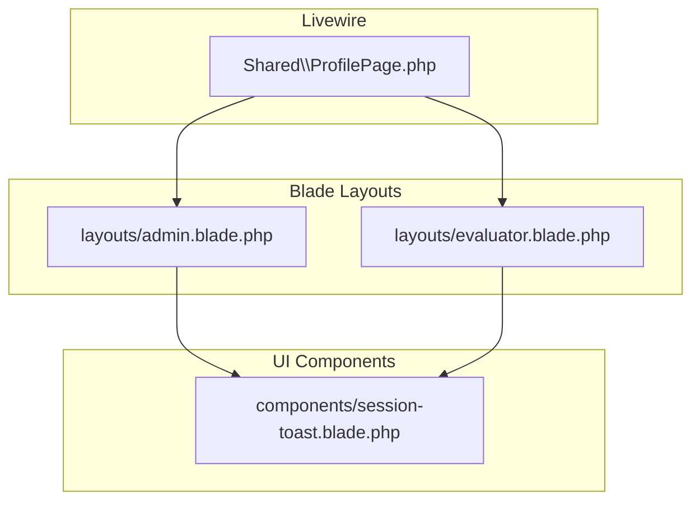
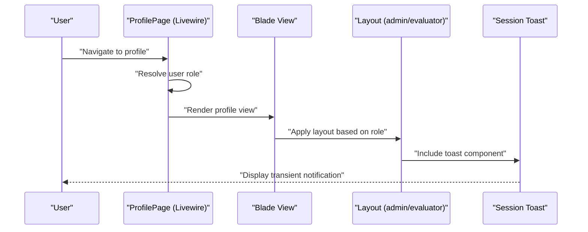
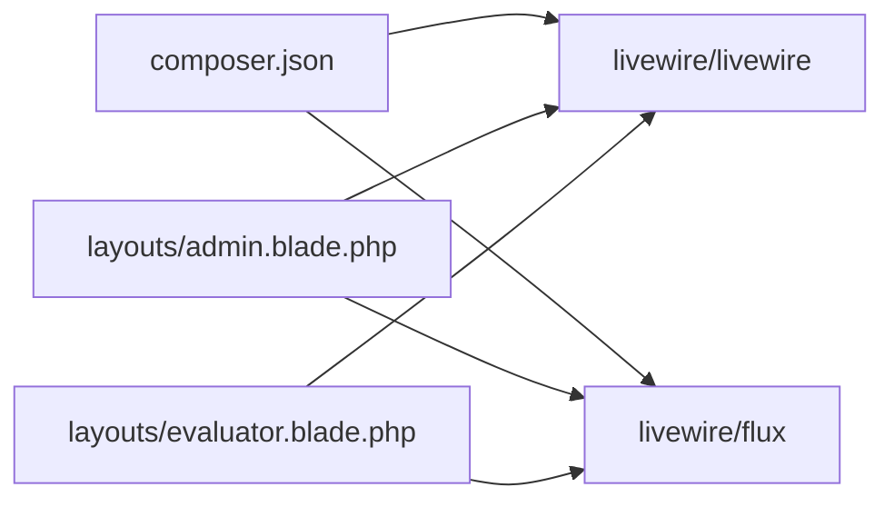

# Shared Components

<cite>
**Referenced Files in This Document**
- [ProfilePage.php](file://app/Livewire/Shared/ProfilePage.php)
- [admin.blade.php](file://resources/views/layouts/admin.blade.php)
- [evaluator.blade.php](file://resources/views/layouts/evaluator.blade.php)
- [session-toast.blade.php](file://resources/views/components/session-toast.blade.php)
- [composer.json](file://composer.json)
</cite>

## Table of Contents
1. [Introduction](#introduction)
2. [Project Structure](#project-structure)
3. [Core Components](#core-components)
4. [Architecture Overview](#architecture-overview)
5. [Detailed Component Analysis](#detailed-component-analysis)
6. [Dependency Analysis](#dependency-analysis)
7. [Performance Considerations](#performance-considerations)
8. [Troubleshooting Guide](#troubleshooting-guide)
9. [Conclusion](#conclusion)

## Introduction
This document describes the shared Livewire components used across the application, focusing on the profile management component and reusable UI utilities. It explains component composition patterns, prop passing, event handling, and state sharing between components. It also covers customization, styling integration, accessibility compliance, reusability patterns, dependency management, and performance optimization techniques.

## Project Structure
The shared components are organized under the Livewire namespace and rendered within role-specific Blade layouts. The profile page component dynamically selects a layout based on the authenticated user's role. Reusable UI utilities include a toast notification component integrated via a Blade component included in layouts.

**Diagram sources**
- [ProfilePage.php:8-16](file://app/Livewire/Shared/ProfilePage.php#L8-L16)
- [admin.blade.php:1-105](file://resources/views/layouts/admin.blade.php#L1-L105)
- [evaluator.blade.php:1-82](file://resources/views/layouts/evaluator.blade.php#L1-L82)
- [session-toast.blade.php:1-29](file://resources/views/components/session-toast.blade.php#L1-L29)

**Section sources**
- [ProfilePage.php:8-16](file://app/Livewire/Shared/ProfilePage.php#L8-L16)
- [admin.blade.php:1-105](file://resources/views/layouts/admin.blade.php#L1-L105)
- [evaluator.blade.php:1-82](file://resources/views/layouts/evaluator.blade.php#L1-L82)
- [session-toast.blade.php:1-29](file://resources/views/components/session-toast.blade.php#L1-L29)

## Core Components
- ProfilePage: A Livewire component that renders a profile page and applies a role-based layout. It determines the layout by checking the authenticated user’s role and delegates rendering to a Blade view while setting the appropriate layout.
- Session Toast: A reusable Blade component that displays transient notifications (success, error, warning) using Alpine.js animations and ARIA attributes for accessibility.

Key characteristics:
- Composition: The profile page composes a Blade view and sets a layout at render time.
- Prop passing: The component does not accept explicit props; it reads the current user from the session and derives layout selection from user state.
- Event handling: No custom events are emitted by the profile page; interactions are handled by the layouts and navigation links.
- State sharing: The component relies on the global authenticated user state and the Blade layout slot mechanism to share content across pages.

**Section sources**
- [ProfilePage.php:8-16](file://app/Livewire/Shared/ProfilePage.php#L8-L16)
- [session-toast.blade.php:1-29](file://resources/views/components/session-toast.blade.php#L1-L29)

## Architecture Overview
The profile page component integrates with role-aware layouts. The layout selection occurs inside the component’s render method, ensuring the correct navigation, branding, and footer appear depending on the user’s role. The session toast component is included in both layouts to provide consistent feedback across the application.

**Diagram sources**
- [ProfilePage.php:10-16](file://app/Livewire/Shared/ProfilePage.php#L10-L16)
- [admin.blade.php:91-98](file://resources/views/layouts/admin.blade.php#L91-L98)
- [evaluator.blade.php:26-76](file://resources/views/layouts/evaluator.blade.php#L26-L76)
- [session-toast.blade.php:6-28](file://resources/views/components/session-toast.blade.php#L6-L28)

## Detailed Component Analysis

### ProfilePage Component
Purpose:
- Render a profile page tailored to the authenticated user’s role.
- Dynamically select and apply a layout based on user role.

Implementation highlights:
- Uses the authenticated user to determine the layout.
- Renders a Blade view and applies the chosen layout.
- Delegates navigation, branding, and footer to the selected layout.

Customization patterns:
- To add new roles, extend the role check logic in the render method to map additional roles to layouts.
- To change the profile view, update the Blade view path returned by the render method.
- To alter layout behavior, modify the corresponding layout file.

Accessibility considerations:
- Ensure the Blade view uses semantic HTML and labels for interactive elements.
- Maintain focus management when navigating from the profile page to other sections.

Performance considerations:
- Keep the render method lightweight; avoid heavy computations here.
- Use caching or memoization for expensive user role checks if needed.

**Section sources**
- [ProfilePage.php:8-16](file://app/Livewire/Shared/ProfilePage.php#L8-L16)

### Session Toast Component
Purpose:
- Provide a consistent, accessible notification system for success, error, and warning messages.

Implementation highlights:
- Reads session flash messages to determine the toast type.
- Uses Alpine.js to show/hide the toast with transitions and a close button.
- Applies ARIA attributes for assistive technologies.

Customization patterns:
- To add new message types, extend the type detection logic and add corresponding styles.
- To adjust timing, modify the timeout value in the Alpine initialization.
- To change appearance, update the Tailwind classes applied conditionally.

Accessibility considerations:
- The toast is marked as a status live region and includes an aria label for the close button.
- Ensure sufficient color contrast for the toast backgrounds.

**Section sources**
- [session-toast.blade.php:1-29](file://resources/views/components/session-toast.blade.php#L1-L29)

### Layout Integration
Both admin and evaluator layouts include the session toast component and define role-specific navigation and branding. The evaluator layout also computes a dashboard route based on the user’s role slug.

Customization patterns:
- To add new navigation items, extend the navigation blocks in the layouts.
- To customize branding, update the layout’s header and footer content.
- To support new roles, add role checks and conditional navigation in the layouts.

Accessibility considerations:
- Ensure navigation buttons have meaningful labels and keyboard focus order.
- Maintain consistent focus traps and skip links if adding modals or dropdowns.

**Section sources**
- [admin.blade.php:25-98](file://resources/views/layouts/admin.blade.php#L25-L98)
- [evaluator.blade.php:20-76](file://resources/views/layouts/evaluator.blade.php#L20-L76)

## Dependency Analysis
External dependencies relevant to shared components:
- Livewire runtime and Flux UI components are declared in the project configuration.
- The layouts include Flux UI scripts and Livewire styles/scripts, enabling interactive components and styling.

**Diagram sources**
- [composer.json:8-14](file://composer.json#L8-L14)
- [admin.blade.php:16-102](file://resources/views/layouts/admin.blade.php#L16-L102)
- [evaluator.blade.php:15-79](file://resources/views/layouts/evaluator.blade.php#L15-L79)

**Section sources**
- [composer.json:8-14](file://composer.json#L8-L14)
- [admin.blade.php:16-102](file://resources/views/layouts/admin.blade.php#L16-L102)
- [evaluator.blade.php:15-79](file://resources/views/layouts/evaluator.blade.php#L15-L79)

## Performance Considerations
- Minimize work in Livewire render methods; defer heavy operations to actions or lifecycle hooks.
- Use Alpine.js judiciously; avoid complex reactive data structures in Blade components.
- Leverage browser caching for static assets managed by Vite.
- Keep layout templates modular to reduce re-rendering overhead when switching between roles.

## Troubleshooting Guide
Common issues and resolutions:
- Toast not appearing: Verify session flash data is set and the component is included in the layout.
- Incorrect layout applied: Confirm the user role check logic resolves as expected and the Blade view path is correct.
- Accessibility warnings: Ensure ARIA attributes and labels are present on interactive elements within the toast and layouts.

**Section sources**
- [session-toast.blade.php:12-26](file://resources/views/components/session-toast.blade.php#L12-L26)
- [ProfilePage.php:12-15](file://app/Livewire/Shared/ProfilePage.php#L12-L15)
- [admin.blade.php:91-98](file://resources/views/layouts/admin.blade.php#L91-L98)
- [evaluator.blade.php:26-76](file://resources/views/layouts/evaluator.blade.php#L26-L76)

## Conclusion
The shared components architecture centers on a role-aware profile page and a reusable toast notification system integrated into role-specific layouts. By composing Blade views with dynamic layout selection and leveraging Alpine.js for lightweight interactivity, the system achieves flexibility, accessibility, and maintainability. Extending the system involves adding new roles, updating layouts, and enhancing the toast component as needed.