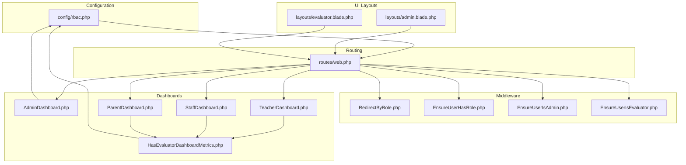
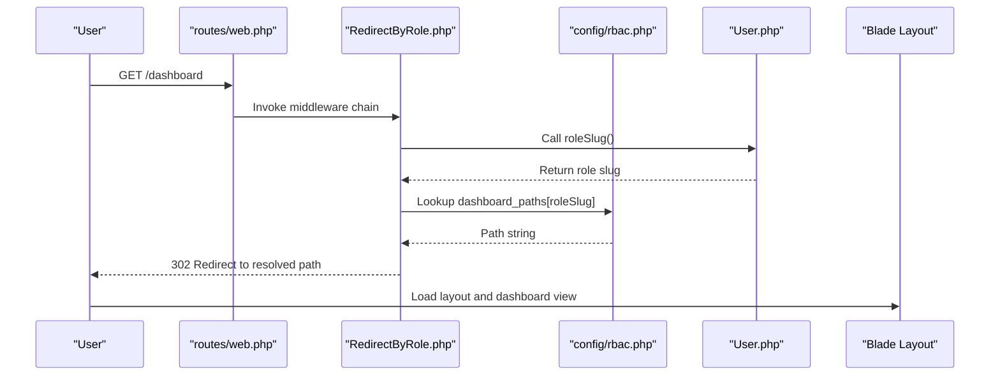
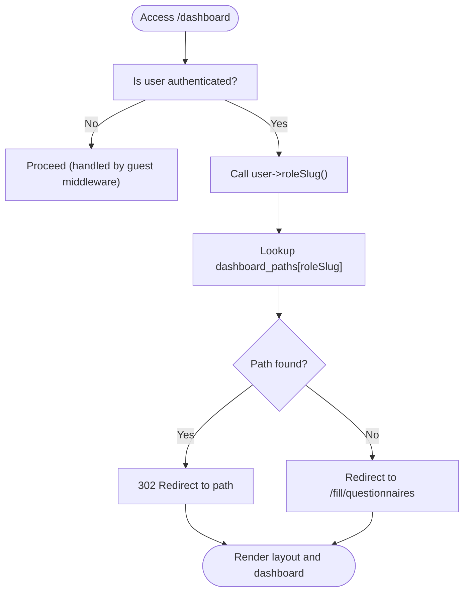
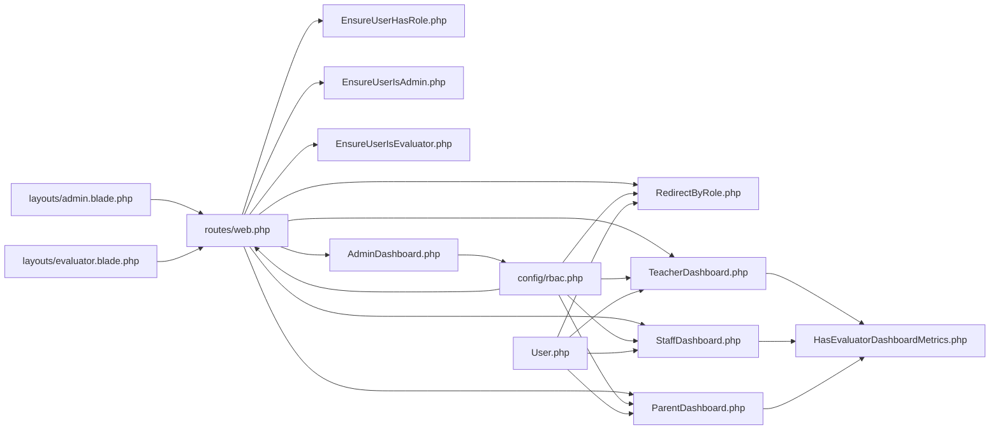

# Dashboard & Routing

<cite>
**Referenced Files in This Document**
- [rbac.php](file://config/rbac.php)
- [web.php](file://routes/web.php)
- [RedirectByRole.php](file://app/Http/Middleware/RedirectByRole.php)
- [EnsureUserHasRole.php](file://app/Http/Middleware/EnsureUserHasRole.php)
- [EnsureUserIsAdmin.php](file://app/Http/Middleware/EnsureUserIsAdmin.php)
- [EnsureUserIsEvaluator.php](file://app/Http/Middleware/EnsureUserIsEvaluator.php)
- [AdminDashboard.php](file://app/Livewire/Admin/AdminDashboard.php)
- [TeacherDashboard.php](file://app/Livewire/Fill/TeacherDashboard.php)
- [StaffDashboard.php](file://app/Livewire/Fill/StaffDashboard.php)
- [ParentDashboard.php](file://app/Livewire/Fill/ParentDashboard.php)
- [HasEvaluatorDashboardMetrics.php](file://app/Livewire/Fill/Concerns/HasEvaluatorDashboardMetrics.php)
- [admin.blade.php](file://resources/views/layouts/admin.blade.php)
- [evaluator.blade.php](file://resources/views/layouts/evaluator.blade.php)
- [User.php](file://app/Models/User.php)
</cite>

## Update Summary
**Changes Made**
- Updated role-based dashboard configuration section to reflect slug-based routing system
- Enhanced automatic redirection logic documentation to show role slug usage
- Added comprehensive coverage of the new slug-based user identification system
- Updated middleware documentation to reflect improved role resolution
- Expanded role-to-dashboard mapping with new slug-based relationships

## Table of Contents
1. [Introduction](#introduction)
2. [Project Structure](#project-structure)
3. [Core Components](#core-components)
4. [Architecture Overview](#architecture-overview)
5. [Detailed Component Analysis](#detailed-component-analysis)
6. [Dependency Analysis](#dependency-analysis)
7. [Performance Considerations](#performance-considerations)
8. [Troubleshooting Guide](#troubleshooting-guide)
9. [Conclusion](#conclusion)
10. [Appendices](#appendices)

## Introduction
This document explains the dashboard routing and role-based navigation system with enhanced slug-based routing capabilities. The system now uses role slugs instead of direct role names for improved routing consistency and better integration with the new slug field in the User entity. It covers how roles are mapped to dashboards, how automatic redirection works, and how different roles access their dashboards through the slug-based identification system. The documentation includes configuration keys such as dashboard_role_slugs, role_aliases, and dashboard_paths, along with route prefixes and naming conventions. Practical examples illustrate access patterns, navigation flows, and role-based content filtering.

## Project Structure
The dashboard and routing system spans configuration, routes, middleware, Livewire dashboards, and Blade layouts:
- Configuration defines role slugs, aliases, dashboard mappings, and route prefixes.
- Routes define admin and evaluator dashboards under prefixed namespaces.
- Middleware enforces access and redirects based on roles using slug-based identification.
- Livewire dashboards render role-specific content and metrics using role slugs.
- Blade layouts provide role-specific navigation and UI.

**Diagram sources**
- [rbac.php:1-64](file://config/rbac.php#L1-L64)
- [web.php:1-165](file://routes/web.php#L1-L165)
- [RedirectByRole.php:1-31](file://app/Http/Middleware/RedirectByRole.php#L1-L31)
- [EnsureUserHasRole.php:1-28](file://app/Http/Middleware/EnsureUserHasRole.php#L1-L28)
- [EnsureUserIsAdmin.php:1-23](file://app/Http/Middleware/EnsureUserIsAdmin.php#L1-L23)
- [EnsureUserIsEvaluator.php:1-23](file://app/Http/Middleware/EnsureUserIsEvaluator.php#L1-L23)
- [AdminDashboard.php:1-137](file://app/Livewire/Admin/AdminDashboard.php#L1-L137)
- [TeacherDashboard.php:1-23](file://app/Livewire/Fill/TeacherDashboard.php#L1-L23)
- [StaffDashboard.php:1-23](file://app/Livewire/Fill/StaffDashboard.php#L1-L23)
- [ParentDashboard.php:1-23](file://app/Livewire/Fill/ParentDashboard.php#L1-L23)
- [HasEvaluatorDashboardMetrics.php:1-73](file://app/Livewire/Fill/Concerns/HasEvaluatorDashboardMetrics.php#L1-L73)
- [admin.blade.php:1-105](file://resources/views/layouts/admin.blade.php#L1-L105)
- [evaluator.blade.php:1-82](file://resources/views/layouts/evaluator.blade.php#L1-L82)

**Section sources**
- [rbac.php:1-64](file://config/rbac.php#L1-L64)
- [web.php:1-165](file://routes/web.php#L1-L165)

## Core Components
- Role-based dashboard configuration with slug support
  - dashboard_role_slugs: maps internal dashboard keys to evaluator role slugs using slug-based identification.
  - role_aliases: aliases for administrative roles with slug support.
  - dashboard_paths: maps role slugs to absolute or relative dashboard paths with comprehensive slug coverage.
  - admin_route: route prefix and name prefix for admin routes.
- Route definitions
  - Admin dashboards under a configurable prefix and name.
  - Evaluator dashboards under fill/dashboard/<key> with slug-based routing.
  - Role-aware redirect endpoint for /dashboard using slug-based redirection.
- Middleware with slug-based access control
  - RedirectByRole: redirects authenticated users to their dashboard path using roleSlug().
  - EnsureUserHasRole: gatekeeper for allowed role slugs using slug-based validation.
  - EnsureUserIsAdmin and EnsureUserIsEvaluator: role-specific access enforcement with slug support.
- Livewire dashboards with slug-aware metrics
  - AdminDashboard: overview metrics for administrators using slug-based role classification.
  - TeacherDashboard, StaffDashboard, ParentDashboard: evaluator dashboards using shared metrics trait with slug-based filtering.
- Blade layouts with slug-aware navigation
  - Admin layout with navigation and conditional sections for slug-based role management.
  - Evaluator layout with dynamic dashboard links and role info using slug-based identification.

**Section sources**
- [rbac.php:12-40](file://config/rbac.php#L12-L40)
- [rbac.php:49-62](file://config/rbac.php#L49-L62)
- [web.php:29-33](file://routes/web.php#L29-L33)
- [web.php:57-59](file://routes/web.php#L57-L59)
- [web.php:72-147](file://routes/web.php#L72-L147)
- [web.php:149-160](file://routes/web.php#L149-L160)
- [RedirectByRole.php:11-29](file://app/Http/Middleware/RedirectByRole.php#L11-L29)
- [EnsureUserHasRole.php:11-25](file://app/Http/Middleware/EnsureUserHasRole.php#L11-L25)
- [EnsureUserIsAdmin.php:12-21](file://app/Http/Middleware/EnsureUserIsAdmin.php#L12-L21)
- [EnsureUserIsEvaluator.php:12-21](file://app/Http/Middleware/EnsureUserIsEvaluator.php#L12-L21)
- [AdminDashboard.php:25-135](file://app/Livewire/Admin/AdminDashboard.php#L25-L135)
- [TeacherDashboard.php:14-21](file://app/Livewire/Fill/TeacherDashboard.php#L14-L21)
- [StaffDashboard.php:14-21](file://app/Livewire/Fill/StaffDashboard.php#L14-L21)
- [ParentDashboard.php:14-21](file://app/Livewire/Fill/ParentDashboard.php#L14-L21)
- [HasEvaluatorDashboardMetrics.php:11-71](file://app/Livewire/Fill/Concerns/HasEvaluatorDashboardMetrics.php#L11-L71)
- [admin.blade.php:31-66](file://resources/views/layouts/admin.blade.php#L31-L66)
- [evaluator.blade.php:20-67](file://resources/views/layouts/evaluator.blade.php#L20-L67)

## Architecture Overview
The system orchestrates role-aware routing and automatic redirection using slug-based identification:
- The /dashboard route triggers RedirectByRole middleware, which resolves the user's role slug using roleSlug() and redirects to the configured dashboard path.
- Admin routes are grouped under a configurable prefix and name, while evaluator dashboards are grouped under fill/dashboard/<key> with slug-based routing.
- Middleware ensures only authorized roles can access admin or evaluator sections using slug-based validation.
- Livewire dashboards compute role-specific metrics and render Blade templates with role-aware layouts using slug-based filtering.

**Diagram sources**
- [web.php:57-59](file://routes/web.php#L57-L59)
- [RedirectByRole.php:11-29](file://app/Http/Middleware/RedirectByRole.php#L11-L29)
- [rbac.php:49-62](file://config/rbac.php#L49-L62)
- [User.php:65-68](file://app/Models/User.php#L65-L68)
- [evaluator.blade.php:20-24](file://resources/views/layouts/evaluator.blade.php#L20-L24)

## Detailed Component Analysis

### Enhanced Role-Based Dashboard Configuration
- dashboard_role_slugs
  - Maps internal keys (teacher, staff, parent) to evaluator role slugs (guru, tata_usaha, orang_tua) using slug-based identification.
  - Used by evaluator dashboards to fetch metrics for the mapped role slug.
  - **Updated**: Now supports comprehensive slug-based role mapping for improved routing consistency.
- role_aliases
  - Aliases administrative roles (e.g., super_admin to admin) for simplified access checks with slug support.
  - **Updated**: Enhanced to work seamlessly with the slug-based identification system.
- dashboard_paths
  - Maps role slugs to dashboard paths with comprehensive coverage including new slug variants.
  - Includes fallback for unknown roles and supports additional slug variants like pengurus_yayasan, guru_staf, rekan_kerja, komite, siswa, diri_sendiri(_kepala_sekolah).
  - **Updated**: Expanded to cover all possible role slug variations for robust routing.
- admin_route
  - Defines prefix and name prefix for admin routes, enabling customization of URLs and named routes.

Practical implications:
- Adding a new evaluator role requires adding a mapping in dashboard_role_slugs and a corresponding route in routes/web.php.
- The slug-based system ensures better integration with the new slug field in the User entity.
- To customize admin URLs, adjust admin_route.prefix and admin_route.name.

**Section sources**
- [rbac.php:12-16](file://config/rbac.php#L12-L16)
- [rbac.php:25-27](file://config/rbac.php#L25-L27)
- [rbac.php:49-62](file://config/rbac.php#L49-L62)
- [rbac.php:37-40](file://config/rbac.php#L37-L40)

### Automatic Redirection Logic with Slug-Based Identification
- The /dashboard route is defined with RedirectByRole middleware.
- On access, the middleware:
  - Resolves the authenticated user's role slug using the enhanced roleSlug() method.
  - Looks up the path in dashboard_paths using the slug-based key.
  - Redirects to the resolved path; defaults to fill/questionnaires if not found.

**Updated**: The redirection logic now uses roleSlug() instead of direct role access, ensuring better integration with the slug-based user identification system.

**Diagram sources**
- [web.php:57-59](file://routes/web.php#L57-L59)
- [RedirectByRole.php:11-29](file://app/Http/Middleware/RedirectByRole.php#L11-L29)
- [rbac.php:49-62](file://config/rbac.php#L49-L62)
- [User.php:65-68](file://app/Models/User.php#L65-L68)

**Section sources**
- [web.php:57-59](file://routes/web.php#L57-L59)
- [RedirectByRole.php:11-29](file://app/Http/Middleware/RedirectByRole.php#L11-L29)

### Admin Dashboards with Slug-Based Access Control
- Route group
  - Prefix and name derived from admin_route configuration.
  - Includes dashboard, analytics, exports, departments, users, and roles.
- Layout
  - Admin layout provides navigation and conditional sections for admin-only features.
- Metrics
  - AdminDashboard computes participation rates, counts, and breakdowns by role, using admin_slugs and questionnaire_target_aliases.
  - **Updated**: Enhanced to work seamlessly with the slug-based role classification system.

Customization tips:
- Adjust admin_route.prefix to change the admin URL base (e.g., admin-panel).
- Add new admin endpoints under the admin prefix and name.
- The slug-based system ensures consistent role handling across all admin operations.

**Section sources**
- [web.php:72-147](file://routes/web.php#L72-L147)
- [rbac.php:37-40](file://config/rbac.php#L37-L40)
- [admin.blade.php:31-66](file://resources/views/layouts/admin.blade.php#L31-L66)
- [AdminDashboard.php:25-135](file://app/Livewire/Admin/AdminDashboard.php#L25-L135)

### Evaluator Dashboards with Slug-Aware Metrics
- Route group
  - Under fill/dashboard/<key>, with routes for teacher, staff, and parent dashboards.
- Layout
  - Evaluator layout displays role and dynamic links to dashboards and questionnaires.
- Metrics
  - TeacherDashboard, StaffDashboard, ParentDashboard use a shared trait to compute:
    - Available questionnaires filtered by target groups and role aliases using slug-based filtering.
    - Completed responses for the current user using slug-based identification.
    - Statistics such as active questionnaires and counts using slug-based aggregation.

**Updated**: The evaluator dashboards now use slug-based filtering for improved accuracy and consistency with the new slug field system.

Role aliases and target groups:
- Target aliases combine primary and alias slugs to broaden the set of questionnaires considered for a given role.
- The metrics query filters questionnaires by target_group values derived from the user's role slug and its alias.
- **Enhanced**: The slug-based system ensures better integration with the User entity's slug field.

**Section sources**
- [web.php:149-160](file://routes/web.php#L149-L160)
- [TeacherDashboard.php:14-21](file://app/Livewire/Fill/TeacherDashboard.php#L14-L21)
- [StaffDashboard.php:14-21](file://app/Livewire/Fill/StaffDashboard.php#L14-L21)
- [ParentDashboard.php:14-21](file://app/Livewire/Fill/ParentDashboard.php#L14-L21)
- [HasEvaluatorDashboardMetrics.php:11-71](file://app/Livewire/Fill/Concerns/HasEvaluatorDashboardMetrics.php#L11-L71)
- [rbac.php:7-11](file://config/rbac.php#L7-L11)
- [rbac.php:12-16](file://config/rbac.php#L12-L16)

### Middleware and Access Control with Slug-Based Validation
- RedirectByRole
  - Redirects authenticated users to their dashboard path based on roleSlug() instead of direct role access.
  - **Enhanced**: Uses the new slug-based user identification system for improved routing consistency.
- EnsureUserHasRole
  - Enforces that the user has any of the allowed role slugs using slug-based validation; otherwise aborts with 403.
  - **Updated**: Now works seamlessly with the slug-based role classification system.
- EnsureUserIsAdmin and EnsureUserIsEvaluator
  - Guards admin and evaluator sections respectively, using slug-based role classification.
  - **Enhanced**: Improved integration with the slug-based user identification system.

Integration:
- Admin routes use EnsureUserHasRole with admin_slugs.
- Evaluator routes use EnsureUserHasRole with evaluator_slugs.
- The role redirect route uses EnsureUserHasRole with the configured evaluator slugs to ensure only evaluators are redirected.

**Section sources**
- [RedirectByRole.php:11-29](file://app/Http/Middleware/RedirectByRole.php#L11-L29)
- [EnsureUserHasRole.php:11-25](file://app/Http/Middleware/EnsureUserHasRole.php#L11-L25)
- [EnsureUserIsAdmin.php:12-21](file://app/Http/Middleware/EnsureUserIsAdmin.php#L12-L21)
- [EnsureUserIsEvaluator.php:12-21](file://app/Http/Middleware/EnsureUserIsEvaluator.php#L12-L21)
- [rbac.php:4-6](file://config/rbac.php#L4-L6)
- [rbac.php:49-62](file://config/rbac.php#L49-L62)

### Role Resolution and Content Filtering with Slug-Based System
- User model
  - roleSlug resolves the user's role slug from roleRef?->slug or legacy role field using the new slug field.
  - hasAnyRoleSlug checks membership against allowed slugs using slug-based validation.
  - isAdminRole and isEvaluatorRole leverage configuration arrays for role classification using slug-based identification.
  - **Enhanced**: The roleSlug() method now prioritizes the slug field from the Role entity for improved accuracy.
- Evaluator metrics
  - The shared trait builds targetGroups from the user's role slug and its alias, then queries questionnaires and responses accordingly.
  - **Updated**: Uses slug-based filtering for improved accuracy and consistency.

**Updated**: The role resolution system now uses the slug-based identification system, ensuring better integration with the new slug field in the User entity.

Practical examples:
- A user with role slug guru is redirected to /fill/dashboard/guru and sees questionnaires targeted to guru or its alias group using slug-based filtering.
- A user with role slug orang_tua is redirected to /fill/dashboard/parent and sees questionnaires targeted to orang_tua or its alias group using slug-based filtering.
- The system now properly handles users with slug fields in addition to legacy role fields.

**Section sources**
- [User.php:59-87](file://app/Models/User.php#L59-L87)
- [HasEvaluatorDashboardMetrics.php:11-71](file://app/Livewire/Fill/Concerns/HasEvaluatorDashboardMetrics.php#L11-L71)
- [rbac.php:7-11](file://config/rbac.php#L7-L11)

## Dependency Analysis
The following diagram shows how routes depend on middleware, configuration, and dashboards with enhanced slug-based dependencies.

**Diagram sources**
- [web.php:1-165](file://routes/web.php#L1-L165)
- [RedirectByRole.php:1-31](file://app/Http/Middleware/RedirectByRole.php#L1-L31)
- [EnsureUserHasRole.php:1-28](file://app/Http/Middleware/EnsureUserHasRole.php#L1-L28)
- [EnsureUserIsAdmin.php:1-23](file://app/Http/Middleware/EnsureUserIsAdmin.php#L1-L23)
- [EnsureUserIsEvaluator.php:1-23](file://app/Http/Middleware/EnsureUserIsEvaluator.php#L1-L23)
- [AdminDashboard.php:1-137](file://app/Livewire/Admin/AdminDashboard.php#L1-L137)
- [TeacherDashboard.php:1-23](file://app/Livewire/Fill/TeacherDashboard.php#L1-L23)
- [StaffDashboard.php:1-23](file://app/Livewire/Fill/StaffDashboard.php#L1-L23)
- [ParentDashboard.php:1-23](file://app/Livewire/Fill/ParentDashboard.php#L1-L23)
- [HasEvaluatorDashboardMetrics.php:1-73](file://app/Livewire/Fill/Concerns/HasEvaluatorDashboardMetrics.php#L1-L73)
- [rbac.php:1-64](file://config/rbac.php#L1-L64)
- [User.php:1-100](file://app/Models/User.php#L1-L100)
- [admin.blade.php:1-105](file://resources/views/layouts/admin.blade.php#L1-L105)
- [evaluator.blade.php:1-82](file://resources/views/layouts/evaluator.blade.php#L1-L82)

**Section sources**
- [web.php:1-165](file://routes/web.php#L1-L165)
- [rbac.php:1-64](file://config/rbac.php#L1-L64)

## Performance Considerations
- Caching
  - AdminDashboard caches overview metrics for a fixed duration to reduce database load.
- Query efficiency
  - Evaluator dashboards filter questionnaires and responses using targeted where clauses and joins with slug-based filtering.
- Middleware overhead
  - RedirectByRole performs a single config lookup per request using roleSlug(); keep dashboard_paths minimal and avoid heavy computation in middleware.

**Updated**: The slug-based system maintains efficient performance while providing more accurate role resolution.

Recommendations:
- Monitor cache TTL for AdminDashboard metrics.
- Index database columns used in evaluator queries (e.g., users.role, responses.status, questionnaire targets) with slug-based indexing.
- Keep role slug lists concise to minimize middleware checks.
- Consider caching roleSlug() results for frequently accessed users.

**Section sources**
- [AdminDashboard.php:27-130](file://app/Livewire/Admin/AdminDashboard.php#L27-L130)
- [HasEvaluatorDashboardMetrics.php:36-55](file://app/Livewire/Fill/Concerns/HasEvaluatorDashboardMetrics.php#L36-L55)

## Troubleshooting Guide
Common issues and resolutions:
- Unexpected redirect after login
  - Verify dashboard_paths contains entries for all active role slugs including new slug variants.
  - Confirm RedirectByRole middleware is applied to /dashboard and uses roleSlug().
- Access denied on admin or evaluator pages
  - Ensure user role slug matches configured admin_slugs or evaluator_slugs using slug-based validation.
  - Check EnsureUserHasRole usage in route groups with slug-based role checking.
- Evaluator dashboards show empty content
  - Confirm questionnaire targets include the user's role slug or its alias using slug-based filtering.
  - Verify target aliases mapping exists in questionnaire_target_aliases.
  - Check that the User entity has proper slug field values.
- Admin URLs not matching expectations
  - Adjust admin_route.prefix and admin_route.name to match desired URL structure.
- Slug-based routing issues
  - Verify User entity has proper slug field values.
  - Check that roleSlug() method returns expected slug values.
  - Ensure role_aliases configuration matches actual slug values.

**Updated**: Added troubleshooting guidance for slug-based routing issues and User entity slug field problems.

**Section sources**
- [rbac.php:4-6](file://config/rbac.php#L4-L6)
- [rbac.php:49-62](file://config/rbac.php#L49-L62)
- [web.php:72-147](file://routes/web.php#L72-L147)
- [web.php:149-160](file://routes/web.php#L149-L160)
- [HasEvaluatorDashboardMetrics.php:27-34](file://app/Livewire/Fill/Concerns/HasEvaluatorDashboardMetrics.php#L27-L34)
- [User.php:65-68](file://app/Models/User.php#L65-L68)

## Conclusion
The dashboard and routing system leverages a centralized configuration to map roles to dashboards with enhanced slug-based routing capabilities. The system now uses role slugs instead of direct role names for improved routing consistency and better integration with the new slug field in the User entity. Administrators and evaluators are directed to appropriate dashboards automatically using slug-based identification, while evaluator dashboards filter content based on role slugs and aliases. The design supports customization of route prefixes and naming conventions, includes caching and efficient queries for performance, and provides robust slug-based role resolution for better system reliability.

## Appendices

### Enhanced Role-to-Dashboard Mapping Reference
- Internal key to role slug
  - teacher → guru
  - staff → tata_usaha
  - parent → orang_tua
- Role slug to path (including slug variants)
  - super_admin, admin → /admin/dashboard
  - guru → /fill/dashboard/guru
  - tata_usaha → /fill/dashboard/staff
  - orang_tua → /fill/dashboard/parent
  - user → /fill/questionnaires
  - pengurus_yayasan → /fill/dashboard/staff
  - guru_staf → /fill/dashboard/guru
  - rekan_kerja → /fill/dashboard/guru
  - komite → /fill/dashboard/guru
  - siswa → /fill/dashboard/guru
  - diri_sendiri_kepala_sekolah → /fill/dashboard/guru

**Updated**: Expanded to include comprehensive slug variant coverage for robust routing.

**Section sources**
- [rbac.php:12-16](file://config/rbac.php#L12-L16)
- [rbac.php:49-62](file://config/rbac.php#L49-L62)

### Route Prefixes and Naming Conventions
- Admin route prefix and name
  - Prefix: admin_route.prefix
  - Name: admin_route.name
- Evaluator route prefix
  - Base: fill
  - Dashboard subpaths: teacher, staff, parent
- Named routes
  - Admin: admin.dashboard, admin.questionnaires.*, admin.exports.*, admin.users.*, admin.roles.*
  - Evaluator: fill.dashboard.teacher, fill.dashboard.staff, fill.dashboard.parent, fill.questionnaires.*

**Section sources**
- [rbac.php:37-40](file://config/rbac.php#L37-L40)
- [web.php:72-147](file://routes/web.php#L72-L147)
- [web.php:149-160](file://routes/web.php#L149-L160)

### Slug-Based User Identification System
- User roleSlug() method
  - Returns roleRef?->slug for slug-based identification
  - Falls back to legacy role field for backward compatibility
- Slug-based role classification
  - isAdminRole() uses slug-based admin_slugs configuration
  - isEvaluatorRole() uses slug-based evaluator_slugs configuration
- Benefits of slug-based system
  - Better integration with Role entity slug field
  - Improved routing consistency
  - Enhanced system reliability
  - Backward compatibility with legacy role fields

**New Section**
**Section sources**
- [User.php:65-68](file://app/Models/User.php#L65-L68)
- [rbac.php:4-6](file://config/rbac.php#L4-L6)
- [rbac.php:8-11](file://config/rbac.php#L8-L11)