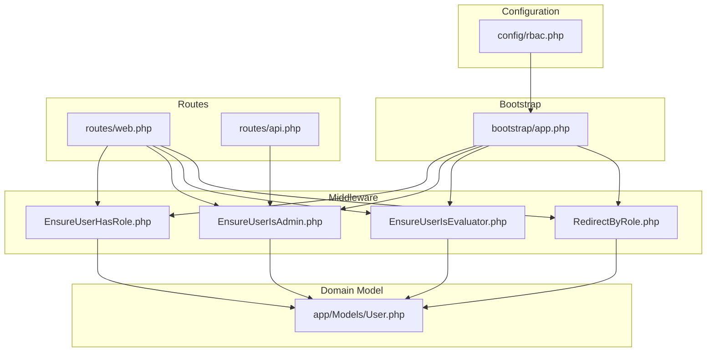
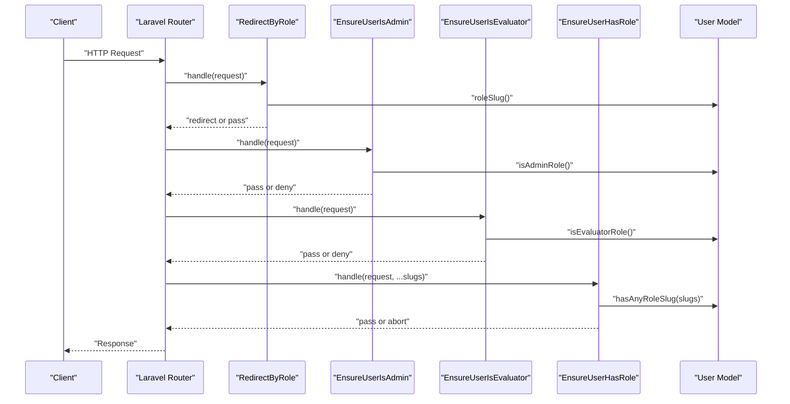
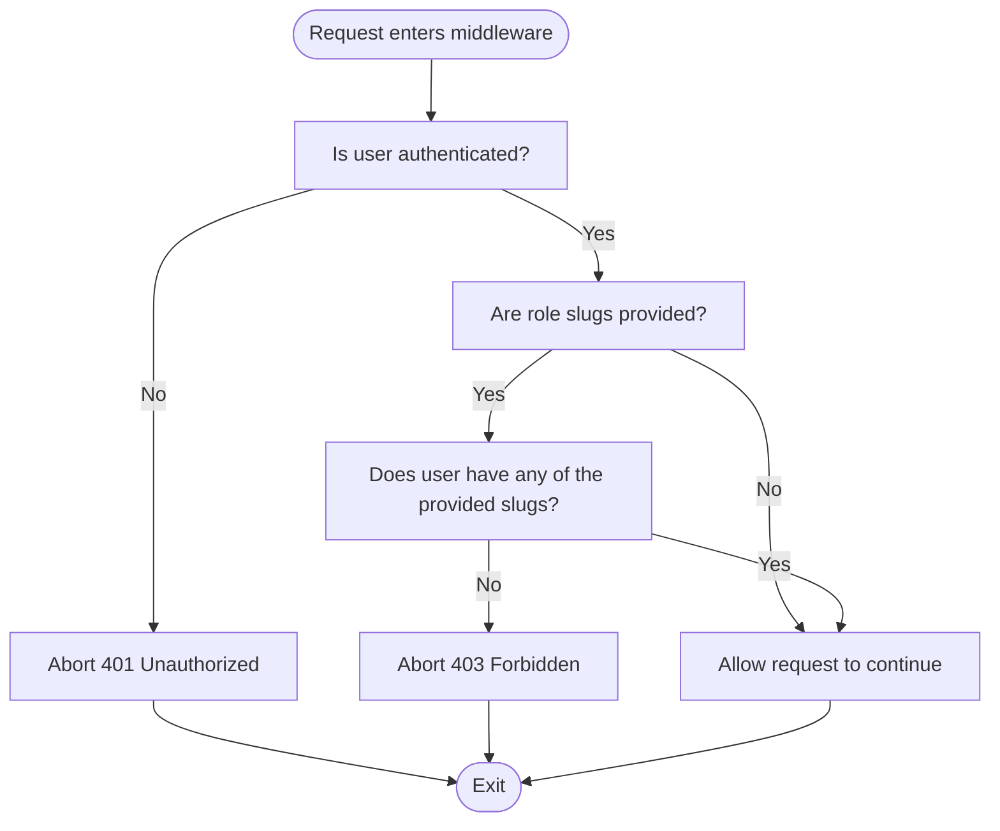
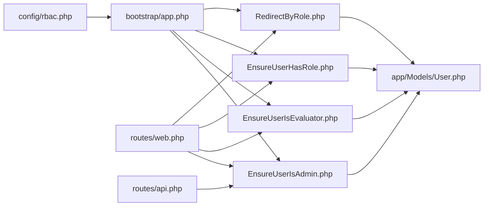

# Middleware Enforcement

<cite>
**Referenced Files in This Document**
- [EnsureUserHasRole.php](file://app/Http/Middleware/EnsureUserHasRole.php)
- [EnsureUserIsAdmin.php](file://app/Http/Middleware/EnsureUserIsAdmin.php)
- [EnsureUserIsEvaluator.php](file://app/Http/Middleware/EnsureUserIsEvaluator.php)
- [RedirectByRole.php](file://app/Http/Middleware/RedirectByRole.php)
- [rbac.php](file://config/rbac.php)
- [app.php](file://bootstrap/app.php)
- [web.php](file://routes/web.php)
- [api.php](file://routes/api.php)
- [User.php](file://app/Models/User.php)
- [RoleController.php](file://app/Http/Controllers/Admin/RoleController.php)
</cite>

## Table of Contents
1. [Introduction](#introduction)
2. [Project Structure](#project-structure)
3. [Core Components](#core-components)
4. [Architecture Overview](#architecture-overview)
5. [Detailed Component Analysis](#detailed-component-analysis)
6. [Dependency Analysis](#dependency-analysis)
7. [Performance Considerations](#performance-considerations)
8. [Troubleshooting Guide](#troubleshooting-guide)
9. [Conclusion](#conclusion)

## Introduction
This document explains the middleware-based role enforcement system used to protect routes and control access across the application. It focuses on four middleware components:
- EnsureUserHasRole: Enforces access based on one or more role slugs.
- EnsureUserIsAdmin: Restricts access to administrative functions.
- EnsureUserIsEvaluator: Restricts access to evaluator-facing features.
- RedirectByRole: Redirects authenticated users to role-specific dashboards.

It also documents middleware aliases, route protection patterns, access control logic, usage examples, middleware ordering, and troubleshooting guidance.

## Project Structure
The role enforcement system spans configuration, middleware, routing, and the User model:
- Configuration defines role slugs, middleware aliases, admin route settings, and dashboard paths.
- Middleware components enforce access checks during HTTP requests.
- Routes apply middleware to groups and individual endpoints.
- The User model exposes role-related helpers used by middleware and controllers.

**Diagram sources**
- [rbac.php:1-64](file://config/rbac.php#L1-L64)
- [app.php:17-28](file://bootstrap/app.php#L17-L28)
- [web.php:29-34](file://routes/web.php#L29-L34)
- [api.php:6-13](file://routes/api.php#L6-L13)
- [EnsureUserHasRole.php:11-25](file://app/Http/Middleware/EnsureUserHasRole.php#L11-L25)
- [EnsureUserIsAdmin.php:12-21](file://app/Http/Middleware/EnsureUserIsAdmin.php#L12-L21)
- [EnsureUserIsEvaluator.php:12-21](file://app/Http/Middleware/EnsureUserIsEvaluator.php#L12-L21)
- [RedirectByRole.php:11-24](file://app/Http/Middleware/RedirectByRole.php#L11-L24)
- [User.php:59-87](file://app/Models/User.php#L59-L87)

**Section sources**
- [rbac.php:1-64](file://config/rbac.php#L1-L64)
- [app.php:17-28](file://bootstrap/app.php#L17-L28)
- [web.php:29-34](file://routes/web.php#L29-L34)
- [api.php:6-13](file://routes/api.php#L6-L13)
- [User.php:59-87](file://app/Models/User.php#L59-L87)

## Core Components
This section documents each middleware component, its purpose, parameters, and behavior.

- EnsureUserHasRole
  - Purpose: Validates that the authenticated user possesses any of the specified role slugs.
  - Parameters: Accepts one or more slug arguments via variadic parameters.
  - Behavior:
    - If no user is authenticated, returns an unauthorized response.
    - If no slugs are provided, allows passage.
    - Otherwise, enforces that the user’s role slug matches any provided slug; otherwise returns forbidden.
  - Typical usage: Protect routes requiring specific roles (e.g., admin or evaluator roles).

- EnsureUserIsAdmin
  - Purpose: Ensures the authenticated user has an administrative role.
  - Behavior:
    - If no user is authenticated or the user is not admin, throws an access denied exception.
    - Otherwise, allows passage.

- EnsureUserIsEvaluator
  - Purpose: Ensures the authenticated user qualifies as an evaluator.
  - Behavior:
    - If no user is authenticated or the user does not qualify as evaluator, throws an access denied exception.
    - Otherwise, allows passage.

- RedirectByRole
  - Purpose: Redirects authenticated users to a role-specific dashboard when accessing the generic dashboard route.
  - Behavior:
    - If no user is authenticated, continues to the next middleware.
    - If the current route is the role dashboard route, redirects to the appropriate dashboard path based on the user’s role slug or a fallback.
    - Otherwise, allows passage.

**Section sources**
- [EnsureUserHasRole.php:11-25](file://app/Http/Middleware/EnsureUserHasRole.php#L11-L25)
- [EnsureUserIsAdmin.php:12-21](file://app/Http/Middleware/EnsureUserIsAdmin.php#L12-L21)
- [EnsureUserIsEvaluator.php:12-21](file://app/Http/Middleware/EnsureUserIsEvaluator.php#L12-L21)
- [RedirectByRole.php:11-24](file://app/Http/Middleware/RedirectByRole.php#L11-L24)

## Architecture Overview
The middleware enforcement architecture integrates configuration-driven aliases, route-level middleware application, and model-level role checks.

**Diagram sources**
- [RedirectByRole.php:11-24](file://app/Http/Middleware/RedirectByRole.php#L11-L24)
- [EnsureUserIsAdmin.php:12-21](file://app/Http/Middleware/EnsureUserIsAdmin.php#L12-L21)
- [EnsureUserIsEvaluator.php:12-21](file://app/Http/Middleware/EnsureUserIsEvaluator.php#L12-L21)
- [EnsureUserHasRole.php:11-25](file://app/Http/Middleware/EnsureUserHasRole.php#L11-L25)
- [User.php:59-87](file://app/Models/User.php#L59-L87)

## Detailed Component Analysis

### Middleware Aliases and Registration
- Middleware aliases are configured centrally and registered in the application bootstrap phase.
- The alias map includes entries for admin, evaluator, role-based gate, and role redirect middleware.
- These aliases are resolved from configuration and applied to routes.

Practical usage examples:
- In routes/web.php, the admin group applies both authentication and the admin gate alias.
- The evaluator group applies authentication and the evaluator gate alias.
- The role dashboard route applies authentication and the role redirect alias.

**Section sources**
- [rbac.php:31-36](file://config/rbac.php#L31-L36)
- [app.php:17-28](file://bootstrap/app.php#L17-L28)
- [web.php:29-34](file://routes/web.php#L29-L34)
- [web.php:72-74](file://routes/web.php#L72-L74)
- [web.php:149-154](file://routes/web.php#L149-L154)
- [web.php:57-59](file://routes/web.php#L57-L59)

### Route Protection Patterns
- Admin-protected routes:
  - Grouped under an admin prefix and name, guarded by the admin gate alias.
  - Includes dashboard, analytics, exports, users, roles, and departments routes.
- Evaluator-protected routes:
  - Grouped under a fill prefix and name, guarded by the evaluator gate alias.
  - Includes teacher, staff, and parent dashboards, and questionnaire filling routes.
- Role dashboard redirection:
  - The role dashboard route is protected by authentication and the role redirect alias.
  - On access, users are redirected to a dashboard path determined by their role slug.

API protection pattern:
- API endpoints under the roles resource are protected by the admin gate alias.

**Section sources**
- [web.php:72-147](file://routes/web.php#L72-L147)
- [web.php:149-160](file://routes/web.php#L149-L160)
- [web.php:57-59](file://routes/web.php#L57-L59)
- [api.php:8-13](file://routes/api.php#L8-L13)

### Access Control Logic
- Role slugs and evaluator classification are defined in configuration.
- The User model provides:
  - roleSlug retrieval.
  - hasAnyRoleSlug membership test.
  - isAdminRole determination using configured admin slugs.
  - isEvaluatorRole determination using configured evaluator slugs, with a fallback for custom role catalogs.

**Diagram sources**
- [EnsureUserHasRole.php:11-25](file://app/Http/Middleware/EnsureUserHasRole.php#L11-L25)
- [User.php:64-67](file://app/Models/User.php#L64-L67)

**Section sources**
- [rbac.php:4-6](file://config/rbac.php#L4-L6)
- [rbac.php:49-62](file://config/rbac.php#L49-L62)
- [User.php:59-87](file://app/Models/User.php#L59-L87)

### Practical Usage Examples

- Route definitions
  - Admin group: protected by authentication plus the admin gate alias.
  - Evaluator group: protected by authentication plus the evaluator gate alias.
  - Role dashboard: protected by authentication plus the role redirect alias.
  - API roles endpoints: protected by authentication plus the admin gate alias.

- Controller methods
  - RoleController uses a helper that enforces admin permissions via user capability checks.

- API endpoints
  - Roles endpoints are protected by the admin gate alias.

**Section sources**
- [web.php:72-147](file://routes/web.php#L72-L147)
- [web.php:149-160](file://routes/web.php#L149-L160)
- [web.php:57-59](file://routes/web.php#L57-L59)
- [api.php:8-13](file://routes/api.php#L8-L13)
- [RoleController.php:125-128](file://app/Http/Controllers/Admin/RoleController.php#L125-L128)

### Middleware Order, Priority, and Chaining
- Middleware execution order follows the order declared in route definitions.
- Typical chain:
  - Authentication middleware runs first.
  - Role redirect middleware runs next to handle dashboard redirection.
  - Role-based gate middleware (admin, evaluator, or custom role slugs) runs after to enforce access.
- Ordering ensures that:
  - Unauthenticated users are rejected early.
  - Authenticated users are redirected to appropriate dashboards before role checks.
  - Role checks are enforced consistently across protected routes.

**Section sources**
- [web.php:57-59](file://routes/web.php#L57-L59)
- [web.php:72-74](file://routes/web.php#L72-L74)
- [web.php:149-154](file://routes/web.php#L149-L154)

## Dependency Analysis
The middleware components depend on:
- Configuration for role slugs, middleware aliases, admin route settings, and dashboard paths.
- The User model for role-related checks.
- Route definitions for applying middleware.

**Diagram sources**
- [rbac.php:1-64](file://config/rbac.php#L1-L64)
- [app.php:17-28](file://bootstrap/app.php#L17-L28)
- [EnsureUserIsAdmin.php:12-21](file://app/Http/Middleware/EnsureUserIsAdmin.php#L12-L21)
- [EnsureUserIsEvaluator.php:12-21](file://app/Http/Middleware/EnsureUserIsEvaluator.php#L12-L21)
- [EnsureUserHasRole.php:11-25](file://app/Http/Middleware/EnsureUserHasRole.php#L11-L25)
- [RedirectByRole.php:11-24](file://app/Http/Middleware/RedirectByRole.php#L11-L24)
- [User.php:59-87](file://app/Models/User.php#L59-L87)
- [web.php:72-147](file://routes/web.php#L72-L147)
- [api.php:8-13](file://routes/api.php#L8-L13)

**Section sources**
- [rbac.php:1-64](file://config/rbac.php#L1-L64)
- [app.php:17-28](file://bootstrap/app.php#L17-L28)
- [web.php:72-147](file://routes/web.php#L72-L147)
- [api.php:8-13](file://routes/api.php#L8-L13)
- [User.php:59-87](file://app/Models/User.php#L59-L87)

## Performance Considerations
- Role checks are O(n) against configured slugs, where n is the number of allowed slugs per check. This is negligible for typical configurations.
- RedirectByRole performs a single lookup of dashboard paths from configuration; overhead is minimal.
- Keep the number of middleware in a chain reasonable to avoid unnecessary overhead.
- Prefer centralized configuration for role slugs and aliases to reduce duplication and improve maintainability.

## Troubleshooting Guide
Common issues and resolutions:
- Unauthorized access to admin routes
  - Symptom: 401 responses when accessing admin routes.
  - Cause: User not authenticated.
  - Resolution: Ensure authentication middleware precedes the admin gate middleware in route definitions.

- Forbidden access to admin routes
  - Symptom: 403 responses when accessing admin routes.
  - Cause: User lacks admin role slugs.
  - Resolution: Verify the user’s role slug and confirm it is included in the configured admin slugs.

- Unexpected redirection to evaluator dashboards
  - Symptom: Being redirected to evaluator dashboards despite not being an evaluator.
  - Cause: Role slug mapping or evaluator slug configuration mismatch.
  - Resolution: Review evaluator slugs and dashboard paths in configuration.

- Role-based gate not enforcing
  - Symptom: Access granted without required role slugs.
  - Cause: No slugs provided to the role gate middleware or misconfiguration.
  - Resolution: Provide required slugs to the role gate middleware and verify configuration.

- Dashboard redirection loop
  - Symptom: Continuous redirection on the role dashboard route.
  - Cause: Missing or invalid role slug for the user.
  - Resolution: Ensure the user has a valid role slug; otherwise, adjust fallback dashboard path.

Security considerations:
- Always pair authentication with role-based gates.
- Avoid exposing sensitive endpoints without proper role checks.
- Regularly review and audit role slugs and evaluator classifications.
- Monitor access denied exceptions to detect potential misconfigurations or suspicious activity.

**Section sources**
- [EnsureUserHasRole.php:11-25](file://app/Http/Middleware/EnsureUserHasRole.php#L11-L25)
- [EnsureUserIsAdmin.php:12-21](file://app/Http/Middleware/EnsureUserIsAdmin.php#L12-L21)
- [EnsureUserIsEvaluator.php:12-21](file://app/Http/Middleware/EnsureUserIsEvaluator.php#L12-L21)
- [RedirectByRole.php:11-24](file://app/Http/Middleware/RedirectByRole.php#L11-L24)
- [rbac.php:49-62](file://config/rbac.php#L49-L62)

## Conclusion
The middleware-based role enforcement system provides a flexible and configurable way to secure routes and control access across the application. By centralizing role definitions and aliases in configuration, and by leveraging dedicated middleware components, the system ensures consistent enforcement of access policies. Proper middleware ordering and route protection patterns are essential for reliable operation, while centralized configuration simplifies maintenance and reduces the risk of misconfigurations.