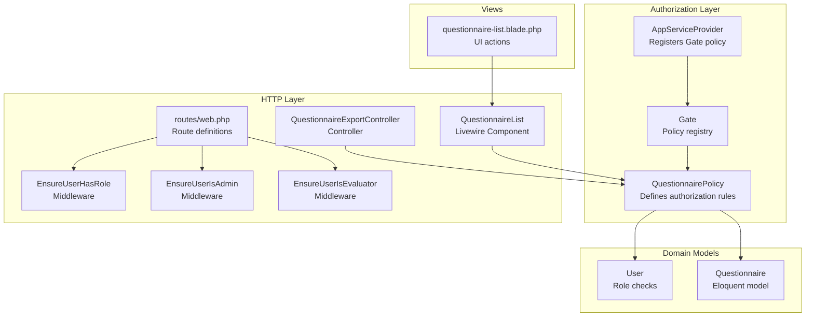
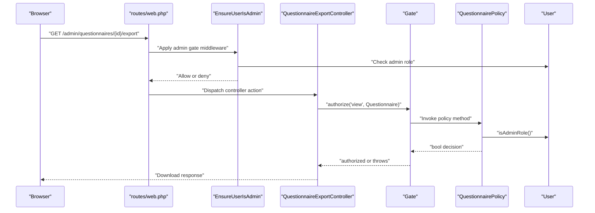
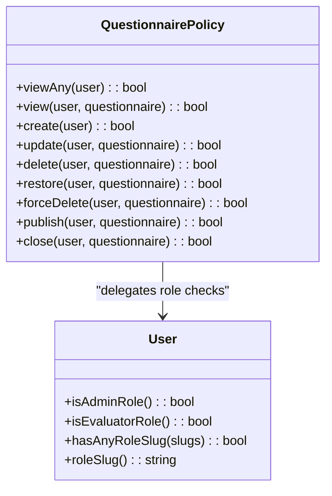
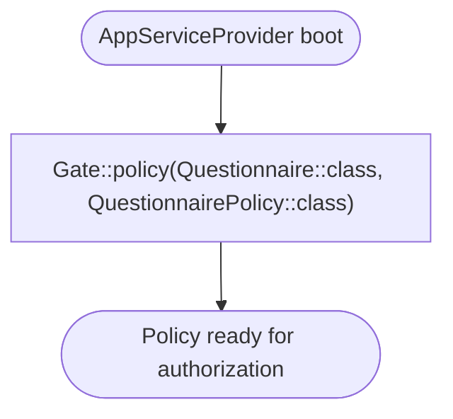
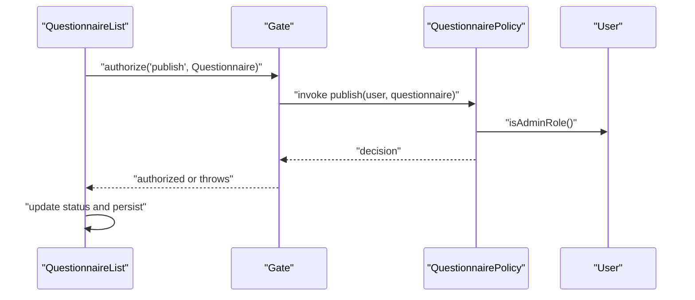
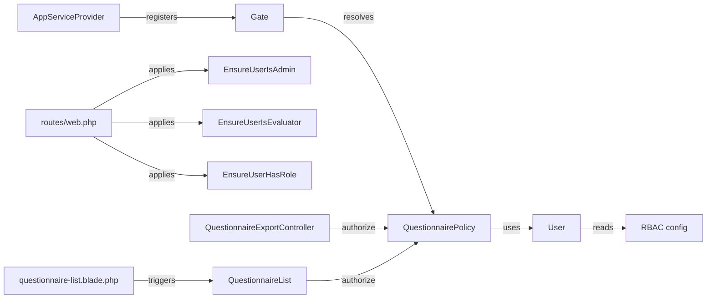

# Policy-Based Authorization

<cite>
**Referenced Files in This Document**
- [QuestionnairePolicy.php](file://app/Policies/QuestionnairePolicy.php)
- [AppServiceProvider.php](file://app/Providers/AppServiceProvider.php)
- [User.php](file://app/Models/User.php)
- [rbac.php](file://config/rbac.php)
- [QuestionnaireList.php](file://app/Livewire/Admin/QuestionnaireList.php)
- [QuestionnaireExportController.php](file://app/Http/Controllers/Admin/QuestionnaireExportController.php)
- [web.php](file://routes/web.php)
- [EnsureUserHasRole.php](file://app/Http/Middleware/EnsureUserHasRole.php)
- [EnsureUserIsAdmin.php](file://app/Http/Middleware/EnsureUserIsAdmin.php)
- [EnsureUserIsEvaluator.php](file://app/Http/Middleware/EnsureUserIsEvaluator.php)
- [questionnaire-list.blade.php](file://resources/views/livewire/admin/questionnaire-list.blade.php)
</cite>

## Table of Contents
1. [Introduction](#introduction)
2. [Project Structure](#project-structure)
3. [Core Components](#core-components)
4. [Architecture Overview](#architecture-overview)
5. [Detailed Component Analysis](#detailed-component-analysis)
6. [Dependency Analysis](#dependency-analysis)
7. [Performance Considerations](#performance-considerations)
8. [Troubleshooting Guide](#troubleshooting-guide)
9. [Conclusion](#conclusion)

## Introduction
This document explains the policy-based authorization patterns implemented in the application, focusing on the QuestionnairePolicy and its integration with Laravel’s authorization system. It covers how gates and policies are registered, how controllers and Livewire components enforce permissions, and how middleware complements authorization. Practical examples demonstrate questionnaire management, evaluation processes, and administrative functions. Guidance is also provided on extending policies for custom authorization logic.

## Project Structure
Authorization-related components are organized across models, policies, service providers, middleware, controllers, Livewire components, and routes. The following diagram shows the high-level structure and interactions.

**Diagram sources**
- [AppServiceProvider.php:23-26](file://app/Providers/AppServiceProvider.php#L23-L26)
- [QuestionnairePolicy.php:8-54](file://app/Policies/QuestionnairePolicy.php#L8-L54)
- [User.php:69-92](file://app/Models/User.php#L69-L92)
- [QuestionnaireExportController.php:15-37](file://app/Http/Controllers/Admin/QuestionnaireExportController.php#L15-L37)
- [QuestionnaireList.php:23-59](file://app/Livewire/Admin/QuestionnaireList.php#L23-L59)
- [web.php:72-147](file://routes/web.php#L72-L147)
- [questionnaire-list.blade.php:88-124](file://resources/views/livewire/admin/questionnaire-list.blade.php#L88-L124)

**Section sources**
- [AppServiceProvider.php:23-26](file://app/Providers/AppServiceProvider.php#L23-L26)
- [web.php:72-147](file://routes/web.php#L72-L147)

## Core Components
- QuestionnairePolicy: Defines authorization rules for questionnaire operations (viewAny, view, create, update, delete, restore, forceDelete, publish, close).
- AppServiceProvider: Registers the policy with the Gate for the Questionnaire model.
- User: Provides role-based helpers used by policies (e.g., admin and evaluator checks).
- RBAC configuration: Centralizes role slugs and aliases used by authorization logic.
- Controllers and Livewire components: Enforce authorization via authorize calls before performing actions.
- Middleware: Enforces role-based access at the route level.

Key implementation references:
- Policy methods and logic: [QuestionnairePolicy.php:10-53](file://app/Policies/QuestionnairePolicy.php#L10-L53)
- Policy registration: [AppServiceProvider.php:25](file://app/Providers/AppServiceProvider.php#L25)
- Role checks in User: [User.php:69-92](file://app/Models/User.php#L69-L92)
- RBAC configuration: [rbac.php:4-63](file://config/rbac.php#L4-L63)
- Controller authorization: [QuestionnaireExportController.php:17-29](file://app/Http/Controllers/Admin/QuestionnaireExportController.php#L17-L29)
- Livewire authorization: [QuestionnaireList.php:23-59](file://app/Livewire/Admin/QuestionnaireList.php#L23-L59)

**Section sources**
- [QuestionnairePolicy.php:8-54](file://app/Policies/QuestionnairePolicy.php#L8-L54)
- [AppServiceProvider.php:25](file://app/Providers/AppServiceProvider.php#L25)
- [User.php:69-92](file://app/Models/User.php#L69-L92)
- [rbac.php:4-63](file://config/rbac.php#L4-L63)
- [QuestionnaireExportController.php:15-37](file://app/Http/Controllers/Admin/QuestionnaireExportController.php#L15-L37)
- [QuestionnaireList.php:23-59](file://app/Livewire/Admin/QuestionnaireList.php#L23-L59)

## Architecture Overview
The authorization architecture combines:
- Gate-driven policy enforcement: Controllers and Livewire components call authorize with policy abilities.
- Model-based policy resolution: The Gate resolves the appropriate policy class for a given model.
- Role-based logic inside policies: Policies delegate permission decisions to User role checks.
- Route-level middleware: Ensures only authorized users reach protected areas.

**Diagram sources**
- [web.php:72-83](file://routes/web.php#L72-L83)
- [EnsureUserIsAdmin.php:12-21](file://app/Http/Middleware/EnsureUserIsAdmin.php#L12-L21)
- [QuestionnaireExportController.php:17-25](file://app/Http/Controllers/Admin/QuestionnaireExportController.php#L17-L25)
- [QuestionnairePolicy.php:15-17](file://app/Policies/QuestionnairePolicy.php#L15-L17)
- [User.php:69-72](file://app/Models/User.php#L69-L72)

## Detailed Component Analysis

### QuestionnairePolicy
The policy defines a set of abilities mapped to questionnaire operations. Each method receives the current user and optionally the questionnaire instance, returning a boolean decision. The policy delegates role checks to the User model.

**Diagram sources**
- [QuestionnairePolicy.php:10-53](file://app/Policies/QuestionnairePolicy.php#L10-L53)
- [User.php:69-92](file://app/Models/User.php#L69-L92)

Policy method usage examples:
- View list and individual records: [QuestionnairePolicy.php:10-18](file://app/Policies/QuestionnairePolicy.php#L10-L18)
- CRUD operations: [QuestionnairePolicy.php:20-43](file://app/Policies/QuestionnairePolicy.php#L20-L43)
- Publication lifecycle: [QuestionnairePolicy.php:45-53](file://app/Policies/QuestionnairePolicy.php#L45-L53)

**Section sources**
- [QuestionnairePolicy.php:8-54](file://app/Policies/QuestionnairePolicy.php#L8-L54)
- [User.php:69-92](file://app/Models/User.php#L69-L92)

### Policy Registration and Gate Integration
The policy is registered with the Gate during service provider boot, associating the Questionnaire model with QuestionnairePolicy. This enables automatic resolution of abilities for questionnaire instances.

**Diagram sources**
- [AppServiceProvider.php:25](file://app/Providers/AppServiceProvider.php#L25)

**Section sources**
- [AppServiceProvider.php:25](file://app/Providers/AppServiceProvider.php#L25)

### Controllers and Livewire Components
Controllers and Livewire components enforce authorization before executing actions. They call authorize with the ability name and the relevant model instance.

- Controller example: [QuestionnaireExportController.php:17-29](file://app/Http/Controllers/Admin/QuestionnaireExportController.php#L17-L29)
- Livewire example: [QuestionnaireList.php:23-59](file://app/Livewire/Admin/QuestionnaireList.php#L23-L59)

**Diagram sources**
- [QuestionnaireList.php:36-42](file://app/Livewire/Admin/QuestionnaireList.php#L36-L42)
- [QuestionnairePolicy.php:45-47](file://app/Policies/QuestionnairePolicy.php#L45-L47)
- [User.php:69-72](file://app/Models/User.php#L69-L72)

**Section sources**
- [QuestionnaireExportController.php:15-37](file://app/Http/Controllers/Admin/QuestionnaireExportController.php#L15-L37)
- [QuestionnaireList.php:23-59](file://app/Livewire/Admin/QuestionnaireList.php#L23-L59)

### Views and UI Actions
Views trigger Livewire actions that enforce authorization. Buttons for publish/close/delete are rendered conditionally and invoke actions that call authorize internally.

- UI actions and confirmations: [questionnaire-list.blade.php:95-124](file://resources/views/livewire/admin/questionnaire-list.blade.php#L95-L124)

**Section sources**
- [questionnaire-list.blade.php:88-124](file://resources/views/livewire/admin/questionnaire-list.blade.php#L88-L124)

### Middleware Integration
Route groups apply middleware to enforce role-based access at the entry point. These middlewares complement policy-based authorization by preventing unauthorized users from reaching protected routes.

- Admin middleware: [EnsureUserIsAdmin.php:12-21](file://app/Http/Middleware/EnsureUserIsAdmin.php#L12-L21)
- Evaluator middleware: [EnsureUserIsEvaluator.php:12-21](file://app/Http/Middleware/EnsureUserIsEvaluator.php#L12-L21)
- Generic role middleware: [EnsureUserHasRole.php:11-25](file://app/Http/Middleware/EnsureUserHasRole.php#L11-L25)
- Route definitions: [web.php:72-147](file://routes/web.php#L72-L147)

**Section sources**
- [web.php:72-147](file://routes/web.php#L72-L147)
- [EnsureUserIsAdmin.php:12-21](file://app/Http/Middleware/EnsureUserIsAdmin.php#L12-L21)
- [EnsureUserIsEvaluator.php:12-21](file://app/Http/Middleware/EnsureUserIsEvaluator.php#L12-L21)
- [EnsureUserHasRole.php:11-25](file://app/Http/Middleware/EnsureUserHasRole.php#L11-L25)

## Dependency Analysis
The following diagram shows how authorization components depend on each other and how they are wired together.

**Diagram sources**
- [AppServiceProvider.php:25](file://app/Providers/AppServiceProvider.php#L25)
- [QuestionnairePolicy.php:10-53](file://app/Policies/QuestionnairePolicy.php#L10-L53)
- [User.php:69-92](file://app/Models/User.php#L69-L92)
- [rbac.php:4-63](file://config/rbac.php#L4-L63)
- [web.php:72-147](file://routes/web.php#L72-L147)
- [QuestionnaireExportController.php:17-29](file://app/Http/Controllers/Admin/QuestionnaireExportController.php#L17-L29)
- [QuestionnaireList.php:23-59](file://app/Livewire/Admin/QuestionnaireList.php#L23-L59)
- [questionnaire-list.blade.php:88-124](file://resources/views/livewire/admin/questionnaire-list.blade.php#L88-L124)

**Section sources**
- [AppServiceProvider.php:25](file://app/Providers/AppServiceProvider.php#L25)
- [web.php:72-147](file://routes/web.php#L72-L147)

## Performance Considerations
- Minimize repeated role checks: Policies reuse User role checks; avoid duplicating logic in controllers or Livewire components.
- Efficient queries: Use eager loading (as seen in the Livewire component) to reduce N+1 queries when rendering lists.
- Middleware pre-filters: Applying route-level middleware reduces unnecessary controller or Livewire work for unauthorized users.

## Troubleshooting Guide
Common issues and resolutions:
- Authorization denied unexpectedly:
  - Verify the user’s role slug matches configured admin slugs. See [rbac.php:4](file://config/rbac.php#L4).
  - Confirm the policy method returns the expected result for the current user. See [QuestionnairePolicy.php:10-53](file://app/Policies/QuestionnairePolicy.php#L10-L53).
- Route still accessible despite policy restrictions:
  - Ensure route groups apply the correct middleware. See [web.php:72-147](file://routes/web.php#L72-L147).
- Livewire action fails silently:
  - Confirm authorize calls are present before mutating state. See [QuestionnaireList.php:23-59](file://app/Livewire/Admin/QuestionnaireList.php#L23-L59).
- Controller action not enforcing permissions:
  - Ensure authorize is called before performing sensitive operations. See [QuestionnaireExportController.php:17-29](file://app/Http/Controllers/Admin/QuestionnaireExportController.php#L17-L29).

**Section sources**
- [rbac.php:4](file://config/rbac.php#L4)
- [QuestionnairePolicy.php:10-53](file://app/Policies/QuestionnairePolicy.php#L10-L53)
- [web.php:72-147](file://routes/web.php#L72-L147)
- [QuestionnaireList.php:23-59](file://app/Livewire/Admin/QuestionnaireList.php#L23-L59)
- [QuestionnaireExportController.php:17-29](file://app/Http/Controllers/Admin/QuestionnaireExportController.php#L17-L29)

## Conclusion
The application implements a clean, centralized authorization model using Laravel policies and gates. The QuestionnairePolicy encapsulates all questionnaire-related permissions and delegates role checks to the User model, which reads from the RBAC configuration. Controllers and Livewire components consistently enforce authorization via authorize calls, while route-level middleware ensures early rejection of unauthorized requests. This design supports maintainable, extensible authorization logic and provides a strong foundation for adding new abilities or refining existing rules.