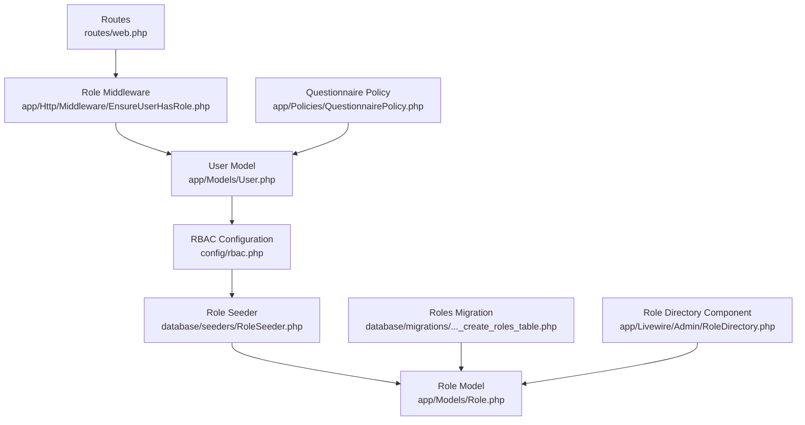
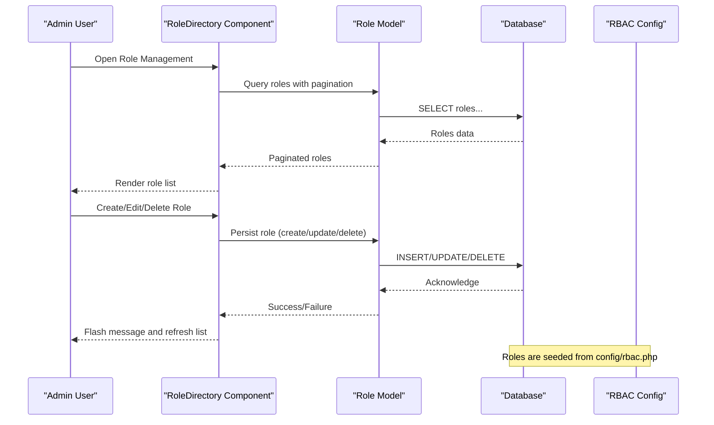
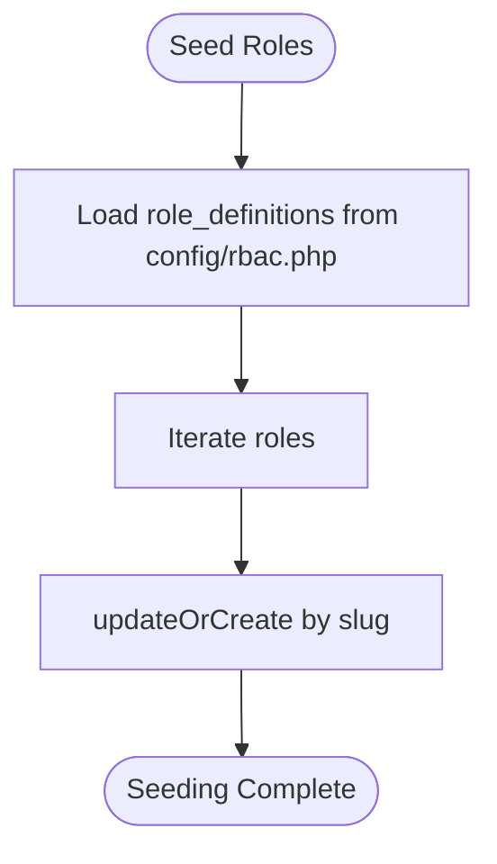
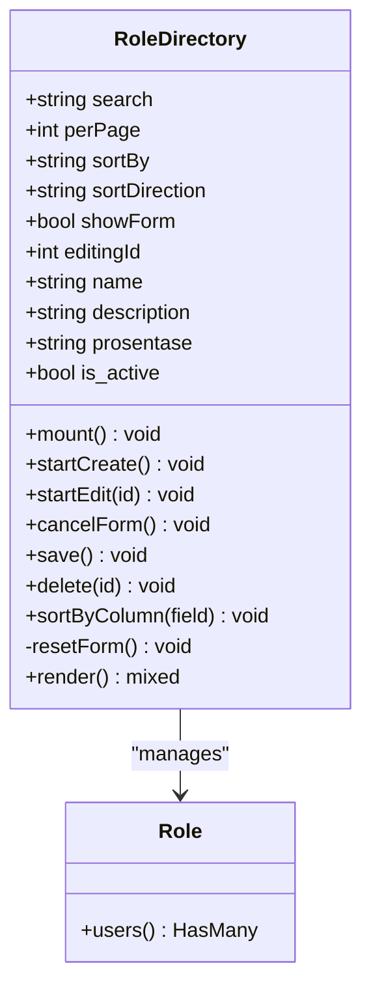
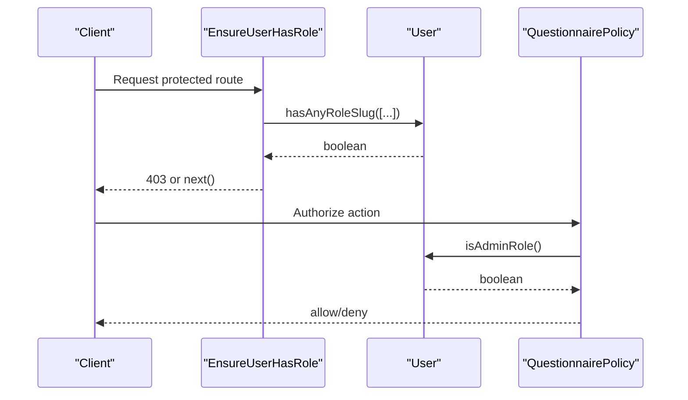
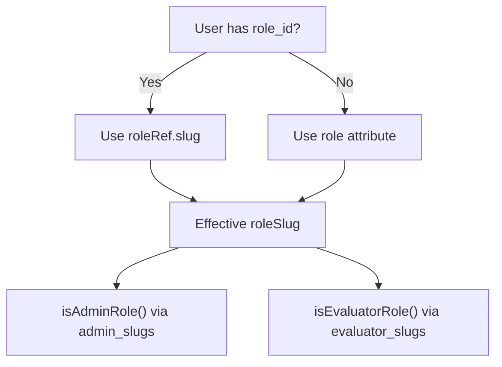
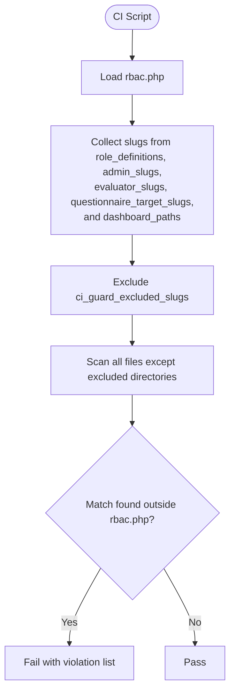
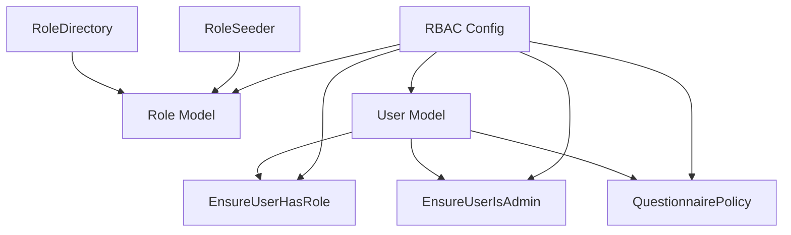

# Role Definitions & Configuration

<cite>
**Referenced Files in This Document**
- [rbac.php](file://config/rbac.php)
- [Role.php](file://app/Models/Role.php)
- [2026_04_17_093035_create_roles_table.php](file://database/migrations/2026_04_17_093035_create_roles_table.php)
- [RoleSeeder.php](file://database/seeders/RoleSeeder.php)
- [RoleDirectory.php](file://app/Livewire/Admin/RoleDirectory.php)
- [EnsureUserHasRole.php](file://app/Http/Middleware/EnsureUserHasRole.php)
- [EnsureUserIsAdmin.php](file://app/Http/Middleware/EnsureUserIsAdmin.php)
- [User.php](file://app/Models/User.php)
- [check-role-slugs.php](file://scripts/ci/check-role-slugs.php)
- [README.md](file://README.md)
- [09-role-assignment.md](file://.clinerules/09-role-assignment.md)
- [openapi-roles.yaml](file://docs/openapi-roles.yaml)
- [web.php](file://routes/web.php)
- [QuestionnairePolicy.php](file://app/Policies/QuestionnairePolicy.php)
</cite>

## Table of Contents
1. [Introduction](#introduction)
2. [Project Structure](#project-structure)
3. [Core Components](#core-components)
4. [Architecture Overview](#architecture-overview)
5. [Detailed Component Analysis](#detailed-component-analysis)
6. [Dependency Analysis](#dependency-analysis)
7. [Performance Considerations](#performance-considerations)
8. [Troubleshooting Guide](#troubleshooting-guide)
9. [Conclusion](#conclusion)
10. [Appendices](#appendices)

## Introduction
This document provides comprehensive documentation for role definitions and configuration in the assessment platform. It explains the role hierarchy, including super_admin, admin, guru, tata_usaha, orang_tua, and user roles, detailing their slugs, descriptions, percentage weights, and activation status. It documents the RBAC configuration in config/rbac.php, including role_aliases, role_labels, and legacy role support. Practical examples of role creation, modification, and assignment patterns are included, along with role inheritance, permissions mapping, and best practices for role management.

## Project Structure
The role management system spans configuration, models, migrations, seeders, Livewire components, middleware, routes, and policies. The central configuration resides in config/rbac.php, which defines role slugs, aliases, labels, and dashboard mappings. Roles are persisted in the database via the Role model and the roles table migration. Seeders populate roles from the configuration. Middleware and policies enforce role-based access control, while Livewire components provide administrative UI for managing roles.

**Diagram sources**
- [rbac.php:1-64](file://config/rbac.php#L1-L64)
- [Role.php:1-31](file://app/Models/Role.php#L1-L31)
- [2026_04_17_093035_create_roles_table.php:1-33](file://database/migrations/2026_04_17_093035_create_roles_table.php#L1-L33)
- [RoleSeeder.php:1-26](file://database/seeders/RoleSeeder.php#L1-L26)
- [RoleDirectory.php:1-157](file://app/Livewire/Admin/RoleDirectory.php#L1-L157)
- [EnsureUserHasRole.php:1-28](file://app/Http/Middleware/EnsureUserHasRole.php#L1-L28)
- [web.php:1-161](file://routes/web.php#L1-L161)
- [QuestionnairePolicy.php:1-55](file://app/Policies/QuestionnairePolicy.php#L1-L55)
- [User.php:1-94](file://app/Models/User.php#L1-L94)

**Section sources**
- [rbac.php:1-64](file://config/rbac.php#L1-L64)
- [Role.php:1-31](file://app/Models/Role.php#L1-L31)
- [2026_04_17_093035_create_roles_table.php:1-33](file://database/migrations/2026_04_17_093035_create_roles_table.php#L1-L33)
- [RoleSeeder.php:1-26](file://database/seeders/RoleSeeder.php#L1-L26)
- [RoleDirectory.php:1-157](file://app/Livewire/Admin/RoleDirectory.php#L1-L157)
- [EnsureUserHasRole.php:1-28](file://app/Http/Middleware/EnsureUserHasRole.php#L1-L28)
- [web.php:1-161](file://routes/web.php#L1-L161)
- [QuestionnairePolicy.php:1-55](file://app/Policies/QuestionnairePolicy.php#L1-L55)
- [User.php:1-94](file://app/Models/User.php#L1-L94)

## Core Components
- RBAC Configuration: Defines role slugs, aliases, labels, evaluator targets, dashboard mappings, and middleware aliases.
- Role Model: Persists role metadata (name, slug, description, percentage weight, activation status) with proper casting.
- Roles Migration: Creates the roles table with unique constraints on name and slug and decimal percentage field.
- Role Seeder: Seeds roles from configuration using upsert semantics.
- Role Directory Component: Provides admin UI for listing, creating, editing, and deleting roles with validation and pagination.
- Middleware: Enforces role-based access control for routes.
- Policies: Define authorization rules for questionnaire operations based on user roles.
- User Model: Resolves effective role slugs and determines admin/evaluator status.

**Section sources**
- [rbac.php:1-64](file://config/rbac.php#L1-L64)
- [Role.php:1-31](file://app/Models/Role.php#L1-L31)
- [2026_04_17_093035_create_roles_table.php:1-33](file://database/migrations/2026_04_17_093035_create_roles_table.php#L1-L33)
- [RoleSeeder.php:1-26](file://database/seeders/RoleSeeder.php#L1-L26)
- [RoleDirectory.php:1-157](file://app/Livewire/Admin/RoleDirectory.php#L1-L157)
- [EnsureUserHasRole.php:1-28](file://app/Http/Middleware/EnsureUserHasRole.php#L1-L28)
- [QuestionnairePolicy.php:1-55](file://app/Policies/QuestionnairePolicy.php#L1-L55)
- [User.php:1-94](file://app/Models/User.php#L1-L94)

## Architecture Overview
The role system follows a centralized configuration-driven approach with database-backed persistence. Configuration in config/rbac.php defines role slugs, aliases, labels, and dashboard mappings. Roles are seeded into the database and managed via a Livewire component. Middleware and policies enforce access control based on resolved user role slugs.

**Diagram sources**
- [RoleDirectory.php:137-155](file://app/Livewire/Admin/RoleDirectory.php#L137-L155)
- [Role.php:26-29](file://app/Models/Role.php#L26-L29)
- [rbac.php:41-48](file://config/rbac.php#L41-L48)
- [RoleSeeder.php:14-24](file://database/seeders/RoleSeeder.php#L14-L24)

## Detailed Component Analysis

### Role Hierarchy and Definitions
The system defines six primary roles with associated slugs, descriptions, percentage weights, and activation status. These roles form the basis of access control and dashboard routing.

- super_admin
  - Slug: super_admin
  - Description: Full access across all modules
  - Percentage weight: 100
  - Activation status: Active
- admin
  - Slug: admin
  - Description: Application management access
  - Percentage weight: 90
  - Activation status: Active
- guru
  - Slug: guru
  - Description: Teacher evaluator
  - Percentage weight: 70
  - Activation status: Active
- tata_usaha
  - Slug: tata_usaha
  - Description: Staff administrator evaluator
  - Percentage weight: 60
  - Activation status: Active
- orang_tua
  - Slug: orang_tua
  - Description: Parent evaluator
  - Percentage weight: 50
  - Activation status: Active
- user
  - Slug: user
  - Description: General user
  - Percentage weight: 40
  - Activation status: Active

Role slugs are grouped into administrative and evaluator categories, with additional mappings for questionnaire targets and dashboard paths. Aliases normalize variations (e.g., guru and tata_usaha to guru_staf, orang_tua to komite), and labels provide localized display names.

**Section sources**
- [rbac.php:41-48](file://config/rbac.php#L41-L48)
- [rbac.php:17-24](file://config/rbac.php#L17-L24)
- [rbac.php:7-11](file://config/rbac.php#L7-L11)
- [rbac.php:49-62](file://config/rbac.php#L49-L62)

### RBAC Configuration Details
Key configuration areas:
- Role slugs and groupings:
  - admin_slugs: super_admin, admin
  - evaluator_slugs: guru, tata_usaha, orang_tua, user
  - questionnaire_target_slugs: guru, tata_usaha, orang_tua
- Aliases:
  - questionnaire_target_aliases: guru → guru_staf, tata_usaha → guru_staf, orang_tua → komite
  - role_aliases: super_admin → admin
  - dashboard_role_slugs: teacher → guru, staff → tata_usaha, parent → orang_tua
- Labels and display names:
  - role_labels: localized names for each slug
- Legacy role support:
  - legacy_allowed_slugs: admin, guru, tata_usaha, orang_tua, user
  - default_legacy_role_slug: user
  - ci_guard_excluded_slugs: user (excluded from CI slug guard)
- Middleware aliases:
  - admin_gate → access.admin
  - evaluator_gate → access.evaluator
  - role_gate → access.role
  - role_redirect → access.role.redirect
- Admin route configuration:
  - prefix: admin
  - name: admin.
- Dashboard paths:
  - Mappings for each role and normalized aliases to dashboard routes

**Section sources**
- [rbac.php:3-63](file://config/rbac.php#L3-L63)

### Role Model and Persistence
The Role model encapsulates role attributes and relationships:
- Fillable attributes: name, slug, description, prosentase, is_active
- Casts:
  - is_active: boolean
  - prosentase: decimal with two places
- Relationship: one-to-many with User via role_id

The roles table migration enforces uniqueness on name and slug, stores description as text, and persists prosentase as a decimal with precision 5 and scale 2. The is_active field defaults to true.

**Section sources**
- [Role.php:13-24](file://app/Models/Role.php#L13-L24)
- [Role.php:26-29](file://app/Models/Role.php#L26-L29)
- [2026_04_17_093035_create_roles_table.php:14-22](file://database/migrations/2026_04_17_093035_create_roles_table.php#L14-L22)

### Role Seeding and Lifecycle
The RoleSeeder reads role definitions from config/rbac.php and creates or updates roles using upsert semantics keyed by slug. This ensures consistent initialization across environments.

**Diagram sources**
- [RoleSeeder.php:14-24](file://database/seeders/RoleSeeder.php#L14-L24)
- [rbac.php:41-48](file://config/rbac.php#L41-L48)

**Section sources**
- [RoleSeeder.php:14-24](file://database/seeders/RoleSeeder.php#L14-L24)
- [rbac.php:41-48](file://config/rbac.php#L41-L48)

### Role Management UI (Livewire)
The RoleDirectory component provides a paginated, searchable interface for managing roles:
- Search by name, slug, or description
- Sorting by id, name, prosentase, is_active, created_at
- Validation for name uniqueness, description length, prosentase bounds, and is_active boolean
- Slug generation from name via snake_case conversion
- Edit/create/delete actions with user count checks during deletion
- Success/error flash messages

**Diagram sources**
- [RoleDirectory.php:12-156](file://app/Livewire/Admin/RoleDirectory.php#L12-L156)
- [Role.php:26-29](file://app/Models/Role.php#L26-L29)

**Section sources**
- [RoleDirectory.php:28-96](file://app/Livewire/Admin/RoleDirectory.php#L28-L96)
- [RoleDirectory.php:98-109](file://app/Livewire/Admin/RoleDirectory.php#L98-L109)
- [RoleDirectory.php:111-124](file://app/Livewire/Admin/RoleDirectory.php#L111-L124)
- [RoleDirectory.php:137-155](file://app/Livewire/Admin/RoleDirectory.php#L137-L155)

### Middleware and Authorization
Role enforcement relies on middleware and policies:
- EnsureUserHasRole middleware validates that the authenticated user possesses any of the required slugs and aborts otherwise.
- EnsureUserIsAdmin middleware restricts access to admin-only routes by checking admin_slugs.
- QuestionnairePolicy methods delegate authorization decisions to user role checks, ensuring only admin users can manage questionnaires.

**Diagram sources**
- [EnsureUserHasRole.php:11-25](file://app/Http/Middleware/EnsureUserHasRole.php#L11-L25)
- [EnsureUserIsAdmin.php:12-21](file://app/Http/Middleware/EnsureUserIsAdmin.php#L12-L21)
- [QuestionnairePolicy.php:10-53](file://app/Policies/QuestionnairePolicy.php#L10-L53)
- [User.php:64-87](file://app/Models/User.php#L64-L87)

**Section sources**
- [EnsureUserHasRole.php:11-25](file://app/Http/Middleware/EnsureUserHasRole.php#L11-L25)
- [EnsureUserIsAdmin.php:12-21](file://app/Http/Middleware/EnsureUserIsAdmin.php#L12-L21)
- [QuestionnairePolicy.php:10-53](file://app/Policies/QuestionnairePolicy.php#L10-L53)
- [User.php:64-87](file://app/Models/User.php#L64-L87)

### User Role Resolution and Inheritance
The User model resolves the effective role slug and determines role categories:
- roleSlug(): Returns the slug from roleRef (role_id) if available; otherwise falls back to the role attribute.
- hasAnyRoleSlug(): Checks membership in a set of slugs.
- isAdminRole(): Uses configured admin_slugs to determine admin status.
- isEvaluatorRole(): Uses configured evaluator_slugs; includes a fallback for custom role catalogs where any non-admin role is treated as evaluator.
- canManageRoles(): Delegates to isAdminRole().

**Diagram sources**
- [User.php:59-87](file://app/Models/User.php#L59-L87)
- [rbac.php:4-5](file://config/rbac.php#L4-L5)
- [rbac.php:6-6](file://config/rbac.php#L6-L6)

**Section sources**
- [User.php:59-87](file://app/Models/User.php#L59-L87)
- [rbac.php:4-5](file://config/rbac.php#L4-L5)
- [rbac.php:6-6](file://config/rbac.php#L6-L6)

### Role Assignment and Permissions Mapping
Role assignment is enforced through middleware and policies:
- Middleware ensures that routes requiring specific slugs are accessible only to users whose role matches any of the required slugs.
- Policies authorize actions on questionnaires based on admin role checks.
- Dashboard routing leverages dashboard paths mapped to role slugs and normalized aliases.

Practical patterns:
- Route protection: Apply EnsureUserHasRole middleware with required slugs to restrict access.
- Admin-only routes: Wrap routes with EnsureUserIsAdmin middleware.
- Questionnaire operations: Use QuestionnairePolicy methods to gate create/view/update/delete actions.
- Dashboard redirection: Use role-based dashboard paths to route users after login.

**Section sources**
- [web.php:29-33](file://routes/web.php#L29-L33)
- [web.php:72-147](file://routes/web.php#L72-L147)
- [QuestionnairePolicy.php:10-53](file://app/Policies/QuestionnairePolicy.php#L10-L53)
- [rbac.php:49-62](file://config/rbac.php#L49-L62)

### CI Role Slug Guard
To prevent hardcoded role slugs outside the central configuration, a CI script scans the codebase and reports violations. It aggregates slugs from role_definitions, admin_slugs, evaluator_slugs, questionnaire_target_slugs, and dashboard_paths, excluding ci_guard_excluded_slugs, and verifies that all role slugs appear only in config/rbac.php.

**Diagram sources**
- [check-role-slugs.php:14-66](file://scripts/ci/check-role-slugs.php#L14-L66)
- [check-role-slugs.php:87-139](file://scripts/ci/check-role-slugs.php#L87-L139)
- [rbac.php:41-48](file://config/rbac.php#L41-L48)
- [rbac.php:4-5](file://config/rbac.php#L4-L5)
- [rbac.php:6-6](file://config/rbac.php#L6-L6)
- [rbac.php:7-11](file://config/rbac.php#L7-L11)
- [rbac.php:49-62](file://config/rbac.php#L49-L62)
- [rbac.php:30-30](file://config/rbac.php#L30-L30)

**Section sources**
- [check-role-slugs.php:14-66](file://scripts/ci/check-role-slugs.php#L14-L66)
- [check-role-slugs.php:87-139](file://scripts/ci/check-role-slugs.php#L87-L139)
- [rbac.php:41-48](file://config/rbac.php#L41-L48)
- [rbac.php:4-5](file://config/rbac.php#L4-L5)
- [rbac.php:6-6](file://config/rbac.php#L6-L6)
- [rbac.php:7-11](file://config/rbac.php#L7-L11)
- [rbac.php:49-62](file://config/rbac.php#L49-L62)
- [rbac.php:30-30](file://config/rbac.php#L30-L30)

### Practical Examples

#### Creating a New Role
- Use the RoleDirectory component to create a new role:
  - Enter name, description, percentage weight, and activation status.
  - The system generates a slug from the name.
  - On save, the role is persisted to the database.
- Alternatively, seed roles programmatically using the RoleSeeder.

**Section sources**
- [RoleDirectory.php:61-96](file://app/Livewire/Admin/RoleDirectory.php#L61-L96)
- [RoleSeeder.php:14-24](file://database/seeders/RoleSeeder.php#L14-L24)

#### Modifying an Existing Role
- Open the edit form in RoleDirectory, adjust fields, and save.
- The system validates uniqueness of name and bounds of percentage weight.
- Changes propagate immediately to authorization logic dependent on role definitions.

**Section sources**
- [RoleDirectory.php:44-54](file://app/Livewire/Admin/RoleDirectory.php#L44-L54)
- [RoleDirectory.php:66-76](file://app/Livewire/Admin/RoleDirectory.php#L66-L76)

#### Assigning Roles to Users
- Assign roles by setting the user's role_id to the target role's id.
- Effective role resolution uses roleRef (role_id) if present; otherwise falls back to the role attribute.
- Ensure the chosen role slug exists in the configuration and is active.

**Section sources**
- [User.php:59-62](file://app/Models/User.php#L59-L62)
- [rbac.php:41-48](file://config/rbac.php#L41-L48)

#### Enforcing Access Control
- Protect routes with EnsureUserHasRole middleware and specify required slugs.
- Restrict admin-only routes with EnsureUserIsAdmin middleware.
- Use QuestionnairePolicy methods to authorize operations based on admin role checks.

**Section sources**
- [EnsureUserHasRole.php:11-25](file://app/Http/Middleware/EnsureUserHasRole.php#L11-L25)
- [EnsureUserIsAdmin.php:12-21](file://app/Http/Middleware/EnsureUserIsAdmin.php#L12-L21)
- [QuestionnairePolicy.php:10-53](file://app/Policies/QuestionnairePolicy.php#L10-L53)

## Dependency Analysis
The role system exhibits clear separation of concerns:
- Configuration drives model creation and middleware/policy behavior.
- Middleware depends on User role resolution and RBAC configuration.
- Policies depend on User role checks.
- UI components depend on the Role model and configuration for validation and display.

**Diagram sources**
- [rbac.php:1-64](file://config/rbac.php#L1-L64)
- [Role.php:1-31](file://app/Models/Role.php#L1-L31)
- [User.php:1-94](file://app/Models/User.php#L1-L94)
- [EnsureUserHasRole.php:1-28](file://app/Http/Middleware/EnsureUserHasRole.php#L1-L28)
- [EnsureUserIsAdmin.php:1-23](file://app/Http/Middleware/EnsureUserIsAdmin.php#L1-L23)
- [QuestionnairePolicy.php:1-55](file://app/Policies/QuestionnairePolicy.php#L1-L55)
- [RoleSeeder.php:1-26](file://database/seeders/RoleSeeder.php#L1-L26)
- [RoleDirectory.php:1-157](file://app/Livewire/Admin/RoleDirectory.php#L1-L157)

**Section sources**
- [rbac.php:1-64](file://config/rbac.php#L1-L64)
- [Role.php:1-31](file://app/Models/Role.php#L1-L31)
- [User.php:1-94](file://app/Models/User.php#L1-L94)
- [EnsureUserHasRole.php:1-28](file://app/Http/Middleware/EnsureUserHasRole.php#L1-L28)
- [EnsureUserIsAdmin.php:1-23](file://app/Http/Middleware/EnsureUserIsAdmin.php#L1-L23)
- [QuestionnairePolicy.php:1-55](file://app/Policies/QuestionnairePolicy.php#L1-L55)
- [RoleSeeder.php:1-26](file://database/seeders/RoleSeeder.php#L1-L26)
- [RoleDirectory.php:1-157](file://app/Livewire/Admin/RoleDirectory.php#L1-L157)

## Performance Considerations
- Centralized configuration reduces runtime branching and improves maintainability.
- Decimal casting for percentage weight ensures precise comparisons and storage.
- Unique constraints on name and slug in the roles table optimize lookups.
- Pagination in RoleDirectory limits memory usage for large datasets.
- Middleware checks are lightweight and rely on precomputed configuration arrays.

## Troubleshooting Guide
Common issues and resolutions:
- Unauthorized access errors:
  - Verify that the user's role_id corresponds to an active role and that the role slug is included in the appropriate RBAC grouping (admin_slugs or evaluator_slugs).
  - Confirm that routes are properly guarded with middleware and that the middleware aliases match the configured values.
- Role deletion failures:
  - Ensure no users are assigned to the role; RoleDirectory prevents deletion when users exist for the role.
- Hardcoded role slugs:
  - Run the CI guard script to detect and report literals outside config/rbac.php; fix violations by referencing the configuration.
- Dashboard routing mismatches:
  - Confirm that the user's effective role slug maps to a defined dashboard path in the RBAC configuration.

**Section sources**
- [RoleDirectory.php:98-109](file://app/Livewire/Admin/RoleDirectory.php#L98-L109)
- [check-role-slugs.php:141-154](file://scripts/ci/check-role-slugs.php#L141-L154)
- [rbac.php:49-62](file://config/rbac.php#L49-L62)

## Conclusion
The assessment platform employs a centralized, configuration-driven role management system with robust middleware and policy enforcement. Roles are defined once in config/rbac.php and propagated to the database via seeders, UI components, and authorization logic. The system supports role aliases, labels, and dashboard mappings, enabling flexible and maintainable access control across admin and evaluator contexts.

## Appendices

### Role Definitions Reference
- Role slugs and descriptions are defined in the RBAC configuration.
- Percentage weights and activation status are stored with each role.
- Aliases normalize role slugs for questionnaire targets and dashboard routing.

**Section sources**
- [rbac.php:41-48](file://config/rbac.php#L41-L48)
- [rbac.php:7-11](file://config/rbac.php#L7-L11)
- [rbac.php:49-62](file://config/rbac.php#L49-L62)

### API Endpoints for Role Management
- List roles: GET /api/roles
- Create role: POST /api/roles
- Update role: PUT /api/roles/{id}
- Delete role: DELETE /api/roles/{id}

Validation and response semantics are documented in the OpenAPI specification.

**Section sources**
- [openapi-roles.yaml:8-69](file://docs/openapi-roles.yaml#L8-L69)
- [README.md:80-88](file://README.md#L80-L88)