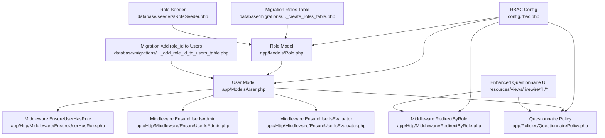
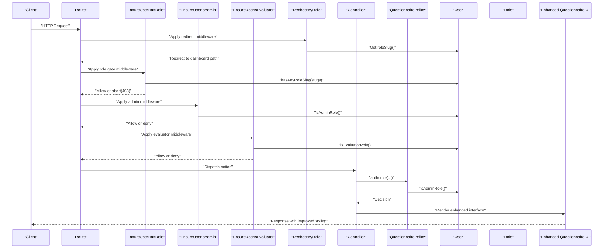
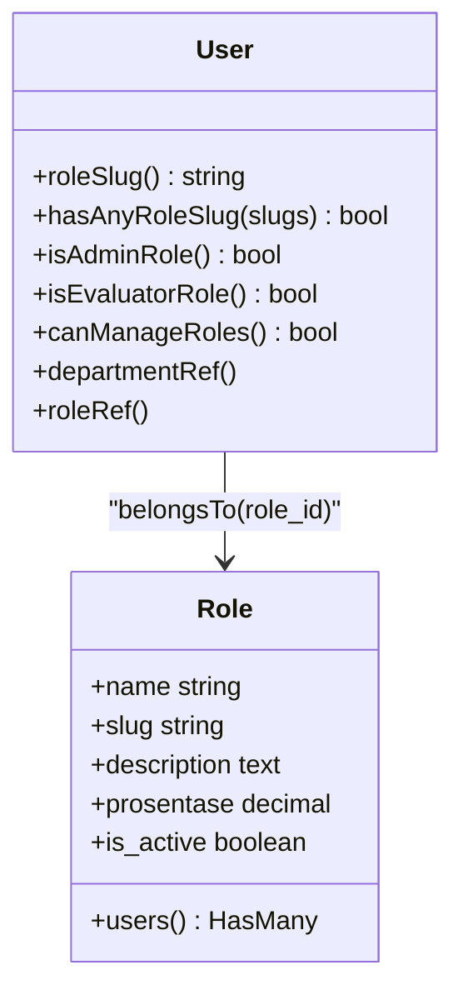
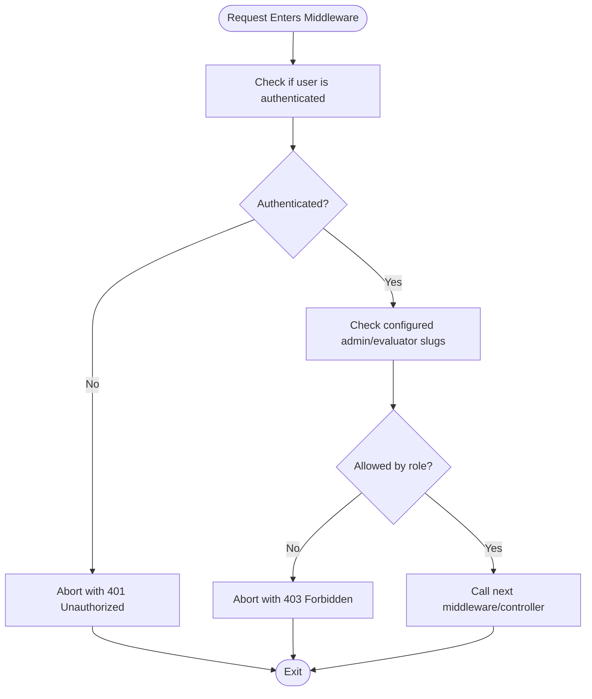
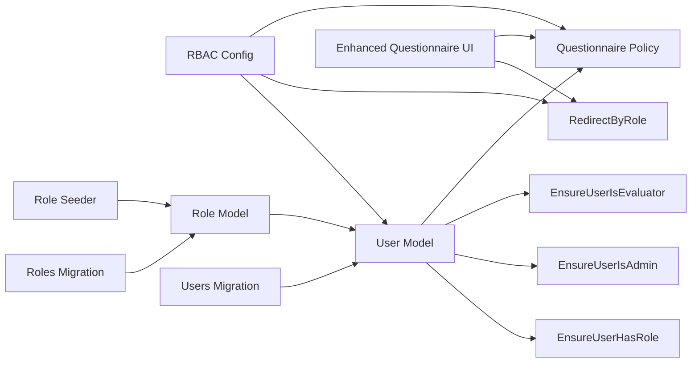

# Role-Based Access Control

<cite>
**Referenced Files in This Document**
- [rbac.php](file://config/rbac.php)
- [Role.php](file://app/Models/Role.php)
- [User.php](file://app/Models/User.php)
- [Departement.php](file://app/Models/Departement.php)
- [Questionnaire.php](file://app/Models/Questionnaire.php)
- [EnsureUserHasRole.php](file://app/Http/Middleware/EnsureUserHasRole.php)
- [EnsureUserIsAdmin.php](file://app/Http/Middleware/EnsureUserIsAdmin.php)
- [EnsureUserIsEvaluator.php](file://app/Http/Middleware/EnsureUserIsEvaluator.php)
- [RedirectByRole.php](file://app/Http/Middleware/RedirectByRole.php)
- [QuestionnairePolicy.php](file://app/Policies/QuestionnairePolicy.php)
- [2026_04_17_093035_create_roles_table.php](file://database/migrations/2026_04_17_093035_create_roles_table.php)
- [2026_04_17_093235_add_role_id_to_users_table.php](file://database/migrations/2026_04_17_093235_add_role_id_to_users_table.php)
- [RoleSeeder.php](file://database/seeders/RoleSeeder.php)
- [questionnaire-fill.blade.php](file://resources/views/livewire/fill/questionnaire-fill.blade.php)
- [available-questionnaires.blade.php](file://resources/views/livewire/fill/available-questionnaires.blade.php)
- [questionnaire-navigation-fix.md](file://docs/questionnaire-navigation-fix.md)
</cite>

## Update Summary
**Changes Made**
- Updated RBAC configuration section to reflect the commented-out 'user_old' dashboard path entry
- Added documentation for enhanced questionnaire interface styling improvements
- Updated middleware and policy sections to reflect recent interface enhancements
- Enhanced troubleshooting guide with questionnaire navigation improvements

## Table of Contents
1. [Introduction](#introduction)
2. [Project Structure](#project-structure)
3. [Core Components](#core-components)
4. [Architecture Overview](#architecture-overview)
5. [Detailed Component Analysis](#detailed-component-analysis)
6. [Dependency Analysis](#dependency-analysis)
7. [Performance Considerations](#performance-considerations)
8. [Troubleshooting Guide](#troubleshooting-guide)
9. [Conclusion](#conclusion)
10. [Appendices](#appendices)

## Introduction
This document explains the role-based access control (RBAC) system used in the application. It covers how roles are defined and stored, how permissions are enforced via middleware and policies, how user-role assignments work, and how department-based access influences questionnaire targeting. The system has been recently enhanced with improved questionnaire interface styling and refined conditional rendering logic for better user experience during questionnaire initiation and navigation.

## Project Structure
The RBAC system spans configuration, models, middleware, policies, and database migrations/seeders:
- Configuration defines role slugs, aliases, labels, dashboards, and middleware mappings.
- Models represent roles and users, with helper methods for role checks.
- Middleware enforces role-based access at the HTTP level.
- Policies enforce authorization at the domain/object level.
- Migrations define the schema for roles and user-role relationships.
- Seeders populate roles from configuration.
- Enhanced questionnaire interfaces provide improved user experience with better styling and navigation.



**Diagram sources**
- [rbac.php:1-65](file://config/rbac.php#L1-L65)
- [Role.php:1-31](file://app/Models/Role.php#L1-L31)
- [User.php:1-94](file://app/Models/User.php#L1-L94)
- [EnsureUserHasRole.php:1-28](file://app/Http/Middleware/EnsureUserHasRole.php#L1-L28)
- [EnsureUserIsAdmin.php:1-23](file://app/Http/Middleware/EnsureUserIsAdmin.php#L1-L23)
- [EnsureUserIsEvaluator.php:1-23](file://app/Http/Middleware/EnsureUserIsEvaluator.php#L1-L23)
- [RedirectByRole.php:1-31](file://app/Http/Middleware/RedirectByRole.php#L1-L31)
- [QuestionnairePolicy.php:1-55](file://app/Policies/QuestionnairePolicy.php#L1-L55)
- [2026_04_17_093035_create_roles_table.php:1-33](file://database/migrations/2026_04_17_093035_create_roles_table.php#L1-L33)
- [2026_04_17_093235_add_role_id_to_users_table.php:1-42](file://database/migrations/2026_04_17_093235_add_role_id_to_users_table.php#L1-L42)
- [RoleSeeder.php:1-26](file://database/seeders/RoleSeeder.php#L1-L26)
- [questionnaire-fill.blade.php:1-402](file://resources/views/livewire/fill/questionnaire-fill.blade.php#L1-L402)
- [available-questionnaires.blade.php:1-798](file://resources/views/livewire/fill/available-questionnaires.blade.php#L1-L798)

**Section sources**
- [rbac.php:1-65](file://config/rbac.php#L1-L65)
- [Role.php:1-31](file://app/Models/Role.php#L1-L31)
- [User.php:1-94](file://app/Models/User.php#L1-L94)
- [EnsureUserHasRole.php:1-28](file://app/Http/Middleware/EnsureUserHasRole.php#L1-L28)
- [EnsureUserIsAdmin.php:1-23](file://app/Http/Middleware/EnsureUserIsAdmin.php#L1-L23)
- [EnsureUserIsEvaluator.php:1-23](file://app/Http/Middleware/EnsureUserIsEvaluator.php#L1-L23)
- [RedirectByRole.php:1-31](file://app/Http/Middleware/RedirectByRole.php#L1-L31)
- [QuestionnairePolicy.php:1-55](file://app/Policies/QuestionnairePolicy.php#L1-L55)
- [2026_04_17_093035_create_roles_table.php:1-33](file://database/migrations/2026_04_17_093035_create_roles_table.php#L1-L33)
- [2026_04_17_093235_add_role_id_to_users_table.php:1-42](file://database/migrations/2026_04_17_093235_add_role_id_to_users_table.php#L1-L42)
- [RoleSeeder.php:1-26](file://database/seeders/RoleSeeder.php#L1-L26)

## Core Components
- RBAC configuration: Centralized role definitions, slug mappings, labels, aliases, and dashboard paths.
- Role model: Stores role metadata and relationships to users.
- User model: Provides role checks, admin/evaluator detection, and department associations.
- Middleware: Enforces role-based access and redirects based on roles.
- Policies: Define authorization rules for domain objects (e.g., questionnaire management).
- Database schema: Roles table and user-role foreign key relationship.
- Seeders: Populate roles from configuration.
- Enhanced questionnaire interfaces: Provide improved user experience with better styling and navigation.

Key implementation patterns:
- Role slugs are canonical identifiers used across middleware, policies, and configuration.
- Users can be assigned either via legacy role field or normalized role_id foreign key.
- Admin and evaluator roles are derived from configured slugs with fallback logic.
- Dashboard redirection uses configured paths per role, with deprecated entries properly commented out.
- Questionnaire interfaces feature improved styling with enhanced confirmation popups and refined conditional rendering.

**Section sources**
- [rbac.php:1-65](file://config/rbac.php#L1-L65)
- [Role.php:1-31](file://app/Models/Role.php#L1-L31)
- [User.php:1-94](file://app/Models/User.php#L1-L94)
- [EnsureUserHasRole.php:1-28](file://app/Http/Middleware/EnsureUserHasRole.php#L1-L28)
- [EnsureUserIsAdmin.php:1-23](file://app/Http/Middleware/EnsureUserIsAdmin.php#L1-L23)
- [EnsureUserIsEvaluator.php:1-23](file://app/Http/Middleware/EnsureUserIsEvaluator.php#L1-L23)
- [RedirectByRole.php:1-31](file://app/Http/Middleware/RedirectByRole.php#L1-L31)
- [QuestionnairePolicy.php:1-55](file://app/Policies/QuestionnairePolicy.php#L1-L55)
- [2026_04_17_093035_create_roles_table.php:1-33](file://database/migrations/2026_04_17_093035_create_roles_table.php#L1-L33)
- [2026_04_17_093235_add_role_id_to_users_table.php:1-42](file://database/migrations/2026_04_17_093235_add_role_id_to_users_table.php#L1-L42)
- [RoleSeeder.php:1-26](file://database/seeders/RoleSeeder.php#L1-L26)

## Architecture Overview
The RBAC architecture integrates configuration-driven role definitions with runtime enforcement through middleware and policies. Users carry role information, enabling role checks and access decisions. Middleware guards protect routes, while policies govern object-level actions. The enhanced questionnaire interfaces provide improved user experience with better styling and navigation.



**Diagram sources**
- [EnsureUserHasRole.php:1-28](file://app/Http/Middleware/EnsureUserHasRole.php#L1-L28)
- [EnsureUserIsAdmin.php:1-23](file://app/Http/Middleware/EnsureUserIsAdmin.php#L1-L23)
- [EnsureUserIsEvaluator.php:1-23](file://app/Http/Middleware/EnsureUserIsEvaluator.php#L1-L23)
- [RedirectByRole.php:1-31](file://app/Http/Middleware/RedirectByRole.php#L1-L31)
- [User.php:1-94](file://app/Models/User.php#L1-L94)
- [QuestionnairePolicy.php:1-55](file://app/Policies/QuestionnairePolicy.php#L1-L55)
- [questionnaire-fill.blade.php:1-402](file://resources/views/livewire/fill/questionnaire-fill.blade.php#L1-L402)

## Detailed Component Analysis

### Role Configuration (config/rbac.php)
- Defines administrative slugs, evaluator slugs, and questionnaire target slugs.
- Provides aliases for questionnaire targets and role labels for UI presentation.
- Maps dashboard paths per role and supports legacy role slugs with defaults.
- Declares middleware aliases for convenient route protection.
- Contains role definitions with name, slug, description, percentage, and activation flag.
- Includes CI guard exclusions for specific slugs.
- **Updated**: Commented out deprecated 'user_old' dashboard path entry to clean up configuration.

Practical usage:
- Add or modify roles in role definitions to reflect organizational changes.
- Update dashboard paths to align with frontend routes per role.
- Adjust admin and evaluator slugs to reflect evolving admin tiers or evaluator categories.
- Remove deprecated entries like 'user_old' to maintain clean configuration.

**Updated** Removed deprecated 'user_old' dashboard path entry to streamline configuration and avoid confusion.

**Section sources**
- [rbac.php:1-65](file://config/rbac.php#L1-L65)

### Role Model (app/Models/Role.php)
- Eloquent model representing roles with fillable attributes and casts for booleans and decimals.
- Defines a relationship to users via role_id, enabling role-based queries and reporting.

Complexity considerations:
- Relationship queries are O(1) with proper indexing on role_id.
- Percentage field supports proportional access semantics when extended.

**Section sources**
- [Role.php:1-31](file://app/Models/Role.php#L1-L31)

### User Model (app/Models/User.php)
- Carries both legacy role field and normalized role_id foreign key.
- Provides roleSlug() to resolve current role identifier.
- Implements hasAnyRoleSlug() for membership checks against configured slugs.
- isAdminRole() checks membership against configured admin slugs.
- isEvaluatorRole() checks evaluator membership with fallback logic for custom role catalogs.
- canManageRoles() delegates to admin check.

Department association:
- departmentRef() links to department; department-based access is supported conceptually via department_id.



**Diagram sources**
- [User.php:1-94](file://app/Models/User.php#L1-L94)
- [Role.php:1-31](file://app/Models/Role.php#L1-L31)

**Section sources**
- [User.php:1-94](file://app/Models/User.php#L1-L94)
- [Role.php:1-31](file://app/Models/Role.php#L1-L31)

### Middleware Components
- EnsureUserHasRole: Enforces that the authenticated user belongs to any of the specified role slugs. Returns 401 if unauthenticated and 403 otherwise.
- EnsureUserIsAdmin: Restricts access to administrators only, throwing an access denied exception for non-admins.
- EnsureUserIsEvaluator: Restricts access to evaluators, with a fallback to treat non-admin roles as evaluators when role_id is present.
- RedirectByRole: Redirects authenticated users to role-specific dashboard paths based on configuration; bypasses if not authenticated or already on the dashboard route.

**Updated** Enhanced questionnaire interface styling provides better user experience during role-based navigation and access control enforcement.



**Diagram sources**
- [EnsureUserHasRole.php:1-28](file://app/Http/Middleware/EnsureUserHasRole.php#L1-L28)
- [EnsureUserIsAdmin.php:1-23](file://app/Http/Middleware/EnsureUserIsAdmin.php#L1-L23)
- [EnsureUserIsEvaluator.php:1-23](file://app/Http/Middleware/EnsureUserIsEvaluator.php#L1-L23)

**Section sources**
- [EnsureUserHasRole.php:1-28](file://app/Http/Middleware/EnsureUserHasRole.php#L1-L28)
- [EnsureUserIsAdmin.php:1-23](file://app/Http/Middleware/EnsureUserIsAdmin.php#L1-L23)
- [EnsureUserIsEvaluator.php:1-23](file://app/Http/Middleware/EnsureUserIsEvaluator.php#L1-L23)
- [RedirectByRole.php:1-31](file://app/Http/Middleware/RedirectByRole.php#L1-L31)

### Policies
- QuestionnairePolicy: Grants full administrative privileges for questionnaire lifecycle actions (view, create, update, delete, restore, force delete, publish, close) to administrators.

Best practice:
- Extend policies to incorporate department-based access checks by evaluating user's department and questionnaire targets.

**Section sources**
- [QuestionnairePolicy.php:1-55](file://app/Policies/QuestionnairePolicy.php#L1-L55)

### Database Schema and Seeding
- Roles table: Stores role metadata with unique constraints on name and slug, plus percentage and activation flag.
- Users table: Adds role_id foreign key referencing roles, with cascading null on delete and an index for performance.
- RoleSeeder: Seeds roles from configuration, ensuring consistent baseline roles across environments.

```mermaid
erDiagram
ROLES {
bigint id PK
string name UK
string slug UK
text description
decimal prosentase
boolean is_active
timestamps created_at, updated_at
}
USERS {
bigint id PK
string name
string email
string phone_number
hashed password
string role
bigint role_id FK
bigint department_id
boolean is_active
timestamps created_at, updated_at
}
USERS }o--|| ROLES : "belongsTo(role_id)"
```

**Diagram sources**
- [2026_04_17_093035_create_roles_table.php:1-33](file://database/migrations/2026_04_17_093035_create_roles_table.php#L1-L33)
- [2026_04_17_093235_add_role_id_to_users_table.php:1-42](file://database/migrations/2026_04_17_093235_add_role_id_to_users_table.php#L1-L42)
- [Role.php:1-31](file://app/Models/Role.php#L1-L31)
- [User.php:1-94](file://app/Models/User.php#L1-L94)

**Section sources**
- [2026_04_17_093035_create_roles_table.php:1-33](file://database/migrations/2026_04_17_093035_create_roles_table.php#L1-L33)
- [2026_04_17_093235_add_role_id_to_users_table.php:1-42](file://database/migrations/2026_04_17_093235_add_role_id_to_users_table.php#L1-L42)
- [RoleSeeder.php:1-26](file://database/seeders/RoleSeeder.php#L1-L26)

### Department-Based Access Controls
- Department model: Links departments to users and answer-related entities.
- Questionnaire model: Computes target groups from roles (excluding top-level admin roles) or falls back to configured slugs. This enables questionnaire targeting aligned with evaluator roles.

Practical pattern:
- Use Questionnaire::targetGroups() to discover available target groups dynamically from roles.
- Use Questionnaire::targetGroupOptions() to render selectable options with role names and slugs.

**Section sources**
- [Departement.php:1-34](file://app/Models/Departement.php#L1-L34)
- [Questionnaire.php:1-131](file://app/Models/Questionnaire.php#L1-L131)
- [rbac.php:1-65](file://config/rbac.php#L1-L65)

### Enhanced Questionnaire Interfaces
**New Section** The questionnaire interfaces have been significantly enhanced with improved styling and user experience:

#### Questionnaire Fill Interface
- Enhanced confirmation popup styling with improved background styling and visual hierarchy
- Refined conditional rendering logic for step navigation during questionnaire initiation
- Improved validation error handling with better visual feedback
- Enhanced progress indicators and navigation controls
- Better responsive design for mobile devices

#### Available Questionnaires Interface  
- Improved start confirmation popup with gradient header styling and better visual hierarchy
- Enhanced time limit display with animated countdown indicators
- Refined step navigation with better visual states for visited/current steps
- Improved validation error messages with clearer user guidance
- Better accessibility features and keyboard navigation support

#### Navigation Improvements
- Conditional rendering logic ensures smoother transitions between questionnaire steps
- Autosave integration with navigation actions reduces latency and improves user experience
- Enhanced loading states during navigation transitions
- Better error handling and recovery mechanisms

**Section sources**
- [questionnaire-fill.blade.php:1-402](file://resources/views/livewire/fill/questionnaire-fill.blade.php#L1-L402)
- [available-questionnaires.blade.php:1-798](file://resources/views/livewire/fill/available-questionnaires.blade.php#L1-L798)
- [questionnaire-navigation-fix.md:1-23](file://docs/questionnaire-navigation-fix.md#L1-L23)

## Dependency Analysis
The system exhibits clear separation of concerns:
- Configuration drives role semantics and routing behavior.
- Models encapsulate identity and authorization primitives.
- Middleware enforces cross-cutting authorization rules.
- Policies enforce domain-specific authorization.
- Database schema supports efficient role-user relationships.
- Enhanced questionnaire interfaces provide improved user experience.



**Diagram sources**
- [rbac.php:1-65](file://config/rbac.php#L1-L65)
- [User.php:1-94](file://app/Models/User.php#L1-L94)
- [Role.php:1-31](file://app/Models/Role.php#L1-L31)
- [EnsureUserHasRole.php:1-28](file://app/Http/Middleware/EnsureUserHasRole.php#L1-L28)
- [EnsureUserIsAdmin.php:1-23](file://app/Http/Middleware/EnsureUserIsAdmin.php#L1-L23)
- [EnsureUserIsEvaluator.php:1-23](file://app/Http/Middleware/EnsureUserIsEvaluator.php#L1-L23)
- [RedirectByRole.php:1-31](file://app/Http/Middleware/RedirectByRole.php#L1-L31)
- [QuestionnairePolicy.php:1-55](file://app/Policies/QuestionnairePolicy.php#L1-L55)
- [2026_04_17_093035_create_roles_table.php:1-33](file://database/migrations/2026_04_17_093035_create_roles_table.php#L1-L33)
- [2026_04_17_093235_add_role_id_to_users_table.php:1-42](file://database/migrations/2026_04_17_093235_add_role_id_to_users_table.php#L1-L42)
- [RoleSeeder.php:1-26](file://database/seeders/RoleSeeder.php#L1-L26)
- [questionnaire-fill.blade.php:1-402](file://resources/views/livewire/fill/questionnaire-fill.blade.php#L1-L402)

**Section sources**
- [rbac.php:1-65](file://config/rbac.php#L1-L65)
- [User.php:1-94](file://app/Models/User.php#L1-L94)
- [Role.php:1-31](file://app/Models/Role.php#L1-L31)
- [EnsureUserHasRole.php:1-28](file://app/Http/Middleware/EnsureUserHasRole.php#L1-L28)
- [EnsureUserIsAdmin.php:1-23](file://app/Http/Middleware/EnsureUserIsAdmin.php#L1-L23)
- [EnsureUserIsEvaluator.php:1-23](file://app/Http/Middleware/EnsureUserIsEvaluator.php#L1-L23)
- [RedirectByRole.php:1-31](file://app/Http/Middleware/RedirectByRole.php#L1-L31)
- [QuestionnairePolicy.php:1-55](file://app/Policies/QuestionnairePolicy.php#L1-L55)
- [2026_04_17_093035_create_roles_table.php:1-33](file://database/migrations/2026_04_17_093035_create_roles_table.php#L1-L33)
- [2026_04_17_093235_add_role_id_to_users_table.php:1-42](file://database/migrations/2026_04_17_093235_add_role_id_to_users_table.php#L1-L42)
- [RoleSeeder.php:1-26](file://database/seeders/RoleSeeder.php#L1-L26)

## Performance Considerations
- Index role_id on users for fast role lookups and joins.
- Keep role definitions minimal and consistent to reduce middleware decision overhead.
- Cache frequently accessed role configurations if the number of roles grows substantially.
- Use targeted policy checks to avoid heavy computations during authorization.
- **Updated** Enhanced questionnaire interfaces optimize rendering performance with improved conditional logic and reduced DOM manipulation.
- **Updated** Autosave integration with navigation actions reduces server load and improves response times.

## Troubleshooting Guide
Common issues and resolutions:
- Unauthorized access errors: Verify the user's role slug matches the required slugs in middleware and ensure the role exists in the database.
- Admin/Evaluator misclassification: Confirm configured slugs in RBAC config and that the user's role_id resolves correctly.
- Dashboard redirect loops: Ensure dashboard_paths are set for the user's role and that the redirect middleware runs before route dispatch.
- Questionnaire target mismatch: Confirm role slugs align with expected target groups and that the target groups are seeded.
- **Updated** Questionnaire navigation issues: Check that autosave integration works correctly with navigation actions and that validation errors are properly handled.
- **Updated** Enhanced interface styling problems: Verify that CSS classes are properly applied and that JavaScript event handlers are functioning correctly.
- **Updated** Deprecated configuration entries: Ensure that commented-out entries like 'user_old' are not referenced in active code paths.

**Section sources**
- [rbac.php:1-65](file://config/rbac.php#L1-L65)
- [User.php:1-94](file://app/Models/User.php#L1-L94)
- [EnsureUserHasRole.php:1-28](file://app/Http/Middleware/EnsureUserHasRole.php#L1-L28)
- [RedirectByRole.php:1-31](file://app/Http/Middleware/RedirectByRole.php#L1-L31)
- [Questionnaire.php:1-131](file://app/Models/Questionnaire.php#L1-L131)
- [questionnaire-fill.blade.php:1-402](file://resources/views/livewire/fill/questionnaire-fill.blade.php#L1-L402)
- [available-questionnaires.blade.php:1-798](file://resources/views/livewire/fill/available-questionnaires.blade.php#L1-L798)

## Conclusion
The RBAC system combines configuration-driven role semantics with robust middleware and policy enforcement. Roles are modeled clearly, users carry role identifiers, and access is controlled consistently across routes and domain actions. Recent enhancements to the questionnaire interfaces provide improved user experience with better styling, navigation, and validation. The system continues to evolve with enhanced performance and user experience improvements while maintaining strong security and authorization controls.

## Appendices

### Practical Examples

- Defining a new role:
  - Add a new role definition in the RBAC configuration with name, slug, description, percentage, and activation flag.
  - Run the role seeder to persist the role in the database.

- Enforcing role-based access on a route:
  - Apply the EnsureUserHasRole middleware with the required role slugs.
  - Alternatively, apply EnsureUserIsAdmin or EnsureUserIsEvaluator for specialized gates.

- Checking permissions in controllers or policies:
  - Use user.isAdminRole() or user.isEvaluatorRole() to derive capabilities.
  - For object-level actions, delegate to policies that consult user roles.

- Managing department-based access:
  - Use the department_id on users and related entities to scope data visibility.
  - Compute questionnaire target groups from roles and restrict access accordingly.

- **Updated** Working with enhanced questionnaire interfaces:
  - Utilize improved confirmation popups with better visual hierarchy and styling.
  - Leverage refined conditional rendering logic for smoother navigation experiences.
  - Take advantage of enhanced validation error handling and user feedback mechanisms.

- Best practices:
  - Keep role slugs stable and well-documented.
  - Regularly audit role assignments and permissions.
  - Avoid broad admin privileges; prefer least-privilege evaluator roles.
  - Monitor CI guard exclusions to prevent unintended access.
  - **Updated** Remove deprecated configuration entries to maintain clean and maintainable code.
  - **Updated** Test questionnaire navigation flows thoroughly after configuration changes.

**Section sources**
- [rbac.php:1-65](file://config/rbac.php#L1-L65)
- [RoleSeeder.php:1-26](file://database/seeders/RoleSeeder.php#L1-L26)
- [EnsureUserHasRole.php:1-28](file://app/Http/Middleware/EnsureUserHasRole.php#L1-L28)
- [EnsureUserIsAdmin.php:1-23](file://app/Http/Middleware/EnsureUserIsAdmin.php#L1-L23)
- [EnsureUserIsEvaluator.php:1-23](file://app/Http/Middleware/EnsureUserIsEvaluator.php#L1-L23)
- [User.php:1-94](file://app/Models/User.php#L1-L94)
- [Questionnaire.php:1-131](file://app/Models/Questionnaire.php#L1-L131)
- [questionnaire-fill.blade.php:1-402](file://resources/views/livewire/fill/questionnaire-fill.blade.php#L1-L402)
- [available-questionnaires.blade.php:1-798](file://resources/views/livewire/fill/available-questionnaires.blade.php#L1-L798)