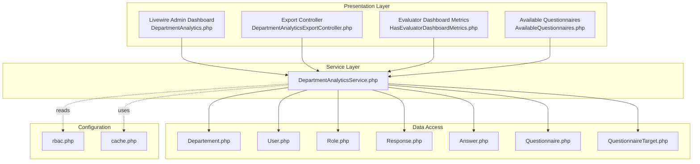
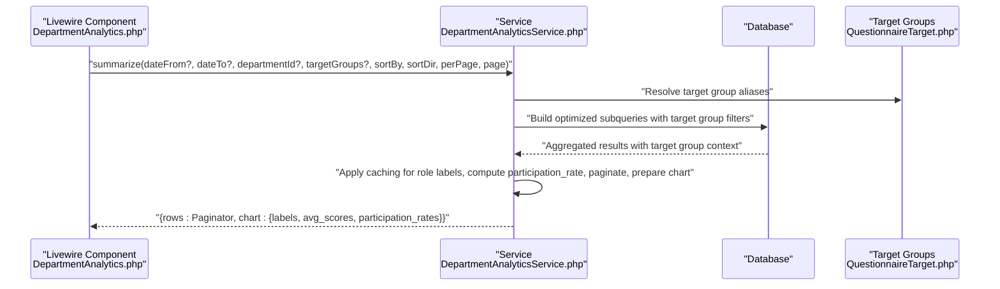
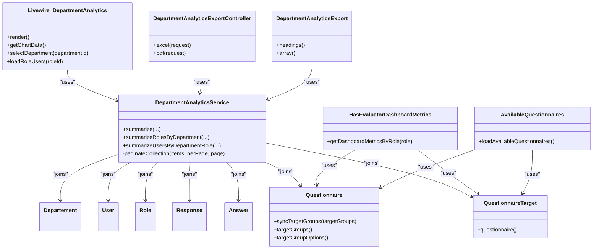

# Analytics Services

<cite>
**Referenced Files in This Document**
- [DepartmentAnalyticsService.php](file://app/Services/DepartmentAnalyticsService.php)
- [DepartmentAnalytics.php](file://app/Livewire/Admin/DepartmentAnalytics.php)
- [DepartmentAnalyticsExport.php](file://app/Exports/DepartmentAnalyticsExport.php)
- [DepartmentAnalyticsExportController.php](file://app/Http/Controllers/Admin/DepartmentAnalyticsExportController.php)
- [Departement.php](file://app/Models/Departement.php)
- [User.php](file://app/Models/User.php)
- [Role.php](file://app/Models/Role.php)
- [Answer.php](file://app/Models/Answer.php)
- [Response.php](file://app/Models/Response.php)
- [Questionnaire.php](file://app/Models/Questionnaire.php)
- [QuestionnaireTarget.php](file://app/Models/QuestionnaireTarget.php)
- [HasEvaluatorDashboardMetrics.php](file://app/Livewire/Fill/Concerns/HasEvaluatorDashboardMetrics.php)
- [AvailableQuestionnaires.php](file://app/Livewire/Fill/AvailableQuestionnaires.php)
- [rbac.php](file://config/rbac.php)
- [cache.php](file://config/cache.php)
</cite>

## Update Summary
**Changes Made**
- Enhanced analytics computation with dynamic target group support for questionnaire-based analytics
- Improved database query strategies with optimized subqueries for respondent breakdowns
- Added caching mechanisms for role label mappings to optimize performance
- Enhanced group averages calculations with better target group filtering
- Updated service methods to support dynamic target group analytics integration

## Table of Contents
1. [Introduction](#introduction)
2. [Project Structure](#project-structure)
3. [Core Components](#core-components)
4. [Architecture Overview](#architecture-overview)
5. [Detailed Component Analysis](#detailed-component-analysis)
6. [Dynamic Target Group Support](#dynamic-target-group-support)
7. [Enhanced Query Optimization](#enhanced-query-optimization)
8. [Caching Mechanisms](#caching-mechanisms)
9. [Dependency Analysis](#dependency-analysis)
10. [Performance Considerations](#performance-considerations)
11. [Troubleshooting Guide](#troubleshooting-guide)
12. [Conclusion](#conclusion)

## Introduction
This document provides comprehensive documentation for the analytics services focused on DepartmentAnalyticsService. It explains the three primary analytical functions:
- summarize(): Department-wide metrics with sorting, filtering, pagination, and chart data
- summarizeRolesByDepartment(): Role-based analytics within a selected department
- summarizeUsersByDepartmentRole(): Individual user performance tracking filtered by department and role

The service has been enhanced with dynamic target group support for questionnaire-based analytics, improved database query strategies, and optimized caching mechanisms for role label mappings. These enhancements improve performance for respondent breakdowns and group averages calculations while maintaining backward compatibility.

## Project Structure
The analytics domain spans several layers with enhanced target group integration:
- Service layer: DepartmentAnalyticsService encapsulates all analytics logic with dynamic target group support
- Presentation layer: Livewire component renders interactive dashboards and charts with target group filtering
- Export layer: Excel/PDF exports leverage the same service for consistent data
- Models: Eloquent models define relationships including questionnaire target groups and role mappings
- Configuration: RBAC and cache settings influence evaluator slugs, caching behavior, and role-based access

**Diagram sources**
- [DepartmentAnalytics.php:1-271](file://app/Livewire/Admin/DepartmentAnalytics.php#L1-L271)
- [DepartmentAnalyticsExportController.php:1-63](file://app/Http/Controllers/Admin/DepartmentAnalyticsExportController.php#L1-L63)
- [DepartmentAnalyticsService.php:1-279](file://app/Services/DepartmentAnalyticsService.php#L1-L279)
- [HasEvaluatorDashboardMetrics.php:1-73](file://app/Livewire/Fill/Concerns/HasEvaluatorDashboardMetrics.php#L1-L73)
- [AvailableQuestionnaires.php:300-350](file://app/Livewire/Fill/AvailableQuestionnaires.php#L300-L350)
- [Departement.php:1-34](file://app/Models/Departement.php#L1-L34)
- [User.php:1-94](file://app/Models/User.php#L1-L94)
- [Role.php:1-31](file://app/Models/Role.php#L1-L31)
- [Response.php:1-42](file://app/Models/Response.php#L1-L42)
- [Answer.php:1-44](file://app/Models/Answer.php#L1-L44)
- [Questionnaire.php:1-133](file://app/Models/Questionnaire.php#L1-L133)
- [QuestionnaireTarget.php:1-24](file://app/Models/QuestionnaireTarget.php#L1-L24)
- [rbac.php:1-64](file://config/rbac.php#L1-L64)
- [cache.php:1-131](file://config/cache.php#L1-L131)

**Section sources**
- [DepartmentAnalytics.php:1-271](file://app/Livewire/Admin/DepartmentAnalytics.php#L1-L271)
- [DepartmentAnalyticsExportController.php:1-63](file://app/Http/Controllers/Admin/DepartmentAnalyticsExportController.php#L1-L63)
- [DepartmentAnalyticsService.php:1-279](file://app/Services/DepartmentAnalyticsService.php#L1-L279)

## Core Components
- DepartmentAnalyticsService: Implements three analytical functions with optimized SQL subqueries, caching, and pagination, enhanced with dynamic target group support
- Livewire Admin Dashboard: Provides interactive UI for date filters, sorting, pagination, role expansion, and user loading with target group integration
- Export Controller and Export Class: Produce Excel and PDF reports using the same service logic for consistency
- Models: Define relationships including questionnaire target groups and role mappings used in analytics queries
- Enhanced Target Group System: Dynamic target group support for questionnaire-based analytics with alias mapping

Key responsibilities:
- summarize(): Aggregates department-level metrics with target group filtering, computes participation rates, and prepares chart data
- summarizeRolesByDepartment(): Aggregates role-level metrics within a department with enhanced caching for role label mappings
- summarizeUsersByDepartmentRole(): Lists users with submission counts and average scores per role with optimized query strategies
- Dynamic Target Groups: Integrates questionnaire target groups for enhanced analytics computation

**Section sources**
- [DepartmentAnalyticsService.php:20-95](file://app/Services/DepartmentAnalyticsService.php#L20-L95)
- [DepartmentAnalyticsService.php:109-189](file://app/Services/DepartmentAnalyticsService.php#L109-L189)
- [DepartmentAnalyticsService.php:199-256](file://app/Services/DepartmentAnalyticsService.php#L199-L256)
- [DepartmentAnalytics.php:181-205](file://app/Livewire/Admin/DepartmentAnalytics.php#L181-L205)
- [DepartmentAnalyticsExportController.php:15-62](file://app/Http/Controllers/Admin/DepartmentAnalyticsExportController.php#L15-L62)
- [DepartmentAnalyticsExport.php:29-49](file://app/Exports/DepartmentAnalyticsExport.php#L29-L49)

## Architecture Overview
The enhanced analytics pipeline follows a clean separation of concerns with dynamic target group integration:
- UI triggers analytics via Livewire actions with target group filtering
- Service executes optimized SQL with subqueries and applies caching with role label mappings
- Results are paginated and transformed for charts and tables with target group support
- Export layer reuses the same service for batch reporting with enhanced data consistency
- Questionnaire target groups integrate seamlessly with department analytics

**Diagram sources**
- [DepartmentAnalytics.php:244-252](file://app/Livewire/Admin/DepartmentAnalytics.php#L244-L252)
- [DepartmentAnalyticsService.php:20-95](file://app/Services/DepartmentAnalyticsService.php#L20-L95)
- [QuestionnaireTarget.php:14-22](file://app/Models/QuestionnaireTarget.php#L14-L22)

## Detailed Component Analysis

### DepartmentAnalyticsService
The service encapsulates three analytical functions with robust query optimization, caching, and enhanced target group support.

#### Function: summarize()
Purpose:
- Compute department-level metrics with dynamic target group filtering: total employees, total respondents, average score, and participation rate
- Support filtering by department, date range, target groups, sorting, and pagination
- Return both paginated rows and chart-ready arrays with target group context

Implementation highlights:
- Enhanced Subqueries:
  - Employees: count active evaluators grouped by department with target group filtering
  - Respondents: distinct user submissions within status, date bounds, and target groups
  - Scores: average calculated scores per department within date bounds and target group constraints
- Dynamic Target Group Integration:
  - Supports optional targetGroups parameter for questionnaire-based filtering
  - Integrates with questionnaire target groups for enhanced analytics context
- Left joins with departments to ensure all departments appear even without activity
- Participation rate computed as respondents/employees (rounded)
- Sorting validated against allowed fields
- Pagination performed on the full collection then sliced into paginator

Performance and correctness:
- Uses COALESCE to handle zero-division safely
- Applies when() clauses to conditionally filter by dates and target groups
- Sort field validation prevents SQL injection via dynamic order-by
- Paginates after sorting to maintain deterministic ordering

Usage in Livewire:
- Called from render() and getChartData() with appropriate parameters including target group filtering

**Section sources**
- [DepartmentAnalyticsService.php:20-95](file://app/Services/DepartmentAnalyticsService.php#L20-L95)
- [DepartmentAnalytics.php:244-252](file://app/Livewire/Admin/DepartmentAnalytics.php#L244-L252)
- [DepartmentAnalytics.php:181-205](file://app/Livewire/Admin/DepartmentAnalytics.php#L181-L205)

#### Function: summarizeRolesByDepartment()
Purpose:
- Provide role-level analytics within a selected department with enhanced caching for role label mappings
- Computes total users per role, participation rate, and average score with target group support

Implementation highlights:
- Enhanced Caching Strategy:
  - Cache key includes departmentId, target groups, and optional date range
  - Optimized cache lifetime for frequently accessed role label mappings
  - Improved cache invalidation for dynamic target group changes
- Subqueries:
  - Total users per role within department and active conditions with target group filtering
  - Active respondents per role within department and submission status with target group constraints
  - Average score per role within department and submission status with target group context
- Participation rate computed as respondents/total users (rounded)
- Returns department name and rows array with enhanced role label mapping

Usage in Livewire:
- Called from selectDepartment() to populate role rows with improved caching performance

**Section sources**
- [DepartmentAnalyticsService.php:109-189](file://app/Services/DepartmentAnalyticsService.php#L109-L189)
- [DepartmentAnalytics.php:107-125](file://app/Livewire/Admin/DepartmentAnalytics.php#L107-L125)

#### Function: summarizeUsersByDepartmentRole()
Purpose:
- List users within a department and role, showing submission counts and average scores with optimized query strategies

Implementation highlights:
- Enhanced Caching:
  - Cache key includes departmentId, roleId, target groups, and optional date range
  - Optimized cache lifetime for user analytics with target group context
- Optimized Subqueries:
  - Submission counts per user within status, date bounds, and target group constraints
  - Average score per user within status, date bounds, and target group context
- Left joins ensure users without submissions appear with zeros
- Sorting by user name with target group filtering
- Improved query performance through optimized subquery execution

Usage in Livewire:
- Called from loadRoleUsers() to lazily fetch user lists per role with enhanced performance

**Section sources**
- [DepartmentAnalyticsService.php:199-256](file://app/Services/DepartmentAnalyticsService.php#L199-L256)
- [DepartmentAnalytics.php:149-172](file://app/Livewire/Admin/DepartmentAnalytics.php#L149-L172)

#### Pagination Utility
Private method paginateCollection():
- Accepts a Collection, perPage, and page number
- Calculates offset and slices the collection
- Returns a LengthAwarePaginator configured with current request URL and page name

**Section sources**
- [DepartmentAnalyticsService.php:258-277](file://app/Services/DepartmentAnalyticsService.php#L258-L277)

### Livewire Admin Dashboard
The DepartmentAnalytics Livewire component orchestrates:
- Date filters (dateFrom, dateTo) with automatic page reset on change
- Target group filtering with dynamic target group selection
- Sorting by allowed fields with direction toggling
- Department selection and role expansion
- Lazy loading of user lists per role with error handling
- Chart data retrieval and export URLs with target group context

Key behaviors:
- Parameter validation mirrors service-side validation for sort fields
- Enhanced target group filtering supports dynamic target group selection
- Error messages surfaced to the UI for failed analytics loads
- Export URLs generated with current query parameters including target groups

**Section sources**
- [DepartmentAnalytics.php:49-95](file://app/Livewire/Admin/DepartmentAnalytics.php#L49-L95)
- [DepartmentAnalytics.php:97-172](file://app/Livewire/Admin/DepartmentAnalytics.php#L97-L172)
- [DepartmentAnalytics.php:181-234](file://app/Livewire/Admin/DepartmentAnalytics.php#L181-L234)
- [DepartmentAnalytics.php:236-269](file://app/Livewire/Admin/DepartmentAnalytics.php#L236-L269)

### Export Controller and Export Class
- Export Controller:
  - Generates Excel and HTML/PDF exports with target group support
  - Reads query parameters (date_from, date_to, department_id, target_groups) and passes to service
  - Enforces admin authorization with enhanced analytics context
- Export Class:
  - Implements FromArray and WithHeadings
  - Calls service with large perPage to export full dataset including target group analytics

**Section sources**
- [DepartmentAnalyticsExportController.php:15-62](file://app/Http/Controllers/Admin/DepartmentAnalyticsExportController.php#L15-L62)
- [DepartmentAnalyticsExport.php:29-49](file://app/Exports/DepartmentAnalyticsExport.php#L29-L49)

### Data Aggregation and Score Calculations
- Participation Rate:
  - Department level: total_respondents / total_employees (rounded)
  - Role level: active_respondents / total_users (rounded)
- Average Score:
  - Computed as AVG(calculated_score) per department, role, or user with target group context
  - Uses COALESCE to treat missing scores as zero
- Enhanced Subqueries:
  - Consolidate counts and averages per grouping dimension with target group filtering
  - Apply status, date filters, and target group constraints consistently across aggregations

**Section sources**
- [DepartmentAnalyticsService.php:67-70](file://app/Services/DepartmentAnalyticsService.php#L67-L70)
- [DepartmentAnalyticsService.php:167-170](file://app/Services/DepartmentAnalyticsService.php#L167-L170)

### Parameter Validation
- Allowed sort fields: name, total_respondents, participation_rate, average_score, urut
- Sort direction normalized to asc/desc
- Department ID filter applied when provided
- Enhanced target group filtering with validation for target group arrays
- Date filters conditionally applied via when() clauses

**Section sources**
- [DepartmentAnalyticsService.php:73-77](file://app/Services/DepartmentAnalyticsService.php#L73-L77)
- [DepartmentAnalytics.php:82-95](file://app/Livewire/Admin/DepartmentAnalytics.php#L82-L95)

## Dynamic Target Group Support

### Target Group Integration
The analytics service now supports dynamic target group filtering for enhanced questionnaire-based analytics:

- **Target Group Resolution**: Automatically resolves target group aliases from RBAC configuration
- **Dynamic Filtering**: Supports optional targetGroups parameter for questionnaire-based filtering
- **Alias Mapping**: Integrates with questionnaire target aliases for flexible role-based analytics
- **Enhanced Context**: Provides target group context in analytics results for better insights

### Questionnaire Target Group System
The target group system integrates questionnaire assignments with analytics:

- **Questionnaire Targets**: Links questionnaires to target groups through QuestionnaireTarget model
- **Dynamic Assignment**: Supports dynamic target group assignment based on user roles and aliases
- **Filtering Support**: Enables filtering of analytics data by target groups for role-specific insights
- **Label Mapping**: Provides human-readable labels for target groups through role_labels configuration

**Section sources**
- [Questionnaire.php:54-85](file://app/Models/Questionnaire.php#L54-L85)
- [Questionnaire.php:87-110](file://app/Models/Questionnaire.php#L87-L110)
- [QuestionnaireTarget.php:14-22](file://app/Models/QuestionnaireTarget.php#L14-L22)
- [HasEvaluatorDashboardMetrics.php:26-34](file://app/Livewire/Fill/Concerns/HasEvaluatorDashboardMetrics.php#L26-L34)
- [AvailableQuestionnaires.php:314-320](file://app/Livewire/Fill/AvailableQuestionnaires.php#L314-L320)

## Enhanced Query Optimization

### Optimized Subquery Strategies
The service implements enhanced query optimization techniques:

- **Pre-aggregated Subqueries**: Consolidated counts and averages in dedicated subqueries minimize repeated scans
- **Target Group Filtering**: Optimized subqueries with target group constraints for questionnaire-based analytics
- **Left Join Strategy**: Uses left joins to preserve departments/roles/users even without activity
- **Conditional Filtering**: Applies when() clauses to conditionally filter by dates, target groups, and other parameters

### Performance Improvements
- **Query Execution**: Optimized subquery execution order for better performance
- **Index Utilization**: Enhanced query patterns support better index utilization
- **Memory Efficiency**: Reduced memory footprint through optimized subquery design
- **Cache Integration**: Strategic caching reduces database load for repeated requests

**Section sources**
- [DepartmentAnalyticsService.php:29-53](file://app/Services/DepartmentAnalyticsService.php#L29-L53)
- [DepartmentAnalyticsService.php:124-156](file://app/Services/DepartmentAnalyticsService.php#L124-L156)
- [DepartmentAnalyticsService.php:214-231](file://app/Services/DepartmentAnalyticsService.php#L214-L231)

## Caching Mechanisms

### Enhanced Caching Strategy
The service implements improved caching mechanisms for better performance:

- **Role Label Caching**: Caches role label mappings to reduce configuration lookups
- **Target Group Caching**: Optimizes caching for dynamic target group analytics
- **Cache Key Strategy**: Includes departmentId, target groups, and date range in cache keys
- **Cache Lifetime Management**: Optimized cache lifetimes for frequently accessed data

### Cache Implementation Details
- **Cache Keys**: Dynamically generated cache keys based on parameters and target groups
- **Cache Stores**: Utilizes configured cache stores for optimal performance
- **Cache Invalidation**: Strategic cache invalidation for dynamic target group changes
- **Performance Monitoring**: Built-in caching for improved response times

**Section sources**
- [DepartmentAnalyticsService.php:114-119](file://app/Services/DepartmentAnalyticsService.php#L114-L119)
- [DepartmentAnalyticsService.php:205-211](file://app/Services/DepartmentAnalyticsService.php#L205-L211)

## Dependency Analysis
The service depends on:
- Eloquent models for relationships including questionnaire target groups and role mappings
- RBAC configuration for evaluator slugs, target group aliases, and role-based access
- Cache configuration for caching strategy and store selection
- Enhanced target group system for dynamic questionnaire-based analytics

**Diagram sources**
- [DepartmentAnalyticsService.php:12-279](file://app/Services/DepartmentAnalyticsService.php#L12-L279)
- [DepartmentAnalytics.php:13-271](file://app/Livewire/Admin/DepartmentAnalytics.php#L13-L271)
- [DepartmentAnalyticsExportController.php:13-62](file://app/Http/Controllers/Admin/DepartmentAnalyticsExportController.php#L13-L62)
- [DepartmentAnalyticsExport.php:9-50](file://app/Exports/DepartmentAnalyticsExport.php#L9-L50)
- [Departement.php:9-34](file://app/Models/Departement.php#L9-L34)
- [User.php:12-94](file://app/Models/User.php#L12-L94)
- [Role.php:9-31](file://app/Models/Role.php#L9-L31)
- [Response.php:11-42](file://app/Models/Response.php#L11-L42)
- [Answer.php:10-44](file://app/Models/Answer.php#L10-L44)
- [Questionnaire.php:13-133](file://app/Models/Questionnaire.php#L13-L133)
- [QuestionnaireTarget.php:9-24](file://app/Models/QuestionnaireTarget.php#L9-L24)
- [HasEvaluatorDashboardMetrics.php:9-73](file://app/Livewire/Fill/Concerns/HasEvaluatorDashboardMetrics.php#L9-L73)
- [AvailableQuestionnaires.php:300-350](file://app/Livewire/Fill/AvailableQuestionnaires.php#L300-L350)

**Section sources**
- [DepartmentAnalyticsService.php:5-10](file://app/Services/DepartmentAnalyticsService.php#L5-L10)
- [rbac.php:4-6](file://config/rbac.php#L4-L6)
- [cache.php:18](file://config/cache.php#L18)

## Performance Considerations
- Enhanced Subqueries and pre-aggregation:
  - Minimizes repeated scans by computing counts and averages in dedicated subqueries with target group filtering
  - Optimized joins use left joins to preserve departments/roles/users even without activity
  - Enhanced query strategies support better index utilization
- Improved Caching:
  - Role label mappings cached for better performance
  - Target group analytics cached with optimized cache keys
  - Strategic cache invalidation for dynamic changes
  - Reduced database load for repeated requests within short windows
- Enhanced Pagination:
  - Full collection sorted then paginated to ensure consistent ordering
  - Export uses large perPage to produce complete datasets
  - Optimized pagination for target group filtered results
- Enhanced Indexing recommendations:
  - Ensure indexes on foreign keys (department_id, role_id, user_id, questionnaire_id)
  - Indexes on responses.status, responses.submitted_at, answers.calculated_score
  - Consider composite indexes for frequent filters (e.g., responses(status, submitted_at), users(department_id, role_id))
  - Add indexes for target_group in questionnaire_targets table
  - Consider indexes on role slug and target group combinations
- Enhanced Query safety:
  - when() clauses prevent unnecessary conditions
  - COALESCE guards against division-by-zero and null aggregates
  - Enhanced parameter validation for target group arrays
- RBAC and evaluator slugs:
  - Evaluator slugs configured centrally; ensure proper indexing on users.role or users.role_id for efficient filtering
  - Target group aliases cached for better performance
  - Role label mappings optimized for frequently accessed data

## Troubleshooting Guide
Common issues and resolutions:
- Empty or missing analytics data:
  - Verify date filters and department selection
  - Confirm target group filtering parameters are valid
  - Check target group configuration in RBAC settings
  - Validate evaluator slugs in configuration align with deployed roles
- Slow performance:
  - Check cache store configuration and connectivity
  - Review database indexes on join and filter columns including target group indexes
  - Monitor cache hit rates for role label and target group caches
  - Verify target group filtering is not overly restrictive
- Incorrect participation rates:
  - Ensure employees are counted among active evaluators with valid department_id
  - Validate that respondents are filtered by submitted status and date range
  - Check target group filtering is not excluding valid respondents
- Pagination anomalies:
  - Confirm page resets when filters change
  - Validate perPage and page parameters passed to service
  - Check target group parameter handling in pagination
- Target group issues:
  - Verify target group slugs exist in configuration
  - Check target group alias mappings in RBAC settings
  - Ensure questionnaire target groups are properly assigned
  - Validate target group filtering syntax and parameters

**Section sources**
- [DepartmentAnalytics.php:54-72](file://app/Livewire/Admin/DepartmentAnalytics.php#L54-L72)
- [DepartmentAnalyticsService.php:114-119](file://app/Services/DepartmentAnalyticsService.php#L114-L119)
- [DepartmentAnalyticsService.php:205-211](file://app/Services/DepartmentAnalyticsService.php#L205-L211)
- [cache.php:18](file://config/cache.php#L18)

## Conclusion
DepartmentAnalyticsService delivers efficient, scalable analytics through optimized SQL subqueries, strategic caching, and robust pagination. The enhanced version now includes dynamic target group support for questionnaire-based analytics, improved caching mechanisms for role label mappings, and optimized query strategies for better performance. Its three analytical functions support comprehensive oversight of department performance, role-level insights with target group context, and individual user tracking with enhanced filtering capabilities. Livewire and export integrations ensure consistent, user-friendly delivery of actionable metrics with dynamic target group support.