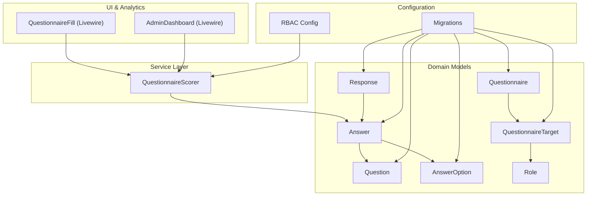
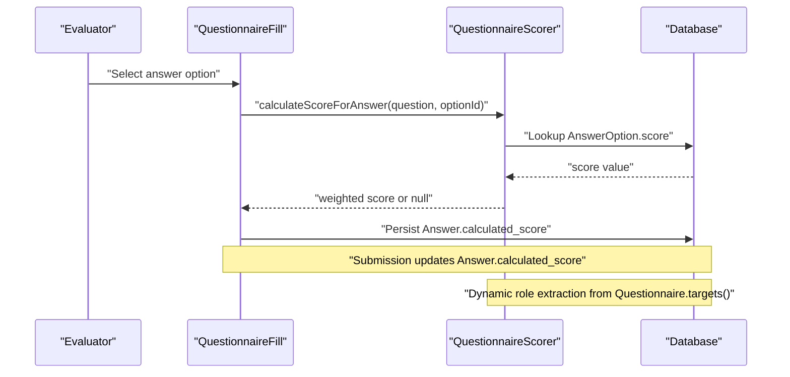
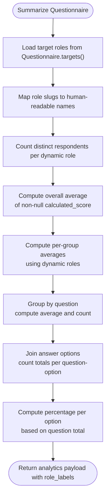
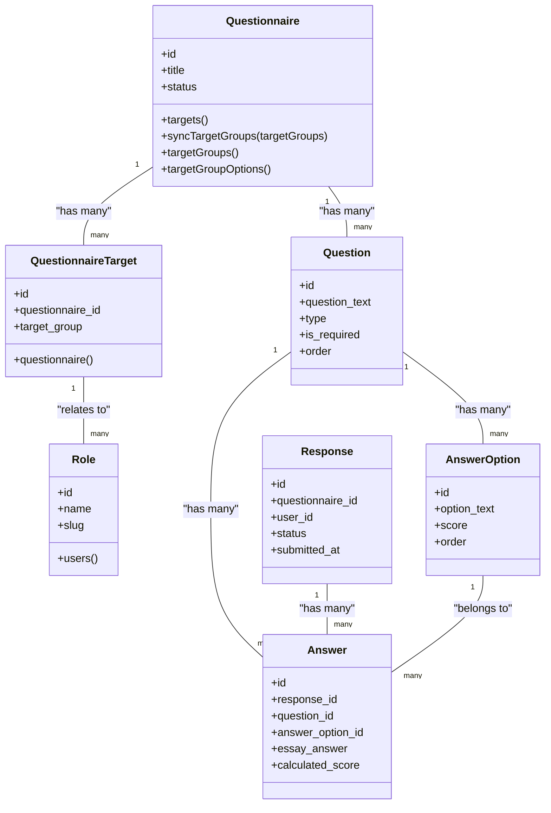
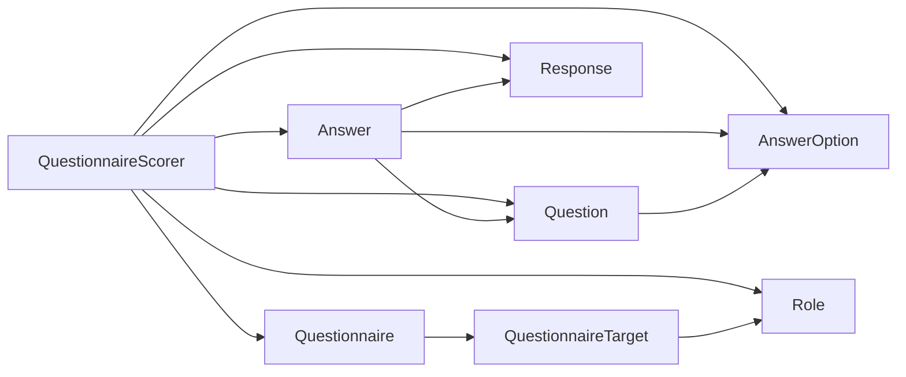

# Assessment Scoring Services

<cite>
**Referenced Files in This Document**
- [QuestionnaireScorer.php](file://app/Services/QuestionnaireScorer.php)
- [Answer.php](file://app/Models/Answer.php)
- [AnswerOption.php](file://app/Models/AnswerOption.php)
- [Question.php](file://app/Models/Question.php)
- [Response.php](file://app/Models/Response.php)
- [Questionnaire.php](file://app/Models/Questionnaire.php)
- [QuestionnaireTarget.php](file://app/Models/QuestionnaireTarget.php)
- [Role.php](file://app/Models/Role.php)
- [2026_04_16_020000_create_responses_table.php](file://database/migrations/2026_04_16_020000_create_responses_table.php)
- [2026_04_16_020100_create_answers_table.php](file://database/migrations/2026_04_16_020100_create_answers_table.php)
- [2026_04_16_010242_create_answer_options_table.php](file://database/migrations/2026_04_16_010242_create_answer_options_table.php)
- [2026_04_16_010241_create_questions_table.php](file://database/migrations/2026_04_16_010241_create_questions_table.php)
- [2026_04_16_010239_create_questionnaires_table.php](file://database/migrations/2026_04_16_010239_create_questionnaires_table.php)
- [2026_04_16_010240_create_questionnaire_targets_table.php](file://database/migrations/2026_04_16_010240_create_questionnaire_targets_table.php)
- [rbac.php](file://config/rbac.php)
- [07-scoring.md](file://.clinerules/07-scoring.md)
- [QuestionnaireFill.php](file://app/Livewire/Fill/QuestionnaireFill.php)
- [AdminDashboard.php](file://app/Livewire/Admin/AdminDashboard.php)
</cite>

## Update Summary
**Changes Made**
- Updated dynamic role extraction methodology from questionnaire relationships
- Enhanced role labels mapping with human-readable names
- Added new `role_labels` field to analytics payload
- Updated scoring algorithm to use dynamic target groups instead of static RBAC configuration
- Improved role management through questionnaire-target relationships

## Table of Contents
1. [Introduction](#introduction)
2. [Project Structure](#project-structure)
3. [Core Components](#core-components)
4. [Architecture Overview](#architecture-overview)
5. [Detailed Component Analysis](#detailed-component-analysis)
6. [Dependency Analysis](#dependency-analysis)
7. [Performance Considerations](#performance-considerations)
8. [Troubleshooting Guide](#troubleshooting-guide)
9. [Conclusion](#conclusion)
10. [Appendices](#appendices)

## Introduction
This document describes the Assessment Scoring Services with a focus on the QuestionnaireScorer service. It explains how raw scores are derived from selected answer options, aggregated into averages and distributions, and how the service integrates with the domain models and analytics dashboards. The service now features an upgraded scoring algorithm that uses dynamic roles extracted from questionnaire relationships rather than relying on static configurations. It outlines scoring methodology, weighted answer calculations, grade computation logic, threshold calculations, performance band assignments, response validation, and score caching mechanisms. Finally, it provides examples of scoring configurations, custom scoring rules, and performance optimization techniques for bulk scoring operations.

## Project Structure
The scoring service is implemented as a dedicated service class and integrates with Eloquent models representing responses, answers, questions, and answer options. Database migrations define the schema for storing scored responses and computed metrics. The scoring logic now extracts target groups dynamically from questionnaire relationships rather than using static RBAC configurations. The scoring service is invoked during form submission and leveraged by analytics dashboards.

**Diagram sources**
- [QuestionnaireScorer.php:12-150](file://app/Services/QuestionnaireScorer.php#L12-L150)
- [Answer.php:10-44](file://app/Models/Answer.php#L10-L44)
- [AnswerOption.php:10-38](file://app/Models/AnswerOption.php#L10-L38)
- [Question.php:11-43](file://app/Models/Question.php#L11-L43)
- [Response.php:11-42](file://app/Models/Response.php#L11-L42)
- [Questionnaire.php:39-42](file://app/Models/Questionnaire.php#L39-L42)
- [QuestionnaireTarget.php:19-22](file://app/Models/QuestionnaireTarget.php#L19-L22)
- [Role.php:26-29](file://app/Models/Role.php#L26-L29)
- [rbac.php:1-64](file://config/rbac.php#L1-L64)
- [2026_04_16_010241_create_questions_table.php:1-30](file://database/migrations/2026_04_16_010241_create_questions_table.php#L1-L30)
- [2026_04_16_010242_create_answer_options_table.php:1-28](file://database/migrations/2026_04_16_010242_create_answer_options_table.php#L1-L28)
- [2026_04_16_020000_create_responses_table.php:1-30](file://database/migrations/2026_04_16_020000_create_responses_table.php#L1-L30)
- [2026_04_16_020100_create_answers_table.php:1-30](file://database/migrations/2026_04_16_020100_create_answers_table.php#L1-L30)
- [2026_04_16_010240_create_questionnaire_targets_table.php:1-26](file://database/migrations/2026_04_16_010240_create_questionnaire_targets_table.php#L1-L26)

**Section sources**
- [QuestionnaireScorer.php:12-150](file://app/Services/QuestionnaireScorer.php#L12-L150)
- [Answer.php:10-44](file://app/Models/Answer.php#L10-L44)
- [AnswerOption.php:10-38](file://app/Models/AnswerOption.php#L10-L38)
- [Question.php:11-43](file://app/Models/Question.php#L11-L43)
- [Response.php:11-42](file://app/Models/Response.php#L11-L42)
- [Questionnaire.php:39-42](file://app/Models/Questionnaire.php#L39-L42)
- [QuestionnaireTarget.php:19-22](file://app/Models/QuestionnaireTarget.php#L19-L22)
- [Role.php:26-29](file://app/Models/Role.php#L26-L29)
- [rbac.php:1-64](file://config/rbac.php#L1-L64)
- [2026_04_16_010241_create_questions_table.php:1-30](file://database/migrations/2026_04_16_010241_create_questions_table.php#L1-L30)
- [2026_04_16_010242_create_answer_options_table.php:1-28](file://database/migrations/2026_04_16_010242_create_answer_options_table.php#L1-L28)
- [2026_04_16_020000_create_responses_table.php:1-30](file://database/migrations/2026_04_16_020000_create_responses_table.php#L1-L30)
- [2026_04_16_020100_create_answers_table.php:1-30](file://database/migrations/2026_04_16_020100_create_answers_table.php#L1-L30)
- [2026_04_16_010240_create_questionnaire_targets_table.php:1-26](file://database/migrations/2026_04_16_010240_create_questionnaire_targets_table.php#L1-L26)

## Core Components
- **QuestionnaireScorer**: Central scoring service providing:
  - Weighted answer calculation for single-choice questions
  - Questionnaire-wide analytics: overall averages, dynamic group averages, question averages, and distribution percentages
  - Dynamic role extraction from questionnaire relationships for analytics segmentation
  - Role labels mapping for human-readable analytics display
- **Answer model**: Stores calculated_score and links to Response, Question, and AnswerOption
- **Question model**: Defines question type and maintains ordered AnswerOption entries
- **AnswerOption model**: Holds option_text and numeric score used for weighted scoring
- **Response model**: Represents a single submission with status and user linkage
- **Questionnaire model**: Manages dynamic target groups through questionnaire-target relationships
- **QuestionnaireTarget model**: Links questionnaires to target role groups
- **Role model**: Provides role definitions and user relationships
- **RBAC configuration**: Defines fallback target groups when questionnaire relationships are empty

Key responsibilities:
- **Weighted scoring**: Selects the score value associated with the chosen AnswerOption for a given Question
- **Aggregation**: Computes averages and distributions across submitted responses
- **Dynamic role management**: Extracts target groups from questionnaire relationships rather than static configurations
- **Validation**: Ignores null calculated_score entries in averages and counts
- **Role labeling**: Maps role slugs to human-readable names for analytics display

**Section sources**
- [QuestionnaireScorer.php:14-23](file://app/Services/QuestionnaireScorer.php#L14-L23)
- [QuestionnaireScorer.php:33-123](file://app/Services/QuestionnaireScorer.php#L33-L123)
- [Answer.php:15-22](file://app/Models/Answer.php#L15-L22)
- [AnswerOption.php:15-21](file://app/Models/AnswerOption.php#L15-L21)
- [Question.php:16-26](file://app/Models/Question.php#L16-L26)
- [Questionnaire.php:39-42](file://app/Models/Questionnaire.php#L39-L42)
- [QuestionnaireTarget.php:19-22](file://app/Models/QuestionnaireTarget.php#L19-L22)
- [Role.php:26-29](file://app/Models/Role.php#L26-L29)
- [rbac.php:6-11](file://config/rbac.php#L6-L11)
- [2026_04_16_020100_create_answers_table.php:14-16](file://database/migrations/2026_04_16_020100_create_answers_table.php#L14-L16)

## Architecture Overview
The scoring pipeline connects UI interactions to the scoring service and persists results in the Answer model. Analytics dashboards consume summarized statistics produced by the service, with dynamic role extraction from questionnaire relationships replacing static RBAC configurations.

**Diagram sources**
- [QuestionnaireFill.php:225-240](file://app/Livewire/Fill/QuestionnaireFill.php#L225-L240)
- [QuestionnaireScorer.php:14-23](file://app/Services/QuestionnaireScorer.php#L14-L23)
- [Answer.php:15-22](file://app/Models/Answer.php#L15-L22)
- [Questionnaire.php:35-39](file://app/Models/Questionnaire.php#L35-L39)

## Detailed Component Analysis

### QuestionnaireScorer: Scoring and Analytics
**Updated** Enhanced with dynamic role extraction and role labels mapping

Responsibilities:
- **Weighted answer calculation**: Returns the score associated with a selected AnswerOption for a Question; returns null if no option is selected
- **Dynamic summarization**: Produces:
  - Respondent breakdown by dynamically extracted evaluator roles from questionnaire relationships
  - Overall average and per-group averages using dynamic role filtering
  - Question-level averages sorted descending
  - Distribution of answer options with counts and percentages
  - Role labels mapping for human-readable analytics display

Processing logic highlights:
- **Weighted scoring**: Retrieves score from AnswerOption when optionId is present; otherwise returns null
- **Dynamic role extraction**: Loads target roles from `$questionnaire->targets()->pluck('target_group')` instead of static RBAC configuration
- **Role labels mapping**: Creates human-readable role names using `\App\Models\Role::query()->whereIn('slug', $roles)->pluck('name', 'slug')`
- **Averages**: Computes overall average and per-group averages using only answers with non-null calculated_score and dynamic role filtering
- **Question averages**: Groups by question and computes rounded averages with response counts
- **Distribution**: Aggregates counts per question-option, then computes percentages based on total responses per question

**Diagram sources**
- [QuestionnaireScorer.php:33-123](file://app/Services/QuestionnaireScorer.php#L33-L123)
- [Questionnaire.php:35-39](file://app/Models/Questionnaire.php#L35-L39)
- [Role.php:26-29](file://app/Models/Role.php#L26-L29)

**Section sources**
- [QuestionnaireScorer.php:14-23](file://app/Services/QuestionnaireScorer.php#L14-L23)
- [QuestionnaireScorer.php:33-123](file://app/Services/QuestionnaireScorer.php#L33-L123)
- [QuestionnaireScorer.php:129-148](file://app/Services/QuestionnaireScorer.php#L129-L148)

### Data Models and Relationships
**Updated** Enhanced with questionnaire-target relationships and role management

**Diagram sources**
- [Questionnaire.php:39-42](file://app/Models/Questionnaire.php#L39-L42)
- [QuestionnaireTarget.php:19-22](file://app/Models/QuestionnaireTarget.php#L19-L22)
- [Role.php:26-29](file://app/Models/Role.php#L26-L29)
- [Question.php:11-43](file://app/Models/Question.php#L11-L43)
- [AnswerOption.php:10-38](file://app/Models/AnswerOption.php#L10-L38)
- [Answer.php:10-44](file://app/Models/Answer.php#L10-L44)
- [Response.php:11-42](file://app/Models/Response.php#L11-L42)
- [2026_04_16_010241_create_questions_table.php:11-22](file://database/migrations/2026_04_16_010241_create_questions_table.php#L11-L22)
- [2026_04_16_010242_create_answer_options_table.php:11-20](file://database/migrations/2026_04_16_010242_create_answer_options_table.php#L11-L20)
- [2026_04_16_020000_create_responses_table.php:10-22](file://database/migrations/2026_04_16_020000_create_responses_table.php#L10-L22)
- [2026_04_16_020100_create_answers_table.php:10-22](file://database/migrations/2026_04_16_020100_create_answers_table.php#L10-L22)
- [2026_04_16_010240_create_questionnaire_targets_table.php:11-17](file://database/migrations/2026_04_16_010240_create_questionnaire_targets_table.php#L11-L17)

### Scoring Methodology and Weighted Answer Calculations
- **Single choice scoring**: The score returned by calculateScoreForAnswer is the score value stored in AnswerOption for the selected option
- **Essay and combined questions**: The current implementation focuses on single choice; essay answers are stored separately and do not contribute to calculated_score in the referenced logic
- **Null handling**: If no option is selected, the method returns null; downstream analytics exclude null values from averages

Integration points:
- UI writes Answer.calculated_score during submission
- Analytics queries filter out null calculated_score when computing averages

**Section sources**
- [QuestionnaireScorer.php:14-23](file://app/Services/QuestionnaireScorer.php#L14-L23)
- [Answer.php:15-22](file://app/Models/Answer.php#L15-L22)
- [AnswerOption.php:15-21](file://app/Models/AnswerOption.php#L15-L21)
- [QuestionnaireFill.php:225-240](file://app/Livewire/Fill/QuestionnaireFill.php#L225-L240)

### Dynamic Role Management and Analytics Segmentation
**New** Enhanced role management system for flexible analytics segmentation

The scoring service now features a sophisticated dynamic role management system:

- **Dynamic role extraction**: Roles are extracted from `$questionnaire->targets()->pluck('target_group')` instead of static RBAC configuration
- **Fallback mechanism**: If questionnaire relationships are empty, the system falls back to RBAC configuration via `Questionnaire::targetGroups()`
- **Role validation**: The `syncTargetGroups` method validates roles against available role slugs and ensures at least one target group exists
- **Role labels mapping**: Human-readable role names are created using `Role::query()->whereIn('slug', $roles)->pluck('name', 'slug')`
- **Flexible targeting**: Questionnaires can be assigned multiple target groups, allowing for complex analytics segmentation

**Section sources**
- [QuestionnaireScorer.php:35-44](file://app/Services/QuestionnaireScorer.php#L35-L44)
- [Questionnaire.php:57-85](file://app/Models/Questionnaire.php#L57-L85)
- [Questionnaire.php:89-110](file://app/Models/Questionnaire.php#L89-L110)
- [QuestionnaireTarget.php:14-17](file://app/Models/QuestionnaireTarget.php#L14-L17)

### Grade Computation and Thresholds
- **Current implementation**: Does not compute letter grades or performance bands; averages are rounded to two decimals
- **Enhanced extensibility**: The addition of `role_labels` field provides better context for grade computation and display
- **Future enhancement**: To add grade thresholds, extend the summarization logic to map averages to grade bands and include band counts in the analytics payload
- **Threshold configuration**: Thresholds can be configured via configuration files and applied consistently across services

**Section sources**
- [QuestionnaireScorer.php:58-66](file://app/Services/QuestionnaireScorer.php#L58-L66)
- [QuestionnaireScorer.php:78-84](file://app/Services/QuestionnaireScorer.php#L78-L84)
- [QuestionnaireScorer.php:121](file://app/Services/QuestionnaireScorer.php#L121)
- [07-scoring.md:14-22](file://.clinerules/07-scoring.md#L14-L22)

### Response Validation and Data Integrity
- **Status filtering**: Analytics queries restrict to responses with status "submitted"
- **Non-null filtering**: Averages and counts exclude answers with null calculated_score
- **Unique constraints**: Responses are unique per questionnaire-user pair; Answers are unique per response-question pair
- **Required questions**: Questions can be marked as required; however, the scoring service itself does not enforce requiredness
- **Dynamic role validation**: Questionnaire target groups are validated against available role slugs during synchronization

**Section sources**
- [QuestionnaireScorer.php:46-48](file://app/Services/QuestionnaireScorer.php#L46-L48)
- [QuestionnaireScorer.php:58-63](file://app/Services/QuestionnaireScorer.php#L58-L63)
- [QuestionnaireScorer.php:78-85](file://app/Services/QuestionnaireScorer.php#L78-L85)
- [Questionnaire.php:57-85](file://app/Models/Questionnaire.php#L57-L85)
- [2026_04_16_020000_create_responses_table.php:14-16](file://database/migrations/2026_04_16_020000_create_responses_table.php#L14-L16)
- [2026_04_16_020100_create_answers_table.php:16](file://database/migrations/2026_04_16_020100_create_answers_table.php#L16)
- [Question.php:24-26](file://app/Models/Question.php#L24-L26)

### Score Caching Mechanisms
- **Current implementation**: The scoring service does not implement explicit caching; analytics are computed on demand
- **Enhanced caching strategy**: With dynamic role extraction, consider caching summarized results keyed by questionnaire_id and target group combinations
- **Cache invalidation**: Invalidate cached analytics on questionnaire target group changes and new submissions
- **Recommendation**: Cache summarized results keyed by questionnaire_id while invalidating on new submissions and target group modifications

**Section sources**
- [07-scoring.md:37-38](file://.clinerules/07-scoring.md#L37-L38)
- [QuestionnaireScorer.php:33-123](file://app/Services/QuestionnaireScorer.php#L33-L123)

### Examples of Scoring Configurations and Custom Rules
- **Default single-choice scoring scale**: Configure AnswerOption scores to reflect desired scale (e.g., 5, 4, 3, 2, 0)
- **Custom per-question weights**: Introduce a multiplier field on Question and adjust Answer.calculated_score accordingly
- **Dynamic role-based thresholds**: Add a configuration array mapping average ranges to grade bands with role-specific thresholds
- **Enhanced role management**: Use questionnaire-target relationships to assign multiple evaluator groups with different weightings

**Section sources**
- [07-scoring.md:3-12](file://.clinerules/07-scoring.md#L3-L12)
- [AnswerOption.php:15-21](file://app/Models/AnswerOption.php#L15-L21)
- [Question.php:16-26](file://app/Models/Question.php#L16-L26)
- [Questionnaire.php:57-85](file://app/Models/Questionnaire.php#L57-L85)

### Performance Optimization for Bulk Scoring Operations
- **Batch writes**: Persist Answer.calculated_score in batches after scoring to reduce database round trips
- **Index utilization**: Ensure indexes on questionnaire_id, status, and calculated_score improve query performance
- **Aggregation caching**: Cache summarized analytics per questionnaire and invalidate on submission events and target group changes
- **Pagination and chunking**: For very large datasets, process analytics in chunks and stream results
- **Dynamic role optimization**: Cache role extraction results per questionnaire to avoid repeated relationship queries

**Section sources**
- [2026_04_16_020100_create_answers_table.php:16](file://database/migrations/2026_04_16_020100_create_answers_table.php#L16)
- [2026_04_16_020000_create_responses_table.php:19-21](file://database/migrations/2026_04_16_020000_create_responses_table.php#L19-L21)
- [07-scoring.md:37-38](file://.clinerules/07-scoring.md#L37-L38)

## Dependency Analysis
**Updated** Enhanced with dynamic role management dependencies

**Diagram sources**
- [QuestionnaireScorer.php:5-10](file://app/Services/QuestionnaireScorer.php#L5-L10)
- [Answer.php:24-42](file://app/Models/Answer.php#L24-L42)
- [Question.php:28-41](file://app/Models/Question.php#L28-L41)
- [AnswerOption.php:23-36](file://app/Models/AnswerOption.php#L23-L36)
- [Response.php:27-40](file://app/Models/Response.php#L27-L40)
- [Questionnaire.php:39-42](file://app/Models/Questionnaire.php#L39-L42)
- [QuestionnaireTarget.php:19-22](file://app/Models/QuestionnaireTarget.php#L19-L22)
- [Role.php:26-29](file://app/Models/Role.php#L26-L29)

**Section sources**
- [QuestionnaireScorer.php:5-10](file://app/Services/QuestionnaireScorer.php#L5-L10)
- [Answer.php:24-42](file://app/Models/Answer.php#L24-L42)
- [Question.php:28-41](file://app/Models/Question.php#L28-L41)
- [AnswerOption.php:23-36](file://app/Models/AnswerOption.php#L23-L36)
- [Response.php:27-40](file://app/Models/Response.php#L27-L40)
- [Questionnaire.php:39-42](file://app/Models/Questionnaire.php#L39-L42)
- [QuestionnaireTarget.php:19-22](file://app/Models/QuestionnaireTarget.php#L19-L22)
- [Role.php:26-29](file://app/Models/Role.php#L26-L29)

## Performance Considerations
- **Use non-null filtering for averages** to avoid skewing results
- **Leverage database indexes** on frequently filtered columns (questionnaire_id, status, calculated_score)
- **Cache analytics results** for active questionnaires and invalidate on submission and target group changes
- **Batch database writes** for Answer.calculated_score during bulk operations
- **Stream large analytics exports** to avoid memory pressure
- **Optimize dynamic role queries** by caching role extraction results per questionnaire
- **Consider role label caching** to avoid repeated role name lookups

## Troubleshooting Guide
**Updated** Enhanced troubleshooting for dynamic role management

Common issues and resolutions:
- **Null calculated_score in averages**: Ensure UI writes Answer.calculated_score on submission; verify that nulls are excluded from averages
- **Incorrect averages due to draft responses**: Confirm analytics filter by status "submitted"
- **Missing roles in analytics**: Verify questionnaire-target relationships are properly configured; check that `Questionnaire::syncTargetGroups()` was called successfully
- **Unexpected distribution percentages**: Confirm counts aggregation per question-option and percentage calculation logic
- **Empty role labels**: Ensure roles exist in the Role table and have valid slug/name pairs
- **Dynamic role extraction failures**: Verify questionnaire-target relationships exist and target_group values match available role slugs
- **Performance issues with dynamic roles**: Consider caching role extraction results and role label mappings

**Section sources**
- [QuestionnaireScorer.php:46-48](file://app/Services/QuestionnaireScorer.php#L46-L48)
- [QuestionnaireScorer.php:58-63](file://app/Services/QuestionnaireScorer.php#L58-L63)
- [QuestionnaireScorer.php:78-85](file://app/Services/QuestionnaireScorer.php#L78-L85)
- [QuestionnaireScorer.php:110-122](file://app/Services/QuestionnaireScorer.php#L110-L122)
- [Questionnaire.php:57-85](file://app/Models/Questionnaire.php#L57-L85)
- [QuestionnaireTarget.php:14-17](file://app/Models/QuestionnaireTarget.php#L14-L17)
- [Role.php:13-19](file://app/Models/Role.php#L13-L19)

## Conclusion
The QuestionnaireScorer service provides a focused, efficient mechanism for weighted scoring and analytics with enhanced dynamic role management. It now extracts target groups from questionnaire relationships rather than relying on static RBAC configurations, providing greater flexibility and maintainability. The service enforces response validation via status and non-null constraints, segments analytics by dynamic evaluator roles, and includes role labels for human-readable displays. Extending the service to support grade thresholds, enhanced caching strategies, and batch operations aligns with the project's scoring guidelines and enhances scalability while maintaining backward compatibility.

## Appendices

### API and Data Contracts
**Updated** Enhanced with role labels and dynamic role fields

- **Summarization output keys**:
  - **respondent_breakdown**: role => count
  - **averages.overall**: float
  - **averages.per_group**: role => average
  - **question_scores**: array of {question_id, question_text, type, average_score, responses_count}
  - **distribution**: array of {question_id, question_text, option_text, score, count, percentage}
  - **role_labels**: array mapping role slug to human-readable name

- **Dynamic role management methods**:
  - `Questionnaire::syncTargetGroups(array $targetGroups)`: Synchronizes target groups with validation
  - `Questionnaire::targetGroups()`: Returns available target groups with fallback to RBAC configuration
  - `Questionnaire::targetGroupOptions()`: Returns role options with slug/name pairs

**Section sources**
- [QuestionnaireScorer.php:25-32](file://app/Services/QuestionnaireScorer.php#L25-L32)
- [QuestionnaireScorer.php:109-122](file://app/Services/QuestionnaireScorer.php#L109-L122)
- [Questionnaire.php:57-85](file://app/Models/Questionnaire.php#L57-L85)
- [Questionnaire.php:89-110](file://app/Models/Questionnaire.php#L89-L110)
- [Questionnaire.php:115-131](file://app/Models/Questionnaire.php#L115-L131)