# Export Services

<cite>
**Referenced Files in This Document**
- [AllQuestionnairesReportExport.php](file://app/Exports/AllQuestionnairesReportExport.php)
- [DepartmentAnalyticsExport.php](file://app/Exports/DepartmentAnalyticsExport.php)
- [QuestionnaireReportExport.php](file://app/Exports/QuestionnaireReportExport.php)
- [AllQuestionnairesAnswersSheet.php](file://app/Exports/Sheets/AllQuestionnairesAnswersSheet.php)
- [AllQuestionnairesSummarySheet.php](file://app/Exports/Sheets/AllQuestionnairesSummarySheet.php)
- [QuestionnaireAnswersSheet.php](file://app/Exports/Sheets/QuestionnaireAnswersSheet.php)
- [QuestionnaireSummarySheet.php](file://app/Exports/Sheets/QuestionnaireSummarySheet.php)
- [DepartmentAnalyticsExportController.php](file://app/Http/Controllers/Admin/DepartmentAnalyticsExportController.php)
- [QuestionnaireExportController.php](file://app/Http/Controllers/Admin/QuestionnaireExportController.php)
- [DepartmentAnalyticsService.php](file://app/Services/DepartmentAnalyticsService.php)
- [QuestionnaireScorer.php](file://app/Services/QuestionnaireScorer.php)
- [department-analytics-pdf.blade.php](file://resources/views/admin/exports/department-analytics-pdf.blade.php)
</cite>

## Table of Contents
1. [Introduction](#introduction)
2. [Project Structure](#project-structure)
3. [Core Components](#core-components)
4. [Architecture Overview](#architecture-overview)
5. [Detailed Component Analysis](#detailed-component-analysis)
6. [Dependency Analysis](#dependency-analysis)
7. [Performance Considerations](#performance-considerations)
8. [Troubleshooting Guide](#troubleshooting-guide)
9. [Conclusion](#conclusion)
10. [Appendices](#appendices)

## Introduction
This document explains the export functionality for CSV, Excel, and PDF report generation in the application. It covers the export classes, sheet implementations, data transformation processes, styling options, controller integration, and download handling. It also includes examples of custom export configurations, bulk export processing, performance optimization for large datasets, file format specifications, encoding considerations, and export scheduling capabilities.

## Project Structure
The export system is organized around:
- Export classes implementing Maatwebsite Excel concerns for multi-sheet Excel exports.
- Sheet classes that define per-sheet data retrieval, headings, and titles.
- Controllers that trigger exports and handle downloads.
- Services that compute analytics and summaries used by exports.
- Blade templates for PDF rendering.

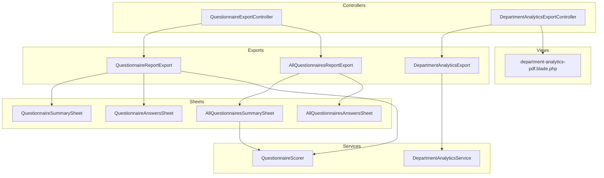

**Diagram sources**
- [AllQuestionnairesReportExport.php:10-24](file://app/Exports/AllQuestionnairesReportExport.php#L10-L24)
- [QuestionnaireReportExport.php:11-28](file://app/Exports/QuestionnaireReportExport.php#L11-L28)
- [DepartmentAnalyticsExport.php:9-50](file://app/Exports/DepartmentAnalyticsExport.php#L9-L50)
- [AllQuestionnairesAnswersSheet.php:10-86](file://app/Exports/Sheets/AllQuestionnairesAnswersSheet.php#L10-L86)
- [AllQuestionnairesSummarySheet.php:11-75](file://app/Exports/Sheets/AllQuestionnairesSummarySheet.php#L11-L75)
- [QuestionnaireAnswersSheet.php:11-91](file://app/Exports/Sheets/QuestionnaireAnswersSheet.php#L11-L91)
- [QuestionnaireSummarySheet.php:10-77](file://app/Exports/Sheets/QuestionnaireSummarySheet.php#L10-L77)
- [QuestionnaireExportController.php:13-39](file://app/Http/Controllers/Admin/QuestionnaireExportController.php#L13-L39)
- [DepartmentAnalyticsExportController.php:13-63](file://app/Http/Controllers/Admin/DepartmentAnalyticsExportController.php#L13-L63)
- [DepartmentAnalyticsService.php:12-95](file://app/Services/DepartmentAnalyticsService.php#L12-L95)
- [QuestionnaireScorer.php:12-139](file://app/Services/QuestionnaireScorer.php#L12-L139)
- [department-analytics-pdf.blade.php](file://resources/views/admin/exports/department-analytics-pdf.blade.php)

**Section sources**
- [AllQuestionnairesReportExport.php:10-24](file://app/Exports/AllQuestionnairesReportExport.php#L10-L24)
- [QuestionnaireReportExport.php:11-28](file://app/Exports/QuestionnaireReportExport.php#L11-L28)
- [DepartmentAnalyticsExport.php:9-50](file://app/Exports/DepartmentAnalyticsExport.php#L9-L50)
- [QuestionnaireExportController.php:13-39](file://app/Http/Controllers/Admin/QuestionnaireExportController.php#L13-L39)
- [DepartmentAnalyticsExportController.php:13-63](file://app/Http/Controllers/Admin/DepartmentAnalyticsExportController.php#L13-L63)

## Core Components
- AllQuestionnairesReportExport: Multi-sheet export containing summary and answers for all questionnaires.
- QuestionnaireReportExport: Multi-sheet export for a single questionnaire’s summary and answers.
- DepartmentAnalyticsExport: Single-sheet export of department analytics using array and headings concerns.
- Sheet implementations:
  - AllQuestionnairesSummarySheet and AllQuestionnairesAnswersSheet: Per-questionnaire analytics and full answer dataset.
  - QuestionnaireSummarySheet and QuestionnaireAnswersSheet: Single-questionnaire analytics and answer dataset.
- Controllers:
  - QuestionnaireExportController: Triggers exports for individual and all questionnaires.
  - DepartmentAnalyticsExportController: Provides Excel and HTML/PDF-like output for department analytics.
- Services:
  - QuestionnaireScorer: Computes averages, distributions, and breakdowns for questionnaires.
  - DepartmentAnalyticsService: Aggregates department-level metrics and paginates results.

**Section sources**
- [AllQuestionnairesReportExport.php:10-24](file://app/Exports/AllQuestionnairesReportExport.php#L10-L24)
- [QuestionnaireReportExport.php:11-28](file://app/Exports/QuestionnaireReportExport.php#L11-L28)
- [DepartmentAnalyticsExport.php:9-50](file://app/Exports/DepartmentAnalyticsExport.php#L9-L50)
- [AllQuestionnairesAnswersSheet.php:10-86](file://app/Exports/Sheets/AllQuestionnairesAnswersSheet.php#L10-L86)
- [AllQuestionnairesSummarySheet.php:11-75](file://app/Exports/Sheets/AllQuestionnairesSummarySheet.php#L11-L75)
- [QuestionnaireAnswersSheet.php:11-91](file://app/Exports/Sheets/QuestionnaireAnswersSheet.php#L11-L91)
- [QuestionnaireSummarySheet.php:10-77](file://app/Exports/Sheets/QuestionnaireSummarySheet.php#L10-L77)
- [QuestionnaireExportController.php:13-39](file://app/Http/Controllers/Admin/QuestionnaireExportController.php#L13-L39)
- [DepartmentAnalyticsExportController.php:13-63](file://app/Http/Controllers/Admin/DepartmentAnalyticsExportController.php#L13-L63)
- [DepartmentAnalyticsService.php:12-95](file://app/Services/DepartmentAnalyticsService.php#L12-L95)
- [QuestionnaireScorer.php:12-139](file://app/Services/QuestionnaireScorer.php#L12-L139)

## Architecture Overview
The export pipeline follows a layered pattern:
- Controllers receive requests and build export instances.
- Exports define one or more sheets.
- Sheets fetch data via Eloquent queries and transform it into arrays.
- Services compute analytics used by summary sheets.
- Excel downloads are handled via Maatwebsite Excel; PDF-like HTML output is rendered via Blade.

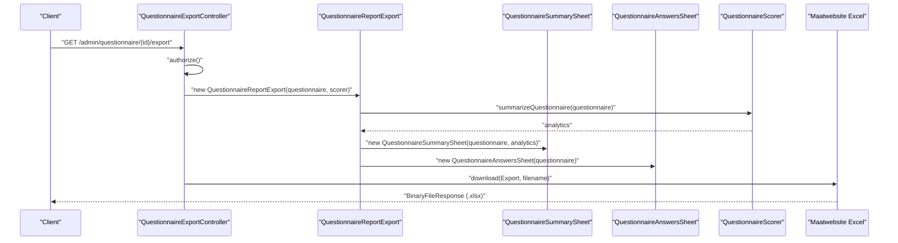

**Diagram sources**
- [QuestionnaireExportController.php:15-25](file://app/Http/Controllers/Admin/QuestionnaireExportController.php#L15-L25)
- [QuestionnaireReportExport.php:19-27](file://app/Exports/QuestionnaireReportExport.php#L19-L27)
- [QuestionnaireSummarySheet.php:20-62](file://app/Exports/Sheets/QuestionnaireSummarySheet.php#L20-L62)
- [QuestionnaireAnswersSheet.php:11-91](file://app/Exports/Sheets/QuestionnaireAnswersSheet.php#L11-L91)
- [QuestionnaireScorer.php:33-112](file://app/Services/QuestionnaireScorer.php#L33-L112)

## Detailed Component Analysis

### Export Classes

#### AllQuestionnairesReportExport
- Purpose: Generates a multi-sheet workbook for all questionnaires.
- Sheets:
  - AllQuestionnairesSummarySheet: Per-questionnaire averages and counts.
  - AllQuestionnairesAnswersSheet: Full flattened answer dataset across all responses.
- Dependencies: QuestionnaireScorer for analytics.

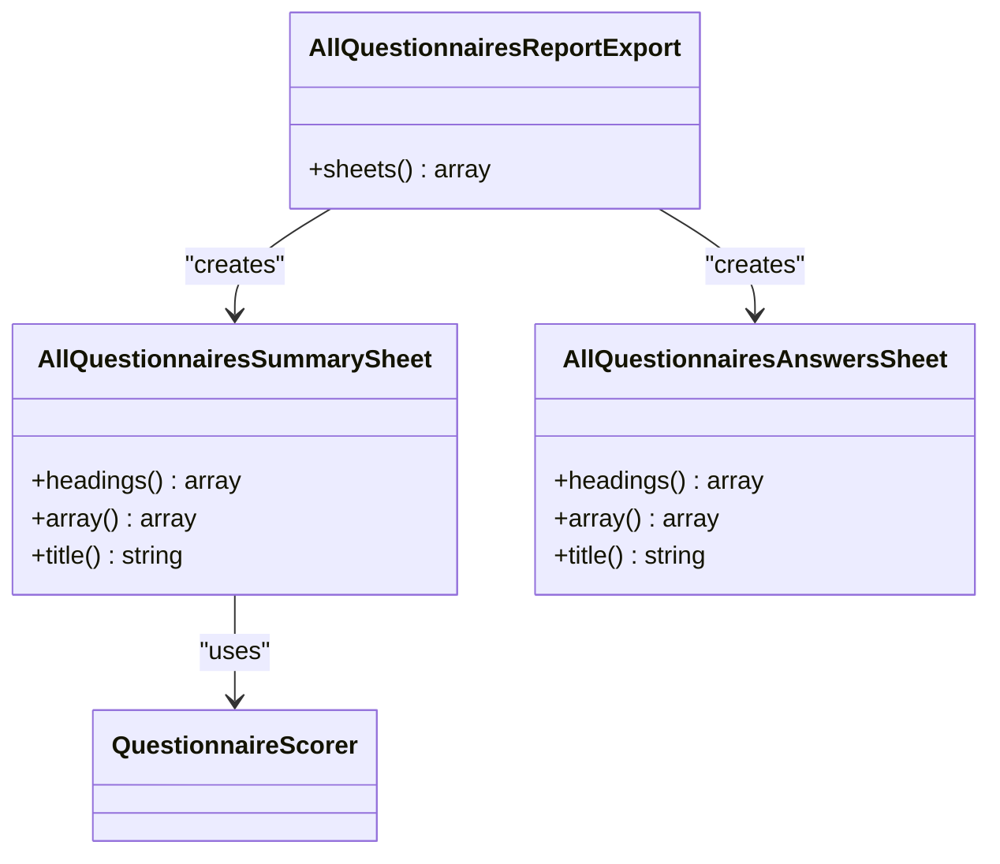

**Diagram sources**
- [AllQuestionnairesReportExport.php:10-24](file://app/Exports/AllQuestionnairesReportExport.php#L10-L24)
- [AllQuestionnairesSummarySheet.php:11-75](file://app/Exports/Sheets/AllQuestionnairesSummarySheet.php#L11-L75)
- [AllQuestionnairesAnswersSheet.php:10-86](file://app/Exports/Sheets/AllQuestionnairesAnswersSheet.php#L10-L86)
- [QuestionnaireScorer.php:12-139](file://app/Services/QuestionnaireScorer.php#L12-L139)

**Section sources**
- [AllQuestionnairesReportExport.php:10-24](file://app/Exports/AllQuestionnairesReportExport.php#L10-L24)

#### QuestionnaireReportExport
- Purpose: Generates a multi-sheet workbook for a single questionnaire.
- Sheets:
  - QuestionnaireSummarySheet: Overall averages, per-group averages, and counts.
  - QuestionnaireAnswersSheet: Full answer dataset for the selected questionnaire.
- Dependencies: QuestionnaireScorer for analytics.

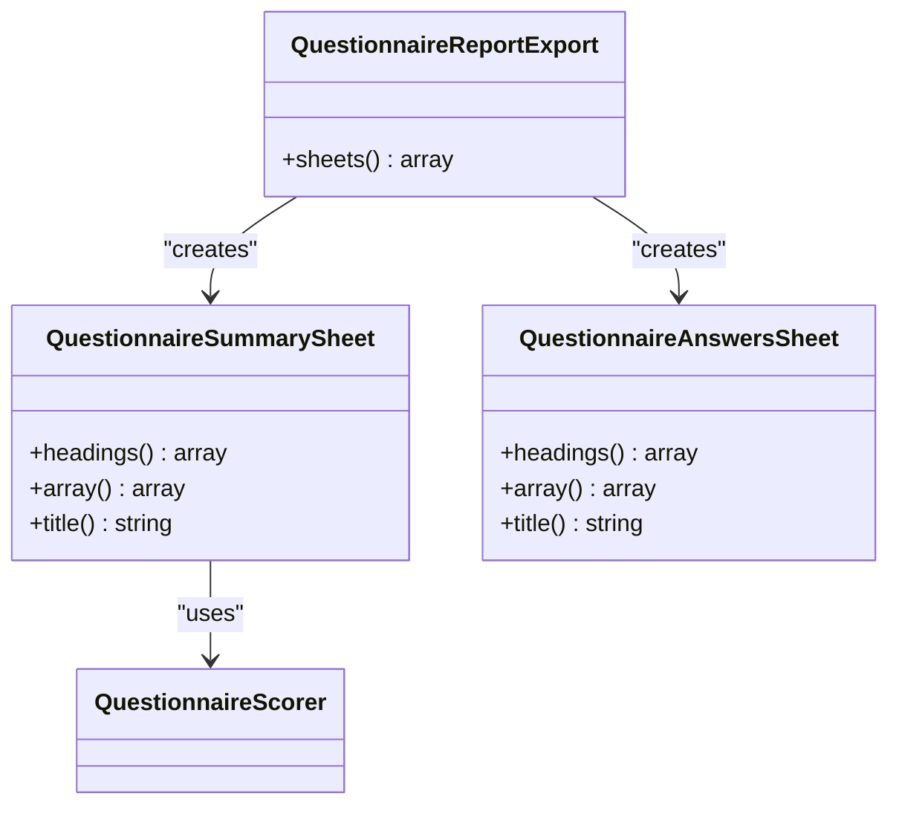

**Diagram sources**
- [QuestionnaireReportExport.php:11-28](file://app/Exports/QuestionnaireReportExport.php#L11-L28)
- [QuestionnaireSummarySheet.php:10-77](file://app/Exports/Sheets/QuestionnaireSummarySheet.php#L10-L77)
- [QuestionnaireAnswersSheet.php:11-91](file://app/Exports/Sheets/QuestionnaireAnswersSheet.php#L11-L91)
- [QuestionnaireScorer.php:12-139](file://app/Services/QuestionnaireScorer.php#L12-L139)

**Section sources**
- [QuestionnaireReportExport.php:11-28](file://app/Exports/QuestionnaireReportExport.php#L11-L28)

#### DepartmentAnalyticsExport
- Purpose: Produces a single-sheet Excel export of department analytics.
- Data source: DepartmentAnalyticsService summarize method.
- Headings: Localized column names for department name, respondents, participation rate, and average score.
- Pagination: Uses paginator to limit rows per page.

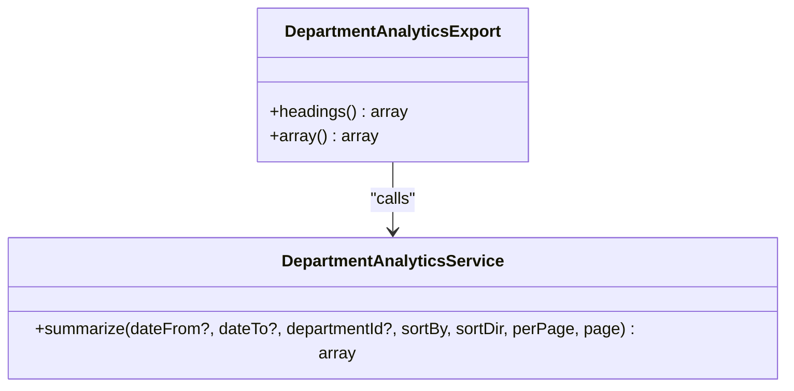

**Diagram sources**
- [DepartmentAnalyticsExport.php:9-50](file://app/Exports/DepartmentAnalyticsExport.php#L9-L50)
- [DepartmentAnalyticsService.php:20-95](file://app/Services/DepartmentAnalyticsService.php#L20-L95)

**Section sources**
- [DepartmentAnalyticsExport.php:9-50](file://app/Exports/DepartmentAnalyticsExport.php#L9-L50)

### Sheet Implementations

#### AllQuestionnairesSummarySheet
- Headings: Includes questionnaire metadata, overall average, generated timestamp, and dynamic columns for each role slug.
- Data: Iterates all questionnaires, computes analytics via QuestionnaireScorer, and builds rows with averages and respondent counts per group.
- Dynamic columns: Columns named avg_{slug} and respondent_{slug} derived from configured role slugs.

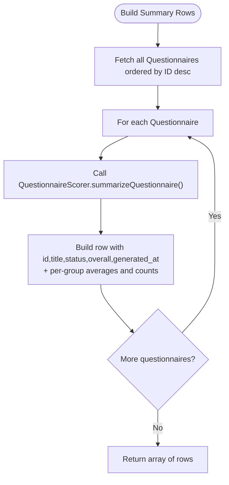

**Diagram sources**
- [AllQuestionnairesSummarySheet.php:36-60](file://app/Exports/Sheets/AllQuestionnairesSummarySheet.php#L36-L60)
- [QuestionnaireScorer.php:33-112](file://app/Services/QuestionnaireScorer.php#L33-L112)

**Section sources**
- [AllQuestionnairesSummarySheet.php:18-60](file://app/Exports/Sheets/AllQuestionnairesSummarySheet.php#L18-L60)

#### AllQuestionnairesAnswersSheet
- Headings: Comprehensive answer-level fields including questionnaire identifiers, response metadata, question text/type, option text/score, essay answer, and calculated score.
- Data: Joins answers, responses, questionnaires, users, questions, and answer options; filters for submitted responses; orders by response ID and question order; maps to arrays.

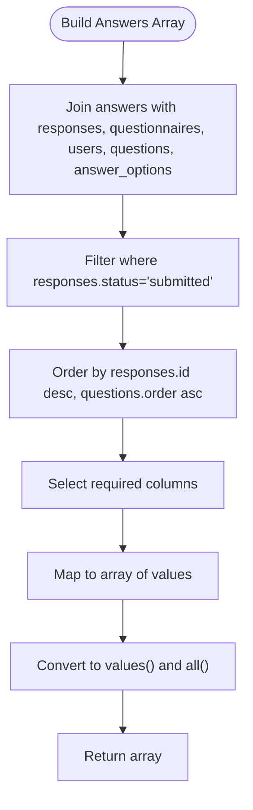

**Diagram sources**
- [AllQuestionnairesAnswersSheet.php:33-80](file://app/Exports/Sheets/AllQuestionnairesAnswersSheet.php#L33-L80)

**Section sources**
- [AllQuestionnairesAnswersSheet.php:12-80](file://app/Exports/Sheets/AllQuestionnairesAnswersSheet.php#L12-L80)

#### QuestionnaireSummarySheet
- Headings: Similar to AllQuestionnairesSummarySheet but for a single questionnaire, plus question count and generated timestamp.
- Data: Uses precomputed analytics to build a single-row summary.

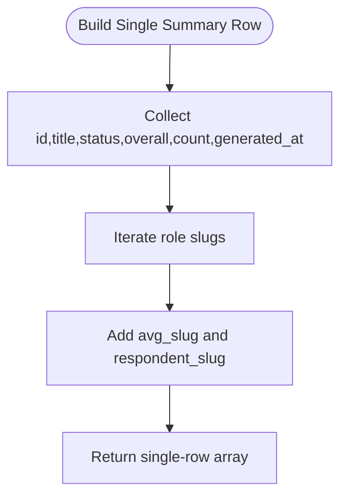

**Diagram sources**
- [QuestionnaireSummarySheet.php:45-62](file://app/Exports/Sheets/QuestionnaireSummarySheet.php#L45-L62)

**Section sources**
- [QuestionnaireSummarySheet.php:26-62](file://app/Exports/Sheets/QuestionnaireSummarySheet.php#L26-L62)

#### QuestionnaireAnswersSheet
- Headings: Same as AllQuestionnairesAnswersSheet but scoped to a single questionnaire.
- Data: Filters by questionnaire ID and joins similarly; orders by response ID and question order.

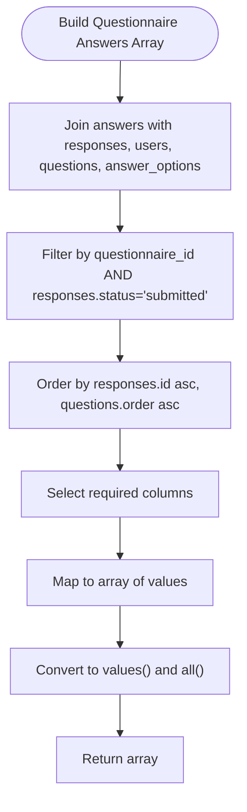

**Diagram sources**
- [QuestionnaireAnswersSheet.php:39-84](file://app/Exports/Sheets/QuestionnaireAnswersSheet.php#L39-L84)

**Section sources**
- [QuestionnaireAnswersSheet.php:18-84](file://app/Exports/Sheets/QuestionnaireAnswersSheet.php#L18-L84)

### Controller Integration

#### QuestionnaireExportController
- Methods:
  - questionnaire(Questionnaire): Exports a single questionnaire report.
  - all(): Exports all questionnaires report.
- Authorization: Uses policy checks for viewing questionnaires.
- Download: Uses Excel::download with appropriate filenames.

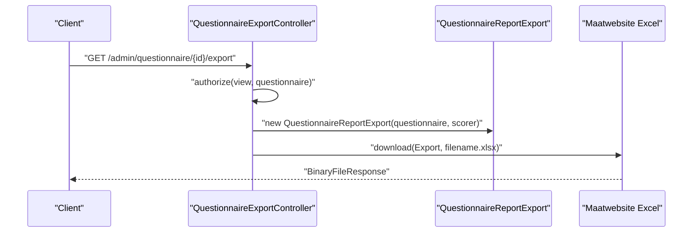

**Diagram sources**
- [QuestionnaireExportController.php:15-25](file://app/Http/Controllers/Admin/QuestionnaireExportController.php#L15-L25)

**Section sources**
- [QuestionnaireExportController.php:13-39](file://app/Http/Controllers/Admin/QuestionnaireExportController.php#L13-L39)

#### DepartmentAnalyticsExportController
- Methods:
  - excel(Request): Exports department analytics as Excel.
  - pdf(Request): Renders department analytics as HTML/PDF-like output using a Blade template.
- Authorization: Requires admin role.
- Filename: Timestamped .xlsx for Excel; HTML filename for PDF-like output.

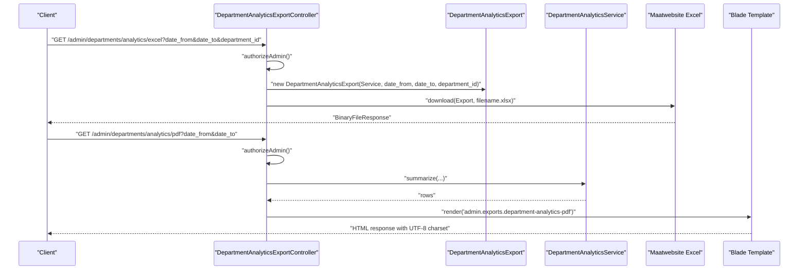

**Diagram sources**
- [DepartmentAnalyticsExportController.php:15-56](file://app/Http/Controllers/Admin/DepartmentAnalyticsExportController.php#L15-L56)
- [DepartmentAnalyticsExport.php:29-49](file://app/Exports/DepartmentAnalyticsExport.php#L29-L49)
- [DepartmentAnalyticsService.php:20-95](file://app/Services/DepartmentAnalyticsService.php#L20-L95)
- [department-analytics-pdf.blade.php](file://resources/views/admin/exports/department-analytics-pdf.blade.php)

**Section sources**
- [DepartmentAnalyticsExportController.php:13-63](file://app/Http/Controllers/Admin/DepartmentAnalyticsExportController.php#L13-L63)

### Data Transformation and Styling
- Data transformation:
  - Eloquent queries join related tables and select computed/aggregated columns.
  - Collections are mapped to arrays with explicit casting to string/int/float for consistent types.
  - Pagination is applied for large datasets in DepartmentAnalyticsService.
- Styling:
  - WithTitle is used to set sheet names.
  - WithHeadings defines column headers.
  - Additional styling can be applied via Maatwebsite Excel features (e.g., styles, auto-size columns) by extending the sheet classes or configuring the library globally.

**Section sources**
- [AllQuestionnairesAnswersSheet.php:33-80](file://app/Exports/Sheets/AllQuestionnairesAnswersSheet.php#L33-L80)
- [AllQuestionnairesSummarySheet.php:36-60](file://app/Exports/Sheets/AllQuestionnairesSummarySheet.php#L36-L60)
- [QuestionnaireAnswersSheet.php:39-84](file://app/Exports/Sheets/QuestionnaireAnswersSheet.php#L39-L84)
- [QuestionnaireSummarySheet.php:45-62](file://app/Exports/Sheets/QuestionnaireSummarySheet.php#L45-L62)
- [DepartmentAnalyticsExport.php:29-49](file://app/Exports/DepartmentAnalyticsExport.php#L29-L49)

## Dependency Analysis
- Coupling:
  - Exports depend on services for analytics computation.
  - Sheets depend on models and services for data retrieval.
  - Controllers orchestrate exports and enforce authorization.
- Cohesion:
  - Each export class encapsulates a cohesive reporting unit.
  - Sheets focus on a single data presentation format.
- External dependencies:
  - Maatwebsite Excel for Excel generation and downloads.
  - Blade for PDF-like HTML rendering.

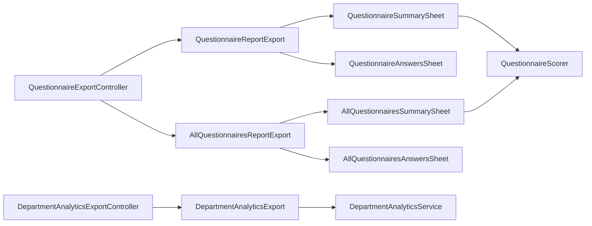

**Diagram sources**
- [QuestionnaireExportController.php:13-39](file://app/Http/Controllers/Admin/QuestionnaireExportController.php#L13-L39)
- [AllQuestionnairesReportExport.php:10-24](file://app/Exports/AllQuestionnairesReportExport.php#L10-L24)
- [QuestionnaireReportExport.php:11-28](file://app/Exports/QuestionnaireReportExport.php#L11-L28)
- [AllQuestionnairesSummarySheet.php:11-75](file://app/Exports/Sheets/AllQuestionnairesSummarySheet.php#L11-L75)
- [AllQuestionnairesAnswersSheet.php:10-86](file://app/Exports/Sheets/AllQuestionnairesAnswersSheet.php#L10-L86)
- [QuestionnaireSummarySheet.php:10-77](file://app/Exports/Sheets/QuestionnaireSummarySheet.php#L10-L77)
- [QuestionnaireAnswersSheet.php:11-91](file://app/Exports/Sheets/QuestionnaireAnswersSheet.php#L11-L91)
- [DepartmentAnalyticsExport.php:9-50](file://app/Exports/DepartmentAnalyticsExport.php#L9-L50)
- [DepartmentAnalyticsExportController.php:13-63](file://app/Http/Controllers/Admin/DepartmentAnalyticsExportController.php#L13-L63)
- [QuestionnaireScorer.php:12-139](file://app/Services/QuestionnaireScorer.php#L12-L139)
- [DepartmentAnalyticsService.php:12-95](file://app/Services/DepartmentAnalyticsService.php#L12-L95)

**Section sources**
- [QuestionnaireScorer.php:12-139](file://app/Services/QuestionnaireScorer.php#L12-L139)
- [DepartmentAnalyticsService.php:12-95](file://app/Services/DepartmentAnalyticsService.php#L12-L95)

## Performance Considerations
- Large datasets:
  - Use pagination in services (as seen in DepartmentAnalyticsService) to limit rows per page.
  - Prefer indexed columns in joins and filters (e.g., responses.status, responses.user_id, responses.questionnaire_id).
  - Minimize N+1 queries by eager-loading related data where applicable.
- Memory efficiency:
  - Stream large exports using chunked reads or generator-based approaches if needed.
  - Avoid loading unnecessary columns; select only required fields.
- Caching:
  - Leverage caching for repeated analytics computations (as demonstrated in DepartmentAnalyticsService summarizeRolesByDepartment).
- Export scheduling:
  - Integrate with Laravel Queues to process exports asynchronously and send notifications upon completion.
  - Use scheduled jobs to generate periodic reports and store them in cloud storage for download.

[No sources needed since this section provides general guidance]

## Troubleshooting Guide
- Permission denied:
  - Ensure the user has required roles or policies (admin for analytics PDF/Excel; view/viewAny for questionnaire exports).
- Empty or missing data:
  - Verify filters such as status='submitted' and date ranges.
  - Confirm that questionnaire target slugs are configured for summary columns.
- Encoding issues:
  - For CSV/PDF-like HTML, ensure UTF-8 charset is set in headers.
- Slow exports:
  - Apply pagination, add database indexes, and consider asynchronous processing.

**Section sources**
- [DepartmentAnalyticsExportController.php:58-61](file://app/Http/Controllers/Admin/DepartmentAnalyticsExportController.php#L58-L61)
- [QuestionnaireExportController.php:17-18](file://app/Http/Controllers/Admin/QuestionnaireExportController.php#L17-L18)
- [DepartmentAnalyticsExportController.php:52-55](file://app/Http/Controllers/Admin/DepartmentAnalyticsExportController.php#L52-L55)

## Conclusion
The export system provides robust, modular reporting for questionnaires and departments. Exports leverage services for analytics, sheets for structured data presentation, and controllers for secure, authorized downloads. With pagination, caching, and asynchronous processing, the system scales to large datasets while maintaining clarity and maintainability.

[No sources needed since this section summarizes without analyzing specific files]

## Appendices

### File Format Specifications and Encoding
- Excel (.xlsx):
  - Generated via Maatwebsite Excel; supports multiple sheets.
  - Filenames include timestamps for uniqueness.
- PDF-like HTML:
  - Rendered via Blade template with UTF-8 charset and inline disposition.

**Section sources**
- [DepartmentAnalyticsExportController.php:19-29](file://app/Http/Controllers/Admin/DepartmentAnalyticsExportController.php#L19-L29)
- [DepartmentAnalyticsExportController.php:52-55](file://app/Http/Controllers/Admin/DepartmentAnalyticsExportController.php#L52-L55)

### Examples of Custom Export Configurations
- Custom date range filtering:
  - Pass date_from and date_to to DepartmentAnalyticsExport and controllers.
- Department-scoped analytics:
  - Supply department_id to filter results.
- Single-questionnaire export:
  - Use QuestionnaireExportController::questionnaire with a specific questionnaire ID.

**Section sources**
- [DepartmentAnalyticsExport.php:11-16](file://app/Exports/DepartmentAnalyticsExport.php#L11-L16)
- [DepartmentAnalyticsExportController.php:24-26](file://app/Http/Controllers/Admin/DepartmentAnalyticsExportController.php#L24-L26)
- [QuestionnaireExportController.php:15-24](file://app/Http/Controllers/Admin/QuestionnaireExportController.php#L15-L24)

### Bulk Export Processing
- AllQuestionnairesReportExport:
  - Iterates all questionnaires and aggregates analytics per sheet.
- DepartmentAnalyticsExport:
  - Paginates results to manage memory and improve responsiveness.

**Section sources**
- [AllQuestionnairesReportExport.php:17-23](file://app/Exports/AllQuestionnairesReportExport.php#L17-L23)
- [DepartmentAnalyticsExport.php:29-49](file://app/Exports/DepartmentAnalyticsExport.php#L29-L49)

### Performance Optimization for Large Datasets
- Use pagination in services.
- Cache repeated analytics computations.
- Stream or chunk exports for very large datasets.
- Schedule exports via queues and store artifacts for later retrieval.

**Section sources**
- [DepartmentAnalyticsService.php:114-189](file://app/Services/DepartmentAnalyticsService.php#L114-L189)
- [DepartmentAnalyticsService.php:261-277](file://app/Services/DepartmentAnalyticsService.php#L261-L277)