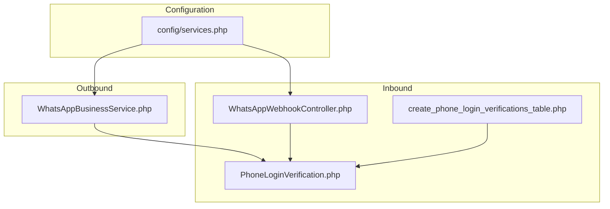
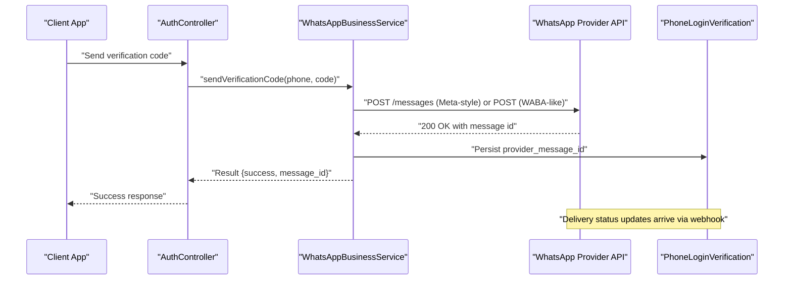
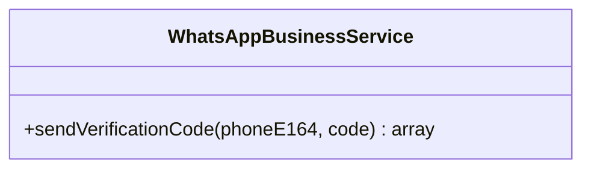
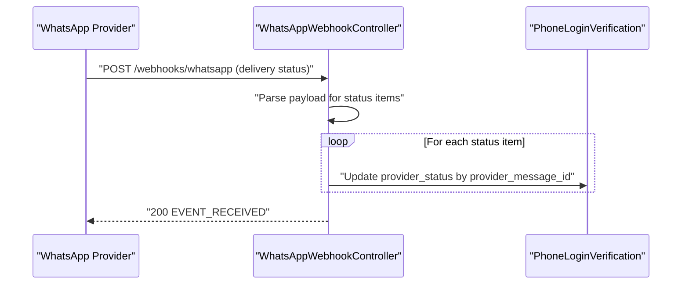
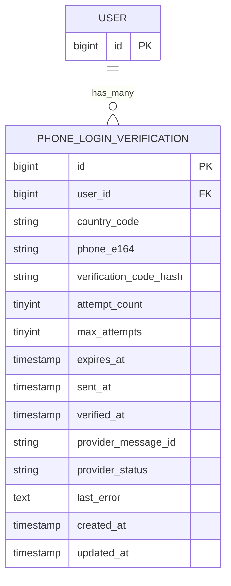
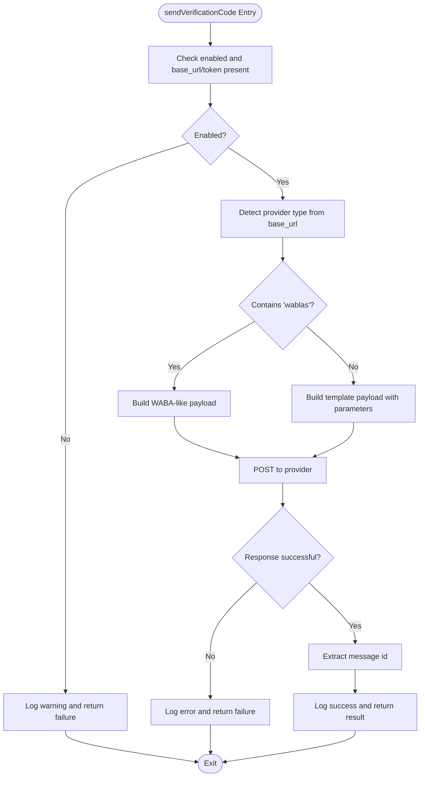
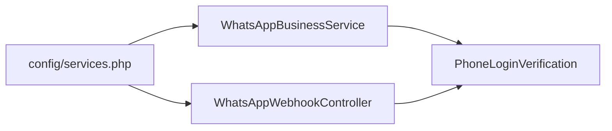

# Messaging Services

<cite>
**Referenced Files in This Document**
- [WhatsAppBusinessService.php](file://app/Services/WhatsAppBusinessService.php)
- [WhatsAppWebhookController.php](file://app/Http/Controllers/Auth/WhatsAppWebhookController.php)
- [services.php](file://config/services.php)
- [PhoneLoginVerification.php](file://app/Models/PhoneLoginVerification.php)
- [2026_04_17_045745_create_phone_login_verifications_table.php](file://database/migrations/2026_04_17_045745_create_phone_login_verifications_table.php)
- [AuthController.php](file://app/Http/Controllers/Auth/AuthController.php)
- [app.php](file://bootstrap/app.php)
</cite>

## Table of Contents
1. [Introduction](#introduction)
2. [Project Structure](#project-structure)
3. [Core Components](#core-components)
4. [Architecture Overview](#architecture-overview)
5. [Detailed Component Analysis](#detailed-component-analysis)
6. [Dependency Analysis](#dependency-analysis)
7. [Performance Considerations](#performance-considerations)
8. [Troubleshooting Guide](#troubleshooting-guide)
9. [Conclusion](#conclusion)
10. [Appendices](#appendices)

## Introduction
This document explains the messaging services focused on WhatsApp Business integration, including outbound message sending via template-based messages, webhook-based delivery status tracking, configuration and authentication, and operational guidance for reliability and compliance. It covers the WhatsAppBusinessService, the webhook controller, message templates, and supporting models and configuration.

## Project Structure
The messaging functionality centers around:
- A service class responsible for sending verification messages using either a WhatsApp Business-compatible provider or a WABA-like provider.
- A webhook controller that validates subscription handshakes and updates delivery statuses from inbound events.
- Configuration entries for enabling/disabling the service and supplying credentials.
- A model and migration for persisting verification records and provider message identifiers and statuses.

**Diagram sources**
- [services.php:38-51](file://config/services.php#L38-L51)
- [WhatsAppBusinessService.php:13-97](file://app/Services/WhatsAppBusinessService.php#L13-L97)
- [WhatsAppWebhookController.php:13-53](file://app/Http/Controllers/Auth/WhatsAppWebhookController.php#L13-L53)
- [PhoneLoginVerification.php:10-29](file://app/Models/PhoneLoginVerification.php#L10-L29)
- [2026_04_17_045745_create_phone_login_verifications_table.php:14-29](file://database/migrations/2026_04_17_045745_create_phone_login_verifications_table.php#L14-L29)

**Section sources**
- [services.php:38-51](file://config/services.php#L38-L51)
- [WhatsAppBusinessService.php:13-97](file://app/Services/WhatsAppBusinessService.php#L13-L97)
- [WhatsAppWebhookController.php:13-53](file://app/Http/Controllers/Auth/WhatsAppWebhookController.php#L13-L53)
- [PhoneLoginVerification.php:10-29](file://app/Models/PhoneLoginVerification.php#L10-L29)
- [2026_04_17_045745_create_phone_login_verifications_table.php:14-29](file://database/migrations/2026_04_17_045745_create_phone_login_verifications_table.php#L14-L29)

## Core Components
- WhatsAppBusinessService: Sends verification codes via template messages to E.164 phone numbers. Supports two provider modes:
  - Meta-style WhatsApp Business API (via configured base URL and access token).
  - WABA-like provider (e.g., wablas) using a simpler JSON payload and Authorization header.
- WhatsAppWebhookController: Handles GET verification handshake and POST delivery status updates. Updates local records with provider message IDs and statuses.
- Configuration: Centralized credentials and toggles for enabling the service and selecting provider-specific endpoints and tokens.
- Persistence: PhoneLoginVerification model and migration track sent messages, provider message IDs, and delivery statuses.

**Section sources**
- [WhatsAppBusinessService.php:13-97](file://app/Services/WhatsAppBusinessService.php#L13-L97)
- [WhatsAppWebhookController.php:13-53](file://app/Http/Controllers/Auth/WhatsAppWebhookController.php#L13-L53)
- [services.php:38-51](file://config/services.php#L38-L51)
- [PhoneLoginVerification.php:10-29](file://app/Models/PhoneLoginVerification.php#L10-L29)
- [2026_04_17_045745_create_phone_login_verifications_table.php:14-29](file://database/migrations/2026_04_17_045745_create_phone_login_verifications_table.php#L14-L29)

## Architecture Overview
The messaging pipeline integrates outbound sending and inbound status reporting:

**Diagram sources**
- [AuthController.php](file://app/Http/Controllers/Auth/AuthController.php)
- [WhatsAppBusinessService.php:13-97](file://app/Services/WhatsAppBusinessService.php#L13-L97)
- [PhoneLoginVerification.php:10-29](file://app/Models/PhoneLoginVerification.php#L10-L29)

## Detailed Component Analysis

### WhatsAppBusinessService
Responsibilities:
- Validate configuration and readiness.
- Choose provider mode based on base URL.
- Build and send template-based messages to E.164 numbers.
- Extract and log message IDs for later status tracking.
- Return structured results with success, message ID, and error details.

Key behaviors:
- Provider detection: If the base URL contains a specific substring indicating a WABA-like provider, send a simplified payload; otherwise, use the Meta-style template API.
- Template parameters: Passes verification code and expiry text as template body parameters.
- Error handling: Logs failures with status and response body; returns user-friendly error messages when applicable.
- Timeout: Uses a short timeout for outbound requests to avoid blocking.

Operational notes:
- Authentication: Uses an access token for Meta-style APIs; uses Authorization header for WABA-like providers.
- Endpoint customization: Allows overriding the messages endpoint for Meta-style providers.
- Fallback configuration: Falls back to legacy configuration keys if primary keys are empty.

**Section sources**
- [WhatsAppBusinessService.php:13-97](file://app/Services/WhatsAppBusinessService.php#L13-L97)

#### Class Diagram

**Diagram sources**
- [WhatsAppBusinessService.php:8-98](file://app/Services/WhatsAppBusinessService.php#L8-L98)

### WhatsAppWebhookController
Responsibilities:
- Verify webhook subscription via GET handshake using a verify token from configuration.
- Process POST delivery status updates by iterating over status items and updating local records with provider statuses.

Processing logic:
- GET verification: Validates mode equals subscribe and compare the provided verify token against the configured token.
- POST status updates: Parses incoming payload to extract message IDs and statuses, then updates the corresponding verification record.

Security:
- Uses a constant-time comparison to validate the verify token.

**Section sources**
- [WhatsAppWebhookController.php:13-53](file://app/Http/Controllers/Auth/WhatsAppWebhookController.php#L13-L53)

#### Sequence Diagram: Webhook Delivery Status Update

**Diagram sources**
- [WhatsAppWebhookController.php:19-32](file://app/Http/Controllers/Auth/WhatsAppWebhookController.php#L19-L32)
- [PhoneLoginVerification.php:20-22](file://app/Models/PhoneLoginVerification.php#L20-L22)
- [app.php:30](file://bootstrap/app.php#L30)

### Configuration and Authentication
Configuration keys:
- Enable/disable service and set base URLs for both legacy and business variants.
- Access tokens and template names for business-style providers.
- Webhook verify token for handshake validation.

Authentication:
- Meta-style: Bearer token via Authorization header.
- WABA-like: Authorization header with token value.

**Section sources**
- [services.php:38-51](file://config/services.php#L38-L51)
- [WhatsAppBusinessService.php:15-26](file://app/Services/WhatsAppBusinessService.php#L15-L26)
- [WhatsAppWebhookController.php:42-53](file://app/Http/Controllers/Auth/WhatsAppWebhookController.php#L42-L53)

### Message Persistence and Tracking
Model fields:
- Identifiers: user association, country code, phone E.164, verification code hash.
- Lifecycle: attempt counts, expiration, sent/verified timestamps.
- Provider integration: provider message ID and status, last error.

Migration highlights:
- Indexed provider message ID and status for efficient updates.
- Timestamps for lifecycle tracking.

**Section sources**
- [PhoneLoginVerification.php:10-29](file://app/Models/PhoneLoginVerification.php#L10-L29)
- [2026_04_17_045745_create_phone_login_verifications_table.php:14-29](file://database/migrations/2026_04_17_045745_create_phone_login_verifications_table.php#L14-L29)

#### Data Model Diagram

**Diagram sources**
- [PhoneLoginVerification.php:10-29](file://app/Models/PhoneLoginVerification.php#L10-L29)
- [2026_04_17_045745_create_phone_login_verifications_table.php:14-29](file://database/migrations/2026_04_17_045745_create_phone_login_verifications_table.php#L14-L29)

### Outbound Message Flow and Template Handling
- Template selection: Uses a configurable template name for Meta-style providers.
- Parameterization: Passes verification code and expiry as template body parameters.
- Provider differences: WABA-like provider uses a simpler JSON payload; Meta-style uses the template API.

**Section sources**
- [WhatsAppBusinessService.php:24-25](file://app/Services/WhatsAppBusinessService.php#L24-L25)
- [WhatsAppBusinessService.php:49-66](file://app/Services/WhatsAppBusinessService.php#L49-L66)

#### Flowchart: Outbound Send Decision

**Diagram sources**
- [WhatsAppBusinessService.php:28-35](file://app/Services/WhatsAppBusinessService.php#L28-L35)
- [WhatsAppBusinessService.php:37-73](file://app/Services/WhatsAppBusinessService.php#L37-L73)
- [WhatsAppBusinessService.php:75-96](file://app/Services/WhatsAppBusinessService.php#L75-L96)

### Webhook Endpoint Registration and Monitoring
- Endpoint registration: The route pattern for the webhook is defined in the application bootstrap configuration.
- Monitoring: The controller logs received events and returns a standard acknowledgment.

**Section sources**
- [app.php:30](file://bootstrap/app.php#L30)
- [WhatsAppWebhookController.php:34-39](file://app/Http/Controllers/Auth/WhatsAppWebhookController.php#L34-L39)

## Dependency Analysis
- Service depends on configuration for base URL, endpoint, access token, and template name.
- Webhook controller depends on configuration for verify token and interacts with the persistence layer.
- Persistence model encapsulates fields for provider message IDs and statuses.

**Diagram sources**
- [services.php:38-51](file://config/services.php#L38-L51)
- [WhatsAppBusinessService.php:15-26](file://app/Services/WhatsAppBusinessService.php#L15-L26)
- [WhatsAppWebhookController.php:42-53](file://app/Http/Controllers/Auth/WhatsAppWebhookController.php#L42-L53)
- [PhoneLoginVerification.php:10-29](file://app/Models/PhoneLoginVerification.php#L10-L29)

**Section sources**
- [services.php:38-51](file://config/services.php#L38-L51)
- [WhatsAppBusinessService.php:15-26](file://app/Services/WhatsAppBusinessService.php#L15-L26)
- [WhatsAppWebhookController.php:42-53](file://app/Http/Controllers/Auth/WhatsAppWebhookController.php#L42-L53)
- [PhoneLoginVerification.php:10-29](file://app/Models/PhoneLoginVerification.php#L10-L29)

## Performance Considerations
- Request timeouts: Outbound requests use a short timeout to prevent long blocking.
- Minimal payload: WABA-like provider uses a minimal JSON payload; Meta-style uses template parameters.
- Indexing: Database schema indexes provider message ID and status for efficient updates.
- Logging overhead: Ensure log levels are tuned appropriately in production to avoid excessive I/O.

[No sources needed since this section provides general guidance]

## Troubleshooting Guide
Common issues and resolutions:
- Service disabled or missing configuration: The service returns a failure result and logs a warning when the service is disabled or required configuration is missing.
- Invalid phone number: If the phone number normalization fails, outbound sends are skipped with a warning.
- Provider errors: Non-success responses are logged with status and body; the service returns a failure result with an error message.
- Webhook handshake failures: If the verify token does not match, the controller responds with a forbidden status.
- Status update anomalies: Ensure the provider message ID is present in the payload; otherwise, the controller skips updates.

Operational checks:
- Confirm configuration keys for base URL, access token, and template are set.
- Verify webhook verify token matches the configured value.
- Monitor logs for error categories such as verification send failures and webhook receive events.

**Section sources**
- [WhatsAppBusinessService.php:28-35](file://app/Services/WhatsAppBusinessService.php#L28-L35)
- [WhatsAppBusinessService.php:75-87](file://app/Services/WhatsAppBusinessService.php#L75-L87)
- [WhatsAppWebhookController.php:48-52](file://app/Http/Controllers/Auth/WhatsAppWebhookController.php#L48-L52)
- [WhatsAppWebhookController.php:34-39](file://app/Http/Controllers/Auth/WhatsAppWebhookController.php#L34-L39)

## Conclusion
The messaging services integrate a flexible provider-agnostic sender with robust webhook-driven status tracking. Configuration supports both Meta-style and WABA-like providers, while the model and migration provide reliable persistence for verification lifecycles. Proper configuration, logging, and monitoring are essential for reliable operation.

[No sources needed since this section summarizes without analyzing specific files]

## Appendices

### Configuration Reference
- Enable flags: Enablement booleans for legacy and business providers.
- Base URLs: Provider endpoints for sending messages.
- Tokens: Access tokens for authentication.
- Template: Name of the template used for verification messages.
- Webhook verify token: Token used during webhook handshake verification.

**Section sources**
- [services.php:38-51](file://config/services.php#L38-L51)

### Example Workflows
- Sending an automated verification notification:
  - Call the service method with a valid E.164 phone number and a generated code.
  - The service selects provider mode, builds the appropriate payload, and posts to the provider.
  - On success, the provider message ID is persisted for later status tracking.
- Handling user replies:
  - The current implementation focuses on delivery status updates; inbound replies would require additional webhook parsing and routing logic.
- Implementing conversation flows:
  - Use provider templates and interactive components; ensure state is tracked in the persistence layer and mapped to user sessions.

[No sources needed since this section provides general guidance]