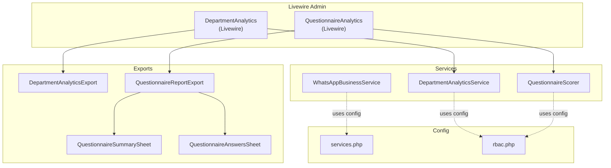
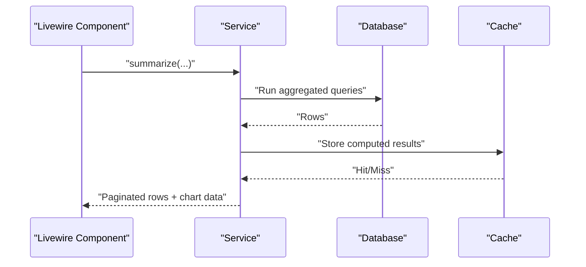
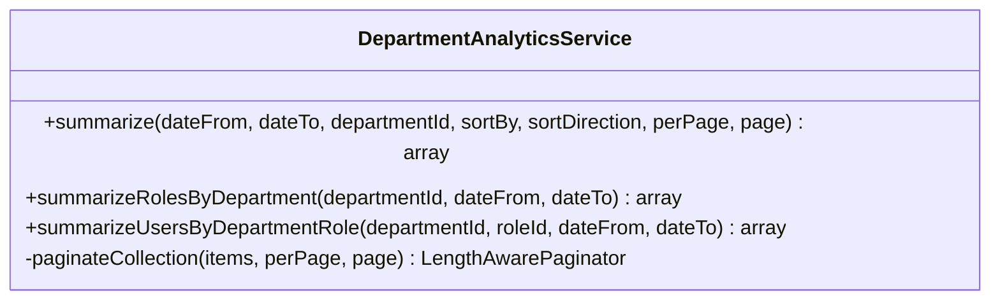
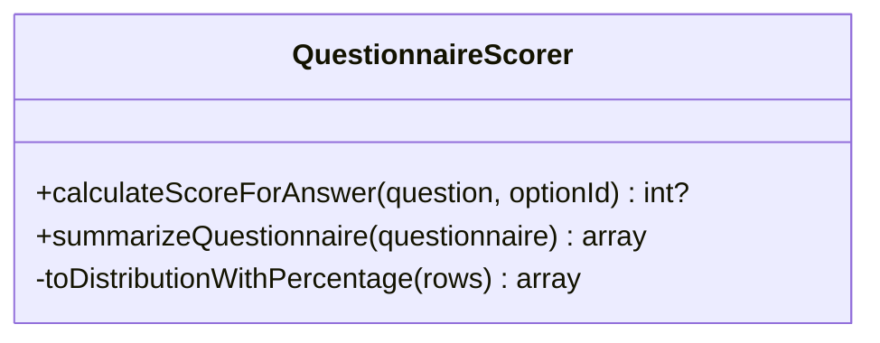
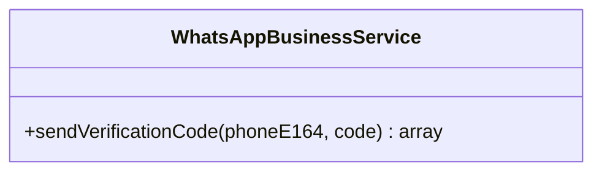
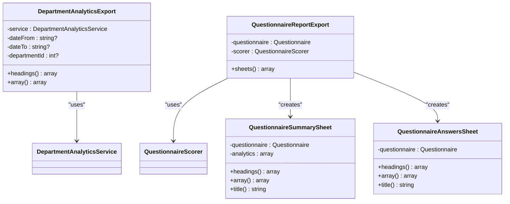
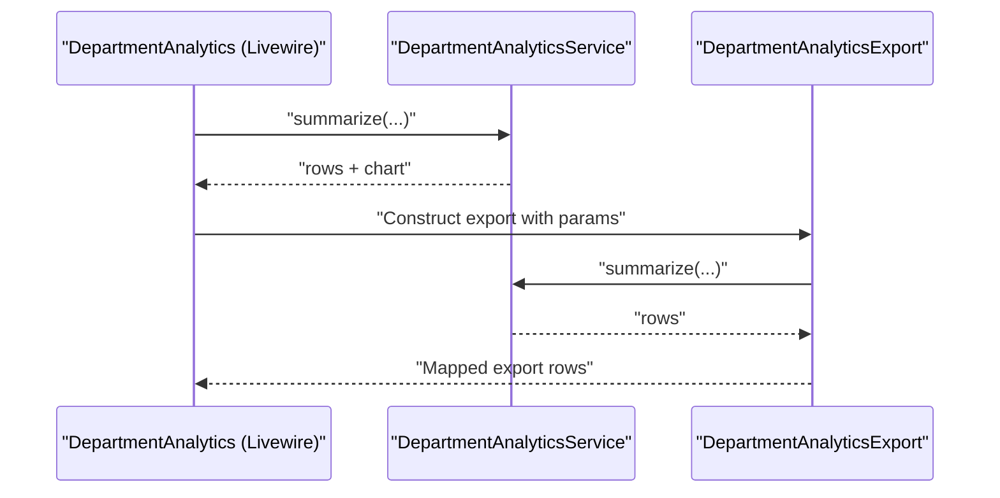
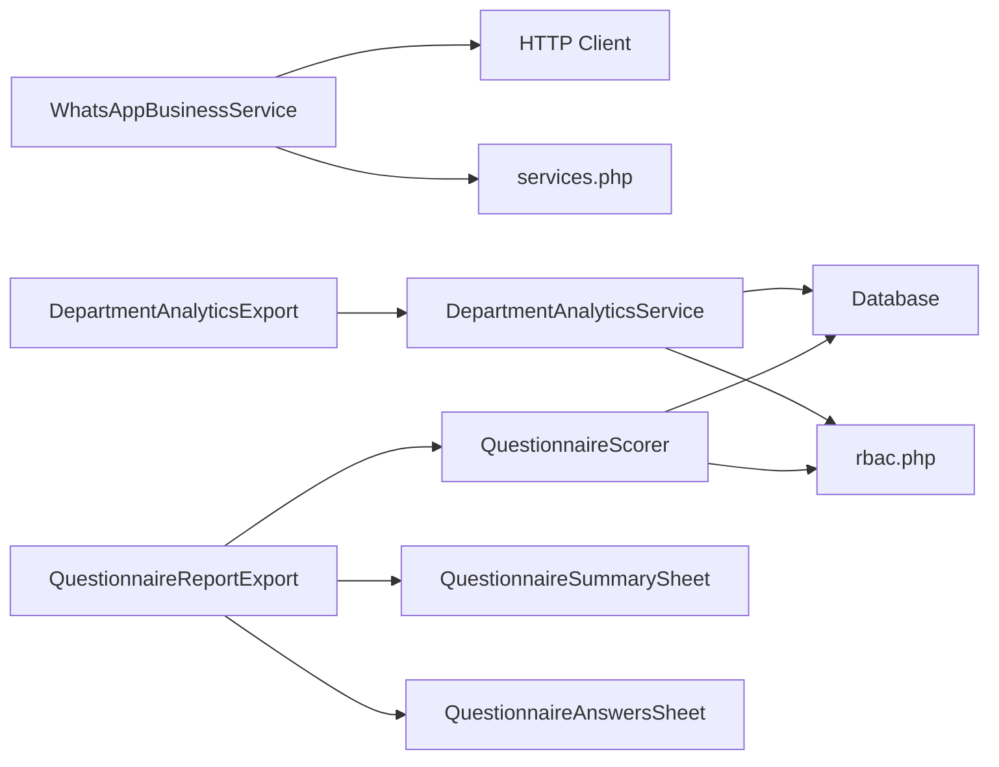

# Services & Utilities

<cite>
**Referenced Files in This Document**
- [DepartmentAnalyticsService.php](file://app/Services/DepartmentAnalyticsService.php)
- [QuestionnaireScorer.php](file://app/Services/QuestionnaireScorer.php)
- [WhatsAppBusinessService.php](file://app/Services/WhatsAppBusinessService.php)
- [DepartmentAnalyticsExport.php](file://app/Exports/DepartmentAnalyticsExport.php)
- [QuestionnaireReportExport.php](file://app/Exports/QuestionnaireReportExport.php)
- [QuestionnaireSummarySheet.php](file://app/Exports/Sheets/QuestionnaireSummarySheet.php)
- [QuestionnaireAnswersSheet.php](file://app/Exports/Sheets/QuestionnaireAnswersSheet.php)
- [AppServiceProvider.php](file://app/Providers/AppServiceProvider.php)
- [services.php](file://config/services.php)
- [rbac.php](file://config/rbac.php)
- [DepartmentAnalytics.php](file://app/Livewire/Admin/DepartmentAnalytics.php)
- [QuestionnaireAnalytics.php](file://app/Livewire/Admin/QuestionnaireAnalytics.php)
- [PhoneLoginVerification.php](file://app/Models/PhoneLoginVerification.php)
</cite>

## Table of Contents
1. [Introduction](#introduction)
2. [Project Structure](#project-structure)
3. [Core Components](#core-components)
4. [Architecture Overview](#architecture-overview)
5. [Detailed Component Analysis](#detailed-component-analysis)
6. [Dependency Analysis](#dependency-analysis)
7. [Performance Considerations](#performance-considerations)
8. [Troubleshooting Guide](#troubleshooting-guide)
9. [Conclusion](#conclusion)
10. [Appendices](#appendices)

## Introduction
This document explains the platform’s service layer and utility functions with a focus on:
- DepartmentAnalyticsService for generating department-level reports and charts
- QuestionnaireScorer for assessment evaluation and analytics
- WhatsAppBusinessService for messaging integration
It also documents export functionality for CSV, Excel, and PDF reports, service interfaces, dependency injection patterns, and utility function usage. Practical examples show how services integrate with Livewire components and how to develop custom services.

## Project Structure
The service layer resides under app/Services and integrates with Livewire components under app/Livewire/Admin. Export capabilities are implemented via app/Exports and app/Exports/Sheets, leveraging Laravel Excel. Configuration for external services is centralized in config/services.php and RBAC-related constants in config/rbac.php.

**Diagram sources**
- [DepartmentAnalytics.php:1-271](file://app/Livewire/Admin/DepartmentAnalytics.php#L1-L271)
- [QuestionnaireAnalytics.php:1-74](file://app/Livewire/Admin/QuestionnaireAnalytics.php#L1-L74)
- [DepartmentAnalyticsService.php:1-279](file://app/Services/DepartmentAnalyticsService.php#L1-L279)
- [QuestionnaireScorer.php:1-139](file://app/Services/QuestionnaireScorer.php#L1-L139)
- [WhatsAppBusinessService.php:1-99](file://app/Services/WhatsAppBusinessService.php#L1-L99)
- [DepartmentAnalyticsExport.php:1-51](file://app/Exports/DepartmentAnalyticsExport.php#L1-L51)
- [QuestionnaireReportExport.php:1-29](file://app/Exports/QuestionnaireReportExport.php#L1-L29)
- [QuestionnaireSummarySheet.php:1-77](file://app/Exports/Sheets/QuestionnaireSummarySheet.php#L1-L77)
- [QuestionnaireAnswersSheet.php:1-91](file://app/Exports/Sheets/QuestionnaireAnswersSheet.php#L1-L91)
- [services.php:1-54](file://config/services.php#L1-L54)
- [rbac.php:1-64](file://config/rbac.php#L1-L64)

**Section sources**
- [DepartmentAnalytics.php:1-271](file://app/Livewire/Admin/DepartmentAnalytics.php#L1-L271)
- [QuestionnaireAnalytics.php:1-74](file://app/Livewire/Admin/QuestionnaireAnalytics.php#L1-L74)
- [DepartmentAnalyticsService.php:1-279](file://app/Services/DepartmentAnalyticsService.php#L1-L279)
- [QuestionnaireScorer.php:1-139](file://app/Services/QuestionnaireScorer.php#L1-L139)
- [WhatsAppBusinessService.php:1-99](file://app/Services/WhatsAppBusinessService.php#L1-L99)
- [DepartmentAnalyticsExport.php:1-51](file://app/Exports/DepartmentAnalyticsExport.php#L1-L51)
- [QuestionnaireReportExport.php:1-29](file://app/Exports/QuestionnaireReportExport.php#L1-L29)
- [QuestionnaireSummarySheet.php:1-77](file://app/Exports/Sheets/QuestionnaireSummarySheet.php#L1-L77)
- [QuestionnaireAnswersSheet.php:1-91](file://app/Exports/Sheets/QuestionnaireAnswersSheet.php#L1-L91)
- [services.php:1-54](file://config/services.php#L1-L54)
- [rbac.php:1-64](file://config/rbac.php#L1-L64)

## Core Components
- DepartmentAnalyticsService: Aggregates department metrics (employee counts, respondents, average scores, participation rates), supports pagination, and prepares chart data. It uses database queries, caching, and configurable evaluator slugs.
- QuestionnaireScorer: Computes per-answer scores, aggregates overall and group averages, and builds question-level summaries and distributions. It relies on configuration for target roles and computes percentages for distributions.
- WhatsAppBusinessService: Sends verification codes via WhatsApp Business or Wablas using configured endpoints and tokens, with robust error handling and logging.

**Section sources**
- [DepartmentAnalyticsService.php:12-279](file://app/Services/DepartmentAnalyticsService.php#L12-L279)
- [QuestionnaireScorer.php:12-139](file://app/Services/QuestionnaireScorer.php#L12-L139)
- [WhatsAppBusinessService.php:8-99](file://app/Services/WhatsAppBusinessService.php#L8-L99)

## Architecture Overview
The services are consumed by Livewire components for UI rendering and by export classes for report generation. Configuration drives behavior such as evaluator slugs, role aliases, and messaging provider settings.

**Diagram sources**
- [DepartmentAnalyticsService.php:20-95](file://app/Services/DepartmentAnalyticsService.php#L20-L95)
- [DepartmentAnalytics.php:244-262](file://app/Livewire/Admin/DepartmentAnalytics.php#L244-L262)

## Detailed Component Analysis

### DepartmentAnalyticsService
Responsibilities:
- Summarize departments: employee totals, respondents, average score, participation rate
- Role-level analytics by department
- User-level analytics by department and role
- Pagination of collection results
- Chart data preparation

Key behaviors:
- Uses subqueries to compute employees, respondents, and scores
- Applies date filters and department scoping
- Sorts by allowed fields and directions
- Caches role/user analytics for short periods
- Returns paginated results and chart-ready arrays

**Diagram sources**
- [DepartmentAnalyticsService.php:12-279](file://app/Services/DepartmentAnalyticsService.php#L12-L279)

**Section sources**
- [DepartmentAnalyticsService.php:20-95](file://app/Services/DepartmentAnalyticsService.php#L20-L95)
- [DepartmentAnalyticsService.php:109-189](file://app/Services/DepartmentAnalyticsService.php#L109-L189)
- [DepartmentAnalyticsService.php:199-256](file://app/Services/DepartmentAnalyticsService.php#L199-L256)
- [DepartmentAnalyticsService.php:261-277](file://app/Services/DepartmentAnalyticsService.php#L261-L277)

### QuestionnaireScorer
Responsibilities:
- Calculate per-answer scores based on selected options
- Summarize questionnaire analytics: overall averages, per-group averages, question-level averages, and distribution with percentages

Key behaviors:
- Reads target role slugs from configuration
- Joins answers, responses, questions, and users
- Computes averages and counts grouped by question and role
- Builds distribution with percentage calculations

**Diagram sources**
- [QuestionnaireScorer.php:12-139](file://app/Services/QuestionnaireScorer.php#L12-L139)

**Section sources**
- [QuestionnaireScorer.php:14-23](file://app/Services/QuestionnaireScorer.php#L14-L23)
- [QuestionnaireScorer.php:33-112](file://app/Services/QuestionnaireScorer.php#L33-L112)
- [QuestionnaireScorer.php:118-137](file://app/Services/QuestionnaireScorer.php#L118-L137)

### WhatsAppBusinessService
Responsibilities:
- Send login verification codes via WhatsApp Business or Wablas
- Validate configuration and handle provider-specific payloads
- Log successes and failures

Key behaviors:
- Reads base URL, endpoint, token, template, and enabled flags from configuration
- Supports two providers: Meta WhatsApp Business and Wablas
- Returns structured results with success flag, message ID, and error messages
- Logs warnings and errors with contextual data

**Diagram sources**
- [WhatsAppBusinessService.php:8-99](file://app/Services/WhatsAppBusinessService.php#L8-L99)

**Section sources**
- [WhatsAppBusinessService.php:13-97](file://app/Services/WhatsAppBusinessService.php#L13-L97)
- [services.php:38-51](file://config/services.php#L38-L51)

### Export Functionality (CSV, Excel, PDF)
Department Analytics Export:
- Implements FromArray and WithHeadings to produce tabular data
- Delegates summarization to DepartmentAnalyticsService and maps to exportable rows

Questionnaire Report Export:
- Implements WithMultipleSheets to generate a summary sheet and an answers sheet
- Uses QuestionnaireScorer to compute analytics and passes them to the summary sheet

**Diagram sources**
- [DepartmentAnalyticsExport.php:9-51](file://app/Exports/DepartmentAnalyticsExport.php#L9-L51)
- [QuestionnaireReportExport.php:11-29](file://app/Exports/QuestionnaireReportExport.php#L11-L29)
- [QuestionnaireSummarySheet.php:10-77](file://app/Exports/Sheets/QuestionnaireSummarySheet.php#L10-L77)
- [QuestionnaireAnswersSheet.php:11-91](file://app/Exports/Sheets/QuestionnaireAnswersSheet.php#L11-L91)

**Section sources**
- [DepartmentAnalyticsExport.php:11-49](file://app/Exports/DepartmentAnalyticsExport.php#L11-L49)
- [QuestionnaireReportExport.php:13-27](file://app/Exports/QuestionnaireReportExport.php#L13-L27)
- [QuestionnaireSummarySheet.php:20-62](file://app/Exports/Sheets/QuestionnaireSummarySheet.php#L20-L62)
- [QuestionnaireAnswersSheet.php:13-84](file://app/Exports/Sheets/QuestionnaireAnswersSheet.php#L13-L84)

### Service Integration Examples
- DepartmentAnalytics (Livewire):
  - Consumes DepartmentAnalyticsService for department summaries, role analytics, and user analytics
  - Provides export URLs for Excel and PDF
  - Uses dependency injection via the container to obtain services

- QuestionnaireAnalytics (Livewire):
  - Consumes QuestionnaireScorer for questionnaire analytics
  - Caches analytics keyed by questionnaire and last update timestamps

**Diagram sources**
- [DepartmentAnalytics.php:107-125](file://app/Livewire/Admin/DepartmentAnalytics.php#L107-L125)
- [DepartmentAnalytics.php:184-205](file://app/Livewire/Admin/DepartmentAnalytics.php#L184-L205)
- [DepartmentAnalyticsExport.php:31-49](file://app/Exports/DepartmentAnalyticsExport.php#L31-L49)

**Section sources**
- [DepartmentAnalytics.php:97-172](file://app/Livewire/Admin/DepartmentAnalytics.php#L97-L172)
- [DepartmentAnalytics.php:244-262](file://app/Livewire/Admin/DepartmentAnalytics.php#L244-L262)
- [QuestionnaireAnalytics.php:29-72](file://app/Livewire/Admin/QuestionnaireAnalytics.php#L29-L72)

### Dependency Injection Patterns
- Container resolution: Livewire components resolve services via the container, enabling loose coupling and testability.
- Constructor injection: Export classes accept services and models via constructor arguments.
- Configuration-driven behavior: Services rely on config files for slugs, endpoints, and tokens.

**Section sources**
- [DepartmentAnalytics.php:108-112](file://app/Livewire/Admin/DepartmentAnalytics.php#L108-L112)
- [QuestionnaireAnalytics.php:35-36](file://app/Livewire/Admin/QuestionnaireAnalytics.php#L35-L36)
- [DepartmentAnalyticsExport.php:11-17](file://app/Exports/DepartmentAnalyticsExport.php#L11-L17)
- [QuestionnaireReportExport.php:13-17](file://app/Exports/QuestionnaireReportExport.php#L13-L17)

### Utility Function Usage
- Configuration utilities:
  - RBAC slugs and labels are used to filter respondents and label charts
  - Messaging configuration determines provider selection and payload construction
- Caching:
  - Role/user analytics and questionnaire analytics are cached to reduce repeated computation
- Logging:
  - WhatsApp service logs warnings and errors for failed sends

**Section sources**
- [rbac.php:6-11](file://config/rbac.php#L6-L11)
- [services.php:44-51](file://config/services.php#L44-L51)
- [DepartmentAnalyticsService.php:121-122](file://app/Services/DepartmentAnalyticsService.php#L121-L122)
- [QuestionnaireAnalytics.php:32-36](file://app/Livewire/Admin/QuestionnaireAnalytics.php#L32-L36)
- [WhatsAppBusinessService.php:29-35](file://app/Services/WhatsAppBusinessService.php#L29-L35)
- [WhatsAppBusinessService.php:75-87](file://app/Services/WhatsAppBusinessService.php#L75-L87)

## Dependency Analysis
External dependencies and integrations:
- HTTP client for messaging provider calls
- Database for analytics aggregation
- Laravel Excel for multi-sheet exports
- Config files for provider settings and RBAC

**Diagram sources**
- [WhatsAppBusinessService.php:5-26](file://app/Services/WhatsAppBusinessService.php#L5-L26)
- [DepartmentAnalyticsService.php:8-10](file://app/Services/DepartmentAnalyticsService.php#L8-L10)
- [QuestionnaireScorer.php:9-10](file://app/Services/QuestionnaireScorer.php#L9-L10)
- [DepartmentAnalyticsExport.php:5-17](file://app/Exports/DepartmentAnalyticsExport.php#L5-L17)
- [QuestionnaireReportExport.php:8-17](file://app/Exports/QuestionnaireReportExport.php#L8-L17)
- [QuestionnaireSummarySheet.php:21-23](file://app/Exports/Sheets/QuestionnaireSummarySheet.php#L21-L23)
- [QuestionnaireAnswersSheet.php:14-15](file://app/Exports/Sheets/QuestionnaireAnswersSheet.php#L14-L15)

**Section sources**
- [services.php:38-51](file://config/services.php#L38-L51)
- [rbac.php:6-11](file://config/rbac.php#L6-L11)

## Performance Considerations
- Use of subqueries and joins ensures efficient aggregation at the database level.
- Caching reduces repeated computation for role/user analytics and questionnaire analytics.
- Pagination prevents loading large datasets into memory.
- Export classes fetch large datasets; consider server-side filtering and chunked processing for very large exports.

[No sources needed since this section provides general guidance]

## Troubleshooting Guide
Common issues and resolutions:
- WhatsApp service disabled or misconfigured:
  - Symptoms: Verification code not sent, warning logged
  - Resolution: Enable service and set base URL, token, and template in configuration
- Export yields empty rows:
  - Symptoms: No data exported
  - Resolution: Verify date filters and department selections passed to summarize
- Analytics not updating:
  - Symptoms: Stale averages or charts
  - Resolution: Clear caches or adjust cache keys; confirm last update timestamps

**Section sources**
- [WhatsAppBusinessService.php:28-35](file://app/Services/WhatsAppBusinessService.php#L28-L35)
- [WhatsAppBusinessService.php:75-87](file://app/Services/WhatsAppBusinessService.php#L75-L87)
- [DepartmentAnalyticsExport.php:31-39](file://app/Exports/DepartmentAnalyticsExport.php#L31-L39)
- [QuestionnaireAnalytics.php:59-72](file://app/Livewire/Admin/QuestionnaireAnalytics.php#L59-L72)

## Conclusion
The service layer provides robust, configurable analytics and messaging capabilities. Livewire components integrate seamlessly with services and exports, while configuration governs provider behavior and role-based access. The architecture supports scalability through caching and pagination and offers extensibility for custom services and export formats.

[No sources needed since this section summarizes without analyzing specific files]

## Appendices

### Service Interfaces and Contracts
- DepartmentAnalyticsService: Public methods for department, role, and user analytics plus pagination support
- QuestionnaireScorer: Public methods for scoring and analytics
- WhatsAppBusinessService: Public method for sending verification codes

**Section sources**
- [DepartmentAnalyticsService.php:20-279](file://app/Services/DepartmentAnalyticsService.php#L20-L279)
- [QuestionnaireScorer.php:14-139](file://app/Services/QuestionnaireScorer.php#L14-L139)
- [WhatsAppBusinessService.php:13-97](file://app/Services/WhatsAppBusinessService.php#L13-L97)

### Configuration Reference
- Messaging:
  - Enable/disable and configure base URL, token, endpoint, and template
- RBAC:
  - Define evaluator slugs, questionnaire target slugs, and role labels

**Section sources**
- [services.php:38-51](file://config/services.php#L38-L51)
- [rbac.php:4-11](file://config/rbac.php#L4-L11)

### Example: Custom Service Development
Steps to build a new service:
1. Create a new service class under app/Services
2. Inject dependencies via constructor or container resolution
3. Use configuration for provider settings and role slugs
4. Integrate with Livewire components or export classes
5. Add caching for expensive computations
6. Log warnings and errors appropriately

**Section sources**
- [DepartmentAnalyticsService.php:12-279](file://app/Services/DepartmentAnalyticsService.php#L12-L279)
- [QuestionnaireScorer.php:12-139](file://app/Services/QuestionnaireScorer.php#L12-L139)
- [WhatsAppBusinessService.php:8-99](file://app/Services/WhatsAppBusinessService.php#L8-L99)