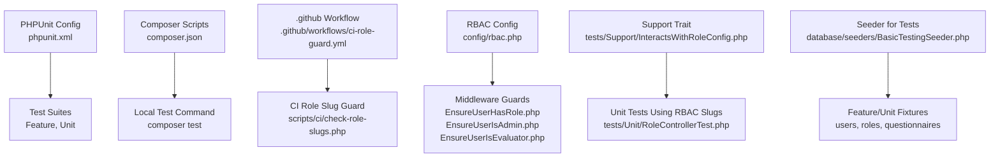
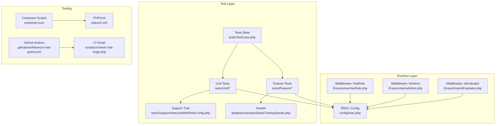
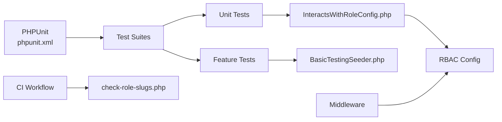
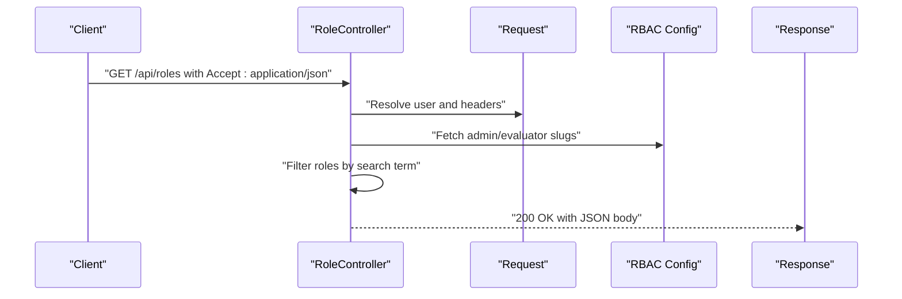

# Testing & Quality Assurance

<cite>
**Referenced Files in This Document**
- [phpunit.xml](file://phpunit.xml)
- [composer.json](file://composer.json)
- [.github/workflows/ci-role-guard.yml](file://.github/workflows/ci-role-guard.yml)
- [config/rbac.php](file://config/rbac.php)
- [config/features.php](file://config/features.php)
- [tests/TestCase.php](file://tests/TestCase.php)
- [tests/Feature/ExampleTest.php](file://tests/Feature/ExampleTest.php)
- [tests/Unit/ExampleTest.php](file://tests/Unit/ExampleTest.php)
- [tests/Unit/RoleControllerTest.php](file://tests/Unit/RoleControllerTest.php)
- [tests/Support/InteractsWithRoleConfig.php](file://tests/Support/InteractsWithRoleConfig.php)
- [database/seeders/BasicTestingSeeder.php](file://database/seeders/BasicTestingSeeder.php)
- [app/Http/Middleware/EnsureUserHasRole.php](file://app/Http/Middleware/EnsureUserHasRole.php)
- [app/Http/Middleware/EnsureUserIsAdmin.php](file://app/Http/Middleware/EnsureUserIsAdmin.php)
- [app/Http/Middleware/EnsureUserIsEvaluator.php](file://app/Http/Middleware/EnsureUserIsEvaluator.php)
- [scripts/ci/check-role-slugs.php](file://scripts/ci/check-role-slugs.php)
</cite>

## Table of Contents
1. [Introduction](#introduction)
2. [Project Structure](#project-structure)
3. [Core Components](#core-components)
4. [Architecture Overview](#architecture-overview)
5. [Detailed Component Analysis](#detailed-component-analysis)
6. [Dependency Analysis](#dependency-analysis)
7. [Performance Considerations](#performance-considerations)
8. [Troubleshooting Guide](#troubleshooting-guide)
9. [Conclusion](#conclusion)
10. [Appendices](#appendices)

## Introduction
This document describes the testing strategy, configuration, and continuous integration setup for the assessment platform. It covers PHPUnit configuration, test suites, middleware role guard testing, service-level unit tests, admin feature tests, mocking strategies, code coverage practices, automated workflows, and debugging techniques for test failures. The goal is to provide a clear, actionable guide for maintaining high-quality, reliable tests across the system.

## Project Structure
The testing infrastructure is organized into:
- PHPUnit configuration defines test suites, environment variables, and source inclusion.
- Composer scripts orchestrate local and CI test execution.
- GitHub Actions enforces role slug consistency via a dedicated CI job.
- Test suites include Feature and Unit categories with support traits and shared helpers.
- RBAC configuration centralizes role slugs and aliases used by middleware and tests.

**Diagram sources**
- [phpunit.xml:1-37](file://phpunit.xml#L1-L37)
- [composer.json:49-58](file://composer.json#L49-L58)
- [.github/workflows/ci-role-guard.yml:1-38](file://.github/workflows/ci-role-guard.yml#L1-L38)
- [config/rbac.php:1-64](file://config/rbac.php#L1-L64)
- [app/Http/Middleware/EnsureUserHasRole.php:1-28](file://app/Http/Middleware/EnsureUserHasRole.php#L1-L28)
- [app/Http/Middleware/EnsureUserIsAdmin.php:1-23](file://app/Http/Middleware/EnsureUserIsAdmin.php#L1-L23)
- [app/Http/Middleware/EnsureUserIsEvaluator.php:1-23](file://app/Http/Middleware/EnsureUserIsEvaluator.php#L1-L23)
- [tests/Support/InteractsWithRoleConfig.php:1-36](file://tests/Support/InteractsWithRoleConfig.php#L1-L36)
- [tests/Unit/RoleControllerTest.php:1-46](file://tests/Unit/RoleControllerTest.php#L1-L46)
- [database/seeders/BasicTestingSeeder.php:1-106](file://database/seeders/BasicTestingSeeder.php#L1-L106)

**Section sources**
- [phpunit.xml:1-37](file://phpunit.xml#L1-L37)
- [composer.json:49-58](file://composer.json#L49-L58)
- [.github/workflows/ci-role-guard.yml:1-38](file://.github/workflows/ci-role-guard.yml#L1-L38)
- [config/rbac.php:1-64](file://config/rbac.php#L1-L64)

## Core Components
- PHPUnit configuration
  - Defines two test suites: Unit and Feature.
  - Sets environment variables optimized for testing (in-memory SQLite, array caches, sync queues, etc.).
  - Includes the application source directory for coverage reporting.
  - Section sources
    - [phpunit.xml:7-19](file://phpunit.xml#L7-L19)
    - [phpunit.xml:20-35](file://phpunit.xml#L20-L35)

- Composer scripts
  - Provides a unified test command that clears config cache and invokes Artisan’s test runner.
  - Section sources
    - [composer.json:49-52](file://composer.json#L49-L52)

- GitHub Actions CI guard
  - Runs on pushes and pull requests.
  - Installs dependencies and executes a guard script to validate role slugs.
  - Section sources
    - [.github/workflows/ci-role-guard.yml:1-38](file://.github/workflows/ci-role-guard.yml#L1-L38)

- RBAC configuration
  - Centralizes role slugs, aliases, dashboard paths, and middleware aliases.
  - Used by middleware and tests to enforce role-based access.
  - Section sources
    - [config/rbac.php:1-64](file://config/rbac.php#L1-L64)

- Support trait for role configuration
  - Provides helper methods to fetch admin and evaluator slugs and target groups from RBAC config.
  - Section sources
    - [tests/Support/InteractsWithRoleConfig.php:1-36](file://tests/Support/InteractsWithRoleConfig.php#L1-L36)

- Test base class
  - Extends the framework’s base test case for shared behavior.
  - Section sources
    - [tests/TestCase.php:1-11](file://tests/TestCase.php#L1-L11)

- Example tests
  - Demonstrates a simple Feature test and a basic Unit test.
  - Section sources
    - [tests/Feature/ExampleTest.php:1-20](file://tests/Feature/ExampleTest.php#L1-L20)
    - [tests/Unit/ExampleTest.php:1-17](file://tests/Unit/ExampleTest.php#L1-L17)

- Role controller unit test
  - Exercises an API endpoint with JSON expectations, factory-generated users, and assertions on response status and content.
  - Section sources
    - [tests/Unit/RoleControllerTest.php:1-46](file://tests/Unit/RoleControllerTest.php#L1-L46)

- Seeder for testing
  - Seeds roles, departments, users, questionnaires, and answer options using RBAC slugs.
  - Section sources
    - [database/seeders/BasicTestingSeeder.php:1-106](file://database/seeders/BasicTestingSeeder.php#L1-L106)

## Architecture Overview
The testing architecture integrates configuration-driven role checks, middleware enforcement, and test fixtures to validate access control and service behavior.

**Diagram sources**
- [tests/TestCase.php:1-11](file://tests/TestCase.php#L1-L11)
- [tests/Feature/ExampleTest.php:1-20](file://tests/Feature/ExampleTest.php#L1-L20)
- [tests/Unit/ExampleTest.php:1-17](file://tests/Unit/ExampleTest.php#L1-L17)
- [tests/Support/InteractsWithRoleConfig.php:1-36](file://tests/Support/InteractsWithRoleConfig.php#L1-L36)
- [database/seeders/BasicTestingSeeder.php:1-106](file://database/seeders/BasicTestingSeeder.php#L1-L106)
- [app/Http/Middleware/EnsureUserHasRole.php:1-28](file://app/Http/Middleware/EnsureUserHasRole.php#L1-L28)
- [app/Http/Middleware/EnsureUserIsAdmin.php:1-23](file://app/Http/Middleware/EnsureUserIsAdmin.php#L1-L23)
- [app/Http/Middleware/EnsureUserIsEvaluator.php:1-23](file://app/Http/Middleware/EnsureUserIsEvaluator.php#L1-L23)
- [config/rbac.php:1-64](file://config/rbac.php#L1-L64)
- [phpunit.xml:1-37](file://phpunit.xml#L1-L37)
- [composer.json:49-58](file://composer.json#L49-L58)
- [.github/workflows/ci-role-guard.yml:1-38](file://.github/workflows/ci-role-guard.yml#L1-L38)
- [scripts/ci/check-role-slugs.php:1-200](file://scripts/ci/check-role-slugs.php#L1-L200)

## Detailed Component Analysis

### PHPUnit Configuration and Coverage
- Test suites
  - Two top-level suites: Unit and Feature.
- Environment
  - Uses an in-memory SQLite database for speed and isolation.
  - Disables background services (cache, queue, mail, session) to keep tests deterministic.
- Source inclusion
  - Includes the app directory for coverage reporting.
- Recommendations
  - Add a coverage threshold policy in CI to enforce minimum coverage.
  - Consider enabling Xdebug or PCOV for coverage collection depending on runtime needs.
- Section sources
  - [phpunit.xml:7-19](file://phpunit.xml#L7-L19)
  - [phpunit.xml:20-35](file://phpunit.xml#L20-L35)

### Composer Scripts for Local and CI Execution
- Local test command
  - Clears config cache and runs Artisan test to ensure a clean environment.
- CI guard
  - A dedicated script validates role slugs against RBAC configuration to prevent misconfiguration.
- Section sources
  - [composer.json:49-58](file://composer.json#L49-L58)

### GitHub Actions CI Role Slug Guard
- Triggers on push and pull request.
- Installs PHP 8.3, caches Composer dependencies, installs dependencies, and runs the guard script.
- Section sources
  - [.github/workflows/ci-role-guard.yml:1-38](file://.github/workflows/ci-role-guard.yml#L1-L38)

### RBAC-Driven Middleware Testing
- Middleware components
  - EnsureUserHasRole: Enforces one or more role slugs; allows bypass when no slugs are provided.
  - EnsureUserIsAdmin: Restricts access to admin roles.
  - EnsureUserIsEvaluator: Restricts access to evaluator roles.
- Test strategy
  - Use factories and seeders to create users with specific role slugs.
  - Assert HTTP responses and exceptions thrown by middleware.
  - Validate redirects and dashboard paths configured in RBAC.
- Section sources
  - [app/Http/Middleware/EnsureUserHasRole.php:1-28](file://app/Http/Middleware/EnsureUserHasRole.php#L1-L28)
  - [app/Http/Middleware/EnsureUserIsAdmin.php:1-23](file://app/Http/Middleware/EnsureUserIsAdmin.php#L1-L23)
  - [app/Http/Middleware/EnsureUserIsEvaluator.php:1-23](file://app/Http/Middleware/EnsureUserIsEvaluator.php#L1-L23)
  - [config/rbac.php:1-64](file://config/rbac.php#L1-L64)

### Role Guard Testing with Support Trait
- InteractsWithRoleConfig
  - Provides typed helpers to fetch admin, teacher, staff, parent slugs, and normalized target groups from RBAC.
- Unit test example
  - RoleControllerTest demonstrates constructing a request with JSON Accept header, resolving a user, and asserting response status and content.
- Section sources
  - [tests/Support/InteractsWithRoleConfig.php:1-36](file://tests/Support/InteractsWithRoleConfig.php#L1-L36)
  - [tests/Unit/RoleControllerTest.php:1-46](file://tests/Unit/RoleControllerTest.php#L1-L46)

### Feature Tests for Admin Functionality
- Example pattern
  - Use the base Feature test class to assert successful responses for public pages.
- Recommended additions
  - Admin-only endpoints guarded by EnsureUserIsAdmin.
  - Assertions for redirects and forbidden responses when unauthenticated or unauthorized.
  - Use factories and seeders to provision admin users and related resources.
- Section sources
  - [tests/Feature/ExampleTest.php:1-20](file://tests/Feature/ExampleTest.php#L1-L20)
  - [database/seeders/BasicTestingSeeder.php:1-106](file://database/seeders/BasicTestingSeeder.php#L1-L106)

### Unit Tests for Services
- Scope
  - Independent of HTTP requests and database state when possible.
- Strategies
  - Mock external dependencies (e.g., HTTP clients, storage) using framework or library mocks.
  - Use dependency injection to replace collaborators with fakes during tests.
  - Validate return values, exceptions, and side effects.
- Coverage
  - Focus on branch coverage for conditionals and method coverage for critical logic paths.
- Section sources
  - [composer.json:20-22](file://composer.json#L20-L22)

### Mocking Strategies
- Factories and seeders
  - Use model factories and seeders to construct realistic test data.
- Request mocking
  - Build requests programmatically and set headers (e.g., Accept: application/json) to simulate API consumers.
- User resolution
  - Resolve a request’s user to a specific role for middleware testing.
- Section sources
  - [tests/Unit/RoleControllerTest.php:18-44](file://tests/Unit/RoleControllerTest.php#L18-L44)
  - [database/seeders/BasicTestingSeeder.php:1-106](file://database/seeders/BasicTestingSeeder.php#L1-L106)

### Quality Assurance Practices
- Test naming
  - Use descriptive names indicating scenario, action, and expected outcome.
- Assertions
  - Prefer explicit assertions (status codes, content presence) over implicit checks.
- Determinism
  - Keep environment variables constant; rely on in-memory database and array caches.
- Isolation
  - Use RefreshDatabase for tests requiring database resets.
- Section sources
  - [phpunit.xml:20-35](file://phpunit.xml#L20-L35)

## Dependency Analysis
The testing stack depends on configuration-driven middleware and centralized RBAC settings.

**Diagram sources**
- [phpunit.xml:1-37](file://phpunit.xml#L1-L37)
- [tests/Support/InteractsWithRoleConfig.php:1-36](file://tests/Support/InteractsWithRoleConfig.php#L1-L36)
- [database/seeders/BasicTestingSeeder.php:1-106](file://database/seeders/BasicTestingSeeder.php#L1-L106)
- [config/rbac.php:1-64](file://config/rbac.php#L1-L64)
- [app/Http/Middleware/EnsureUserHasRole.php:1-28](file://app/Http/Middleware/EnsureUserHasRole.php#L1-L28)
- [.github/workflows/ci-role-guard.yml:1-38](file://.github/workflows/ci-role-guard.yml#L1-L38)
- [scripts/ci/check-role-slugs.php:1-200](file://scripts/ci/check-role-slugs.php#L1-L200)

**Section sources**
- [composer.json:49-58](file://composer.json#L49-L58)
- [config/rbac.php:1-64](file://config/rbac.php#L1-L64)

## Performance Considerations
- Database
  - In-memory SQLite reduces I/O overhead; use transactions or refresh database per test as needed.
- Caching and queues
  - Array stores and sync queues minimize external dependencies and improve reliability.
- Coverage
  - Enable coverage only when necessary to reduce CI time; exclude generated or third-party code.
- Section sources
- [phpunit.xml:25-31](file://phpunit.xml#L25-L31)

## Troubleshooting Guide
- Unauthorized or forbidden responses
  - Verify the user’s role slug matches the middleware’s expected slugs.
  - Confirm RBAC configuration and middleware aliases.
- Role slug mismatches
  - Run the CI guard locally via the Composer script to validate slugs.
- Slow tests
  - Reduce database resets; reuse seeded data where appropriate; avoid unnecessary factories.
- Debugging test failures
  - Add targeted dump/assert statements; inspect request attributes and user resolver bindings.
  - Increase verbosity with PHPUnit flags to capture more context.
- Section sources
  - [composer.json:53-58](file://composer.json#L53-L58)
  - [.github/workflows/ci-role-guard.yml:36-37](file://.github/workflows/ci-role-guard.yml#L36-L37)
  - [config/rbac.php:1-64](file://config/rbac.php#L1-L64)

## Conclusion
The assessment platform employs a robust testing foundation centered on PHPUnit, configuration-driven RBAC, and CI guard enforcement. By leveraging factories, seeders, and middleware tests, teams can confidently validate admin and evaluator access controls. Extending unit tests for services, enforcing coverage policies, and refining CI workflows will further strengthen quality assurance.

## Appendices

### Test Case Examples and Patterns
- Feature test pattern
  - Reference: [tests/Feature/ExampleTest.php:13-18](file://tests/Feature/ExampleTest.php#L13-L18)
- Unit test with request mocking
  - Reference: [tests/Unit/RoleControllerTest.php:36-44](file://tests/Unit/RoleControllerTest.php#L36-L44)
- Role configuration helpers
  - Reference: [tests/Support/InteractsWithRoleConfig.php:7-33](file://tests/Support/InteractsWithRoleConfig.php#L7-L33)

### Middleware Call Flow (Sequence)

**Diagram sources**
- [tests/Unit/RoleControllerTest.php:18-44](file://tests/Unit/RoleControllerTest.php#L18-L44)
- [tests/Support/InteractsWithRoleConfig.php:7-33](file://tests/Support/InteractsWithRoleConfig.php#L7-L33)
- [config/rbac.php:1-64](file://config/rbac.php#L1-L64)